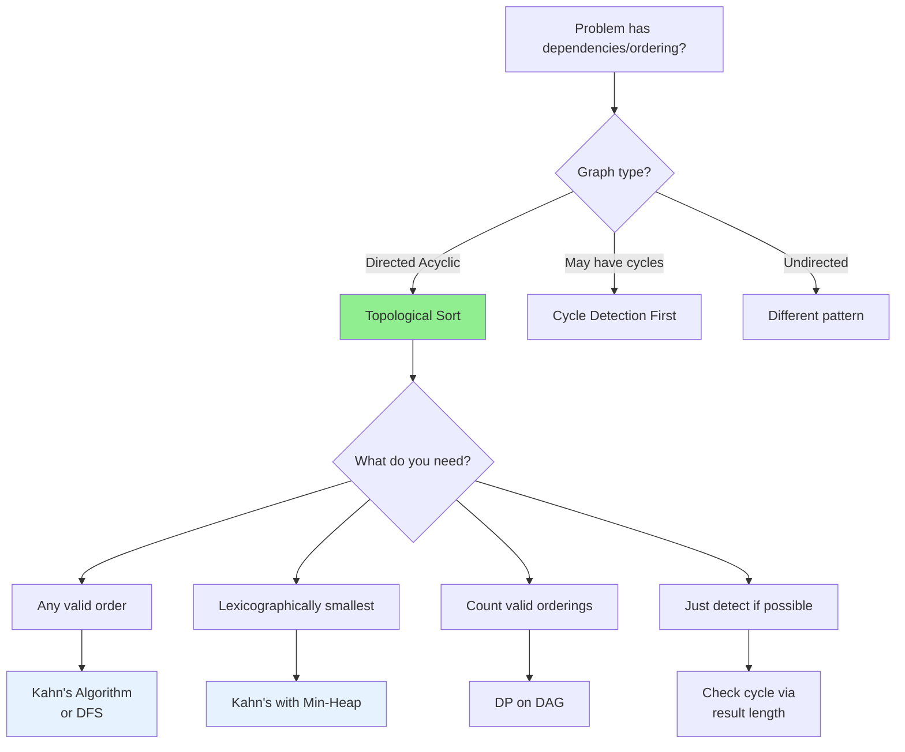

# Topological Sort Pattern

## Quick Reference Card

| Aspect | Details |
|--------|---------|
| **Key Signal** | Dependencies, prerequisites, ordering constraints |
| **Time Complexity** | O(V + E) - visits each vertex and edge once |
| **Space Complexity** | O(V) for queue/stack and result |
| **Common Variants** | Kahn's (BFS), DFS-based, cycle detection |

## Mental Model

**Analogy:** Imagine getting dressed in the morning. You must put on underwear before pants, socks before shoes, but shirt and pants have no order between them. Topological sort finds ANY valid order that respects all "must come before" relationships.

**First Principle:** A Directed Acyclic Graph (DAG) has at least one vertex with no incoming edges (indegree 0). This vertex can be "first" in the ordering. Remove it, and the remaining graph is also a DAG with its own "first" vertex. Repeat until empty.

## Pattern Decision Tree



## Overview

Topological sorting arranges vertices of a Directed Acyclic Graph (DAG) in a linear order such that for every directed edge (u → v), vertex u comes before vertex v.

**Core Insight:** A DAG always has at least one vertex with indegree 0 (no prerequisites). Process these first, then their successors become "available."

**Key Properties:**
- Only works on DAGs (no cycles)
- Multiple valid orderings may exist
- If ordering is impossible, graph has a cycle

**Two Main Approaches:**
1. **Kahn's Algorithm (BFS)**: Process nodes with indegree 0
2. **DFS-Based**: Post-order traversal, then reverse

## When to Use

Look for these signals:

1. **Dependencies**: "Must complete X before Y"
2. **Prerequisites**: "Course A requires course B"
3. **Build order**: "Compile files in dependency order"
4. **Scheduling**: "Tasks with constraints"
5. **Ordering**: "Find a valid sequence"

**Key phrases:**
- "Course schedule with prerequisites"
- "Build order for packages"
- "Is it possible to finish all tasks?"
- "Order the nodes such that..."
- "Find a valid ordering"

## Template Code

### Kahn's Algorithm (BFS-Based)

```python
from collections import deque, defaultdict

def topological_sort_kahn(num_nodes, edges):
    """
    Kahn's Algorithm using BFS.
    edges: list of (prerequisite, dependent) tuples

    Time: O(V + E), Space: O(V)
    """
    # Build adjacency list and calculate indegrees
    graph = defaultdict(list)
    indegree = [0] * num_nodes

    for prereq, dependent in edges:
        graph[prereq].append(dependent)
        indegree[dependent] += 1

    # Initialize queue with nodes having indegree 0
    queue = deque()
    for node in range(num_nodes):
        if indegree[node] == 0:
            queue.append(node)

    result = []

    while queue:
        node = queue.popleft()
        result.append(node)

        # Reduce indegree of neighbors
        for neighbor in graph[node]:
            indegree[neighbor] -= 1
            if indegree[neighbor] == 0:
                queue.append(neighbor)

    # Check if all nodes were processed (no cycle)
    if len(result) != num_nodes:
        return []  # Cycle detected, no valid ordering

    return result

# Example: num_nodes=4, edges=[(1,0), (2,0), (3,1), (3,2)]
# Graph: 1 → 0, 2 → 0, 3 → 1, 3 → 2
# Indegree: [2, 1, 1, 0]
# Start with node 3 (indegree 0)
# Result: [3, 1, 2, 0] or [3, 2, 1, 0]
```

### DFS-Based Topological Sort

```python
def topological_sort_dfs(num_nodes, edges):
    """
    DFS-based topological sort.
    Uses post-order traversal then reverses.

    Time: O(V + E), Space: O(V)
    """
    graph = defaultdict(list)
    for prereq, dependent in edges:
        graph[prereq].append(dependent)

    # States: 0 = unvisited, 1 = visiting, 2 = visited
    state = [0] * num_nodes
    result = []
    has_cycle = False

    def dfs(node):
        nonlocal has_cycle
        if has_cycle:
            return

        state[node] = 1  # Mark as visiting

        for neighbor in graph[node]:
            if state[neighbor] == 1:
                # Back edge: cycle detected
                has_cycle = True
                return
            if state[neighbor] == 0:
                dfs(neighbor)

        state[node] = 2  # Mark as visited
        result.append(node)  # Post-order

    for node in range(num_nodes):
        if state[node] == 0:
            dfs(node)
            if has_cycle:
                return []

    return result[::-1]  # Reverse post-order
```

### Lexicographically Smallest Order

```python
import heapq
from collections import defaultdict

def topological_sort_lexical(num_nodes, edges):
    """
    Find lexicographically smallest topological order.
    Use min-heap instead of queue.

    Time: O((V + E) log V), Space: O(V)
    """
    graph = defaultdict(list)
    indegree = [0] * num_nodes

    for prereq, dependent in edges:
        graph[prereq].append(dependent)
        indegree[dependent] += 1

    # Min-heap for smallest available node
    heap = []
    for node in range(num_nodes):
        if indegree[node] == 0:
            heapq.heappush(heap, node)

    result = []

    while heap:
        node = heapq.heappop(heap)  # Always pick smallest
        result.append(node)

        for neighbor in graph[node]:
            indegree[neighbor] -= 1
            if indegree[neighbor] == 0:
                heapq.heappush(heap, neighbor)

    return result if len(result) == num_nodes else []
```

## Worked Example

### Problem: Course Schedule II

**Given:** `numCourses = 4`, `prerequisites = [[1,0], [2,0], [3,1], [3,2]]`
- Course 1 requires course 0
- Course 2 requires course 0
- Course 3 requires courses 1 and 2

**Find:** Valid order to take all courses

```
Step 1: Build graph and calculate indegrees
        Graph: 0 → [1,2], 1 → [3], 2 → [3]
        Indegree: [0, 1, 1, 2]

Step 2: Initialize queue with indegree 0
        Queue: [0]

Step 3: Process queue
        Pop 0, result=[0]
        Reduce indegree of 1,2: [0,0,0,2]
        Push 1,2 to queue: [1,2]

        Pop 1, result=[0,1]
        Reduce indegree of 3: [0,0,0,1]

        Pop 2, result=[0,1,2]
        Reduce indegree of 3: [0,0,0,0]
        Push 3 to queue: [3]

        Pop 3, result=[0,1,2,3]

Step 4: len(result)=4 == numCourses ✓
        Valid order: [0, 1, 2, 3]
```

**Visual representation:**

```
Dependency Graph:
    0
   / \
  ↓   ↓
  1   2
   \ /
    ↓
    3

Topological Order: 0 → 1 → 2 → 3
(or 0 → 2 → 1 → 3, both valid)
```

## Example Problems with Approaches

### Problem 1: Course Schedule (Can Finish All?)
**Problem:** Determine if it's possible to finish all courses.

```python
def can_finish(num_courses, prerequisites):
    """
    Check if valid ordering exists (no cycle).
    Time: O(V + E), Space: O(V)
    """
    graph = defaultdict(list)
    indegree = [0] * num_courses

    for course, prereq in prerequisites:
        graph[prereq].append(course)
        indegree[course] += 1

    queue = deque(i for i in range(num_courses) if indegree[i] == 0)
    count = 0

    while queue:
        node = queue.popleft()
        count += 1

        for neighbor in graph[node]:
            indegree[neighbor] -= 1
            if indegree[neighbor] == 0:
                queue.append(neighbor)

    return count == num_courses
```

**Key insight:** If we can process all nodes, no cycle exists.

### Problem 2: Course Schedule II (Find Order)
**Problem:** Return the order to take courses, or empty if impossible.

```python
def find_order(num_courses, prerequisites):
    """
    Return valid course order.
    """
    graph = defaultdict(list)
    indegree = [0] * num_courses

    for course, prereq in prerequisites:
        graph[prereq].append(course)
        indegree[course] += 1

    queue = deque(i for i in range(num_courses) if indegree[i] == 0)
    result = []

    while queue:
        node = queue.popleft()
        result.append(node)

        for neighbor in graph[node]:
            indegree[neighbor] -= 1
            if indegree[neighbor] == 0:
                queue.append(neighbor)

    return result if len(result) == num_courses else []
```

**Key insight:** Same as detection, but collect the order.

### Problem 3: Alien Dictionary
**Problem:** Given sorted alien words, deduce character order.

```python
def alien_order(words):
    """
    Derive character ordering from sorted alien words.
    Time: O(total chars), Space: O(unique chars)
    """
    # Build graph from adjacent word comparisons
    graph = defaultdict(set)
    indegree = {c: 0 for word in words for c in word}

    for i in range(len(words) - 1):
        w1, w2 = words[i], words[i + 1]
        min_len = min(len(w1), len(w2))

        # Check for invalid case: "abc" before "ab"
        if len(w1) > len(w2) and w1[:min_len] == w2[:min_len]:
            return ""

        for j in range(min_len):
            if w1[j] != w2[j]:
                # w1[j] comes before w2[j]
                if w2[j] not in graph[w1[j]]:
                    graph[w1[j]].add(w2[j])
                    indegree[w2[j]] += 1
                break

    # Topological sort
    queue = deque(c for c in indegree if indegree[c] == 0)
    result = []

    while queue:
        char = queue.popleft()
        result.append(char)

        for neighbor in graph[char]:
            indegree[neighbor] -= 1
            if indegree[neighbor] == 0:
                queue.append(neighbor)

    return "".join(result) if len(result) == len(indegree) else ""
```

**Key insight:** Compare adjacent words to find ordering constraints, then topological sort.

### Problem 4: Parallel Courses (Minimum Semesters)
**Problem:** Find minimum semesters to finish all courses with parallelism.

```python
def minimum_semesters(n, relations):
    """
    Find minimum semesters (levels in topological sort).
    This is the length of the longest path + 1.
    """
    graph = defaultdict(list)
    indegree = [0] * (n + 1)

    for prereq, course in relations:
        graph[prereq].append(course)
        indegree[course] += 1

    queue = deque()
    for i in range(1, n + 1):
        if indegree[i] == 0:
            queue.append(i)

    semesters = 0
    courses_taken = 0

    while queue:
        semesters += 1
        size = len(queue)

        for _ in range(size):  # Process entire level
            course = queue.popleft()
            courses_taken += 1

            for neighbor in graph[course]:
                indegree[neighbor] -= 1
                if indegree[neighbor] == 0:
                    queue.append(neighbor)

    return semesters if courses_taken == n else -1
```

**Key insight:** Process level by level; each level is one semester.

### Problem 5: Build Order (All Valid Orders)
**Problem:** Find all possible build orders.

```python
def all_build_orders(num_nodes, edges):
    """
    Generate all valid topological orderings.
    Uses backtracking.
    """
    graph = defaultdict(list)
    indegree = [0] * num_nodes

    for prereq, dependent in edges:
        graph[prereq].append(dependent)
        indegree[dependent] += 1

    result = []

    def backtrack(order, available):
        if len(order) == num_nodes:
            result.append(order[:])
            return

        for node in available:
            order.append(node)
            new_available = [n for n in available if n != node]

            # Add newly available nodes
            for neighbor in graph[node]:
                indegree[neighbor] -= 1
                if indegree[neighbor] == 0:
                    new_available.append(neighbor)

            backtrack(order, new_available)

            # Backtrack
            order.pop()
            for neighbor in graph[node]:
                indegree[neighbor] += 1

    initial = [i for i in range(num_nodes) if indegree[i] == 0]
    backtrack([], initial)

    return result
```

**Key insight:** Use backtracking to explore all valid choices at each step.

## Kahn's vs DFS Comparison

| Aspect | Kahn's (BFS) | DFS-Based |
|--------|-------------|-----------|
| **Approach** | Process indegree 0 first | Post-order then reverse |
| **Cycle Detection** | Check if all processed | Track visiting state |
| **Order** | Natural order | Reversed post-order |
| **Modifications** | Easy (use min-heap for lex order) | Harder |
| **Implementation** | Slightly more code | More elegant |
| **Memory** | Queue + indegree array | Recursion stack |

**Use Kahn's when:**
- Need lexicographically smallest order (use min-heap)
- Need level-by-level processing (parallel courses)
- Iterative solution preferred

**Use DFS when:**
- Familiar with recursion
- Already doing DFS for other reasons
- Don't need level information

## Common Pitfalls

### 1. Forgetting Cycle Check

```python
# WRONG: Assumes input is always DAG
return result

# CORRECT: Check if all nodes processed
if len(result) != num_nodes:
    return []  # Cycle exists
return result
```

### 2. Wrong Edge Direction

```python
# Prerequisites usually: [course, prereq]
# This means prereq → course

# WRONG: Edge direction reversed
graph[course].append(prereq)

# CORRECT: prereq must come before course
graph[prereq].append(course)
```

### 3. Not Handling Disconnected Components

```python
# WRONG: Only start DFS from node 0
dfs(0)

# CORRECT: Start from all unvisited nodes
for node in range(num_nodes):
    if not visited[node]:
        dfs(node)
```

### 4. DFS Cycle Detection Error

```python
# WRONG: Using boolean visited
if visited[neighbor]:
    # Is this a cycle or just revisit?

# CORRECT: Use three states
# 0 = unvisited, 1 = visiting (in current path), 2 = visited
if state[neighbor] == 1:  # Currently in recursion stack
    has_cycle = True
```

### 5. Indegree Initialization

```python
# WRONG: Only initialize nodes that appear in edges
for prereq, course in edges:
    indegree[course] += 1

# CORRECT: Initialize ALL nodes
indegree = [0] * num_nodes
for prereq, course in edges:
    indegree[course] += 1
# Now nodes with no edges have indegree 0
```

## Complexity Analysis

| Aspect | Complexity | Notes |
|--------|------------|-------|
| **Time** | O(V + E) | Visit each vertex and edge once |
| **Space** | O(V + E) | Adjacency list + result |
| **Queue/Stack** | O(V) | At most all vertices |

**For lexicographic order:** O((V + E) log V) due to heap operations.

## Practice Progression (Spaced Repetition)

**Day 1 (Learn):**
- Understand both Kahn's and DFS approaches
- Solve: Course Schedule, Course Schedule II

**Day 3 (Reinforce):**
- Implement Kahn's without looking at notes
- Solve: Parallel Courses

**Day 7 (Master):**
- Solve: Alien Dictionary
- Can you explain when to use min-heap for lexicographic order?

**Day 14 (Maintain):**
- Solve a new topological sort variant
- Practice cycle detection with DFS

## Related Patterns

| Pattern | When to Use Instead |
|---------|---------------------|
| **BFS** | Unweighted shortest path (no dependencies) |
| **DFS** | Just traversal, no ordering needed |
| **Union-Find** | Connected components, not ordering |
| **DP on DAG** | Shortest/longest path with weights |

## Practice Problems

| Problem | Difficulty | Key Insight |
|---------|------------|-------------|
| Course Schedule | Medium | Cycle detection |
| Course Schedule II | Medium | Return the order |
| Alien Dictionary | Hard | Build graph from word comparisons |
| Parallel Courses | Medium | Level-order processing |
| Longest Path in DAG | Medium | DP after topological sort |
| Build System | Medium | Classic dependency resolution |
| Sequence Reconstruction | Medium | Unique topological order |

## Summary

Topological Sort is essential for dependency-based ordering:

- **Only works on DAGs**: Must check for cycles
- **Two approaches**: Kahn's (BFS) or DFS-based
- **Key invariant**: Process nodes only when all dependencies met

**When to recognize:**
- "Prerequisites", "dependencies", "must come before"
- "Order tasks", "schedule courses", "build order"
- Problems involving DAGs

**Key insight:** At any point in a DAG, there exists at least one node with no unprocessed dependencies. Process these iteratively to build the topological order.

**Kahn's Algorithm Summary:**
1. Calculate indegrees
2. Start with indegree-0 nodes
3. Process and reduce neighbor indegrees
4. Add new indegree-0 nodes to queue
5. Check if all nodes processed (cycle detection)

Master this pattern to handle any dependency resolution or ordering constraint problem!
