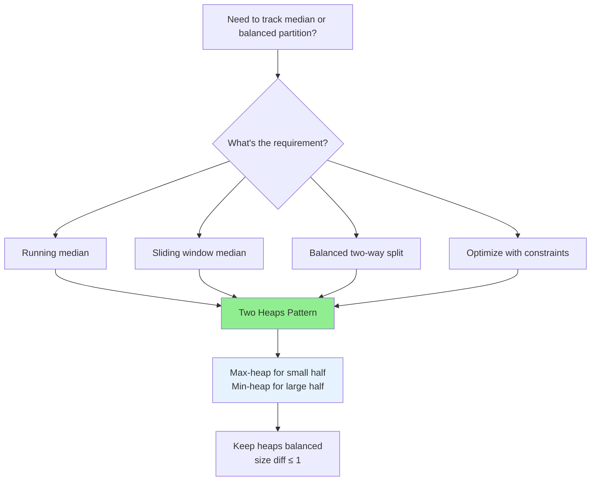

# Two Heaps Pattern

## Quick Reference Card

| Aspect | Details |
|--------|---------|
| **Key Signal** | Need median, balanced partition, or tracking extremes |
| **Time Complexity** | O(log n) per insert, O(1) for median |
| **Space Complexity** | O(n) for storing all elements |
| **Common Variants** | Median finder, sliding window median, IPO |

## Mental Model

**Analogy:** Imagine sorting a deck of cards by dividing them into two piles: a "small pile" and a "large pile". The small pile keeps the smallest half (you care about its maximum), and the large pile keeps the largest half (you care about its minimum). The median is always at the boundary between these piles.

**First Principle:** To find the median in O(1), we need quick access to the middle elements. By maintaining two heaps—a max-heap for the smaller half and a min-heap for the larger half—the median is always at one or both heap tops.

## Pattern Decision Tree



## Overview

The Two Heaps pattern uses two heaps simultaneously to efficiently find elements at a specific rank (typically the median). The key insight is:

- **Max-heap**: Stores the smaller half of numbers (we want the largest of small half)
- **Min-heap**: Stores the larger half of numbers (we want the smallest of large half)

This allows O(1) access to the median:
- If heaps are equal size: median = average of both tops
- If one heap is larger: median = top of the larger heap

**Core Invariants:**
1. All elements in max-heap ≤ all elements in min-heap
2. Size difference between heaps is at most 1

## When to Use

Look for these signals:

1. **Finding median**: "Find median of a stream", "median of window"
2. **Balanced partition**: Split elements into two balanced groups
3. **Tracking extremes**: Need both smallest of larger half AND largest of smaller half
4. **Sliding window + rank**: Median in a moving window

**Key phrases:**
- "Find the median"
- "Middle element of a stream"
- "Balance between two groups"
- "Maximize minimum profit"

## Template Code

### Basic Two Heaps Structure

```python
import heapq

class TwoHeaps:
    """
    Two Heaps for median finding.
    max_heap: smaller half (use negation for max-heap in Python)
    min_heap: larger half
    """
    def __init__(self):
        self.max_heap = []  # Smaller half (negate values)
        self.min_heap = []  # Larger half

    def add_num(self, num):
        """
        Add number and maintain balance.
        Time: O(log n)
        """
        # Always add to max_heap first
        heapq.heappush(self.max_heap, -num)

        # Balance: max of smaller half should <= min of larger half
        if (self.max_heap and self.min_heap and
            -self.max_heap[0] > self.min_heap[0]):
            val = -heapq.heappop(self.max_heap)
            heapq.heappush(self.min_heap, val)

        # Maintain size property: max_heap can have at most 1 more element
        if len(self.max_heap) > len(self.min_heap) + 1:
            val = -heapq.heappop(self.max_heap)
            heapq.heappush(self.min_heap, val)
        elif len(self.min_heap) > len(self.max_heap):
            val = heapq.heappop(self.min_heap)
            heapq.heappush(self.max_heap, -val)

    def find_median(self):
        """
        Return current median.
        Time: O(1)
        """
        if len(self.max_heap) > len(self.min_heap):
            return -self.max_heap[0]
        else:
            return (-self.max_heap[0] + self.min_heap[0]) / 2
```

### Alternative Balancing Strategy

```python
def add_num_alt(self, num):
    """
    Alternative: Always push to min_heap first, then balance.
    """
    # Add to appropriate heap
    if not self.max_heap or num <= -self.max_heap[0]:
        heapq.heappush(self.max_heap, -num)
    else:
        heapq.heappush(self.min_heap, num)

    # Rebalance if needed
    if len(self.max_heap) > len(self.min_heap) + 1:
        heapq.heappush(self.min_heap, -heapq.heappop(self.max_heap))
    elif len(self.min_heap) > len(self.max_heap):
        heapq.heappush(self.max_heap, -heapq.heappop(self.min_heap))
```

## Worked Example

### Problem: Find Median from Data Stream

**Stream:** `[2, 3, 4]`
**Find:** Median after each insertion

```
Step 1: Add 2
        max_heap = [-2], min_heap = []
        Sizes: 1, 0 (balanced, max_heap can have 1 more)
        Median = -(-2) = 2

Step 2: Add 3
        First, add to max_heap: max_heap = [-3, -2]
        Check: -(-3)=3 > nothing in min_heap (empty check fails)
        Rebalance: max_heap has 2, min_heap has 0 (diff > 1)
        Move: max_heap = [-2], min_heap = [3]
        Median = (-(-2) + 3) / 2 = 2.5

Step 3: Add 4
        Add to max_heap: max_heap = [-4, -2]
        Check: -(-4)=4 > 3? YES, move 4 to min_heap
        max_heap = [-2], min_heap = [3, 4]
        Rebalance: sizes are 1, 2 (diff = 1, but min_heap larger)
        Move: max_heap = [-3, -2], min_heap = [4]
        Wait, let me redo...

Actually, let me trace more carefully:

Step 1: Add 2
        max_heap = [-2], min_heap = []
        Median = 2

Step 2: Add 3
        Add 3: Since max_heap not empty and 3 > -(-2)=2
        Add to min_heap: max_heap = [-2], min_heap = [3]
        Sizes: 1, 1 (balanced)
        Median = (2 + 3) / 2 = 2.5

Step 3: Add 4
        Add 4: 4 > 2, add to min_heap
        max_heap = [-2], min_heap = [3, 4]
        Sizes: 1, 2 (min_heap larger, rebalance)
        Move 3 from min_heap to max_heap
        max_heap = [-3, -2], min_heap = [4]
        Sizes: 2, 1 (max_heap can be 1 larger)
        Median = -(-3) = 3
```

**Visual representation:**

```
After adding 2, 3, 4:

max_heap (smaller half):    min_heap (larger half):
        3                           4
       /
      2

Median = top of max_heap = 3
```

## Example Problems with Approaches

### Problem 1: Find Median from Data Stream
**Problem:** Design a data structure that supports adding numbers and finding median.

```python
import heapq

class MedianFinder:
    def __init__(self):
        self.small = []  # max-heap (negate)
        self.large = []  # min-heap

    def addNum(self, num: int) -> None:
        # Add to small (max-heap)
        heapq.heappush(self.small, -num)

        # Ensure small's max <= large's min
        if self.small and self.large and -self.small[0] > self.large[0]:
            val = -heapq.heappop(self.small)
            heapq.heappush(self.large, val)

        # Balance sizes
        if len(self.small) > len(self.large) + 1:
            val = -heapq.heappop(self.small)
            heapq.heappush(self.large, val)
        if len(self.large) > len(self.small):
            val = heapq.heappop(self.large)
            heapq.heappush(self.small, -val)

    def findMedian(self) -> float:
        if len(self.small) > len(self.large):
            return -self.small[0]
        return (-self.small[0] + self.large[0]) / 2.0
```

**Key insight:** Two heaps maintain partition; median is at boundary.

### Problem 2: Sliding Window Median
**Problem:** Find median of each window of size k.

```python
import heapq
from collections import defaultdict

def median_sliding_window(nums, k):
    """
    Find median for each sliding window of size k.
    Time: O(n log k), Space: O(k)
    """
    small = []  # max-heap (negate)
    large = []  # min-heap
    delayed = defaultdict(int)  # Lazy removal tracking
    result = []

    small_size = large_size = 0

    def prune(heap, is_max_heap):
        """Remove invalid elements from heap top."""
        while heap:
            val = -heap[0] if is_max_heap else heap[0]
            if delayed[val]:
                delayed[val] -= 1
                heapq.heappop(heap)
            else:
                break

    def rebalance():
        nonlocal small_size, large_size
        # small can have at most 1 more than large
        if small_size > large_size + 1:
            val = -heapq.heappop(small)
            heapq.heappush(large, val)
            small_size -= 1
            large_size += 1
            prune(small, True)
        elif large_size > small_size:
            val = heapq.heappop(large)
            heapq.heappush(small, -val)
            large_size -= 1
            small_size += 1
            prune(large, False)

    def add_num(num):
        nonlocal small_size, large_size
        if not small or num <= -small[0]:
            heapq.heappush(small, -num)
            small_size += 1
        else:
            heapq.heappush(large, num)
            large_size += 1
        rebalance()

    def remove_num(num):
        nonlocal small_size, large_size
        delayed[num] += 1
        if num <= -small[0]:
            small_size -= 1
        else:
            large_size -= 1
        rebalance()

    def get_median():
        if k % 2 == 1:
            return float(-small[0])
        return (-small[0] + large[0]) / 2.0

    # Initialize first window
    for i in range(k):
        add_num(nums[i])

    result.append(get_median())

    # Slide window
    for i in range(k, len(nums)):
        add_num(nums[i])
        remove_num(nums[i - k])
        prune(small, True)
        prune(large, False)
        result.append(get_median())

    return result
```

**Key insight:** Use lazy deletion with a delayed map; prune invalid elements when accessing heap tops.

### Problem 3: IPO (Maximize Capital)
**Problem:** You have initial capital W. Choose at most k projects to maximize capital. Each project has profit and required capital.

```python
import heapq

def find_maximized_capital(k, w, profits, capital):
    """
    Choose k projects to maximize capital.
    Time: O(n log n + k log n), Space: O(n)
    """
    n = len(profits)

    # Max-heap of profits for affordable projects
    available = []

    # Min-heap of (capital_required, profit, index) for unaffordable projects
    unavailable = [(capital[i], profits[i]) for i in range(n)]
    heapq.heapify(unavailable)

    for _ in range(k):
        # Move all affordable projects to available heap
        while unavailable and unavailable[0][0] <= w:
            cap, prof = heapq.heappop(unavailable)
            heapq.heappush(available, -prof)  # max-heap

        if not available:
            break  # No affordable projects

        # Take best available project
        w += -heapq.heappop(available)

    return w
```

**Key insight:** Two heaps - one for available projects (by profit), one for unavailable (by capital requirement). As capital increases, move projects from unavailable to available.

### Problem 4: Maximize Sum of Array After K Negations
**Problem:** Negate k elements to maximize array sum.

```python
import heapq

def largest_sum_after_k_negations(nums, k):
    """
    Maximize sum by negating k elements.
    Uses min-heap to always negate smallest element.
    """
    heapq.heapify(nums)

    for _ in range(k):
        smallest = heapq.heappop(nums)
        heapq.heappush(nums, -smallest)

    return sum(nums)
```

**Note:** This uses a single heap but demonstrates the pattern of tracking extremes.

## Heap Operations in Python

```python
import heapq

# Min-heap operations
heapq.heappush(heap, val)      # Add element
heapq.heappop(heap)            # Remove and return smallest
heap[0]                         # Peek smallest

# Max-heap workaround (negate values)
heapq.heappush(heap, -val)     # Add (negated)
-heapq.heappop(heap)           # Remove and return largest (negate back)
-heap[0]                        # Peek largest (negate back)

# Build heap from list
heapq.heapify(list)            # O(n) - transforms list in-place
```

## Common Pitfalls

### 1. Forgetting to Negate for Max-Heap

```python
# WRONG: Python only has min-heap
max_heap.append(val)  # This is just a list!

# CORRECT: Negate values for max-heap behavior
heapq.heappush(max_heap, -val)
max_val = -heapq.heappop(max_heap)
```

### 2. Incorrect Balancing Logic

```python
# WRONG: Not maintaining size invariant
if len(small) > len(large):
    move element

# CORRECT: Allow small to have at most 1 more
if len(small) > len(large) + 1:
    move from small to large
elif len(large) > len(small):
    move from large to small
```

### 3. Not Ensuring Ordering Invariant

```python
# WRONG: Just balance sizes
def add(num):
    heapq.heappush(small if len(small) <= len(large) else large, num)

# CORRECT: Ensure max(small) <= min(large)
def add(num):
    heapq.heappush(small, -num)
    if small and large and -small[0] > large[0]:
        heapq.heappush(large, -heapq.heappop(small))
    # Then balance sizes
```

### 4. Sliding Window Without Lazy Deletion

```python
# WRONG: Trying to remove directly from heap
heap.remove(val)  # O(n) and breaks heap property!

# CORRECT: Use lazy deletion with tracking
delayed[val] += 1  # Mark for deletion
# Prune when accessing top
while heap and delayed[heap[0]]:
    delayed[heapq.heappop(heap)] -= 1
```

### 5. Integer Division for Median

```python
# WRONG: Integer division
median = (a + b) // 2  # Loses precision

# CORRECT: Float division
median = (a + b) / 2.0
# Or for integers only: return a if odd count
```

## Complexity Analysis

| Operation | Time | Notes |
|-----------|------|-------|
| **Add number** | O(log n) | Heap push + potential rebalance |
| **Find median** | O(1) | Just peek at heap tops |
| **Remove (lazy)** | O(log n) amortized | Actual removal deferred |
| **Space** | O(n) | Store all n elements |

## Practice Progression (Spaced Repetition)

**Day 1 (Learn):**
- Read this guide thoroughly
- Solve: Find Median from Data Stream

**Day 3 (Reinforce):**
- Implement without looking at template
- Draw the two heaps for sample input

**Day 7 (Master):**
- Solve: Sliding Window Median
- Solve: IPO

**Day 14 (Maintain):**
- Solve a new problem using two heaps
- Can you explain when to use this pattern vs. other approaches?

## Related Patterns

| Pattern | When to Use Instead |
|---------|---------------------|
| **Single Heap (Top K)** | Only need kth largest/smallest, not median |
| **Sorted Container** | Need O(log n) insert and O(1) arbitrary index access |
| **Quickselect** | One-time median finding (no stream) |
| **Segment Tree** | Range queries with updates |

## Practice Problems

| Problem | Difficulty | Key Insight |
|---------|------------|-------------|
| Find Median from Data Stream | Hard | Classic two heaps |
| Sliding Window Median | Hard | Lazy deletion required |
| IPO | Hard | Available/unavailable heaps |
| Balance a BST | Medium | Can use two heaps for reconstruction |
| Kth Largest Element in Stream | Easy | Single heap variant |

## Summary

The Two Heaps pattern efficiently solves median and partition problems:

- **Structure:** Max-heap for smaller half, min-heap for larger half
- **Invariants:** max(small) ≤ min(large), sizes differ by at most 1
- **Median access:** O(1) from heap tops
- **Insert:** O(log n) for heap operations

**When to recognize:**
- "Find median" in streaming or window context
- Need to partition elements while tracking boundary values
- Balanced split with quick access to extremes

**Key insight:** By maintaining two heaps at the partition boundary, we always have the middle element(s) at the heap tops, enabling O(1) median access.

This pattern is essential for streaming algorithms and real-time median tracking!
