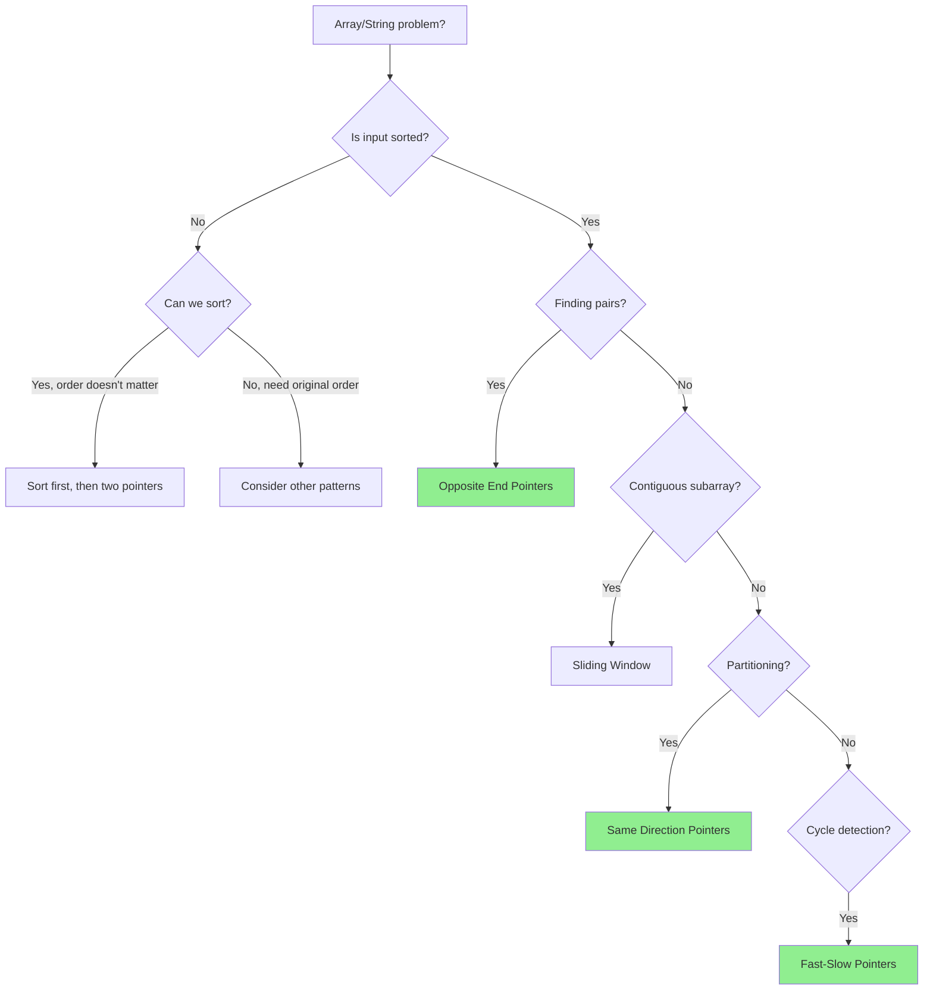
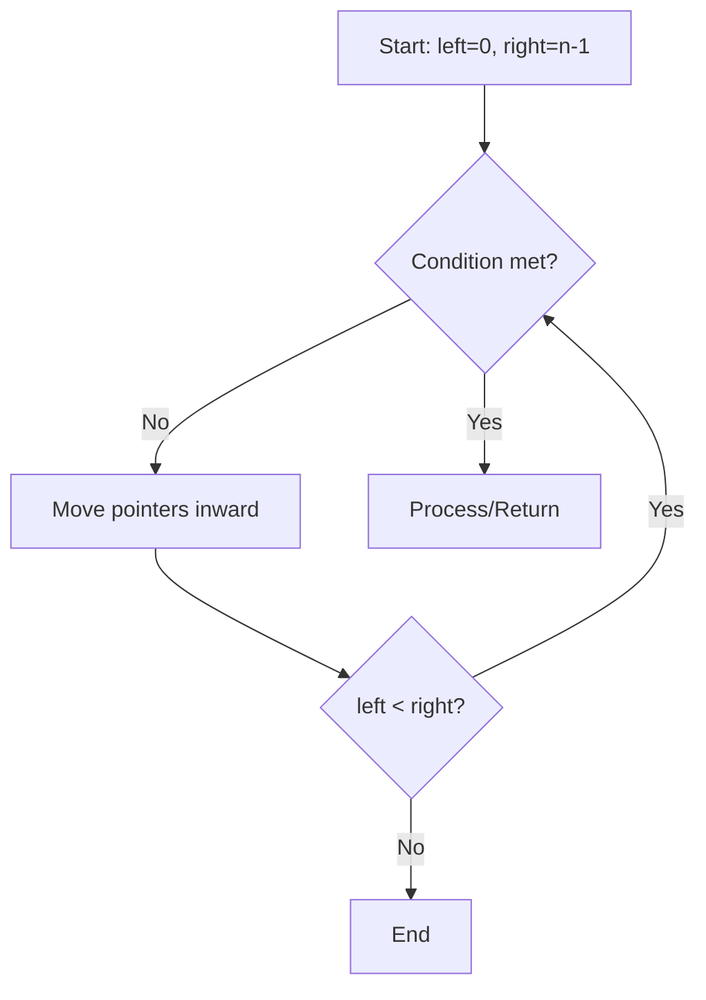
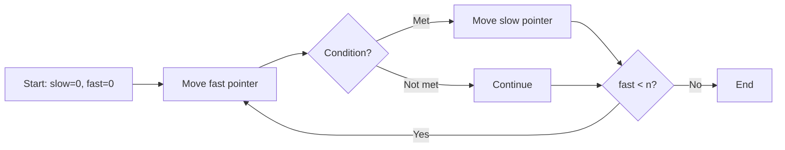
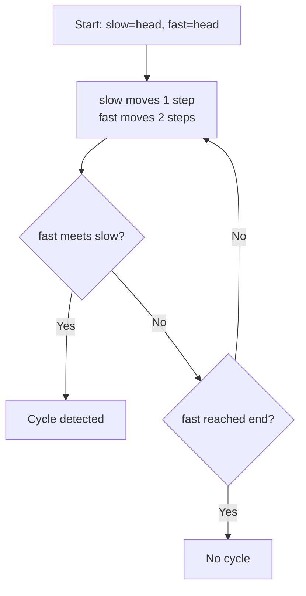

# Two Pointers Pattern

## Quick Reference Card

| Aspect | Details |
|--------|---------|
| **Key Signal** | Sorted array, find pair/triplet, palindrome check |
| **Time Complexity** | O(n) - single pass with two pointers |
| **Space Complexity** | O(1) - constant extra space |
| **Common Variants** | Opposite ends, same direction, fast-slow |

## Mental Model

**Analogy:** Imagine two fingers on a ruler. For finding a pair summing to target in a sorted list, place fingers at both ends. If sum is too small, move left finger right. If too large, move right finger left. The sorted order guarantees you won't miss the answer.

**First Principle:** In a sorted array, if current sum is less than target, increasing the left value (moving left pointer right) is the only way to increase the sum. This monotonicity allows eliminating half the search space with each comparison.

## Pattern Decision Tree



## Overview

The two pointers pattern uses two index variables to traverse a data structure, typically an array or string. By moving these pointers intelligently, we can solve problems in O(n) time that might otherwise require O(n²) with nested loops.

## When to Use Two Pointers

Look for these signals:
- **Sorted arrays**: Finding pairs, triplets, or removing duplicates
- **Palindrome checking**: Comparing characters from both ends
- **Array partitioning**: Separating elements by condition
- **Merging sorted arrays**: Combining two sorted sequences
- **Linked list problems**: Finding cycles or middle elements

## Types of Two Pointers

### 1. Opposite Ends (Convergent)
Pointers start at both ends and move toward each other.



**Use cases**: Palindromes, two sum in sorted array, container with most water

### 2. Same Direction (Parallel)
Both pointers move forward, often at different speeds.



**Use cases**: Remove duplicates, partition array, merging sequences

### 3. Fast-Slow (Floyd's Cycle Detection)
One pointer moves faster than the other.



**Use cases**: Linked list cycle detection, finding middle element

## Template Code

### Opposite Ends Pattern

```python
def two_pointers_opposite(arr):
    """
    Template for opposite-end two pointers
    Time: O(n), Space: O(1)
    """
    left = 0
    right = len(arr) - 1

    while left < right:
        # Check condition
        if condition_met(arr[left], arr[right]):
            return True  # or process result

        # Move pointers based on logic
        if arr[left] + arr[right] < target:
            left += 1  # need larger value
        else:
            right -= 1  # need smaller value

    return False

# Example: Two Sum II (sorted array)
def two_sum_sorted(numbers, target):
    left, right = 0, len(numbers) - 1

    while left < right:
        current_sum = numbers[left] + numbers[right]

        if current_sum == target:
            return [left + 1, right + 1]  # 1-indexed
        elif current_sum < target:
            left += 1
        else:
            right -= 1

    return []
```

### Same Direction Pattern

```python
def two_pointers_same_direction(arr):
    """
    Template for same-direction two pointers
    Time: O(n), Space: O(1)
    """
    slow = 0

    for fast in range(len(arr)):
        # Process element at fast pointer
        if condition_met(arr[fast]):
            # Update slow pointer position
            arr[slow] = arr[fast]
            slow += 1

    return slow  # or arr[:slow]

# Example: Remove duplicates from sorted array
def remove_duplicates(nums):
    if not nums:
        return 0

    slow = 0  # position for next unique element

    for fast in range(1, len(nums)):
        if nums[fast] != nums[slow]:
            slow += 1
            nums[slow] = nums[fast]

    return slow + 1
```

### Fast-Slow Pattern

```python
def detect_cycle(head):
    """
    Template for fast-slow pointers (linked list)
    Time: O(n), Space: O(1)
    """
    if not head or not head.next:
        return None

    slow = head
    fast = head

    # Phase 1: Detect if cycle exists
    while fast and fast.next:
        slow = slow.next
        fast = fast.next.next

        if slow == fast:
            # Cycle detected
            break
    else:
        # No cycle
        return None

    # Phase 2: Find cycle start (optional)
    slow = head
    while slow != fast:
        slow = slow.next
        fast = fast.next

    return slow
```

## Example Problems with Approaches

### Problem 1: Valid Palindrome
**Problem**: Determine if a string is a palindrome, ignoring non-alphanumeric characters.

**Approach**:
```python
def is_palindrome(s):
    # Use opposite-end pointers
    left, right = 0, len(s) - 1

    while left < right:
        # Skip non-alphanumeric from left
        while left < right and not s[left].isalnum():
            left += 1

        # Skip non-alphanumeric from right
        while left < right and not s[right].isalnum():
            right -= 1

        # Compare characters (case-insensitive)
        if s[left].lower() != s[right].lower():
            return False

        left += 1
        right -= 1

    return True
```

**Key insight**: Skip invalid characters while moving pointers, compare only valid ones.

### Problem 2: Container With Most Water
**Problem**: Given heights array, find two lines that form container with maximum water.

**Approach**:
```python
def max_area(height):
    left, right = 0, len(height) - 1
    max_water = 0

    while left < right:
        # Calculate current area
        width = right - left
        current_area = width * min(height[left], height[right])
        max_water = max(max_water, current_area)

        # Move pointer with smaller height
        # (moving taller one won't help)
        if height[left] < height[right]:
            left += 1
        else:
            right -= 1

    return max_water
```

**Key insight**: Always move the pointer at the shorter line, as width decreases so we need taller lines.

### Problem 3: Move Zeroes
**Problem**: Move all zeros to end while maintaining relative order of non-zeros.

**Approach**:
```python
def move_zeroes(nums):
    # slow tracks position for next non-zero
    slow = 0

    # fast finds non-zero elements
    for fast in range(len(nums)):
        if nums[fast] != 0:
            # Swap non-zero to slow position
            nums[slow], nums[fast] = nums[fast], nums[slow]
            slow += 1
```

**Key insight**: Slow pointer marks boundary between processed non-zeros and remaining elements.

### Problem 4: 3Sum
**Problem**: Find all unique triplets that sum to zero.

**Approach**:
```python
def three_sum(nums):
    nums.sort()  # Required for two pointers
    result = []

    for i in range(len(nums) - 2):
        # Skip duplicates for first element
        if i > 0 and nums[i] == nums[i - 1]:
            continue

        # Two pointers for remaining elements
        left, right = i + 1, len(nums) - 1
        target = -nums[i]

        while left < right:
            current_sum = nums[left] + nums[right]

            if current_sum == target:
                result.append([nums[i], nums[left], nums[right]])

                # Skip duplicates
                while left < right and nums[left] == nums[left + 1]:
                    left += 1
                while left < right and nums[right] == nums[right - 1]:
                    right -= 1

                left += 1
                right -= 1
            elif current_sum < target:
                left += 1
            else:
                right -= 1

    return result
```

**Key insight**: Fix first element, use two pointers for remaining pair. Sort array first and skip duplicates.

## Common Pitfalls

### 1. Off-by-One Errors
```python
# WRONG: Misses last element
while left <= right:  # Should be left < right for most cases
    ...

# CORRECT: For palindrome check
while left < right:
    ...
```

### 2. Not Handling Edge Cases
```python
# Always check for empty or single element
if not arr or len(arr) == 1:
    return handle_edge_case()
```

### 3. Moving Wrong Pointer
```python
# In two sum, move based on comparison
if current_sum < target:
    left += 1   # Need larger value
else:
    right -= 1  # Need smaller value

# WRONG: Moving both or random pointer
```

### 4. Forgetting to Skip Duplicates
```python
# For problems requiring unique results (like 3Sum)
while left < right and nums[left] == nums[left + 1]:
    left += 1
# Without this, you'll get duplicate triplets
```

### 5. Modifying Sorted Requirement
```python
# Two pointers often requires sorted input
# If problem doesn't give sorted array, you may need to sort
nums.sort()  # O(n log n) - factor into time complexity
```

## Complexity Analysis

- **Time Complexity**: Typically O(n) since each pointer traverses the array at most once
- **Space Complexity**: O(1) as we only use constant extra space for pointers
- **Note**: If sorting is required first, time becomes O(n log n)

## Related Patterns

| Pattern | When to Use Instead |
|---------|---------------------|
| **Sliding Window** | Need contiguous subarray with size constraint |
| **Binary Search** | Looking for specific value, not pairs |
| **Hash Table** | Unsorted array, can't modify, need O(1) lookup |
| **Three Pointers** | Extension for triplets (like 3Sum) |

## Practice Problems

1. **Easy**: Reverse String, Valid Palindrome, Remove Duplicates
2. **Medium**: 3Sum, Container With Most Water, Sort Colors
3. **Hard**: Trapping Rain Water, Minimum Window Substring

## Practice Progression (Spaced Repetition)

**Day 1 (Learn):**
- Read this guide thoroughly
- Solve: Two Sum II (sorted), Valid Palindrome

**Day 3 (Reinforce):**
- Review templates without notes
- Solve: Container With Most Water

**Day 7 (Master):**
- Solve: 3Sum, Remove Duplicates
- Can you explain when to use opposite vs same direction?

**Day 14 (Maintain):**
- Solve: Trapping Rain Water
- Practice explaining your approach out loud

## Summary

Two pointers is a powerful technique that:
- Reduces time complexity from O(n²) to O(n)
- Works well on sorted arrays or sequences
- Requires minimal extra space
- Comes in three main flavors: opposite-end, same-direction, and fast-slow

Master the templates above, then recognize when problems fit these patterns!
