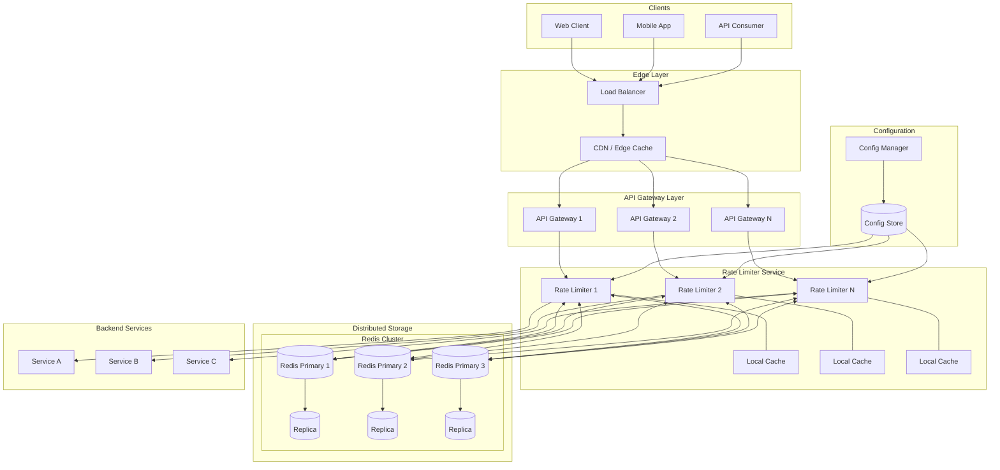
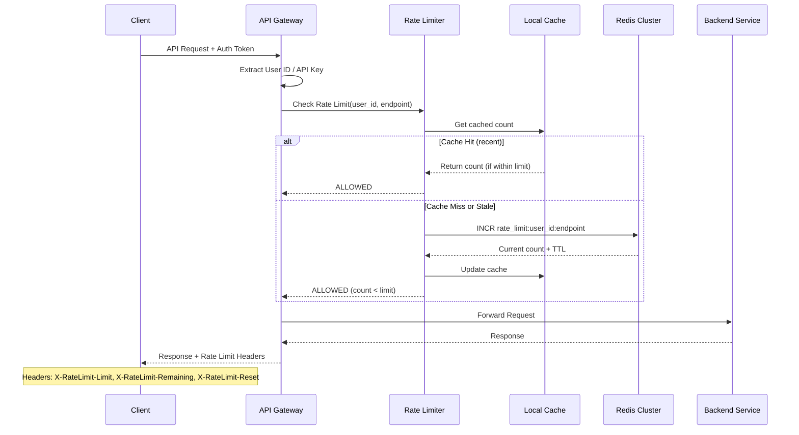
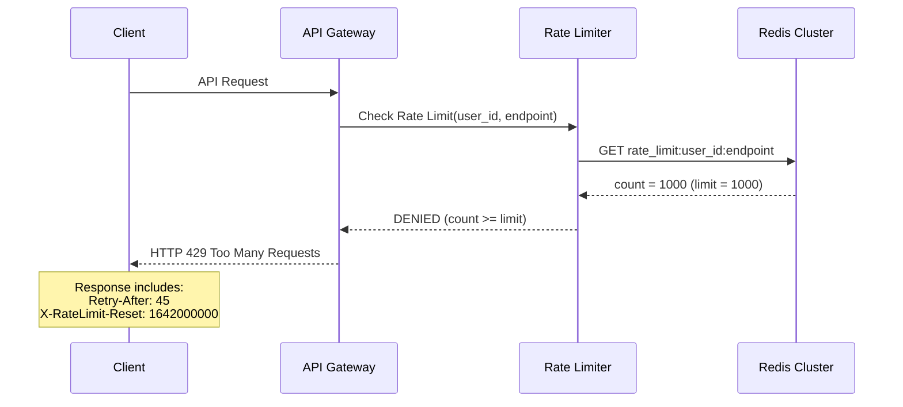
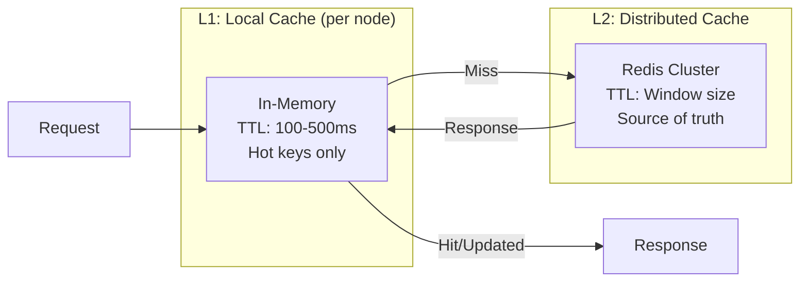
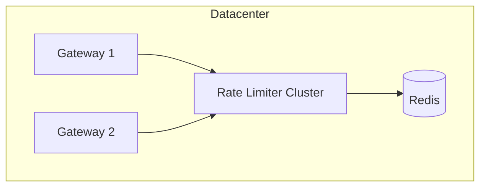
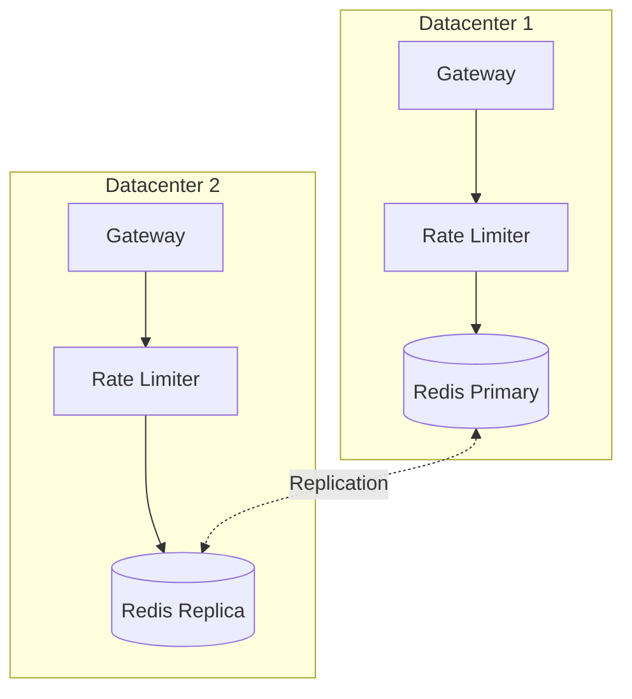
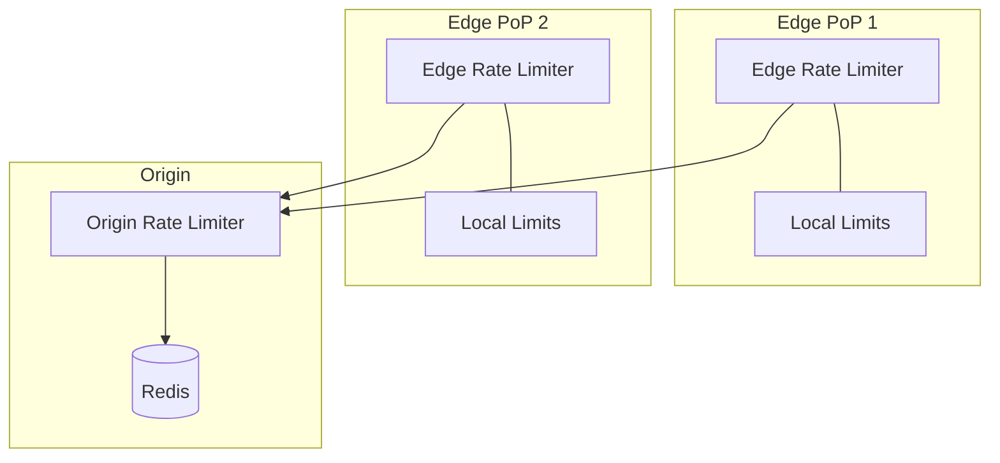
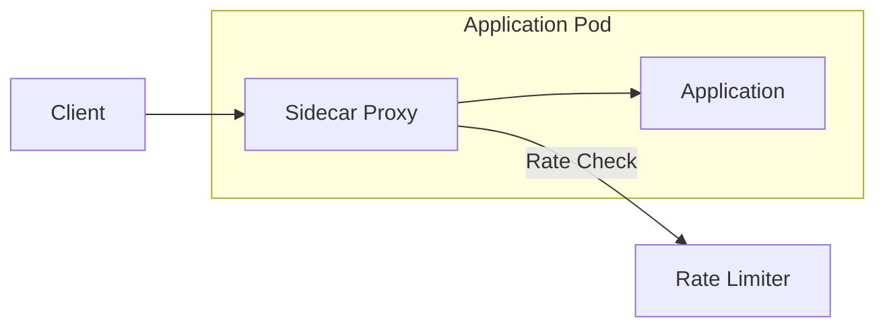

# High-Level Design

[← Back to Index](./00-index.md)

---

## System Architecture

### Component Overview



### Component Responsibilities

| Component | Responsibility |
|-----------|---------------|
| **Load Balancer** | Distribute traffic, initial connection limiting |
| **API Gateway** | Authentication, routing, invokes rate limiter |
| **Rate Limiter Service** | Core limiting logic, algorithm execution |
| **Local Cache** | Hot key caching, reduce Redis round-trips |
| **Redis Cluster** | Distributed counter storage, atomic operations |
| **Config Store** | Rate limit rules, user tier mappings |

---

## Data Flow

### Request Allowed Flow



### Request Throttled Flow



---

## Key Architectural Decisions

### 1. Monolith vs Microservice

| Approach | Pros | Cons | Verdict |
|----------|------|------|---------|
| **Embedded in Gateway** | Lower latency, no network hop | Tight coupling, harder to scale independently | Good for simple cases |
| **Separate Microservice** | Independent scaling, reusable | Network latency added | **Recommended** for large scale |

**Recommendation:** Separate microservice with optional local caching in gateway for hot paths.

### 2. Synchronous vs Asynchronous

| Approach | Use Case | Trade-off |
|----------|----------|-----------|
| **Synchronous** | Real-time limit enforcement | Adds latency to request path |
| **Asynchronous** | Analytics, soft limits | Cannot block requests |

**Recommendation:** Synchronous for hard limits, asynchronous for analytics/logging.

### 3. Database Choice

| Option | Pros | Cons | Best For |
|--------|------|------|----------|
| **Redis** | Fast, atomic ops, TTL support | Memory-bound | Primary choice |
| **Memcached** | Simple, fast | No atomic INCR with TTL | Basic counting |
| **In-memory (local)** | Fastest | Not distributed | Single-node, edge |
| **SQL Database** | ACID, familiar | Too slow | Never for hot path |

**Recommendation:** Redis cluster with local caching layer.

### 4. Caching Strategy



**Multi-tier Caching:**
- **L1 (Local):** 100-500ms TTL, reduces Redis calls by 50-80%
- **L2 (Redis):** Source of truth, handles atomic operations

### 5. Message Queue Usage

| Scenario | Queue Needed? | Reasoning |
|----------|---------------|-----------|
| Real-time limiting | No | Must be synchronous |
| Config propagation | Optional | Pub/sub for updates |
| Audit logging | Yes | Async, non-blocking |
| Analytics | Yes | Aggregate and process |

**Recommendation:** Use pub/sub for config updates, message queue for audit logs.

---

## Architecture Pattern Checklist

- [x] **Sync vs Async:** Synchronous for enforcement, async for logging
- [x] **Event-driven vs Request-response:** Request-response for limit checks
- [x] **Push vs Pull:** Pull model (check on each request)
- [x] **Stateless vs Stateful:** Stateless services, externalized state to Redis
- [x] **Read-heavy vs Write-heavy:** Mixed (read count + write increment)
- [x] **Real-time vs Batch:** Real-time enforcement
- [x] **Edge vs Origin:** Both supported (edge for early rejection)

---

## Deployment Options

### Option A: Centralized Rate Limiter



**Pros:** Simple, consistent view
**Cons:** Single point of failure, latency for remote clients

### Option B: Distributed with Shared Storage



**Pros:** Geographic distribution, lower latency
**Cons:** Replication lag, eventual consistency

### Option C: Hierarchical (Edge + Origin)



**Pros:** Early rejection at edge, global limits at origin
**Cons:** Complex, potential double-counting

**Recommendation:** Option B for most cases, Option C for global-scale with edge requirements.

---

## Integration Points

### Upstream (Clients)

```
Rate Limit Response Headers (RFC 6585 / draft-ietf-httpapi-ratelimit-headers):

X-RateLimit-Limit: 1000          # Max requests allowed
X-RateLimit-Remaining: 456       # Requests remaining
X-RateLimit-Reset: 1640000000    # Unix timestamp when limit resets
Retry-After: 45                  # Seconds until retry (on 429)
```

### Downstream (Configuration)

```
Configuration Sources:
├── Static config files (default limits)
├── Database (user tier mappings)
├── Admin API (dynamic overrides)
└── Feature flags (A/B testing limits)
```

### Sidecar Pattern (Service Mesh)



**Use Case:** Kubernetes environments with service mesh (Istio, Linkerd)

---

## Failure Modes

| Failure | Impact | Mitigation |
|---------|--------|------------|
| Redis unavailable | Cannot check limits | Fail-open with local estimation |
| Rate limiter crash | Gateway blocked | Health checks, circuit breaker |
| Network partition | Inconsistent counts | Accept temporary over-limit |
| Config store down | Stale limits | Cache config with long TTL |

**Default Failure Policy:** Fail-open (allow requests) to prioritize availability over strict enforcement.
