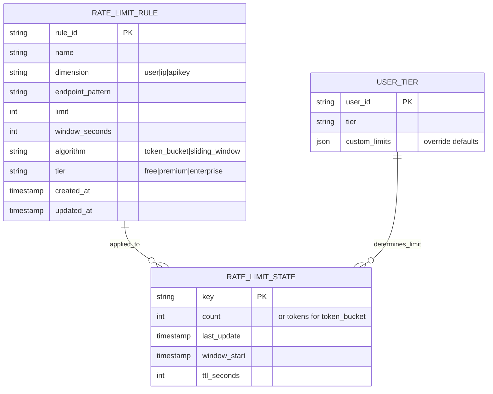
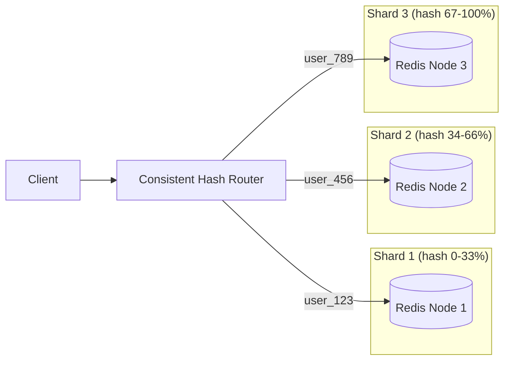
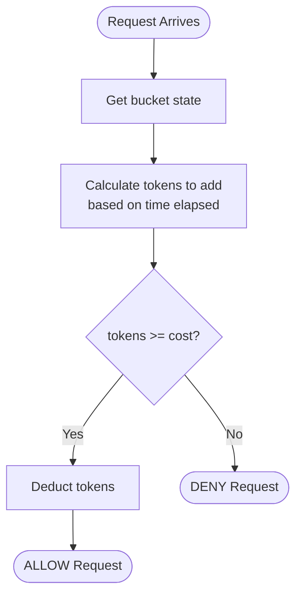
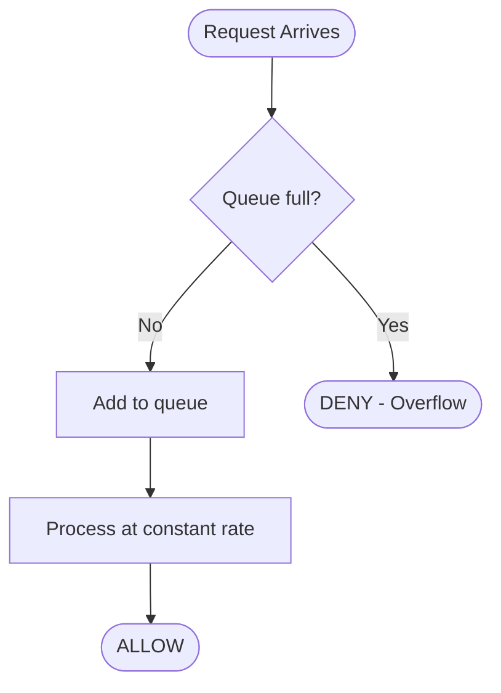
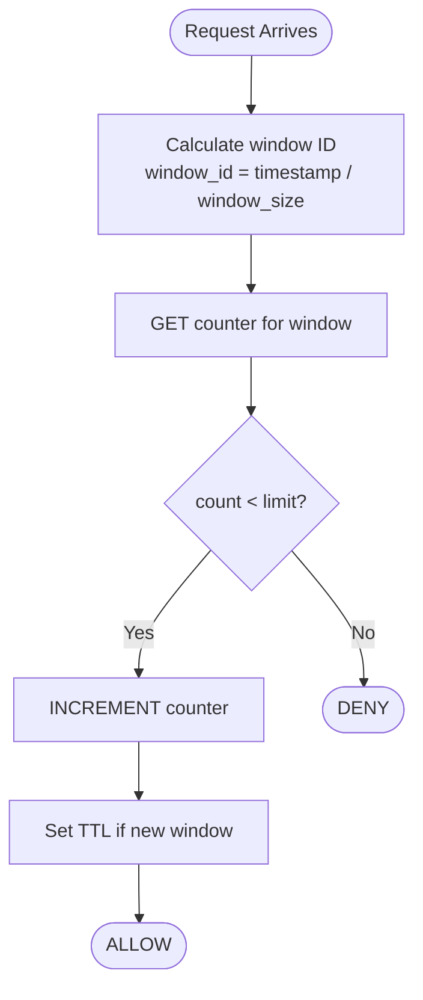
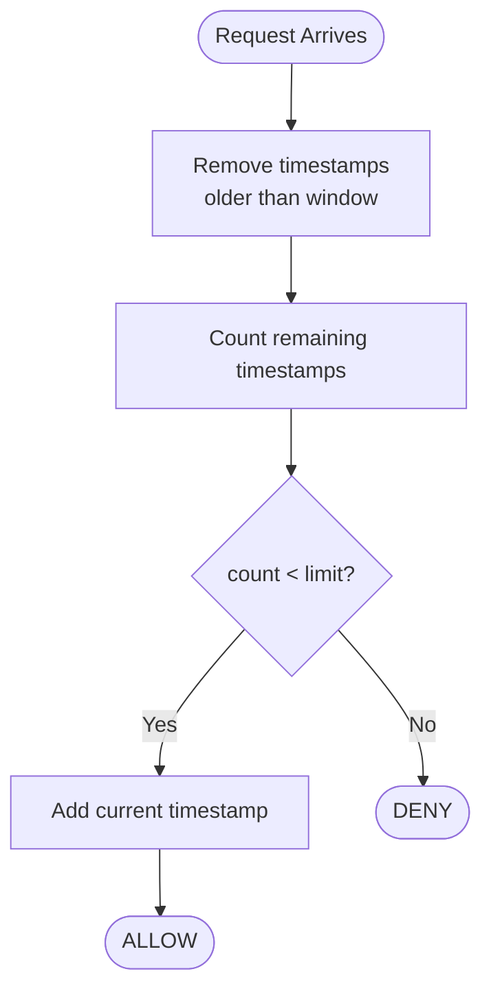
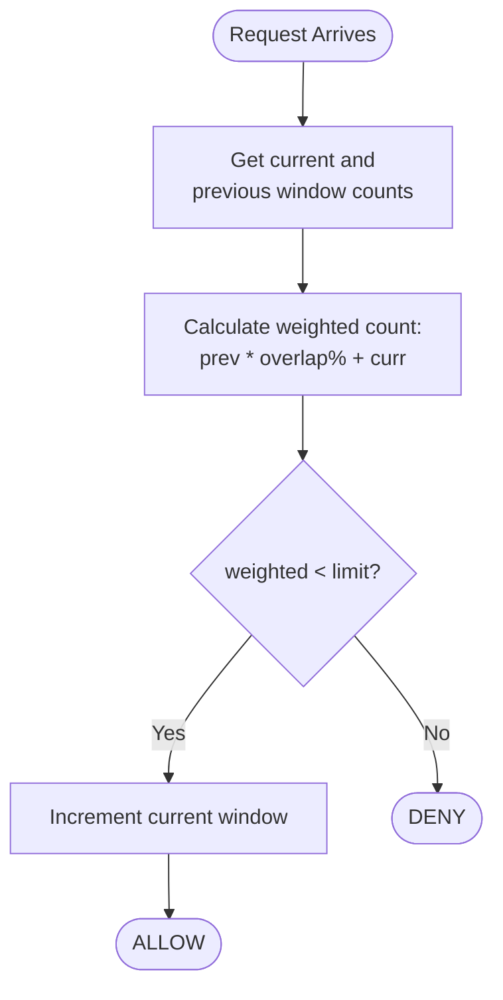
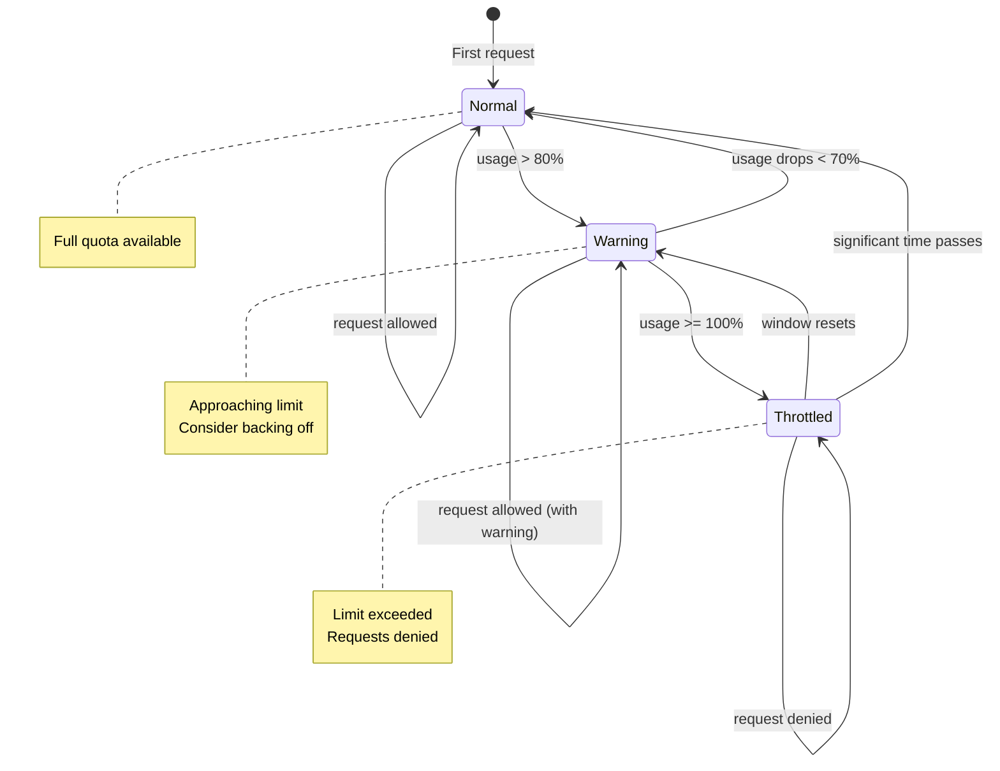

# Low-Level Design

[← Back to Index](./00-index.md)

---

## Data Model

### Key Structure

```
Rate Limit Key Format:
┌─────────────────────────────────────────────────────────┐
│ rl:{dimension}:{identifier}:{window}:{endpoint}         │
└─────────────────────────────────────────────────────────┘

Examples:
- rl:user:12345:min:api/v1/orders     (per-user, per-minute)
- rl:ip:192.168.1.1:hour:api/v1/search (per-IP, per-hour)
- rl:apikey:ak_123:day:*              (per-API-key, per-day, all endpoints)
```

### Schema Design



### Storage Patterns by Algorithm

| Algorithm | Key | Value | TTL |
|-----------|-----|-------|-----|
| **Token Bucket** | `rl:tb:{id}:{endpoint}` | `{tokens: N, last_refill: timestamp}` | None (updated on access) |
| **Fixed Window** | `rl:fw:{id}:{endpoint}:{window_id}` | `count` | Window duration |
| **Sliding Window Log** | `rl:swl:{id}:{endpoint}` | Sorted Set of timestamps | Window duration |
| **Sliding Window Counter** | `rl:swc:{id}:{endpoint}:{window_id}` | `count` | 2x window duration |

### Indexing Strategy

| Index | Purpose | Implementation |
|-------|---------|----------------|
| Primary key lookup | Rate limit check | Hash-based (Redis key) |
| User tier lookup | Determine limit | Cached in memory |
| Endpoint pattern match | Find applicable rule | Trie or prefix tree |
| Audit by user | Compliance | Time-series DB |

### Partitioning / Sharding

**Sharding Key:** `hash(user_id)` or `hash(api_key)`



**Why user-based sharding:**
- Distributes load across nodes
- Co-locates all limits for a user (multi-endpoint checks efficient)
- Avoids hot spots from popular endpoints

### Data Retention

| Data Type | Retention | Reason |
|-----------|-----------|--------|
| Active counts | Window duration + buffer | Auto-expire via TTL |
| Configuration | Permanent | Required for operation |
| Audit logs | 90 days | Compliance |
| Metrics | 30 days detailed, 1 year aggregated | Capacity planning |

---

## API Design

### Rate Limit Check API

**Internal gRPC API** (service-to-service)

```
Service: RateLimiter

RPC CheckRateLimit(CheckRequest) returns (CheckResponse)
RPC GetRemainingQuota(QuotaRequest) returns (QuotaResponse)
RPC ResetLimit(ResetRequest) returns (ResetResponse)
```

**Request/Response Formats:**

```
CheckRequest {
    identifier: string      // user_id, ip, api_key
    dimension: Dimension    // USER, IP, API_KEY
    endpoint: string        // /api/v1/orders
    cost: int              // default 1, can be higher for expensive ops
    timestamp: int64       // client timestamp (for clock skew handling)
}

CheckResponse {
    allowed: bool
    current_count: int
    limit: int
    remaining: int
    reset_at: int64        // Unix timestamp
    retry_after: int       // Seconds (if denied)
}
```

### Configuration Management API

**REST API** (admin operations)

```
GET    /api/v1/rules                    # List all rate limit rules
GET    /api/v1/rules/{rule_id}          # Get specific rule
POST   /api/v1/rules                    # Create new rule
PUT    /api/v1/rules/{rule_id}          # Update rule
DELETE /api/v1/rules/{rule_id}          # Delete rule

GET    /api/v1/users/{user_id}/limits   # Get user's effective limits
PUT    /api/v1/users/{user_id}/tier     # Update user tier
POST   /api/v1/users/{user_id}/override # Temporary limit override
```

### Idempotency Handling

**Problem:** Retried requests shouldn't be double-counted.

**Solution:** Request deduplication with idempotency key

```
Request includes: X-Idempotency-Key: {uuid}

Pseudocode:
    IF exists(dedup_key:{idempotency_key}) THEN
        RETURN cached_response
    ELSE
        result = process_rate_limit()
        SET dedup_key:{idempotency_key} = result WITH TTL 5 minutes
        RETURN result
```

### Rate Limiting the Rate Limiter

| Endpoint | Limit | Window |
|----------|-------|--------|
| CheckRateLimit | 100,000/s per node | N/A (internal) |
| Config read APIs | 1000/min per admin | 1 minute |
| Config write APIs | 100/min per admin | 1 minute |

### Versioning Strategy

- API version in path: `/api/v1/`, `/api/v2/`
- Backward compatible changes within version
- Deprecation notice 6 months before removal
- Version sunset communicated via headers

---

## Core Algorithms

### 1. Token Bucket Algorithm

**Concept:** A bucket holds tokens; requests consume tokens; tokens refill at a steady rate.



**Pseudocode:**

```
FUNCTION check_token_bucket(key, max_tokens, refill_rate, cost=1):
    current_time = NOW()

    // Atomic operation (Lua script in Redis)
    state = GET(key) OR {tokens: max_tokens, last_refill: current_time}

    // Calculate tokens to add
    time_passed = current_time - state.last_refill
    tokens_to_add = time_passed * refill_rate
    state.tokens = MIN(max_tokens, state.tokens + tokens_to_add)
    state.last_refill = current_time

    IF state.tokens >= cost THEN
        state.tokens = state.tokens - cost
        SET(key, state)
        RETURN {allowed: true, remaining: state.tokens}
    ELSE
        SET(key, state)
        wait_time = (cost - state.tokens) / refill_rate
        RETURN {allowed: false, retry_after: wait_time}
```

**Complexity:**
- Time: O(1)
- Space: O(1) per key

**Pros:** Allows bursts, memory efficient
**Cons:** Burst at bucket boundaries, slightly complex

---

### 2. Leaky Bucket Algorithm

**Concept:** Requests enter a queue (bucket) and are processed at a constant rate. Overflow is rejected.



**Pseudocode:**

```
FUNCTION check_leaky_bucket(key, bucket_size, leak_rate):
    current_time = NOW()

    state = GET(key) OR {water_level: 0, last_leak: current_time}

    // Leak water based on time passed
    time_passed = current_time - state.last_leak
    leaked = time_passed * leak_rate
    state.water_level = MAX(0, state.water_level - leaked)
    state.last_leak = current_time

    IF state.water_level < bucket_size THEN
        state.water_level = state.water_level + 1
        SET(key, state)
        RETURN {allowed: true, queue_position: state.water_level}
    ELSE
        SET(key, state)
        wait_time = 1 / leak_rate  // Time for one slot to free
        RETURN {allowed: false, retry_after: wait_time}
```

**Complexity:**
- Time: O(1)
- Space: O(1) per key

**Pros:** Smooths traffic, constant output rate
**Cons:** No burst tolerance, may delay legitimate spikes

---

### 3. Fixed Window Counter

**Concept:** Count requests in fixed time windows (e.g., every minute from :00 to :59).



**Pseudocode:**

```
FUNCTION check_fixed_window(key, limit, window_seconds):
    current_time = NOW()
    window_id = FLOOR(current_time / window_seconds)
    window_key = key + ":" + window_id

    // Atomic increment with TTL
    count = INCR(window_key)
    IF count == 1 THEN
        EXPIRE(window_key, window_seconds + buffer)

    IF count <= limit THEN
        RETURN {allowed: true, remaining: limit - count}
    ELSE
        reset_time = (window_id + 1) * window_seconds
        RETURN {allowed: false, retry_after: reset_time - current_time}
```

**Complexity:**
- Time: O(1)
- Space: O(1) per key per window

**Pros:** Simple, memory efficient, easy to understand
**Cons:** Boundary burst problem (2x limit at window edges)

**Boundary Problem Illustration:**

```
Window 1: [:00 - :59]    Window 2: [:00 - :59]
         ....[100 req]   [100 req]....
              ^--------------^
              200 requests in 2 seconds!
              (at boundary between windows)
```

---

### 4. Sliding Window Log

**Concept:** Store timestamp of each request; count requests within the sliding window.



**Pseudocode:**

```
FUNCTION check_sliding_window_log(key, limit, window_seconds):
    current_time = NOW()
    window_start = current_time - window_seconds

    // Use Redis sorted set: score = timestamp, member = unique_id
    // Atomic operations
    ZREMRANGEBYSCORE(key, 0, window_start)  // Remove old entries
    count = ZCARD(key)                        // Count remaining

    IF count < limit THEN
        ZADD(key, current_time, unique_request_id)
        EXPIRE(key, window_seconds + buffer)
        RETURN {allowed: true, remaining: limit - count - 1}
    ELSE
        oldest = ZRANGE(key, 0, 0, WITHSCORES)
        retry_after = oldest.score + window_seconds - current_time
        RETURN {allowed: false, retry_after: retry_after}
```

**Complexity:**
- Time: O(log n) for sorted set operations
- Space: O(n) where n = requests in window (can be large!)

**Pros:** Most accurate, no boundary issues
**Cons:** High memory usage, slower operations

---

### 5. Sliding Window Counter (Recommended)

**Concept:** Hybrid approach - use counters from adjacent fixed windows with weighted average.



**Pseudocode:**

```
FUNCTION check_sliding_window_counter(key, limit, window_seconds):
    current_time = NOW()
    current_window = FLOOR(current_time / window_seconds)
    prev_window = current_window - 1

    current_key = key + ":" + current_window
    prev_key = key + ":" + prev_window

    // Get both counters
    current_count = GET(current_key) OR 0
    prev_count = GET(prev_key) OR 0

    // Calculate position in current window (0.0 to 1.0)
    window_start = current_window * window_seconds
    position_in_window = (current_time - window_start) / window_seconds

    // Weighted count: portion of previous window + all of current
    prev_weight = 1 - position_in_window
    weighted_count = (prev_count * prev_weight) + current_count

    IF weighted_count < limit THEN
        new_count = INCR(current_key)
        IF new_count == 1 THEN
            EXPIRE(current_key, 2 * window_seconds)  // Keep for next window's calculation
        RETURN {allowed: true, remaining: limit - weighted_count - 1}
    ELSE
        retry_after = window_seconds * (1 - position_in_window)
        RETURN {allowed: false, retry_after: retry_after}
```

**Complexity:**
- Time: O(1)
- Space: O(2) per key (two windows)

**Pros:** Accurate (Cloudflare reports 0.003% error), memory efficient, no boundary burst
**Cons:** Slightly more complex than fixed window

---

### 6. Generic Cell Rate Algorithm (GCRA)

**Concept:** Track "theoretical arrival time" (TAT) - the earliest time the next request should arrive for even spacing.

```mermaid
flowchart TD
    Start([Request Arrives]) --> GetTAT[Get TAT from storage]
    GetTAT --> CalcNew[new_tat = MAX(now, tat) + emission_interval]
    CalcNew --> Check{new_tat - now <= burst_tolerance?}
    Check -->|Yes| Update[Update TAT = new_tat]
    Update --> Allow([ALLOW])
    Check -->|No| Deny([DENY])
```

**Pseudocode:**

```
FUNCTION check_gcra(key, rate, burst):
    // rate = requests per second
    // burst = max burst size (in request units)

    emission_interval = 1 / rate           // Time between requests
    burst_tolerance = burst * emission_interval  // Max "debt" allowed

    current_time = NOW()
    tat = GET(key) OR current_time  // Theoretical Arrival Time

    // Calculate new TAT
    new_tat = MAX(current_time, tat) + emission_interval

    // Check if within burst tolerance
    IF new_tat - current_time <= burst_tolerance THEN
        SET(key, new_tat)
        remaining = FLOOR((burst_tolerance - (new_tat - current_time)) / emission_interval)
        RETURN {allowed: true, remaining: remaining}
    ELSE
        retry_after = tat - current_time - burst_tolerance + emission_interval
        RETURN {allowed: false, retry_after: retry_after}
```

**Complexity:**
- Time: O(1)
- Space: O(1) per key (just stores TAT timestamp)

**Pros:** Memory efficient, smooth rate enforcement, prevents micro-bursts
**Cons:** Complex to understand, requires careful time handling

---

## Algorithm Comparison Summary

| Algorithm | Memory | Accuracy | Burst Handling | Complexity | Best For |
|-----------|--------|----------|----------------|------------|----------|
| Token Bucket | O(1) | High | Allows bursts | Medium | General APIs (Stripe) |
| Leaky Bucket | O(1) | High | Smooths out | Low | Constant-rate processing |
| Fixed Window | O(1) | Medium | Boundary issue | Low | Simple cases (GitHub) |
| Sliding Log | O(n) | Very High | Accurate | High | Low-volume, high-accuracy |
| **Sliding Counter** | **O(1)** | **High** | **Balanced** | **Medium** | **High-scale (Cloudflare)** |
| GCRA | O(1) | Very High | Smooth spacing | High | Sophisticated rate shaping |

---

## State Machine



**State Transitions:**
- **Normal → Warning:** Return warning header to client
- **Warning → Throttled:** Start returning 429
- **Throttled → Warning:** Allow some requests again
