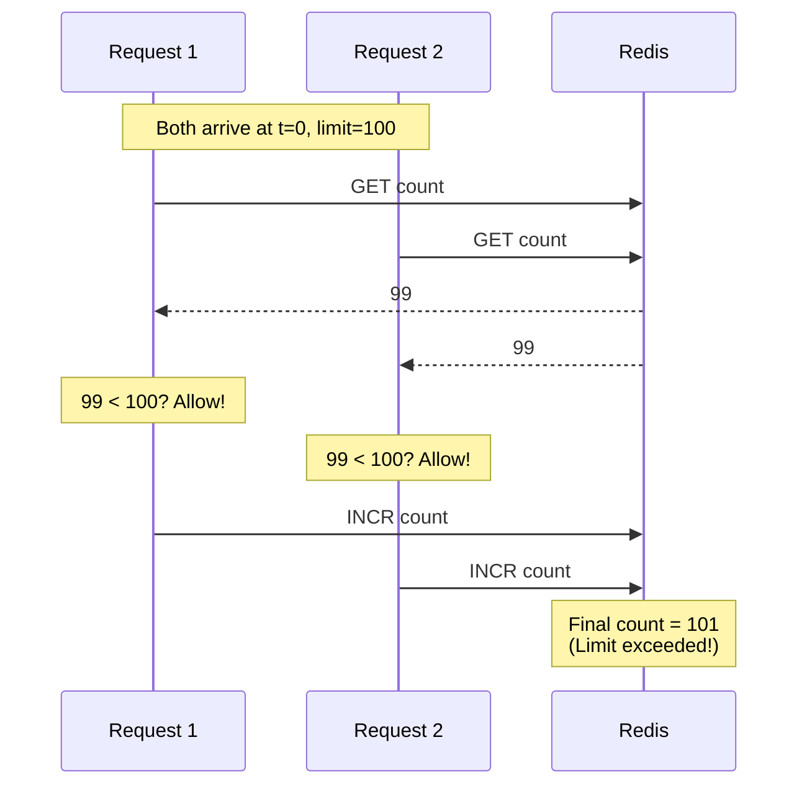
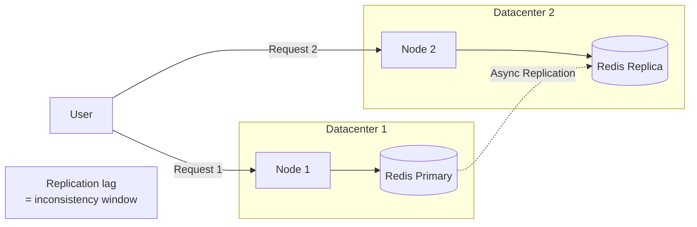
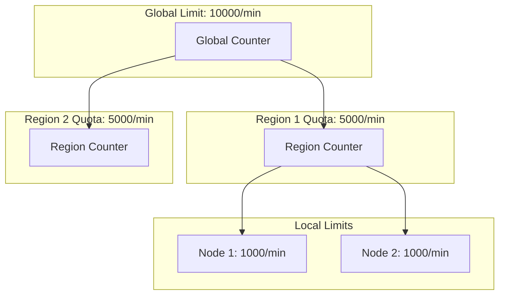
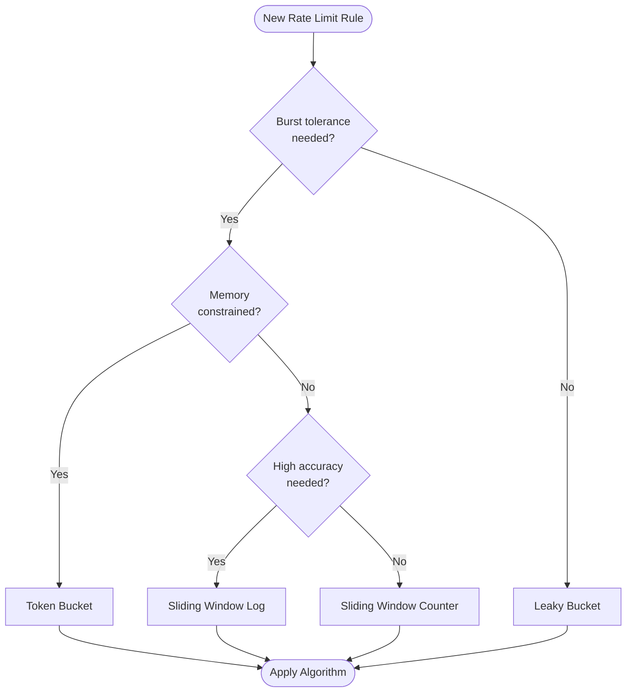
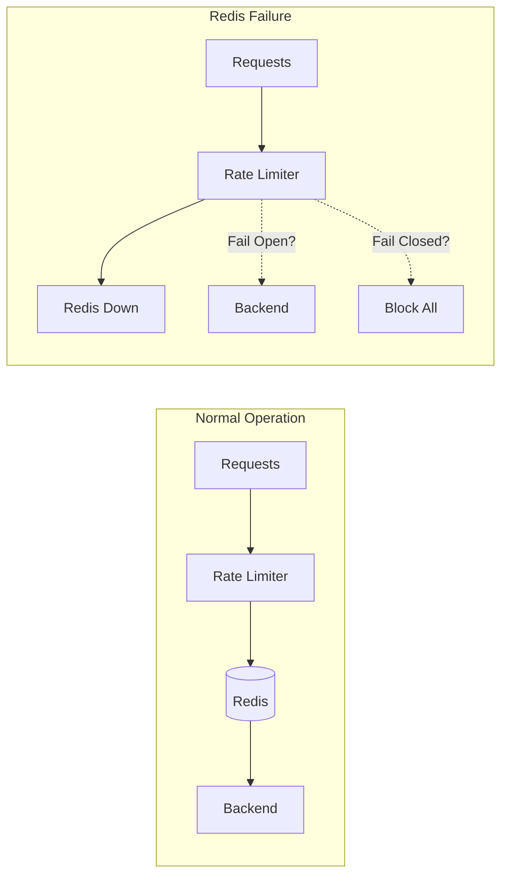
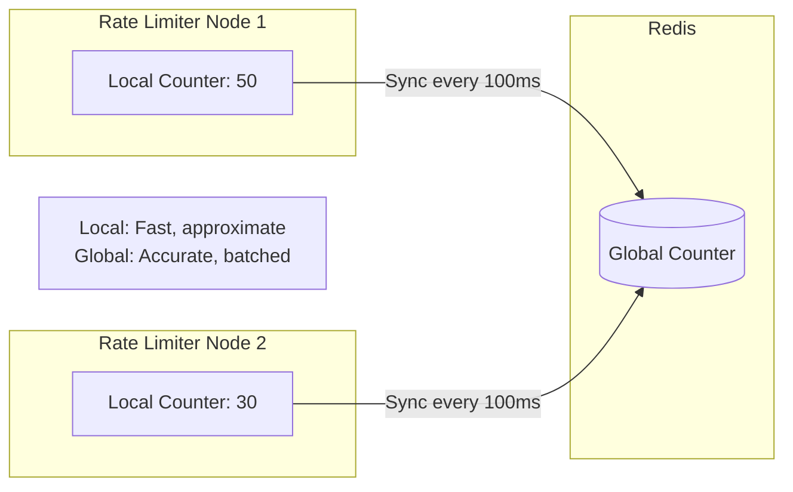
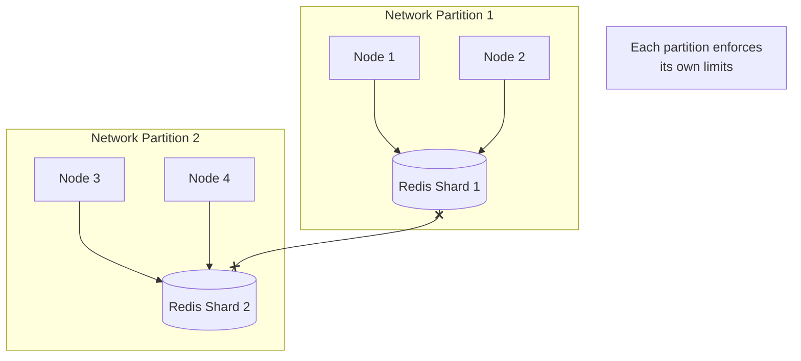

# Deep Dive & Bottleneck Analysis

[← Back to Index](./00-index.md)

---

## Critical Component Deep Dives

### Deep Dive 1: Race Condition Handling

#### Why This Is Critical

In a distributed rate limiter, the most dangerous bug is a **race condition** that allows more requests through than the configured limit. This happens when:

1. Multiple requests arrive simultaneously
2. Each reads the current count (e.g., 99)
3. Each checks: 99 < 100? Yes, allow!
4. Each increments: now count = 102 (exceeded!)



#### How It Works Internally

**The Problem: Check-Then-Act**

```
// WRONG: Non-atomic check-then-act
count = GET(key)
IF count < limit THEN
    INCR(key)        // Another request could INCR between GET and this INCR
    RETURN allowed
```

**Solution 1: Atomic Operations**

Use Redis commands that combine read and write atomically:

```
// Using INCR (atomic increment and return)
new_count = INCR(key)
IF new_count <= limit THEN
    RETURN allowed
ELSE
    DECR(key)  // Roll back (or accept slight over-count)
    RETURN denied
```

**Problem with Solution 1:** Still has issue - we increment first, then check. On denial, we decrement, but another request might see the inflated count.

**Solution 2: Lua Scripts (Recommended)**

Redis executes Lua scripts atomically - no other command can interleave.

```
// Lua script executed atomically in Redis
local key = KEYS[1]
local limit = tonumber(ARGV[1])
local window = tonumber(ARGV[2])

local current = tonumber(redis.call('GET', key) or 0)

if current < limit then
    redis.call('INCR', key)
    if current == 0 then
        redis.call('EXPIRE', key, window)
    end
    return {1, current + 1, limit}  -- allowed, current, limit
else
    return {0, current, limit}  -- denied, current, limit
end
```

**Solution 3: Redis Transactions (MULTI/EXEC with WATCH)**

```
WATCH key
count = GET key
IF count < limit THEN
    MULTI
    INCR key
    EXEC  -- Fails if key was modified since WATCH
    IF EXEC failed THEN
        RETRY  // Another client modified it
```

**Problem:** WATCH/MULTI doesn't prevent the race - it only detects it after the fact, requiring retries.

#### Failure Modes

| Failure | Impact | Handling |
|---------|--------|----------|
| Script timeout | Request blocked | Set reasonable timeout, fail-open |
| Redis restart during script | Partial state | Scripts are atomic, no partial execution |
| Network partition during script | Client doesn't know result | Use idempotency keys |

#### Recommendation

**Use Lua scripts for all rate limiting operations.** They provide:
- True atomicity (no interleaving)
- Single round-trip (network efficiency)
- Complex logic support (token bucket calculations)

---

### Deep Dive 2: Distributed Consistency

#### Why This Is Critical

When rate limiting spans multiple nodes or datacenters, consistency becomes challenging:

- User makes request to Node A (count = 50)
- Simultaneously makes request to Node B (also sees count = 50)
- Both allow, but combined count should be 52



#### How It Works Internally

**Option A: Single Primary (Strong Consistency)**

All writes go to one primary Redis node.

```
Pros:
- Guaranteed consistency
- Simple to reason about

Cons:
- Single point of failure
- Higher latency for remote clients
- Throughput limited by single node
```

**Option B: Local Writes with Async Replication (Eventual Consistency)**

Each datacenter has a local Redis; replication happens asynchronously.

```
Consistency Model:
- Local reads are fast but potentially stale
- Writes are local-first, replicated async
- Conflict resolution: Last-Write-Wins (LWW)

Acceptable because:
- Rate limiting is best-effort, not financial
- Slight over-limit (1-2%) is acceptable
- Prioritize availability over strict consistency
```

**Option C: CRDTs (Conflict-Free Replicated Data Types)**

Use data structures that merge automatically without conflicts.

```
G-Counter CRDT for rate limiting:
- Each node maintains its own counter
- Global count = sum of all node counters
- Increment is local, conflict-free
- Merge is commutative: merge(A, B) = merge(B, A)

Example:
  Node1 counter: 30
  Node2 counter: 25
  Node3 counter: 20
  Total: 75

  Each node can increment locally, sync later
```

**Option D: Hierarchical Rate Limiting**



Allocate quotas hierarchically:
- Global limit split among regions
- Region limit split among nodes
- Periodic rebalancing based on actual usage

#### Failure Modes

| Failure | Impact | Handling |
|---------|--------|----------|
| Replication lag | Temporary over-limit | Accept as eventual consistency |
| Split-brain | Both sides enforce full limit | Use leader election or quotas |
| Node rejoins after partition | Stale data merge | CRDT merge or timestamp-based reconciliation |

#### Recommendation

**Use hierarchical rate limiting with eventual consistency:**
- Allocate per-node quotas
- Sync global counts asynchronously
- Rebalance quotas periodically
- Accept slight inconsistency for availability

---

### Deep Dive 3: Algorithm Selection Engine

#### Why This Is Critical

Different use cases require different algorithms. A one-size-fits-all approach leads to either poor UX (too restrictive) or poor protection (too lenient).

#### How It Works Internally

**Decision Matrix:**



**Selection Criteria:**

| Criterion | Token Bucket | Leaky Bucket | Sliding Window |
|-----------|--------------|--------------|----------------|
| Burst traffic expected | Best | Poor | Good |
| Constant rate required | Good | Best | Good |
| Memory efficiency | Best | Best | Varies |
| Accuracy at boundaries | Good | Good | Best |
| Implementation complexity | Medium | Low | Medium-High |

**Dynamic Algorithm Selection:**

```
FUNCTION select_algorithm(endpoint_config):
    IF endpoint_config.requires_constant_rate THEN
        RETURN LeakyBucket

    IF endpoint_config.burst_multiplier > 2 THEN
        RETURN TokenBucket

    IF endpoint_config.accuracy_requirement == "strict" THEN
        IF endpoint_config.expected_qps < 1000 THEN
            RETURN SlidingWindowLog
        ELSE
            RETURN SlidingWindowCounter

    RETURN SlidingWindowCounter  // Default
```

**Real-World Examples:**

| Use Case | Algorithm | Reason |
|----------|-----------|--------|
| Public API (Stripe) | Token Bucket | Allow bursts for legitimate spikes |
| Video transcoding queue | Leaky Bucket | Constant processing rate |
| DDoS protection | Fixed Window | Simple, fast, good enough |
| Billing API | Sliding Window | Accurate counting for invoicing |

#### Failure Modes

| Failure | Impact | Handling |
|---------|--------|----------|
| Wrong algorithm chosen | Poor UX or protection gaps | A/B test, monitor rejection rates |
| Algorithm switch mid-window | Count reset or double-count | Graceful migration with overlap |
| Config mismatch | Different nodes use different algos | Centralized config with versioning |

---

## Bottleneck Analysis

### Bottleneck 1: Redis as Single Point of Failure

**Problem:** All rate limit checks depend on Redis. If Redis fails, all API requests are affected.



**Mitigation Strategies:**

| Strategy | Implementation | Trade-off |
|----------|----------------|-----------|
| **Redis Cluster** | Multiple shards with replicas | Complexity, partial failures |
| **Fail-open** | Allow requests when Redis down | No protection during outage |
| **Local fallback** | In-memory counter as backup | Per-node limits only |
| **Circuit breaker** | Stop calling Redis after failures | Reduced protection window |

**Recommended Approach:**

```
FUNCTION rate_limit_with_fallback(request):
    TRY
        result = redis_rate_limit(request)
        circuit_breaker.record_success()
        RETURN result
    CATCH RedisException
        circuit_breaker.record_failure()

        IF circuit_breaker.is_open() THEN
            // Redis has been failing, use local fallback
            RETURN local_rate_limit(request)
        ELSE
            // Occasional failure, fail-open
            log.warn("Redis failure, allowing request")
            RETURN {allowed: true, degraded: true}
```

### Bottleneck 2: Hot Keys

**Problem:** Popular users or endpoints create "hot keys" that overwhelm a single Redis shard.

**Example:** A viral API endpoint gets 100K QPS, all hitting one Redis key.

**Mitigation Strategies:**

| Strategy | Implementation | Trade-off |
|----------|----------------|-----------|
| **Key splitting** | `user:123:shard1`, `user:123:shard2` | Aggregation complexity |
| **Local aggregation** | Batch local counts, sync periodically | Reduced accuracy |
| **Read replicas** | Read from replicas for hot keys | Stale reads |
| **Probabilistic counting** | HyperLogLog for approximate counts | ~2% error |

**Local Aggregation Pattern:**



### Bottleneck 3: Clock Drift

**Problem:** Distributed nodes have slightly different times, causing window misalignment.

**Example:**
- Node A thinks it's 12:00:00
- Node B thinks it's 12:00:05
- Same request might be in different windows on different nodes

**Mitigation Strategies:**

| Strategy | Implementation | Trade-off |
|----------|----------------|-----------|
| **NTP sync** | Keep clocks within 100ms | Requires infrastructure |
| **Server-side time** | Use Redis TIME command | Extra round-trip |
| **Logical clocks** | Lamport timestamps | Complexity |
| **Window overlap** | Accept requests in overlapping boundary | Slightly more permissive |

**Recommended: Hybrid Approach**

```
FUNCTION get_window_id(timestamp):
    // Use server time, not client time
    server_time = redis.call('TIME')

    // Add buffer at window boundaries
    window_id = FLOOR(server_time / window_size)

    // During first 1% of window, also check previous window
    position_in_window = (server_time % window_size) / window_size
    IF position_in_window < 0.01 THEN
        also_check_previous = true

    RETURN {window_id, also_check_previous}
```

---

## Concurrency & Race Conditions Summary

### Potential Race Conditions

| Race Condition | Trigger | Impact | Solution |
|----------------|---------|--------|----------|
| Check-then-act | Concurrent requests | Over-limit | Lua scripts |
| Stale read | Replication lag | Over-limit | Accept or strong consistency |
| Lost update | Concurrent writes | Under-count | Atomic operations |
| Double increment | Request retry | Over-count | Idempotency keys |

### Locking Strategies

| Strategy | Use Case | Performance |
|----------|----------|-------------|
| **Optimistic (no lock)** | High throughput, accept occasional over-limit | Best |
| **Atomic operations** | Moderate accuracy needs | Good |
| **Lua scripts** | Complex logic requiring atomicity | Good |
| **Pessimistic (distributed lock)** | Strict accuracy required | Poor (avoid for rate limiting) |

**Recommendation:** Never use distributed locks for rate limiting. The latency and failure modes are unacceptable for a system that must add < 5ms overhead.

---

## Failure Scenario Analysis

### Scenario: Network Partition



**Impact:** Each partition allows up to the full limit independently.
**Handling:** Accept temporary 2x limit during partition, reconcile after healing.

### Scenario: Thundering Herd

**Trigger:** Rate limit resets, all waiting requests flood in.

```
Time 11:59:59 - 1000 requests waiting (rate limited)
Time 12:00:00 - Window resets, all 1000 rush in simultaneously
```

**Handling:**
- Jittered retries (client-side)
- Gradual bucket refill (not all tokens at once)
- Queue with controlled release
