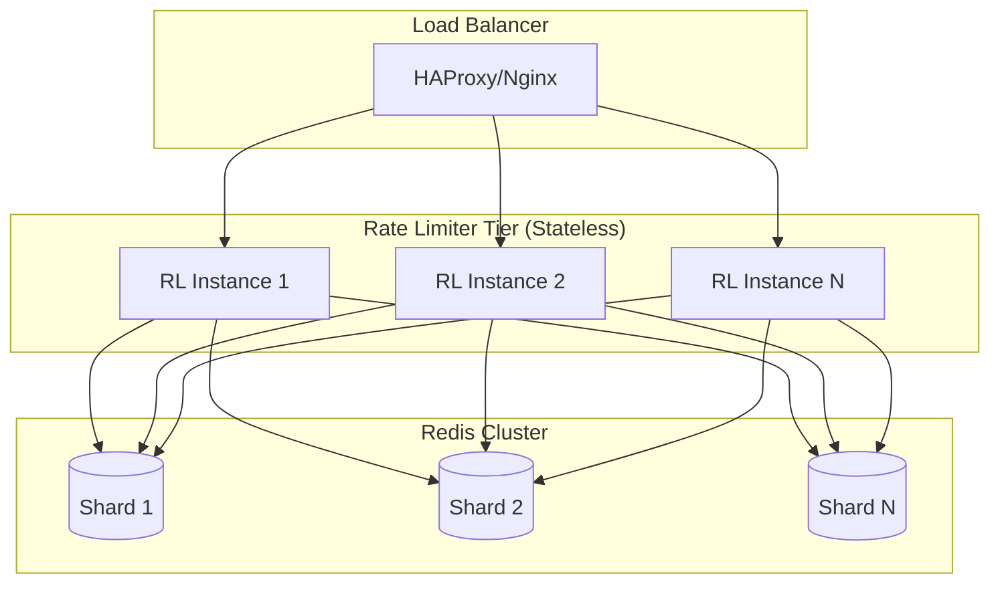
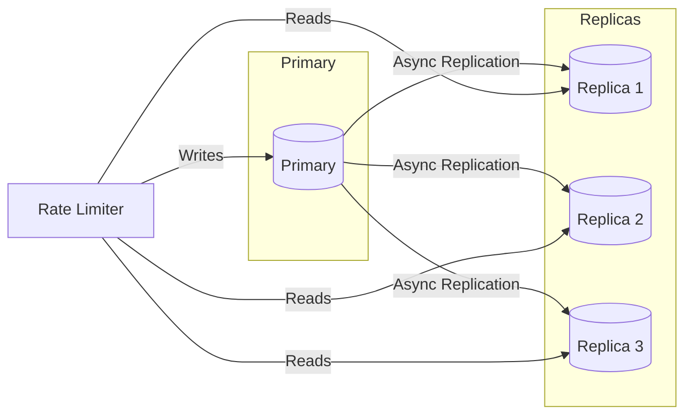
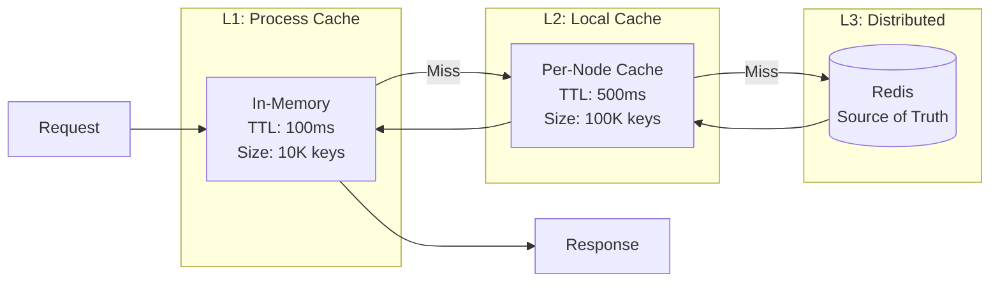
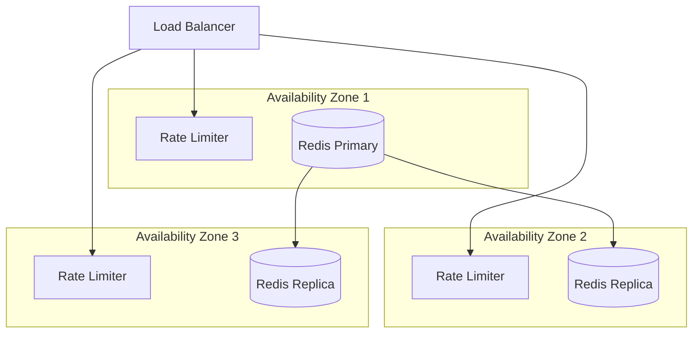
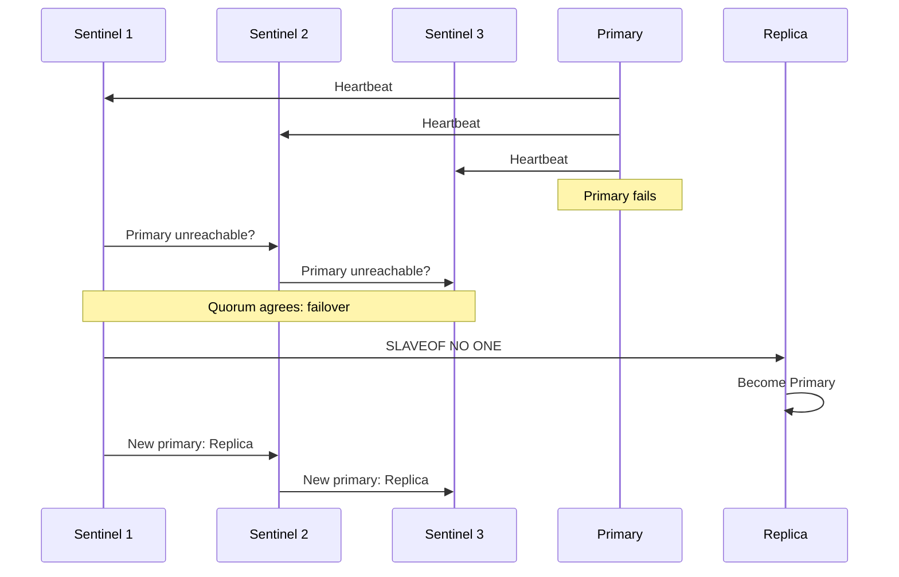
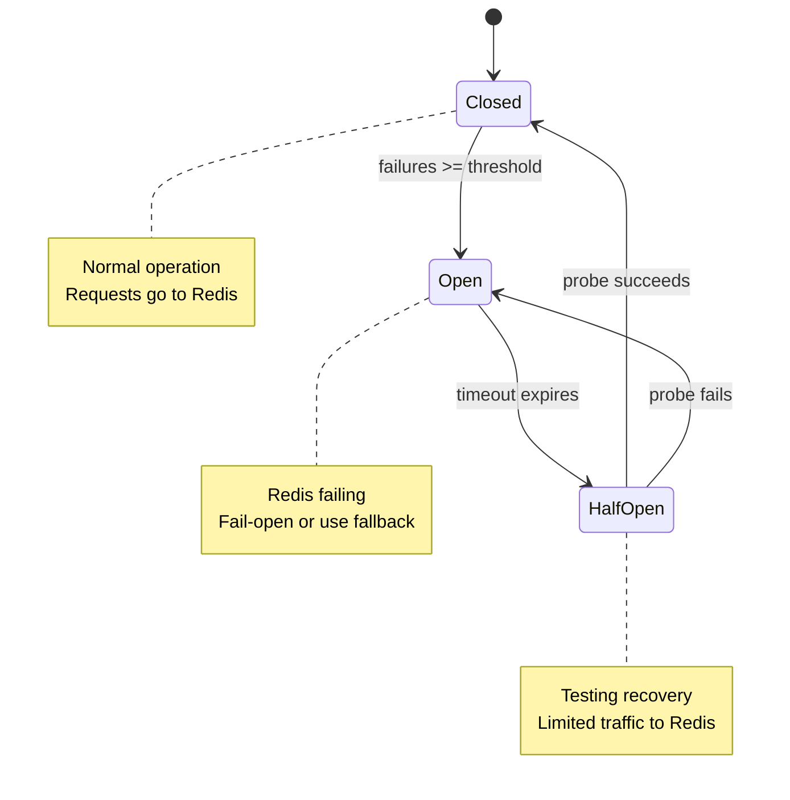
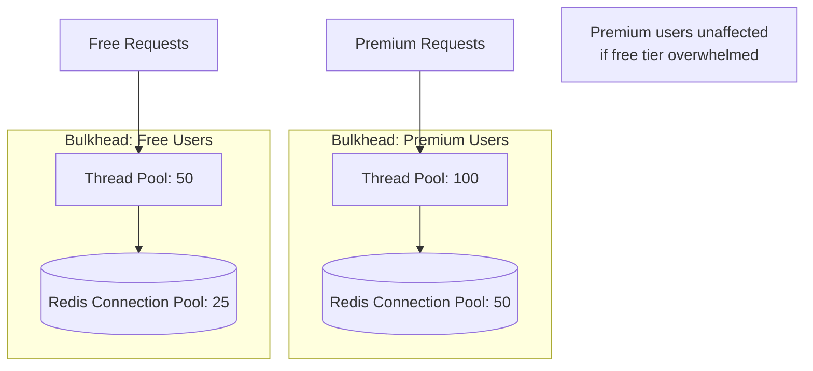
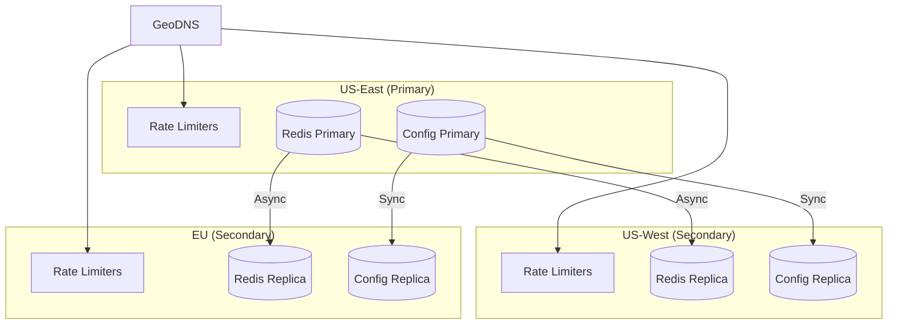
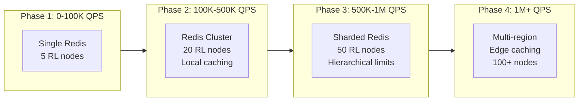

# Scalability & Reliability

[← Back to Index](./00-index.md)

---

## Scalability

### Horizontal vs Vertical Scaling

| Approach | When to Use | Limits |
|----------|-------------|--------|
| **Vertical** | Early stage, simple deployment | Single machine memory/CPU |
| **Horizontal** | Production scale (>50K QPS) | Coordination overhead |

**Recommendation:** Start vertical, scale horizontally when single node reaches 70% capacity.

### Rate Limiter Service Scaling



**Scaling triggers:**

| Metric | Threshold | Action |
|--------|-----------|--------|
| CPU utilization | > 70% sustained | Add rate limiter nodes |
| Request latency (p99) | > 5ms | Add nodes or optimize |
| Redis memory | > 70% | Add shards or evict |
| Request queue depth | > 100 | Add nodes |

### Auto-Scaling Configuration

```
// Rate Limiter Service Auto-scaling
min_instances: 3
max_instances: 50
target_cpu_utilization: 60%
scale_up_cooldown: 60 seconds
scale_down_cooldown: 300 seconds

// Scale-up: Add 25% capacity
// Scale-down: Remove 10% capacity (conservative)
```

### Database (Redis) Scaling

**Strategy 1: Read Replicas**



**Use Case:** Read-heavy config lookups, NOT for counter reads (stale data).

**Strategy 2: Sharding (Recommended)**

```mermaid
flowchart TB
    RL[Rate Limiter]

    subgraph Sharding["Consistent Hash Ring"]
        Hash[hash(user_id) % shards]
    end

    subgraph Shards["Redis Shards"]
        S1[(Shard 1<br/>users 0-33%)]
        S2[(Shard 2<br/>users 34-66%)]
        S3[(Shard 3<br/>users 67-100%)]
    end

    RL --> Hash
    Hash --> S1 & S2 & S3
```

**Sharding considerations:**
- Shard by user/API key for even distribution
- Avoid sharding by endpoint (hot spots)
- Use consistent hashing for minimal reshuffling

**Strategy 3: Redis Cluster Mode**

Native Redis Cluster with automatic sharding and failover.

```
Cluster Configuration:
- 6 nodes minimum (3 primaries + 3 replicas)
- 16384 hash slots distributed across primaries
- Automatic failover when primary dies
- Client-side routing with MOVED redirects
```

### Caching Layers



**Cache hit rates target:**
- L1: 30-40% (very hot keys)
- L2: 50-60% (warm keys)
- Overall: 70-80% Redis bypass

### Hot Spot Mitigation

**Problem:** A single user/key gets disproportionate traffic.

**Solutions:**

| Solution | Implementation | Effectiveness |
|----------|----------------|---------------|
| **Key spreading** | `key:user:shard:{rand(4)}` | High, but aggregation needed |
| **Local counting** | Aggregate locally, sync batched | High, slight accuracy loss |
| **Dedicated shard** | Route hot keys to beefier shard | Medium, operational overhead |
| **Rate limit the rate limiter** | Cap checks per key | Medium, may miss attacks |

```
// Local counting with periodic sync
FUNCTION increment_with_local_aggregation(key, cost):
    local_count = local_cache.increment(key, cost)

    IF local_count >= SYNC_THRESHOLD OR time_since_sync > SYNC_INTERVAL THEN
        global_count = redis.incrby(key, local_count)
        local_cache.reset(key)
        RETURN global_count

    RETURN estimated_global_count(key)
```

---

## Reliability & Fault Tolerance

### Single Points of Failure (SPOF) Analysis

| Component | SPOF? | Mitigation |
|-----------|-------|------------|
| Rate Limiter Service | No | Multiple stateless instances |
| Redis Primary | Yes | Replicas + automatic failover |
| Config Store | Yes | Replicate, cache aggressively |
| Network | Yes | Multi-AZ, redundant paths |
| Load Balancer | Yes | Active-passive pair |

### Redundancy Strategy



**Redundancy levels:**
- Rate Limiter: N+2 (survive 2 node failures)
- Redis: 1 primary + 2 replicas per shard
- Config: 3-node quorum cluster

### Failover Mechanisms

**Redis Sentinel Failover:**



**Failover timeline:**
- Detection: 5-10 seconds (sentinel down-after-milliseconds)
- Election: 1-2 seconds
- Promotion: < 1 second
- **Total:** 10-15 seconds (requests fail-open during this window)

### Circuit Breaker Pattern



**Configuration:**

```
CircuitBreaker {
    failure_threshold: 5          // Open after 5 failures
    success_threshold: 2          // Close after 2 successes in half-open
    timeout: 30 seconds           // Time in open state before trying again
    half_open_max_calls: 3        // Max calls to test in half-open
}
```

### Retry Strategy

```
FUNCTION rate_limit_with_retry(request):
    FOR attempt IN 1..MAX_RETRIES:
        TRY
            result = check_rate_limit(request)
            RETURN result
        CATCH TransientError
            IF attempt < MAX_RETRIES THEN
                delay = BASE_DELAY * (2 ^ attempt) + jitter()
                SLEEP(delay)
            ELSE
                RETURN fail_open_response()

// Exponential backoff with jitter
BASE_DELAY = 10ms
MAX_RETRIES = 3
// Delays: ~10ms, ~20ms, ~40ms (with ±25% jitter)
```

**Important:** Retries add latency. For rate limiting, prefer fail-open over multiple retries.

### Graceful Degradation

| Severity | Condition | Degradation |
|----------|-----------|-------------|
| **Level 0** | All healthy | Full functionality |
| **Level 1** | High latency | Disable secondary checks |
| **Level 2** | Partial Redis failure | Use local-only limits |
| **Level 3** | Full Redis failure | Fail-open with logging |
| **Level 4** | Config store failure | Use cached/default limits |

```
FUNCTION degraded_rate_limit(request, health_level):
    SWITCH health_level:
        CASE 0:
            RETURN full_rate_limit(request)
        CASE 1:
            RETURN fast_rate_limit(request)  // Skip secondary checks
        CASE 2:
            RETURN local_rate_limit(request) // Per-node limits only
        CASE 3:
            log.warn("Rate limiting disabled")
            RETURN {allowed: true}
        CASE 4:
            RETURN rate_limit_with_defaults(request)
```

### Bulkhead Pattern

Isolate failures to prevent cascade:



---

## Disaster Recovery

### Recovery Objectives

| Metric | Target | Justification |
|--------|--------|---------------|
| **RTO** (Recovery Time Objective) | 5 minutes | Rate limiting can fail-open briefly |
| **RPO** (Recovery Point Objective) | 1 minute | Counter data is ephemeral |

### Backup Strategy

| Data Type | Backup Frequency | Retention | Method |
|-----------|------------------|-----------|--------|
| Configuration | Every change + hourly | 30 days | Snapshot to object storage |
| User tiers | Hourly | 30 days | Database backup |
| Counter data | Not backed up | N/A | Ephemeral, regenerates |
| Audit logs | Daily | 1 year | Archive to cold storage |

### Multi-Region Considerations



**Active-Active Multi-Region:**

| Approach | Consistency | Latency | Complexity |
|----------|-------------|---------|------------|
| **Single-primary writes** | Strong | High for remote | Low |
| **Local writes, async sync** | Eventual | Low | Medium |
| **CRDT counters** | Eventual | Low | High |
| **Hierarchical quotas** | Eventual | Low | Medium |

**Recommended: Hierarchical Quotas**

```
Global Limit: 10,000 req/min per user

US-East quota: 4,000 req/min (40%)
US-West quota: 3,000 req/min (30%)
EU quota: 3,000 req/min (30%)

// Quotas rebalanced hourly based on actual traffic patterns
```

### Disaster Recovery Runbook

**Scenario: Primary region failure**

1. **Detection** (0-2 min)
   - Health checks fail
   - Alerts trigger

2. **Decision** (2-3 min)
   - Assess scope (partial vs full)
   - Decide: failover vs wait

3. **Failover** (3-5 min)
   - Update DNS to route traffic to secondary
   - Promote secondary Redis to primary
   - Verify config replication

4. **Verification** (5-7 min)
   - Check rate limiting is functional
   - Verify metrics flowing
   - Confirm no widespread 429s

5. **Communication** (7-10 min)
   - Update status page
   - Notify on-call
   - Begin RCA

---

## Capacity Planning

### Growth Projections

| Metric | Current | 6 Months | 1 Year | 2 Years |
|--------|---------|----------|--------|---------|
| QPS | 100K | 200K | 500K | 1M |
| Users | 10M | 20M | 50M | 100M |
| Redis Memory | 20GB | 40GB | 100GB | 200GB |
| Rate Limiter Nodes | 10 | 20 | 40 | 80 |

### Scaling Checkpoints


