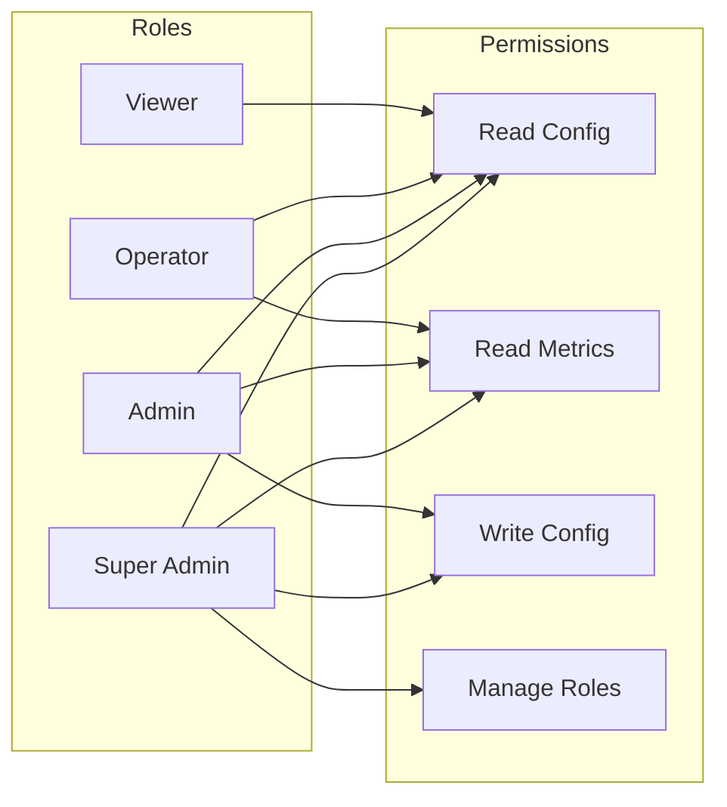
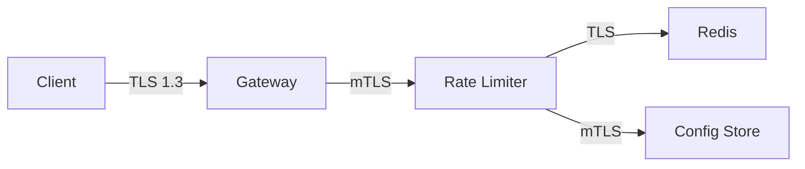
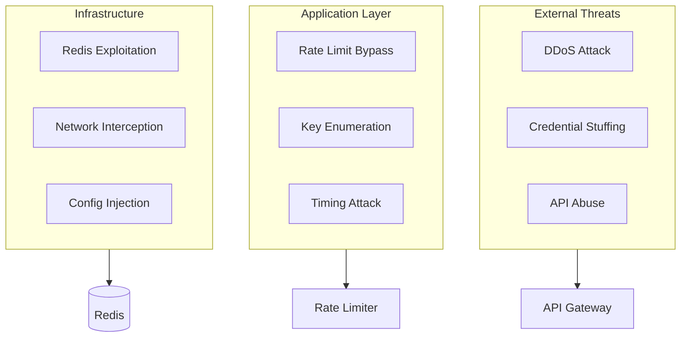
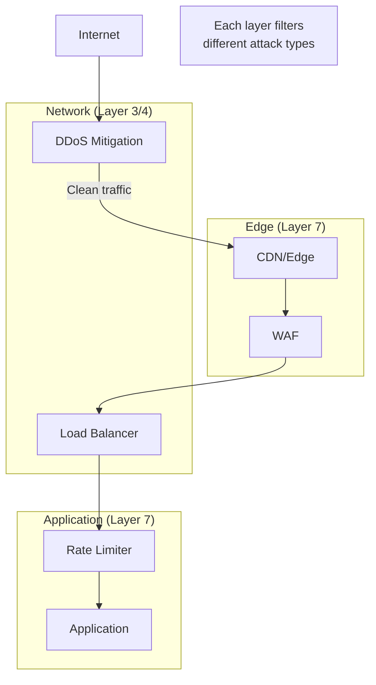

# Security & Compliance

[← Back to Index](./00-index.md)

---

## Authentication & Authorization

### Authentication Mechanisms

| Layer | AuthN Method | Use Case |
|-------|--------------|----------|
| **Client → API Gateway** | OAuth2, API Keys, JWT | User/Service identification |
| **Gateway → Rate Limiter** | mTLS, Internal tokens | Service-to-service |
| **Rate Limiter → Redis** | Redis AUTH, TLS | Data store access |
| **Admin → Config API** | OAuth2 + MFA | Configuration changes |

### Authorization Model

**RBAC (Role-Based Access Control) for Configuration:**

| Role | Permissions |
|------|-------------|
| **viewer** | Read rate limit configs |
| **operator** | Read configs, view metrics |
| **admin** | Full CRUD on configs |
| **super-admin** | Manage roles, audit access |



### Token Management

**API Key Structure:**

```
Format: rl_live_xxxxxxxxxxxxxxxxxxxx (32 chars)
        rl_test_xxxxxxxxxxxxxxxxxxxx (test environment)

Components:
- Prefix: rl_live_ or rl_test_
- Random: 24 cryptographically random characters
- Hash stored: SHA-256(key) stored, never plaintext
```

**JWT Claims for Rate Limiting:**

```
{
  "sub": "user_123",
  "tier": "premium",
  "org_id": "org_456",
  "scopes": ["read", "write"],
  "rate_limit_override": {
    "requests_per_minute": 10000
  },
  "exp": 1640000000
}
```

---

## Data Security

### Encryption at Rest

| Data | Encryption | Key Management |
|------|------------|----------------|
| Redis data | AES-256 (if supported) | KMS or Vault |
| Config store | AES-256 | KMS |
| Audit logs | AES-256 | Separate key |
| Backups | AES-256-GCM | Offline key |

**Note:** Redis open-source doesn't support native encryption at rest. Options:
- Use encrypted volumes at OS level
- Use Redis Enterprise with encryption
- Accept risk for ephemeral counter data

### Encryption in Transit



| Connection | Protocol | Certificate |
|------------|----------|-------------|
| Client → Gateway | TLS 1.3 | Public CA |
| Internal services | mTLS | Internal CA |
| Redis connections | TLS | Internal CA |

### PII Handling

**Data Classification:**

| Data | Classification | Handling |
|------|---------------|----------|
| User ID | Indirect PII | Hash before logging |
| IP Address | PII | Truncate in logs (/24 for IPv4) |
| API Key | Secret | Never log, hash only |
| Request counts | Non-PII | Log freely |
| Timestamps | Non-PII | Log freely |

**Pseudonymization for Analytics:**

```
// Instead of logging raw user_id
log_user_id = SHA-256(user_id + daily_salt)

// Allows correlation within a day, prevents long-term tracking
```

### Data Masking

**Log Masking Rules:**

```
Before: {"user_id": "user_123", "api_key": "rl_live_abc123", "ip": "192.168.1.100"}
After:  {"user_id": "usr_***", "api_key": "rl_***", "ip": "192.168.1.xxx"}
```

---

## Threat Model

### Attack Surface



### Top Attack Vectors & Mitigations

#### 1. DDoS Attack on Rate Limiter

**Threat:** Attackers flood the rate limiter itself, causing it to become a bottleneck.

**Mitigations:**

| Layer | Mitigation |
|-------|------------|
| Edge | CDN with DDoS protection |
| Network | Connection rate limiting at LB |
| Application | Request size limits |
| Infrastructure | Auto-scaling |

```
Defense in Depth:
1. Edge: Block known bad IPs (threat intelligence)
2. CDN: Absorb volumetric attacks
3. Load Balancer: Connection limits (10K/IP)
4. Rate Limiter: Fail-open under extreme load
5. Backend: Protected by rate limiter
```

#### 2. Rate Limit Bypass Attempts

**Threat:** Attackers try to circumvent rate limits.

**Techniques & Defenses:**

| Attack Technique | Defense |
|-----------------|---------|
| Rotate IP addresses | Fingerprinting, account-level limits |
| Create multiple accounts | Phone/email verification, behavior analysis |
| Distribute across time | Sliding window (not fixed window) |
| Spoof headers | Validate at edge, don't trust X-Forwarded-For blindly |
| Clock manipulation | Use server-side time |

#### 3. Key Enumeration

**Threat:** Attackers probe to discover valid API keys or user IDs.

**Defense:**

```
// Constant-time response for key validation
FUNCTION validate_and_rate_limit(key):
    is_valid = secure_compare(hash(key), stored_hash)

    // Always perform rate limit check, even for invalid keys
    rate_limit_result = check_rate_limit(hash(key))

    IF NOT is_valid THEN
        // Don't reveal key doesn't exist
        RETURN {error: "rate_limit_exceeded", retry_after: 60}

    RETURN rate_limit_result
```

#### 4. Timing Attacks

**Threat:** Measure response time to infer information about limits or users.

**Defense:**

```
// Add random jitter to responses
FUNCTION rate_limit_with_timing_protection(request):
    result = check_rate_limit(request)

    // Add 0-5ms random delay to mask timing
    jitter = random(0, 5)
    sleep(jitter)

    RETURN result
```

#### 5. Configuration Injection

**Threat:** Attacker modifies rate limit configs to disable protection.

**Defense:**

| Control | Implementation |
|---------|----------------|
| Access control | Strict RBAC, MFA for admins |
| Audit logging | All config changes logged with user |
| Change approval | Require peer review for critical changes |
| Limits on limits | Max rate cannot exceed safety threshold |
| Rollback | Instant rollback capability |

### Rate Limiting & DDoS Protection Integration



---

## Rate Limit Headers

**Standard Headers (IETF Draft):**

```
HTTP/1.1 200 OK
RateLimit-Limit: 100
RateLimit-Remaining: 75
RateLimit-Reset: 1640000000

// For 429 responses
HTTP/1.1 429 Too Many Requests
RateLimit-Limit: 100
RateLimit-Remaining: 0
RateLimit-Reset: 1640000060
Retry-After: 60
```

**Extended Headers (Custom):**

```
X-RateLimit-Limit-Minute: 100
X-RateLimit-Limit-Hour: 5000
X-RateLimit-Limit-Day: 100000
X-RateLimit-Used-Minute: 25
X-RateLimit-Used-Hour: 1500
X-RateLimit-Policy: "sliding-window"
```

### Response Codes

| Status | Meaning | Retry Strategy |
|--------|---------|----------------|
| **200** | Success, within limits | N/A |
| **429** | Rate limited | Wait for Retry-After |
| **503** | Service unavailable | Exponential backoff |

### Error Response Format

```
{
  "error": {
    "code": "rate_limit_exceeded",
    "message": "Too many requests. Please retry after 60 seconds.",
    "type": "rate_limit",
    "retry_after": 60,
    "limit": 100,
    "remaining": 0,
    "reset_at": "2024-01-15T12:00:00Z",
    "documentation_url": "https://docs.example.com/rate-limiting"
  }
}
```

---

## Compliance Considerations

### GDPR (General Data Protection Regulation)

| Requirement | Implementation |
|-------------|----------------|
| Right to access | Export user's rate limit history |
| Right to erasure | Delete user's rate limit data on request |
| Data minimization | Don't store more than needed |
| Lawful basis | Rate limiting is legitimate interest |

### SOC 2

| Control | Implementation |
|---------|----------------|
| Access control | RBAC, least privilege |
| Audit logging | All admin actions logged |
| Encryption | At rest and in transit |
| Availability | HA design, monitoring |

### PCI-DSS (if handling payments)

| Requirement | Implementation |
|-------------|----------------|
| Req 8: Access control | Strong authentication for admins |
| Req 10: Logging | Audit trail for config changes |
| Req 11: Testing | Regular security assessments |
| Req 12: Policies | Rate limiting security policy |

---

## Security Checklist

### Design Phase
- [ ] Threat model documented
- [ ] Attack surface minimized
- [ ] Defense in depth applied
- [ ] Fail-secure or fail-open decision documented

### Implementation Phase
- [ ] Input validation on all parameters
- [ ] Output encoding in responses
- [ ] Secrets not hardcoded
- [ ] Dependencies scanned for vulnerabilities

### Deployment Phase
- [ ] TLS enabled everywhere
- [ ] Network segmentation applied
- [ ] Least privilege for service accounts
- [ ] Security headers configured

### Operations Phase
- [ ] Audit logging enabled
- [ ] Alerting on suspicious patterns
- [ ] Incident response plan ready
- [ ] Regular security reviews scheduled
