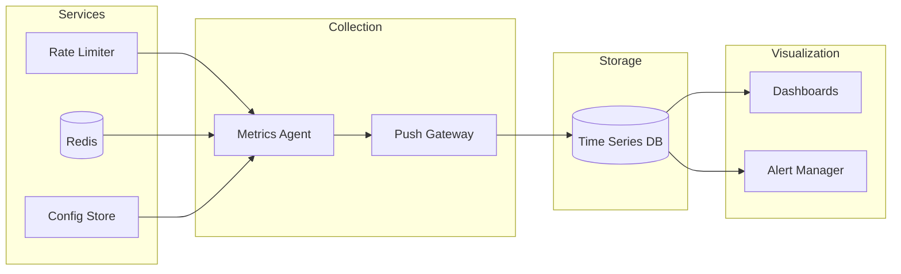
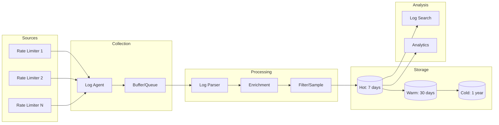
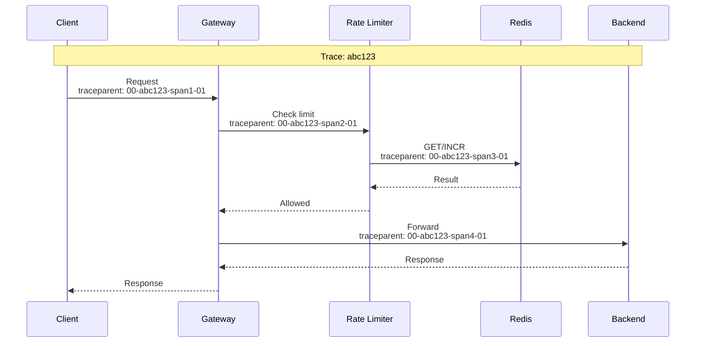
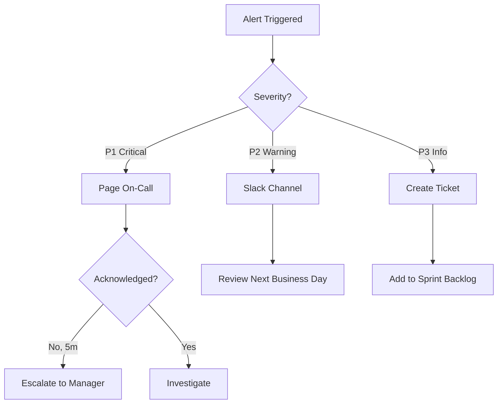

# Observability

[← Back to Index](./00-index.md)

---

## Metrics (USE/RED Method)

### USE Metrics (for Resources)

**U**tilization, **S**aturation, **E**rrors

| Resource | Utilization | Saturation | Errors |
|----------|-------------|------------|--------|
| **Rate Limiter CPU** | cpu_usage_percent | thread_pool_queue_depth | thread_errors_total |
| **Rate Limiter Memory** | memory_used_bytes | gc_pause_duration | oom_kills_total |
| **Redis CPU** | redis_cpu_percent | redis_blocked_clients | redis_errors_total |
| **Redis Memory** | redis_memory_used | redis_memory_fragmentation | redis_evicted_keys |
| **Network** | bandwidth_used_mbps | connection_pool_waiting | connection_errors |

### RED Metrics (for Services)

**R**ate, **E**rrors, **D**uration

| Service | Rate | Errors | Duration |
|---------|------|--------|----------|
| **Rate Limit Checks** | rate_limit_checks_total | rate_limit_errors_total | rate_limit_latency_seconds |
| **Config API** | config_requests_total | config_errors_total | config_latency_seconds |
| **Redis Operations** | redis_commands_total | redis_command_errors | redis_command_duration |

### Key Business Metrics

```
# Requests processed
rate_limit_requests_total{result="allowed|denied", user_tier="free|premium", endpoint="/api/v1/*"}

# Current usage by user
rate_limit_current_usage{user_id="xxx", endpoint="/api/v1/*"}

# Denial rate
rate_limit_denials_total / rate_limit_requests_total

# Users approaching limit (warning zone >80%)
rate_limit_users_in_warning_zone

# Top rate-limited users
topk(10, rate_limit_denials_total) by (user_id)
```

### Metric Collection



---

## Dashboard Design

### Operational Dashboard

```
┌─────────────────────────────────────────────────────────────────┐
│  RATE LIMITER - OPERATIONAL DASHBOARD                          │
├─────────────────────────────────────────────────────────────────┤
│                                                                 │
│  ┌─────────────┐  ┌─────────────┐  ┌─────────────┐  ┌─────────┐│
│  │ Requests/s  │  │ Denial Rate │  │ P99 Latency │  │ Errors  ││
│  │   125,432   │  │    2.3%     │  │    3.2ms    │  │   12    ││
│  │   ▲ 12%     │  │   ▼ 0.5%   │  │   ▲ 0.3ms   │  │  ▼ 5    ││
│  └─────────────┘  └─────────────┘  └─────────────┘  └─────────┘│
│                                                                 │
│  Request Volume (24h)                   Latency Distribution   │
│  ┌──────────────────────────────┐     ┌─────────────────────┐ │
│  │    ▂▃▄▅▆▇█▇▆▅▄▃▂▂▃▄▅▆▇█     │     │ p50: 0.8ms         │ │
│  │  ↑ Peak: 350K QPS @ 14:00   │     │ p95: 2.1ms         │ │
│  └──────────────────────────────┘     │ p99: 3.2ms         │ │
│                                        │ max: 12.5ms        │ │
│  Denial Breakdown                      └─────────────────────┘ │
│  ┌──────────────────────────────┐                              │
│  │ By Tier:                     │     Redis Health             │
│  │   Free: 85% ████████▌        │     ┌─────────────────────┐ │
│  │   Premium: 10% █             │     │ Memory: 62% ███▌    │ │
│  │   Enterprise: 5% ▌           │     │ CPU: 45% ██▌        │ │
│  │                              │     │ Connections: 2,340   │ │
│  │ By Endpoint:                 │     │ Commands/s: 89,000  │ │
│  │   /api/v1/search: 45%       │     └─────────────────────┘ │
│  │   /api/v1/users: 30%        │                              │
│  │   /api/v1/orders: 25%       │                              │
│  └──────────────────────────────┘                              │
└─────────────────────────────────────────────────────────────────┘
```

### User-Facing Dashboard (if exposed)

```
┌─────────────────────────────────────────────────────────────────┐
│  YOUR API USAGE                                                 │
├─────────────────────────────────────────────────────────────────┤
│                                                                 │
│  Current Period: 2024-01-15 12:00 - 13:00 UTC                  │
│                                                                 │
│  ┌─────────────────────────────────────────────────────────────┐│
│  │ Requests Used:  7,523 / 10,000  (75%)                      ││
│  │ [█████████████████████▌                    ]                ││
│  │                                                             ││
│  │ Resets in: 23 minutes                                       ││
│  └─────────────────────────────────────────────────────────────┘│
│                                                                 │
│  Endpoint Breakdown:                                            │
│  ┌───────────────────────┬──────────┬────────────┐             │
│  │ Endpoint              │ Used     │ Limit      │             │
│  ├───────────────────────┼──────────┼────────────┤             │
│  │ /api/v1/search        │ 4,200    │ 5,000/hr   │             │
│  │ /api/v1/users         │ 2,100    │ 3,000/hr   │             │
│  │ /api/v1/orders        │ 1,223    │ 2,000/hr   │             │
│  └───────────────────────┴──────────┴────────────┘             │
│                                                                 │
│  Recent Rate Limited Requests: 3 in last hour                  │
└─────────────────────────────────────────────────────────────────┘
```

---

## Logging

### What to Log

| Event | Log Level | Fields |
|-------|-----------|--------|
| Request allowed | DEBUG | request_id, user_id, endpoint, remaining |
| Request denied | INFO | request_id, user_id, endpoint, limit, reset_at |
| Approaching limit (>80%) | WARN | user_id, current, limit, threshold |
| Config change | INFO | admin_id, change_type, old_value, new_value |
| Redis error | ERROR | error_type, message, retry_count |
| Failover event | WARN | from_node, to_node, reason |
| System startup | INFO | version, config_hash, node_id |

### Log Levels Strategy

```
DEBUG: Every request (only in dev/debug mode)
       - Individual rate limit checks
       - Cache hits/misses

INFO:  Significant events
       - Rate limit denials
       - Config changes
       - Normal startup/shutdown

WARN:  Potential issues
       - Users approaching limits
       - High latency operations
       - Failover events
       - Degraded mode entry

ERROR: Failures requiring attention
       - Redis connection failures
       - Config load errors
       - Unexpected exceptions

FATAL: System cannot continue
       - Startup failures
       - Unrecoverable errors
```

### Structured Logging Format

```
{
  "timestamp": "2024-01-15T12:34:56.789Z",
  "level": "INFO",
  "service": "rate-limiter",
  "node_id": "rl-prod-us-east-1a-001",
  "trace_id": "abc123def456",
  "span_id": "span789",
  "event": "rate_limit_denied",
  "user_id": "usr_***",  // Masked for privacy
  "user_tier": "free",
  "endpoint": "/api/v1/search",
  "current_count": 100,
  "limit": 100,
  "window": "minute",
  "reset_at": "2024-01-15T12:35:00Z",
  "algorithm": "sliding_window_counter",
  "latency_ms": 2.3
}
```

### Log Aggregation Pipeline



---

## Distributed Tracing

### Trace Propagation Strategy



### Key Spans to Instrument

| Span Name | Parent | Attributes |
|-----------|--------|------------|
| `rate_limit.check` | gateway.request | user_id, endpoint, algorithm |
| `rate_limit.cache_lookup` | rate_limit.check | cache_hit, key |
| `rate_limit.redis_get` | rate_limit.check | key, latency |
| `rate_limit.redis_incr` | rate_limit.check | key, new_value |
| `rate_limit.evaluate` | rate_limit.check | result, remaining |

### Sampling Strategy

```
// High-cardinality, sample to reduce volume
Sampling Rules:
- All denied requests: 100% (always trace failures)
- Slow requests (>10ms): 100%
- Random allowed requests: 1%
- Error paths: 100%
- Debug mode: 100%
```

---

## Alerting

### Critical Alerts (Page-Worthy)

| Alert | Condition | Severity | Action |
|-------|-----------|----------|--------|
| **Redis Down** | redis_up == 0 for 1m | P1 | Immediate page |
| **High Error Rate** | error_rate > 1% for 5m | P1 | Page + auto-scale |
| **Latency Spike** | p99 > 50ms for 5m | P1 | Page |
| **All Nodes Failing** | healthy_nodes == 0 | P1 | Immediate page |

### Warning Alerts

| Alert | Condition | Severity | Action |
|-------|-----------|----------|----------|
| **Elevated Denials** | denial_rate > 10% for 15m | P2 | Slack notification |
| **Redis Memory High** | redis_memory > 80% | P2 | Slack + ticket |
| **Single Node Down** | healthy_nodes < expected | P3 | Slack |
| **Config Sync Lag** | config_lag > 60s | P3 | Slack |
| **Approaching Capacity** | qps > 80% of max | P3 | Slack + plan |

### Alert Configuration Example

```
# High Error Rate Alert
alert: RateLimiterHighErrorRate
expr: |
  (
    sum(rate(rate_limit_errors_total[5m]))
    /
    sum(rate(rate_limit_requests_total[5m]))
  ) > 0.01
for: 5m
labels:
  severity: critical
  team: platform
annotations:
  summary: "Rate limiter error rate above 1%"
  description: "Error rate is {{ $value | humanizePercentage }}"
  runbook: "https://wiki.internal/runbooks/rate-limiter-errors"
  dashboard: "https://grafana.internal/d/rate-limiter"
```

### Alert Routing



---

## Runbook References

### Runbook: Rate Limiter High Latency

```
Symptom: p99 latency > 10ms

Steps:
1. Check Redis latency
   - Dashboard: Redis Operations panel
   - If Redis slow, see "Redis Troubleshooting" runbook

2. Check network
   - Ping between rate limiter and Redis
   - Look for packet loss or high RTT

3. Check for hot keys
   - Query: topk(10, rate(redis_commands_total)) by (key)
   - If hot key found, consider key splitting

4. Check rate limiter resources
   - CPU, Memory, GC pauses
   - Scale horizontally if CPU > 70%

5. Check for thundering herd
   - Look for spike in requests after limit reset
   - Enable jittered bucket refill

Escalation: Platform Engineering team
```

### Runbook: Redis Connection Failures

```
Symptom: redis_connection_errors increasing

Steps:
1. Verify Redis is running
   - Check Redis pod/instance status
   - Check Redis Sentinel status

2. Check network connectivity
   - From rate limiter node: redis-cli ping
   - Check security group / firewall rules

3. Check connection pool
   - Current connections vs max
   - Look for connection leaks

4. If failover in progress
   - Wait for Sentinel to complete
   - Verify new primary is accepting writes

5. If Redis restarted
   - Check memory (OOM kill?)
   - Check disk (RDB/AOF issues?)

Emergency: Enable fail-open mode if Redis unrecoverable
```

---

## Observability Checklist

### Pre-Launch

- [ ] Metrics collection configured
- [ ] Dashboards created and tested
- [ ] Alerts defined with appropriate thresholds
- [ ] Runbooks written for all P1/P2 alerts
- [ ] Log aggregation pipeline working
- [ ] Tracing instrumented for key paths
- [ ] On-call rotation defined

### Post-Launch

- [ ] Alert noise level acceptable (<5 alerts/week)
- [ ] Dashboards used by team regularly
- [ ] Logs searchable and retained per policy
- [ ] Traces help debug issues effectively
- [ ] Metrics inform capacity planning
