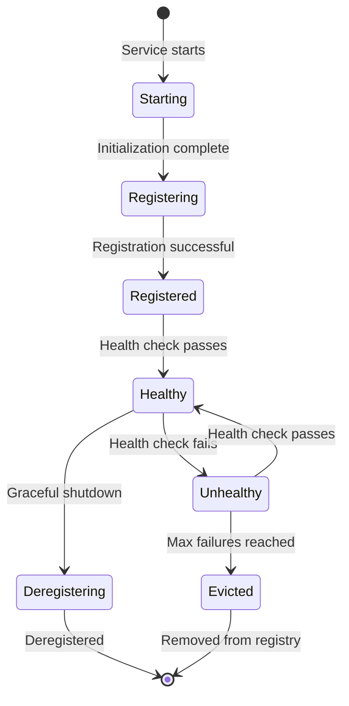

# Service Discovery System

[← Back to System Design Index](../README.md)

---

## Overview

**Service Discovery** is the process by which services locate and communicate with each other in a distributed system. In microservices architectures, where services are dynamically scaled, deployed across multiple hosts, and frequently updated, hardcoding service locations becomes impractical. Service discovery provides a mechanism for services to register their availability and for clients to find healthy service instances.

The core problem service discovery solves is: *"How does Service A find where Service B is running right now?"* when Service B might have multiple instances, instances may come and go, and their IP addresses/ports change dynamically.

---

## Complexity Rating

| Aspect | Rating | Justification |
|--------|--------|---------------|
| **Overall** | **Medium** | Core concepts are straightforward, but production concerns add complexity |
| Core Concept | Low | Registry + lookup is intuitive |
| Health Checking | Medium | Balancing accuracy vs. overhead is nuanced |
| Consistency Models | Medium-High | CP vs. AP trade-offs affect availability |
| Multi-Datacenter | High | WAN latency, eventual consistency, failover |

---

## Key Characteristics

| Characteristic | Value | Implication |
|----------------|-------|-------------|
| Registration Latency | < 100ms | Services visible quickly after startup |
| Lookup Latency | < 10ms (cached < 1ms) | On critical path for every request |
| Health Check Interval | 10-30 seconds | Balance between freshness and overhead |
| Stale Data Window | 30-90 seconds | Time to detect and propagate failures |
| Registry Availability | 99.99%+ | Single point of failure concern |
| Instance Metadata | 1-10 KB/instance | Labels, tags, health endpoints |

---

## Quick Navigation

| Document | Description |
|----------|-------------|
| [01 - Requirements & Estimations](./01-requirements-and-estimations.md) | Functional/NFR, capacity planning (10K instances), SLOs |
| [02 - High-Level Design](./02-high-level-design.md) | Architecture, client-side vs server-side vs DNS discovery |
| [03 - Low-Level Design](./03-low-level-design.md) | Data model, APIs, registration/lookup/health algorithms |
| [04 - Deep Dive & Bottlenecks](./04-deep-dive-and-bottlenecks.md) | Health checking trade-offs, CP vs AP, multi-DC |
| [05 - Scalability & Reliability](./05-scalability-and-reliability.md) | Registry clustering, failover, self-preservation |
| [06 - Security & Compliance](./06-security-and-compliance.md) | mTLS, ACLs, registry poisoning threats |
| [07 - Observability](./07-observability.md) | Registration/discovery metrics, alerting, dashboards |
| [08 - Interview Guide](./08-interview-guide.md) | 45-min pacing, trap questions, implementation comparison |

---

## Discovery Patterns Comparison

| Pattern | Description | Pros | Cons | Examples |
|---------|-------------|------|------|----------|
| **Client-Side Discovery** | Client queries registry, performs load balancing | Client has full control, no extra hop | Client needs discovery logic | Netflix Eureka, Zookeeper clients |
| **Server-Side Discovery** | Load balancer/proxy queries registry | Simple clients, transparent | Extra network hop, LB is SPOF | Kubernetes Services, AWS ALB |
| **DNS-Based Discovery** | DNS resolution returns service IPs | Universal compatibility, simple | TTL caching, no health integration | CoreDNS, Route53, Consul DNS |
| **Service Mesh Sidecar** | Sidecar proxy handles discovery | App-agnostic, rich features | Resource overhead per pod | Istio, Linkerd, Envoy |

### When to Use Each Pattern

```
┌─────────────────────────────────────────────────────────────────────┐
│                    DISCOVERY PATTERN SELECTION                       │
├─────────────────────────────────────────────────────────────────────┤
│                                                                      │
│  Client-Side Discovery                                               │
│  ├── When: Custom load balancing logic needed                        │
│  ├── When: Client can handle discovery complexity                    │
│  ├── Example: Java microservices with Eureka client                  │
│  └── Trade-off: Client libraries per language                        │
│                                                                      │
│  Server-Side Discovery                                               │
│  ├── When: Simple clients (CLI, scripts, legacy)                     │
│  ├── When: Centralized routing/policies needed                       │
│  ├── Example: Kubernetes Services with kube-proxy                    │
│  └── Trade-off: Load balancer is critical infrastructure             │
│                                                                      │
│  DNS-Based Discovery                                                 │
│  ├── When: Universal compatibility required                          │
│  ├── When: Low churn rate (infrequent changes)                       │
│  ├── Example: Traditional DNS with health checks                     │
│  └── Trade-off: Stale TTL caching, limited metadata                  │
│                                                                      │
│  Service Mesh                                                        │
│  ├── When: Multi-language polyglot architecture                      │
│  ├── When: Need mTLS, observability, traffic management              │
│  ├── Example: Istio with Envoy sidecars                              │
│  └── Trade-off: Operational complexity, resource overhead            │
│                                                                      │
└─────────────────────────────────────────────────────────────────────┘
```

---

## Real-World Implementations

| System | Protocol | Consistency | Key Innovation |
|--------|----------|-------------|----------------|
| **Consul** | Gossip (Serf) + Raft | CP (Raft) for KV, AP (Gossip) for membership | Multi-DC WAN federation, DNS interface, health checks |
| **Eureka** | HTTP/REST | AP (eventual consistency) | Self-preservation mode, client-side caching |
| **etcd** | gRPC/Raft | CP (strong consistency) | Watch mechanism, lease-based registration |
| **ZooKeeper** | ZAB Protocol | CP (linearizable) | Ephemeral nodes, session management |
| **CoreDNS** | DNS/gRPC | Depends on backend | Kubernetes-native, plugin architecture |
| **Nacos** | HTTP/gRPC | AP or CP (configurable) | Config + discovery unified, Chinese ecosystem |

### Implementation Comparison

| Feature | Consul | Eureka | etcd | ZooKeeper |
|---------|--------|--------|------|-----------|
| **CAP Model** | CP + AP (configurable) | AP | CP | CP |
| **Health Checks** | Push + Pull | Client heartbeat | Lease TTL | Session heartbeat |
| **Multi-DC** | Native WAN federation | Zone awareness | Requires proxy | Observer nodes |
| **DNS Interface** | Yes | No | No | No |
| **ACL/Security** | Built-in ACL + mTLS | Basic auth | RBAC + mTLS | ACL + SASL |
| **Client Libraries** | Multi-language | Java-centric | Multi-language | Multi-language |
| **Deployment** | Standalone/Kubernetes | Standalone | Kubernetes-native | Standalone |

---

## The Problem Service Discovery Solves

### Without Service Discovery

```
┌─────────────────────────────────────────────────────────────────────┐
│  STATIC CONFIGURATION (THE OLD WAY)                                  │
├─────────────────────────────────────────────────────────────────────┤
│                                                                      │
│  config.yaml:                                                        │
│    payment_service:                                                  │
│      - host: 10.0.1.1                                               │
│        port: 8080                                                    │
│      - host: 10.0.1.2                                               │
│        port: 8080                                                    │
│                                                                      │
│  PROBLEMS:                                                           │
│                                                                      │
│  1. Manual updates required when instances change                   │
│     → Deploy new config → Restart all clients                        │
│                                                                      │
│  2. No automatic failover                                           │
│     → Instance crashes → Clients still try to connect               │
│                                                                      │
│  3. No load balancing awareness                                     │
│     → Overloaded instance → Clients don't know                      │
│                                                                      │
│  4. Doesn't scale with dynamic infrastructure                       │
│     → Auto-scaling adds instances → Config doesn't update           │
│                                                                      │
└─────────────────────────────────────────────────────────────────────┘
```

### With Service Discovery

```
┌─────────────────────────────────────────────────────────────────────┐
│  DYNAMIC DISCOVERY (THE MODERN WAY)                                  │
├─────────────────────────────────────────────────────────────────────┤
│                                                                      │
│  1. Service Registers Itself                                        │
│     payment-service-1 → Registry: "I'm at 10.0.1.1:8080"           │
│                                                                      │
│  2. Client Discovers Dynamically                                    │
│     order-service → Registry: "Where is payment-service?"           │
│     Registry → order-service: [10.0.1.1:8080, 10.0.1.2:8080]       │
│                                                                      │
│  3. Health Monitoring                                               │
│     Registry ← payment-service-1: heartbeat ✓                       │
│     Registry ← payment-service-2: heartbeat ✗ (timeout)            │
│     Registry: mark payment-service-2 as unhealthy                   │
│                                                                      │
│  4. Client Gets Updated List                                        │
│     order-service → Registry: "Where is payment-service?"           │
│     Registry → order-service: [10.0.1.1:8080] (only healthy)       │
│                                                                      │
│  BENEFITS:                                                           │
│  ✓ Zero-touch scaling (new instances auto-register)                 │
│  ✓ Automatic failover (unhealthy instances removed)                 │
│  ✓ Load balancing aware (clients see current state)                 │
│  ✓ Multi-datacenter support (geo-aware routing)                     │
│                                                                      │
└─────────────────────────────────────────────────────────────────────┘
```

---

## Core Concepts at a Glance

### Service Lifecycle



### Instance State Machine

```
┌─────────────────────────────────────────────────────────────────────┐
│  INSTANCE HEALTH STATE MACHINE                                       │
├─────────────────────────────────────────────────────────────────────┤
│                                                                      │
│                    ┌──────────┐                                      │
│                    │ UNKNOWN  │ (Initial state)                      │
│                    └────┬─────┘                                      │
│                         │ First health check                         │
│           ┌─────────────┴─────────────┐                              │
│           ▼                           ▼                              │
│     ┌─────────┐                ┌───────────┐                         │
│     │ HEALTHY │◄──────────────►│ UNHEALTHY │                         │
│     └────┬────┘  Check passes  └─────┬─────┘                         │
│          │       / fails             │                               │
│          │                           │ N consecutive failures        │
│          │ Graceful                  ▼                               │
│          │ shutdown           ┌──────────┐                           │
│          │                    │ EVICTED  │                           │
│          ▼                    └──────────┘                           │
│   ┌─────────────┐                    │                               │
│   │DEREGISTERED │◄───────────────────┘                               │
│   └─────────────┘     Cleanup                                        │
│                                                                      │
│  Transitions:                                                        │
│    UNKNOWN → HEALTHY: First successful health check                  │
│    UNKNOWN → UNHEALTHY: First failed health check                    │
│    HEALTHY ↔ UNHEALTHY: Health check result changes                  │
│    UNHEALTHY → EVICTED: Max failures (default: 3) or TTL expired    │
│    HEALTHY → DEREGISTERED: Graceful shutdown signal                  │
│    EVICTED → DEREGISTERED: Cleanup after eviction period            │
│                                                                      │
└─────────────────────────────────────────────────────────────────────┘
```

---

## Key Trade-offs Summary

| Decision | Option A | Option B | Recommendation |
|----------|----------|----------|----------------|
| **Consistency** | CP (Raft/ZAB) - strong | AP (Gossip) - available | AP for discovery, CP for config |
| **Health Check** | Push (client heartbeat) | Pull (registry polls) | Hybrid: push + pull for accuracy |
| **Client Caching** | No cache - always fresh | Cache with TTL | Cache + push invalidation |
| **Registry Deployment** | Embedded (sidecar) | Centralized cluster | Centralized for simplicity |
| **Multi-DC** | Single global registry | Regional registries | Regional with WAN federation |

---

## Interview Readiness Checklist

| Concept | Must Understand | Common Pitfalls |
|---------|----------------|-----------------|
| Why Service Discovery | Dynamic IPs, scaling, failures | Forgetting about container/VM ephemerality |
| Discovery Patterns | Client-side vs server-side vs DNS | Not knowing trade-offs between patterns |
| Health Checking | Push vs pull, intervals, thresholds | Not mentioning false positives/negatives |
| Consistency Models | CP vs AP, CAP theorem application | Claiming strong consistency is always best |
| Self-Preservation | Eureka's approach to network partitions | Not knowing how registries handle partitions |
| DNS Limitations | TTL caching, no health integration | Proposing DNS without addressing limitations |
| Multi-DC | WAN federation, latency, consistency | Assuming single-DC design is sufficient |

---

## References & Further Reading

### Engineering Blogs
- [Netflix: Eureka at Scale](https://netflixtechblog.com/)
- [HashiCorp: Consul Architecture](https://developer.hashicorp.com/consul/docs/architecture)
- [Uber: Service Discovery and Load Balancing](https://www.uber.com/blog/)
- [Airbnb: SmartStack](https://medium.com/airbnb-engineering)

### Documentation
- [Consul Documentation](https://developer.hashicorp.com/consul/docs)
- [Netflix Eureka Wiki](https://github.com/Netflix/eureka/wiki)
- [etcd Documentation](https://etcd.io/docs/)
- [Kubernetes Services](https://kubernetes.io/docs/concepts/services-networking/service/)

### Academic Papers
- [Chubby: The Lock Service for Loosely-Coupled Distributed Systems (2006)](https://research.google/pubs/pub27897/)
- [ZooKeeper: Wait-free coordination for Internet-scale systems (2010)](https://www.usenix.org/legacy/events/atc10/tech/full_papers/Hunt.pdf)

---

## Version History

| Version | Date | Changes |
|---------|------|---------|
| 1.0 | 2025-01-20 | Initial comprehensive design |
