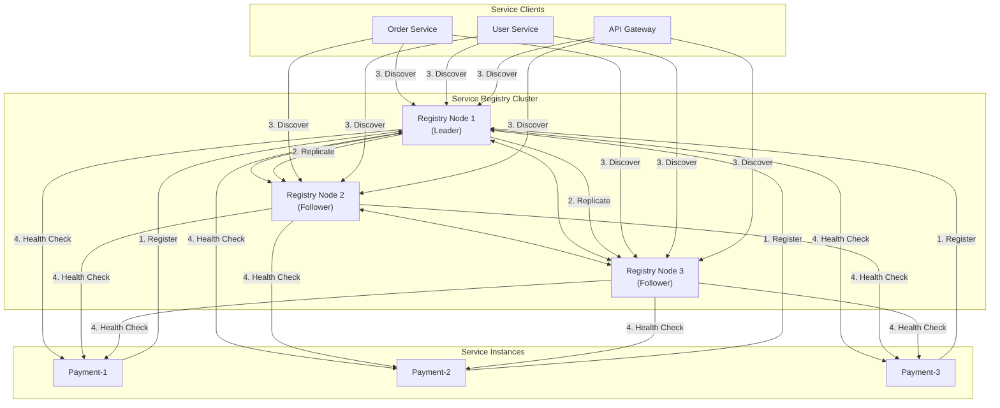
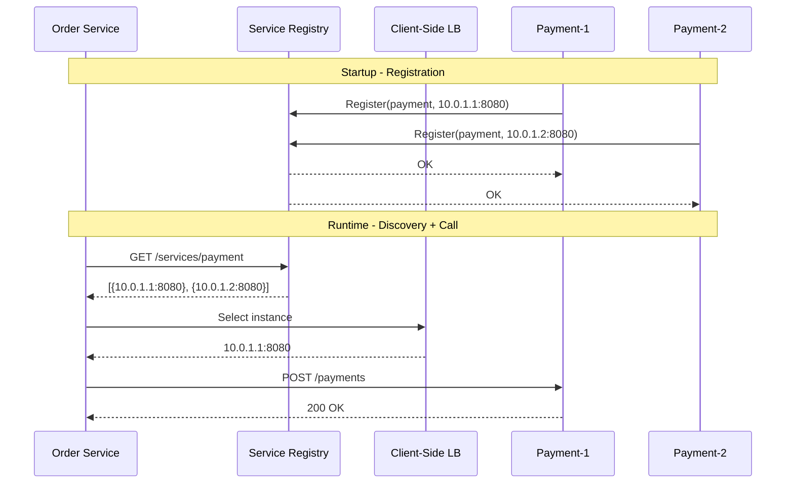
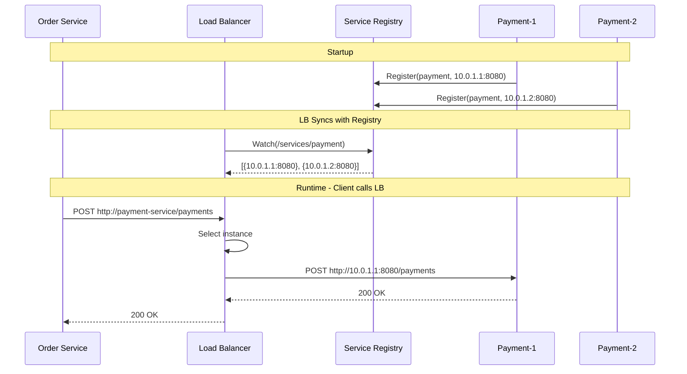
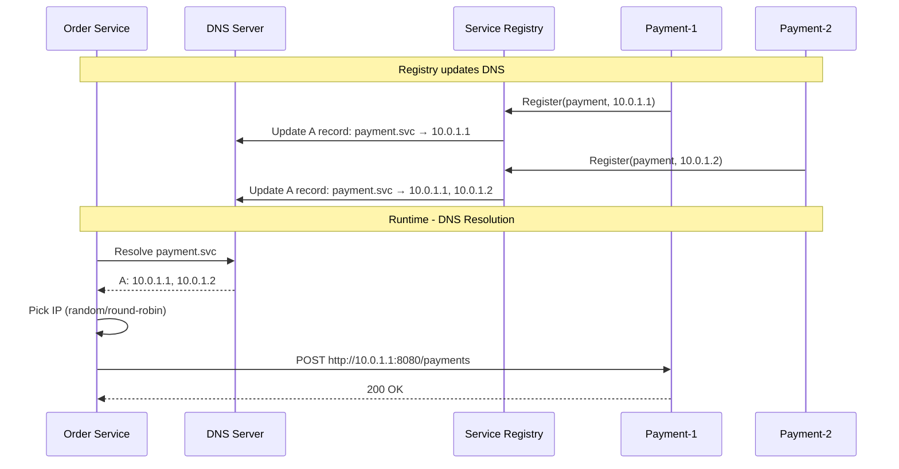
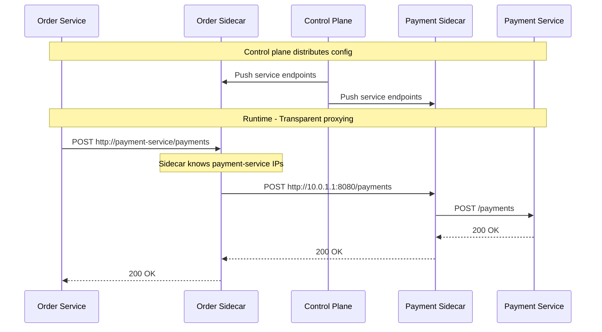
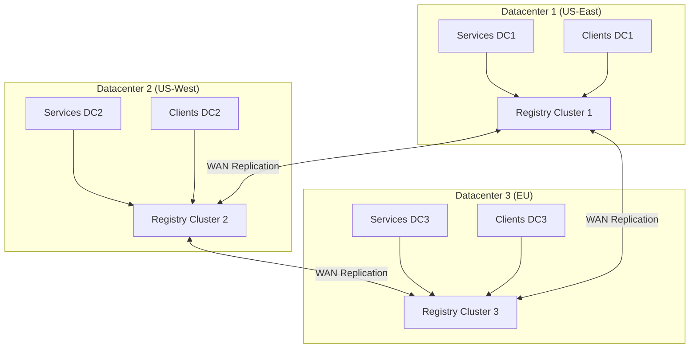
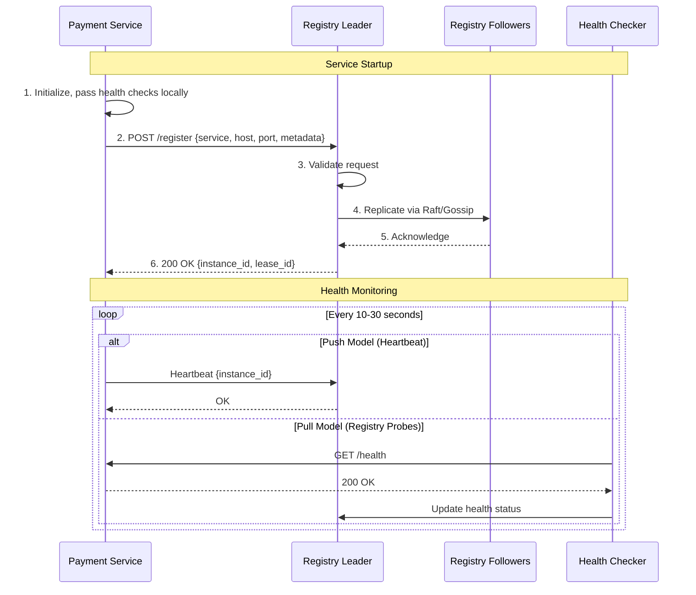
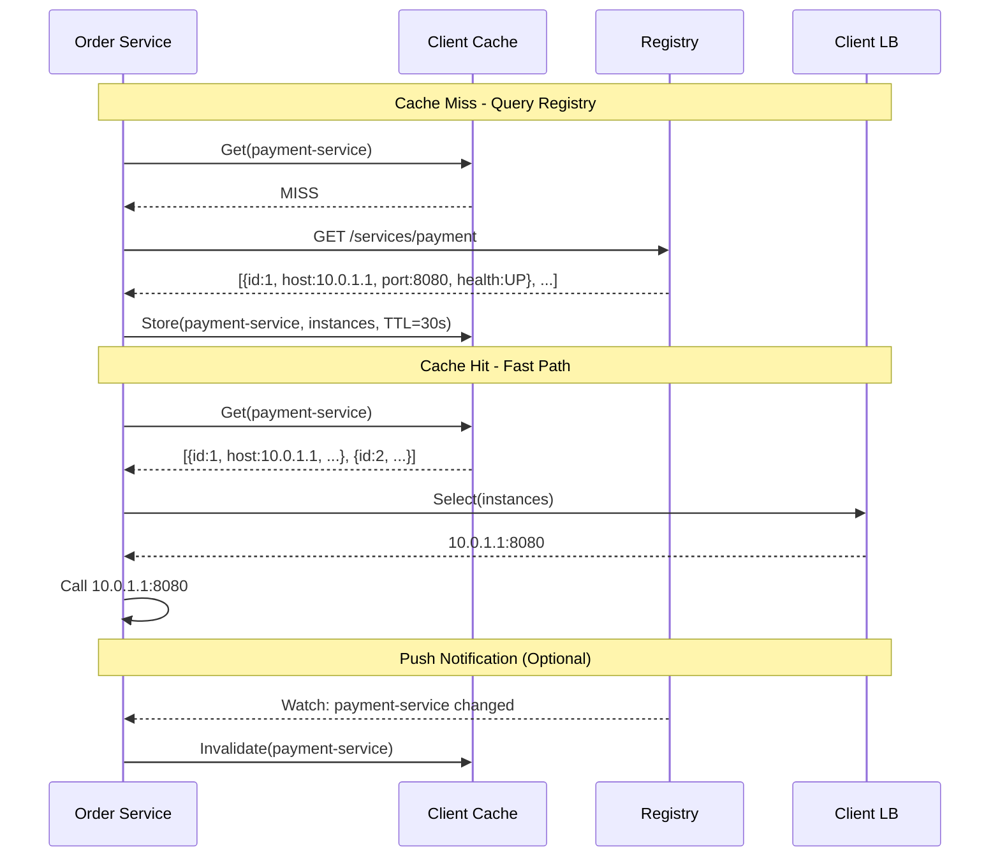
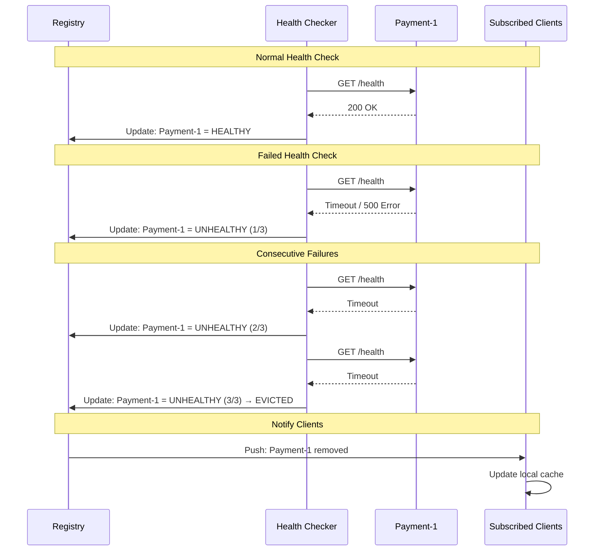
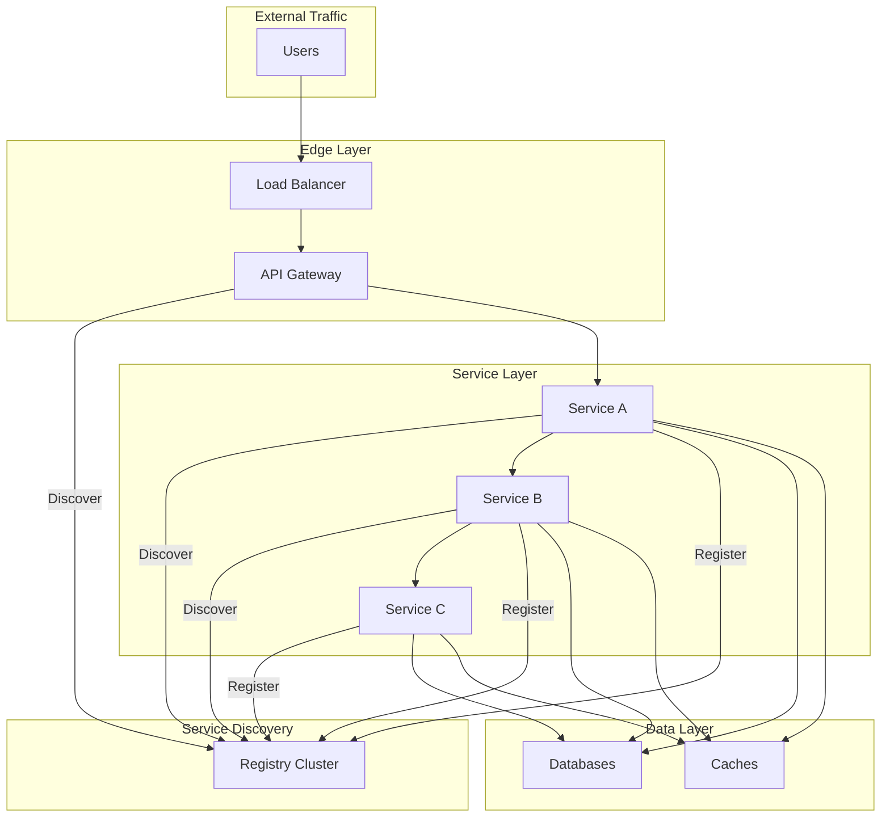

# High-Level Design

[← Back to Index](./00-index.md)

---

## System Architecture Overview

### Core Components



### Component Responsibilities

| Component | Responsibility | Data Managed |
|-----------|---------------|--------------|
| **Registry Cluster** | Store service info, health check, serve queries | Instance records, health states |
| **Service Instance** | Register, heartbeat, serve business logic | Own metadata, health status |
| **Service Client** | Discover services, load balance, circuit break | Cached service list |
| **Health Checker** | Monitor instance health, update status | Health check results |

---

## Discovery Patterns Deep Dive

### Pattern 1: Client-Side Discovery

Client queries the registry directly and performs load balancing locally.



**Implementation Examples:**
- Netflix Eureka with Ribbon client
- Consul with client libraries
- ZooKeeper with Curator

**Pros:**
- Client has full control over load balancing
- No single point of failure in routing
- Can implement sophisticated routing (weighted, latency-based)

**Cons:**
- Client must include discovery library
- Library needed for each language
- Client complexity increases

---

### Pattern 2: Server-Side Discovery

Load balancer or proxy queries the registry; clients are unaware of discovery.



**Implementation Examples:**
- Kubernetes Services (kube-proxy)
- AWS Application Load Balancer
- HAProxy with Consul template
- NGINX with upstream discovery

**Pros:**
- Simple clients (no discovery logic)
- Centralized routing policies
- Language-agnostic

**Cons:**
- Load balancer is critical path
- Extra network hop
- Load balancer can become bottleneck

---

### Pattern 3: DNS-Based Discovery

Standard DNS resolution returns service IP addresses.



**Implementation Examples:**
- CoreDNS with Kubernetes
- Consul DNS interface
- AWS Route53 health checks
- Internal DNS with low TTL

**Pros:**
- Universal compatibility (every language has DNS)
- No special client libraries
- Works with legacy applications

**Cons:**
- DNS caching causes stale data
- No health check integration (in basic DNS)
- Limited metadata (only IP/port)
- TTL-based freshness (not instant)

---

### Pattern 4: Service Mesh (Sidecar) Discovery

Sidecar proxy handles all discovery transparently.



**Implementation Examples:**
- Istio with Envoy sidecars
- Linkerd
- Consul Connect
- AWS App Mesh

**Pros:**
- Application completely unaware
- Consistent across all languages
- Rich features (mTLS, observability, traffic management)

**Cons:**
- Resource overhead (sidecar per pod)
- Operational complexity
- Latency (two extra hops)

---

## Comparison: Discovery Patterns

| Aspect | Client-Side | Server-Side | DNS-Based | Service Mesh |
|--------|-------------|-------------|-----------|--------------|
| **Client Complexity** | High | Low | Low | Low |
| **Network Hops** | 0 extra | 1 extra | 0 extra | 2 extra |
| **Single Point of Failure** | None | Load Balancer | DNS Server | Control Plane |
| **Language Support** | Library per lang | Any | Any | Any |
| **Metadata Support** | Full | Limited | None | Full |
| **Health Integration** | Yes | Yes | Limited | Yes |
| **Resource Overhead** | Client memory | LB resources | Minimal | Sidecar per pod |

---

## High-Level Architecture

### Single Datacenter Architecture

```
┌─────────────────────────────────────────────────────────────────────┐
│                       SINGLE DC ARCHITECTURE                         │
├─────────────────────────────────────────────────────────────────────┤
│                                                                      │
│  ┌─────────────────────────────────────────────────────────────┐   │
│  │                    Service Registry Cluster                   │   │
│  │  ┌─────────┐    ┌─────────┐    ┌─────────┐                  │   │
│  │  │ Node 1  │◄──►│ Node 2  │◄──►│ Node 3  │                  │   │
│  │  │(Leader) │    │(Follower)│   │(Follower)│                  │   │
│  │  └────┬────┘    └────┬────┘    └────┬────┘                  │   │
│  │       │              │              │                        │   │
│  │       └──────────────┼──────────────┘                        │   │
│  │                      │                                        │   │
│  │              Raft Consensus / Gossip                          │   │
│  └──────────────────────┼───────────────────────────────────────┘   │
│                         │                                            │
│      ┌──────────────────┼──────────────────┐                        │
│      │                  │                  │                        │
│      ▼                  ▼                  ▼                        │
│  ┌───────┐         ┌───────┐         ┌───────┐                     │
│  │Service│ Register│Service│ Register│Service│                     │
│  │  A-1  │─────────│  A-2  │─────────│  B-1  │                     │
│  └───┬───┘         └───┬───┘         └───┬───┘                     │
│      │                 │                 │                          │
│      │ Health          │ Health          │ Health                   │
│      │ Checks          │ Checks          │ Checks                   │
│      ▼                 ▼                 ▼                          │
│  ┌───────────────────────────────────────────────────────────────┐ │
│  │                        Clients                                 │ │
│  │  ┌─────────┐    ┌─────────┐    ┌─────────┐                   │ │
│  │  │Client 1 │    │Client 2 │    │Client 3 │                   │ │
│  │  │(cached) │    │(cached) │    │(cached) │                   │ │
│  │  └─────────┘    └─────────┘    └─────────┘                   │ │
│  └───────────────────────────────────────────────────────────────┘ │
│                                                                      │
└─────────────────────────────────────────────────────────────────────┘
```

### Multi-Datacenter Architecture



### WAN Federation Detail

```
┌─────────────────────────────────────────────────────────────────────┐
│  MULTI-DC FEDERATION                                                 │
├─────────────────────────────────────────────────────────────────────┤
│                                                                      │
│  DC1 (Primary)                    DC2 (Secondary)                   │
│  ┌─────────────┐                  ┌─────────────┐                   │
│  │  Registry   │    WAN Gossip    │  Registry   │                   │
│  │  Cluster    │◄────────────────►│  Cluster    │                   │
│  │  (5 nodes)  │   ~100ms RTT     │  (5 nodes)  │                   │
│  └──────┬──────┘                  └──────┬──────┘                   │
│         │                                │                          │
│  Local Services                   Local Services                    │
│  ┌─────────────┐                  ┌─────────────┐                   │
│  │ payment-1   │                  │ payment-3   │                   │
│  │ payment-2   │                  │ payment-4   │                   │
│  │ user-1      │                  │ user-2      │                   │
│  └─────────────┘                  └─────────────┘                   │
│                                                                      │
│  Query Flow:                                                         │
│  1. Client in DC1 queries local registry                            │
│  2. Local registry returns:                                         │
│     - DC1 services (preferred, low latency)                         │
│     - DC2 services (fallback, higher latency)                       │
│  3. Client prefers local but can failover cross-DC                  │
│                                                                      │
│  Replication Strategy:                                               │
│  - Service catalog: Replicated (eventually consistent)              │
│  - Health status: Local only (too expensive cross-WAN)              │
│  - Cross-DC health via periodic sync or on-demand probe            │
│                                                                      │
└─────────────────────────────────────────────────────────────────────┘
```

---

## Data Flow

### Registration Flow



### Discovery Flow



### Health Check Flow



---

## Key Architectural Decisions

### Decision 1: Consistency Model

| Option | Pros | Cons | Choose When |
|--------|------|------|-------------|
| **CP (Raft/ZAB)** | Strong consistency, no stale reads | Unavailable during partition | Configuration, leader election |
| **AP (Gossip)** | Always available, partition tolerant | Eventual consistency, stale reads possible | Service discovery at scale |
| **Hybrid** | Best of both | Complexity | Production systems (Consul) |

**Recommendation:** AP for discovery (availability critical), CP for coordination.

### Decision 2: Health Check Model

| Option | Pros | Cons | Choose When |
|--------|------|------|-------------|
| **Push (Heartbeat)** | Service controls timing, less registry load | Requires service changes | Service supports heartbeat |
| **Pull (Registry probes)** | No service changes needed | Registry load increases | Legacy services, black-box |
| **Hybrid** | Comprehensive coverage | Complexity | Production (Consul approach) |

**Recommendation:** Hybrid - heartbeat for registration renewal, pull for health verification.

### Decision 3: Client Caching

| Option | Pros | Cons | Choose When |
|--------|------|------|-------------|
| **No Cache** | Always fresh | High registry load, latency | Development, very small scale |
| **TTL Cache** | Reduced load, fast | Can serve stale | Most cases (30-60s TTL) |
| **TTL + Push Invalidation** | Fresh + fast | Requires watch support | Production with watch support |

**Recommendation:** TTL cache (30s) with push invalidation when available.

### Decision 4: Registry Deployment

| Option | Pros | Cons | Choose When |
|--------|------|------|-------------|
| **Embedded** | No extra infra | Coupled to application | Edge, IoT |
| **Sidecar** | App-independent | Resource per pod | Service mesh |
| **Centralized Cluster** | Simple ops, shared | Single point of concern | Most deployments |

**Recommendation:** Centralized cluster for most cases; sidecar for service mesh.

---

## Integration Points

### Where Service Discovery Fits



### Common Integration Patterns

| Integration | Purpose | Example |
|-------------|---------|---------|
| **API Gateway** | Route to discovered backends | Kong + Consul, NGINX + service discovery |
| **Load Balancer** | Update backend pools | HAProxy + Consul template |
| **Service Mesh** | Sidecar endpoint config | Istio control plane |
| **Config Management** | Service-specific config | Consul KV, Spring Cloud Config |
| **Secrets Management** | Per-service secrets | Vault + service identity |
| **Monitoring** | Auto-discover scrape targets | Prometheus + Consul |
