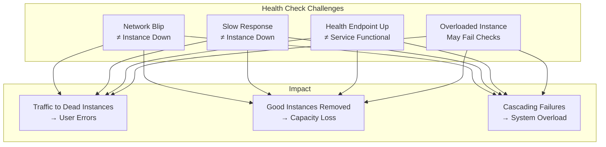
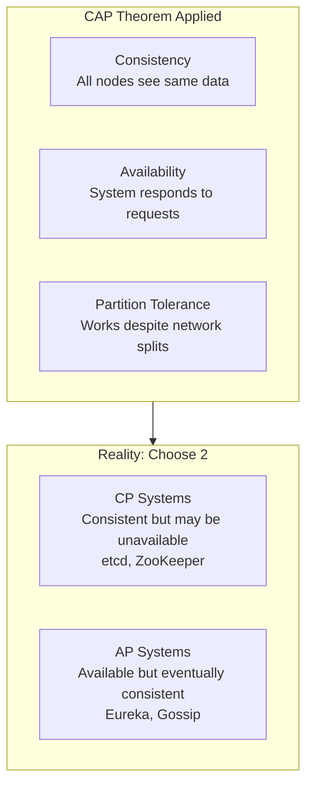
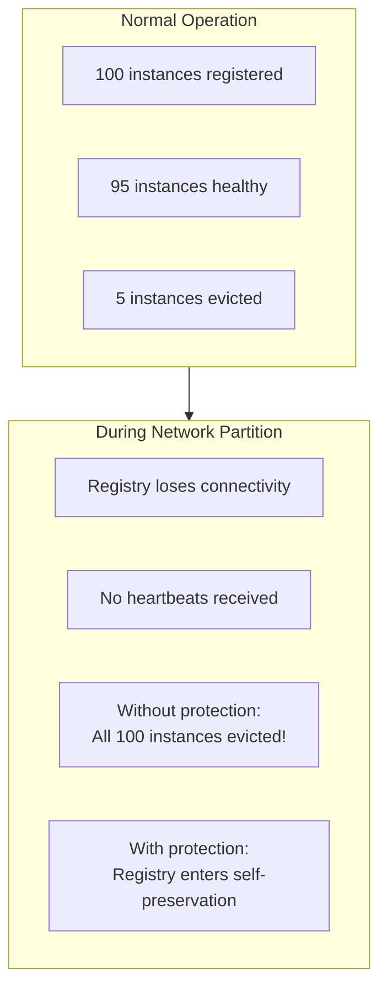

# Deep Dive & Bottlenecks

[← Back to Index](./00-index.md)

---

## Critical Component 1: Health Checking

### Why Health Checking Is Critical

Health checking determines which instances receive traffic. Poor health checking leads to:
- **False Positives**: Healthy instances marked DOWN → reduced capacity
- **False Negatives**: Unhealthy instances marked UP → request failures
- **Flapping**: Rapid UP/DOWN transitions → routing instability



### Health Check Models Comparison

| Model | How It Works | Pros | Cons |
|-------|-------------|------|------|
| **Push (Heartbeat)** | Instance sends periodic heartbeats to registry | Service controls timing, less registry load | Requires service modification, firewall issues |
| **Pull (Polling)** | Registry periodically probes instance | No service changes, works with legacy | Registry load scales with instances |
| **Hybrid** | Heartbeat for liveness, pull for readiness | Comprehensive | Complexity |

### Push vs. Pull Deep Dive

```
┌─────────────────────────────────────────────────────────────────────┐
│  PUSH MODEL (HEARTBEAT)                                              │
├─────────────────────────────────────────────────────────────────────┤
│                                                                      │
│  Instance ──heartbeat──► Registry                                   │
│  Instance ──heartbeat──► Registry                                   │
│  Instance ──────X────── Registry (missed)                           │
│  Instance ──────X────── Registry (missed → mark DOWN)               │
│                                                                      │
│  Pros:                                                               │
│  + Service controls check timing                                    │
│  + Lower registry CPU/network load                                   │
│  + Scales better (N instances send, not N probes)                   │
│  + Works through NAT (outbound connections)                          │
│                                                                      │
│  Cons:                                                               │
│  - Requires service to implement heartbeat logic                    │
│  - Can't detect "zombie" processes (running but not healthy)        │
│  - Clock skew can cause premature expiration                         │
│  - Network partition: registry thinks instance is down               │
│                                                                      │
│  Best For: High instance count, service supports heartbeat           │
│                                                                      │
└─────────────────────────────────────────────────────────────────────┘

┌─────────────────────────────────────────────────────────────────────┐
│  PULL MODEL (REGISTRY PROBES)                                        │
├─────────────────────────────────────────────────────────────────────┤
│                                                                      │
│  Registry ──GET /health──► Instance                                  │
│  Registry ◄──200 OK──────── Instance                                │
│  Registry ──GET /health──► Instance                                  │
│  Registry ◄──500 Error───── Instance (mark failing)                 │
│                                                                      │
│  Pros:                                                               │
│  + No service modification needed                                    │
│  + Can verify actual endpoint functionality                          │
│  + Detects zombie processes                                          │
│  + Registry has full control over check logic                        │
│                                                                      │
│  Cons:                                                               │
│  - Registry load increases with instance count                      │
│  - Firewall rules needed (registry → instances)                     │
│  - Check timing controlled by registry, not service                 │
│  - Distributed health checkers need coordination                     │
│                                                                      │
│  Best For: Legacy services, black-box monitoring, few instances      │
│                                                                      │
└─────────────────────────────────────────────────────────────────────┘

┌─────────────────────────────────────────────────────────────────────┐
│  HYBRID MODEL (CONSUL APPROACH)                                      │
├─────────────────────────────────────────────────────────────────────┤
│                                                                      │
│  1. Heartbeat for Liveness:                                         │
│     Instance ──heartbeat──► Registry (every 10s)                    │
│     "I'm alive and want to stay registered"                         │
│                                                                      │
│  2. Pull for Readiness:                                             │
│     Registry ──GET /health──► Instance (every 30s)                  │
│     "Are you actually ready to serve traffic?"                       │
│                                                                      │
│  3. Local Agent (Consul):                                           │
│     Local Agent ──check──► Instance (same host)                     │
│     Avoids cross-network health check traffic                        │
│                                                                      │
│  States:                                                             │
│  - Heartbeat ✓ + Health ✓ → UP                                      │
│  - Heartbeat ✓ + Health ✗ → UNHEALTHY (still registered)           │
│  - Heartbeat ✗ → EVICTED (regardless of health)                     │
│                                                                      │
└─────────────────────────────────────────────────────────────────────┘
```

### Health Check Timing Trade-offs

| Parameter | Short (e.g., 5s) | Long (e.g., 60s) | Recommendation |
|-----------|------------------|------------------|----------------|
| **Check Interval** | Faster detection, higher load | Slower detection, lower load | 10-30s for most cases |
| **Timeout** | More false positives on slow response | Delayed detection of failures | 5-10s (< interval) |
| **Healthy Threshold** | Faster recovery, risk of flapping | Slower recovery, stable | 2-3 consecutive |
| **Unhealthy Threshold** | Faster detection, risk of false positives | Tolerates transient failures | 2-3 consecutive |

### Preventing False Positives and Negatives

```
┌─────────────────────────────────────────────────────────────────────┐
│  FALSE POSITIVE MITIGATION                                           │
│  (Healthy instance incorrectly marked DOWN)                          │
├─────────────────────────────────────────────────────────────────────┤
│                                                                      │
│  Problem: Single network blip causes instance removal                │
│                                                                      │
│  Solutions:                                                          │
│  1. Consecutive failure threshold (3+ failures before DOWN)          │
│  2. Longer timeout (tolerate slow responses)                        │
│  3. Multiple health check types (HTTP + TCP)                        │
│  4. Jitter in check timing (avoid synchronized checks)              │
│  5. Local agent checks (avoid cross-network failures)               │
│                                                                      │
└─────────────────────────────────────────────────────────────────────┘

┌─────────────────────────────────────────────────────────────────────┐
│  FALSE NEGATIVE MITIGATION                                           │
│  (Unhealthy instance incorrectly marked UP)                          │
├─────────────────────────────────────────────────────────────────────┤
│                                                                      │
│  Problem: Health endpoint returns 200, but service is broken         │
│                                                                      │
│  Solutions:                                                          │
│  1. Deep health checks (verify dependencies: DB, cache)              │
│  2. Functional health checks (actual request processing)             │
│  3. Synthetic transactions (test real user flows)                    │
│  4. Readiness vs. liveness separation                               │
│  5. Request error rate monitoring (circuit breaker feedback)         │
│                                                                      │
└─────────────────────────────────────────────────────────────────────┘
```

---

## Critical Component 2: Consistency Models (CP vs. AP)

### The CAP Trade-off in Service Discovery



### CP Systems (Strong Consistency)

```
┌─────────────────────────────────────────────────────────────────────┐
│  CP SYSTEMS: etcd, ZooKeeper, Consul (Raft mode)                    │
├─────────────────────────────────────────────────────────────────────┤
│                                                                      │
│  How It Works:                                                       │
│  - Leader handles all writes                                        │
│  - Writes replicated to majority before acknowledged                 │
│  - Reads can go to leader (linearizable) or followers               │
│                                                                      │
│  Registration Flow:                                                  │
│  Service ──register──► Leader                                       │
│  Leader ──replicate──► Follower1, Follower2                        │
│  Follower1, Follower2 ──ack──► Leader                              │
│  Leader ──success──► Service (only after majority ack)              │
│                                                                      │
│  During Partition:                                                   │
│  ┌─────────────────┐       ┌─────────────────┐                      │
│  │ Minority Side   │       │ Majority Side   │                      │
│  │                 │   X   │                 │                      │
│  │ Leader (old)    │◄─────►│ Followers       │                      │
│  │ Cannot write!   │       │ Elect new leader│                      │
│  │ Rejects reqs    │       │ Accepts writes  │                      │
│  └─────────────────┘       └─────────────────┘                      │
│                                                                      │
│  Pros:                                                               │
│  + Strong consistency - no stale reads                              │
│  + Well-suited for configuration, leader election                   │
│                                                                      │
│  Cons:                                                               │
│  - Unavailable during partition (minority side)                     │
│  - Higher latency (wait for majority)                               │
│  - Leader bottleneck for writes                                     │
│                                                                      │
└─────────────────────────────────────────────────────────────────────┘
```

### AP Systems (High Availability)

```
┌─────────────────────────────────────────────────────────────────────┐
│  AP SYSTEMS: Eureka, Consul (Gossip), Nacos (AP mode)               │
├─────────────────────────────────────────────────────────────────────┤
│                                                                      │
│  How It Works:                                                       │
│  - No leader, all nodes accept writes                               │
│  - Changes propagate via gossip protocol                            │
│  - Eventually consistent (seconds to converge)                      │
│                                                                      │
│  Registration Flow:                                                  │
│  Service ──register──► Node1                                        │
│  Node1 ──success──► Service (immediate)                             │
│  Node1 ──gossip──► Node2, Node3 (background)                       │
│                                                                      │
│  During Partition:                                                   │
│  ┌─────────────────┐       ┌─────────────────┐                      │
│  │ Side A          │       │ Side B          │                      │
│  │                 │   X   │                 │                      │
│  │ Node1, Node2    │◄─────►│ Node3, Node4    │                      │
│  │ Accepts writes! │       │ Accepts writes! │                      │
│  │ Serves stale    │       │ Serves stale    │                      │
│  └─────────────────┘       └─────────────────┘                      │
│                                                                      │
│  Pros:                                                               │
│  + Always available - partition tolerant                            │
│  + Lower latency (no consensus needed)                              │
│  + Scales horizontally                                               │
│                                                                      │
│  Cons:                                                               │
│  - Stale reads possible during/after partition                      │
│  - Conflicts need resolution (last-write-wins, merge)               │
│                                                                      │
└─────────────────────────────────────────────────────────────────────┘
```

### When to Use Each

| Scenario | CP or AP | Reasoning |
|----------|----------|-----------|
| **Service Discovery** | AP preferred | Stale data better than no data; failover critical |
| **Configuration** | CP preferred | Consistency important for config; can retry |
| **Leader Election** | CP required | Must have single leader, consistency critical |
| **Feature Flags** | Either | Depends on flag criticality |
| **Service Mesh Control Plane** | CP | Consistent routing rules required |

---

## Critical Component 3: Self-Preservation Mode (Eureka)

### The Problem

During network partition, registry may think all instances are down (no heartbeats). Evicting all instances would cause complete service outage.



### Self-Preservation Algorithm

```
ALGORITHM SelfPreservationCheck():
    // Eureka's self-preservation mechanism

    CONSTANTS:
        RENEWAL_THRESHOLD = 0.85  // 85% of expected renewals
        MIN_INSTANCES = 10        // Minimum for self-preservation

    PROCESS:
        // Calculate expected renewals per minute
        total_instances = registry.GetInstanceCount()
        IF total_instances < MIN_INSTANCES:
            RETURN  // Not enough instances for self-preservation

        expected_renewals_per_min = total_instances * (60 / HEARTBEAT_INTERVAL)

        // Count actual renewals in last minute
        actual_renewals = CountRenewalsInLastMinute()

        renewal_ratio = actual_renewals / expected_renewals_per_min

        IF renewal_ratio < RENEWAL_THRESHOLD:
            // Enter self-preservation mode
            EnterSelfPreservation()
            Log.Warn("Self-preservation mode activated", {
                expected: expected_renewals_per_min,
                actual: actual_renewals,
                ratio: renewal_ratio
            })
        ELSE IF self_preservation_active AND renewal_ratio >= RENEWAL_THRESHOLD:
            // Exit self-preservation mode
            ExitSelfPreservation()
            Log.Info("Self-preservation mode deactivated")

    ALGORITHM EnterSelfPreservation():
        self_preservation_active = TRUE
        // Stop evicting instances due to missed heartbeats
        // Continue accepting new registrations
        // Continue serving discovery requests with potentially stale data

    ALGORITHM EvictExpiredInstances():
        IF self_preservation_active:
            // Don't evict, keep stale data
            Log.Debug("Skipping eviction due to self-preservation")
            RETURN

        // Normal eviction logic
        FOR EACH instance WHERE lease.expired:
            EvictInstance(instance)
```

### Self-Preservation Trade-offs

| Without Self-Preservation | With Self-Preservation |
|--------------------------|----------------------|
| Network blip → mass eviction | Network blip → no eviction |
| Clean registry (no stale data) | Potentially stale data |
| Possible complete outage | Graceful degradation |
| Simple logic | Additional complexity |

---

## Critical Component 4: Multi-Datacenter Challenges

### WAN Federation Architecture

```
┌─────────────────────────────────────────────────────────────────────┐
│  MULTI-DC FEDERATION CHALLENGES                                      │
├─────────────────────────────────────────────────────────────────────┤
│                                                                      │
│  DC1 (US-East)              DC2 (US-West)              DC3 (EU)     │
│  ┌─────────────┐            ┌─────────────┐            ┌─────────┐  │
│  │ Registry    │◄──100ms──►│ Registry    │◄──150ms──►│ Registry│  │
│  │ Cluster     │   WAN     │ Cluster     │   WAN     │ Cluster │  │
│  └─────────────┘            └─────────────┘            └─────────┘  │
│                                                                      │
│  Challenges:                                                         │
│                                                                      │
│  1. Latency: 100-300ms RTT across continents                        │
│     - Can't use synchronous replication                              │
│     - Strong consistency too expensive                               │
│                                                                      │
│  2. Bandwidth: Limited/expensive WAN links                          │
│     - Can't replicate all health check data                         │
│     - Need efficient delta sync                                      │
│                                                                      │
│  3. Partition: WAN links fail more often than LAN                   │
│     - Each DC must operate independently                            │
│     - Need local-first query strategy                               │
│                                                                      │
│  4. Consistency: Changes take time to propagate                     │
│     - Instance registered in DC1, not yet visible in DC2            │
│     - Need to handle cross-DC staleness                              │
│                                                                      │
└─────────────────────────────────────────────────────────────────────┘
```

### Multi-DC Strategies

```
┌─────────────────────────────────────────────────────────────────────┐
│  STRATEGY 1: LOCAL-FIRST WITH FALLBACK                               │
├─────────────────────────────────────────────────────────────────────┤
│                                                                      │
│  Query Flow:                                                         │
│  1. Client queries local DC registry                                │
│  2. Local registry returns local instances (preferred)              │
│  3. If local instances insufficient, include remote DC instances    │
│                                                                      │
│  ALGORITHM DiscoverWithLocality(service, client_zone):              │
│      local_instances = GetLocalInstances(service, client_zone)      │
│      IF local_instances.count >= MIN_HEALTHY_INSTANCES:             │
│          RETURN local_instances                                      │
│      ELSE:                                                           │
│          remote_instances = GetRemoteInstances(service)             │
│          RETURN local_instances + remote_instances                  │
│                                                                      │
│  Pros: Low latency for local, failover for disasters                │
│  Cons: Remote data may be stale                                      │
│                                                                      │
└─────────────────────────────────────────────────────────────────────┘

┌─────────────────────────────────────────────────────────────────────┐
│  STRATEGY 2: GOSSIP-BASED WAN REPLICATION (Consul)                   │
├─────────────────────────────────────────────────────────────────────┤
│                                                                      │
│  Architecture:                                                       │
│  - LAN gossip within each DC (fast, frequent)                       │
│  - WAN gossip between DCs (slower, less frequent)                   │
│  - Each DC has "WAN gateway" nodes                                   │
│                                                                      │
│  DC1                                DC2                              │
│  ┌─────────────────┐               ┌─────────────────┐              │
│  │ Node1 ◄──► Node2│               │ Node4 ◄──► Node5│              │
│  │   ▲        ▲    │               │   ▲        ▲    │              │
│  │   │  LAN   │    │               │   │  LAN   │    │              │
│  │   ▼        ▼    │               │   ▼        ▼    │              │
│  │ Node3 (Gateway) │◄───WAN────────│ Node6 (Gateway) │              │
│  └─────────────────┘               └─────────────────┘              │
│                                                                      │
│  WAN Gossip:                                                         │
│  - Service catalog: Replicated (eventually consistent)              │
│  - Health status: NOT replicated (too expensive)                    │
│  - On cross-DC query: Probe health on-demand                        │
│                                                                      │
└─────────────────────────────────────────────────────────────────────┘

┌─────────────────────────────────────────────────────────────────────┐
│  STRATEGY 3: INDEPENDENT REGISTRIES WITH SERVICE MESH                │
├─────────────────────────────────────────────────────────────────────┤
│                                                                      │
│  Architecture:                                                       │
│  - Each DC has independent registry                                 │
│  - Service mesh handles cross-DC routing                            │
│  - Mesh control plane syncs endpoints                               │
│                                                                      │
│  DC1                          DC2                                    │
│  ┌─────────────┐              ┌─────────────┐                       │
│  │ Registry 1  │              │ Registry 2  │                       │
│  └──────┬──────┘              └──────┬──────┘                       │
│         │                            │                               │
│         ▼                            ▼                               │
│  ┌─────────────┐              ┌─────────────┐                       │
│  │ Mesh Ctrl   │◄─────────────│ Mesh Ctrl   │                       │
│  │ Plane       │   Sync       │ Plane       │                       │
│  └──────┬──────┘              └──────┬──────┘                       │
│         │                            │                               │
│         ▼                            ▼                               │
│  ┌─────────────┐              ┌─────────────┐                       │
│  │ Service     │              │ Service     │                       │
│  │ + Sidecar   │◄─────────────│ + Sidecar   │                       │
│  └─────────────┘   Direct     └─────────────┘                       │
│                    mTLS                                              │
│                                                                      │
└─────────────────────────────────────────────────────────────────────┘
```

---

## Critical Component 5: Client-Side Caching

### Why Client Caching Is Critical

```
Without Caching:
  - 1000 services, each calling payment-service 100x/second
  - = 100,000 discovery requests/second to registry
  - Registry becomes bottleneck

With Caching (30s TTL):
  - Each service fetches once per 30 seconds
  - = 33 discovery requests/second to registry (1000/30)
  - 3000x reduction in registry load
```

### Caching Strategies

```
┌─────────────────────────────────────────────────────────────────────┐
│  STRATEGY 1: TTL-BASED CACHE                                         │
├─────────────────────────────────────────────────────────────────────┤
│                                                                      │
│  cache = Map<ServiceName, CacheEntry>                               │
│                                                                      │
│  ALGORITHM GetInstances(service):                                   │
│      entry = cache.Get(service)                                     │
│      IF entry AND entry.expires_at > NOW():                         │
│          RETURN entry.instances                                      │
│      ELSE:                                                           │
│          instances = registry.Discover(service)                     │
│          cache.Put(service, {instances, expires_at: NOW() + TTL})   │
│          RETURN instances                                            │
│                                                                      │
│  TTL Selection:                                                      │
│  - 10-30 seconds: Good balance for most services                    │
│  - 60+ seconds: Very stable services, config                         │
│  - 1-5 seconds: Rapidly changing services (use watch instead)       │
│                                                                      │
│  Cons: Can serve stale data up to TTL duration                       │
│                                                                      │
└─────────────────────────────────────────────────────────────────────┘

┌─────────────────────────────────────────────────────────────────────┐
│  STRATEGY 2: WATCH-BASED INVALIDATION                                │
├─────────────────────────────────────────────────────────────────────┤
│                                                                      │
│  Client maintains:                                                   │
│  - Local cache of service instances                                 │
│  - Watch connection to registry                                     │
│                                                                      │
│  ALGORITHM:                                                          │
│  1. Initial fetch populates cache                                   │
│  2. Watch stream receives change events                             │
│  3. On event: update cache immediately                              │
│                                                                      │
│  ┌────────┐        ┌──────────┐                                     │
│  │ Client │◄───────│ Registry │                                     │
│  │        │ Watch  │          │                                     │
│  │ Cache  │ Stream │          │                                     │
│  └────────┘        └──────────┘                                     │
│                                                                      │
│  On Event: payment-1 added                                          │
│  Client: cache.Add("payment", "payment-1")                          │
│                                                                      │
│  Pros: Near real-time updates, no TTL staleness                     │
│  Cons: Watch connection overhead, reconnection handling             │
│                                                                      │
└─────────────────────────────────────────────────────────────────────┘

┌─────────────────────────────────────────────────────────────────────┐
│  STRATEGY 3: TTL + WATCH (HYBRID)                                    │
├─────────────────────────────────────────────────────────────────────┤
│                                                                      │
│  Best of both worlds:                                                │
│  - TTL cache as fallback                                            │
│  - Watch for real-time updates                                      │
│  - If watch disconnects, fall back to TTL                           │
│                                                                      │
│  ALGORITHM GetInstances(service):                                   │
│      IF watchConnected AND cache.Has(service):                      │
│          RETURN cache.Get(service)  // Always fresh via watch      │
│      ELIF cache.Has(service) AND NOT cache.Expired(service):        │
│          RETURN cache.Get(service)  // TTL fallback                 │
│      ELSE:                                                           │
│          instances = registry.Discover(service)                     │
│          cache.Put(service, instances, TTL)                         │
│          RETURN instances                                            │
│                                                                      │
│  RECOMMENDATION: Use this hybrid approach in production             │
│                                                                      │
└─────────────────────────────────────────────────────────────────────┘
```

---

## Bottleneck Analysis

### Bottleneck 1: Registry as Single Point of Failure

| Symptom | Cause | Mitigation |
|---------|-------|------------|
| All discovery fails | Single registry node | Deploy cluster (3-5 nodes) |
| Slow discovery | Overloaded registry | Scale horizontally, client caching |
| Inconsistent results | Split-brain | Quorum-based consensus |

### Bottleneck 2: Health Check Overhead

| Symptom | Cause | Mitigation |
|---------|-------|------------|
| Registry CPU high | Polling too many instances | Use push model, local agents |
| Network congestion | Frequent health checks | Increase interval, use local checks |
| False positives | Network blips | Increase unhealthy threshold |

### Bottleneck 3: Watch Fan-out

| Symptom | Cause | Mitigation |
|---------|-------|------------|
| High memory usage | Too many watch connections | Limit watchers per service |
| Slow notifications | Broadcasting to many clients | Use intermediary aggregators |
| Connection churn | Clients reconnecting | Exponential backoff, stable connections |

---

## Performance Optimization Summary

| Bottleneck | Impact | Mitigation | Trade-off |
|------------|--------|------------|-----------|
| Single registry | Complete failure | Cluster, consensus | Complexity |
| Health check load | Registry overload | Push model, local agents | Service changes required |
| Stale cache | Wrong routing | Watch + TTL | Connection overhead |
| Watch fan-out | Memory, latency | Aggregation | Added hop |
| WAN latency | Slow cross-DC | Local-first, async replication | Staleness |
