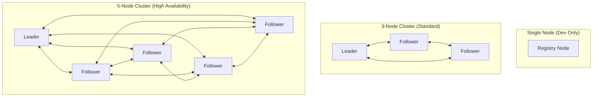
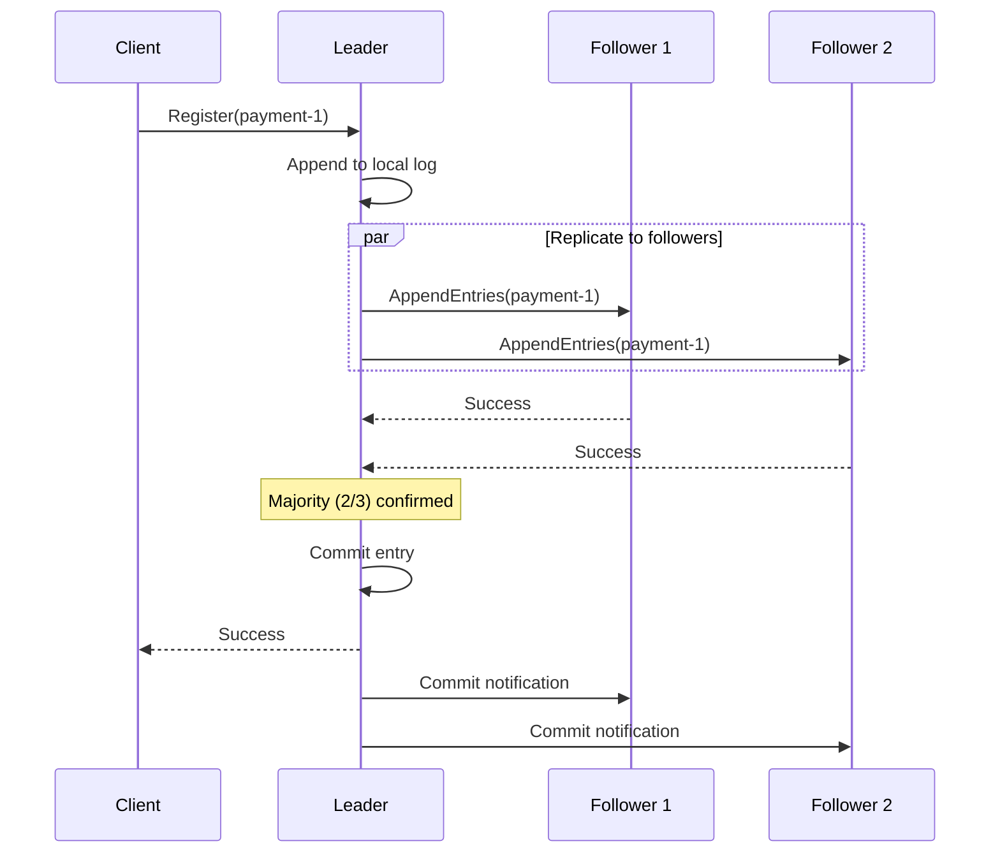
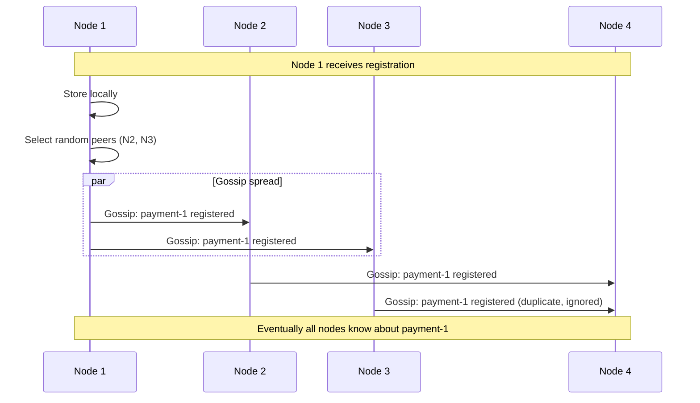
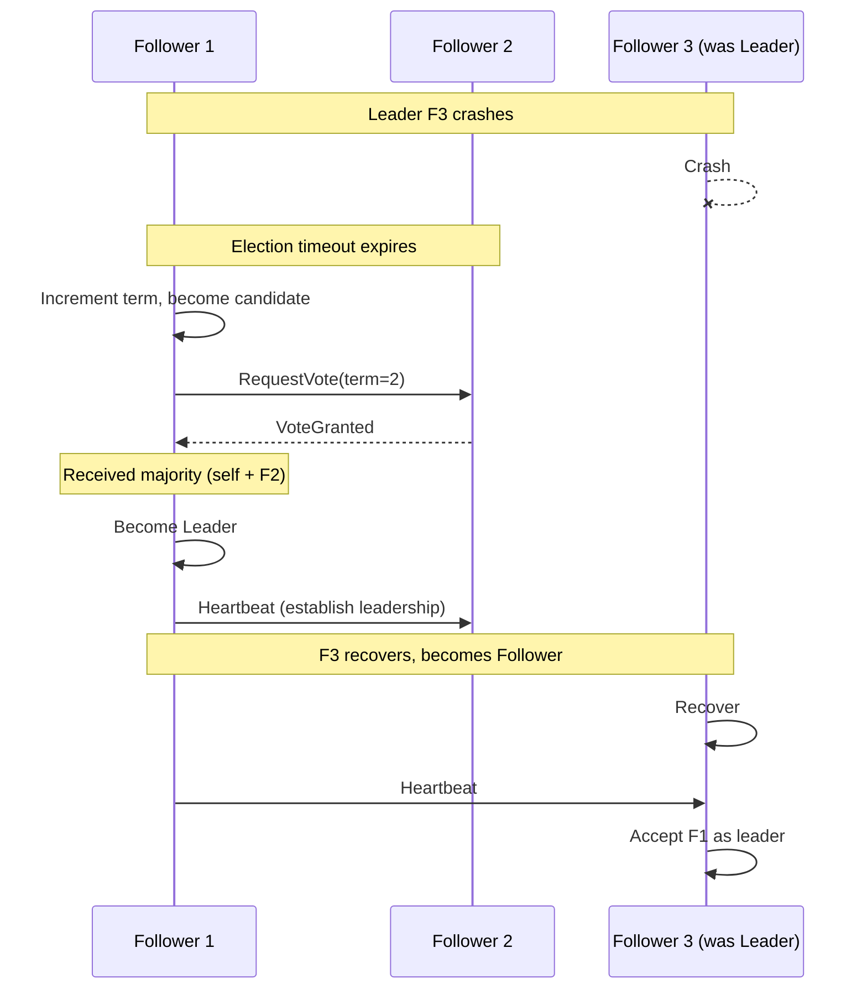
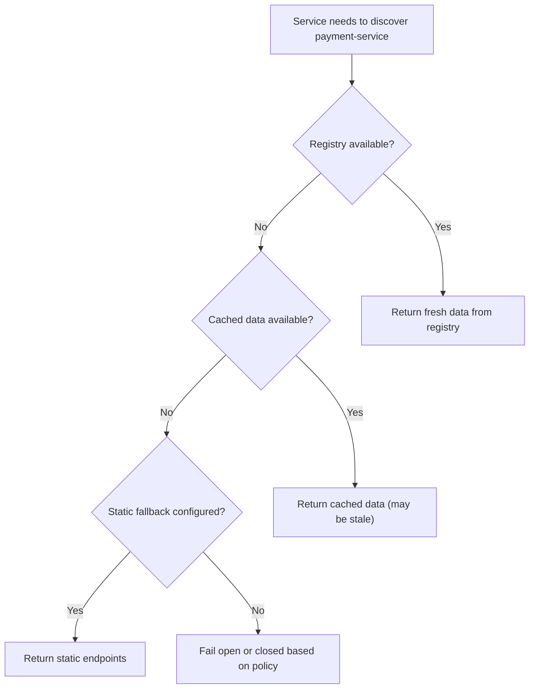

# Scalability & Reliability

[← Back to Index](./00-index.md)

---

## Registry Cluster Architecture

### Cluster Topologies



### Cluster Sizing Guidelines

| Cluster Size | Quorum | Tolerated Failures | Use Case |
|--------------|--------|-------------------|----------|
| 1 node | 1 | 0 | Development only |
| **3 nodes** | 2 | 1 | **Production minimum** |
| **5 nodes** | 3 | 2 | **High availability** |
| 7 nodes | 4 | 3 | Multi-region, extreme HA |

```
┌─────────────────────────────────────────────────────────────────────┐
│  WHY ODD NUMBERS?                                                    │
├─────────────────────────────────────────────────────────────────────┤
│                                                                      │
│  Quorum = floor(N/2) + 1                                            │
│                                                                      │
│  3 nodes: Quorum = 2, tolerate 1 failure                            │
│  4 nodes: Quorum = 3, tolerate 1 failure (same as 3!)               │
│  5 nodes: Quorum = 3, tolerate 2 failures                           │
│  6 nodes: Quorum = 4, tolerate 2 failures (same as 5!)              │
│                                                                      │
│  4 and 6 nodes give no benefit over 3 and 5,                        │
│  but add operational complexity and cost.                           │
│                                                                      │
│  RECOMMENDATION: 3 nodes for most cases, 5 for critical systems     │
│                                                                      │
└─────────────────────────────────────────────────────────────────────┘
```

---

## Consensus and Replication

### Raft Consensus (etcd, Consul)



### Gossip Protocol (Eureka, Serf)



### Consensus vs. Gossip Comparison

| Aspect | Raft Consensus | Gossip Protocol |
|--------|---------------|-----------------|
| **Consistency** | Strong (linearizable) | Eventual |
| **Availability** | Unavailable without quorum | Always available |
| **Latency** | Higher (wait for majority) | Lower (immediate local) |
| **Scale** | 3-7 nodes typical | 100s of nodes |
| **Complexity** | More complex | Simpler |
| **Use Case** | Config, leader election | Service discovery, membership |

---

## Scaling Strategies

### Horizontal Scaling

```
┌─────────────────────────────────────────────────────────────────────┐
│  SCALING REGISTRY CLUSTER                                            │
├─────────────────────────────────────────────────────────────────────┤
│                                                                      │
│  Option 1: Add Consensus Members (Limited)                          │
│  ─────────────────────────────────────────                           │
│  - Add follower nodes for read scaling                              │
│  - 5-7 nodes max (consensus overhead increases)                     │
│  - All nodes participate in elections                               │
│                                                                      │
│  Option 2: Non-Voting Replicas (Read Scaling)                       │
│  ─────────────────────────────────────────────                       │
│  - Add read-only replicas that don't vote                           │
│  - Can add many more (10s-100s)                                     │
│  - Used by: etcd learners, ZooKeeper observers                      │
│                                                                      │
│  ┌─────────────────────────────────────────────────────────────┐   │
│  │  Leader ◄──► Voter1 ◄──► Voter2                             │   │
│  │     │           │           │                                │   │
│  │     ▼           ▼           ▼                                │   │
│  │  Read1       Read2       Read3        (Non-voting)           │   │
│  │  Read4       Read5       Read6                               │   │
│  └─────────────────────────────────────────────────────────────┘   │
│                                                                      │
│  Option 3: Regional Clusters with Federation                        │
│  ─────────────────────────────────────────────                       │
│  - Separate cluster per region/datacenter                           │
│  - Async replication between clusters                               │
│  - Local queries, cross-region fallback                             │
│                                                                      │
└─────────────────────────────────────────────────────────────────────┘
```

### Load Distribution

```
┌─────────────────────────────────────────────────────────────────────┐
│  LOAD BALANCING REGISTRY QUERIES                                     │
├─────────────────────────────────────────────────────────────────────┤
│                                                                      │
│  Clients                                                             │
│  ┌────┬────┬────┬────┐                                              │
│  │ C1 │ C2 │ C3 │ C4 │                                              │
│  └──┬─┴──┬─┴──┬─┴──┬─┘                                              │
│     │    │    │    │                                                 │
│     ▼    ▼    ▼    ▼                                                 │
│  ┌────────────────────┐                                              │
│  │   Load Balancer    │  (Optional: DNS round-robin also works)     │
│  │   or DNS RR        │                                              │
│  └──┬─────┬─────┬────┘                                              │
│     │     │     │                                                    │
│     ▼     ▼     ▼                                                    │
│  ┌─────┬─────┬─────┐                                                │
│  │ R1  │ R2  │ R3  │  Registry Cluster                              │
│  └─────┴─────┴─────┘                                                │
│                                                                      │
│  Read Queries: Any node (load balanced)                              │
│  Write Queries: Forwarded to leader                                  │
│                                                                      │
└─────────────────────────────────────────────────────────────────────┘
```

---

## Failover and Recovery

### Leader Election



### Failure Scenarios

| Scenario | Detection | Recovery | Downtime |
|----------|-----------|----------|----------|
| **Follower fails** | Heartbeat timeout | Cluster continues, one less voter | None |
| **Leader fails** | Election timeout (150-300ms) | New election, new leader | < 1 second |
| **Network partition** | Heartbeat failures | Majority side continues | Minority unavailable |
| **All nodes fail** | Complete outage | Restore from backup | Minutes to hours |

### Client Failover Strategy

```
ALGORITHM ClientFailover:
    // Client-side handling of registry failures

    CONSTANTS:
        REGISTRY_ENDPOINTS = ["registry1:8500", "registry2:8500", "registry3:8500"]
        MAX_RETRIES = 3
        RETRY_BACKOFF = [100ms, 500ms, 2000ms]

    ALGORITHM Discover(service_name):
        FOR i FROM 0 TO MAX_RETRIES:
            endpoint = SelectEndpoint()
            TRY:
                response = registry.Discover(endpoint, service_name)
                MarkEndpointHealthy(endpoint)
                RETURN response
            CATCH ConnectionError, Timeout:
                MarkEndpointUnhealthy(endpoint)
                SLEEP(RETRY_BACKOFF[i])

        // All retries failed, use cached data
        IF cache.Has(service_name):
            Log.Warn("Using stale cached data", {service: service_name})
            RETURN cache.Get(service_name)
        ELSE:
            THROW DiscoveryFailure("All registry endpoints unavailable")

    ALGORITHM SelectEndpoint():
        // Prefer healthy endpoints, round-robin among them
        healthy = endpoints.Filter(e => e.healthy)
        IF healthy.IsEmpty():
            healthy = endpoints  // Try all if none healthy
        RETURN healthy.NextRoundRobin()

    ALGORITHM MarkEndpointUnhealthy(endpoint):
        endpoint.healthy = FALSE
        endpoint.unhealthy_since = NOW()
        // Re-check after cooldown
        Schedule(() => endpoint.healthy = TRUE, COOLDOWN_PERIOD)
```

---

## Disaster Recovery

### Backup and Restore

```
┌─────────────────────────────────────────────────────────────────────┐
│  BACKUP STRATEGIES                                                   │
├─────────────────────────────────────────────────────────────────────┤
│                                                                      │
│  1. Snapshot Backups                                                │
│  ─────────────────────                                               │
│  - Periodic snapshots of registry state                             │
│  - Store in object storage (cross-region)                           │
│  - Frequency: Every 1-6 hours                                       │
│  - Retention: 7-30 days                                             │
│                                                                      │
│  etcdctl snapshot save /backup/etcd-$(date +%Y%m%d-%H%M).db        │
│                                                                      │
│  2. Continuous WAL (Write-Ahead Log) Shipping                       │
│  ────────────────────────────────────────────                        │
│  - Stream transaction log to backup location                        │
│  - Near-zero RPO (Recovery Point Objective)                         │
│  - More complex to restore                                          │
│                                                                      │
│  3. Multi-Region Replication                                        │
│  ───────────────────────────                                         │
│  - Active registry in each region                                   │
│  - Async replication between regions                                │
│  - Automatic failover to another region                             │
│                                                                      │
└─────────────────────────────────────────────────────────────────────┘
```

### Recovery Procedures

```
┌─────────────────────────────────────────────────────────────────────┐
│  DISASTER RECOVERY RUNBOOK                                           │
├─────────────────────────────────────────────────────────────────────┤
│                                                                      │
│  Scenario 1: Single Node Failure                                    │
│  ─────────────────────────────────                                   │
│  1. Cluster continues with remaining nodes                          │
│  2. Deploy replacement node                                         │
│  3. Add new node to cluster                                         │
│  4. New node catches up via log replication                         │
│  Recovery Time: ~5 minutes                                          │
│                                                                      │
│  Scenario 2: Minority Failure (1 of 3, 2 of 5)                     │
│  ───────────────────────────────────────────────                    │
│  1. Cluster remains available (has quorum)                          │
│  2. Replace failed nodes one at a time                              │
│  3. Monitor cluster health                                          │
│  Recovery Time: ~15 minutes                                         │
│                                                                      │
│  Scenario 3: Majority Failure (2 of 3, 3 of 5)                     │
│  ───────────────────────────────────────────────                    │
│  1. Cluster is unavailable (no quorum)                             │
│  2. Services use cached data / static fallback                     │
│  3. Restore from backup to new cluster                              │
│  4. Update client endpoints                                         │
│  5. Services re-register                                            │
│  Recovery Time: 30-60 minutes                                       │
│                                                                      │
│  Scenario 4: Complete Datacenter Failure                            │
│  ─────────────────────────────────────────                           │
│  1. Failover to secondary datacenter registry                       │
│  2. Services in DR site continue operating                          │
│  3. Update DNS to point to DR registry                              │
│  4. Services in failed DC will re-register when DC recovers        │
│  Recovery Time: 1-5 minutes (if pre-configured)                     │
│                                                                      │
└─────────────────────────────────────────────────────────────────────┘
```

---

## Graceful Degradation

### Client Fallback Strategies



### Fail-Open vs. Fail-Closed

```
┌─────────────────────────────────────────────────────────────────────┐
│  FAIL-OPEN POLICY                                                    │
├─────────────────────────────────────────────────────────────────────┤
│                                                                      │
│  When discovery fails, use last known good state:                    │
│                                                                      │
│  ALGORITHM FailOpen():                                               │
│      result = TryDiscover(service)                                  │
│      IF result.success:                                              │
│          UpdateCache(service, result.instances)                     │
│          RETURN result.instances                                     │
│      ELSE:                                                           │
│          IF cache.Has(service):                                      │
│              Log.Warn("Discovery failed, using cache")              │
│              RETURN cache.Get(service)                               │
│          ELIF staticFallback.Has(service):                          │
│              Log.Warn("Discovery failed, using static fallback")    │
│              RETURN staticFallback.Get(service)                     │
│          ELSE:                                                       │
│              Log.Error("Discovery failed, no fallback")             │
│              RETURN []  // Empty, caller should handle              │
│                                                                      │
│  Pros: Maximum availability, services keep running                  │
│  Cons: May route to stale/dead instances                            │
│  Use for: Most microservices, non-critical paths                    │
│                                                                      │
└─────────────────────────────────────────────────────────────────────┘

┌─────────────────────────────────────────────────────────────────────┐
│  FAIL-CLOSED POLICY                                                  │
├─────────────────────────────────────────────────────────────────────┤
│                                                                      │
│  When discovery fails, reject requests:                              │
│                                                                      │
│  ALGORITHM FailClosed():                                             │
│      result = TryDiscover(service)                                  │
│      IF result.success:                                              │
│          RETURN result.instances                                     │
│      ELSE:                                                           │
│          Log.Error("Discovery failed, rejecting request")           │
│          THROW DiscoveryUnavailableError                            │
│                                                                      │
│  Pros: Never routes to potentially bad instances                    │
│  Cons: Services fail when registry unavailable                      │
│  Use for: Critical paths where wrong routing is worse than failing  │
│                                                                      │
└─────────────────────────────────────────────────────────────────────┘
```

---

## Self-Preservation and Circuit Breakers

### Registry Self-Preservation

```
ALGORITHM SelfPreservationMode:
    // Prevent mass eviction during network issues

    CONSTANTS:
        RENEWAL_THRESHOLD = 0.85
        MIN_INSTANCES = 10
        CHECK_INTERVAL = 60s

    PROCESS:
        EVERY CHECK_INTERVAL:
            total = GetTotalInstances()
            IF total < MIN_INSTANCES:
                CONTINUE  // Too few instances for self-preservation

            expected_renewals = total * (60 / HEARTBEAT_INTERVAL)
            actual_renewals = CountRenewalsLastMinute()
            ratio = actual_renewals / expected_renewals

            IF ratio < RENEWAL_THRESHOLD:
                IF NOT self_preservation_active:
                    ActivateSelfPreservation()
                    Alert("Self-preservation activated", {
                        ratio: ratio,
                        threshold: RENEWAL_THRESHOLD
                    })
            ELSE:
                IF self_preservation_active:
                    DeactivateSelfPreservation()
                    Log.Info("Self-preservation deactivated")

    WHEN EvictingInstance(instance):
        IF self_preservation_active:
            Log.Debug("Eviction skipped due to self-preservation")
            RETURN  // Don't evict

        // Normal eviction proceeds
        RemoveInstance(instance)
```

### Client Circuit Breaker Integration

```
┌─────────────────────────────────────────────────────────────────────┐
│  DISCOVERY + CIRCUIT BREAKER                                         │
├─────────────────────────────────────────────────────────────────────┤
│                                                                      │
│  Discovery provides: WHERE to call                                   │
│  Circuit Breaker provides: WHETHER to call                           │
│                                                                      │
│  Integration Pattern:                                                │
│                                                                      │
│  ALGORITHM CallService(service_name, request):                      │
│      // Step 1: Discover instances                                  │
│      instances = Discover(service_name)                              │
│                                                                      │
│      // Step 2: Filter by circuit breaker state                     │
│      healthy_instances = []                                          │
│      FOR EACH instance IN instances:                                │
│          breaker = GetCircuitBreaker(instance.id)                   │
│          IF breaker.state != OPEN:                                   │
│              healthy_instances.Add(instance)                         │
│                                                                      │
│      IF healthy_instances.IsEmpty():                                 │
│          THROW AllCircuitsBroken                                     │
│                                                                      │
│      // Step 3: Select instance and call                            │
│      target = LoadBalancer.Select(healthy_instances)                │
│      TRY:                                                            │
│          response = Call(target, request)                           │
│          GetCircuitBreaker(target.id).RecordSuccess()               │
│          RETURN response                                             │
│      CATCH Error:                                                    │
│          GetCircuitBreaker(target.id).RecordFailure()               │
│          THROW Error                                                 │
│                                                                      │
│  Feedback Loop:                                                      │
│  - High failure rate → Circuit opens → Instance excluded            │
│  - Instance recovers → Circuit half-open → Test call                │
│  - Test succeeds → Circuit closes → Instance included               │
│                                                                      │
└─────────────────────────────────────────────────────────────────────┘
```

---

## Capacity Planning

### Sizing Reference

| Scale | Instances | QPS | Cluster Size | Memory/Node | Notes |
|-------|-----------|-----|--------------|-------------|-------|
| Small | < 1K | 10K | 3 nodes | 2 GB | Single region |
| Medium | 1K-10K | 50K | 5 nodes | 4 GB | Single region |
| Large | 10K-50K | 100K | 5 nodes | 8 GB | Multi-region recommended |
| Very Large | 50K-100K | 500K | 7 nodes/region | 16 GB | Regional clusters required |

### Growth Planning

```
┌─────────────────────────────────────────────────────────────────────┐
│  SCALING TRIGGERS AND ACTIONS                                        │
├─────────────────────────────────────────────────────────────────────┤
│                                                                      │
│  Trigger: CPU > 70% sustained                                       │
│  Action: Add read-only replicas or upgrade nodes                    │
│                                                                      │
│  Trigger: Memory > 80%                                               │
│  Action: Upgrade memory or archive old data                          │
│                                                                      │
│  Trigger: Lookup latency p99 > 50ms                                 │
│  Action: Add replicas, enable caching, optimize queries             │
│                                                                      │
│  Trigger: Watch connections > 10K per node                          │
│  Action: Add nodes, implement watch aggregation                     │
│                                                                      │
│  Trigger: Cross-region latency > 200ms                              │
│  Action: Add regional cluster, use local-first queries              │
│                                                                      │
└─────────────────────────────────────────────────────────────────────┘
```
