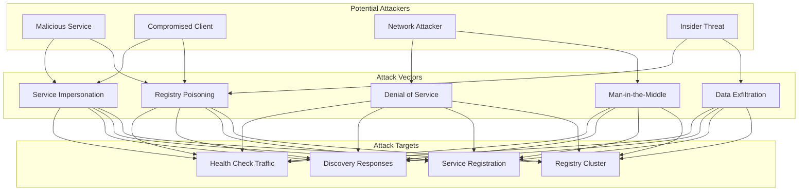
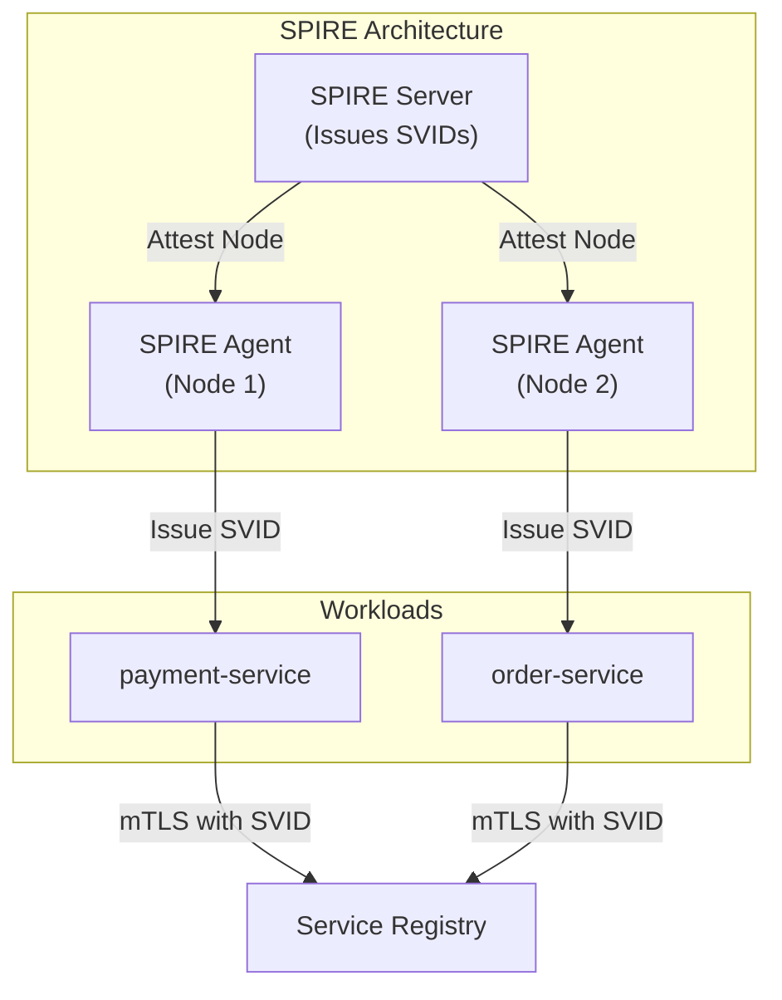
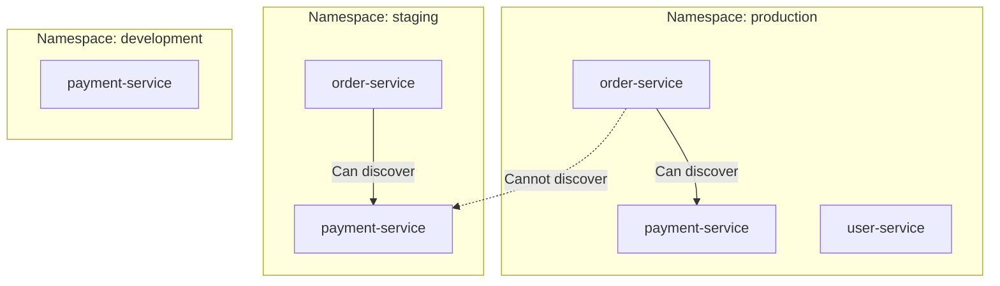

# Security & Compliance

[← Back to Index](./00-index.md)

---

## Threat Model

### Attack Surface Analysis



### Threat Catalog

| Threat | Description | Impact | Likelihood | Mitigation |
|--------|-------------|--------|------------|------------|
| **Registry Poisoning** | Malicious actor registers fake instances | Traffic redirected to attacker | Medium | ACLs, service identity verification |
| **Service Impersonation** | Attacker claims to be legitimate service | Data theft, request manipulation | Medium | mTLS, certificate validation |
| **Discovery Spoofing** | MITM returns fake service endpoints | Traffic hijacking | Low | TLS, signed responses |
| **DoS Attack** | Flood registry with registrations/queries | Service discovery unavailable | Medium | Rate limiting, authentication |
| **Data Exfiltration** | Extract service topology from registry | Reconnaissance for further attacks | Medium | ACLs, audit logging |
| **Credential Theft** | Steal registry access tokens | Unauthorized access | Medium | Short-lived tokens, rotation |

---

## Authentication

### Service Identity

```
┌─────────────────────────────────────────────────────────────────────┐
│  SERVICE IDENTITY OPTIONS                                            │
├─────────────────────────────────────────────────────────────────────┤
│                                                                      │
│  Option 1: API Tokens                                                │
│  ───────────────────────                                             │
│  - Static tokens per service                                        │
│  - Stored in environment variables or secrets manager               │
│  - Simplest to implement                                            │
│                                                                      │
│  Service → Registry: Authorization: Bearer <token>                  │
│                                                                      │
│  Pros: Simple, widely supported                                     │
│  Cons: Token rotation complexity, risk of leakage                   │
│                                                                      │
│  ─────────────────────────────────────────────────────────────────  │
│                                                                      │
│  Option 2: mTLS (Mutual TLS)                                        │
│  ─────────────────────────────                                       │
│  - Each service has X.509 certificate                               │
│  - Certificate contains service identity (SPIFFE ID)                │
│  - Both client and server verify certificates                       │
│                                                                      │
│  Service ◄──mTLS──► Registry                                        │
│  Cert: spiffe://cluster/ns/prod/sa/payment-service                 │
│                                                                      │
│  Pros: Strong identity, automatic rotation via mesh                 │
│  Cons: PKI complexity, certificate management                       │
│                                                                      │
│  ─────────────────────────────────────────────────────────────────  │
│                                                                      │
│  Option 3: Cloud Provider Identity                                   │
│  ─────────────────────────────────                                   │
│  - Use cloud IAM roles (AWS IAM, GCP Service Accounts)              │
│  - Short-lived tokens from metadata service                         │
│  - No manual credential management                                  │
│                                                                      │
│  Service → Metadata: Get IAM token                                  │
│  Service → Registry: Authorization: Bearer <iam-token>              │
│                                                                      │
│  Pros: Native cloud integration, auto-rotation                      │
│  Cons: Cloud-specific, not portable                                 │
│                                                                      │
└─────────────────────────────────────────────────────────────────────┘
```

### SPIFFE/SPIRE Identity



### Authentication Flow

```
ALGORITHM AuthenticateRequest(request):
    // Verify service identity before processing

    INPUT:
        request: Contains auth headers and/or TLS cert

    PROCESS:
        // Option 1: API Token
        IF request.HasHeader("Authorization"):
            token = ExtractBearerToken(request)
            identity = TokenService.Validate(token)
            IF identity IS NULL:
                RETURN Error(401, "Invalid token")
            RETURN identity

        // Option 2: mTLS Certificate
        IF request.TLSClientCert IS NOT NULL:
            cert = request.TLSClientCert
            IF NOT VerifyCertChain(cert, TrustedCAs):
                RETURN Error(401, "Invalid certificate")
            identity = ExtractSPIFFEId(cert)
            RETURN identity

        // No authentication provided
        IF config.AllowAnonymous:
            RETURN AnonymousIdentity
        ELSE:
            RETURN Error(401, "Authentication required")
```

---

## Authorization (Access Control)

### ACL Model

```
┌─────────────────────────────────────────────────────────────────────┐
│  ACCESS CONTROL LIST (ACL) MODEL                                     │
├─────────────────────────────────────────────────────────────────────┤
│                                                                      │
│  Resources:                                                          │
│  - service:{service_name}          (e.g., service:payment)          │
│  - service:{service_name}/*        (all instances of a service)     │
│  - namespace:{namespace}/*         (all services in namespace)      │
│                                                                      │
│  Permissions:                                                        │
│  - read    : Discover service instances                             │
│  - write   : Register/deregister instances                          │
│  - admin   : Modify service metadata, delete service                │
│                                                                      │
│  Example ACL Rules:                                                  │
│  ┌─────────────────────────────────────────────────────────────┐   │
│  │ # payment-service can only register itself                   │   │
│  │ service "payment-service" {                                  │   │
│  │   policy = "write"                                           │   │
│  │   identity = "spiffe://cluster/ns/prod/sa/payment"           │   │
│  │ }                                                             │   │
│  │                                                               │   │
│  │ # order-service can discover payment-service                 │   │
│  │ service "payment-service" {                                  │   │
│  │   policy = "read"                                            │   │
│  │   identity = "spiffe://cluster/ns/prod/sa/order"            │   │
│  │ }                                                             │   │
│  │                                                               │   │
│  │ # ops team can manage all services                           │   │
│  │ namespace "prod" {                                           │   │
│  │   policy = "admin"                                           │   │
│  │   identity = "team:ops"                                      │   │
│  │ }                                                             │   │
│  └─────────────────────────────────────────────────────────────┘   │
│                                                                      │
└─────────────────────────────────────────────────────────────────────┘
```

### Authorization Algorithm

```
ALGORITHM AuthorizeRequest(identity, action, resource):
    // Check if identity can perform action on resource

    INPUT:
        identity: Authenticated service/user identity
        action: "read", "write", "admin"
        resource: "service:payment", "namespace:prod/*"

    PROCESS:
        // Step 1: Get applicable ACL rules
        rules = ACLStore.GetRules(resource)

        // Step 2: Check each rule
        FOR EACH rule IN rules:
            IF MatchesIdentity(rule.identity, identity):
                IF HasPermission(rule.policy, action):
                    AuditLog.Record(identity, action, resource, "ALLOW")
                    RETURN Allow

        // Step 3: Check default policy
        IF config.DefaultPolicy == "allow":
            AuditLog.Record(identity, action, resource, "ALLOW_DEFAULT")
            RETURN Allow
        ELSE:
            AuditLog.Record(identity, action, resource, "DENY")
            RETURN Deny

ALGORITHM HasPermission(policy, action):
    IF policy == "admin":
        RETURN TRUE  // Admin can do anything
    IF policy == "write" AND action IN ["read", "write"]:
        RETURN TRUE
    IF policy == "read" AND action == "read":
        RETURN TRUE
    RETURN FALSE
```

### Namespace Isolation



---

## Registry Poisoning Prevention

### The Threat

```
┌─────────────────────────────────────────────────────────────────────┐
│  REGISTRY POISONING ATTACK                                           │
├─────────────────────────────────────────────────────────────────────┤
│                                                                      │
│  Normal Flow:                                                        │
│  payment-service → Registry: Register(10.0.1.1:8080)               │
│  order-service → Registry: Discover(payment-service)                │
│  Registry → order-service: [10.0.1.1:8080]                         │
│  order-service → 10.0.1.1:8080: Process payment ✓                  │
│                                                                      │
│  Attack Flow:                                                        │
│  attacker → Registry: Register(payment-service, 10.99.99.99:8080)  │
│  order-service → Registry: Discover(payment-service)                │
│  Registry → order-service: [10.0.1.1:8080, 10.99.99.99:8080]      │
│  order-service → 10.99.99.99:8080: Credit card stolen! ❌          │
│                                                                      │
│  Impact:                                                             │
│  - Traffic redirected to malicious endpoint                         │
│  - Sensitive data exfiltration                                      │
│  - Man-in-the-middle attacks                                        │
│                                                                      │
└─────────────────────────────────────────────────────────────────────┘
```

### Prevention Mechanisms

| Mechanism | How It Works | Protection Level |
|-----------|-------------|------------------|
| **ACLs** | Only authorized identities can register specific services | High |
| **mTLS** | Service must prove identity via certificate | High |
| **IP Allowlisting** | Only register from known IP ranges | Medium |
| **Registration Approval** | Manual approval for new services | Very High (but slow) |
| **Anomaly Detection** | Detect unusual registration patterns | Medium |

### Secure Registration Flow

```
ALGORITHM SecureRegister(request):
    // Prevent registry poisoning

    INPUT:
        request: {service_name, host, port, identity}

    PROCESS:
        // Step 1: Authenticate request
        identity = Authenticate(request)
        IF identity IS NULL:
            RETURN Error(401, "Authentication required")

        // Step 2: Authorize registration
        IF NOT Authorize(identity, "write", "service:" + request.service_name):
            AuditLog.Record("REGISTRATION_DENIED", identity, request.service_name)
            RETURN Error(403, "Not authorized to register this service")

        // Step 3: Validate identity matches service name
        IF NOT IdentityMatchesService(identity, request.service_name):
            AuditLog.Record("IDENTITY_MISMATCH", identity, request.service_name)
            RETURN Error(403, "Identity does not match service name")

        // Step 4: Validate network location (optional)
        IF config.EnforceNetworkPolicy:
            allowed_cidrs = GetAllowedCIDRs(request.service_name)
            IF NOT IPInCIDRs(request.host, allowed_cidrs):
                AuditLog.Record("NETWORK_VIOLATION", identity, request.host)
                RETURN Error(403, "Registration from unauthorized network")

        // Step 5: Proceed with registration
        instance = CreateInstance(request)
        AuditLog.Record("REGISTRATION_SUCCESS", identity, instance)
        RETURN Success(instance)

ALGORITHM IdentityMatchesService(identity, service_name):
    // e.g., spiffe://cluster/ns/prod/sa/payment-service can register "payment-service"
    expected_pattern = config.GetServiceIdentityPattern(service_name)
    RETURN identity.Matches(expected_pattern)
```

---

## Encryption

### Data in Transit

```
┌─────────────────────────────────────────────────────────────────────┐
│  ENCRYPTION IN TRANSIT                                               │
├─────────────────────────────────────────────────────────────────────┤
│                                                                      │
│  1. Client ↔ Registry (TLS/mTLS)                                    │
│  ─────────────────────────────────                                   │
│  - All API calls encrypted                                          │
│  - Certificate verification prevents MITM                           │
│  - mTLS for mutual authentication                                   │
│                                                                      │
│  Service ◄──TLS 1.3──► Registry                                     │
│  Cipher: TLS_AES_256_GCM_SHA384                                     │
│                                                                      │
│  2. Registry ↔ Registry (Cluster Communication)                     │
│  ────────────────────────────────────────────────                    │
│  - Raft/gossip traffic encrypted                                    │
│  - Node-to-node mTLS                                                │
│                                                                      │
│  Node1 ◄──mTLS──► Node2                                             │
│                                                                      │
│  3. Registry ↔ Service (Health Checks)                              │
│  ─────────────────────────────────────                               │
│  - Health check probes over TLS                                     │
│  - Verify service certificate                                       │
│                                                                      │
│  Registry ──TLS──► Service /health                                  │
│                                                                      │
└─────────────────────────────────────────────────────────────────────┘
```

### Data at Rest

```
┌─────────────────────────────────────────────────────────────────────┐
│  ENCRYPTION AT REST                                                  │
├─────────────────────────────────────────────────────────────────────┤
│                                                                      │
│  What to Encrypt:                                                    │
│  - Persistent registry data (snapshots)                             │
│  - Backup files                                                      │
│  - Log files containing sensitive data                              │
│                                                                      │
│  Encryption Options:                                                 │
│  1. Filesystem Encryption (dm-crypt, BitLocker)                     │
│  2. Application-level Encryption (service metadata)                  │
│  3. Cloud Provider Encryption (EBS encryption, Cloud KMS)           │
│                                                                      │
│  Sensitive Metadata:                                                 │
│  - Service credentials in metadata → Encrypt                        │
│  - Internal URLs → Encrypt                                          │
│  - Service IPs/ports → Usually not encrypted (needed for routing)   │
│                                                                      │
└─────────────────────────────────────────────────────────────────────┘
```

---

## Audit Logging

### What to Log

| Event | Details to Log | Retention |
|-------|---------------|-----------|
| **Registration** | Service, instance, identity, timestamp, IP | 90 days |
| **Deregistration** | Service, instance, identity, reason | 90 days |
| **Discovery Query** | Requester identity, service queried | 30 days |
| **ACL Changes** | Who changed, what changed, old/new values | 1 year |
| **Authentication Failure** | Identity attempted, reason, IP | 90 days |
| **Authorization Denial** | Identity, action, resource | 90 days |

### Audit Log Format

```json
{
  "timestamp": "2025-01-20T10:30:00.000Z",
  "event_type": "REGISTRATION",
  "service_name": "payment-service",
  "instance_id": "payment-1",
  "identity": "spiffe://cluster/ns/prod/sa/payment",
  "source_ip": "10.0.1.50",
  "result": "SUCCESS",
  "details": {
    "host": "10.0.1.1",
    "port": 8080,
    "metadata": {"version": "2.1.0"}
  },
  "registry_node": "registry-1"
}
```

### Audit Analysis

```
┌─────────────────────────────────────────────────────────────────────┐
│  SECURITY MONITORING QUERIES                                         │
├─────────────────────────────────────────────────────────────────────┤
│                                                                      │
│  1. Detect Registration Anomalies                                   │
│  ─────────────────────────────────                                   │
│  SELECT service_name, COUNT(*) as registrations                     │
│  FROM audit_logs                                                     │
│  WHERE event_type = 'REGISTRATION'                                  │
│    AND timestamp > NOW() - INTERVAL '1 hour'                        │
│  GROUP BY service_name                                               │
│  HAVING COUNT(*) > 100  -- Unusual registration spike               │
│                                                                      │
│  2. Detect Unknown Services                                         │
│  ───────────────────────────                                         │
│  SELECT DISTINCT service_name                                        │
│  FROM audit_logs                                                     │
│  WHERE event_type = 'REGISTRATION'                                  │
│    AND service_name NOT IN (SELECT name FROM allowed_services)      │
│                                                                      │
│  3. Detect Authorization Failures                                   │
│  ─────────────────────────────────                                   │
│  SELECT identity, COUNT(*) as denials                               │
│  FROM audit_logs                                                     │
│  WHERE result = 'DENIED'                                             │
│    AND timestamp > NOW() - INTERVAL '1 hour'                        │
│  GROUP BY identity                                                   │
│  HAVING COUNT(*) > 10  -- Possible privilege escalation attempt     │
│                                                                      │
└─────────────────────────────────────────────────────────────────────┘
```

---

## Compliance Considerations

### Regulatory Requirements

| Regulation | Relevant Requirements | Implementation |
|------------|----------------------|----------------|
| **SOC 2** | Access control, audit logging, encryption | ACLs, audit logs, TLS |
| **HIPAA** | PHI protection, audit trails | mTLS, encryption at rest, detailed logs |
| **PCI-DSS** | Network segmentation, encryption | Namespace isolation, mTLS |
| **GDPR** | Data minimization, access logging | Minimal metadata, audit logs |

### Security Checklist

```
┌─────────────────────────────────────────────────────────────────────┐
│  SECURITY HARDENING CHECKLIST                                        │
├─────────────────────────────────────────────────────────────────────┤
│                                                                      │
│  Authentication                                                      │
│  ☐ Enable mTLS for all registry communication                       │
│  ☐ Use short-lived tokens (< 1 hour)                                │
│  ☐ Implement token rotation                                          │
│  ☐ Disable anonymous access in production                           │
│                                                                      │
│  Authorization                                                       │
│  ☐ Enable ACLs with default-deny policy                            │
│  ☐ Use least-privilege principle for service access                 │
│  ☐ Implement namespace isolation                                    │
│  ☐ Review ACL rules quarterly                                       │
│                                                                      │
│  Network                                                             │
│  ☐ Enable TLS 1.3 with strong ciphers                              │
│  ☐ Disable TLS 1.0/1.1                                              │
│  ☐ Use network policies to restrict registry access                 │
│  ☐ Enable rate limiting                                             │
│                                                                      │
│  Audit                                                               │
│  ☐ Enable comprehensive audit logging                               │
│  ☐ Ship logs to centralized SIEM                                    │
│  ☐ Set up alerting for security events                              │
│  ☐ Retain logs per compliance requirements                          │
│                                                                      │
│  Operations                                                          │
│  ☐ Encrypt backups                                                   │
│  ☐ Secure admin access (MFA required)                               │
│  ☐ Implement break-glass procedures                                 │
│  ☐ Conduct periodic security reviews                                │
│                                                                      │
└─────────────────────────────────────────────────────────────────────┘
```
