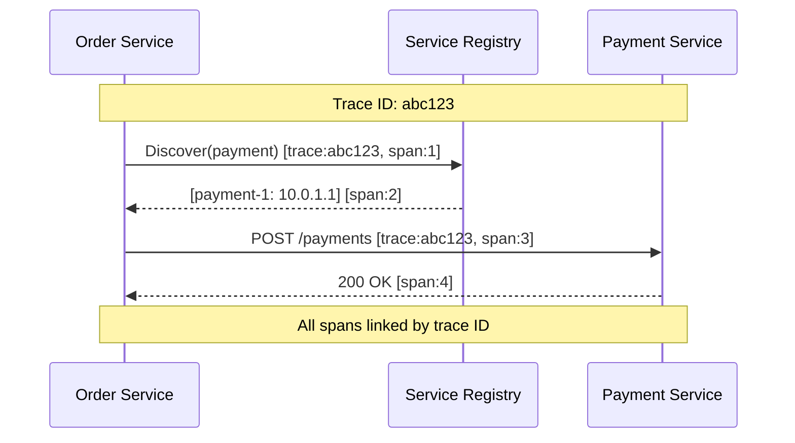

# Observability

[← Back to Index](./00-index.md)

---

## Key Metrics

### Registration Metrics

| Metric | Type | Description | Alert Threshold |
|--------|------|-------------|-----------------|
| `registry.registrations.total` | Counter | Total registration attempts | Spike > 10x normal |
| `registry.registrations.success` | Counter | Successful registrations | - |
| `registry.registrations.failed` | Counter | Failed registrations | > 1% failure rate |
| `registry.deregistrations.total` | Counter | Total deregistrations | Spike > 10x normal |
| `registry.instances.active` | Gauge | Current active instances | Drop > 20% in 5 min |
| `registry.services.count` | Gauge | Number of unique services | - |

### Discovery Metrics

| Metric | Type | Description | Alert Threshold |
|--------|------|-------------|-----------------|
| `registry.discoveries.total` | Counter | Total discovery requests | - |
| `registry.discoveries.latency_ms` | Histogram | Discovery request latency | p99 > 50ms |
| `registry.discoveries.empty` | Counter | Queries returning 0 instances | Spike > 10% of queries |
| `registry.cache.hits` | Counter | Client cache hits | - |
| `registry.cache.misses` | Counter | Client cache misses | Hit rate < 90% |
| `registry.watch.active` | Gauge | Active watch subscriptions | > 10K per node |

### Health Check Metrics

| Metric | Type | Description | Alert Threshold |
|--------|------|-------------|-----------------|
| `registry.healthchecks.total` | Counter | Total health checks performed | - |
| `registry.healthchecks.success` | Counter | Passed health checks | - |
| `registry.healthchecks.failed` | Counter | Failed health checks | > 5% failure rate |
| `registry.healthchecks.latency_ms` | Histogram | Health check latency | p99 > 5s |
| `registry.instances.healthy` | Gauge | Instances in UP state | Drop > 10% |
| `registry.instances.unhealthy` | Gauge | Instances in DOWN state | > 5% of total |
| `registry.evictions.total` | Counter | Instances evicted | Spike > 10/min |

### Cluster Metrics

| Metric | Type | Description | Alert Threshold |
|--------|------|-------------|-----------------|
| `registry.cluster.nodes` | Gauge | Nodes in cluster | < expected count |
| `registry.cluster.leader` | Gauge | Current leader node (1=leader) | No leader for > 30s |
| `registry.cluster.term` | Gauge | Raft term number | Rapid increases |
| `registry.replication.lag_ms` | Gauge | Replication lag to followers | > 1000ms |
| `registry.gossip.messages` | Counter | Gossip messages sent/received | - |

---

## Metric Dimensions (Labels)

```
┌─────────────────────────────────────────────────────────────────────┐
│  METRIC LABELING STRATEGY                                            │
├─────────────────────────────────────────────────────────────────────┤
│                                                                      │
│  Registration Metrics:                                               │
│    labels: {service, namespace, zone, result}                       │
│    example: registry_registrations_total{                           │
│      service="payment", namespace="prod", zone="us-east-1a",        │
│      result="success"                                                │
│    }                                                                 │
│                                                                      │
│  Discovery Metrics:                                                  │
│    labels: {service, namespace, client, cached}                     │
│    example: registry_discoveries_total{                             │
│      service="payment", namespace="prod",                           │
│      client="order-service", cached="false"                         │
│    }                                                                 │
│                                                                      │
│  Health Check Metrics:                                               │
│    labels: {service, instance, check_type, result}                  │
│    example: registry_healthchecks_total{                            │
│      service="payment", instance="payment-1",                       │
│      check_type="http", result="success"                            │
│    }                                                                 │
│                                                                      │
│  CARDINALITY WARNING:                                                │
│  - Avoid high-cardinality labels (instance IDs, request IDs)        │
│  - Use service + namespace, not individual instances                │
│  - Aggregate by service for dashboards                              │
│                                                                      │
└─────────────────────────────────────────────────────────────────────┘
```

---

## Logging

### Log Events

| Event | Level | When to Log | Key Fields |
|-------|-------|-------------|------------|
| Registration | INFO | Service registers | service, instance, host, port |
| Deregistration | INFO | Service deregisters | service, instance, reason |
| Health Change | WARN | Instance health changes | service, instance, old_status, new_status |
| Eviction | WARN | Instance evicted | service, instance, reason |
| Leader Election | INFO | New leader elected | new_leader, term |
| Watch Event | DEBUG | Change pushed to watcher | service, event_type, subscriber_count |
| Query | DEBUG | Discovery query | service, client, result_count |
| Auth Failure | WARN | Authentication failed | identity, reason, source_ip |

### Log Format

```json
{
  "timestamp": "2025-01-20T10:30:00.000Z",
  "level": "INFO",
  "event": "REGISTRATION",
  "service": "payment-service",
  "instance_id": "payment-1",
  "host": "10.0.1.1",
  "port": 8080,
  "zone": "us-east-1a",
  "registry_node": "registry-1",
  "latency_ms": 5,
  "trace_id": "abc123",
  "metadata": {
    "version": "2.1.0",
    "weight": 100
  }
}
```

### Log Aggregation

```
┌─────────────────────────────────────────────────────────────────────┐
│  LOG AGGREGATION PIPELINE                                            │
├─────────────────────────────────────────────────────────────────────┤
│                                                                      │
│  Registry Nodes                                                      │
│  ┌─────────┐ ┌─────────┐ ┌─────────┐                               │
│  │ Node 1  │ │ Node 2  │ │ Node 3  │                               │
│  └────┬────┘ └────┬────┘ └────┬────┘                               │
│       │           │           │                                      │
│       └───────────┼───────────┘                                      │
│                   │                                                  │
│                   ▼                                                  │
│           ┌─────────────┐                                           │
│           │ Log Shipper │  (Fluentd, Vector, Filebeat)              │
│           └──────┬──────┘                                           │
│                  │                                                   │
│                  ▼                                                   │
│           ┌─────────────┐                                           │
│           │ Log Storage │  (Elasticsearch, Loki, Splunk)            │
│           └──────┬──────┘                                           │
│                  │                                                   │
│                  ▼                                                   │
│           ┌─────────────┐                                           │
│           │ Dashboards  │  (Kibana, Grafana)                        │
│           └─────────────┘                                           │
│                                                                      │
└─────────────────────────────────────────────────────────────────────┘
```

---

## Distributed Tracing

### Trace Context Propagation



### Key Spans to Instrument

| Operation | Span Name | Key Attributes |
|-----------|-----------|----------------|
| Discovery Query | `registry.discover` | service, result_count, cached |
| Registration | `registry.register` | service, instance, zone |
| Health Check | `registry.healthcheck` | service, instance, result |
| Watch Setup | `registry.watch.start` | service, subscriber_id |
| Watch Event | `registry.watch.event` | service, event_type |
| Replication | `registry.replicate` | operation, target_node |

---

## Alerting Rules

### Critical Alerts

```yaml
# Registry Down
- alert: RegistryClusterDown
  expr: registry_cluster_nodes < 2
  for: 1m
  severity: critical
  annotations:
    summary: "Registry cluster has fewer than quorum nodes"
    runbook: "https://runbook/registry-cluster-down"

# No Leader
- alert: RegistryNoLeader
  expr: sum(registry_cluster_leader) == 0
  for: 30s
  severity: critical
  annotations:
    summary: "Registry cluster has no leader"

# Mass Eviction
- alert: RegistryMassEviction
  expr: rate(registry_evictions_total[5m]) > 10
  for: 2m
  severity: critical
  annotations:
    summary: "High rate of instance evictions"
```

### Warning Alerts

```yaml
# High Discovery Latency
- alert: RegistryDiscoveryLatencyHigh
  expr: histogram_quantile(0.99, registry_discoveries_latency_ms_bucket) > 50
  for: 5m
  severity: warning
  annotations:
    summary: "Discovery latency p99 > 50ms"

# Health Check Failures
- alert: RegistryHealthCheckFailures
  expr: rate(registry_healthchecks_failed[5m]) / rate(registry_healthchecks_total[5m]) > 0.05
  for: 5m
  severity: warning
  annotations:
    summary: "Health check failure rate > 5%"

# Unhealthy Instances
- alert: RegistryUnhealthyInstances
  expr: registry_instances_unhealthy / registry_instances_active > 0.1
  for: 5m
  severity: warning
  annotations:
    summary: "More than 10% of instances unhealthy"

# Self-Preservation Active
- alert: RegistrySelfPreservationActive
  expr: registry_self_preservation_active == 1
  for: 5m
  severity: warning
  annotations:
    summary: "Registry is in self-preservation mode"

# Replication Lag
- alert: RegistryReplicationLag
  expr: registry_replication_lag_ms > 1000
  for: 2m
  severity: warning
  annotations:
    summary: "Replication lag > 1 second"
```

### Info Alerts

```yaml
# Service with No Instances
- alert: RegistryServiceNoInstances
  expr: registry_service_instance_count == 0
  for: 5m
  severity: info
  labels:
    service: "{{ $labels.service }}"
  annotations:
    summary: "Service {{ $labels.service }} has no registered instances"

# High Watch Count
- alert: RegistryHighWatchCount
  expr: registry_watch_active > 5000
  for: 10m
  severity: info
  annotations:
    summary: "High number of active watches"
```

---

## Dashboards

### Registry Overview Dashboard

```
┌─────────────────────────────────────────────────────────────────────┐
│  SERVICE REGISTRY OVERVIEW                                           │
├─────────────────────────────────────────────────────────────────────┤
│                                                                      │
│  ┌─────────────────┐  ┌─────────────────┐  ┌─────────────────┐     │
│  │ Cluster Status  │  │ Total Instances │  │ Total Services  │     │
│  │   ● HEALTHY     │  │     12,456      │  │       342       │     │
│  │   3/3 nodes     │  │                 │  │                 │     │
│  └─────────────────┘  └─────────────────┘  └─────────────────┘     │
│                                                                      │
│  ┌─────────────────────────────────────────────────────────────┐   │
│  │  Instance Health Distribution                                │   │
│  │  ┌────────────────────────────────────────────────────────┐ │   │
│  │  │ ██████████████████████████████████████░░░░░░░░         │ │   │
│  │  │ Healthy: 95%              Unhealthy: 5%                │ │   │
│  │  └────────────────────────────────────────────────────────┘ │   │
│  └─────────────────────────────────────────────────────────────┘   │
│                                                                      │
│  ┌─────────────────────────────────────────────────────────────┐   │
│  │  Discovery Requests (last 1 hour)                            │   │
│  │  100K ┤                                                      │   │
│  │   80K ┤        ████                                          │   │
│  │   60K ┤    ████    ████                                      │   │
│  │   40K ┤████            ████████                              │   │
│  │   20K ┤                        ████████████                  │   │
│  │    0  ┼────────────────────────────────────────────────     │   │
│  │        10:00   10:15   10:30   10:45   11:00                │   │
│  └─────────────────────────────────────────────────────────────┘   │
│                                                                      │
│  ┌─────────────────────────────────────────────────────────────┐   │
│  │  Discovery Latency (p50, p95, p99)                          │   │
│  │   50ms ┤                                                     │   │
│  │   40ms ┤                                                     │   │
│  │   30ms ┤────────────────────────────────── p99              │   │
│  │   20ms ┤────────────────────────────────── p95              │   │
│  │   10ms ┤────────────────────────────────── p50              │   │
│  │    0   ┼────────────────────────────────────────────────    │   │
│  └─────────────────────────────────────────────────────────────┘   │
│                                                                      │
└─────────────────────────────────────────────────────────────────────┘
```

### Service Health Dashboard

```
┌─────────────────────────────────────────────────────────────────────┐
│  SERVICE HEALTH DASHBOARD                                            │
├─────────────────────────────────────────────────────────────────────┤
│                                                                      │
│  Service: [payment-service ▼]    Namespace: [production ▼]          │
│                                                                      │
│  ┌─────────────────────────────────────────────────────────────┐   │
│  │  Instance List                                               │   │
│  │  ┌──────────────┬───────────┬────────┬────────┬──────────┐ │   │
│  │  │ Instance     │ Host      │ Zone   │ Health │ Uptime   │ │   │
│  │  ├──────────────┼───────────┼────────┼────────┼──────────┤ │   │
│  │  │ payment-1    │ 10.0.1.1  │ us-1a  │ ● UP   │ 5d 2h    │ │   │
│  │  │ payment-2    │ 10.0.1.2  │ us-1b  │ ● UP   │ 5d 2h    │ │   │
│  │  │ payment-3    │ 10.0.2.1  │ us-1a  │ ● DOWN │ -        │ │   │
│  │  │ payment-4    │ 10.0.2.2  │ us-1c  │ ● UP   │ 2d 5h    │ │   │
│  │  └──────────────┴───────────┴────────┴────────┴──────────┘ │   │
│  └─────────────────────────────────────────────────────────────┘   │
│                                                                      │
│  ┌─────────────────────────────────────────────────────────────┐   │
│  │  Health Check History (last 24h)                             │   │
│  │                                                               │   │
│  │  payment-1: ████████████████████████████████████████████    │   │
│  │  payment-2: ████████████████████████████████████████████    │   │
│  │  payment-3: ████████████████████████░░░░░░░░░░░░░░░░░░░░   │   │
│  │  payment-4: ████████████████████████████████████████████    │   │
│  │             │    │    │    │    │    │    │    │    │       │   │
│  │            00:00 03:00 06:00 09:00 12:00 15:00 18:00 21:00  │   │
│  │                                                               │   │
│  │  Legend: ██ Healthy  ░░ Unhealthy                            │   │
│  └─────────────────────────────────────────────────────────────┘   │
│                                                                      │
└─────────────────────────────────────────────────────────────────────┘
```

### Cluster Operations Dashboard

```
┌─────────────────────────────────────────────────────────────────────┐
│  CLUSTER OPERATIONS                                                  │
├─────────────────────────────────────────────────────────────────────┤
│                                                                      │
│  Cluster Topology                                                    │
│  ┌─────────────────────────────────────────────────────────────┐   │
│  │                                                               │   │
│  │       ┌───────────────┐                                      │   │
│  │       │   registry-1  │  ★ LEADER                            │   │
│  │       │   10.0.1.10   │                                      │   │
│  │       └───────┬───────┘                                      │   │
│  │               │                                               │   │
│  │       ┌───────┴───────┐                                      │   │
│  │       │               │                                       │   │
│  │  ┌────▼────┐    ┌────▼────┐                                  │   │
│  │  │registry-2│   │registry-3│  FOLLOWERS                      │   │
│  │  │10.0.1.11 │   │10.0.1.12 │                                 │   │
│  │  └──────────┘   └──────────┘                                  │   │
│  │                                                               │   │
│  └─────────────────────────────────────────────────────────────┘   │
│                                                                      │
│  ┌───────────────────────────┐  ┌───────────────────────────┐      │
│  │ Raft Term: 47             │  │ Replication Lag           │      │
│  │ Committed Index: 1234567  │  │ registry-2: 5ms           │      │
│  │ Applied Index: 1234567    │  │ registry-3: 8ms           │      │
│  └───────────────────────────┘  └───────────────────────────┘      │
│                                                                      │
│  ┌─────────────────────────────────────────────────────────────┐   │
│  │  Operations/Second                                           │   │
│  │  1000 ┤                                                      │   │
│  │   800 ┤        ████ Registrations                           │   │
│  │   600 ┤    ████████ Discoveries                             │   │
│  │   400 ┤████████████ Health Checks                           │   │
│  │   200 ┤████████████                                          │   │
│  │     0 ┼────────────────────────────────────────────────     │   │
│  └─────────────────────────────────────────────────────────────┘   │
│                                                                      │
└─────────────────────────────────────────────────────────────────────┘
```

---

## Health Check Endpoints

### Registry Health Endpoints

| Endpoint | Purpose | Response |
|----------|---------|----------|
| `GET /health` | Basic liveness | 200 if process alive |
| `GET /health/ready` | Readiness (can serve traffic) | 200 if cluster connected |
| `GET /health/live` | Liveness (not deadlocked) | 200 if responsive |
| `GET /status` | Detailed status | JSON with cluster info |

### Status Response Example

```json
{
  "status": "healthy",
  "node_id": "registry-1",
  "role": "leader",
  "cluster": {
    "nodes": 3,
    "quorum": true,
    "term": 47
  },
  "services": {
    "total": 342,
    "instances_total": 12456,
    "instances_healthy": 11834
  },
  "performance": {
    "discoveries_per_sec": 45000,
    "registrations_per_sec": 120,
    "avg_discovery_latency_ms": 2.3
  }
}
```
