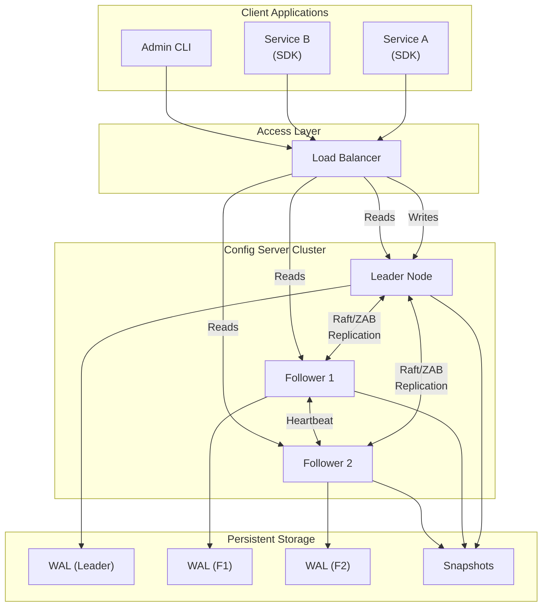
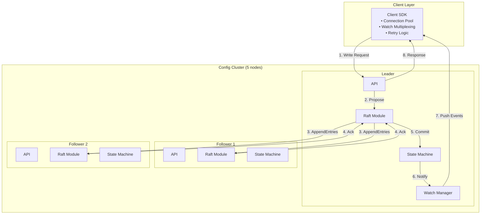
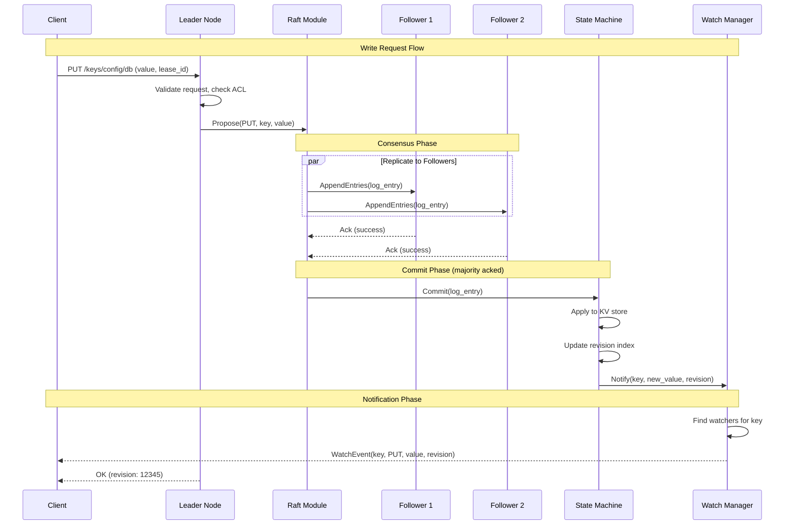
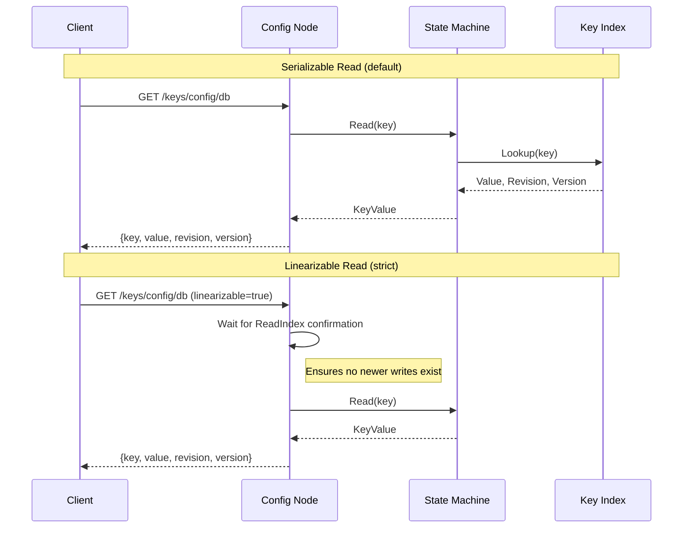
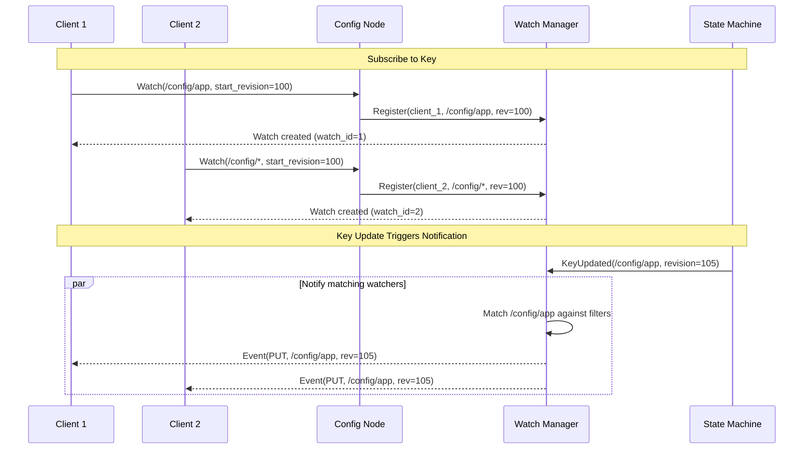
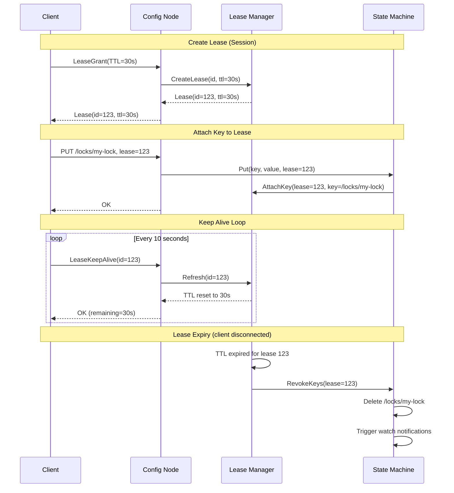
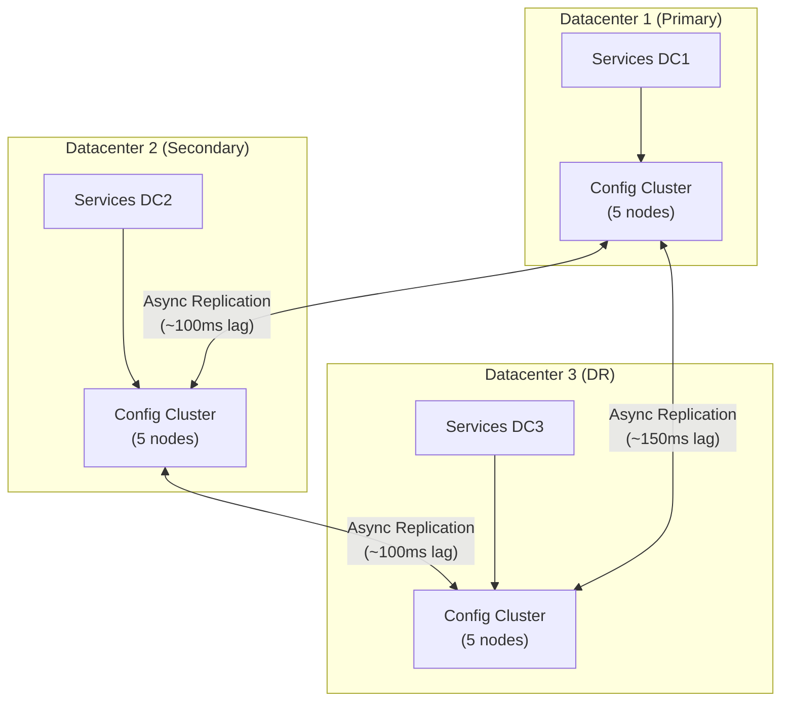
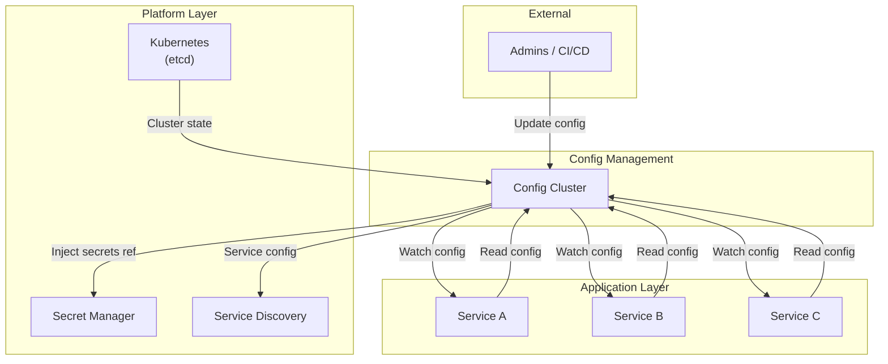

# High-Level Design

[← Back to Index](./00-index.md)

---

## System Architecture Overview

### Core Components



### Component Responsibilities

| Component | Responsibility | Key Operations |
|-----------|---------------|----------------|
| **Client SDK** | Connection management, watch handling, retry logic | Connect, Get, Put, Watch, Transaction |
| **Load Balancer** | Route writes to leader, distribute reads | Health checks, leader discovery |
| **Leader Node** | Accept writes, coordinate consensus, order operations | Propose, Commit, Replicate |
| **Follower Nodes** | Replicate leader's log, serve reads, vote in elections | Apply, Vote, Forward writes |
| **Watch Manager** | Track subscriptions, dispatch notifications | Subscribe, Notify, Coalesce |
| **Storage Engine** | Persist data, maintain indexes, manage WAL | Write WAL, Snapshot, Compact |

---

## Detailed Architecture

### Single Node Architecture

```
┌─────────────────────────────────────────────────────────────────────┐
│                        CONFIG SERVER NODE                            │
├─────────────────────────────────────────────────────────────────────┤
│                                                                      │
│  ┌─────────────────────────────────────────────────────────────┐   │
│  │                      API Layer (gRPC/HTTP)                    │   │
│  │  ┌──────────┐  ┌──────────┐  ┌──────────┐  ┌──────────┐     │   │
│  │  │   KV     │  │  Watch   │  │  Lease   │  │   Txn    │     │   │
│  │  │  API     │  │   API    │  │   API    │  │   API    │     │   │
│  │  └────┬─────┘  └────┬─────┘  └────┬─────┘  └────┬─────┘     │   │
│  └───────┼─────────────┼─────────────┼─────────────┼───────────┘   │
│          │             │             │             │                │
│  ┌───────┴─────────────┴─────────────┴─────────────┴───────────┐   │
│  │                     Request Handler                           │   │
│  │  ┌────────────────────────────────────────────────────────┐  │   │
│  │  │  • Authentication / Authorization                       │  │   │
│  │  │  • Rate Limiting                                        │  │   │
│  │  │  • Request Validation                                   │  │   │
│  │  │  • Read vs Write Routing                                │  │   │
│  │  └────────────────────────────────────────────────────────┘  │   │
│  └──────────────────────────┬───────────────────────────────────┘   │
│                             │                                        │
│  ┌──────────────────────────┴───────────────────────────────────┐   │
│  │                    Core Components                             │   │
│  │                                                                │   │
│  │  ┌────────────┐    ┌────────────┐    ┌────────────┐          │   │
│  │  │  Consensus │    │   Watch    │    │   Lease    │          │   │
│  │  │   Module   │    │  Manager   │    │  Manager   │          │   │
│  │  │  (Raft)    │    │            │    │            │          │   │
│  │  └─────┬──────┘    └─────┬──────┘    └─────┬──────┘          │   │
│  │        │                 │                 │                  │   │
│  │  ┌─────┴─────────────────┴─────────────────┴─────────────┐   │   │
│  │  │                   State Machine                        │   │   │
│  │  │   ┌─────────────────────────────────────────────────┐ │   │   │
│  │  │   │              In-Memory KV Store                  │ │   │   │
│  │  │   │   • B-tree/Radix tree for keys                  │ │   │   │
│  │  │   │   • Revision index for watches                  │ │   │   │
│  │  │   │   • Lease → Keys mapping                        │ │   │   │
│  │  │   └─────────────────────────────────────────────────┘ │   │   │
│  │  └───────────────────────────────────────────────────────┘   │   │
│  └──────────────────────────────────────────────────────────────┘   │
│                             │                                        │
│  ┌──────────────────────────┴───────────────────────────────────┐   │
│  │                    Storage Layer                               │   │
│  │  ┌────────────┐    ┌────────────┐    ┌────────────┐          │   │
│  │  │    WAL     │    │  Snapshot  │    │   Index    │          │   │
│  │  │  (Append)  │    │  (Periodic)│    │  (Memory)  │          │   │
│  │  └────────────┘    └────────────┘    └────────────┘          │   │
│  └──────────────────────────────────────────────────────────────┘   │
│                                                                      │
└─────────────────────────────────────────────────────────────────────┘
```

### Cluster Architecture



---

## Data Flow

### Write Path (Put/Delete)



### Read Path



### Watch Notification Flow



### Lease/Session Flow



---

## Key Architectural Decisions

### Decision 1: Consensus Protocol (Raft vs ZAB)

| Aspect | Raft | ZAB (ZooKeeper) |
|--------|------|-----------------|
| **Understandability** | Designed for clarity | More complex |
| **Leader Election** | Single term, random timeout | Epoch-based |
| **Log Replication** | Explicit log matching | ZXID ordering |
| **Implementations** | etcd, Consul, TiKV | ZooKeeper |
| **Recovery** | Leader sends full log | Snapshots + transaction log |

**Recommendation:** Raft for new systems (simpler to understand and implement), ZAB if building on ZooKeeper ecosystem.

### Decision 2: Data Model (Hierarchical vs Flat)

| Aspect | Hierarchical (ZooKeeper) | Flat (etcd) |
|--------|--------------------------|-------------|
| **Structure** | Tree of znodes | Key-value with prefixes |
| **Parent-Child** | Explicit (can watch children) | Implicit via prefix |
| **Overhead** | Node per path segment | Single key |
| **Queries** | Get children, recursive delete | Prefix range, delete range |

**Recommendation:** Flat with prefixes for simplicity; hierarchical if complex namespace management needed.

### Decision 3: Watch Model (One-Time vs Persistent)

| Aspect | One-Time Trigger (ZooKeeper) | Persistent Watch (etcd) |
|--------|------------------------------|-------------------------|
| **Re-registration** | Client must re-register after each event | Continuous until cancelled |
| **Missed Events** | Possible if slow re-registration | No, stream from revision |
| **Resource Usage** | Lower (transient) | Higher (long-lived connections) |
| **Implementation** | Simpler server-side | More complex, but reliable |

**Recommendation:** Persistent watch with revision tracking (etcd style) for reliability.

### Decision 4: Read Consistency

| Option | Behavior | Use Case |
|--------|----------|----------|
| **Serializable (default)** | May read stale data from follower | Config reads where slight staleness is OK |
| **Linearizable** | Guaranteed to see all prior writes | Critical coordination (locks, elections) |
| **Revision-based** | Read state at specific revision | Transactional consistency |

**Recommendation:** Default to serializable for performance; linearizable for coordination primitives.

---

## High-Level Data Flow Diagram

```
┌─────────────────────────────────────────────────────────────────────┐
│                    CONFIGURATION MANAGEMENT SYSTEM                   │
├─────────────────────────────────────────────────────────────────────┤
│                                                                      │
│   CLIENT LAYER                                                       │
│   ┌─────────────────────────────────────────────────────────────┐   │
│   │  Service A     Service B     Service C     Admin CLI         │   │
│   │     │              │             │             │             │   │
│   │     └──────────────┴─────────────┴─────────────┘             │   │
│   │                        │                                      │   │
│   │                   Client SDK                                  │   │
│   │              (gRPC/HTTP, Watch Mux)                          │   │
│   └────────────────────────┼────────────────────────────────────┘   │
│                            │                                        │
│   ACCESS LAYER             │                                        │
│   ┌────────────────────────┼────────────────────────────────────┐   │
│   │                   Load Balancer                              │   │
│   │            (Leader discovery, health checks)                 │   │
│   └────────────────────────┼────────────────────────────────────┘   │
│                            │                                        │
│   CONSENSUS LAYER          │                                        │
│   ┌────────────────────────┼────────────────────────────────────┐   │
│   │           ┌────────────┴────────────┐                       │   │
│   │           │      LEADER NODE        │                       │   │
│   │           │  ┌──────────────────┐   │                       │   │
│   │           │  │    Raft Module   │   │                       │   │
│   │           │  │  • Propose       │   │                       │   │
│   │           │  │  • Replicate     │   │                       │   │
│   │           │  │  • Commit        │   │                       │   │
│   │           │  └────────┬─────────┘   │                       │   │
│   │           │           │             │                       │   │
│   │     ┌─────┼───────────┼─────────────┼─────┐                 │   │
│   │     │     │           │             │     │                 │   │
│   │     ▼     │           ▼             │     ▼                 │   │
│   │  ┌──────┐ │     ┌──────────┐        │  ┌──────┐            │   │
│   │  │ F1   │◄┼─────│ Replicate├────────┼─►│  F2  │            │   │
│   │  └──────┘ │     └──────────┘        │  └──────┘            │   │
│   │           │                         │                       │   │
│   │           └─────────────────────────┘                       │   │
│   └─────────────────────────────────────────────────────────────┘   │
│                            │                                        │
│   STATE MACHINE            │                                        │
│   ┌────────────────────────┼────────────────────────────────────┐   │
│   │           ┌────────────┴────────────┐                       │   │
│   │           │     Apply to State      │                       │   │
│   │           └────────────┬────────────┘                       │   │
│   │                        │                                     │   │
│   │     ┌──────────────────┼──────────────────┐                 │   │
│   │     │                  │                  │                 │   │
│   │     ▼                  ▼                  ▼                 │   │
│   │  ┌──────────┐    ┌──────────┐    ┌──────────┐              │   │
│   │  │  KV      │    │  Watch   │    │  Lease   │              │   │
│   │  │  Index   │    │ Manager  │    │ Manager  │              │   │
│   │  └──────────┘    └──────────┘    └──────────┘              │   │
│   └─────────────────────────────────────────────────────────────┘   │
│                            │                                        │
│   STORAGE LAYER            │                                        │
│   ┌────────────────────────┼────────────────────────────────────┐   │
│   │     ┌──────────────────┼──────────────────┐                 │   │
│   │     │                  │                  │                 │   │
│   │     ▼                  ▼                  ▼                 │   │
│   │  ┌──────────┐    ┌──────────┐    ┌──────────┐              │   │
│   │  │   WAL    │    │ Snapshot │    │ Compacted│              │   │
│   │  │ (Active) │    │(Periodic)│    │  (Old)   │              │   │
│   │  └──────────┘    └──────────┘    └──────────┘              │   │
│   └─────────────────────────────────────────────────────────────┘   │
│                                                                      │
└─────────────────────────────────────────────────────────────────────┘
```

---

## Multi-Datacenter Architecture

### Regional Cluster Deployment



### Multi-DC Consistency Options

```
┌─────────────────────────────────────────────────────────────────────┐
│  MULTI-DC DEPLOYMENT OPTIONS                                         │
├─────────────────────────────────────────────────────────────────────┤
│                                                                      │
│  OPTION 1: Single Global Cluster (Strong Consistency)               │
│  ┌───────────────────────────────────────────────────────────────┐ │
│  │  DC1: L, F1          DC2: F2, F3          DC3: F4              │ │
│  │                                                                 │ │
│  │  Pros: Strong consistency, single source of truth              │ │
│  │  Cons: High write latency (WAN RTT), unavailable if DC1 lost  │ │
│  │  Use: Critical coordination where consistency > latency        │ │
│  └───────────────────────────────────────────────────────────────┘ │
│                                                                      │
│  OPTION 2: Regional Clusters + Async Replication                    │
│  ┌───────────────────────────────────────────────────────────────┐ │
│  │  DC1: [L, F1, F2]    DC2: [L, F1, F2]    DC3: [L, F1, F2]     │ │
│  │        ↓ async             ↓ async             ↓ async         │ │
│  │        └─────────────────────────────────────────┘             │ │
│  │                                                                 │ │
│  │  Pros: Low latency writes, regional availability               │ │
│  │  Cons: Eventual consistency cross-DC, conflict resolution      │ │
│  │  Use: Config that can tolerate ~1s staleness                   │ │
│  └───────────────────────────────────────────────────────────────┘ │
│                                                                      │
│  OPTION 3: Primary + Read Replicas (Consul Model)                   │
│  ┌───────────────────────────────────────────────────────────────┐ │
│  │  DC1: Primary Cluster    DC2: WAN-joined    DC3: WAN-joined   │ │
│  │        (writes)           (forwarded)        (forwarded)       │ │
│  │                                                                 │ │
│  │  Pros: Single write path, reads anywhere                       │ │
│  │  Cons: Write latency from DC2/DC3, primary is SPOF            │ │
│  │  Use: Write-light workloads with geo-distributed reads        │ │
│  └───────────────────────────────────────────────────────────────┘ │
│                                                                      │
└─────────────────────────────────────────────────────────────────────┘
```

---

## Integration Points

### Where Config Management Fits



### Common Integrations

| Integration | Purpose | Pattern |
|-------------|---------|---------|
| **Kubernetes** | etcd stores all cluster state | Native control plane |
| **Service Mesh** | Envoy xDS configuration | Watch for updates |
| **CI/CD Pipeline** | Deploy config changes | Write on deployment |
| **Feature Flags** | Runtime toggles | Watch + local cache |
| **Secret Manager** | Reference secrets | Config points to Vault path |
| **Monitoring** | Prometheus targets | Watch for scrape config |
| **Load Balancer** | Backend pool updates | Watch for upstream changes |
