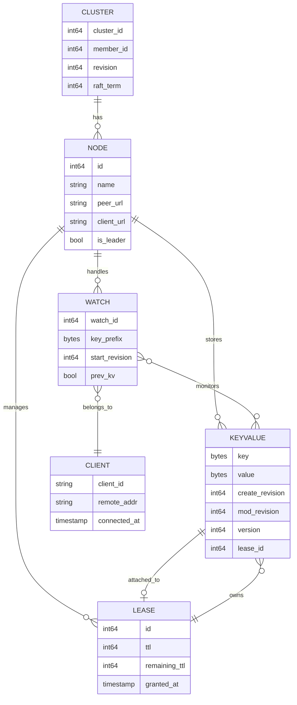
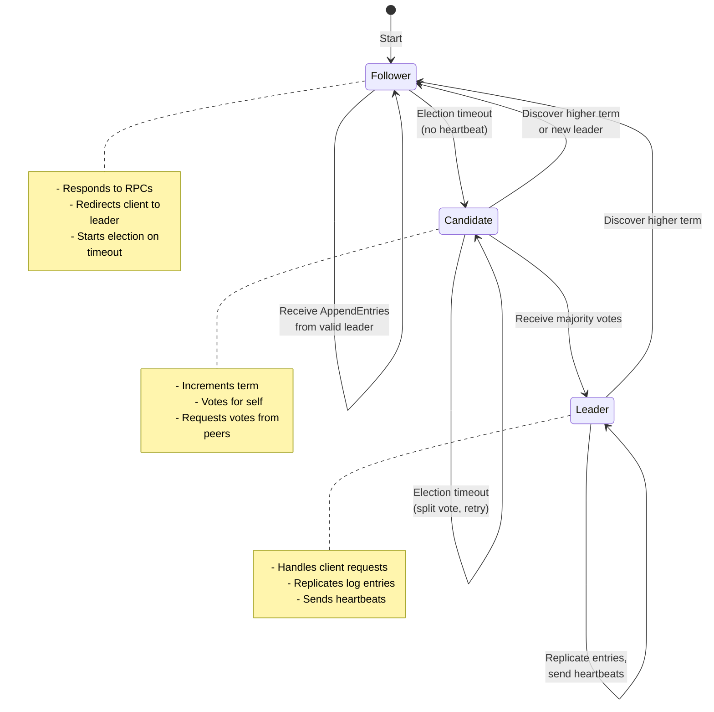
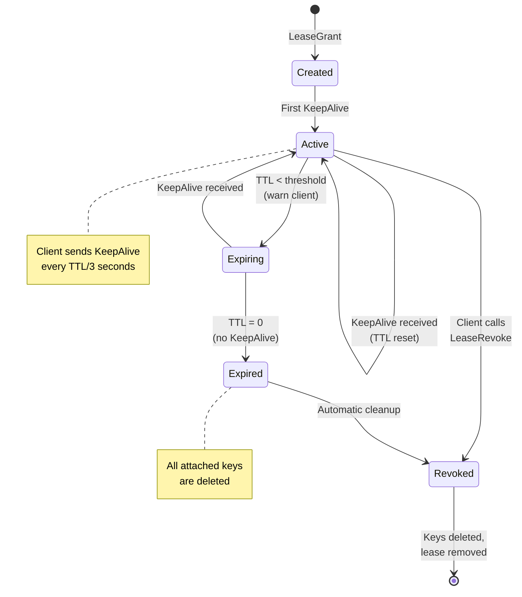

# Low-Level Design

[← Back to Index](./00-index.md)

---

## Data Model

### Core Entities

```
┌─────────────────────────────────────────────────────────────────────┐
│  CORE DATA MODEL                                                     │
├─────────────────────────────────────────────────────────────────────┤
│                                                                      │
│  KeyValue                                                            │
│  ┌─────────────────────────────────────────────────────────────┐   │
│  │  key              : bytes     # "/config/payment/timeout"   │   │
│  │  value            : bytes     # Serialized config payload   │   │
│  │  create_revision  : int64     # Global revision at creation │   │
│  │  mod_revision     : int64     # Global revision at last mod │   │
│  │  version          : int64     # Per-key version counter     │   │
│  │  lease_id         : int64     # 0 if no lease attached      │   │
│  └─────────────────────────────────────────────────────────────┘   │
│                                                                      │
│  Lease                                                               │
│  ┌─────────────────────────────────────────────────────────────┐   │
│  │  id               : int64     # Unique lease identifier     │   │
│  │  ttl              : int64     # Time-to-live in seconds     │   │
│  │  remaining_ttl    : int64     # Time until expiry           │   │
│  │  granted_ttl      : int64     # Original TTL at grant       │   │
│  │  attached_keys    : []bytes   # Keys bound to this lease    │   │
│  └─────────────────────────────────────────────────────────────┘   │
│                                                                      │
│  WatchSubscription                                                   │
│  ┌─────────────────────────────────────────────────────────────┐   │
│  │  watch_id         : int64     # Unique watch identifier     │   │
│  │  key              : bytes     # Key or prefix to watch      │   │
│  │  range_end        : bytes     # End of range (for prefix)   │   │
│  │  start_revision   : int64     # Start streaming from here   │   │
│  │  filters          : []Filter  # PUT, DELETE, etc.           │   │
│  │  client_id        : string    # Client connection ID        │   │
│  └─────────────────────────────────────────────────────────────┘   │
│                                                                      │
│  Event                                                               │
│  ┌─────────────────────────────────────────────────────────────┐   │
│  │  type             : EventType # PUT, DELETE                 │   │
│  │  kv               : KeyValue  # Current key-value           │   │
│  │  prev_kv          : KeyValue  # Previous value (optional)   │   │
│  └─────────────────────────────────────────────────────────────┘   │
│                                                                      │
└─────────────────────────────────────────────────────────────────────┘
```

### Revision and Version Tracking

```
┌─────────────────────────────────────────────────────────────────────┐
│  REVISION TRACKING                                                   │
├─────────────────────────────────────────────────────────────────────┤
│                                                                      │
│  Global Revision (cluster-wide logical clock):                       │
│  ┌─────────────────────────────────────────────────────────────┐   │
│  │  revision = 1    # Initial state                             │   │
│  │                                                               │   │
│  │  PUT /a → revision = 2                                       │   │
│  │  PUT /b → revision = 3                                       │   │
│  │  PUT /a → revision = 4  (update)                             │   │
│  │  DELETE /b → revision = 5                                    │   │
│  │                                                               │   │
│  │  Key /a: create_revision=2, mod_revision=4, version=2       │   │
│  │  Key /b: deleted at revision 5                               │   │
│  └─────────────────────────────────────────────────────────────┘   │
│                                                                      │
│  Uses:                                                               │
│  • Watch from specific point in time                                │
│  • Consistent snapshots (read at revision X)                        │
│  • Optimistic concurrency (compare mod_revision)                    │
│  • Compaction (delete history before revision X)                    │
│                                                                      │
└─────────────────────────────────────────────────────────────────────┘
```

### Storage Layout

```
┌─────────────────────────────────────────────────────────────────────┐
│  STORAGE ORGANIZATION                                                │
├─────────────────────────────────────────────────────────────────────┤
│                                                                      │
│  In-Memory Structures:                                               │
│                                                                      │
│  1. Key Index (B-tree or Radix tree)                                │
│     ┌──────────────────────────────────────────┐                   │
│     │  Key → {KeyValue, ModRevision, Lease}    │                   │
│     │                                           │                   │
│     │  /config/app/db     → {value, rev=100}   │                   │
│     │  /config/app/cache  → {value, rev=105}   │                   │
│     │  /config/app/queue  → {value, rev=110}   │                   │
│     └──────────────────────────────────────────┘                   │
│                                                                      │
│  2. Revision Index (for watches)                                    │
│     ┌──────────────────────────────────────────┐                   │
│     │  Revision → {Key, EventType}              │                   │
│     │                                           │                   │
│     │  100 → {/config/app/db, PUT}             │                   │
│     │  101 → {/config/app/db, PUT}             │                   │
│     │  105 → {/config/app/cache, PUT}          │                   │
│     │  110 → {/config/app/queue, PUT}          │                   │
│     └──────────────────────────────────────────┘                   │
│                                                                      │
│  3. Lease Index                                                      │
│     ┌──────────────────────────────────────────┐                   │
│     │  LeaseID → {TTL, Keys[], LastRefresh}    │                   │
│     │                                           │                   │
│     │  lease-123 → {30s, [/locks/a], now()}   │                   │
│     │  lease-456 → {60s, [/locks/b, /locks/c]}│                   │
│     └──────────────────────────────────────────┘                   │
│                                                                      │
│  On-Disk Storage:                                                    │
│                                                                      │
│  4. Write-Ahead Log (WAL)                                           │
│     ┌──────────────────────────────────────────┐                   │
│     │  [Entry 1][Entry 2][Entry 3]...[Entry N] │                   │
│     │                                           │                   │
│     │  Entry: {Term, Index, Type, Key, Value}  │                   │
│     └──────────────────────────────────────────┘                   │
│                                                                      │
│  5. Snapshot                                                         │
│     ┌──────────────────────────────────────────┐                   │
│     │  {revision: 10000, data: serialized_kv}  │                   │
│     └──────────────────────────────────────────┘                   │
│                                                                      │
└─────────────────────────────────────────────────────────────────────┘
```

### Entity Relationships



---

## API Design

### KV Operations API

```
┌─────────────────────────────────────────────────────────────────────┐
│  KV API                                                              │
├─────────────────────────────────────────────────────────────────────┤
│                                                                      │
│  PUT (Create/Update Key)                                             │
│  ┌─────────────────────────────────────────────────────────────┐   │
│  │  Request:                                                     │   │
│  │    key         : bytes       # Key path                      │   │
│  │    value       : bytes       # Value payload                 │   │
│  │    lease       : int64       # Optional lease ID             │   │
│  │    prev_kv     : bool        # Return previous value?        │   │
│  │    ignore_value: bool        # Update lease only             │   │
│  │    ignore_lease: bool        # Update value only             │   │
│  │                                                               │   │
│  │  Response:                                                    │   │
│  │    header      : ResponseHeader  # Revision, cluster info    │   │
│  │    prev_kv     : KeyValue        # Previous value if existed │   │
│  └─────────────────────────────────────────────────────────────┘   │
│                                                                      │
│  GET (Read Key/Range)                                                │
│  ┌─────────────────────────────────────────────────────────────┐   │
│  │  Request:                                                     │   │
│  │    key         : bytes       # Key or range start            │   │
│  │    range_end   : bytes       # Range end (prefix queries)    │   │
│  │    revision    : int64       # Read at specific revision     │   │
│  │    limit       : int64       # Max keys to return            │   │
│  │    sort_order  : enum        # ASCEND, DESCEND               │   │
│  │    sort_target : enum        # KEY, VERSION, CREATE, MOD     │   │
│  │    serializable: bool        # Allow stale reads?            │   │
│  │    keys_only   : bool        # Return keys without values    │   │
│  │    count_only  : bool        # Return count only             │   │
│  │                                                               │   │
│  │  Response:                                                    │   │
│  │    header      : ResponseHeader                               │   │
│  │    kvs         : []KeyValue      # Matching key-values       │   │
│  │    more        : bool            # More results available    │   │
│  │    count       : int64           # Total count (if requested)│   │
│  └─────────────────────────────────────────────────────────────┘   │
│                                                                      │
│  DELETE (Remove Key/Range)                                           │
│  ┌─────────────────────────────────────────────────────────────┐   │
│  │  Request:                                                     │   │
│  │    key         : bytes       # Key or range start            │   │
│  │    range_end   : bytes       # Range end                     │   │
│  │    prev_kv     : bool        # Return deleted values?        │   │
│  │                                                               │   │
│  │  Response:                                                    │   │
│  │    header      : ResponseHeader                               │   │
│  │    deleted     : int64           # Number of keys deleted    │   │
│  │    prev_kvs    : []KeyValue      # Deleted key-values        │   │
│  └─────────────────────────────────────────────────────────────┘   │
│                                                                      │
└─────────────────────────────────────────────────────────────────────┘
```

### Transaction API

```
┌─────────────────────────────────────────────────────────────────────┐
│  TRANSACTION API (Compare-and-Swap)                                  │
├─────────────────────────────────────────────────────────────────────┤
│                                                                      │
│  Transaction:                                                        │
│    IF (compare conditions are true)                                  │
│    THEN (execute success operations)                                 │
│    ELSE (execute failure operations)                                 │
│                                                                      │
│  ┌─────────────────────────────────────────────────────────────┐   │
│  │  Request:                                                     │   │
│  │    compare     : []Compare   # Conditions to evaluate        │   │
│  │    success     : []Op        # Ops if all compares pass      │   │
│  │    failure     : []Op        # Ops if any compare fails      │   │
│  │                                                               │   │
│  │  Compare:                                                     │   │
│  │    key         : bytes       # Key to compare                │   │
│  │    target      : enum        # VERSION, CREATE, MOD, VALUE   │   │
│  │    result      : enum        # EQUAL, GREATER, LESS, NOT_EQ  │   │
│  │    value       : depends     # Version number or bytes       │   │
│  │                                                               │   │
│  │  Op (Operation):                                              │   │
│  │    request_put    : PutRequest                                │   │
│  │    request_range  : RangeRequest                              │   │
│  │    request_delete : DeleteRequest                             │   │
│  │                                                               │   │
│  │  Response:                                                    │   │
│  │    header      : ResponseHeader                               │   │
│  │    succeeded   : bool            # Compare result             │   │
│  │    responses   : []ResponseOp    # Results of executed ops   │   │
│  └─────────────────────────────────────────────────────────────┘   │
│                                                                      │
│  Example: Acquire Lock                                               │
│  ┌─────────────────────────────────────────────────────────────┐   │
│  │  Txn(                                                         │   │
│  │    compare: [                                                 │   │
│  │      {key="/lock/resource", target=CREATE, result=EQUAL, 0}  │   │
│  │    ],                                                         │   │
│  │    success: [                                                 │   │
│  │      Put(key="/lock/resource", value="holder-1", lease=123)  │   │
│  │    ],                                                         │   │
│  │    failure: []  // Lock already held                         │   │
│  │  )                                                            │   │
│  │                                                               │   │
│  │  // If create_revision == 0 (key doesn't exist), create it   │   │
│  │  // Otherwise, do nothing (lock is held)                     │   │
│  └─────────────────────────────────────────────────────────────┘   │
│                                                                      │
└─────────────────────────────────────────────────────────────────────┘
```

### Watch API

```
┌─────────────────────────────────────────────────────────────────────┐
│  WATCH API                                                           │
├─────────────────────────────────────────────────────────────────────┤
│                                                                      │
│  WatchCreate (Subscribe)                                             │
│  ┌─────────────────────────────────────────────────────────────┐   │
│  │  Request:                                                     │   │
│  │    key              : bytes     # Key or prefix start        │   │
│  │    range_end        : bytes     # Prefix end (for range)     │   │
│  │    start_revision   : int64     # Start from this revision   │   │
│  │    progress_notify  : bool      # Send periodic progress     │   │
│  │    filters          : []Filter  # NOPUT, NODELETE            │   │
│  │    prev_kv          : bool      # Include previous values    │   │
│  │    watch_id         : int64     # Client-specified ID        │   │
│  │    fragment         : bool      # Allow response fragmentation│   │
│  │                                                               │   │
│  │  Response (stream):                                           │   │
│  │    header           : ResponseHeader                          │   │
│  │    watch_id         : int64     # Assigned watch ID          │   │
│  │    created          : bool      # True on watch creation     │   │
│  │    canceled         : bool      # True if watch canceled     │   │
│  │    compact_revision : int64     # If start_rev was compacted │   │
│  │    events           : []Event   # Change events              │   │
│  └─────────────────────────────────────────────────────────────┘   │
│                                                                      │
│  WatchCancel (Unsubscribe)                                           │
│  ┌─────────────────────────────────────────────────────────────┐   │
│  │  Request:                                                     │   │
│  │    watch_id    : int64       # Watch to cancel               │   │
│  │                                                               │   │
│  │  Response:                                                    │   │
│  │    header      : ResponseHeader                               │   │
│  │    watch_id    : int64                                        │   │
│  │    canceled    : bool        # Confirmation                   │   │
│  └─────────────────────────────────────────────────────────────┘   │
│                                                                      │
│  Event Types:                                                        │
│  ┌─────────────────────────────────────────────────────────────┐   │
│  │  PUT     : Key created or updated                            │   │
│  │  DELETE  : Key deleted                                        │   │
│  └─────────────────────────────────────────────────────────────┘   │
│                                                                      │
└─────────────────────────────────────────────────────────────────────┘
```

### Lease API

```
┌─────────────────────────────────────────────────────────────────────┐
│  LEASE API                                                           │
├─────────────────────────────────────────────────────────────────────┤
│                                                                      │
│  LeaseGrant (Create Session)                                         │
│  ┌─────────────────────────────────────────────────────────────┐   │
│  │  Request:                                                     │   │
│  │    ttl         : int64       # Requested TTL in seconds      │   │
│  │    id          : int64       # Optional client-specified ID  │   │
│  │                                                               │   │
│  │  Response:                                                    │   │
│  │    header      : ResponseHeader                               │   │
│  │    id          : int64       # Assigned lease ID             │   │
│  │    ttl         : int64       # Actual TTL (may differ)       │   │
│  │    error       : string      # Error message if any          │   │
│  └─────────────────────────────────────────────────────────────┘   │
│                                                                      │
│  LeaseRevoke (End Session)                                           │
│  ┌─────────────────────────────────────────────────────────────┐   │
│  │  Request:                                                     │   │
│  │    id          : int64       # Lease to revoke               │   │
│  │                                                               │   │
│  │  Response:                                                    │   │
│  │    header      : ResponseHeader                               │   │
│  │    // All keys attached to lease are deleted                 │   │
│  └─────────────────────────────────────────────────────────────┘   │
│                                                                      │
│  LeaseKeepAlive (Heartbeat - bidirectional stream)                   │
│  ┌─────────────────────────────────────────────────────────────┐   │
│  │  Request (stream):                                            │   │
│  │    id          : int64       # Lease to refresh              │   │
│  │                                                               │   │
│  │  Response (stream):                                           │   │
│  │    header      : ResponseHeader                               │   │
│  │    id          : int64       # Refreshed lease ID            │   │
│  │    ttl         : int64       # Remaining TTL                 │   │
│  └─────────────────────────────────────────────────────────────┘   │
│                                                                      │
│  LeaseTimeToLive (Query Lease)                                       │
│  ┌─────────────────────────────────────────────────────────────┐   │
│  │  Request:                                                     │   │
│  │    id          : int64       # Lease to query                │   │
│  │    keys        : bool        # Return attached keys?         │   │
│  │                                                               │   │
│  │  Response:                                                    │   │
│  │    header      : ResponseHeader                               │   │
│  │    id          : int64                                        │   │
│  │    ttl         : int64       # Remaining TTL (-1 if expired) │   │
│  │    granted_ttl : int64       # Original TTL                  │   │
│  │    keys        : []bytes     # Attached keys if requested    │   │
│  └─────────────────────────────────────────────────────────────┘   │
│                                                                      │
└─────────────────────────────────────────────────────────────────────┘
```

---

## Core Algorithms

### Raft Consensus Algorithm

```
┌─────────────────────────────────────────────────────────────────────┐
│  RAFT CONSENSUS PSEUDOCODE                                           │
├─────────────────────────────────────────────────────────────────────┤
│                                                                      │
│  State per node:                                                     │
│    current_term    : int        # Current election term             │
│    voted_for       : node_id    # Candidate voted for in term       │
│    log[]           : LogEntry   # Replicated log entries            │
│    commit_index    : int        # Highest committed entry           │
│    last_applied    : int        # Highest applied to state machine  │
│                                                                      │
│  Leader additional state:                                            │
│    next_index[]    : int        # Next entry to send to each node   │
│    match_index[]   : int        # Highest replicated on each node   │
│                                                                      │
│  ─────────────────────────────────────────────────────────────────  │
│                                                                      │
│  LEADER ELECTION:                                                    │
│                                                                      │
│  function start_election():                                          │
│      current_term += 1                                               │
│      voted_for = self                                                │
│      votes_received = 1                                              │
│      reset_election_timer()                                          │
│                                                                      │
│      for each peer in cluster:                                       │
│          send RequestVote(                                           │
│              term = current_term,                                    │
│              candidate_id = self,                                    │
│              last_log_index = len(log) - 1,                         │
│              last_log_term = log[last].term                         │
│          )                                                           │
│                                                                      │
│  function on_RequestVote(req):                                       │
│      if req.term < current_term:                                     │
│          return (current_term, false)                                │
│                                                                      │
│      if req.term > current_term:                                     │
│          become_follower(req.term)                                   │
│                                                                      │
│      log_ok = (req.last_log_term > my_last_term) or                 │
│               (req.last_log_term == my_last_term and                │
│                req.last_log_index >= my_last_index)                 │
│                                                                      │
│      if voted_for in (null, req.candidate_id) and log_ok:           │
│          voted_for = req.candidate_id                                │
│          reset_election_timer()                                      │
│          return (current_term, true)                                 │
│                                                                      │
│      return (current_term, false)                                    │
│                                                                      │
│  ─────────────────────────────────────────────────────────────────  │
│                                                                      │
│  LOG REPLICATION:                                                    │
│                                                                      │
│  function leader_append(command):                                    │
│      entry = LogEntry(term=current_term, command=command)           │
│      log.append(entry)                                               │
│      replicate_to_followers()                                        │
│      wait_for_majority()                                             │
│      commit_index = len(log) - 1                                    │
│      apply_to_state_machine(entry)                                   │
│      return success                                                  │
│                                                                      │
│  function send_AppendEntries(peer):                                  │
│      prev_index = next_index[peer] - 1                              │
│      prev_term = log[prev_index].term if prev_index >= 0 else 0    │
│      entries = log[next_index[peer]:]                               │
│                                                                      │
│      send to peer: AppendEntries(                                   │
│          term = current_term,                                        │
│          leader_id = self,                                           │
│          prev_log_index = prev_index,                                │
│          prev_log_term = prev_term,                                  │
│          entries = entries,                                          │
│          leader_commit = commit_index                                │
│      )                                                               │
│                                                                      │
│  function on_AppendEntries(req):                                     │
│      if req.term < current_term:                                     │
│          return (current_term, false)                                │
│                                                                      │
│      if req.term > current_term:                                     │
│          become_follower(req.term)                                   │
│                                                                      │
│      reset_election_timer()                                          │
│                                                                      │
│      # Check log consistency                                         │
│      if req.prev_log_index >= 0:                                    │
│          if len(log) <= req.prev_log_index:                         │
│              return (current_term, false)  # Missing entries        │
│          if log[req.prev_log_index].term != req.prev_log_term:      │
│              log = log[:req.prev_log_index]  # Truncate conflict   │
│              return (current_term, false)                            │
│                                                                      │
│      # Append new entries                                            │
│      for entry in req.entries:                                       │
│          log.append(entry)                                           │
│                                                                      │
│      # Update commit index                                           │
│      if req.leader_commit > commit_index:                           │
│          commit_index = min(req.leader_commit, len(log) - 1)        │
│          apply_committed_entries()                                   │
│                                                                      │
│      return (current_term, true)                                     │
│                                                                      │
└─────────────────────────────────────────────────────────────────────┘
```

### Raft State Machine Diagram



### Watch Notification Algorithm

```
┌─────────────────────────────────────────────────────────────────────┐
│  WATCH NOTIFICATION ALGORITHM                                        │
├─────────────────────────────────────────────────────────────────────┤
│                                                                      │
│  Data Structures:                                                    │
│    watches: Map<WatchID, WatchState>                                │
│    key_watchers: Map<Key, Set<WatchID>>   # Exact key matches      │
│    prefix_watchers: IntervalTree<WatchID> # Prefix/range watches   │
│    pending_events: Map<WatchID, Queue<Event>>                       │
│                                                                      │
│  WatchState:                                                         │
│    watch_id     : int64                                             │
│    key          : bytes                                              │
│    range_end    : bytes                                              │
│    start_rev    : int64                                             │
│    last_sent_rev: int64                                             │
│    filters      : []EventType                                       │
│    client_stream: Stream                                             │
│                                                                      │
│  ─────────────────────────────────────────────────────────────────  │
│                                                                      │
│  function create_watch(req, client_stream):                          │
│      watch_id = generate_watch_id()                                  │
│      state = WatchState(                                             │
│          watch_id = watch_id,                                        │
│          key = req.key,                                              │
│          range_end = req.range_end,                                  │
│          start_rev = max(req.start_revision, compacted_revision+1), │
│          last_sent_rev = req.start_revision - 1,                    │
│          filters = req.filters,                                      │
│          client_stream = client_stream                               │
│      )                                                               │
│      watches[watch_id] = state                                       │
│                                                                      │
│      # Index the watch for efficient lookup                         │
│      if req.range_end is empty:                                     │
│          key_watchers[req.key].add(watch_id)                        │
│      else:                                                           │
│          prefix_watchers.insert(req.key, req.range_end, watch_id)   │
│                                                                      │
│      # Send historical events if start_revision specified           │
│      if req.start_revision > 0:                                     │
│          send_historical_events(state)                               │
│                                                                      │
│      return watch_id                                                 │
│                                                                      │
│  ─────────────────────────────────────────────────────────────────  │
│                                                                      │
│  function on_key_changed(key, event_type, kv, prev_kv, revision):   │
│      # Find all watchers interested in this key                     │
│      interested = Set()                                              │
│                                                                      │
│      # Check exact key watchers                                      │
│      if key in key_watchers:                                        │
│          interested.union(key_watchers[key])                        │
│                                                                      │
│      # Check prefix/range watchers                                   │
│      interested.union(prefix_watchers.find_overlapping(key))        │
│                                                                      │
│      # Queue event for each interested watcher                      │
│      event = Event(type=event_type, kv=kv, prev_kv=prev_kv)         │
│      for watch_id in interested:                                    │
│          state = watches[watch_id]                                   │
│                                                                      │
│          # Apply filters                                             │
│          if event_type in state.filters:                            │
│              continue  # Filtered out                                │
│                                                                      │
│          # Only send events >= start_revision                        │
│          if revision < state.start_rev:                              │
│              continue                                                 │
│                                                                      │
│          pending_events[watch_id].enqueue(event)                    │
│                                                                      │
│      # Trigger batch send (coalesced)                               │
│      schedule_send_events()                                          │
│                                                                      │
│  ─────────────────────────────────────────────────────────────────  │
│                                                                      │
│  function send_events_batch():                                       │
│      for watch_id, queue in pending_events:                         │
│          if queue.empty():                                           │
│              continue                                                 │
│                                                                      │
│          state = watches[watch_id]                                   │
│          events = []                                                 │
│                                                                      │
│          # Batch up to MAX_EVENTS_PER_RESPONSE                      │
│          while len(events) < MAX_EVENTS and not queue.empty():      │
│              events.append(queue.dequeue())                          │
│                                                                      │
│          # Send to client                                            │
│          response = WatchResponse(                                   │
│              watch_id = watch_id,                                    │
│              events = events,                                        │
│              header = current_header()                               │
│          )                                                           │
│          state.client_stream.send(response)                         │
│          state.last_sent_rev = events[-1].kv.mod_revision           │
│                                                                      │
└─────────────────────────────────────────────────────────────────────┘
```

### Session/Lease Management Algorithm

```
┌─────────────────────────────────────────────────────────────────────┐
│  LEASE MANAGEMENT ALGORITHM                                          │
├─────────────────────────────────────────────────────────────────────┤
│                                                                      │
│  Data Structures:                                                    │
│    leases: Map<LeaseID, LeaseState>                                 │
│    lease_queue: MinHeap<(expiry_time, LeaseID)>  # Expiry ordering │
│    key_to_lease: Map<Key, LeaseID>                                  │
│                                                                      │
│  LeaseState:                                                         │
│    id          : int64                                               │
│    ttl         : int64       # Original TTL                         │
│    expiry      : timestamp   # When lease expires                   │
│    keys        : Set<Key>    # Attached keys                        │
│                                                                      │
│  ─────────────────────────────────────────────────────────────────  │
│                                                                      │
│  function grant_lease(ttl, client_id):                               │
│      lease_id = generate_lease_id()                                  │
│      expiry = now() + ttl                                            │
│                                                                      │
│      state = LeaseState(                                             │
│          id = lease_id,                                              │
│          ttl = ttl,                                                  │
│          expiry = expiry,                                            │
│          keys = Set()                                                │
│      )                                                               │
│      leases[lease_id] = state                                        │
│      lease_queue.push((expiry, lease_id))                           │
│                                                                      │
│      # Replicate through Raft                                        │
│      raft_propose(LeaseGrant(lease_id, ttl))                        │
│                                                                      │
│      return lease_id                                                 │
│                                                                      │
│  ─────────────────────────────────────────────────────────────────  │
│                                                                      │
│  function attach_key_to_lease(key, lease_id):                        │
│      if lease_id not in leases:                                     │
│          return error("lease not found")                             │
│                                                                      │
│      if key in key_to_lease:                                        │
│          old_lease = key_to_lease[key]                              │
│          leases[old_lease].keys.remove(key)                         │
│                                                                      │
│      leases[lease_id].keys.add(key)                                 │
│      key_to_lease[key] = lease_id                                   │
│                                                                      │
│  ─────────────────────────────────────────────────────────────────  │
│                                                                      │
│  function keep_alive(lease_id):                                      │
│      if lease_id not in leases:                                     │
│          return error("lease not found or expired")                 │
│                                                                      │
│      state = leases[lease_id]                                        │
│      state.expiry = now() + state.ttl                               │
│                                                                      │
│      # Update heap (or lazy update on expiry check)                 │
│      lease_queue.update_priority(lease_id, state.expiry)            │
│                                                                      │
│      return (lease_id, state.ttl)                                   │
│                                                                      │
│  ─────────────────────────────────────────────────────────────────  │
│                                                                      │
│  function lease_expiry_checker():   # Background goroutine          │
│      while true:                                                     │
│          sleep(CHECK_INTERVAL)  # e.g., 500ms                       │
│                                                                      │
│          while not lease_queue.empty():                             │
│              (expiry, lease_id) = lease_queue.peek()                │
│                                                                      │
│              if expiry > now():                                     │
│                  break  # No more expired leases                    │
│                                                                      │
│              lease_queue.pop()                                       │
│              revoke_lease(lease_id)                                  │
│                                                                      │
│  ─────────────────────────────────────────────────────────────────  │
│                                                                      │
│  function revoke_lease(lease_id):                                    │
│      if lease_id not in leases:                                     │
│          return  # Already revoked                                   │
│                                                                      │
│      state = leases[lease_id]                                        │
│                                                                      │
│      # Delete all attached keys                                      │
│      for key in state.keys:                                         │
│          delete_key(key)  # Triggers watch notifications            │
│          key_to_lease.remove(key)                                   │
│                                                                      │
│      leases.remove(lease_id)                                         │
│                                                                      │
│      # Replicate through Raft                                        │
│      raft_propose(LeaseRevoke(lease_id))                            │
│                                                                      │
└─────────────────────────────────────────────────────────────────────┘
```

### Session Lifecycle State Machine



---

## Key Prefix Queries

### Prefix Range Calculation

```
┌─────────────────────────────────────────────────────────────────────┐
│  PREFIX QUERY IMPLEMENTATION                                         │
├─────────────────────────────────────────────────────────────────────┤
│                                                                      │
│  To query all keys with prefix "/config/app/":                       │
│                                                                      │
│  key       = "/config/app/"                                         │
│  range_end = "/config/app0"   # Increment last byte                │
│                                                                      │
│  This matches: /config/app/db, /config/app/cache, /config/app/x    │
│  Does NOT match: /config/application, /config/apps                  │
│                                                                      │
│  ─────────────────────────────────────────────────────────────────  │
│                                                                      │
│  function prefix_range_end(prefix):                                  │
│      if prefix is empty:                                             │
│          return "\x00"  # Match all keys                            │
│                                                                      │
│      end = prefix.copy()                                             │
│      i = len(end) - 1                                                │
│                                                                      │
│      # Find rightmost byte that can be incremented                  │
│      while i >= 0:                                                   │
│          if end[i] < 0xFF:                                          │
│              end[i] += 1                                             │
│              return end[:i+1]                                        │
│          i -= 1                                                      │
│                                                                      │
│      # All bytes are 0xFF, no upper bound                           │
│      return "\x00"                                                   │
│                                                                      │
│  ─────────────────────────────────────────────────────────────────  │
│                                                                      │
│  Example Queries:                                                    │
│                                                                      │
│  1. Get single key:                                                  │
│     key = "/config/db", range_end = ""                              │
│                                                                      │
│  2. Get all with prefix "/config/":                                 │
│     key = "/config/", range_end = "/config0"                        │
│                                                                      │
│  3. Get all keys (full scan):                                       │
│     key = "\x00", range_end = "\x00"                                │
│                                                                      │
│  4. Get range [/a, /b):                                             │
│     key = "/a", range_end = "/b"                                    │
│                                                                      │
└─────────────────────────────────────────────────────────────────────┘
```

---

## Compaction and Garbage Collection

```
┌─────────────────────────────────────────────────────────────────────┐
│  COMPACTION ALGORITHM                                                │
├─────────────────────────────────────────────────────────────────────┤
│                                                                      │
│  Purpose: Remove historical revisions to reclaim storage            │
│                                                                      │
│  Before Compaction (revision history):                              │
│  ┌─────────────────────────────────────────────────────────────┐   │
│  │  Rev 1: PUT /a = "v1"                                        │   │
│  │  Rev 2: PUT /b = "v1"                                        │   │
│  │  Rev 3: PUT /a = "v2"  (update)                              │   │
│  │  Rev 4: DELETE /b                                             │   │
│  │  Rev 5: PUT /a = "v3"  (update)                              │   │
│  │  Rev 6: PUT /c = "v1"                                        │   │
│  └─────────────────────────────────────────────────────────────┘   │
│                                                                      │
│  After Compact(revision=4):                                          │
│  ┌─────────────────────────────────────────────────────────────┐   │
│  │  (Rev 1-4 history deleted)                                    │   │
│  │  Rev 5: PUT /a = "v3"  (only latest /a kept)                 │   │
│  │  Rev 6: PUT /c = "v1"                                        │   │
│  │                                                               │   │
│  │  Current state: /a = "v3", /c = "v1"                         │   │
│  │  Compacted revision: 4                                        │   │
│  │  Watches requesting start_revision < 4 will error            │   │
│  └─────────────────────────────────────────────────────────────┘   │
│                                                                      │
│  ─────────────────────────────────────────────────────────────────  │
│                                                                      │
│  function compact(revision):                                         │
│      if revision <= compacted_revision:                             │
│          return error("already compacted")                          │
│      if revision > current_revision:                                │
│          return error("revision in future")                         │
│                                                                      │
│      # Mark as compacting (block new compactions)                   │
│      compacting = true                                               │
│                                                                      │
│      # Remove historical revisions from revision index              │
│      for rev in range(compacted_revision + 1, revision + 1):        │
│          events = revision_index[rev]                               │
│          for event in events:                                       │
│              if event is not latest version of key:                │
│                  delete from storage                                 │
│          delete revision_index[rev]                                 │
│                                                                      │
│      compacted_revision = revision                                   │
│      compacting = false                                              │
│                                                                      │
│      # Optionally trigger defragmentation                           │
│      schedule_defrag_if_needed()                                    │
│                                                                      │
└─────────────────────────────────────────────────────────────────────┘
```
