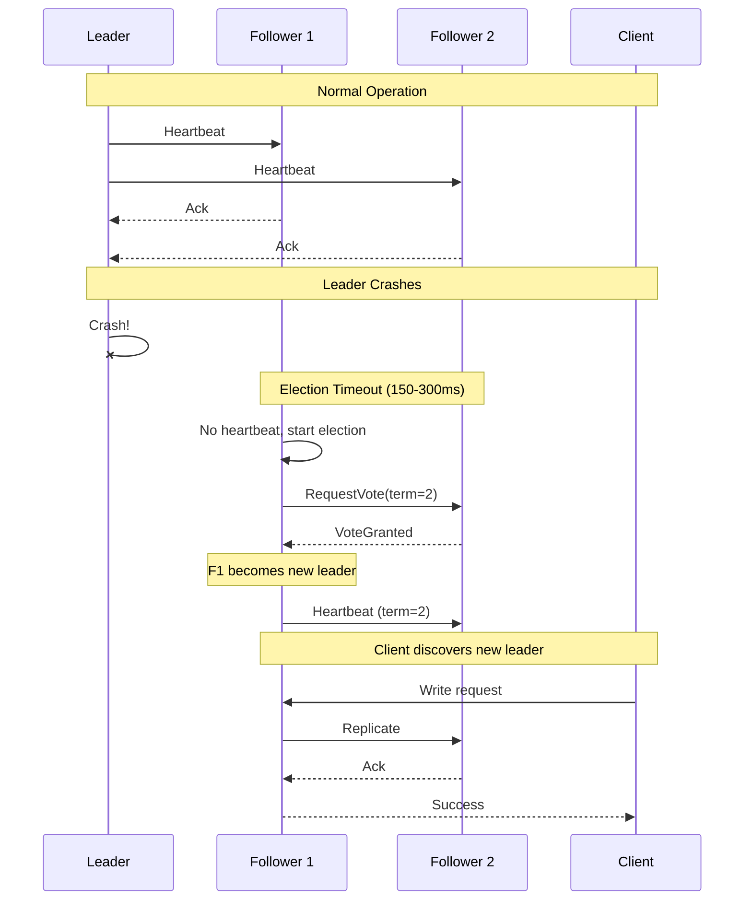

# Scalability & Reliability

[← Back to Index](./00-index.md)

---

## Scalability

### Horizontal Read Scaling

```
┌─────────────────────────────────────────────────────────────────────┐
│  READ SCALING STRATEGIES                                             │
├─────────────────────────────────────────────────────────────────────┤
│                                                                      │
│  Strategy 1: Follower Reads (Serializable)                          │
│  ┌─────────────────────────────────────────────────────────────┐   │
│  │                                                               │   │
│  │  Client ──read──► Follower ──return──► Client                │   │
│  │                                                               │   │
│  │  Properties:                                                  │   │
│  │  • May return slightly stale data                            │   │
│  │  • Scales with number of followers                           │   │
│  │  • Bounded staleness (follower replication lag)              │   │
│  │                                                               │   │
│  │  Use case: Configuration reads where ~100ms staleness OK     │   │
│  └─────────────────────────────────────────────────────────────┘   │
│                                                                      │
│  Strategy 2: Leader Reads (Linearizable)                            │
│  ┌─────────────────────────────────────────────────────────────┐   │
│  │                                                               │   │
│  │  Client ──read──► Leader ──confirm quorum──► Leader          │   │
│  │                         └──return──► Client                  │   │
│  │                                                               │   │
│  │  Properties:                                                  │   │
│  │  • Always returns latest committed value                     │   │
│  │  • Doesn't scale (all reads to leader)                       │   │
│  │  • Higher latency (quorum confirmation)                      │   │
│  │                                                               │   │
│  │  Use case: Coordination (locks, leader election)             │   │
│  └─────────────────────────────────────────────────────────────┘   │
│                                                                      │
│  Strategy 3: Client-Side Caching                                     │
│  ┌─────────────────────────────────────────────────────────────┐   │
│  │                                                               │   │
│  │  Client ──read──► Local Cache ──hit──► Return                │   │
│  │                          │                                    │   │
│  │                          └──miss──► Server ──► Cache ──► Ret │   │
│  │                                                               │   │
│  │  Properties:                                                  │   │
│  │  • Near-zero latency for cached data                         │   │
│  │  • Infinite read scaling (no server load)                    │   │
│  │  • Requires cache invalidation (via watches)                 │   │
│  │                                                               │   │
│  │  Use case: Most config reads (combined with watches)         │   │
│  └─────────────────────────────────────────────────────────────┘   │
│                                                                      │
└─────────────────────────────────────────────────────────────────────┘
```

### Cluster Size Recommendations

```
┌─────────────────────────────────────────────────────────────────────┐
│  CLUSTER SIZING GUIDELINES                                           │
├─────────────────────────────────────────────────────────────────────┤
│                                                                      │
│  Cluster Size  │ Fault Tolerance │ Write Latency │ Recommendation   │
│  ─────────────┼─────────────────┼───────────────┼─────────────────│
│  3 nodes       │ 1 node failure  │ Lowest        │ Development,     │
│                │                 │               │ small production │
│  ─────────────┼─────────────────┼───────────────┼─────────────────│
│  5 nodes       │ 2 node failures │ Medium        │ Most production  │
│                │                 │               │ deployments      │
│  ─────────────┼─────────────────┼───────────────┼─────────────────│
│  7 nodes       │ 3 node failures │ Higher        │ Critical systems │
│                │                 │               │ needing max HA   │
│                                                                      │
│  ─────────────────────────────────────────────────────────────────  │
│                                                                      │
│  Why Odd Numbers?                                                    │
│  ┌─────────────────────────────────────────────────────────────┐   │
│  │  Quorum = (N/2) + 1                                          │   │
│  │                                                               │   │
│  │  3 nodes: Quorum = 2, tolerate 1 failure                     │   │
│  │  4 nodes: Quorum = 3, tolerate 1 failure (same as 3!)       │   │
│  │  5 nodes: Quorum = 3, tolerate 2 failures                    │   │
│  │  6 nodes: Quorum = 4, tolerate 2 failures (same as 5!)      │   │
│  │                                                               │   │
│  │  Even numbers add cost without improving fault tolerance     │   │
│  └─────────────────────────────────────────────────────────────┘   │
│                                                                      │
│  ─────────────────────────────────────────────────────────────────  │
│                                                                      │
│  Scaling Beyond 7 Nodes:                                             │
│  ┌─────────────────────────────────────────────────────────────┐   │
│  │  Adding more nodes DECREASES write performance:              │   │
│  │  • More nodes = more replication traffic                     │   │
│  │  • Quorum harder to achieve                                  │   │
│  │                                                               │   │
│  │  Instead, use:                                                │   │
│  │  • Learner nodes (replicate but don't vote)                  │   │
│  │  • Regional clusters with federation                         │   │
│  │  • Keyspace sharding                                         │   │
│  └─────────────────────────────────────────────────────────────┘   │
│                                                                      │
└─────────────────────────────────────────────────────────────────────┘
```

### Sharding Strategies

```
┌─────────────────────────────────────────────────────────────────────┐
│  SHARDING APPROACHES                                                 │
├─────────────────────────────────────────────────────────────────────┤
│                                                                      │
│  Strategy 1: Namespace-Based Sharding                                │
│  ┌─────────────────────────────────────────────────────────────┐   │
│  │                                                               │   │
│  │  /team-a/*  → Cluster 1                                      │   │
│  │  /team-b/*  → Cluster 2                                      │   │
│  │  /team-c/*  → Cluster 3                                      │   │
│  │                                                               │   │
│  │  Pros: Simple routing, isolation between teams               │   │
│  │  Cons: Uneven load if team sizes differ                      │   │
│  │                                                               │   │
│  │  Implementation:                                              │   │
│  │  • Client SDK routes based on key prefix                     │   │
│  │  • Or proxy layer handles routing                            │   │
│  └─────────────────────────────────────────────────────────────┘   │
│                                                                      │
│  Strategy 2: Hash-Based Sharding                                     │
│  ┌─────────────────────────────────────────────────────────────┐   │
│  │                                                               │   │
│  │  shard = hash(key) % num_clusters                            │   │
│  │                                                               │   │
│  │  Pros: Even distribution                                      │   │
│  │  Cons: Prefix queries span all shards                        │   │
│  │        Resharding is complex                                  │   │
│  │                                                               │   │
│  │  Not recommended for config systems (breaks prefix watches)  │   │
│  └─────────────────────────────────────────────────────────────┘   │
│                                                                      │
│  Strategy 3: Service-Based Sharding (Kubernetes pattern)            │
│  ┌─────────────────────────────────────────────────────────────┐   │
│  │                                                               │   │
│  │  Each Kubernetes cluster has its own etcd                    │   │
│  │  • Cluster 1: etcd for K8s cluster 1                        │   │
│  │  • Cluster 2: etcd for K8s cluster 2                        │   │
│  │                                                               │   │
│  │  Cross-cluster config via:                                   │   │
│  │  • Federation controller                                     │   │
│  │  • External config service (Consul)                          │   │
│  └─────────────────────────────────────────────────────────────┘   │
│                                                                      │
└─────────────────────────────────────────────────────────────────────┘
```

### Client-Side Caching Best Practices

```
┌─────────────────────────────────────────────────────────────────────┐
│  CLIENT-SIDE CACHING                                                 │
├─────────────────────────────────────────────────────────────────────┤
│                                                                      │
│  Cache Architecture:                                                 │
│  ┌─────────────────────────────────────────────────────────────┐   │
│  │                                                               │   │
│  │  Application                                                  │   │
│  │       │                                                       │   │
│  │       ▼                                                       │   │
│  │  ┌─────────────────────────────────────────┐                 │   │
│  │  │           Config Client SDK              │                 │   │
│  │  │  ┌─────────────┐  ┌─────────────────┐   │                 │   │
│  │  │  │ Local Cache │  │ Watch Multiplexer│   │                 │   │
│  │  │  │ (in-memory) │  │ (invalidation)   │   │                 │   │
│  │  │  └──────┬──────┘  └────────┬────────┘   │                 │   │
│  │  │         │                  │             │                 │   │
│  │  │         └──────────────────┘             │                 │   │
│  │  └─────────────────┬───────────────────────┘                 │   │
│  │                    │                                          │   │
│  │                    ▼                                          │   │
│  │            Config Server Cluster                              │   │
│  └─────────────────────────────────────────────────────────────┘   │
│                                                                      │
│  ─────────────────────────────────────────────────────────────────  │
│                                                                      │
│  Cache Invalidation Strategies:                                      │
│                                                                      │
│  1. TTL-based (simple):                                              │
│     cache.set(key, value, ttl=60s)                                  │
│     # Re-fetch on TTL expiry                                        │
│                                                                      │
│  2. Watch-based (real-time):                                         │
│     watch(/config/app/*)                                            │
│     on_event: cache.invalidate(event.key)                           │
│                                                                      │
│  3. Hybrid (recommended):                                            │
│     cache.set(key, value, ttl=300s)  # Long TTL as backup           │
│     watch(/config/app/*)             # Real-time invalidation       │
│     on_event: cache.invalidate(event.key)                           │
│                                                                      │
│  ─────────────────────────────────────────────────────────────────  │
│                                                                      │
│  Cache Warming on Startup:                                           │
│  ┌─────────────────────────────────────────────────────────────┐   │
│  │  1. Read all needed config keys at startup                   │   │
│  │  2. Populate cache before accepting traffic                  │   │
│  │  3. Establish watches for future changes                     │   │
│  │  4. Mark service as ready                                    │   │
│  │                                                               │   │
│  │  Benefits: First request doesn't hit config server           │   │
│  └─────────────────────────────────────────────────────────────┘   │
│                                                                      │
└─────────────────────────────────────────────────────────────────────┘
```

---

## Reliability

### Quorum-Based Writes

```
┌─────────────────────────────────────────────────────────────────────┐
│  QUORUM GUARANTEES                                                   │
├─────────────────────────────────────────────────────────────────────┤
│                                                                      │
│  Write is committed when majority acknowledges:                      │
│  ┌─────────────────────────────────────────────────────────────┐   │
│  │                                                               │   │
│  │  5-node cluster: Write succeeds if 3+ nodes ack              │   │
│  │                                                               │   │
│  │  Scenario 1: All healthy                                      │   │
│  │  [L✓] [F1✓] [F2✓] [F3✓] [F4✓] → 5/5 ack, committed          │   │
│  │                                                               │   │
│  │  Scenario 2: One node slow                                   │   │
│  │  [L✓] [F1✓] [F2✓] [F3?] [F4✓] → 4/5 ack, committed          │   │
│  │                                                               │   │
│  │  Scenario 3: Two nodes down                                   │   │
│  │  [L✓] [F1✓] [F2✗] [F3✗] [F4✓] → 3/5 ack, committed          │   │
│  │                                                               │   │
│  │  Scenario 4: Three nodes down (FAILURE)                      │   │
│  │  [L✓] [F1✓] [F2✗] [F3✗] [F4✗] → 2/5 ack, REJECTED           │   │
│  │                                                               │   │
│  └─────────────────────────────────────────────────────────────┘   │
│                                                                      │
│  ─────────────────────────────────────────────────────────────────  │
│                                                                      │
│  Read Quorum Options:                                                │
│  ┌─────────────────────────────────────────────────────────────┐   │
│  │                                                               │   │
│  │  Serializable read (default):                                │   │
│  │  • Read from any node                                        │   │
│  │  • May return stale data                                     │   │
│  │  • Fast, scalable                                            │   │
│  │                                                               │   │
│  │  Linearizable read:                                          │   │
│  │  • Leader confirms it's still leader (via ReadIndex)         │   │
│  │  • Guaranteed fresh                                          │   │
│  │  • Higher latency                                            │   │
│  │                                                               │   │
│  └─────────────────────────────────────────────────────────────┘   │
│                                                                      │
└─────────────────────────────────────────────────────────────────────┘
```

### Automatic Leader Failover



```
┌─────────────────────────────────────────────────────────────────────┐
│  FAILOVER TIMELINE                                                   │
├─────────────────────────────────────────────────────────────────────┤
│                                                                      │
│  T=0ms:     Leader crashes                                          │
│  T=150ms:   First follower's election timeout expires               │
│  T=155ms:   Follower becomes candidate, increments term             │
│  T=160ms:   Sends RequestVote to all peers                          │
│  T=165ms:   Receives majority votes                                 │
│  T=170ms:   Becomes leader, sends heartbeats                        │
│  T=200ms:   Clients discover new leader                             │
│                                                                      │
│  Total failover time: ~200ms (best case)                            │
│  Worst case (split vote): 2-3 election cycles (~500-1000ms)        │
│                                                                      │
│  ─────────────────────────────────────────────────────────────────  │
│                                                                      │
│  Client Handling During Failover:                                    │
│  ┌─────────────────────────────────────────────────────────────┐   │
│  │  1. Request to old leader times out                          │   │
│  │  2. Client retries to another node                           │   │
│  │  3. Node returns "not leader" error with leader hint         │   │
│  │  4. Client retries to new leader                             │   │
│  │  5. Request succeeds                                          │   │
│  │                                                               │   │
│  │  Client SDK should:                                           │   │
│  │  • Maintain list of all cluster members                      │   │
│  │  • Automatically retry on leader change                       │   │
│  │  • Use exponential backoff                                    │   │
│  └─────────────────────────────────────────────────────────────┘   │
│                                                                      │
└─────────────────────────────────────────────────────────────────────┘
```

### Data Durability (WAL + Snapshots)

```
┌─────────────────────────────────────────────────────────────────────┐
│  DURABILITY GUARANTEES                                               │
├─────────────────────────────────────────────────────────────────────┤
│                                                                      │
│  Write-Ahead Log (WAL):                                              │
│  ┌─────────────────────────────────────────────────────────────┐   │
│  │                                                               │   │
│  │  Every write is:                                              │   │
│  │  1. Appended to WAL                                          │   │
│  │  2. fsync'd to disk                                          │   │
│  │  3. Then applied to state machine                            │   │
│  │                                                               │   │
│  │  On crash recovery:                                           │   │
│  │  1. Read WAL from disk                                       │   │
│  │  2. Replay all entries                                       │   │
│  │  3. State machine restored to pre-crash state                │   │
│  │                                                               │   │
│  │  WAL entry format:                                            │   │
│  │  [Term][Index][Type][Key][Value][CRC]                        │   │
│  │                                                               │   │
│  └─────────────────────────────────────────────────────────────┘   │
│                                                                      │
│  Snapshot (Periodic):                                                │
│  ┌─────────────────────────────────────────────────────────────┐   │
│  │                                                               │   │
│  │  Purpose: Prevent unbounded WAL growth                       │   │
│  │                                                               │   │
│  │  Process:                                                     │   │
│  │  1. Serialize current state machine to file                  │   │
│  │  2. Record snapshot index (last applied entry)               │   │
│  │  3. Truncate WAL entries before snapshot index               │   │
│  │                                                               │   │
│  │  Recovery:                                                    │   │
│  │  1. Load latest snapshot                                     │   │
│  │  2. Replay WAL entries after snapshot index                  │   │
│  │                                                               │   │
│  │  Trigger: Every N entries or M bytes                         │   │
│  │  etcd default: 10,000 entries                                │   │
│  │                                                               │   │
│  └─────────────────────────────────────────────────────────────┘   │
│                                                                      │
└─────────────────────────────────────────────────────────────────────┘
```

### Network Partition Handling

```
┌─────────────────────────────────────────────────────────────────────┐
│  PARTITION SCENARIOS                                                 │
├─────────────────────────────────────────────────────────────────────┤
│                                                                      │
│  Scenario 1: Leader in Majority Partition                           │
│  ┌─────────────────────────────────────────────────────────────┐   │
│  │                                                               │   │
│  │  Majority (3 nodes)  │  Minority (2 nodes)                   │   │
│  │  [L] [F1] [F2]       │  [F3] [F4]                            │   │
│  │                      │                                        │   │
│  │  Result:                                                      │   │
│  │  • Majority continues operating normally                     │   │
│  │  • Minority cannot elect new leader                          │   │
│  │  • Minority rejects writes (no quorum)                       │   │
│  │  • Minority serves stale reads (if enabled)                  │   │
│  │                                                               │   │
│  └─────────────────────────────────────────────────────────────┘   │
│                                                                      │
│  Scenario 2: Leader in Minority Partition                           │
│  ┌─────────────────────────────────────────────────────────────┐   │
│  │                                                               │   │
│  │  Minority (2 nodes)  │  Majority (3 nodes)                   │   │
│  │  [L] [F1]            │  [F2] [F3] [F4]                       │   │
│  │                      │                                        │   │
│  │  Result:                                                      │   │
│  │  • Old leader cannot commit (no quorum)                      │   │
│  │  • Old leader steps down (leader lease expires)              │   │
│  │  • Majority elects new leader                                │   │
│  │  • System continues in majority partition                    │   │
│  │                                                               │   │
│  └─────────────────────────────────────────────────────────────┘   │
│                                                                      │
│  Scenario 3: Three-Way Split (5-node cluster)                       │
│  ┌─────────────────────────────────────────────────────────────┐   │
│  │                                                               │   │
│  │  [L] [F1]   │   [F2] [F3]   │   [F4]                         │   │
│  │  2 nodes    │   2 nodes     │   1 node                       │   │
│  │                                                               │   │
│  │  Result:                                                      │   │
│  │  • No partition has majority                                 │   │
│  │  • Cluster UNAVAILABLE for writes                            │   │
│  │  • All partitions may serve stale reads                      │   │
│  │                                                               │   │
│  └─────────────────────────────────────────────────────────────┘   │
│                                                                      │
└─────────────────────────────────────────────────────────────────────┘
```

---

## Disaster Recovery

### Multi-Datacenter Deployment

```
┌─────────────────────────────────────────────────────────────────────┐
│  MULTI-DC DEPLOYMENT PATTERNS                                        │
├─────────────────────────────────────────────────────────────────────┤
│                                                                      │
│  Pattern 1: Stretched Cluster (Strong Consistency)                   │
│  ┌─────────────────────────────────────────────────────────────┐   │
│  │                                                               │   │
│  │  DC1 (Primary)    DC2 (Secondary)   DC3 (Witness)            │   │
│  │  [L] [F1]         [F2] [F3]         [F4]                     │   │
│  │                                                               │   │
│  │  Quorum: 3 nodes across DCs                                  │   │
│  │                                                               │   │
│  │  Pros: Strong consistency, automatic failover                │   │
│  │  Cons: High write latency (WAN RTT), expensive               │   │
│  │                                                               │   │
│  │  WAN latency impact:                                          │   │
│  │  • Intra-DC: 1ms                                             │   │
│  │  • Cross-DC: 20-100ms                                        │   │
│  │  • Write latency: ~50-100ms (must wait for cross-DC ack)    │   │
│  │                                                               │   │
│  └─────────────────────────────────────────────────────────────┘   │
│                                                                      │
│  Pattern 2: Regional Clusters + Async Replication                   │
│  ┌─────────────────────────────────────────────────────────────┐   │
│  │                                                               │   │
│  │  DC1                          DC2                             │   │
│  │  ┌──────────────┐            ┌──────────────┐                │   │
│  │  │ [L][F1][F2]  │───async───►│ [L][F1][F2]  │                │   │
│  │  │ Primary      │            │ Secondary    │                │   │
│  │  └──────────────┘            └──────────────┘                │   │
│  │                                                               │   │
│  │  Pros: Low latency writes (intra-DC quorum)                  │   │
│  │  Cons: Eventual consistency, conflict resolution needed      │   │
│  │                                                               │   │
│  │  Replication options:                                         │   │
│  │  • etcd: Mirror maker, custom sync                           │   │
│  │  • Consul: WAN federation (built-in)                         │   │
│  │                                                               │   │
│  └─────────────────────────────────────────────────────────────┘   │
│                                                                      │
│  Pattern 3: Active-Passive with Manual Failover                     │
│  ┌─────────────────────────────────────────────────────────────┐   │
│  │                                                               │   │
│  │  DC1 (Active)                 DC2 (Standby)                  │   │
│  │  ┌──────────────┐            ┌──────────────┐                │   │
│  │  │ [L][F1][F2]  │───backup──►│ [L][F1][F2]  │                │   │
│  │  │ Serving      │            │ Cold standby │                │   │
│  │  └──────────────┘            └──────────────┘                │   │
│  │                                                               │   │
│  │  Pros: Simplest, no cross-DC latency                        │   │
│  │  Cons: Manual failover, data loss risk                       │   │
│  │                                                               │   │
│  │  Failover steps:                                              │   │
│  │  1. Detect DC1 failure                                       │   │
│  │  2. Restore latest backup to DC2                             │   │
│  │  3. Update DNS/routing to DC2                                │   │
│  │  4. Clients reconnect                                        │   │
│  │                                                               │   │
│  └─────────────────────────────────────────────────────────────┘   │
│                                                                      │
└─────────────────────────────────────────────────────────────────────┘
```

### Backup and Restore Procedures

```
┌─────────────────────────────────────────────────────────────────────┐
│  BACKUP STRATEGIES                                                   │
├─────────────────────────────────────────────────────────────────────┤
│                                                                      │
│  Snapshot-Based Backup:                                              │
│  ┌─────────────────────────────────────────────────────────────┐   │
│  │                                                               │   │
│  │  # etcd example                                               │   │
│  │  etcdctl snapshot save /backup/etcd-$(date +%Y%m%d).db       │   │
│  │                                                               │   │
│  │  Includes:                                                    │   │
│  │  • All key-value data                                        │   │
│  │  • Cluster membership                                         │   │
│  │  • Revision/version metadata                                  │   │
│  │                                                               │   │
│  │  Frequency: Every 1-6 hours                                  │   │
│  │  Retention: 7-30 days                                        │   │
│  │                                                               │   │
│  └─────────────────────────────────────────────────────────────┘   │
│                                                                      │
│  Continuous WAL Backup:                                              │
│  ┌─────────────────────────────────────────────────────────────┐   │
│  │                                                               │   │
│  │  Stream WAL to external storage:                             │   │
│  │  • Copy WAL segments as they're sealed                       │   │
│  │  • Store in object storage (S3, GCS)                         │   │
│  │  • Enables point-in-time recovery                            │   │
│  │                                                               │   │
│  │  Recovery:                                                    │   │
│  │  1. Restore base snapshot                                    │   │
│  │  2. Replay WAL to desired point                              │   │
│  │                                                               │   │
│  └─────────────────────────────────────────────────────────────┘   │
│                                                                      │
│  Restore Procedure:                                                  │
│  ┌─────────────────────────────────────────────────────────────┐   │
│  │                                                               │   │
│  │  # etcd restore example                                       │   │
│  │  etcdctl snapshot restore /backup/etcd-20250120.db \         │   │
│  │    --name node1 \                                             │   │
│  │    --initial-cluster node1=http://... \                      │   │
│  │    --data-dir /var/lib/etcd                                  │   │
│  │                                                               │   │
│  │  Steps:                                                       │   │
│  │  1. Stop all etcd nodes                                      │   │
│  │  2. Restore snapshot on each node                            │   │
│  │  3. Update cluster membership if needed                      │   │
│  │  4. Start etcd nodes                                         │   │
│  │  5. Verify data integrity                                    │   │
│  │                                                               │   │
│  └─────────────────────────────────────────────────────────────┘   │
│                                                                      │
└─────────────────────────────────────────────────────────────────────┘
```

### RTO/RPO Targets

```
┌─────────────────────────────────────────────────────────────────────┐
│  RECOVERY OBJECTIVES                                                 │
├─────────────────────────────────────────────────────────────────────┤
│                                                                      │
│  Deployment Type      │ RPO           │ RTO            │ Cost       │
│  ─────────────────────┼───────────────┼────────────────┼───────────│
│  Single DC, 3 nodes   │ 0 (committed) │ < 1 min        │ $          │
│  Single DC, 5 nodes   │ 0 (committed) │ < 30 sec       │ $$         │
│  Stretched cluster    │ 0 (committed) │ < 30 sec       │ $$$$       │
│  Regional + async     │ < 1 min       │ < 5 min        │ $$$        │
│  Active-passive       │ < 1 hour      │ < 30 min       │ $$         │
│                                                                      │
│  ─────────────────────────────────────────────────────────────────  │
│                                                                      │
│  RPO (Recovery Point Objective): How much data can we lose?         │
│  ┌─────────────────────────────────────────────────────────────┐   │
│  │  Synchronous replication: RPO = 0                            │   │
│  │  Async replication (1 min lag): RPO = 1 minute              │   │
│  │  Hourly backups: RPO = 1 hour                                │   │
│  └─────────────────────────────────────────────────────────────┘   │
│                                                                      │
│  RTO (Recovery Time Objective): How long to restore service?        │
│  ┌─────────────────────────────────────────────────────────────┐   │
│  │  Automatic failover: RTO = election time (~30 sec)          │   │
│  │  Manual failover: RTO = detection + operator action          │   │
│  │  Restore from backup: RTO = download + restore + verify      │   │
│  └─────────────────────────────────────────────────────────────┘   │
│                                                                      │
└─────────────────────────────────────────────────────────────────────┘
```

---

## Reliability Patterns Summary

| Pattern | Benefit | Implementation |
|---------|---------|----------------|
| Quorum writes | Survive minority failures | Raft/ZAB consensus |
| Leader election | Automatic failover | Election timeout + voting |
| WAL + fsync | Zero data loss on crash | Append-only log, sync before ack |
| Snapshots | Bounded recovery time | Periodic state serialization |
| Client retries | Handle transient failures | Exponential backoff |
| Client caching | Survive brief outages | TTL cache + watch invalidation |
| Multi-DC | Survive datacenter failure | Stretched or federated clusters |
| Backups | Disaster recovery | Snapshot to object storage |
