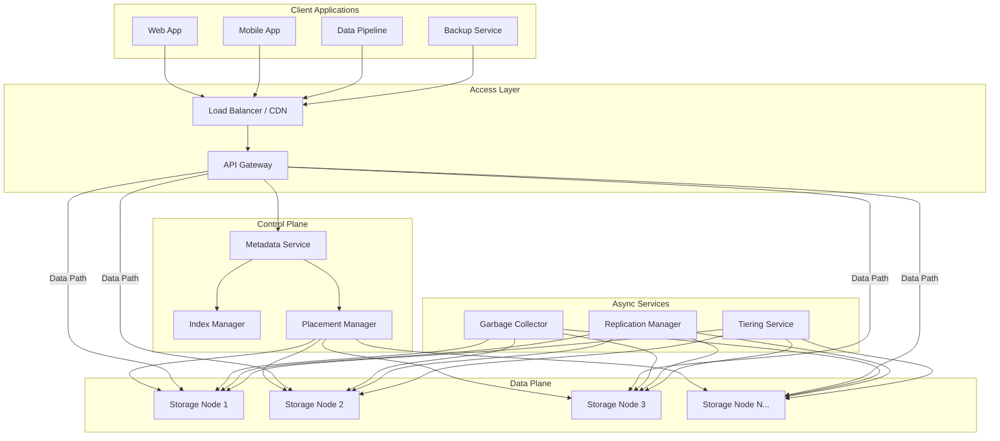
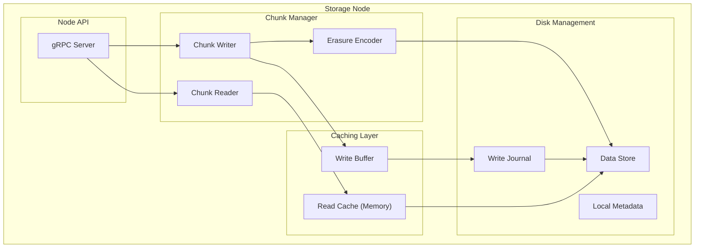
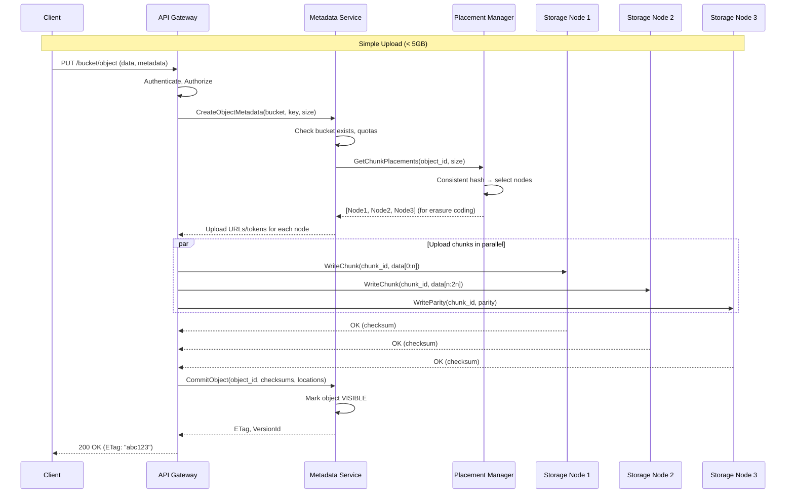
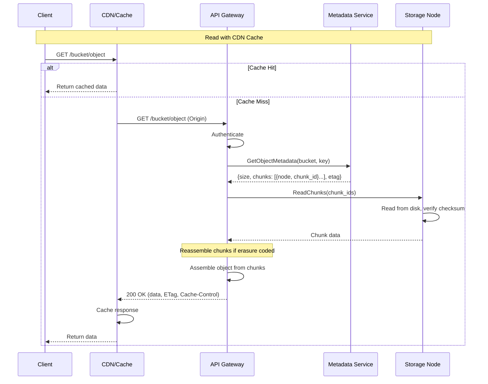
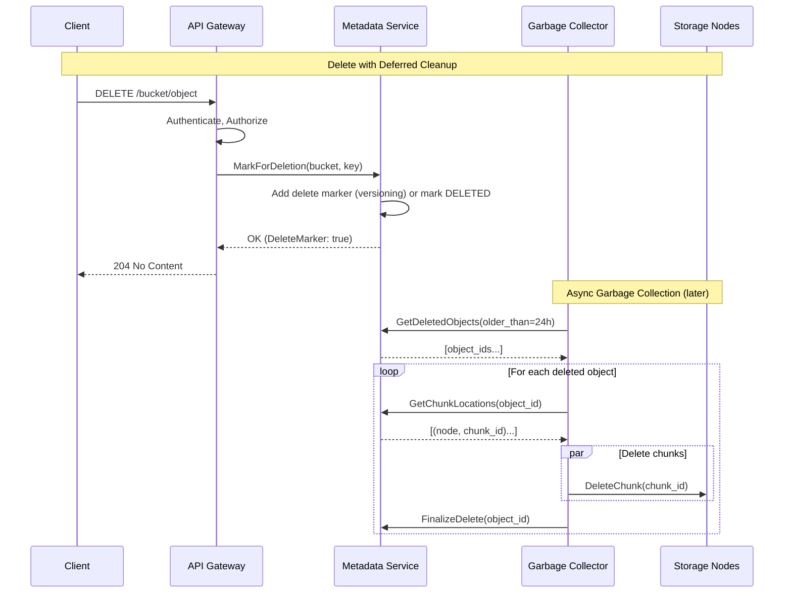
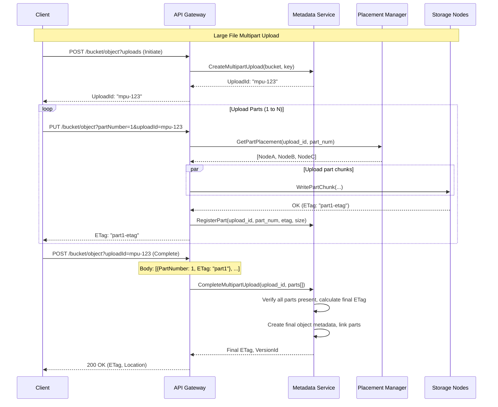
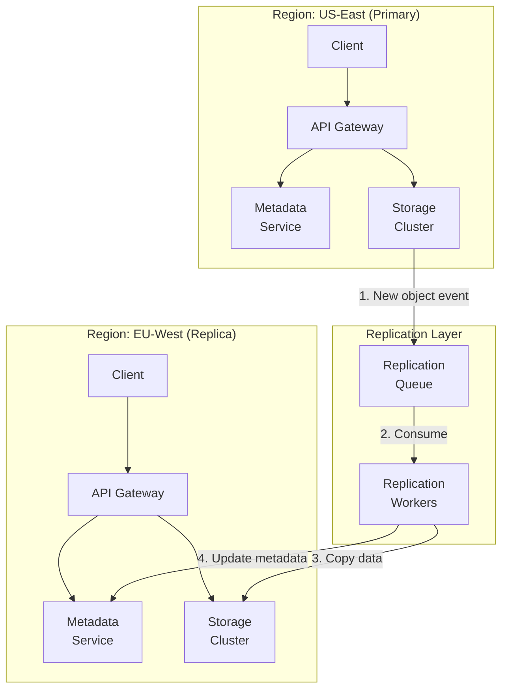
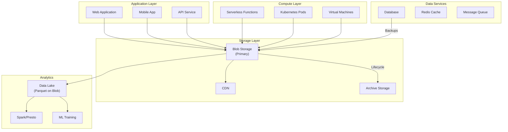

# High-Level Design

[← Back to Index](./00-index.md)

---

## System Architecture Overview

### Core Components



### Component Responsibilities

| Component | Responsibility | Key Operations |
|-----------|---------------|----------------|
| **API Gateway** | Request routing, authentication, rate limiting | Authenticate, Route, Throttle |
| **Metadata Service** | Object/bucket metadata, consistency, indexing | CreateObject, GetMetadata, ListObjects |
| **Placement Manager** | Decide which storage nodes hold data | AssignChunks, Rebalance, LocateData |
| **Storage Nodes** | Store and retrieve actual data chunks | WriteChunk, ReadChunk, DeleteChunk |
| **Index Manager** | Maintain searchable indexes for listing | IndexObject, ListByPrefix, DeleteIndex |
| **Replication Manager** | Cross-region replication, repair | Replicate, RepairChunk, SyncRegion |
| **Garbage Collector** | Clean up deleted/orphaned data | MarkForDeletion, Compact, Reclaim |
| **Tiering Service** | Move data between storage classes | TransitionCold, RestoreHot, LifecycleEnforce |

---

## Detailed Architecture

### Two-Tier Architecture (Metadata + Data Separation)

```
┌─────────────────────────────────────────────────────────────────────┐
│                      BLOB STORAGE SYSTEM                             │
├─────────────────────────────────────────────────────────────────────┤
│                                                                      │
│  ┌─────────────────────────────────────────────────────────────┐   │
│  │                      API GATEWAY LAYER                       │   │
│  │  ┌────────────┐  ┌────────────┐  ┌────────────┐             │   │
│  │  │   REST     │  │    S3      │  │  Internal  │             │   │
│  │  │   API      │  │  Compat    │  │    gRPC    │             │   │
│  │  └─────┬──────┘  └─────┬──────┘  └─────┬──────┘             │   │
│  │        └───────────────┴───────────────┘                     │   │
│  │                        │                                      │   │
│  │  ┌────────────────────┴────────────────────────────────────┐ │   │
│  │  │  Auth / ACL / Rate Limit / Request Validation           │ │   │
│  │  └────────────────────┬────────────────────────────────────┘ │   │
│  └───────────────────────┼──────────────────────────────────────┘   │
│                          │                                          │
│  ┌───────────────────────┴──────────────────────────────────────┐   │
│  │                    CONTROL PLANE (Metadata)                    │   │
│  │                                                                │   │
│  │  ┌────────────────┐  ┌────────────────┐  ┌────────────────┐  │   │
│  │  │   Metadata     │  │   Placement    │  │    Index       │  │   │
│  │  │   Service      │  │   Manager      │  │   Manager      │  │   │
│  │  │                │  │                │  │                │  │   │
│  │  │  • Bucket info │  │  • Consistent  │  │  • Prefix      │  │   │
│  │  │  • Object meta │  │    hashing     │  │    index       │  │   │
│  │  │  • Versioning  │  │  • Node health │  │  • List cache  │  │   │
│  │  │  • ACLs        │  │  • Rebalancing │  │  • Pagination  │  │   │
│  │  └───────┬────────┘  └───────┬────────┘  └───────┬────────┘  │   │
│  │          │                   │                   │            │   │
│  │  ┌───────┴───────────────────┴───────────────────┴──────────┐ │   │
│  │  │              Metadata Storage (Distributed DB)            │ │   │
│  │  │         (MySQL Cluster / CockroachDB / TiKV)             │ │   │
│  │  └──────────────────────────────────────────────────────────┘ │   │
│  └───────────────────────────────────────────────────────────────┘   │
│                          │                                          │
│  ┌───────────────────────┴──────────────────────────────────────┐   │
│  │                    DATA PLANE (Storage)                        │   │
│  │                                                                │   │
│  │  ┌──────────┐  ┌──────────┐  ┌──────────┐  ┌──────────┐      │   │
│  │  │ Storage  │  │ Storage  │  │ Storage  │  │ Storage  │      │   │
│  │  │ Node 1   │  │ Node 2   │  │ Node 3   │  │ Node N   │      │   │
│  │  │          │  │          │  │          │  │          │      │   │
│  │  │ ┌──────┐ │  │ ┌──────┐ │  │ ┌──────┐ │  │ ┌──────┐ │      │   │
│  │  │ │Chunk │ │  │ │Chunk │ │  │ │Chunk │ │  │ │Chunk │ │      │   │
│  │  │ │Store │ │  │ │Store │ │  │ │Store │ │  │ │Store │ │      │   │
│  │  │ └──────┘ │  │ └──────┘ │  │ └──────┘ │  │ └──────┘ │      │   │
│  │  │ ┌──────┐ │  │ ┌──────┐ │  │ ┌──────┐ │  │ ┌──────┐ │      │   │
│  │  │ │ HDD  │ │  │ │ HDD  │ │  │ │ HDD  │ │  │ │ HDD  │ │      │   │
│  │  │ │ Pool │ │  │ │ Pool │ │  │ │ Pool │ │  │ │ Pool │ │      │   │
│  │  │ └──────┘ │  │ └──────┘ │  │ └──────┘ │  │ └──────┘ │      │   │
│  │  └──────────┘  └──────────┘  └──────────┘  └──────────┘      │   │
│  └───────────────────────────────────────────────────────────────┘   │
│                                                                      │
└─────────────────────────────────────────────────────────────────────┘
```

### Storage Node Architecture



---

## Data Flow

### Write Path (Object Upload)



### Read Path (Object Download)



### Delete Path



### Multipart Upload Flow



---

## Key Architectural Decisions

### Decision 1: Metadata and Data Separation

| Aspect | Combined | Separated (Recommended) |
|--------|----------|------------------------|
| **Scaling** | Hard to scale independently | Scale metadata/data separately |
| **Consistency** | Single point of truth | Metadata can be strongly consistent, data eventually |
| **Performance** | Metadata queries hit same nodes | Optimized for each workload |
| **Technology** | One storage system | Specialized: DB for metadata, log-structured for data |

**Recommendation:** Separate metadata service (scalable distributed database) from data plane (append-only storage nodes).

### Decision 2: Durability Strategy

| Aspect | 3x Replication | Erasure Coding RS(10,4) |
|--------|----------------|-------------------------|
| **Storage Overhead** | 200% (3 copies) | 40% (14 chunks for 10 data) |
| **Write Latency** | Lower (parallel writes) | Higher (encoding overhead) |
| **Read Latency** | Lower (any copy) | Higher (may need decode) |
| **Repair Cost** | Copy full object | Reconstruct from any 10 chunks |
| **Best For** | Hot data, small files | Cold data, large files |

**Recommendation:** Hybrid approach - replication for hot/small objects, erasure coding for cold/large objects.

### Decision 3: Consistency Model

| Aspect | Eventual | Strong (S3 since 2020) |
|--------|----------|------------------------|
| **Read After Write** | May read stale | Always see latest |
| **List After Write** | Object may not appear | Object appears immediately |
| **Complexity** | Simpler | Requires coordination |
| **Latency** | Lower | Slightly higher |

**Recommendation:** Strong consistency (modern expectation). Achieve via CRDT-based metadata or distributed transaction.

### Decision 4: Chunk Size

| Size | Pros | Cons | Use Case |
|------|------|------|----------|
| **4 MB** | Fine-grained parallelism, good for small files | More metadata overhead, more chunks | Mixed workloads |
| **64 MB** | Less metadata, efficient large files | Wasted space for small files | Data lake, backups |
| **Variable (CDC)** | Deduplication benefit | Complex, more CPU | Backup with dedup |

**Recommendation:** 64 MB default for simplicity. Smaller chunks for multipart upload parts.

---

## High-Level Data Flow Diagram

```
┌─────────────────────────────────────────────────────────────────────┐
│                         BLOB STORAGE SYSTEM                          │
├─────────────────────────────────────────────────────────────────────┤
│                                                                      │
│   CLIENT LAYER                                                       │
│   ┌─────────────────────────────────────────────────────────────┐   │
│   │  SDK/CLI        Browser        Data Pipeline      Backup     │   │
│   │     │              │               │                │        │   │
│   │     └──────────────┴───────────────┴────────────────┘        │   │
│   │                           │                                   │   │
│   │                    HTTPS / S3 API                             │   │
│   └───────────────────────────┼───────────────────────────────────┘   │
│                               │                                       │
│   EDGE LAYER                  │                                       │
│   ┌───────────────────────────┼───────────────────────────────────┐   │
│   │                    ┌──────┴──────┐                            │   │
│   │                    │    CDN      │◄── Cache Hot Objects       │   │
│   │                    └──────┬──────┘                            │   │
│   │                           │                                    │   │
│   │                    ┌──────┴──────┐                            │   │
│   │                    │ API Gateway │◄── Auth, Rate Limit        │   │
│   │                    └──────┬──────┘                            │   │
│   └───────────────────────────┼───────────────────────────────────┘   │
│                               │                                       │
│   CONTROL PLANE               │                                       │
│   ┌───────────────────────────┼───────────────────────────────────┐   │
│   │            ┌──────────────┴──────────────┐                    │   │
│   │            │      METADATA SERVICE       │                    │   │
│   │            │  ┌────────────────────────┐ │                    │   │
│   │            │  │ Bucket/Object Metadata │ │                    │   │
│   │            │  │ Versioning & Lifecycle │ │                    │   │
│   │            │  │ ACL & Policies         │ │                    │   │
│   │            │  └────────────────────────┘ │                    │   │
│   │            └──────────────┬──────────────┘                    │   │
│   │                           │                                    │   │
│   │       ┌───────────────────┼───────────────────┐               │   │
│   │       │                   │                   │               │   │
│   │       ▼                   ▼                   ▼               │   │
│   │  ┌─────────┐       ┌─────────┐        ┌─────────┐            │   │
│   │  │Placement│       │  Index  │        │ Quota   │            │   │
│   │  │ Manager │       │ Service │        │ Manager │            │   │
│   │  └─────────┘       └─────────┘        └─────────┘            │   │
│   └───────────────────────────┼───────────────────────────────────┘   │
│                               │                                       │
│   DATA PLANE                  │                                       │
│   ┌───────────────────────────┼───────────────────────────────────┐   │
│   │                           │                                    │   │
│   │     ┌─────────────────────┴─────────────────────┐             │   │
│   │     │              STORAGE CLUSTER               │             │   │
│   │     │                                           │             │   │
│   │  ┌──┴──┐  ┌─────┐  ┌─────┐  ┌─────┐  ┌─────┐  │             │   │
│   │  │ SN1 │  │ SN2 │  │ SN3 │  │ SN4 │  │ SNn │  │             │   │
│   │  │     │  │     │  │     │  │     │  │     │  │             │   │
│   │  │█████│  │█████│  │█████│  │█████│  │█████│  │             │   │
│   │  │█████│  │█████│  │█████│  │█████│  │█████│  │             │   │
│   │  │█████│  │█████│  │█████│  │█████│  │█████│  │             │   │
│   │  └─────┘  └─────┘  └─────┘  └─────┘  └─────┘  │             │   │
│   │     │         │         │         │         │  │             │   │
│   │     └─────────┴─────────┴─────────┴─────────┘  │             │   │
│   │              Data Chunks + Parity              │             │   │
│   │                                                │             │   │
│   │     └──────────────────────────────────────────┘             │   │
│   │                                                               │   │
│   └───────────────────────────────────────────────────────────────┘   │
│                               │                                       │
│   ASYNC SERVICES              │                                       │
│   ┌───────────────────────────┼───────────────────────────────────┐   │
│   │     ┌─────────┐    ┌─────────┐    ┌─────────┐    ┌─────────┐│   │
│   │     │ Garbage │    │  Data   │    │ Repair  │    │Lifecycle││   │
│   │     │Collector│    │Replicatr│    │ Service │    │ Manager ││   │
│   │     └─────────┘    └─────────┘    └─────────┘    └─────────┘│   │
│   └───────────────────────────────────────────────────────────────┘   │
│                                                                       │
└─────────────────────────────────────────────────────────────────────┘
```

---

## Multi-Region Architecture

### Cross-Region Replication



### Multi-Region Consistency Options

```
┌─────────────────────────────────────────────────────────────────────┐
│  MULTI-REGION STRATEGIES                                             │
├─────────────────────────────────────────────────────────────────────┤
│                                                                      │
│  OPTION 1: Async Cross-Region Replication (S3 CRR)                  │
│  ┌───────────────────────────────────────────────────────────────┐ │
│  │                                                                 │ │
│  │   US-East (Primary)              EU-West (Replica)            │ │
│  │   ┌──────────────┐               ┌──────────────┐             │ │
│  │   │   Bucket A   │──── async ───►│  Bucket A'   │             │ │
│  │   └──────────────┘   (~seconds)  └──────────────┘             │ │
│  │                                                                 │ │
│  │   Pros: Low latency writes, no cross-region coordination       │ │
│  │   Cons: RPO > 0 (may lose recent writes), read-after-write    │ │
│  │         not guaranteed cross-region                            │ │
│  │   Use: Disaster recovery, global read acceleration            │ │
│  │                                                                 │ │
│  └───────────────────────────────────────────────────────────────┘ │
│                                                                      │
│  OPTION 2: Multi-Master with Conflict Resolution                    │
│  ┌───────────────────────────────────────────────────────────────┐ │
│  │                                                                 │ │
│  │   US-East                         EU-West                      │ │
│  │   ┌──────────────┐               ┌──────────────┐             │ │
│  │   │   Bucket A   │◄──── sync ───►│   Bucket A   │             │ │
│  │   └──────────────┘    (CRDTs)    └──────────────┘             │ │
│  │                                                                 │ │
│  │   Pros: Write anywhere, automatic conflict resolution          │ │
│  │   Cons: Complex, last-writer-wins semantics                    │ │
│  │   Use: Active-active global deployment                         │ │
│  │                                                                 │ │
│  └───────────────────────────────────────────────────────────────┘ │
│                                                                      │
│  OPTION 3: Primary with Read Replicas                               │
│  ┌───────────────────────────────────────────────────────────────┐ │
│  │                                                                 │ │
│  │   US-East (Primary)   EU-West (Read)   Asia (Read)            │ │
│  │   ┌──────────────┐    ┌──────────────┐ ┌──────────────┐       │ │
│  │   │  Read/Write  │───►│  Read Only   │ │  Read Only   │       │ │
│  │   └──────────────┘    └──────────────┘ └──────────────┘       │ │
│  │                                                                 │ │
│  │   Pros: Simple consistency model, strong in primary            │ │
│  │   Cons: Write latency from non-primary regions                 │ │
│  │   Use: Read-heavy global workloads                             │ │
│  │                                                                 │ │
│  └───────────────────────────────────────────────────────────────┘ │
│                                                                      │
└─────────────────────────────────────────────────────────────────────┘
```

---

## Storage Node Internal Design

```
┌─────────────────────────────────────────────────────────────────────┐
│                         STORAGE NODE                                 │
├─────────────────────────────────────────────────────────────────────┤
│                                                                      │
│  ┌─────────────────────────────────────────────────────────────┐   │
│  │                      Network Layer                            │   │
│  │  ┌──────────────┐  ┌──────────────┐  ┌──────────────┐       │   │
│  │  │ gRPC Server  │  │ HTTP Server  │  │  Metrics     │       │   │
│  │  │ (internal)   │  │ (data path)  │  │  Exporter    │       │   │
│  │  └──────┬───────┘  └──────┬───────┘  └──────────────┘       │   │
│  │         └─────────────────┘                                   │   │
│  └─────────────────────┬───────────────────────────────────────┘   │
│                        │                                            │
│  ┌─────────────────────┴───────────────────────────────────────┐   │
│  │                    Request Handler                            │   │
│  │  ┌────────────────────────────────────────────────────────┐  │   │
│  │  │  • Chunk ID parsing                                     │  │   │
│  │  │  • Checksum verification                                │  │   │
│  │  │  • Quota enforcement                                    │  │   │
│  │  │  • Request deduplication                                │  │   │
│  │  └────────────────────────────────────────────────────────┘  │   │
│  └─────────────────────┬───────────────────────────────────────┘   │
│                        │                                            │
│  ┌─────────────────────┴───────────────────────────────────────┐   │
│  │                   Chunk Manager                               │   │
│  │                                                               │   │
│  │  ┌────────────┐    ┌────────────┐    ┌────────────┐         │   │
│  │  │   Write    │    │   Read     │    │   Delete   │         │   │
│  │  │   Path     │    │   Path     │    │   Path     │         │   │
│  │  └─────┬──────┘    └─────┬──────┘    └─────┬──────┘         │   │
│  │        │                 │                 │                  │   │
│  │  ┌─────┴─────────────────┴─────────────────┴─────────────┐   │   │
│  │  │               Buffer / Cache Layer                      │   │   │
│  │  │  ┌──────────────┐    ┌──────────────┐                  │   │   │
│  │  │  │ Write Buffer │    │  Read Cache  │                  │   │   │
│  │  │  │ (Memory)     │    │  (Memory/SSD)│                  │   │   │
│  │  │  └──────────────┘    └──────────────┘                  │   │   │
│  │  └───────────────────────────────────────────────────────┘   │   │
│  └─────────────────────┬───────────────────────────────────────┘   │
│                        │                                            │
│  ┌─────────────────────┴───────────────────────────────────────┐   │
│  │                   Storage Engine                              │   │
│  │                                                               │   │
│  │  ┌────────────────────────────────────────────────────────┐  │   │
│  │  │                Log-Structured Store                      │  │   │
│  │  │                                                          │  │   │
│  │  │  ┌────────┐ ┌────────┐ ┌────────┐ ┌────────┐           │  │   │
│  │  │  │ Volume │ │ Volume │ │ Volume │ │ Volume │           │  │   │
│  │  │  │   1    │ │   2    │ │   3    │ │   N    │           │  │   │
│  │  │  │        │ │        │ │        │ │        │           │  │   │
│  │  │  │┌──────┐│ │┌──────┐│ │┌──────┐│ │┌──────┐│           │  │   │
│  │  │  ││Needle││ ││Needle││ ││Needle││ ││Needle││           │  │   │
│  │  │  ││ File ││ ││ File ││ ││ File ││ ││ File ││           │  │   │
│  │  │  │└──────┘│ │└──────┘│ │└──────┘│ │└──────┘│           │  │   │
│  │  │  │┌──────┐│ │┌──────┐│ │┌──────┐│ │┌──────┐│           │  │   │
│  │  │  ││Index ││ ││Index ││ ││Index ││ ││Index ││           │  │   │
│  │  │  │└──────┘│ │└──────┘│ │└──────┘│ │└──────┘│           │  │   │
│  │  │  └────────┘ └────────┘ └────────┘ └────────┘           │  │   │
│  │  └────────────────────────────────────────────────────────┘  │   │
│  └──────────────────────────────────────────────────────────────┘   │
│                        │                                            │
│  ┌─────────────────────┴───────────────────────────────────────┐   │
│  │                   Disk Layer                                  │   │
│  │  ┌─────────┐ ┌─────────┐ ┌─────────┐ ┌─────────┐            │   │
│  │  │  HDD 1  │ │  HDD 2  │ │  HDD 3  │ │  HDD N  │            │   │
│  │  │  10TB   │ │  10TB   │ │  10TB   │ │  10TB   │            │   │
│  │  └─────────┘ └─────────┘ └─────────┘ └─────────┘            │   │
│  └──────────────────────────────────────────────────────────────┘   │
│                                                                      │
└─────────────────────────────────────────────────────────────────────┘
```

---

## Integration Points

### Where Blob Storage Fits



### Common Integrations

| Integration | Purpose | Pattern |
|-------------|---------|---------|
| **CDN** | Edge caching for read acceleration | Blob as origin, signed URLs |
| **Kubernetes** | Container image registry, persistent volumes | S3-compatible CSI driver |
| **Database** | Backup storage, large object offload | Periodic snapshots, TOAST substitute |
| **Streaming** | Event source, sink for streams | Kafka Connect S3 Sink |
| **Data Lake** | Foundation for analytics | Parquet/ORC files, partitioning |
| **ML Pipeline** | Training data, model artifacts | Large file storage, versioning |
| **CI/CD** | Build artifacts, deployment packages | Upload on build, fetch on deploy |
| **Compliance** | Audit logs, long-term retention | WORM, lifecycle to archive |
