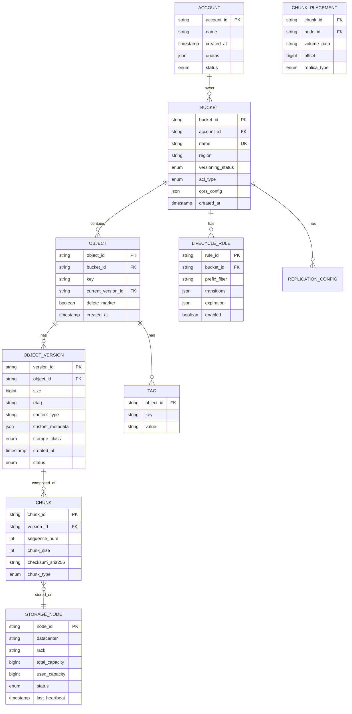

# Low-Level Design

[← Back to Index](./00-index.md)

---

## Data Model

### Entity Relationship Diagram



### Core Data Structures

#### Object Metadata Record

```
┌────────────────────────────────────────────────────────────────────┐
│ OBJECT METADATA RECORD                                              │
├────────────────────────────────────────────────────────────────────┤
│                                                                     │
│  Header (fixed 64 bytes):                                          │
│  ┌─────────────────────────────────────────────────────────────┐  │
│  │ version      │  4 bytes │ Schema version                     │  │
│  │ flags        │  4 bytes │ Versioning, encryption, compressed │  │
│  │ bucket_id    │  16 bytes│ UUID of bucket                     │  │
│  │ object_id    │  16 bytes│ UUID of object                     │  │
│  │ created_at   │  8 bytes │ Unix timestamp (microseconds)      │  │
│  │ size         │  8 bytes │ Object size in bytes               │  │
│  │ key_length   │  4 bytes │ Length of object key               │  │
│  │ reserved     │  4 bytes │ Future use                         │  │
│  └─────────────────────────────────────────────────────────────┘  │
│                                                                     │
│  Variable Fields:                                                  │
│  ┌─────────────────────────────────────────────────────────────┐  │
│  │ key          │ var      │ UTF-8 object key                   │  │
│  │ etag         │ 32 bytes │ MD5 or composite hash              │  │
│  │ sha256       │ 32 bytes │ Content checksum                   │  │
│  │ content_type │ var      │ MIME type (max 256)                │  │
│  │ storage_class│ 1 byte   │ STANDARD/IA/GLACIER/DEEP           │  │
│  │ version_id   │ 16 bytes │ UUID (if versioning enabled)       │  │
│  │ chunk_count  │ 4 bytes  │ Number of chunks                   │  │
│  │ chunks[]     │ var      │ Array of chunk references          │  │
│  │ metadata     │ var      │ Custom user metadata (JSON)        │  │
│  │ tags         │ var      │ Object tags (JSON)                 │  │
│  └─────────────────────────────────────────────────────────────┘  │
│                                                                     │
│  Chunk Reference (per chunk):                                      │
│  ┌─────────────────────────────────────────────────────────────┐  │
│  │ chunk_id     │ 16 bytes │ UUID of chunk                      │  │
│  │ sequence     │ 4 bytes  │ Order in object                    │  │
│  │ size         │ 4 bytes  │ Chunk size                         │  │
│  │ checksum     │ 32 bytes │ SHA256 of chunk                    │  │
│  │ node_count   │ 1 byte   │ Number of replicas/shards          │  │
│  │ placements[] │ var      │ (node_id, volume, offset) tuples   │  │
│  └─────────────────────────────────────────────────────────────┘  │
│                                                                     │
└────────────────────────────────────────────────────────────────────┘
```

#### Log-Structured Storage (Haystack Pattern)

```
┌────────────────────────────────────────────────────────────────────┐
│ NEEDLE FILE FORMAT (Log-Structured Storage)                        │
├────────────────────────────────────────────────────────────────────┤
│                                                                     │
│  Volume File (e.g., volume_001.dat, ~100GB):                       │
│  ┌─────────────────────────────────────────────────────────────┐  │
│  │  ┌─────────────────────────────────────────────────────────┐│  │
│  │  │               Volume Header (4KB)                        ││  │
│  │  │  magic: 0x4E444C45 ("NDLE")                             ││  │
│  │  │  version: 2                                              ││  │
│  │  │  created_at: timestamp                                   ││  │
│  │  │  volume_id: UUID                                         ││  │
│  │  └─────────────────────────────────────────────────────────┘│  │
│  │                                                              │  │
│  │  ┌─────────────────────────────────────────────────────────┐│  │
│  │  │  Needle 1 (Chunk Data)                                   ││  │
│  │  │  ┌──────────────────────────────────────────────────┐   ││  │
│  │  │  │ header (32B): magic|chunk_id|size|flags|checksum │   ││  │
│  │  │  │ data (variable): actual chunk bytes               │   ││  │
│  │  │  │ footer (8B): magic|padding                        │   ││  │
│  │  │  └──────────────────────────────────────────────────┘   ││  │
│  │  └─────────────────────────────────────────────────────────┘│  │
│  │                                                              │  │
│  │  ┌─────────────────────────────────────────────────────────┐│  │
│  │  │  Needle 2 (Chunk Data)                                   ││  │
│  │  │  ...                                                     ││  │
│  │  └─────────────────────────────────────────────────────────┘│  │
│  │                                                              │  │
│  │  ... (millions of needles)                                   │  │
│  │                                                              │  │
│  └─────────────────────────────────────────────────────────────┘  │
│                                                                     │
│  Index File (e.g., volume_001.idx):                                │
│  ┌─────────────────────────────────────────────────────────────┐  │
│  │  chunk_id (16B) → offset (8B) + size (4B) + flags (4B)     │  │
│  │                                                              │  │
│  │  Loaded into memory for O(1) lookups                        │  │
│  │  ~32 bytes per chunk × 3M chunks = ~96MB per volume         │  │
│  └─────────────────────────────────────────────────────────────┘  │
│                                                                     │
│  Benefits:                                                          │
│  • One disk seek per read (vs. multiple for directory traversal)  │
│  • Sequential writes (append-only)                                  │
│  • Efficient compaction (rewrite live needles to new volume)       │
│                                                                     │
└────────────────────────────────────────────────────────────────────┘
```

---

## API Design

### REST API Endpoints

#### Bucket Operations

```yaml
# Create Bucket
PUT /{bucket-name}
Headers:
  x-amz-acl: private | public-read | ...
  x-amz-bucket-region: us-east-1
Body: (optional)
  <CreateBucketConfiguration>
    <LocationConstraint>us-east-1</LocationConstraint>
  </CreateBucketConfiguration>
Response: 200 OK
  Location: /{bucket-name}

# List Buckets
GET /
Response: 200 OK
  <ListAllMyBucketsResult>
    <Buckets>
      <Bucket>
        <Name>my-bucket</Name>
        <CreationDate>2024-01-15T00:00:00.000Z</CreationDate>
      </Bucket>
    </Buckets>
  </ListAllMyBucketsResult>

# Delete Bucket
DELETE /{bucket-name}
Response: 204 No Content

# Get Bucket Location
GET /{bucket-name}?location
Response: 200 OK
  <LocationConstraint>us-east-1</LocationConstraint>
```

#### Object Operations

```yaml
# PUT Object (Simple Upload)
PUT /{bucket-name}/{object-key}
Headers:
  Content-Type: application/octet-stream
  Content-Length: 1048576
  Content-MD5: base64-encoded-md5
  x-amz-meta-{key}: {value}  # Custom metadata
  x-amz-storage-class: STANDARD | INTELLIGENT_TIERING | ...
Body: <binary data>
Response: 200 OK
  ETag: "d41d8cd98f00b204e9800998ecf8427e"
  x-amz-version-id: "abc123"  # If versioning enabled

# GET Object
GET /{bucket-name}/{object-key}
Headers:
  Range: bytes=0-1023  # Optional range request
  If-None-Match: "etag"  # Conditional
  If-Modified-Since: date
Query Parameters:
  versionId: abc123  # Specific version
  response-content-type: text/plain  # Override response headers
Response: 200 OK | 206 Partial Content | 304 Not Modified
  Content-Type: application/octet-stream
  Content-Length: 1048576
  ETag: "d41d8cd98f00b204e9800998ecf8427e"
  Last-Modified: Sun, 15 Jan 2024 00:00:00 GMT
Body: <binary data>

# HEAD Object (Metadata Only)
HEAD /{bucket-name}/{object-key}
Response: 200 OK
  Content-Length: 1048576
  Content-Type: application/octet-stream
  ETag: "d41d8cd98f00b204e9800998ecf8427e"
  x-amz-meta-{key}: {value}

# DELETE Object
DELETE /{bucket-name}/{object-key}
Query Parameters:
  versionId: abc123  # Delete specific version
Response: 204 No Content
  x-amz-delete-marker: true  # If versioning enabled
  x-amz-version-id: "def456"

# List Objects (v2)
GET /{bucket-name}?list-type=2
Query Parameters:
  prefix: photos/2024/
  delimiter: /
  max-keys: 1000
  continuation-token: ...
Response: 200 OK
  <ListBucketResult>
    <Name>my-bucket</Name>
    <Prefix>photos/2024/</Prefix>
    <KeyCount>100</KeyCount>
    <MaxKeys>1000</MaxKeys>
    <IsTruncated>true</IsTruncated>
    <Contents>
      <Key>photos/2024/img001.jpg</Key>
      <LastModified>2024-01-15T10:00:00.000Z</LastModified>
      <ETag>"abc123"</ETag>
      <Size>102400</Size>
      <StorageClass>STANDARD</StorageClass>
    </Contents>
    <CommonPrefixes>
      <Prefix>photos/2024/january/</Prefix>
    </CommonPrefixes>
    <NextContinuationToken>...</NextContinuationToken>
  </ListBucketResult>
```

#### Multipart Upload Operations

```yaml
# Initiate Multipart Upload
POST /{bucket-name}/{object-key}?uploads
Headers:
  Content-Type: video/mp4
  x-amz-storage-class: STANDARD
Response: 200 OK
  <InitiateMultipartUploadResult>
    <Bucket>my-bucket</Bucket>
    <Key>large-video.mp4</Key>
    <UploadId>VXBsb2FkIElEIGZvciBlbHZpbm</UploadId>
  </InitiateMultipartUploadResult>

# Upload Part
PUT /{bucket-name}/{object-key}?partNumber={n}&uploadId={id}
Headers:
  Content-Length: 67108864  # 64 MB part
  Content-MD5: base64-md5
Body: <binary data>
Response: 200 OK
  ETag: "part-etag-here"

# Complete Multipart Upload
POST /{bucket-name}/{object-key}?uploadId={id}
Body:
  <CompleteMultipartUpload>
    <Part>
      <PartNumber>1</PartNumber>
      <ETag>"part1-etag"</ETag>
    </Part>
    <Part>
      <PartNumber>2</PartNumber>
      <ETag>"part2-etag"</ETag>
    </Part>
  </CompleteMultipartUpload>
Response: 200 OK
  <CompleteMultipartUploadResult>
    <Location>https://bucket.s3.amazonaws.com/key</Location>
    <Bucket>my-bucket</Bucket>
    <Key>large-video.mp4</Key>
    <ETag>"final-composite-etag"</ETag>
  </CompleteMultipartUploadResult>

# Abort Multipart Upload
DELETE /{bucket-name}/{object-key}?uploadId={id}
Response: 204 No Content

# List Parts
GET /{bucket-name}/{object-key}?uploadId={id}
Response: 200 OK
  <ListPartsResult>
    <Part>
      <PartNumber>1</PartNumber>
      <ETag>"part1-etag"</ETag>
      <Size>67108864</Size>
    </Part>
  </ListPartsResult>
```

---

## Core Algorithms

### Consistent Hashing for Chunk Placement

```
┌────────────────────────────────────────────────────────────────────┐
│ CONSISTENT HASHING FOR CHUNK PLACEMENT                             │
├────────────────────────────────────────────────────────────────────┤

Algorithm: Place chunk across storage nodes

Input:
  - chunk_id: UUID of the chunk
  - replication_factor: number of copies (e.g., 3)
  - nodes: list of available storage nodes

Output:
  - placements: list of (node_id, is_primary) tuples

```python
class ConsistentHashRing:
    def __init__(self, virtual_nodes=150):
        self.ring = SortedDict()  # position -> node_id
        self.virtual_nodes = virtual_nodes
        self.nodes = {}

    def add_node(self, node_id, weight=1):
        """Add node with virtual nodes for load balancing"""
        for i in range(self.virtual_nodes * weight):
            key = f"{node_id}:{i}"
            position = hash_sha256(key) % (2**32)
            self.ring[position] = node_id
        self.nodes[node_id] = True

    def remove_node(self, node_id):
        """Remove node and its virtual nodes"""
        positions_to_remove = []
        for pos, nid in self.ring.items():
            if nid == node_id:
                positions_to_remove.append(pos)
        for pos in positions_to_remove:
            del self.ring[pos]
        del self.nodes[node_id]

    def get_nodes(self, key, count=3):
        """
        Get 'count' distinct nodes for a key.
        Walks clockwise from key's position.
        """
        if len(self.nodes) < count:
            raise InsufficientNodesError()

        position = hash_sha256(key) % (2**32)
        result = []
        seen = set()

        # Walk clockwise around the ring
        for ring_pos in self.ring.irange(minimum=position):
            node_id = self.ring[ring_pos]
            if node_id not in seen:
                result.append(node_id)
                seen.add(node_id)
            if len(result) == count:
                return result

        # Wrap around to beginning of ring
        for ring_pos in self.ring:
            node_id = self.ring[ring_pos]
            if node_id not in seen:
                result.append(node_id)
                seen.add(node_id)
            if len(result) == count:
                return result

        return result

def place_chunk(chunk_id, ring, replication_factor):
    """
    Place chunk on multiple nodes with rack/DC awareness.
    """
    nodes = ring.get_nodes(chunk_id, count=replication_factor * 2)

    # Filter for rack diversity
    placements = []
    racks_used = set()

    for node_id in nodes:
        rack = get_rack(node_id)
        if rack not in racks_used or len(placements) < replication_factor:
            placements.append({
                'node_id': node_id,
                'is_primary': len(placements) == 0
            })
            racks_used.add(rack)

        if len(placements) == replication_factor:
            break

    return placements
```
│                                                                     │
│ Example Ring:                                                       │
│                                                                     │
│              0°                                                     │
│              │                                                      │
│       Node-A ●───────────● Node-B                                  │
│            ╱               ╲                                        │
│           ╱                 ╲                                       │
│    270° ─●                   ●─ 90°                                 │
│           ╲                 ╱                                       │
│            ╲               ╱                                        │
│       Node-C ●───────────● Node-D                                  │
│              │                                                      │
│            180°                                                     │
│                                                                     │
│ Chunk "abc" hashes to 45° → lands on Node-B (primary)             │
│ Continue clockwise → Node-D (replica 1), Node-C (replica 2)       │
│                                                                     │
└────────────────────────────────────────────────────────────────────┘
```

### Rabin-Karp Rolling Hash for Content-Defined Chunking

```
┌────────────────────────────────────────────────────────────────────┐
│ CONTENT-DEFINED CHUNKING (CDC)                                     │
├────────────────────────────────────────────────────────────────────┤

Algorithm: Split file into variable-length chunks based on content

Purpose:
  - Deduplication: identical content produces identical chunks
  - Efficient incremental updates: small changes = few new chunks

```python
class RabinKarpChunker:
    """
    Content-defined chunking using Rabin fingerprint.
    Chunks when rolling hash matches a pattern.
    """
    def __init__(
        self,
        min_size=512 * 1024,      # 512 KB minimum
        max_size=8 * 1024 * 1024,  # 8 MB maximum
        target_size=1024 * 1024,   # 1 MB target (2^20)
        window_size=48,            # Rolling window
    ):
        self.min_size = min_size
        self.max_size = max_size
        self.mask = target_size - 1  # For power of 2: 0xFFFFF
        self.magic = 0  # Boundary when (hash & mask) == magic
        self.window_size = window_size
        self.prime = 31
        self.mod = 2**32

        # Precompute prime^window_size for removal
        self.prime_power = pow(self.prime, window_size, self.mod)

    def chunk(self, data: bytes) -> list[bytes]:
        """Split data into content-defined chunks."""
        chunks = []
        start = 0
        pos = 0
        n = len(data)

        # Initialize rolling hash over first window
        hash_val = 0
        for i in range(min(self.window_size, n)):
            hash_val = (hash_val * self.prime + data[i]) % self.mod

        pos = self.window_size

        while pos < n:
            chunk_size = pos - start

            # Check if we should cut here
            is_boundary = (hash_val & self.mask) == self.magic
            is_min_reached = chunk_size >= self.min_size
            is_max_reached = chunk_size >= self.max_size

            if (is_boundary and is_min_reached) or is_max_reached:
                chunks.append(data[start:pos])
                start = pos

            # Slide window: remove oldest byte, add new byte
            if pos < n:
                old_byte = data[pos - self.window_size]
                new_byte = data[pos]

                # Rolling hash update
                hash_val = (
                    (hash_val - old_byte * self.prime_power) * self.prime
                    + new_byte
                ) % self.mod

            pos += 1

        # Handle remaining data
        if start < n:
            chunks.append(data[start:n])

        return chunks

def deduplicate_chunks(chunks: list[bytes], index: dict) -> list[tuple]:
    """
    Check chunks against dedup index, return references.
    Returns: [(chunk_hash, is_new, chunk_data_or_none), ...]
    """
    result = []
    for chunk in chunks:
        chunk_hash = sha256(chunk).hexdigest()

        if chunk_hash in index:
            # Dedup: reference existing chunk
            result.append((chunk_hash, False, None))
        else:
            # New chunk: store and index
            index[chunk_hash] = True
            result.append((chunk_hash, True, chunk))

    return result
```
│                                                                     │
│ Example: How CDC handles insertions                                 │
│                                                                     │
│ Original file: [====A====][====B====][====C====][====D====]        │
│                                                                     │
│ After inserting "X" in middle of chunk B:                          │
│                                                                     │
│ Fixed-size:    [====A====][===B'====][===C'====][===D'====]        │
│                All chunks after insertion are different!           │
│                                                                     │
│ CDC:           [====A====][==B1==][X][==B2==][====C====][====D====]│
│                Only B is split, C and D unchanged!                 │
│                Much better for deduplication.                       │
│                                                                     │
└────────────────────────────────────────────────────────────────────┘
```

### Reed-Solomon Erasure Coding

```
┌────────────────────────────────────────────────────────────────────┐
│ REED-SOLOMON ERASURE CODING                                        │
├────────────────────────────────────────────────────────────────────┤

Purpose: Store data across N nodes such that any K nodes can recover

Configuration: RS(N, K) where N = total shards, K = data shards
  - Data shards: K (original data split into K pieces)
  - Parity shards: N - K (computed from data shards)
  - Can tolerate up to N - K failures

```python
import numpy as np
from galois import GF  # Galois Field arithmetic

class ReedSolomonCodec:
    """
    Reed-Solomon erasure coding over GF(2^8).
    """
    def __init__(self, data_shards: int, parity_shards: int):
        self.k = data_shards      # e.g., 10
        self.m = parity_shards    # e.g., 4
        self.n = self.k + self.m  # e.g., 14

        # Galois Field 2^8 (values 0-255)
        self.gf = GF(2**8)

        # Generate Vandermonde matrix for encoding
        self.encoding_matrix = self._generate_encoding_matrix()

    def _generate_encoding_matrix(self):
        """
        Create encoding matrix: top K rows are identity,
        bottom M rows are Vandermonde for parity.
        """
        matrix = np.zeros((self.n, self.k), dtype=np.uint8)

        # Identity for data shards
        for i in range(self.k):
            matrix[i][i] = 1

        # Vandermonde for parity shards
        for i in range(self.m):
            for j in range(self.k):
                matrix[self.k + i][j] = self.gf(i + 1) ** j

        return self.gf(matrix)

    def encode(self, data: bytes) -> list[bytes]:
        """
        Encode data into N shards (K data + M parity).
        """
        # Pad data to be divisible by K
        padded_len = ((len(data) + self.k - 1) // self.k) * self.k
        padded_data = data.ljust(padded_len, b'\x00')

        # Split into K data shards
        shard_size = padded_len // self.k
        data_shards = [
            padded_data[i * shard_size:(i + 1) * shard_size]
            for i in range(self.k)
        ]

        # Convert to matrix (each row is a shard)
        data_matrix = np.array([
            list(shard) for shard in data_shards
        ], dtype=np.uint8)

        # Compute all shards: result = encoding_matrix × data_matrix
        all_shards = self.encoding_matrix @ self.gf(data_matrix.T)
        all_shards = all_shards.T

        return [bytes(shard) for shard in all_shards]

    def decode(self, shards: list[bytes | None]) -> bytes:
        """
        Decode from any K available shards.
        shards[i] = None means shard i is missing.
        """
        # Find K available shards
        available = [(i, s) for i, s in enumerate(shards) if s is not None]
        if len(available) < self.k:
            raise DataLossError(f"Need {self.k} shards, have {len(available)}")

        # Take first K available
        available = available[:self.k]
        indices = [i for i, _ in available]
        shard_data = [s for _, s in available]

        # Build submatrix from available rows
        submatrix = self.encoding_matrix[indices]

        # Invert submatrix
        inverse = np.linalg.inv(submatrix)

        # Reconstruct data shards
        shard_matrix = np.array([list(s) for s in shard_data], dtype=np.uint8)
        reconstructed = inverse @ self.gf(shard_matrix)

        # Extract original data (first K rows only)
        data_shards = reconstructed[:self.k].T
        return b''.join(bytes(shard) for shard in data_shards).rstrip(b'\x00')

# Usage Example:
# codec = ReedSolomonCodec(data_shards=10, parity_shards=4)
# shards = codec.encode(original_data)  # Returns 14 shards
# # Store shards[0-13] on 14 different nodes
#
# # Later, some shards lost:
# shards[2] = None  # Node 2 failed
# shards[7] = None  # Node 7 failed
# shards[11] = None # Node 11 failed
# recovered = codec.decode(shards)  # Still works! (have 11 of 14)
```
│                                                                     │
│ Storage Overhead Comparison:                                        │
│                                                                     │
│   Method           │ Overhead │ Fault Tolerance │ Recovery Cost    │
│   ─────────────────┼──────────┼─────────────────┼──────────────────│
│   3x Replication   │ 200%     │ 2 failures      │ Copy from replica│
│   RS(10, 4)        │ 40%      │ 4 failures      │ Read 10, compute │
│   RS(14, 10)       │ 40%      │ 4 failures      │ Read 10, compute │
│   RS(17, 14)       │ 21%      │ 3 failures      │ Read 14, compute │
│                                                                     │
└────────────────────────────────────────────────────────────────────┘
```

### ETag Calculation

```
┌────────────────────────────────────────────────────────────────────┐
│ ETAG CALCULATION                                                   │
├────────────────────────────────────────────────────────────────────┤

Simple Upload ETag:
  - MD5 hash of the entire object content
  - Example: "d41d8cd98f00b204e9800998ecf8427e"

Multipart Upload ETag:
  - Composite hash: MD5(part1_md5 + part2_md5 + ... + partN_md5)-N
  - Example: "a1b2c3d4e5f6...-3" (3 parts)

```python
import hashlib

def calculate_simple_etag(data: bytes) -> str:
    """ETag for simple (single-part) upload."""
    return hashlib.md5(data).hexdigest()

def calculate_multipart_etag(part_md5s: list[bytes]) -> str:
    """
    ETag for multipart upload.
    Concatenate binary MD5s, then MD5 the result.
    """
    combined = b''.join(part_md5s)
    composite_hash = hashlib.md5(combined).hexdigest()
    return f"{composite_hash}-{len(part_md5s)}"

# Example:
# Part 1: md5 = b'\x12\x34...' (16 bytes)
# Part 2: md5 = b'\xab\xcd...' (16 bytes)
# Part 3: md5 = b'\xef\x01...' (16 bytes)
#
# Combined: b'\x12\x34...\xab\xcd...\xef\x01...' (48 bytes)
# Final: md5(combined) = "abc123def456..."
# ETag: "abc123def456...-3"
```
│                                                                     │
└────────────────────────────────────────────────────────────────────┘
```

---

## Metadata Service Design

### Metadata Storage Schema (SQL)

```sql
-- Buckets table
CREATE TABLE buckets (
    bucket_id       UUID PRIMARY KEY,
    account_id      UUID NOT NULL REFERENCES accounts(account_id),
    name            VARCHAR(63) NOT NULL,
    region          VARCHAR(32) NOT NULL,
    created_at      TIMESTAMP NOT NULL DEFAULT CURRENT_TIMESTAMP,
    versioning      ENUM('disabled', 'enabled', 'suspended') DEFAULT 'disabled',
    storage_class   VARCHAR(32) DEFAULT 'STANDARD',
    encryption_config JSONB,
    cors_config     JSONB,
    lifecycle_rules JSONB,
    tags            JSONB,
    UNIQUE (account_id, name)
);

CREATE INDEX idx_buckets_account ON buckets(account_id);

-- Objects table (current version pointer)
CREATE TABLE objects (
    bucket_id       UUID NOT NULL REFERENCES buckets(bucket_id),
    object_key      VARCHAR(1024) NOT NULL,
    current_version UUID,  -- NULL if delete marker
    is_delete_marker BOOLEAN DEFAULT FALSE,
    created_at      TIMESTAMP NOT NULL,
    updated_at      TIMESTAMP NOT NULL,
    PRIMARY KEY (bucket_id, object_key)
);

-- For prefix listing with pagination
CREATE INDEX idx_objects_prefix ON objects(bucket_id, object_key);

-- Object versions (for versioned buckets)
CREATE TABLE object_versions (
    version_id      UUID PRIMARY KEY,
    bucket_id       UUID NOT NULL,
    object_key      VARCHAR(1024) NOT NULL,
    size            BIGINT NOT NULL,
    etag            VARCHAR(64) NOT NULL,
    content_type    VARCHAR(256),
    storage_class   VARCHAR(32) DEFAULT 'STANDARD',
    encryption      JSONB,
    custom_metadata JSONB,
    checksum_sha256 CHAR(64),
    created_at      TIMESTAMP NOT NULL,
    is_latest       BOOLEAN DEFAULT TRUE,
    FOREIGN KEY (bucket_id, object_key) REFERENCES objects(bucket_id, object_key)
);

CREATE INDEX idx_versions_bucket_key ON object_versions(bucket_id, object_key, created_at DESC);

-- Chunk locations (where data lives)
CREATE TABLE chunk_locations (
    chunk_id        UUID PRIMARY KEY,
    version_id      UUID NOT NULL REFERENCES object_versions(version_id),
    sequence_num    INT NOT NULL,
    size            INT NOT NULL,
    checksum        CHAR(64) NOT NULL,
    chunk_type      ENUM('data', 'parity') DEFAULT 'data',
    created_at      TIMESTAMP NOT NULL
);

CREATE INDEX idx_chunks_version ON chunk_locations(version_id);

-- Chunk placement (which nodes hold chunks)
CREATE TABLE chunk_placements (
    chunk_id        UUID NOT NULL REFERENCES chunk_locations(chunk_id),
    node_id         UUID NOT NULL REFERENCES storage_nodes(node_id),
    volume_id       VARCHAR(64) NOT NULL,
    offset          BIGINT NOT NULL,
    replica_type    ENUM('primary', 'replica', 'parity') NOT NULL,
    status          ENUM('healthy', 'degraded', 'rebuilding') DEFAULT 'healthy',
    created_at      TIMESTAMP NOT NULL,
    PRIMARY KEY (chunk_id, node_id)
);

-- Multipart uploads (in-progress)
CREATE TABLE multipart_uploads (
    upload_id       UUID PRIMARY KEY,
    bucket_id       UUID NOT NULL,
    object_key      VARCHAR(1024) NOT NULL,
    storage_class   VARCHAR(32),
    initiated_at    TIMESTAMP NOT NULL,
    expires_at      TIMESTAMP,  -- Auto-abort after timeout
    FOREIGN KEY (bucket_id) REFERENCES buckets(bucket_id)
);

-- Parts for multipart uploads
CREATE TABLE multipart_parts (
    upload_id       UUID NOT NULL REFERENCES multipart_uploads(upload_id),
    part_number     INT NOT NULL,
    size            BIGINT NOT NULL,
    etag            VARCHAR(64) NOT NULL,
    chunk_id        UUID NOT NULL,
    created_at      TIMESTAMP NOT NULL,
    PRIMARY KEY (upload_id, part_number)
);
```

### Metadata Service API (Internal gRPC)

```protobuf
syntax = "proto3";

package blobstore.metadata;

service MetadataService {
    // Bucket operations
    rpc CreateBucket(CreateBucketRequest) returns (CreateBucketResponse);
    rpc GetBucket(GetBucketRequest) returns (Bucket);
    rpc DeleteBucket(DeleteBucketRequest) returns (DeleteBucketResponse);
    rpc ListBuckets(ListBucketsRequest) returns (ListBucketsResponse);

    // Object operations
    rpc CreateObject(CreateObjectRequest) returns (CreateObjectResponse);
    rpc GetObjectMetadata(GetObjectRequest) returns (ObjectMetadata);
    rpc DeleteObject(DeleteObjectRequest) returns (DeleteObjectResponse);
    rpc ListObjects(ListObjectsRequest) returns (ListObjectsResponse);

    // Chunk operations
    rpc RegisterChunks(RegisterChunksRequest) returns (RegisterChunksResponse);
    rpc GetChunkLocations(GetChunkLocationsRequest) returns (ChunkLocations);
    rpc UpdateChunkStatus(UpdateChunkStatusRequest) returns (UpdateChunkStatusResponse);

    // Multipart operations
    rpc InitiateMultipartUpload(InitiateRequest) returns (InitiateResponse);
    rpc RegisterPart(RegisterPartRequest) returns (RegisterPartResponse);
    rpc CompleteMultipartUpload(CompleteRequest) returns (CompleteResponse);
    rpc AbortMultipartUpload(AbortRequest) returns (AbortResponse);
}

message CreateObjectRequest {
    string bucket_id = 1;
    string object_key = 2;
    int64 size = 3;
    string content_type = 4;
    string storage_class = 5;
    map<string, string> custom_metadata = 6;
    repeated ChunkInfo chunks = 7;
}

message ChunkInfo {
    string chunk_id = 1;
    int32 sequence = 2;
    int32 size = 3;
    string checksum_sha256 = 4;
    repeated ChunkPlacement placements = 5;
}

message ChunkPlacement {
    string node_id = 1;
    string volume_id = 2;
    int64 offset = 3;
    string replica_type = 4;  // primary, replica, parity
}

message ObjectMetadata {
    string bucket_id = 1;
    string object_key = 2;
    string version_id = 3;
    int64 size = 4;
    string etag = 5;
    string content_type = 6;
    string storage_class = 7;
    int64 created_at = 8;
    map<string, string> custom_metadata = 9;
    repeated ChunkInfo chunks = 10;
}
```

---

## Request Processing Flow

### PUT Object Processing

```
┌────────────────────────────────────────────────────────────────────┐
│ PUT OBJECT PROCESSING FLOW                                         │
├────────────────────────────────────────────────────────────────────┤

```python
async def put_object(request: PutObjectRequest) -> PutObjectResponse:
    """
    Handle PUT object request.
    """
    # 1. Authentication & Authorization
    account = await authenticate(request.headers)
    await authorize(account, request.bucket, "PutObject")

    # 2. Validate request
    validate_object_key(request.key)
    validate_content_length(request.content_length)

    # 3. Get bucket and check quotas
    bucket = await metadata.get_bucket(request.bucket)
    await check_quota(account, bucket, request.content_length)

    # 4. Determine chunk strategy
    if request.content_length <= SMALL_OBJECT_THRESHOLD:  # e.g., 64 MB
        return await put_small_object(request, bucket)
    else:
        return await put_large_object_streaming(request, bucket)

async def put_small_object(request, bucket):
    """Handle small object: buffer entirely, then store."""

    # 1. Read entire body
    data = await request.body.read()

    # 2. Calculate checksums
    md5_hash = hashlib.md5(data).hexdigest()
    sha256_hash = hashlib.sha256(data).hexdigest()

    # Verify client-provided checksum if present
    if request.content_md5:
        if md5_hash != request.content_md5:
            raise ChecksumMismatchError()

    # 3. Get placement decision
    chunk_id = generate_uuid()
    placements = placement_manager.get_placements(
        chunk_id=chunk_id,
        size=len(data),
        storage_class=request.storage_class
    )

    # 4. Write to storage nodes (parallel)
    write_tasks = [
        storage_client.write_chunk(
            node_id=p.node_id,
            chunk_id=chunk_id,
            data=data
        )
        for p in placements
    ]
    results = await asyncio.gather(*write_tasks)

    # 5. Verify write quorum
    successful = [r for r in results if r.success]
    if len(successful) < WRITE_QUORUM:
        await rollback_writes(chunk_id, placements)
        raise WriteQuorumFailure()

    # 6. Register in metadata
    version_id = generate_uuid()
    await metadata.create_object(
        bucket_id=bucket.id,
        object_key=request.key,
        version_id=version_id,
        size=len(data),
        etag=md5_hash,
        sha256=sha256_hash,
        content_type=request.content_type,
        storage_class=request.storage_class,
        chunks=[{
            'chunk_id': chunk_id,
            'sequence': 0,
            'size': len(data),
            'checksum': sha256_hash,
            'placements': placements
        }],
        custom_metadata=request.metadata
    )

    return PutObjectResponse(
        etag=md5_hash,
        version_id=version_id if bucket.versioning_enabled else None
    )
```
│                                                                     │
└────────────────────────────────────────────────────────────────────┘
```

### GET Object Processing

```
┌────────────────────────────────────────────────────────────────────┐
│ GET OBJECT PROCESSING FLOW                                         │
├────────────────────────────────────────────────────────────────────┤

```python
async def get_object(request: GetObjectRequest) -> StreamingResponse:
    """
    Handle GET object request with streaming response.
    """
    # 1. Authentication & Authorization
    account = await authenticate(request.headers)
    await authorize(account, request.bucket, "GetObject")

    # 2. Get object metadata
    metadata = await metadata_service.get_object_metadata(
        bucket=request.bucket,
        key=request.key,
        version_id=request.version_id
    )

    if metadata is None:
        raise ObjectNotFoundError()

    if metadata.is_delete_marker:
        raise ObjectDeletedError()

    # 3. Handle conditional requests
    if request.if_none_match == metadata.etag:
        return Response(status=304)  # Not Modified

    if request.if_modified_since >= metadata.modified_at:
        return Response(status=304)

    # 4. Calculate byte range
    start_byte, end_byte = 0, metadata.size - 1
    if request.range:
        start_byte, end_byte = parse_range(request.range, metadata.size)

    # 5. Create streaming response
    async def stream_chunks():
        # Determine which chunks to read
        chunks_to_read = get_chunks_for_range(
            metadata.chunks, start_byte, end_byte
        )

        for chunk_info in chunks_to_read:
            # Try primary first, then replicas
            for placement in chunk_info.placements:
                try:
                    chunk_data = await storage_client.read_chunk(
                        node_id=placement.node_id,
                        chunk_id=chunk_info.chunk_id,
                        offset=placement.offset,
                        expected_checksum=chunk_info.checksum
                    )

                    # Verify checksum
                    if sha256(chunk_data) != chunk_info.checksum:
                        logger.error(f"Checksum mismatch for {chunk_info.chunk_id}")
                        await trigger_repair(chunk_info.chunk_id)
                        continue  # Try next replica

                    # Slice for range request
                    chunk_start = max(0, start_byte - chunk_info.offset)
                    chunk_end = min(
                        len(chunk_data),
                        end_byte - chunk_info.offset + 1
                    )

                    yield chunk_data[chunk_start:chunk_end]
                    break  # Success, move to next chunk

                except StorageNodeError:
                    continue  # Try next replica
            else:
                # All replicas failed, try erasure decode
                yield await erasure_decode_chunk(chunk_info)

    return StreamingResponse(
        stream_chunks(),
        headers={
            'Content-Type': metadata.content_type,
            'Content-Length': str(end_byte - start_byte + 1),
            'ETag': f'"{metadata.etag}"',
            'Last-Modified': metadata.modified_at.isoformat(),
        },
        status=206 if request.range else 200
    )
```
│                                                                     │
└────────────────────────────────────────────────────────────────────┘
```
