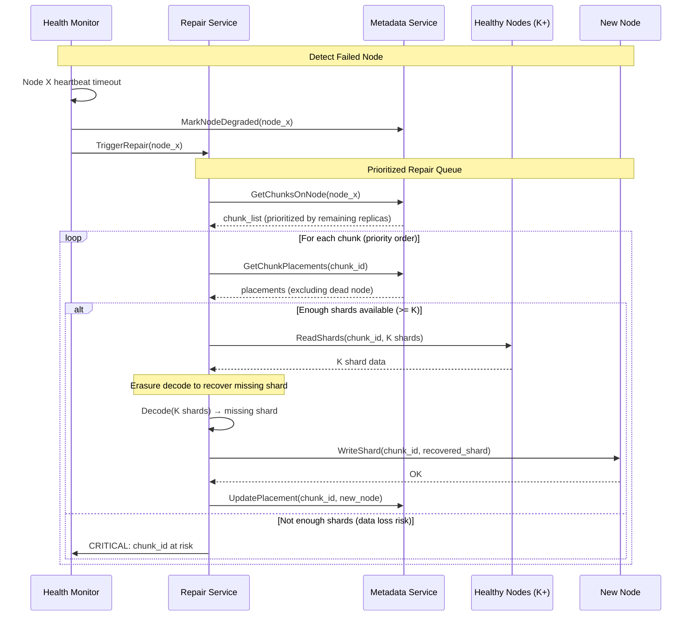
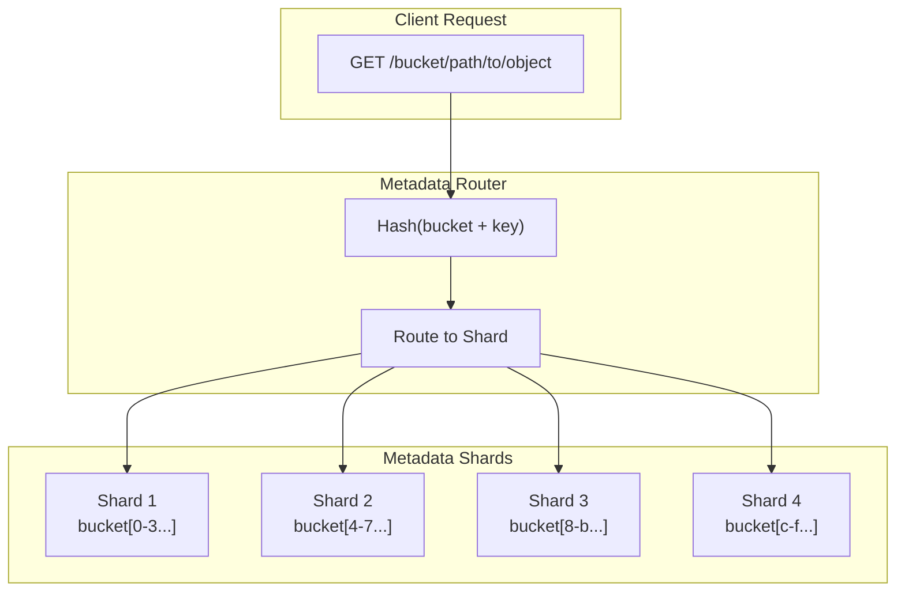
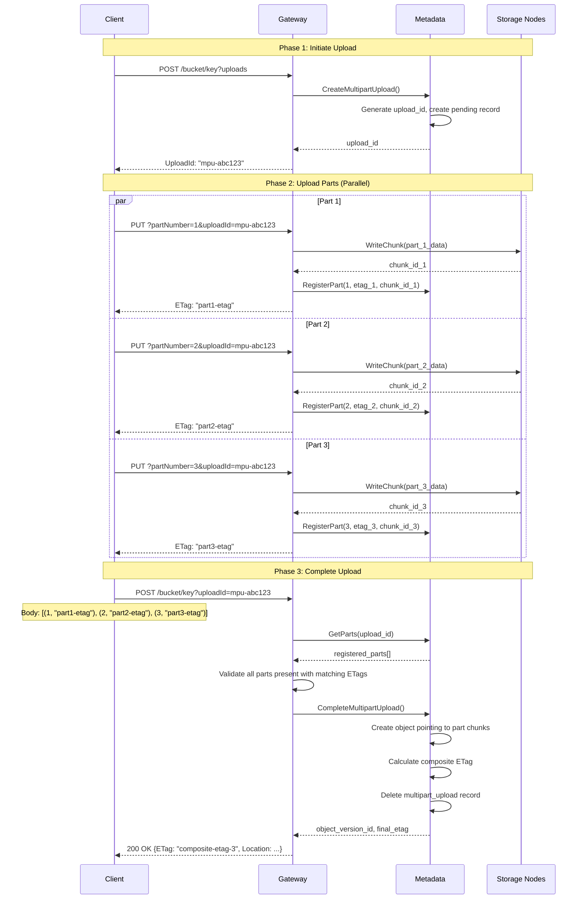

# Deep Dive & Bottlenecks

[← Back to Index](./00-index.md)

---

## Deep Dive 1: Erasure Coding

### Reed-Solomon Mathematics

```
┌────────────────────────────────────────────────────────────────────┐
│ REED-SOLOMON ENCODING EXPLAINED                                    │
├────────────────────────────────────────────────────────────────────┤
│                                                                     │
│ Goal: Create N shards from K data blocks such that ANY K shards    │
│       can reconstruct the original data.                           │
│                                                                     │
│ Configuration: RS(N, K)                                            │
│   - K = data shards (original data split into K pieces)           │
│   - M = N - K = parity shards (computed redundancy)               │
│   - Example: RS(14, 10) = 10 data + 4 parity                      │
│                                                                     │
│ Encoding Process:                                                   │
│                                                                     │
│   Data blocks: D = [d₀, d₁, d₂, ..., d_{k-1}]                     │
│                                                                     │
│   Encoding matrix (N × K):                                         │
│   ┌                          ┐                                     │
│   │  1  0  0  ...  0  0  0  │  ← Identity matrix (K × K)         │
│   │  0  1  0  ...  0  0  0  │    Data shards = copy of original  │
│   │  0  0  1  ...  0  0  0  │                                     │
│   │  :  :  :  ⋱   :  :  :  │                                     │
│   │  0  0  0  ...  0  0  1  │                                     │
│   │─────────────────────────│                                     │
│   │  1  1  1  ...  1  1  1  │  ← Vandermonde matrix (M × K)      │
│   │  1  2  4  ...  2^{k-1}  │    Parity = linear combinations    │
│   │  1  3  9  ...  3^{k-1}  │                                     │
│   │  1  4  16 ...  4^{k-1}  │                                     │
│   └                          ┘                                     │
│                                                                     │
│   Encoded shards: S = E × D                                        │
│                                                                     │
│   S[0..K-1] = D (data shards, unchanged)                          │
│   S[K..N-1] = parity shards (computed)                            │
│                                                                     │
│ Decoding Process (when shards lost):                               │
│                                                                     │
│   1. Collect any K available shards                                │
│   2. Build submatrix from corresponding rows of E                  │
│   3. Invert the submatrix                                          │
│   4. Multiply inverse by available shards                          │
│   5. Result = original data blocks                                 │
│                                                                     │
│ Galois Field Arithmetic:                                           │
│   - Operations in GF(2^8) for byte-level encoding                 │
│   - Addition = XOR (no carry)                                      │
│   - Multiplication via lookup tables (fast)                        │
│   - Every non-zero element has inverse                             │
│                                                                     │
└────────────────────────────────────────────────────────────────────┘
```

### Repair Process



### Repair Prioritization Strategy

```
┌────────────────────────────────────────────────────────────────────┐
│ REPAIR PRIORITY QUEUE                                              │
├────────────────────────────────────────────────────────────────────┤
│                                                                     │
│ Priority = (MAX_FAILURES - remaining_replicas) × URGENCY_FACTOR   │
│                                                                     │
│ For RS(14, 10):                                                    │
│   - Can lose 4 shards and still recover                           │
│   - Priority inversely proportional to remaining shards           │
│                                                                     │
│   Remaining Shards │ Priority │ Action                             │
│   ─────────────────┼──────────┼────────────────────────────────────│
│   14 (all healthy) │ 0        │ No repair needed                   │
│   13 (1 lost)      │ 1        │ Low priority, queue for repair     │
│   12 (2 lost)      │ 2        │ Medium priority                    │
│   11 (3 lost)      │ 4        │ High priority                      │
│   10 (4 lost)      │ 8        │ CRITICAL - at durability limit    │
│   9  (5 lost)      │ ∞        │ DATA LOSS - unrecoverable         │
│                                                                     │
│ Additional factors:                                                │
│   - Object access frequency (hot objects first)                    │
│   - Node failure correlation (same rack = higher priority)        │
│   - Repair bandwidth budget per hour                               │
│                                                                     │
└────────────────────────────────────────────────────────────────────┘
```

---

## Deep Dive 2: Metadata Service Scalability

### Metadata Hotspots

```
┌────────────────────────────────────────────────────────────────────┐
│ METADATA SERVICE BOTTLENECKS                                       │
├────────────────────────────────────────────────────────────────────┤
│                                                                     │
│ 1. LIST OPERATIONS (Most Expensive)                                │
│                                                                     │
│    Problem:                                                         │
│    - List prefix "photos/" in bucket with 1 billion objects       │
│    - Must scan index, paginate, return 1000 objects per page      │
│    - Deep pagination (page 10000) = scan 10M index entries        │
│                                                                     │
│    Mitigations:                                                     │
│    - Limit max-keys (typically 1000)                               │
│    - Cursor-based pagination (continuation token)                  │
│    - Prefix-partitioned indexes                                    │
│    - Caching common prefixes                                       │
│                                                                     │
│ 2. BUCKET WITH MANY SMALL OBJECTS                                  │
│                                                                     │
│    Problem:                                                         │
│    - 100M objects × 500 bytes metadata = 50 GB                    │
│    - Single bucket = potential hot partition                       │
│    - High QPS on popular bucket                                    │
│                                                                     │
│    Mitigations:                                                     │
│    - Shard buckets by key hash                                     │
│    - Separate hot/cold metadata tiers                              │
│    - Read replicas for read-heavy buckets                          │
│                                                                     │
│ 3. EVENTUAL CONSISTENCY WINDOW                                     │
│                                                                     │
│    Problem (Pre-2020 S3):                                          │
│    - Write to primary, read from replica                           │
│    - Replication lag = stale reads                                 │
│    - PUT followed by GET might return 404                          │
│                                                                     │
│    Solution (S3 Strong Consistency):                               │
│    - Use CRDTs or distributed transactions                         │
│    - Read-after-write from same partition                          │
│    - Metadata version vectors                                      │
│                                                                     │
└────────────────────────────────────────────────────────────────────┘
```

### Metadata Sharding Strategy



```
Sharding Approaches:

1. By Bucket ID (Simple)
   - Hash(bucket_id) mod N → shard
   - Pro: All objects in bucket on same shard
   - Con: Hot bucket = hot shard

2. By Bucket + Key Prefix (Better)
   - Hash(bucket_id + key_prefix) mod N → shard
   - Pro: Distributes large buckets
   - Con: List across prefixes = scatter-gather

3. Virtual Partitions (S3 Approach)
   - Bucket internally partitioned by key range
   - Auto-split hot partitions
   - Pro: Adaptive to access patterns
   - Con: Complex, split/merge overhead
```

### Strong Consistency Implementation

```
┌────────────────────────────────────────────────────────────────────┐
│ ACHIEVING STRONG CONSISTENCY (S3 Model Post-2020)                  │
├────────────────────────────────────────────────────────────────────┤
│                                                                     │
│ Challenge: How to provide strong read-after-write consistency      │
│           at S3's scale (500 trillion objects)?                    │
│                                                                     │
│ Solution: Witness-based protocol with CRDTs                        │
│                                                                     │
│ 1. WRITE PATH:                                                     │
│    ┌─────────────────────────────────────────────────────────────┐│
│    │ Client → Gateway → Witness Quorum → Storage                 ││
│    │                                                              ││
│    │ a) Write data to storage nodes                              ││
│    │ b) Register metadata with witness quorum (2 of 3)           ││
│    │ c) Witnesses record version vector                          ││
│    │ d) Return success after quorum ack                          ││
│    └─────────────────────────────────────────────────────────────┘│
│                                                                     │
│ 2. READ PATH:                                                      │
│    ┌─────────────────────────────────────────────────────────────┐│
│    │ Client → Gateway → Check Witnesses → Return Latest          ││
│    │                                                              ││
│    │ a) Query witness quorum for latest version                  ││
│    │ b) If versions differ, take highest                         ││
│    │ c) Fetch data from storage with that version                ││
│    │ d) Guaranteed to see all prior committed writes             ││
│    └─────────────────────────────────────────────────────────────┘│
│                                                                     │
│ 3. CRDT FOR CONCURRENT WRITES:                                     │
│    - Object metadata as CRDT (Conflict-free Replicated Data Type) │
│    - Concurrent writes to same key: last-writer-wins by timestamp │
│    - Version vectors track causality                               │
│    - No coordination needed for reads after quorum write          │
│                                                                     │
│ Performance Impact:                                                │
│    - Write latency: +5-10ms (witness quorum)                      │
│    - Read latency: No change (witness check is fast)              │
│    - Throughput: Maintained (witnesses are lightweight)           │
│                                                                     │
└────────────────────────────────────────────────────────────────────┘
```

---

## Deep Dive 3: Multipart Upload Assembly

### Part Upload and Assembly Flow



### Handling Edge Cases

```
┌────────────────────────────────────────────────────────────────────┐
│ MULTIPART UPLOAD EDGE CASES                                        │
├────────────────────────────────────────────────────────────────────┤
│                                                                     │
│ 1. PART OVERWRITE                                                  │
│    ─────────────────                                               │
│    Scenario: Client uploads part 5 twice with different data       │
│    Behavior: Second upload replaces first                          │
│    Implementation:                                                  │
│      - RegisterPart updates existing part record                   │
│      - Old chunk marked for garbage collection                     │
│      - Only latest ETag valid for completion                       │
│                                                                     │
│ 2. MISSING PARTS                                                   │
│    ──────────────                                                  │
│    Scenario: Complete called with parts [1, 3] but part 2 exists  │
│    Behavior: Fail with InvalidPart error                           │
│    Rule: Completion list must match exactly what was uploaded      │
│                                                                     │
│ 3. ETAG MISMATCH                                                   │
│    ─────────────                                                   │
│    Scenario: ETag in completion != ETag from upload response       │
│    Cause: Client recorded wrong ETag, or part was overwritten      │
│    Behavior: Fail with InvalidPart error                           │
│                                                                     │
│ 4. CONCURRENT COMPLETE                                             │
│    ──────────────────                                              │
│    Scenario: Two Complete requests arrive simultaneously           │
│    Behavior: First to commit wins, second fails                    │
│    Implementation: Transaction on multipart_uploads table          │
│                                                                     │
│ 5. UPLOAD TIMEOUT / ABANDONED                                      │
│    ─────────────────────────                                       │
│    Scenario: Client initiates but never completes                  │
│    Behavior: Cleanup after 7 days (configurable)                   │
│    Implementation:                                                  │
│      - Background job scans expired uploads                        │
│      - AbortMultipartUpload deletes parts and records             │
│      - Lifecycle rule can enforce shorter timeout                  │
│                                                                     │
│ 6. PART SIZE VIOLATION                                             │
│    ────────────────────                                            │
│    Rule: Parts 1 to N-1 must be >= 5 MB, last part can be smaller │
│    Scenario: Part 2 is 1 MB, Part 3 is 100 MB                     │
│    Behavior: Fail at completion time with EntityTooSmall           │
│                                                                     │
└────────────────────────────────────────────────────────────────────┘
```

### Composite ETag Calculation

```python
def calculate_composite_etag(parts: list[Part]) -> str:
    """
    Calculate ETag for multipart upload.

    S3 Composite ETag format: "<md5_of_concatenated_part_md5s>-<part_count>"

    Example:
      Part 1 MD5: d41d8cd98f00b204e9800998ecf8427e
      Part 2 MD5: 098f6bcd4621d373cade4e832627b4f6
      Part 3 MD5: 5d41402abc4b2a76b9719d911017c592

      Concatenate binary MD5s (48 bytes total)
      MD5 of concatenation: 7e10e...
      Final ETag: "7e10e...-3"
    """
    # Sort by part number
    parts = sorted(parts, key=lambda p: p.part_number)

    # Get binary MD5 of each part
    part_md5_bytes = []
    for part in parts:
        # ETag is hex string, convert to bytes
        md5_hex = part.etag.strip('"')
        md5_bytes = bytes.fromhex(md5_hex)
        part_md5_bytes.append(md5_bytes)

    # Concatenate and hash
    concatenated = b''.join(part_md5_bytes)
    final_md5 = hashlib.md5(concatenated).hexdigest()

    return f'"{final_md5}-{len(parts)}"'
```

---

## Bottleneck Analysis

### 1. Metadata Service Bottleneck

```
┌────────────────────────────────────────────────────────────────────┐
│ BOTTLENECK: METADATA SERVICE                                       │
├────────────────────────────────────────────────────────────────────┤
│                                                                     │
│ Symptoms:                                                          │
│   - High latency on PUT/GET (metadata lookup)                     │
│   - LIST operations timing out                                     │
│   - Database CPU/memory saturated                                  │
│                                                                     │
│ Root Causes:                                                        │
│   1. Single database for all metadata                              │
│   2. Hot buckets (popular content)                                 │
│   3. Large list operations                                         │
│   4. Inefficient indexes                                           │
│                                                                     │
│ Mitigations:                                                       │
│                                                                     │
│   Immediate:                                                        │
│   ┌─────────────────────────────────────────────────────────────┐ │
│   │ • Add read replicas for GET operations                       │ │
│   │ • Cache hot bucket metadata (Redis/Memcached)               │ │
│   │ • Rate limit LIST operations per bucket                      │ │
│   │ • Add index on (bucket_id, key) for point lookups           │ │
│   └─────────────────────────────────────────────────────────────┘ │
│                                                                     │
│   Strategic:                                                        │
│   ┌─────────────────────────────────────────────────────────────┐ │
│   │ • Shard metadata by bucket hash                              │ │
│   │ • Separate list index from object metadata                   │ │
│   │ • Use LSM-tree storage (RocksDB/LevelDB) for writes         │ │
│   │ • Implement request coalescing for batch operations          │ │
│   └─────────────────────────────────────────────────────────────┘ │
│                                                                     │
└────────────────────────────────────────────────────────────────────┘
```

### 2. Network Bandwidth Bottleneck

```
┌────────────────────────────────────────────────────────────────────┐
│ BOTTLENECK: NETWORK BANDWIDTH                                      │
├────────────────────────────────────────────────────────────────────┤
│                                                                     │
│ Symptoms:                                                          │
│   - Upload/download throughput lower than expected                 │
│   - Storage node NIC saturation                                    │
│   - Increased latency during peak hours                            │
│                                                                     │
│ Root Causes:                                                        │
│   1. Erasure coding multiplies network traffic                     │
│   2. Cross-rack/AZ replication                                     │
│   3. Repair traffic competing with client traffic                  │
│   4. Hot spots on specific storage nodes                           │
│                                                                     │
│ Calculations:                                                       │
│   Client upload: 1 GB object                                       │
│   With RS(10,4): 1 GB → 1.4 GB to storage                         │
│   Plus metadata: +1 MB                                             │
│   Cross-AZ copy: 1.4 GB × 3 AZs = 4.2 GB network                  │
│                                                                     │
│ Mitigations:                                                       │
│                                                                     │
│   Traffic Shaping:                                                  │
│   ┌─────────────────────────────────────────────────────────────┐ │
│   │ • Priority queues: client > repair > background              │ │
│   │ • Rate limit repair bandwidth (e.g., 30% of capacity)        │ │
│   │ • Schedule heavy operations off-peak                         │ │
│   └─────────────────────────────────────────────────────────────┘ │
│                                                                     │
│   Architecture:                                                     │
│   ┌─────────────────────────────────────────────────────────────┐ │
│   │ • 25-100 Gbps NICs on storage nodes                          │ │
│   │ • Dedicated repair network                                   │ │
│   │ • Read from nearest replica (locality awareness)             │ │
│   │ • CDN for read-heavy workloads                               │ │
│   └─────────────────────────────────────────────────────────────┘ │
│                                                                     │
└────────────────────────────────────────────────────────────────────┘
```

### 3. Disk I/O Bottleneck

```
┌────────────────────────────────────────────────────────────────────┐
│ BOTTLENECK: DISK I/O                                               │
├────────────────────────────────────────────────────────────────────┤
│                                                                     │
│ Symptoms:                                                          │
│   - High disk queue depth                                          │
│   - Increased read/write latency                                   │
│   - Low IOPS despite available bandwidth                           │
│                                                                     │
│ Root Causes:                                                        │
│   1. Random reads for small objects                                │
│   2. HDD seek time (not SSD)                                       │
│   3. Compaction competing with reads                               │
│   4. Too many objects per volume                                   │
│                                                                     │
│ Analysis (HDD vs SSD):                                             │
│   ┌─────────────────────────────────────────────────────────────┐ │
│   │ Metric          │ HDD (7200 RPM) │ NVMe SSD                  │ │
│   │─────────────────┼────────────────┼───────────────────────────│ │
│   │ Random IOPS     │ ~150           │ ~500,000                  │ │
│   │ Sequential MB/s │ ~150           │ ~3,000                    │ │
│   │ Seek time       │ ~8 ms          │ ~0.01 ms                  │ │
│   │ Cost per TB     │ ~$20           │ ~$100                     │ │
│   └─────────────────────────────────────────────────────────────┘ │
│                                                                     │
│ Mitigations:                                                       │
│                                                                     │
│   Storage Layout:                                                   │
│   ┌─────────────────────────────────────────────────────────────┐ │
│   │ • Log-structured storage (Haystack pattern)                  │ │
│   │   - Append-only writes (sequential)                          │ │
│   │   - In-memory index for O(1) lookups                        │ │
│   │   - Single disk seek per read                                │ │
│   │                                                              │ │
│   │ • Aggregate small objects into larger files                  │ │
│   │   - Pack many needles into one volume                        │ │
│   │   - Batch reads when possible                                │ │
│   └─────────────────────────────────────────────────────────────┘ │
│                                                                     │
│   Tiering:                                                          │
│   ┌─────────────────────────────────────────────────────────────┐ │
│   │ • Hot tier: NVMe SSD for frequently accessed objects        │ │
│   │ • Warm tier: SATA SSD for occasional access                  │ │
│   │ • Cold tier: HDD for archival (sequential reads OK)         │ │
│   └─────────────────────────────────────────────────────────────┘ │
│                                                                     │
└────────────────────────────────────────────────────────────────────┘
```

---

## Race Conditions and Failure Scenarios

### Concurrent Upload to Same Key

```
┌────────────────────────────────────────────────────────────────────┐
│ RACE CONDITION: CONCURRENT PUT TO SAME KEY                         │
├────────────────────────────────────────────────────────────────────┤
│                                                                     │
│ Scenario:                                                          │
│   Client A: PUT /bucket/key (data_A) at T=0                       │
│   Client B: PUT /bucket/key (data_B) at T=1                       │
│   Client C: GET /bucket/key at T=2                                │
│                                                                     │
│ Question: What does Client C see?                                  │
│                                                                     │
│ Without versioning (last-writer-wins):                             │
│ ┌─────────────────────────────────────────────────────────────┐   │
│ │ T=0: Client A writes data_A, gets ETag "A"                  │   │
│ │ T=1: Client B writes data_B, gets ETag "B"                  │   │
│ │ T=2: Client C reads → gets data_B (latest)                  │   │
│ │                                                              │   │
│ │ Note: data_A is garbage collected (orphaned)                │   │
│ └─────────────────────────────────────────────────────────────┘   │
│                                                                     │
│ With versioning:                                                   │
│ ┌─────────────────────────────────────────────────────────────┐   │
│ │ T=0: Client A writes data_A, gets version_id "v1"           │   │
│ │ T=1: Client B writes data_B, gets version_id "v2"           │   │
│ │ T=2: Client C reads → gets data_B (current version)         │   │
│ │      Client C reads ?versionId=v1 → gets data_A             │   │
│ │                                                              │   │
│ │ Both versions preserved until explicitly deleted             │   │
│ └─────────────────────────────────────────────────────────────┘   │
│                                                                     │
│ Implementation:                                                     │
│   - Metadata write with optimistic locking (version check)        │
│   - If conflict, retry with new version                            │
│   - Timestamp-based ordering for same-millisecond writes          │
│                                                                     │
└────────────────────────────────────────────────────────────────────┘
```

### Delete During Read

```
┌────────────────────────────────────────────────────────────────────┐
│ RACE CONDITION: DELETE DURING READ                                 │
├────────────────────────────────────────────────────────────────────┤
│                                                                     │
│ Scenario:                                                          │
│   T=0: Client A starts GET /bucket/large-file (10 GB)             │
│   T=5: Client B issues DELETE /bucket/large-file                  │
│   T=10: Client A is still streaming...                            │
│                                                                     │
│ Expected Behavior:                                                 │
│ ┌─────────────────────────────────────────────────────────────┐   │
│ │ 1. Client A's read should complete successfully              │   │
│ │    - Read "pins" the object version at start time           │   │
│ │    - Chunks not deleted until read completes                 │   │
│ │                                                              │   │
│ │ 2. Client B's delete returns immediately                     │   │
│ │    - Delete marker added (if versioning)                     │   │
│ │    - Or object marked for deletion                           │   │
│ │                                                              │   │
│ │ 3. New reads after T=5 get 404                               │   │
│ │                                                              │   │
│ │ 4. Garbage collection waits for active reads                 │   │
│ └─────────────────────────────────────────────────────────────┘   │
│                                                                     │
│ Implementation:                                                     │
│   - Reference counting on object versions                          │
│   - Soft delete (mark deleted, don't remove data)                 │
│   - GC scans for objects with:                                     │
│     • deleted_at < now - grace_period (e.g., 24 hours)            │
│     • active_read_count = 0                                        │
│                                                                     │
└────────────────────────────────────────────────────────────────────┘
```

### Storage Node Failure During Write

```
┌────────────────────────────────────────────────────────────────────┐
│ FAILURE: STORAGE NODE DIES DURING WRITE                            │
├────────────────────────────────────────────────────────────────────┤
│                                                                     │
│ Scenario (RS(14,10), writing to 14 nodes):                        │
│   T=0: Start writing 14 shards                                    │
│   T=3: Node 7 crashes, shard 7 write fails                        │
│   T=5: 13 of 14 writes complete                                   │
│                                                                     │
│ Handling:                                                          │
│ ┌─────────────────────────────────────────────────────────────┐   │
│ │ 1. Detect partial failure (13/14 success)                    │   │
│ │                                                              │   │
│ │ 2. Check if durability met:                                  │   │
│ │    - RS(14,10) needs 10 for recovery                         │   │
│ │    - 13 shards > 10 ✓ Durability OK                         │   │
│ │                                                              │   │
│ │ 3. Options:                                                   │   │
│ │    a) Accept 13/14 and queue repair job                      │   │
│ │    b) Retry shard 7 to different node                        │   │
│ │    c) Fail write and rollback (strict mode)                  │   │
│ │                                                              │   │
│ │ 4. Default: Option (a) - async repair                        │   │
│ │    - Commit metadata with 13 placements                      │   │
│ │    - Background job repairs missing shard                    │   │
│ │    - Object is readable immediately                          │   │
│ └─────────────────────────────────────────────────────────────┘   │
│                                                                     │
│ Write Quorum Configuration:                                        │
│   - Quorum = ceil((N + K) / 2) = ceil((14 + 10) / 2) = 12        │
│   - Write succeeds if 12+ shards written                          │
│   - Allows 2 simultaneous failures during write                   │
│                                                                     │
└────────────────────────────────────────────────────────────────────┘
```

### Metadata Corruption

```
┌────────────────────────────────────────────────────────────────────┐
│ FAILURE: METADATA CORRUPTION                                       │
├────────────────────────────────────────────────────────────────────┤
│                                                                     │
│ Symptoms:                                                          │
│   - Object exists in storage but not in metadata (orphan)         │
│   - Metadata points to non-existent chunks (dangling ref)         │
│   - Chunk checksum mismatch                                        │
│                                                                     │
│ Detection:                                                         │
│ ┌─────────────────────────────────────────────────────────────┐   │
│ │ 1. Background integrity scanner                              │   │
│ │    - Periodically verify metadata ↔ storage consistency     │   │
│ │    - Compare checksums on read                               │   │
│ │                                                              │   │
│ │ 2. Read-time verification                                    │   │
│ │    - Verify chunk checksum matches metadata                  │   │
│ │    - If mismatch, try alternate replica                      │   │
│ └─────────────────────────────────────────────────────────────┘   │
│                                                                     │
│ Recovery:                                                          │
│ ┌─────────────────────────────────────────────────────────────┐   │
│ │ Orphan chunks (data without metadata):                       │   │
│ │   - Log for manual review                                    │   │
│ │   - Auto-delete after grace period (e.g., 30 days)          │   │
│ │                                                              │   │
│ │ Dangling references (metadata without data):                 │   │
│ │   - Mark object as corrupted                                 │   │
│ │   - Attempt recovery from erasure coding                     │   │
│ │   - If unrecoverable, return error to client                 │   │
│ │                                                              │   │
│ │ Checksum mismatch:                                           │   │
│ │   - Try alternate replicas/shards                            │   │
│ │   - Rebuild from erasure coding if possible                  │   │
│ │   - Update placement to healthy replica                      │   │
│ └─────────────────────────────────────────────────────────────┘   │
│                                                                     │
│ Prevention:                                                        │
│   - WAL for metadata database                                      │
│   - Checksums on metadata records                                  │
│   - Metadata replication (3+ copies)                               │
│   - Regular backups with point-in-time recovery                    │
│                                                                     │
└────────────────────────────────────────────────────────────────────┘
```
