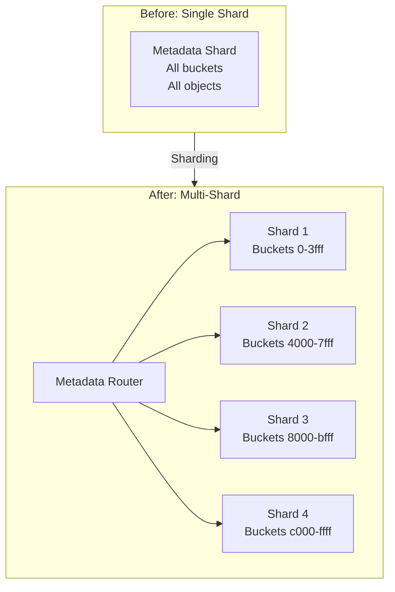
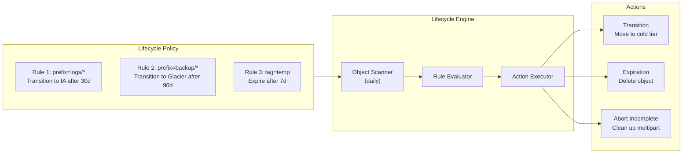
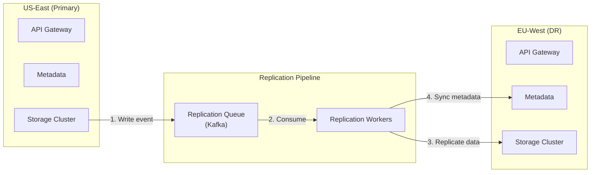

# Scalability & Reliability

[← Back to Index](./00-index.md)

---

## Horizontal Scaling

### Storage Tier Scaling

```
┌────────────────────────────────────────────────────────────────────┐
│ STORAGE NODE SCALING                                               │
├────────────────────────────────────────────────────────────────────┤
│                                                                     │
│ Initial Cluster: 20 nodes × 100 TB = 2 PB raw capacity            │
│                                                                     │
│ Scaling Trigger:                                                   │
│   - Storage utilization > 70%                                      │
│   - Network utilization > 80% sustained                            │
│   - Repair queue growing faster than processing                    │
│                                                                     │
│ Adding Nodes Process:                                               │
│ ┌─────────────────────────────────────────────────────────────┐   │
│ │ 1. Provision new storage nodes (10 more nodes)              │   │
│ │                                                              │   │
│ │ 2. Join cluster                                              │   │
│ │    - Register with placement manager                         │   │
│ │    - Start heartbeat                                         │   │
│ │    - Report available capacity                               │   │
│ │                                                              │   │
│ │ 3. Update consistent hash ring                               │   │
│ │    - Add virtual nodes for new physical nodes               │   │
│ │    - Some hash ranges now map to new nodes                  │   │
│ │                                                              │   │
│ │ 4. Rebalancing (gradual)                                     │   │
│ │    - New writes go to new nodes (natural distribution)      │   │
│ │    - Background: move some chunks from old nodes            │   │
│ │    - Rate-limited to avoid performance impact               │   │
│ │                                                              │   │
│ │ 5. Capacity verification                                     │   │
│ │    - Confirm uniform distribution                            │   │
│ │    - Validate durability (all chunks have required replicas)│   │
│ └─────────────────────────────────────────────────────────────┘   │
│                                                                     │
│ Result: 30 nodes × 100 TB = 3 PB raw capacity                     │
│         ~1 PB additional effective capacity (with erasure coding) │
│                                                                     │
└────────────────────────────────────────────────────────────────────┘
```

### Metadata Tier Scaling



```
┌────────────────────────────────────────────────────────────────────┐
│ METADATA SCALING STRATEGIES                                        │
├────────────────────────────────────────────────────────────────────┤
│                                                                     │
│ 1. VERTICAL SCALING (Short-term)                                   │
│    ───────────────────────────                                     │
│    - Increase RAM for larger in-memory index                      │
│    - Faster NVMe for write-ahead log                              │
│    - More CPU cores for concurrent queries                         │
│    Limit: Single node capacity ceiling                             │
│                                                                     │
│ 2. READ REPLICAS (Read scaling)                                    │
│    ─────────────────────────────                                   │
│    - Primary handles writes                                        │
│    - 2-4 replicas handle reads                                     │
│    - Async replication (< 10ms lag)                               │
│    Limit: Write throughput still bounded by primary               │
│                                                                     │
│ 3. SHARDING BY BUCKET (Horizontal)                                 │
│    ───────────────────────────────                                 │
│    - Hash(bucket_id) → shard assignment                           │
│    - Each shard handles subset of buckets                         │
│    - Cross-shard operations (list all buckets) need scatter-gather│
│    Pro: Linear write scaling                                       │
│    Con: Hot bucket = hot shard                                     │
│                                                                     │
│ 4. SHARDING BY KEY RANGE (Fine-grained)                           │
│    ─────────────────────────────────────                           │
│    - Large buckets split across multiple shards                   │
│    - Hash(bucket_id + key_prefix) → shard                        │
│    - Auto-split when shard exceeds threshold                      │
│    Pro: Handles hot buckets                                        │
│    Con: More complex routing, split/merge overhead                │
│                                                                     │
└────────────────────────────────────────────────────────────────────┘
```

### API Gateway Scaling

```
┌────────────────────────────────────────────────────────────────────┐
│ API GATEWAY SCALING                                                │
├────────────────────────────────────────────────────────────────────┤
│                                                                     │
│ Stateless Design:                                                  │
│   - Each gateway instance independent                              │
│   - No session state (use signed requests)                        │
│   - Horizontal auto-scaling based on request rate                 │
│                                                                     │
│ Load Distribution:                                                 │
│                                                                     │
│   ┌─────────────────────────────────────────────────────────────┐ │
│   │                      DNS / Anycast                           │ │
│   │                           │                                   │ │
│   │            ┌──────────────┼──────────────┐                   │ │
│   │            ▼              ▼              ▼                   │ │
│   │       ┌────────┐    ┌────────┐    ┌────────┐                │ │
│   │       │  LB 1  │    │  LB 2  │    │  LB 3  │                │ │
│   │       │ (AZ-1) │    │ (AZ-2) │    │ (AZ-3) │                │ │
│   │       └───┬────┘    └───┬────┘    └───┬────┘                │ │
│   │           │             │             │                       │ │
│   │    ┌──────┼──────┐ ┌────┼────┐ ┌──────┼──────┐              │ │
│   │    ▼      ▼      ▼ ▼    ▼    ▼ ▼      ▼      ▼              │ │
│   │  [API] [API] [API] [API] [API] [API] [API] [API] [API]      │ │
│   │                                                               │ │
│   └─────────────────────────────────────────────────────────────┘ │
│                                                                     │
│ Auto-scaling Rules:                                                │
│   - Scale out: CPU > 70% or RPS > 8000/instance                  │
│   - Scale in: CPU < 30% and RPS < 2000/instance                  │
│   - Min instances: 3 per AZ (high availability)                   │
│   - Max instances: Based on cost budget                           │
│                                                                     │
└────────────────────────────────────────────────────────────────────┘
```

---

## Storage Tiering

### Storage Class Hierarchy

```
┌────────────────────────────────────────────────────────────────────┐
│ STORAGE TIERING                                                    │
├────────────────────────────────────────────────────────────────────┤
│                                                                     │
│   ┌─────────────────────────────────────────────────────────────┐ │
│   │  HOT TIER (Standard)                                         │ │
│   │  ────────────────────                                        │ │
│   │  Media: NVMe SSD                                             │ │
│   │  Access: Immediate (< 50ms first byte)                       │ │
│   │  Cost: $$$$ per GB/month                                     │ │
│   │  Use: Frequently accessed data                               │ │
│   │  Durability: RS(10,4) across 3 AZs                          │ │
│   └─────────────────────────────────────────────────────────────┘ │
│                      │                                              │
│                      ▼ Lifecycle: after 30 days                    │
│   ┌─────────────────────────────────────────────────────────────┐ │
│   │  WARM TIER (Infrequent Access)                               │ │
│   │  ─────────────────────────────                               │ │
│   │  Media: SATA SSD or HDD                                      │ │
│   │  Access: Immediate (< 100ms first byte)                      │ │
│   │  Cost: $$ per GB/month + retrieval fee                       │ │
│   │  Use: Monthly access patterns                                │ │
│   │  Durability: RS(14,10) across 3 AZs                         │ │
│   └─────────────────────────────────────────────────────────────┘ │
│                      │                                              │
│                      ▼ Lifecycle: after 90 days                    │
│   ┌─────────────────────────────────────────────────────────────┐ │
│   │  COLD TIER (Archive)                                         │ │
│   │  ───────────────────                                         │ │
│   │  Media: High-density HDD (SMR)                               │ │
│   │  Access: Minutes to hours (async retrieval)                  │ │
│   │  Cost: $ per GB/month + higher retrieval fee                 │ │
│   │  Use: Compliance, backup, disaster recovery                  │ │
│   │  Durability: RS(17,14) with offline verification            │ │
│   └─────────────────────────────────────────────────────────────┘ │
│                      │                                              │
│                      ▼ Lifecycle: after 365 days                   │
│   ┌─────────────────────────────────────────────────────────────┐ │
│   │  DEEP ARCHIVE (Glacier-like)                                 │ │
│   │  ───────────────────────────                                 │ │
│   │  Media: Tape or offline storage                              │ │
│   │  Access: 12-48 hours (requires restore)                      │ │
│   │  Cost: ¢ per GB/month + significant retrieval fee           │ │
│   │  Use: Regulatory retention, legal hold                       │ │
│   │  Durability: 11 nines (separate verification)               │ │
│   └─────────────────────────────────────────────────────────────┘ │
│                                                                     │
└────────────────────────────────────────────────────────────────────┘
```

### Lifecycle Policy Engine



```yaml
# Example Lifecycle Configuration
lifecycle_rules:
  - id: "logs-to-ia"
    enabled: true
    filter:
      prefix: "logs/"
    transitions:
      - days: 30
        storage_class: "INFREQUENT_ACCESS"
      - days: 90
        storage_class: "GLACIER"

  - id: "temp-cleanup"
    enabled: true
    filter:
      tag:
        key: "lifecycle"
        value: "temporary"
    expiration:
      days: 7

  - id: "incomplete-multipart"
    enabled: true
    abort_incomplete_multipart_upload:
      days_after_initiation: 7

  - id: "noncurrent-versions"
    enabled: true
    noncurrent_version_transitions:
      - noncurrent_days: 30
        storage_class: "GLACIER"
    noncurrent_version_expiration:
      noncurrent_days: 365
```

---

## Fault Tolerance

### Node Failure Handling

```
┌────────────────────────────────────────────────────────────────────┐
│ FAULT TOLERANCE: NODE FAILURES                                     │
├────────────────────────────────────────────────────────────────────┤
│                                                                     │
│ Failure Detection:                                                 │
│ ┌─────────────────────────────────────────────────────────────┐   │
│ │ 1. Heartbeat monitoring (every 10 seconds)                   │   │
│ │ 2. 3 consecutive missed heartbeats → suspect               │   │
│ │ 3. Health check probe → confirm failure                     │   │
│ │ 4. Mark node as FAILED in cluster state                     │   │
│ └─────────────────────────────────────────────────────────────┘   │
│                                                                     │
│ Immediate Actions:                                                 │
│ ┌─────────────────────────────────────────────────────────────┐   │
│ │ 1. Stop routing new writes to failed node                   │   │
│ │ 2. Remove from consistent hash ring                         │   │
│ │ 3. For active reads: failover to replica                    │   │
│ │ 4. Queue affected chunks for priority repair                │   │
│ └─────────────────────────────────────────────────────────────┘   │
│                                                                     │
│ Repair Process:                                                    │
│ ┌─────────────────────────────────────────────────────────────┐   │
│ │ Priority Queue (by remaining copies):                        │   │
│ │   P1: Chunks with only K copies (at durability limit)       │   │
│ │   P2: Chunks with K+1 copies                                │   │
│ │   P3: Chunks with K+2 copies                                │   │
│ │   ...                                                        │   │
│ │                                                              │   │
│ │ For each chunk:                                              │   │
│ │   1. Read K shards from healthy nodes                       │   │
│ │   2. Decode missing shard(s)                                │   │
│ │   3. Write to new node(s)                                   │   │
│ │   4. Update placement metadata                              │   │
│ └─────────────────────────────────────────────────────────────┘   │
│                                                                     │
│ Recovery Timeline (100 TB node, 10 Gbps repair bandwidth):        │
│   Data to repair: 100 TB × (1/N) ≈ 7 TB (if N=14 nodes)          │
│   Time: 7 TB / 10 Gbps ≈ 1.5 hours                               │
│   With rate limiting (30%): ~5 hours                              │
│                                                                     │
└────────────────────────────────────────────────────────────────────┘
```

### AZ Failure Handling

```
┌────────────────────────────────────────────────────────────────────┐
│ FAULT TOLERANCE: AVAILABILITY ZONE FAILURE                         │
├────────────────────────────────────────────────────────────────────┤
│                                                                     │
│ Setup: 3 AZs, RS(12,8), 4 shards per AZ                           │
│                                                                     │
│   AZ-1         AZ-2         AZ-3                                   │
│   ┌────┐       ┌────┐       ┌────┐                                │
│   │S1  │       │S5  │       │S9  │                                │
│   │S2  │       │S6  │       │S10 │                                │
│   │S3  │       │S7  │       │S11 │                                │
│   │S4  │       │S8  │       │S12 │                                │
│   └────┘       └────┘       └────┘                                │
│                                                                     │
│ AZ-2 Fails:                                                        │
│   Remaining: S1-S4 (AZ-1) + S9-S12 (AZ-3) = 8 shards             │
│   Required for recovery: 8 shards                                  │
│   Result: Data still recoverable! ✓                               │
│                                                                     │
│ Automatic Failover:                                                │
│ ┌─────────────────────────────────────────────────────────────┐   │
│ │ 1. Health checks detect AZ-2 unreachable                     │   │
│ │ 2. Mark all AZ-2 nodes as FAILED                            │   │
│ │ 3. Traffic automatically routes to AZ-1, AZ-3               │   │
│ │ 4. Reads: decode from 8 remaining shards                    │   │
│ │ 5. Writes: use AZ-1 and AZ-3 nodes                          │   │
│ │ 6. Background: repair missing shards to healthy AZs         │   │
│ └─────────────────────────────────────────────────────────────┘   │
│                                                                     │
│ Capacity Impact:                                                   │
│   - Read throughput: ~67% (2 of 3 AZs)                           │
│   - Write throughput: ~67%                                        │
│   - Repair load: high (rebuild 33% of data)                      │
│   - Duration: depends on AZ recovery time                         │
│                                                                     │
└────────────────────────────────────────────────────────────────────┘
```

### Correlated Failure Protection (Copyset)

```
┌────────────────────────────────────────────────────────────────────┐
│ COPYSET REPLICATION                                                │
├────────────────────────────────────────────────────────────────────┤
│                                                                     │
│ Problem with random placement:                                     │
│   - 9 nodes, RF=3, random placement                               │
│   - Each chunk on 3 random nodes                                   │
│   - If 3 random nodes fail → high probability of data loss       │
│   - C(9,3) = 84 possible 3-node failure sets                     │
│   - ~84% chance at least one chunk lost in random 3-node failure │
│                                                                     │
│ Copyset Solution:                                                  │
│   - Predefine "copysets" (valid node combinations)                │
│   - Limit which nodes can hold replicas together                  │
│   - Reduce number of unique failure sets that cause data loss    │
│                                                                     │
│ Example (9 nodes, RF=3):                                          │
│   Copysets: {1,2,3}, {4,5,6}, {7,8,9}, {1,4,7}, {2,5,8}, {3,6,9} │
│   Only 6 copysets instead of C(9,3)=84                           │
│                                                                     │
│   Failure of nodes {1,5,9}:                                        │
│     - Random: might lose data                                      │
│     - Copyset: NO copyset fully failed → NO data loss            │
│                                                                     │
│ Trade-off:                                                         │
│   Pro: 10-100x reduction in data loss probability                 │
│   Con: Less flexibility in placement, harder rebalancing          │
│                                                                     │
│ Implementation:                                                    │
│   1. Define copysets based on rack/failure domain                 │
│   2. When placing chunk, select a copyset                         │
│   3. Place all replicas within that copyset                       │
│   4. Scatter copysets across racks for fault isolation           │
│                                                                     │
└────────────────────────────────────────────────────────────────────┘
```

---

## Disaster Recovery

### Multi-Region Replication



### RPO and RTO Targets

```
┌────────────────────────────────────────────────────────────────────┐
│ DISASTER RECOVERY TARGETS                                          │
├────────────────────────────────────────────────────────────────────┤
│                                                                     │
│ RPO (Recovery Point Objective): How much data can we lose?        │
│ RTO (Recovery Time Objective): How fast must we recover?          │
│                                                                     │
│ ┌───────────────────────────────────────────────────────────────┐ │
│ │ Tier       │ RPO          │ RTO        │ Method                │ │
│ │────────────┼──────────────┼────────────┼───────────────────────│ │
│ │ Hot (Tier 1)│ 0 (sync)    │ < 1 minute │ Synchronous multi-AZ │ │
│ │ Warm (Tier 2)│ < 15 min  │ < 1 hour   │ Async cross-region   │ │
│ │ Cold (Tier 3)│ < 24 hours│ < 4 hours  │ Daily batch replication│ │
│ │ Archive     │ < 24 hours │ < 24 hours │ Tape/offline backup   │ │
│ └───────────────────────────────────────────────────────────────┘ │
│                                                                     │
│ Cross-Region Replication Strategies:                               │
│                                                                     │
│ 1. Asynchronous (Default)                                          │
│    ┌─────────────────────────────────────────────────────────────┐│
│    │ Write to primary → Queue → Replicate in background        ││
│    │ RPO: 15 minutes (queue depth dependent)                    ││
│    │ RTO: Minutes (failover to replica)                         ││
│    │ Pro: No write latency impact                               ││
│    │ Con: May lose recent writes on primary failure             ││
│    └─────────────────────────────────────────────────────────────┘│
│                                                                     │
│ 2. Synchronous (Critical Data)                                     │
│    ┌─────────────────────────────────────────────────────────────┐│
│    │ Write to primary AND replica before ack                    ││
│    │ RPO: 0                                                      ││
│    │ RTO: Seconds (immediate failover)                          ││
│    │ Pro: Zero data loss                                        ││
│    │ Con: Write latency = max(primary, replica) + network RTT  ││
│    └─────────────────────────────────────────────────────────────┘│
│                                                                     │
└────────────────────────────────────────────────────────────────────┘
```

### Failover Procedure

```
┌────────────────────────────────────────────────────────────────────┐
│ REGION FAILOVER RUNBOOK                                            │
├────────────────────────────────────────────────────────────────────┤
│                                                                     │
│ Trigger: Primary region (US-East) experiences major outage        │
│                                                                     │
│ Step 1: Assess (5 minutes)                                         │
│ ┌─────────────────────────────────────────────────────────────┐   │
│ │ □ Confirm primary region is unrecoverable (not transient)   │   │
│ │ □ Check replication lag to secondary                         │   │
│ │ □ Estimate data loss (RPO impact)                           │   │
│ │ □ Get management approval for failover                       │   │
│ └─────────────────────────────────────────────────────────────┘   │
│                                                                     │
│ Step 2: Stop Replication (2 minutes)                               │
│ ┌─────────────────────────────────────────────────────────────┐   │
│ │ □ Pause replication workers                                  │   │
│ │ □ Record last replicated position                           │   │
│ │ □ Prevent split-brain scenarios                             │   │
│ └─────────────────────────────────────────────────────────────┘   │
│                                                                     │
│ Step 3: Promote Secondary (10 minutes)                             │
│ ┌─────────────────────────────────────────────────────────────┐   │
│ │ □ Mark secondary region as PRIMARY in control plane         │   │
│ │ □ Enable writes on secondary                                 │   │
│ │ □ Update API endpoints / DNS                                │   │
│ │ □ Verify metadata consistency                                │   │
│ └─────────────────────────────────────────────────────────────┘   │
│                                                                     │
│ Step 4: Redirect Traffic (5 minutes)                               │
│ ┌─────────────────────────────────────────────────────────────┐   │
│ │ □ Update Route 53 / DNS to point to secondary               │   │
│ │ □ Invalidate CDN caches if needed                           │   │
│ │ □ Notify clients of endpoint change                         │   │
│ └─────────────────────────────────────────────────────────────┘   │
│                                                                     │
│ Step 5: Verify (10 minutes)                                        │
│ ┌─────────────────────────────────────────────────────────────┐   │
│ │ □ Test read operations                                       │   │
│ │ □ Test write operations                                      │   │
│ │ □ Verify durability guarantees                               │   │
│ │ □ Monitor error rates                                        │   │
│ └─────────────────────────────────────────────────────────────┘   │
│                                                                     │
│ Total RTO: ~30-45 minutes                                          │
│                                                                     │
└────────────────────────────────────────────────────────────────────┘
```

---

## Capacity Planning

### Growth Modeling

```
┌────────────────────────────────────────────────────────────────────┐
│ CAPACITY PLANNING MODEL                                            │
├────────────────────────────────────────────────────────────────────┤
│                                                                     │
│ Current State:                                                     │
│   Storage: 500 TB used / 1 PB capacity (50% utilization)          │
│   Objects: 5 billion                                               │
│   Daily ingestion: 5 TB/day                                        │
│   Daily deletion: 1 TB/day                                         │
│   Net growth: 4 TB/day                                             │
│                                                                     │
│ Projections:                                                       │
│ ┌─────────────────────────────────────────────────────────────┐   │
│ │ Timeline    │ Storage │ Objects  │ Daily Ingestion          │   │
│ │─────────────┼─────────┼──────────┼──────────────────────────│   │
│ │ Now         │ 500 TB  │ 5B       │ 5 TB/day                 │   │
│ │ +6 months   │ 1.2 PB  │ 10B      │ 7 TB/day (+40%)         │   │
│ │ +12 months  │ 2.5 PB  │ 18B      │ 10 TB/day (+100%)       │   │
│ │ +24 months  │ 6 PB    │ 40B      │ 20 TB/day (+300%)       │   │
│ └─────────────────────────────────────────────────────────────┘   │
│                                                                     │
│ Capacity Triggers:                                                 │
│   70% storage utilization → order more hardware                   │
│   80% storage utilization → emergency expansion                   │
│   90% storage utilization → stop non-critical writes              │
│                                                                     │
│ Expansion Plan:                                                    │
│ ┌─────────────────────────────────────────────────────────────┐   │
│ │ Q1: Add 500 TB storage nodes (proactive)                     │   │
│ │ Q2: Scale metadata tier (shard split)                        │   │
│ │ Q3: Add another region for DR                                │   │
│ │ Q4: Add 1 PB storage nodes                                   │   │
│ └─────────────────────────────────────────────────────────────┘   │
│                                                                     │
└────────────────────────────────────────────────────────────────────┘
```

### Cost Optimization

```
┌────────────────────────────────────────────────────────────────────┐
│ COST OPTIMIZATION STRATEGIES                                       │
├────────────────────────────────────────────────────────────────────┤
│                                                                     │
│ 1. Storage Tiering ROI                                             │
│    ┌─────────────────────────────────────────────────────────────┐│
│    │ Before tiering: 1 PB all on Standard ($23,000/month)       ││
│    │                                                              ││
│    │ After tiering analysis:                                      ││
│    │   - 200 TB hot (20%) → Standard @ $0.023/GB = $4,600       ││
│    │   - 300 TB warm (30%) → IA @ $0.0125/GB = $3,750           ││
│    │   - 500 TB cold (50%) → Glacier @ $0.004/GB = $2,000       ││
│    │   Total: $10,350/month (55% savings)                        ││
│    └─────────────────────────────────────────────────────────────┘│
│                                                                     │
│ 2. Erasure Coding vs Replication                                   │
│    ┌─────────────────────────────────────────────────────────────┐│
│    │ 1 PB logical data:                                          ││
│    │   - 3x Replication: 3 PB raw ($69,000/month)               ││
│    │   - RS(10,4): 1.4 PB raw ($32,200/month)                   ││
│    │   Savings: $36,800/month (53%)                              ││
│    └─────────────────────────────────────────────────────────────┘│
│                                                                     │
│ 3. Deduplication (content-addressed)                               │
│    ┌─────────────────────────────────────────────────────────────┐│
│    │ Backup workload: 1 PB with 60% duplicate content           ││
│    │   - Without dedup: 1 PB storage                             ││
│    │   - With CDC dedup: 400 TB storage                          ││
│    │   Savings: 60%                                               ││
│    └─────────────────────────────────────────────────────────────┘│
│                                                                     │
│ 4. Compression (for compressible content)                          │
│    ┌─────────────────────────────────────────────────────────────┐│
│    │ Log files, JSON, text: 5:1 compression ratio typical       ││
│    │ Media (JPEG, MP4): minimal compression (already compressed) ││
│    │ Apply selectively based on content type                     ││
│    └─────────────────────────────────────────────────────────────┘│
│                                                                     │
└────────────────────────────────────────────────────────────────────┘
```

### Performance vs Cost Trade-offs

| Configuration | Performance | Cost | Use Case |
|---------------|-------------|------|----------|
| NVMe + 3x Replication | Excellent | Very High | Ultra-low latency, high throughput |
| SSD + RS(10,4) | Good | Medium | General purpose, balanced |
| HDD + RS(14,10) | Moderate | Low | Archival, sequential access |
| HDD + RS(17,14) + Compression | Low | Very Low | Deep archive, compliance |
