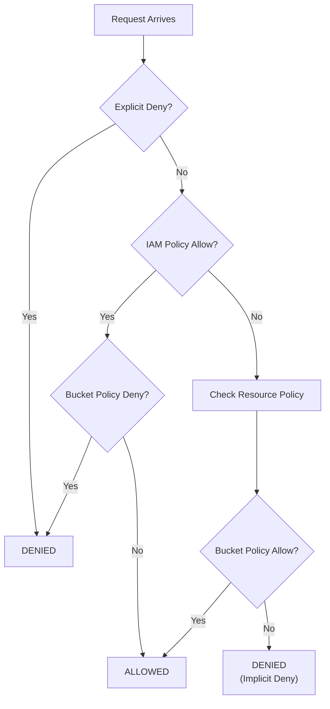
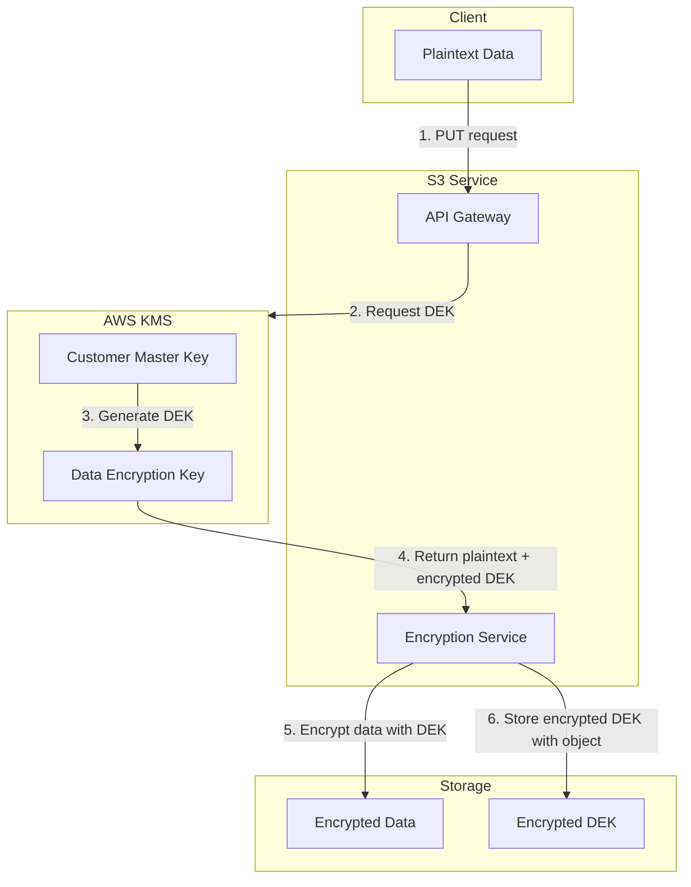

# Security & Compliance

[← Back to Index](./00-index.md)

---

## Authentication

### Authentication Methods

```
┌────────────────────────────────────────────────────────────────────┐
│ AUTHENTICATION MECHANISMS                                          │
├────────────────────────────────────────────────────────────────────┤
│                                                                     │
│ 1. API Key / Secret Key (AWS Signature v4)                        │
│    ─────────────────────────────────────────                       │
│    Request signing with HMAC-SHA256                                │
│                                                                     │
│    String to Sign:                                                 │
│    ┌─────────────────────────────────────────────────────────────┐│
│    │ AWS4-HMAC-SHA256                                            ││
│    │ 20240115T120000Z                                            ││
│    │ 20240115/us-east-1/s3/aws4_request                         ││
│    │ <hash of canonical request>                                 ││
│    └─────────────────────────────────────────────────────────────┘│
│                                                                     │
│    Signing Key Derivation:                                         │
│    ┌─────────────────────────────────────────────────────────────┐│
│    │ kDate = HMAC("AWS4" + secret_key, date)                    ││
│    │ kRegion = HMAC(kDate, region)                               ││
│    │ kService = HMAC(kRegion, "s3")                              ││
│    │ kSigning = HMAC(kService, "aws4_request")                   ││
│    │ signature = HMAC(kSigning, string_to_sign)                  ││
│    └─────────────────────────────────────────────────────────────┘│
│                                                                     │
│ 2. IAM Roles (for cloud services)                                  │
│    ─────────────────────────────────                               │
│    - Temporary credentials from instance metadata                 │
│    - Auto-rotated (15 min - 12 hour validity)                     │
│    - No long-term secrets in application code                     │
│                                                                     │
│ 3. Pre-signed URLs (temporary access)                              │
│    ───────────────────────────────────                             │
│    - Time-limited URLs with embedded signature                    │
│    - No credentials needed by end user                            │
│    - Expires after configured duration (max 7 days)               │
│                                                                     │
│ 4. STS Assume Role (cross-account)                                 │
│    ──────────────────────────────────                              │
│    - Trust policy allows external accounts                        │
│    - Temporary credentials with limited scope                     │
│                                                                     │
└────────────────────────────────────────────────────────────────────┘
```

### Pre-signed URL Implementation

```python
import hmac
import hashlib
from datetime import datetime, timedelta
from urllib.parse import quote, urlencode

def generate_presigned_url(
    bucket: str,
    key: str,
    access_key: str,
    secret_key: str,
    region: str = "us-east-1",
    expires_in: int = 3600,  # seconds
    method: str = "GET"
) -> str:
    """
    Generate a pre-signed URL for temporary object access.

    Security considerations:
    - URL contains signature, not the secret key
    - Signature only valid for specific bucket/key/method
    - Expires after specified duration
    - Cannot be used to sign other requests
    """
    service = "s3"
    host = f"{bucket}.s3.{region}.amazonaws.com"
    endpoint = f"https://{host}/{quote(key)}"

    # Timestamps
    now = datetime.utcnow()
    amz_date = now.strftime("%Y%m%dT%H%M%SZ")
    date_stamp = now.strftime("%Y%m%d")

    # Credential scope
    credential_scope = f"{date_stamp}/{region}/{service}/aws4_request"
    credential = f"{access_key}/{credential_scope}"

    # Query parameters (must be in alphabetical order)
    query_params = {
        "X-Amz-Algorithm": "AWS4-HMAC-SHA256",
        "X-Amz-Credential": credential,
        "X-Amz-Date": amz_date,
        "X-Amz-Expires": str(expires_in),
        "X-Amz-SignedHeaders": "host",
    }

    # Canonical request
    canonical_uri = f"/{quote(key)}"
    canonical_querystring = urlencode(sorted(query_params.items()))
    canonical_headers = f"host:{host}\n"
    signed_headers = "host"
    payload_hash = "UNSIGNED-PAYLOAD"

    canonical_request = "\n".join([
        method,
        canonical_uri,
        canonical_querystring,
        canonical_headers,
        signed_headers,
        payload_hash
    ])

    # String to sign
    string_to_sign = "\n".join([
        "AWS4-HMAC-SHA256",
        amz_date,
        credential_scope,
        hashlib.sha256(canonical_request.encode()).hexdigest()
    ])

    # Signing key
    def sign(key, msg):
        return hmac.new(key, msg.encode(), hashlib.sha256).digest()

    k_date = sign(f"AWS4{secret_key}".encode(), date_stamp)
    k_region = sign(k_date, region)
    k_service = sign(k_region, service)
    k_signing = sign(k_service, "aws4_request")
    signature = hmac.new(k_signing, string_to_sign.encode(),
                         hashlib.sha256).hexdigest()

    # Final URL
    return f"{endpoint}?{canonical_querystring}&X-Amz-Signature={signature}"

# Usage:
# url = generate_presigned_url("my-bucket", "photos/image.jpg",
#                               access_key, secret_key, expires_in=3600)
# Share URL with user - valid for 1 hour, GET only
```

---

## Authorization

### Bucket Policy

```json
{
  "Version": "2012-10-17",
  "Statement": [
    {
      "Sid": "AllowPublicRead",
      "Effect": "Allow",
      "Principal": "*",
      "Action": "s3:GetObject",
      "Resource": "arn:aws:s3:::public-assets/*"
    },
    {
      "Sid": "AllowSpecificUserUpload",
      "Effect": "Allow",
      "Principal": {
        "AWS": "arn:aws:iam::123456789012:user/upload-service"
      },
      "Action": [
        "s3:PutObject",
        "s3:PutObjectAcl"
      ],
      "Resource": "arn:aws:s3:::user-uploads/*",
      "Condition": {
        "StringEquals": {
          "s3:x-amz-acl": "bucket-owner-full-control"
        }
      }
    },
    {
      "Sid": "DenyUnencryptedUploads",
      "Effect": "Deny",
      "Principal": "*",
      "Action": "s3:PutObject",
      "Resource": "arn:aws:s3:::sensitive-data/*",
      "Condition": {
        "Null": {
          "s3:x-amz-server-side-encryption": "true"
        }
      }
    },
    {
      "Sid": "RestrictToVPC",
      "Effect": "Deny",
      "Principal": "*",
      "Action": "s3:*",
      "Resource": [
        "arn:aws:s3:::internal-bucket",
        "arn:aws:s3:::internal-bucket/*"
      ],
      "Condition": {
        "StringNotEquals": {
          "aws:SourceVpc": "vpc-12345678"
        }
      }
    }
  ]
}
```

### Access Control List (ACL)

```
┌────────────────────────────────────────────────────────────────────┐
│ ACL PERMISSIONS                                                    │
├────────────────────────────────────────────────────────────────────┤
│                                                                     │
│ Grantee Types:                                                     │
│   • Canonical User ID (specific AWS account)                      │
│   • Email (associated with AWS account)                           │
│   • Predefined Groups:                                             │
│     - AuthenticatedUsers (any AWS account)                        │
│     - AllUsers (public, including anonymous)                      │
│     - LogDelivery (for S3 access logs)                           │
│                                                                     │
│ Permissions:                                                       │
│ ┌───────────────────────────────────────────────────────────────┐ │
│ │ Permission     │ On Bucket           │ On Object              │ │
│ │────────────────┼─────────────────────┼────────────────────────│ │
│ │ READ           │ List objects        │ Read object data       │ │
│ │ WRITE          │ Create/delete objects│ N/A                   │ │
│ │ READ_ACP       │ Read bucket ACL     │ Read object ACL        │ │
│ │ WRITE_ACP      │ Write bucket ACL    │ Write object ACL       │ │
│ │ FULL_CONTROL   │ All above           │ All above              │ │
│ └───────────────────────────────────────────────────────────────┘ │
│                                                                     │
│ Canned ACLs (shortcuts):                                          │
│   • private: Owner gets FULL_CONTROL                              │
│   • public-read: Owner FULL_CONTROL, AllUsers READ               │
│   • public-read-write: Owner FULL, AllUsers READ/WRITE           │
│   • authenticated-read: Owner FULL, AuthenticatedUsers READ      │
│   • bucket-owner-full-control: Object owner + bucket owner FULL  │
│   • bucket-owner-read: Object owner FULL, bucket owner READ      │
│                                                                     │
│ Recommendation:                                                    │
│   Use bucket policies instead of ACLs for most cases.             │
│   ACLs are legacy; policies are more flexible and auditable.      │
│                                                                     │
└────────────────────────────────────────────────────────────────────┘
```

### IAM Policy Evaluation



```
┌────────────────────────────────────────────────────────────────────┐
│ POLICY EVALUATION ORDER                                            │
├────────────────────────────────────────────────────────────────────┤
│                                                                     │
│ 1. Explicit Deny (anywhere) → DENIED                              │
│ 2. Organization SCP allows? → Continue / DENIED                   │
│ 3. Resource Policy (bucket) allows? → ALLOWED (cross-account)    │
│ 4. IAM Policy allows? → ALLOWED (same account)                   │
│ 5. Session Policy allows? (if assumed role) → ALLOWED            │
│ 6. Otherwise → DENIED (implicit deny)                             │
│                                                                     │
│ Same Account Request:                                              │
│   Either IAM policy OR bucket policy can grant access             │
│                                                                     │
│ Cross-Account Request:                                             │
│   BOTH IAM policy AND bucket policy must grant access             │
│                                                                     │
└────────────────────────────────────────────────────────────────────┘
```

---

## Encryption

### Encryption Options

```
┌────────────────────────────────────────────────────────────────────┐
│ ENCRYPTION METHODS                                                 │
├────────────────────────────────────────────────────────────────────┤
│                                                                     │
│ 1. SSE-S3 (Server-Side Encryption with S3-managed keys)           │
│    ───────────────────────────────────────────────────             │
│    • S3 manages encryption keys                                    │
│    • AES-256 encryption                                            │
│    • Transparent to user (automatic)                              │
│    • Header: x-amz-server-side-encryption: AES256                 │
│                                                                     │
│    ┌────────────────────────────────────────────────────────────┐ │
│    │ Client → S3: PUT object                                    │ │
│    │ S3: Generate unique data key                                │ │
│    │ S3: Encrypt object with data key                           │ │
│    │ S3: Encrypt data key with master key                       │ │
│    │ S3: Store encrypted object + encrypted data key            │ │
│    └────────────────────────────────────────────────────────────┘ │
│                                                                     │
│ 2. SSE-KMS (Server-Side Encryption with KMS-managed keys)         │
│    ─────────────────────────────────────────────────────           │
│    • AWS KMS manages encryption keys                               │
│    • Audit trail in CloudTrail                                    │
│    • Can use customer-managed CMK                                  │
│    • Header: x-amz-server-side-encryption: aws:kms               │
│              x-amz-server-side-encryption-aws-kms-key-id: <arn>  │
│                                                                     │
│    ┌────────────────────────────────────────────────────────────┐ │
│    │ Client → S3: PUT object                                    │ │
│    │ S3 → KMS: GenerateDataKey(CMK)                            │ │
│    │ KMS → S3: Plaintext key + Encrypted key                   │ │
│    │ S3: Encrypt object with plaintext key (then discard)      │ │
│    │ S3: Store encrypted object + encrypted data key            │ │
│    │                                                             │ │
│    │ On read: S3 → KMS: Decrypt(encrypted key)                 │ │
│    │          KMS: Check IAM permission for CMK                 │ │
│    │          KMS → S3: Plaintext key                          │ │
│    │          S3: Decrypt object                                │ │
│    └────────────────────────────────────────────────────────────┘ │
│                                                                     │
│ 3. SSE-C (Server-Side Encryption with Customer-provided keys)     │
│    ───────────────────────────────────────────────────────────     │
│    • Customer provides encryption key with each request           │
│    • S3 never stores the key                                      │
│    • HTTPS required                                                │
│    • Headers: x-amz-server-side-encryption-customer-algorithm    │
│               x-amz-server-side-encryption-customer-key (Base64) │
│               x-amz-server-side-encryption-customer-key-MD5      │
│                                                                     │
│ 4. Client-Side Encryption                                          │
│    ─────────────────────────                                       │
│    • Encrypt before upload                                         │
│    • S3 stores encrypted blob (has no keys)                       │
│    • Full client control over keys                                 │
│    • Use AWS Encryption SDK or similar                            │
│                                                                     │
└────────────────────────────────────────────────────────────────────┘
```

### Encryption at Rest Architecture



### Encryption in Transit

```
┌────────────────────────────────────────────────────────────────────┐
│ ENCRYPTION IN TRANSIT                                              │
├────────────────────────────────────────────────────────────────────┤
│                                                                     │
│ TLS Configuration:                                                 │
│   • Minimum TLS 1.2 (recommended: TLS 1.3)                        │
│   • Strong cipher suites only                                      │
│   • Certificate validation required                                │
│                                                                     │
│ Enforce HTTPS (bucket policy):                                     │
│ ┌────────────────────────────────────────────────────────────────┐│
│ │ {                                                              ││
│ │   "Effect": "Deny",                                            ││
│ │   "Principal": "*",                                            ││
│ │   "Action": "s3:*",                                            ││
│ │   "Resource": "arn:aws:s3:::bucket/*",                        ││
│ │   "Condition": {                                               ││
│ │     "Bool": {"aws:SecureTransport": "false"}                  ││
│ │   }                                                            ││
│ │ }                                                              ││
│ └────────────────────────────────────────────────────────────────┘│
│                                                                     │
│ VPC Endpoint (internal traffic):                                   │
│   • Traffic stays within AWS network                              │
│   • No internet gateway required                                   │
│   • Private DNS resolution                                         │
│                                                                     │
└────────────────────────────────────────────────────────────────────┘
```

---

## Threat Model

### Attack Vectors and Mitigations

```
┌────────────────────────────────────────────────────────────────────┐
│ THREAT MODEL                                                       │
├────────────────────────────────────────────────────────────────────┤
│                                                                     │
│ 1. DATA EXFILTRATION                                               │
│    ─────────────────                                               │
│    Threat: Unauthorized access to sensitive data                  │
│    Vectors:                                                        │
│      • Misconfigured public bucket                                │
│      • Leaked credentials                                          │
│      • Overly permissive IAM policies                             │
│                                                                     │
│    Mitigations:                                                    │
│    ┌─────────────────────────────────────────────────────────────┐│
│    │ ✓ S3 Block Public Access (account-wide default)             ││
│    │ ✓ Bucket policies with explicit denies                       ││
│    │ ✓ VPC endpoints for internal access                         ││
│    │ ✓ CloudTrail logging for access audit                       ││
│    │ ✓ Macie for sensitive data discovery                        ││
│    │ ✓ Credential rotation and short-lived tokens                ││
│    └─────────────────────────────────────────────────────────────┘│
│                                                                     │
│ 2. DATA TAMPERING                                                  │
│    ─────────────────                                               │
│    Threat: Unauthorized modification of data                      │
│    Vectors:                                                        │
│      • Compromised write credentials                              │
│      • Man-in-the-middle (if HTTP)                               │
│                                                                     │
│    Mitigations:                                                    │
│    ┌─────────────────────────────────────────────────────────────┐│
│    │ ✓ Object versioning (preserve history)                      ││
│    │ ✓ Object Lock (WORM compliance)                             ││
│    │ ✓ MFA Delete for versioned objects                          ││
│    │ ✓ Enforce HTTPS only                                         ││
│    │ ✓ Content integrity checksums (MD5, SHA256)                 ││
│    └─────────────────────────────────────────────────────────────┘│
│                                                                     │
│ 3. DENIAL OF SERVICE                                               │
│    ─────────────────────                                           │
│    Threat: Exhaust storage or request capacity                    │
│    Vectors:                                                        │
│      • Malicious mass upload                                       │
│      • Request flooding                                            │
│                                                                     │
│    Mitigations:                                                    │
│    ┌─────────────────────────────────────────────────────────────┐│
│    │ ✓ Bucket quotas and usage alerts                            ││
│    │ ✓ Rate limiting per account/bucket                          ││
│    │ ✓ AWS Shield for DDoS protection                            ││
│    │ ✓ CloudFront with WAF for public content                    ││
│    └─────────────────────────────────────────────────────────────┘│
│                                                                     │
│ 4. INSIDER THREAT                                                  │
│    ──────────────────                                              │
│    Threat: Authorized user misusing access                        │
│                                                                     │
│    Mitigations:                                                    │
│    ┌─────────────────────────────────────────────────────────────┐│
│    │ ✓ Principle of least privilege                              ││
│    │ ✓ Segregation of duties                                      ││
│    │ ✓ Comprehensive audit logging                                ││
│    │ ✓ Anomaly detection on access patterns                      ││
│    │ ✓ Regular access reviews                                     ││
│    └─────────────────────────────────────────────────────────────┘│
│                                                                     │
└────────────────────────────────────────────────────────────────────┘
```

---

## Compliance

### Regulatory Requirements

```
┌────────────────────────────────────────────────────────────────────┐
│ COMPLIANCE FRAMEWORKS                                              │
├────────────────────────────────────────────────────────────────────┤
│                                                                     │
│ GDPR (General Data Protection Regulation)                         │
│ ────────────────────────────────────────                           │
│ Requirements:                                                       │
│   • Data residency (keep EU data in EU)                           │
│   • Right to erasure (deletion capability)                        │
│   • Data portability (export capability)                          │
│   • Encryption of personal data                                    │
│                                                                     │
│ Implementation:                                                     │
│ ┌─────────────────────────────────────────────────────────────┐   │
│ │ ✓ Region-specific buckets (eu-west-1, eu-central-1)         │   │
│ │ ✓ Lifecycle policies for retention limits                    │   │
│ │ ✓ Object tagging for PII identification                      │   │
│ │ ✓ SSE-KMS encryption with EU-based keys                      │   │
│ │ ✓ Cross-region replication disabled or EU-only               │   │
│ └─────────────────────────────────────────────────────────────┘   │
│                                                                     │
│ HIPAA (Health Insurance Portability and Accountability Act)       │
│ ──────────────────────────────────────────────────────────         │
│ Requirements:                                                       │
│   • PHI encryption at rest and in transit                         │
│   • Access controls and audit trails                               │
│   • Business Associate Agreement (BAA)                             │
│                                                                     │
│ Implementation:                                                     │
│ ┌─────────────────────────────────────────────────────────────┐   │
│ │ ✓ SSE-KMS with dedicated CMK for PHI                         │   │
│ │ ✓ Enforce HTTPS-only bucket policy                           │   │
│ │ ✓ CloudTrail data events enabled                             │   │
│ │ ✓ VPC-only access (no public endpoints)                      │   │
│ │ ✓ S3 Object Lock for retention                               │   │
│ └─────────────────────────────────────────────────────────────┘   │
│                                                                     │
│ SOC 2 (Service Organization Control 2)                            │
│ ──────────────────────────────────────                             │
│ Trust Principles: Security, Availability, Confidentiality         │
│                                                                     │
│ Implementation:                                                     │
│ ┌─────────────────────────────────────────────────────────────┐   │
│ │ ✓ Comprehensive logging (access, management, data events)    │   │
│ │ ✓ Encryption everywhere                                       │   │
│ │ ✓ Multi-AZ durability                                        │   │
│ │ ✓ IAM with MFA                                                │   │
│ │ ✓ Regular security assessments                               │   │
│ └─────────────────────────────────────────────────────────────┘   │
│                                                                     │
│ PCI-DSS (Payment Card Industry Data Security Standard)            │
│ ─────────────────────────────────────────────────────              │
│ Requirements:                                                       │
│   • Cardholder data encryption                                    │
│   • Network segmentation                                           │
│   • Access logging                                                 │
│                                                                     │
│ Implementation:                                                     │
│ ┌─────────────────────────────────────────────────────────────┐   │
│ │ ✓ SSE-KMS with separate CMK for cardholder data              │   │
│ │ ✓ VPC endpoints with security groups                         │   │
│ │ ✓ S3 access logging to separate bucket                       │   │
│ │ ✓ Block public access at account level                       │   │
│ │ ✓ Cross-account access via IAM roles only                    │   │
│ └─────────────────────────────────────────────────────────────┘   │
│                                                                     │
└────────────────────────────────────────────────────────────────────┘
```

### Object Lock (WORM Compliance)

```
┌────────────────────────────────────────────────────────────────────┐
│ S3 OBJECT LOCK                                                     │
├────────────────────────────────────────────────────────────────────┤
│                                                                     │
│ Purpose: Write Once Read Many (WORM) storage for compliance       │
│                                                                     │
│ Retention Modes:                                                   │
│                                                                     │
│ 1. GOVERNANCE MODE                                                 │
│    ┌─────────────────────────────────────────────────────────────┐│
│    │ • Prevents most users from deleting/overwriting             ││
│    │ • Users with s3:BypassGovernanceRetention can override     ││
│    │ • For internal compliance where exceptions are needed       ││
│    └─────────────────────────────────────────────────────────────┘│
│                                                                     │
│ 2. COMPLIANCE MODE                                                 │
│    ┌─────────────────────────────────────────────────────────────┐│
│    │ • NO ONE can delete/overwrite, including root account       ││
│    │ • Retention period cannot be shortened                      ││
│    │ • For SEC, FINRA, regulatory requirements                   ││
│    │ • ⚠️ Irreversible until retention expires                   ││
│    └─────────────────────────────────────────────────────────────┘│
│                                                                     │
│ Legal Hold:                                                        │
│    • Indefinite retention regardless of retention period          │
│    • Can be applied/removed independently                         │
│    • For litigation hold scenarios                                │
│                                                                     │
│ Configuration:                                                     │
│ ┌────────────────────────────────────────────────────────────────┐│
│ │ // Bucket-level default                                        ││
│ │ {                                                              ││
│ │   "ObjectLockEnabled": true,                                   ││
│ │   "Rule": {                                                    ││
│ │     "DefaultRetention": {                                      ││
│ │       "Mode": "COMPLIANCE",                                    ││
│ │       "Years": 7                                               ││
│ │     }                                                          ││
│ │   }                                                            ││
│ │ }                                                              ││
│ │                                                                ││
│ │ // Object-level (per-object override)                          ││
│ │ x-amz-object-lock-mode: COMPLIANCE                            ││
│ │ x-amz-object-lock-retain-until-date: 2031-01-15T00:00:00Z    ││
│ │ x-amz-object-lock-legal-hold: ON                              ││
│ └────────────────────────────────────────────────────────────────┘│
│                                                                     │
└────────────────────────────────────────────────────────────────────┘
```

---

## Audit Logging

### Access Logging

```
┌────────────────────────────────────────────────────────────────────┐
│ S3 SERVER ACCESS LOGGING                                           │
├────────────────────────────────────────────────────────────────────┤
│                                                                     │
│ Setup:                                                             │
│   Source bucket: my-data-bucket                                    │
│   Target bucket: my-logs-bucket                                    │
│   Target prefix: access-logs/my-data-bucket/                      │
│                                                                     │
│ Log Record Format:                                                 │
│ ┌────────────────────────────────────────────────────────────────┐│
│ │ bucket_owner: 12345678901234567890                             ││
│ │ bucket: my-data-bucket                                          ││
│ │ time: [15/Jan/2024:12:00:00 +0000]                            ││
│ │ remote_ip: 192.0.2.1                                           ││
│ │ requester: arn:aws:iam::123456789012:user/alice               ││
│ │ request_id: 3E57427F3EXAMPLE                                   ││
│ │ operation: REST.GET.OBJECT                                     ││
│ │ key: photos/image.jpg                                          ││
│ │ request_uri: GET /photos/image.jpg HTTP/1.1                   ││
│ │ http_status: 200                                               ││
│ │ error_code: -                                                  ││
│ │ bytes_sent: 1048576                                            ││
│ │ object_size: 1048576                                           ││
│ │ total_time: 250                                                ││
│ │ turn_around_time: 25                                           ││
│ │ referrer: -                                                    ││
│ │ user_agent: aws-sdk-java/2.20.0                               ││
│ │ version_id: 3HL4kqtJvjVBH40N                                  ││
│ │ host_id: s9lzHYrFp76ZVxRcpX9+5cjA...                         ││
│ │ signature_version: SigV4                                       ││
│ │ cipher_suite: ECDHE-RSA-AES128-GCM-SHA256                     ││
│ │ authentication_type: AuthHeader                                ││
│ │ host_header: my-data-bucket.s3.us-east-1.amazonaws.com        ││
│ │ tls_version: TLSv1.2                                          ││
│ └────────────────────────────────────────────────────────────────┘│
│                                                                     │
│ Delivery: Best effort, within hours (not real-time)               │
│                                                                     │
└────────────────────────────────────────────────────────────────────┘
```

### CloudTrail Data Events

```
┌────────────────────────────────────────────────────────────────────┐
│ CLOUDTRAIL S3 DATA EVENTS                                          │
├────────────────────────────────────────────────────────────────────┤
│                                                                     │
│ Difference from Access Logging:                                    │
│   • Real-time delivery (minutes vs hours)                         │
│   • Consistent JSON format                                         │
│   • Integrated with CloudWatch Events                              │
│   • Higher cost but more reliable                                  │
│                                                                     │
│ Event Types:                                                       │
│   • GetObject, PutObject, DeleteObject                            │
│   • GetObjectAcl, PutObjectAcl                                    │
│   • ListBucket (optional, management events)                      │
│                                                                     │
│ Sample Event:                                                      │
│ ┌────────────────────────────────────────────────────────────────┐│
│ │ {                                                              ││
│ │   "eventVersion": "1.08",                                      ││
│ │   "eventTime": "2024-01-15T12:00:00Z",                        ││
│ │   "eventSource": "s3.amazonaws.com",                          ││
│ │   "eventName": "GetObject",                                    ││
│ │   "awsRegion": "us-east-1",                                   ││
│ │   "sourceIPAddress": "192.0.2.1",                             ││
│ │   "userAgent": "aws-sdk-java/2.20.0",                         ││
│ │   "userIdentity": {                                            ││
│ │     "type": "IAMUser",                                         ││
│ │     "arn": "arn:aws:iam::123456789012:user/alice"             ││
│ │   },                                                           ││
│ │   "requestParameters": {                                       ││
│ │     "bucketName": "my-data-bucket",                           ││
│ │     "key": "photos/image.jpg"                                 ││
│ │   },                                                           ││
│ │   "responseElements": null,                                    ││
│ │   "resources": [                                               ││
│ │     {"type": "AWS::S3::Object", "ARN": "arn:..."}            ││
│ │   ]                                                            ││
│ │ }                                                              ││
│ └────────────────────────────────────────────────────────────────┘│
│                                                                     │
│ Use Case: Real-time alerting on suspicious access patterns        │
│                                                                     │
└────────────────────────────────────────────────────────────────────┘
```

### Security Best Practices Checklist

| Category | Practice | Priority |
|----------|----------|----------|
| **Access** | Enable S3 Block Public Access (account-wide) | P0 |
| **Access** | Use IAM roles instead of long-term credentials | P0 |
| **Access** | Implement least privilege bucket policies | P0 |
| **Encryption** | Enable default encryption (SSE-S3 or SSE-KMS) | P0 |
| **Encryption** | Enforce HTTPS-only via bucket policy | P0 |
| **Logging** | Enable CloudTrail data events for sensitive buckets | P0 |
| **Logging** | Enable S3 access logging for all buckets | P1 |
| **Compliance** | Enable Object Lock for regulated data | P1 |
| **Compliance** | Configure lifecycle policies for retention | P1 |
| **Network** | Use VPC endpoints for internal workloads | P1 |
| **Monitoring** | Set up CloudWatch alarms for 4xx/5xx errors | P1 |
| **Monitoring** | Use Macie for sensitive data discovery | P2 |
