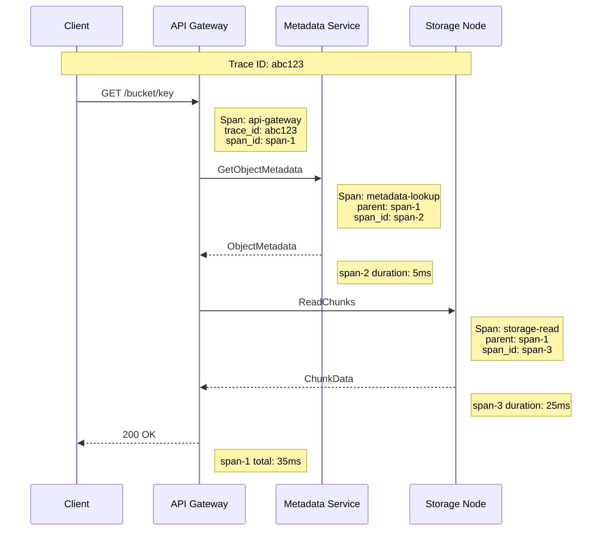

# Observability

[← Back to Index](./00-index.md)

---

## Metrics

### Key Performance Indicators

```
┌────────────────────────────────────────────────────────────────────┐
│ BLOB STORAGE KEY METRICS                                           │
├────────────────────────────────────────────────────────────────────┤
│                                                                     │
│ Request Metrics:                                                   │
│ ┌───────────────────────────────────────────────────────────────┐ │
│ │ Metric               │ Description          │ Target           │ │
│ │──────────────────────┼──────────────────────┼──────────────────│ │
│ │ request_count        │ Total requests/sec   │ Monitor trend    │ │
│ │ request_latency_p50  │ Median latency       │ < 50ms          │ │
│ │ request_latency_p99  │ 99th percentile      │ < 200ms         │ │
│ │ request_latency_p999 │ 99.9th percentile    │ < 1s            │ │
│ │ error_rate_4xx       │ Client errors        │ < 1%            │ │
│ │ error_rate_5xx       │ Server errors        │ < 0.1%          │ │
│ │ first_byte_latency   │ Time to first byte   │ < 100ms p99     │ │
│ └───────────────────────────────────────────────────────────────┘ │
│                                                                     │
│ Throughput Metrics:                                                │
│ ┌───────────────────────────────────────────────────────────────┐ │
│ │ Metric               │ Description          │ Target           │ │
│ │──────────────────────┼──────────────────────┼──────────────────│ │
│ │ bytes_downloaded     │ Egress bandwidth     │ Monitor capacity │ │
│ │ bytes_uploaded       │ Ingress bandwidth    │ Monitor capacity │ │
│ │ objects_created      │ New objects/sec      │ Monitor growth   │ │
│ │ objects_deleted      │ Deletions/sec        │ Monitor churn    │ │
│ │ multipart_in_flight  │ Active MPU uploads   │ < 10K           │ │
│ └───────────────────────────────────────────────────────────────┘ │
│                                                                     │
│ Storage Metrics:                                                   │
│ ┌───────────────────────────────────────────────────────────────┐ │
│ │ Metric               │ Description          │ Alert Threshold  │ │
│ │──────────────────────┼──────────────────────┼──────────────────│ │
│ │ total_storage_bytes  │ Total stored data    │ < 80% capacity  │ │
│ │ bucket_size_bytes    │ Per-bucket storage   │ Per quota       │ │
│ │ object_count         │ Number of objects    │ Monitor growth   │ │
│ │ storage_class_dist   │ Hot/warm/cold split  │ Cost monitoring  │ │
│ │ replication_lag_sec  │ Cross-region lag     │ < 300s          │ │
│ └───────────────────────────────────────────────────────────────┘ │
│                                                                     │
│ Durability Metrics:                                                │
│ ┌───────────────────────────────────────────────────────────────┐ │
│ │ Metric               │ Description          │ Alert Threshold  │ │
│ │──────────────────────┼──────────────────────┼──────────────────│ │
│ │ chunks_degraded      │ Below replication    │ > 0 = WARN      │ │
│ │ chunks_critical      │ At minimum for durability│ > 0 = CRITICAL│ │
│ │ repair_queue_size    │ Pending repairs      │ < 10K           │ │
│ │ repair_rate          │ Repairs/hour         │ > queue growth   │ │
│ │ checksum_failures    │ Data corruption      │ = 0             │ │
│ └───────────────────────────────────────────────────────────────┘ │
│                                                                     │
└────────────────────────────────────────────────────────────────────┘
```

### Prometheus Metrics Example

```yaml
# HELP blob_request_duration_seconds Request latency histogram
# TYPE blob_request_duration_seconds histogram
blob_request_duration_seconds_bucket{method="GET",status="200",le="0.05"} 15000
blob_request_duration_seconds_bucket{method="GET",status="200",le="0.1"} 18000
blob_request_duration_seconds_bucket{method="GET",status="200",le="0.25"} 19500
blob_request_duration_seconds_bucket{method="GET",status="200",le="0.5"} 19800
blob_request_duration_seconds_bucket{method="GET",status="200",le="1"} 19950
blob_request_duration_seconds_bucket{method="GET",status="200",le="+Inf"} 20000
blob_request_duration_seconds_sum{method="GET",status="200"} 1200.5
blob_request_duration_seconds_count{method="GET",status="200"} 20000

# HELP blob_request_total Total number of requests
# TYPE blob_request_total counter
blob_request_total{method="GET",status="200"} 5000000
blob_request_total{method="GET",status="404"} 50000
blob_request_total{method="PUT",status="200"} 500000
blob_request_total{method="PUT",status="403"} 1000

# HELP blob_bytes_transferred_total Total bytes transferred
# TYPE blob_bytes_transferred_total counter
blob_bytes_transferred_total{direction="download"} 50000000000000
blob_bytes_transferred_total{direction="upload"} 10000000000000

# HELP blob_storage_bytes Current storage usage
# TYPE blob_storage_bytes gauge
blob_storage_bytes{bucket="media",storage_class="STANDARD"} 500000000000
blob_storage_bytes{bucket="media",storage_class="IA"} 200000000000
blob_storage_bytes{bucket="logs",storage_class="GLACIER"} 1000000000000

# HELP blob_objects_total Total number of objects
# TYPE blob_objects_total gauge
blob_objects_total{bucket="media"} 10000000
blob_objects_total{bucket="logs"} 500000000

# HELP blob_durability_chunks_degraded Chunks with degraded durability
# TYPE blob_durability_chunks_degraded gauge
blob_durability_chunks_degraded 150

# HELP blob_durability_chunks_critical Chunks at critical durability level
# TYPE blob_durability_chunks_critical gauge
blob_durability_chunks_critical 0

# HELP blob_repair_queue_size Pending repair operations
# TYPE blob_repair_queue_size gauge
blob_repair_queue_size 5000

# HELP blob_node_status Storage node status
# TYPE blob_node_status gauge
blob_node_status{node="node-01",datacenter="us-east-1a"} 1
blob_node_status{node="node-02",datacenter="us-east-1a"} 1
blob_node_status{node="node-03",datacenter="us-east-1b"} 0  # Down
```

---

## Alerting

### Alert Configuration

```yaml
groups:
  - name: blob_storage_alerts
    rules:
      # Latency Alerts
      - alert: HighRequestLatency
        expr: |
          histogram_quantile(0.99,
            rate(blob_request_duration_seconds_bucket[5m])
          ) > 0.5
        for: 5m
        labels:
          severity: warning
        annotations:
          summary: "High p99 latency ({{ $value | humanizeDuration }})"
          description: "Request latency p99 is above 500ms for 5 minutes"

      - alert: CriticalRequestLatency
        expr: |
          histogram_quantile(0.99,
            rate(blob_request_duration_seconds_bucket[5m])
          ) > 2
        for: 5m
        labels:
          severity: critical
        annotations:
          summary: "Critical p99 latency ({{ $value | humanizeDuration }})"
          runbook: "https://wiki/runbooks/blob-storage/high-latency"

      # Error Rate Alerts
      - alert: High5xxErrorRate
        expr: |
          sum(rate(blob_request_total{status=~"5.."}[5m]))
          /
          sum(rate(blob_request_total[5m]))
          > 0.01
        for: 5m
        labels:
          severity: critical
        annotations:
          summary: "5xx error rate above 1% ({{ $value | humanizePercentage }})"
          runbook: "https://wiki/runbooks/blob-storage/high-error-rate"

      - alert: High4xxErrorRate
        expr: |
          sum(rate(blob_request_total{status=~"4.."}[5m]))
          /
          sum(rate(blob_request_total[5m]))
          > 0.05
        for: 10m
        labels:
          severity: warning
        annotations:
          summary: "4xx error rate above 5% ({{ $value | humanizePercentage }})"

      # Durability Alerts
      - alert: ChunksDegraded
        expr: blob_durability_chunks_degraded > 0
        for: 5m
        labels:
          severity: warning
        annotations:
          summary: "{{ $value }} chunks have degraded durability"
          description: "Chunks are below target replication factor"

      - alert: ChunksCritical
        expr: blob_durability_chunks_critical > 0
        for: 1m
        labels:
          severity: critical
          page: true
        annotations:
          summary: "CRITICAL: {{ $value }} chunks at durability limit"
          description: "Data loss risk - chunks at minimum for recovery"
          runbook: "https://wiki/runbooks/blob-storage/critical-durability"

      - alert: RepairQueueBacklog
        expr: |
          blob_repair_queue_size > 100000
          and
          rate(blob_repair_queue_size[1h]) > 0
        for: 30m
        labels:
          severity: warning
        annotations:
          summary: "Repair queue growing ({{ $value }} pending)"

      # Capacity Alerts
      - alert: StorageCapacityWarning
        expr: |
          blob_storage_bytes / blob_storage_capacity_bytes > 0.7
        for: 1h
        labels:
          severity: warning
        annotations:
          summary: "Storage at {{ $value | humanizePercentage }} capacity"

      - alert: StorageCapacityCritical
        expr: |
          blob_storage_bytes / blob_storage_capacity_bytes > 0.85
        for: 30m
        labels:
          severity: critical
        annotations:
          summary: "Storage at {{ $value | humanizePercentage }} - expand cluster"
          runbook: "https://wiki/runbooks/blob-storage/expand-capacity"

      # Node Health Alerts
      - alert: StorageNodeDown
        expr: blob_node_status == 0
        for: 5m
        labels:
          severity: warning
        annotations:
          summary: "Storage node {{ $labels.node }} is down"

      - alert: MultipleNodesDown
        expr: count(blob_node_status == 0) >= 2
        for: 5m
        labels:
          severity: critical
          page: true
        annotations:
          summary: "Multiple storage nodes down ({{ $value }} nodes)"
          runbook: "https://wiki/runbooks/blob-storage/multiple-node-failure"

      # Replication Alerts
      - alert: CrossRegionReplicationLag
        expr: blob_replication_lag_seconds > 600
        for: 15m
        labels:
          severity: warning
        annotations:
          summary: "Cross-region replication lag {{ $value | humanizeDuration }}"
```

### Alert Severity Levels

```
┌────────────────────────────────────────────────────────────────────┐
│ ALERT SEVERITY MATRIX                                              │
├────────────────────────────────────────────────────────────────────┤
│                                                                     │
│ CRITICAL (Page On-Call Immediately)                                │
│ ────────────────────────────────────                               │
│ • Any 5xx error rate > 1% for 5+ minutes                          │
│ • Chunks at critical durability level                              │
│ • Multiple storage nodes down                                      │
│ • Storage capacity > 90%                                           │
│ • Data corruption detected                                         │
│ • Metadata service unavailable                                     │
│                                                                     │
│ WARNING (Notify During Business Hours)                             │
│ ──────────────────────────────────────                             │
│ • p99 latency > 500ms sustained                                   │
│ • Single storage node down                                         │
│ • Chunks degraded (below target RF)                               │
│ • Storage capacity > 70%                                           │
│ • Repair queue growing                                             │
│ • Cross-region replication lag > 10 minutes                       │
│                                                                     │
│ INFO (Dashboard / Log Only)                                        │
│ ────────────────────────────                                       │
│ • Traffic spikes                                                   │
│ • Storage class transitions                                        │
│ • Lifecycle policy executions                                      │
│ • Successful repairs                                               │
│                                                                     │
└────────────────────────────────────────────────────────────────────┘
```

---

## Logging

### Structured Log Format

```json
{
  "timestamp": "2024-01-15T12:00:00.123Z",
  "level": "INFO",
  "service": "blob-api",
  "instance": "api-node-01",
  "trace_id": "abc123def456",
  "span_id": "789ghi",
  "event": "request_completed",
  "request": {
    "method": "GET",
    "bucket": "my-bucket",
    "key": "photos/image.jpg",
    "version_id": "v123",
    "client_ip": "192.0.2.1",
    "user_agent": "aws-sdk-java/2.20.0"
  },
  "response": {
    "status": 200,
    "bytes": 1048576,
    "duration_ms": 45
  },
  "auth": {
    "method": "signature_v4",
    "principal": "arn:aws:iam::123456789012:user/alice",
    "access_key_id": "AKIA..."
  },
  "storage": {
    "node": "storage-node-05",
    "chunks_read": 1,
    "cache_hit": true
  }
}
```

### Log Categories

```
┌────────────────────────────────────────────────────────────────────┐
│ LOG CATEGORIES                                                     │
├────────────────────────────────────────────────────────────────────┤
│                                                                     │
│ 1. ACCESS LOGS                                                     │
│    ─────────────                                                   │
│    Every API request (GET, PUT, DELETE, LIST)                     │
│    Retention: 90 days (hot), 1 year (cold)                        │
│    Use: Security audit, billing, debugging                         │
│                                                                     │
│    Fields: timestamp, method, bucket, key, status, bytes,         │
│            latency, client_ip, user_agent, principal              │
│                                                                     │
│ 2. AUDIT LOGS                                                      │
│    ──────────────                                                  │
│    Administrative operations and policy changes                    │
│    Retention: 7 years (compliance)                                 │
│    Use: Compliance, security investigation                         │
│                                                                     │
│    Events: bucket_created, bucket_deleted, policy_changed,        │
│            encryption_config_changed, acl_changed                 │
│                                                                     │
│ 3. OPERATIONAL LOGS                                                │
│    ───────────────────                                             │
│    Internal service operations                                     │
│    Retention: 30 days                                              │
│    Use: Debugging, performance analysis                            │
│                                                                     │
│    Events: node_joined, node_failed, repair_started,              │
│            repair_completed, compaction_started                   │
│                                                                     │
│ 4. ERROR LOGS                                                      │
│    ────────────                                                    │
│    All errors with full context                                    │
│    Retention: 90 days                                              │
│    Use: Incident response, debugging                               │
│                                                                     │
│    Fields: error_code, error_message, stack_trace, request_id,    │
│            correlation_id, context                                │
│                                                                     │
└────────────────────────────────────────────────────────────────────┘
```

---

## Distributed Tracing

### Trace Flow



### OpenTelemetry Instrumentation

```python
from opentelemetry import trace
from opentelemetry.trace import Status, StatusCode

tracer = trace.get_tracer("blob-storage")

async def get_object(bucket: str, key: str) -> bytes:
    with tracer.start_as_current_span(
        "get_object",
        attributes={
            "blob.bucket": bucket,
            "blob.key": key,
            "blob.operation": "GET"
        }
    ) as span:
        try:
            # Metadata lookup
            with tracer.start_as_current_span("metadata_lookup") as meta_span:
                metadata = await metadata_service.get(bucket, key)
                meta_span.set_attribute("blob.object_size", metadata.size)
                meta_span.set_attribute("blob.chunk_count", len(metadata.chunks))

            # Storage read
            with tracer.start_as_current_span("storage_read") as storage_span:
                chunks = []
                for chunk_info in metadata.chunks:
                    with tracer.start_as_current_span(
                        "read_chunk",
                        attributes={
                            "blob.chunk_id": chunk_info.id,
                            "blob.storage_node": chunk_info.node
                        }
                    ):
                        chunk_data = await storage.read_chunk(chunk_info)
                        chunks.append(chunk_data)

                storage_span.set_attribute("blob.chunks_read", len(chunks))

            # Assemble response
            data = b''.join(chunks)
            span.set_attribute("blob.response_bytes", len(data))
            span.set_status(Status(StatusCode.OK))
            return data

        except ObjectNotFoundError:
            span.set_status(Status(StatusCode.ERROR, "Object not found"))
            raise
        except Exception as e:
            span.set_status(Status(StatusCode.ERROR, str(e)))
            span.record_exception(e)
            raise
```

---

## Dashboards

### System Overview Dashboard

```
┌────────────────────────────────────────────────────────────────────┐
│ BLOB STORAGE - SYSTEM OVERVIEW                                     │
├────────────────────────────────────────────────────────────────────┤
│                                                                     │
│  ┌─────────────────┐  ┌─────────────────┐  ┌─────────────────┐    │
│  │ REQUESTS/SEC    │  │ ERROR RATE      │  │ P99 LATENCY     │    │
│  │    125,432      │  │    0.02%        │  │    45ms         │    │
│  │    ▲ +5%        │  │    ✓ Normal     │  │    ✓ Normal     │    │
│  └─────────────────┘  └─────────────────┘  └─────────────────┘    │
│                                                                     │
│  ┌─────────────────┐  ┌─────────────────┐  ┌─────────────────┐    │
│  │ STORAGE USED    │  │ OBJECTS         │  │ DURABILITY      │    │
│  │    850 TB       │  │    12.5B        │  │    11 nines     │    │
│  │    68% capacity │  │    +1M/day      │  │    ✓ Healthy    │    │
│  └─────────────────┘  └─────────────────┘  └─────────────────┘    │
│                                                                     │
│  ┌────────────────────────────────────────────────────────────┐   │
│  │ REQUEST RATE (Last 24 Hours)                                │   │
│  │                                                              │   │
│  │  150K ┤                         ╭───╮                       │   │
│  │  100K ┤    ╭───────────────────╯   ╰───────────────╮       │   │
│  │   50K ┤───╯                                        ╰───    │   │
│  │     0 ┼────┬────┬────┬────┬────┬────┬────┬────┬────┬───    │   │
│  │       00   03   06   09   12   15   18   21   24           │   │
│  └────────────────────────────────────────────────────────────┘   │
│                                                                     │
│  ┌───────────────────────────┐  ┌───────────────────────────┐     │
│  │ LATENCY DISTRIBUTION      │  │ ERROR BREAKDOWN           │     │
│  │                           │  │                           │     │
│  │ p50:  12ms   █████████░░ │  │ 404: 65% ████████████░░░ │     │
│  │ p90:  28ms   ███████████ │  │ 403: 20% █████░░░░░░░░░░ │     │
│  │ p99:  45ms   ████████████│  │ 500:  5% █░░░░░░░░░░░░░░ │     │
│  │ p999: 120ms  ████████████│  │ 503: 10% ███░░░░░░░░░░░░ │     │
│  └───────────────────────────┘  └───────────────────────────┘     │
│                                                                     │
└────────────────────────────────────────────────────────────────────┘
```

### Storage Node Dashboard

```
┌────────────────────────────────────────────────────────────────────┐
│ BLOB STORAGE - STORAGE NODES                                       │
├────────────────────────────────────────────────────────────────────┤
│                                                                     │
│  Node Status:                                                       │
│  ┌────────────────────────────────────────────────────────────┐   │
│  │ Node       │ Status │ Capacity │ CPU  │ Network │ Disk I/O │   │
│  │────────────┼────────┼──────────┼──────┼─────────┼──────────│   │
│  │ node-01    │ ✓ UP   │ 72%      │ 45%  │ 8 Gbps  │ 150 MB/s │   │
│  │ node-02    │ ✓ UP   │ 68%      │ 42%  │ 7 Gbps  │ 145 MB/s │   │
│  │ node-03    │ ✓ UP   │ 75%      │ 48%  │ 9 Gbps  │ 160 MB/s │   │
│  │ node-04    │ ⚠ WARN │ 85%      │ 62%  │ 12 Gbps │ 180 MB/s │   │
│  │ node-05    │ ✗ DOWN │ --       │ --   │ --      │ --       │   │
│  │ node-06    │ ✓ UP   │ 65%      │ 38%  │ 6 Gbps  │ 130 MB/s │   │
│  └────────────────────────────────────────────────────────────┘   │
│                                                                     │
│  Durability Status:                                                │
│  ┌────────────────────────────────────────────────────────────┐   │
│  │ Total Chunks:     500,000,000                               │   │
│  │ Healthy:          499,995,000 (99.999%)                    │   │
│  │ Degraded:              4,850 (repair in progress)          │   │
│  │ Critical:                  0 ✓                              │   │
│  │                                                             │   │
│  │ Repair Queue:          4,850                                │   │
│  │ Repair Rate:         500/min                                │   │
│  │ ETA:                 10 minutes                             │   │
│  └────────────────────────────────────────────────────────────┘   │
│                                                                     │
└────────────────────────────────────────────────────────────────────┘
```

### Per-Bucket Dashboard

```
┌────────────────────────────────────────────────────────────────────┐
│ BLOB STORAGE - BUCKET: media-assets                                │
├────────────────────────────────────────────────────────────────────┤
│                                                                     │
│  Bucket Summary:                                                    │
│  ┌────────────────────────────────────────────────────────────┐   │
│  │ Objects:        10,500,000                                  │   │
│  │ Total Size:     250 TB                                      │   │
│  │ Avg Object:     25 MB                                       │   │
│  │ Versioning:     Enabled                                     │   │
│  │ Encryption:     SSE-KMS                                     │   │
│  └────────────────────────────────────────────────────────────┘   │
│                                                                     │
│  Traffic (Last 24 Hours):                                          │
│  ┌────────────────────────────────────────────────────────────┐   │
│  │ GET Requests:   2,500,000                                   │   │
│  │ PUT Requests:   150,000                                     │   │
│  │ DELETE:         10,000                                      │   │
│  │ LIST:           50,000                                      │   │
│  │                                                             │   │
│  │ Download:       5.2 TB                                      │   │
│  │ Upload:         1.1 TB                                      │   │
│  └────────────────────────────────────────────────────────────┘   │
│                                                                     │
│  Storage Class Distribution:                                       │
│  ┌────────────────────────────────────────────────────────────┐   │
│  │ STANDARD:     150 TB (60%)  ████████████████████░░░░░░░░  │   │
│  │ IA:           75 TB  (30%)  ██████████░░░░░░░░░░░░░░░░░░  │   │
│  │ GLACIER:      25 TB  (10%)  ███░░░░░░░░░░░░░░░░░░░░░░░░░  │   │
│  └────────────────────────────────────────────────────────────┘   │
│                                                                     │
│  Top Accessed Objects:                                             │
│  ┌────────────────────────────────────────────────────────────┐   │
│  │ 1. /images/logo.png              250,000 requests         │   │
│  │ 2. /videos/intro.mp4             180,000 requests         │   │
│  │ 3. /assets/main.js               150,000 requests         │   │
│  │ 4. /images/banner.jpg            120,000 requests         │   │
│  │ 5. /docs/manual.pdf              85,000 requests          │   │
│  └────────────────────────────────────────────────────────────┘   │
│                                                                     │
└────────────────────────────────────────────────────────────────────┘
```

---

## Operational Runbooks

### Runbook: High Latency

```
┌────────────────────────────────────────────────────────────────────┐
│ RUNBOOK: HIGH REQUEST LATENCY                                      │
├────────────────────────────────────────────────────────────────────┤
│                                                                     │
│ Alert: HighRequestLatency (p99 > 500ms for 5+ minutes)            │
│                                                                     │
│ Step 1: Identify Scope                                             │
│ ┌─────────────────────────────────────────────────────────────┐   │
│ │ □ Check if global or specific region/bucket                  │   │
│ │   Query: blob_request_duration by region, bucket             │   │
│ │                                                              │   │
│ │ □ Check which operation types affected                       │   │
│ │   Query: blob_request_duration by method (GET/PUT/LIST)      │   │
│ │                                                              │   │
│ │ □ Check time correlation with deployments/changes            │   │
│ │   Query: deployment events in last 1 hour                    │   │
│ └─────────────────────────────────────────────────────────────┘   │
│                                                                     │
│ Step 2: Check Infrastructure                                       │
│ ┌─────────────────────────────────────────────────────────────┐   │
│ │ □ Storage node health                                        │   │
│ │   - Any nodes down or degraded?                             │   │
│ │   - Disk I/O saturation?                                    │   │
│ │   - Network bandwidth exhausted?                            │   │
│ │                                                              │   │
│ │ □ Metadata service health                                    │   │
│ │   - Database CPU/memory?                                    │   │
│ │   - Query latency?                                          │   │
│ │   - Connection pool exhaustion?                             │   │
│ │                                                              │   │
│ │ □ API gateway health                                         │   │
│ │   - CPU utilization?                                        │   │
│ │   - Thread pool exhaustion?                                 │   │
│ └─────────────────────────────────────────────────────────────┘   │
│                                                                     │
│ Step 3: Common Causes and Fixes                                    │
│ ┌─────────────────────────────────────────────────────────────┐   │
│ │ Cause: Hot bucket/key                                        │   │
│ │ Fix: Identify key, add to CDN cache, spread load             │   │
│ │                                                              │   │
│ │ Cause: Metadata service overloaded                           │   │
│ │ Fix: Add read replicas, scale up, check slow queries         │   │
│ │                                                              │   │
│ │ Cause: Storage node disk I/O saturated                       │   │
│ │ Fix: Rebalance data, add nodes, check repair traffic         │   │
│ │                                                              │   │
│ │ Cause: Network congestion                                    │   │
│ │ Fix: Rate limit repair traffic, add network capacity        │   │
│ └─────────────────────────────────────────────────────────────┘   │
│                                                                     │
│ Step 4: Escalation                                                 │
│ ┌─────────────────────────────────────────────────────────────┐   │
│ │ If not resolved in 15 minutes:                               │   │
│ │   - Page storage team lead                                   │   │
│ │   - Open incident channel                                    │   │
│ │   - Consider partial traffic shed if degraded                │   │
│ └─────────────────────────────────────────────────────────────┘   │
│                                                                     │
└────────────────────────────────────────────────────────────────────┘
```

### Runbook: Storage Node Failure

```
┌────────────────────────────────────────────────────────────────────┐
│ RUNBOOK: STORAGE NODE FAILURE                                      │
├────────────────────────────────────────────────────────────────────┤
│                                                                     │
│ Alert: StorageNodeDown (node-05 heartbeat missed for 5 minutes)   │
│                                                                     │
│ Step 1: Assess Impact                                              │
│ ┌─────────────────────────────────────────────────────────────┐   │
│ │ □ How many nodes down? (1 = warning, 2+ = critical)         │   │
│ │ □ Check durability status - any chunks critical?            │   │
│ │ □ Check if node is in multiple failure domains              │   │
│ └─────────────────────────────────────────────────────────────┘   │
│                                                                     │
│ Step 2: Confirm Node Status                                        │
│ ┌─────────────────────────────────────────────────────────────┐   │
│ │ □ SSH to node (if reachable):                               │   │
│ │     ssh admin@node-05                                        │   │
│ │     systemctl status blob-storage                            │   │
│ │     dmesg | tail -50  # Check for hardware errors           │   │
│ │                                                              │   │
│ │ □ Check cloud console:                                       │   │
│ │     - Instance status checks                                 │   │
│ │     - Recent reboots/terminations                           │   │
│ │     - Scheduled maintenance                                  │   │
│ └─────────────────────────────────────────────────────────────┘   │
│                                                                     │
│ Step 3: Recovery Actions                                           │
│ ┌─────────────────────────────────────────────────────────────┐   │
│ │ IF recoverable (process crashed, network blip):             │   │
│ │   □ Restart service: systemctl restart blob-storage         │   │
│ │   □ Verify node rejoins cluster                             │   │
│ │   □ Monitor for recurring issues                            │   │
│ │                                                              │   │
│ │ IF hardware failure (disk, network):                        │   │
│ │   □ Mark node as permanently failed                         │   │
│ │   □ Ensure repair process is running                        │   │
│ │   □ Provision replacement node                              │   │
│ │   □ Do NOT attempt data recovery from failed disks          │   │
│ │       (erasure coding handles this)                         │   │
│ └─────────────────────────────────────────────────────────────┘   │
│                                                                     │
│ Step 4: Verify Recovery                                            │
│ ┌─────────────────────────────────────────────────────────────┐   │
│ │ □ Repair queue processing (should be decreasing)            │   │
│ │ □ No critical durability chunks                              │   │
│ │ □ Request latency back to normal                            │   │
│ │ □ Close incident after 30 min stability                     │   │
│ └─────────────────────────────────────────────────────────────┘   │
│                                                                     │
└────────────────────────────────────────────────────────────────────┘
```
