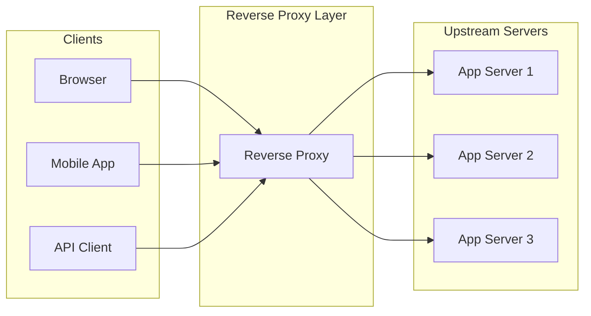
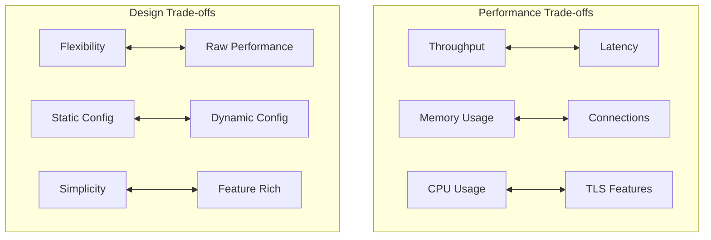

# High-Performance Reverse Proxy / Web Server

## System Design Document

| Attribute | Value |
|-----------|-------|
| **Complexity** | High |
| **Category** | Core Infrastructure |
| **Prerequisites** | TCP/IP networking, Event-driven architecture, TLS/SSL basics |
| **Related Topics** | Load Balancer (1.2), CDN (1.15), API Gateway (1.14), Service Mesh (2.11) |

---

## Quick Navigation

| Document | Description |
|----------|-------------|
| [01 - Requirements & Estimations](./01-requirements-and-estimations.md) | Functional/non-functional requirements, capacity planning |
| [02 - High-Level Design](./02-high-level-design.md) | Architecture diagrams, data flow, key decisions |
| [03 - Low-Level Design](./03-low-level-design.md) | Data structures, APIs, core algorithms |
| [04 - Deep Dive & Bottlenecks](./04-deep-dive-and-bottlenecks.md) | Event loops, connection pooling, TLS termination |
| [05 - Scalability & Reliability](./05-scalability-and-reliability.md) | Horizontal/vertical scaling, fault tolerance |
| [06 - Security & Compliance](./06-security-and-compliance.md) | TLS security, DDoS mitigation, threat model |
| [07 - Observability](./07-observability.md) | Metrics, logging, tracing, alerting |
| [08 - Interview Guide](./08-interview-guide.md) | 45-min pacing, trap questions, quick reference |

---

## System Overview

A **High-Performance Reverse Proxy** sits between clients and backend servers, handling connection management, request routing, load distribution, and protocol termination at massive scale. Unlike application servers, reverse proxies are optimized for handling tens of thousands to millions of concurrent connections with minimal resource consumption.

---

## Proxy Types Comparison

| Type | Direction | Use Case | Example |
|------|-----------|----------|---------|
| **Forward Proxy** | Client → Proxy → Internet | Client anonymity, content filtering | Corporate proxy, VPN |
| **Reverse Proxy** | Internet → Proxy → Server | Load balancing, SSL termination, caching | Web server front-end |
| **Transparent Proxy** | Invisible interception | Network monitoring, content filtering | ISP caching |
| **API Gateway** | Specialized reverse proxy | API management, auth, rate limiting | Service front-end |

---

## Key Characteristics

| Characteristic | Challenge | Why It Matters |
|----------------|-----------|----------------|
| **Connection-Heavy** | 100K+ concurrent connections per worker | Memory efficiency critical |
| **Latency-Sensitive** | Sub-millisecond proxy overhead | Cannot introduce noticeable delay |
| **CPU-Bound for TLS** | Handshake computation | TLS at scale is expensive |
| **I/O-Bound** | Network packet forwarding | Event-driven beats threading |
| **Memory-Bound** | Per-connection state, buffers | Must minimize per-connection overhead |

---

## Architecture Comparison Matrix

| Aspect | NGINX | HAProxy | Envoy | Pingora |
|--------|-------|---------|-------|---------|
| **Language** | C | C | C++ | Rust |
| **Architecture** | Event-driven, multi-process | Event-driven, multi-threaded | Event-driven, multi-threaded | Event-driven, multi-threaded |
| **Workers** | Single-threaded per worker | Multi-threaded | Multi-threaded | Multi-threaded with work-stealing |
| **Configuration** | Static file, reload | Static file, runtime API | Dynamic (xDS) | Programmatic + config |
| **L4/L7** | Both | Both | Both | Both |
| **HTTP/2** | Full | Full | Full | Full |
| **HTTP/3 (QUIC)** | Experimental | Experimental | Full | Full |
| **Memory Safety** | Manual | Manual | Manual | Rust guarantees |
| **Extensibility** | Lua, C modules | Lua | WASM, C++ | Rust code |
| **Control Plane** | None built-in | Runtime API | xDS (Istio, etc.) | Custom |
| **Best For** | Web serving, simple proxying | High-performance TCP/HTTP LB | Service mesh, dynamic config | Memory-safe high performance |

---

## Real-World Implementations

| Company | Implementation | Key Innovation |
|---------|---------------|----------------|
| **Cloudflare** | Pingora (Rust) | 70% less CPU, 79% less memory vs NGINX, memory-safe |
| **Cloudflare** | FL2 Migration | 25% performance improvement at edge |
| **Netflix** | Zuul 2 | Non-blocking, filter-based, service discovery integration |
| **Lyft/CNCF** | Envoy | xDS dynamic configuration, observability-first |
| **Kong** | Kong Gateway | Plugin architecture on NGINX |
| **Traefik Labs** | Traefik | Auto-discovery, cloud-native routing |
| **Shopify** | Custom Rust proxy | Memory-safe edge proxy |

---

## Key Trade-offs

### Trade-off Analysis

| Trade-off | Option A | Option B | Decision Factors |
|-----------|----------|----------|------------------|
| **Threading Model** | Single-threaded workers | Multi-threaded workers | Core count, lock contention |
| **Buffering** | Full request buffering | Streaming | Memory vs latency |
| **Connection Pooling** | Per-upstream pools | Global pools | Fairness vs efficiency |
| **Configuration** | Static reload | Dynamic xDS | Operational complexity |
| **Protocol Support** | HTTP/1.1 only | HTTP/1.1+2+3 | Implementation complexity |

---

## Why This Design Matters

1. **Scale**: A single reverse proxy can handle 100K+ connections per worker
2. **Efficiency**: Event-driven architecture uses 1/100th the memory of thread-per-connection
3. **Reliability**: Upstream health checking and circuit breaking prevent cascade failures
4. **Security**: Centralized TLS termination and request validation
5. **Observability**: Single point for metrics, logging, and tracing injection

---

## Core Concepts Overview

### Event-Driven Architecture

Traditional web servers create a thread per connection. At 10,000 connections, that's 10,000 threads with ~1MB stack each = 10GB just for stacks. Event-driven proxies handle all connections in a single thread using non-blocking I/O, reducing memory to kilobytes per connection.

### Connection Pooling

Instead of creating a new TCP connection to upstream for every request, proxies maintain persistent connection pools. This eliminates TCP handshake overhead (~1ms) and TLS handshake overhead (~10-50ms) for most requests.

### TLS Termination

Clients connect via HTTPS to the proxy, which decrypts the traffic and forwards plain HTTP to upstream servers. This centralizes certificate management and offloads CPU-intensive crypto from application servers.

---

## When to Use a Reverse Proxy

| Scenario | Benefit |
|----------|---------|
| **Load Distribution** | Spread traffic across multiple backends |
| **SSL Offloading** | Centralize TLS termination |
| **Request Routing** | Route based on path, headers, etc. |
| **Caching** | Cache static content at the edge |
| **Compression** | Compress responses centrally |
| **Request/Response Modification** | Add headers, rewrite URLs |
| **Connection Management** | Handle slow clients, connection limits |
| **Health Checking** | Detect and route around failures |

---

## Complexity Rating Breakdown

| Area | Complexity | Reason |
|------|------------|--------|
| **Event Loop** | High | OS-specific APIs, non-blocking I/O |
| **Connection Management** | High | State machines, timeouts, cleanup |
| **TLS Implementation** | High | Crypto, certificate handling, performance |
| **Upstream Pooling** | Medium | Connection lifecycle, health tracking |
| **Load Balancing** | Medium | Algorithms, weight management |
| **Configuration** | Medium-High | Hot reload, validation, dynamic updates |
| **Observability** | Medium | Metrics, logging, trace propagation |

---

## Document Reading Order

### For Interview Prep (Time-Limited)
1. This index (overview)
2. [02 - High-Level Design](./02-high-level-design.md) (architecture)
3. [08 - Interview Guide](./08-interview-guide.md) (pacing, questions)

### For Deep Understanding
1. All documents in order (00 → 08)
2. Focus on [04 - Deep Dive](./04-deep-dive-and-bottlenecks.md) for internals
3. Study [03 - Low-Level Design](./03-low-level-design.md) for algorithms

### For Production Design
1. [01 - Requirements](./01-requirements-and-estimations.md) (capacity planning)
2. [05 - Scalability](./05-scalability-and-reliability.md) (production concerns)
3. [06 - Security](./06-security-and-compliance.md) (hardening)
4. [07 - Observability](./07-observability.md) (monitoring)

---

## Further Reading

- NGINX Architecture Guide (nginx.org)
- HAProxy Documentation (haproxy.org)
- Envoy Architecture Overview (envoyproxy.io)
- Cloudflare Pingora Blog Posts
- "High Performance Browser Networking" by Ilya Grigorik
