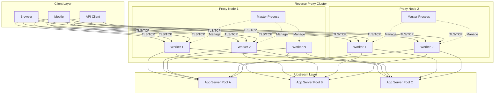
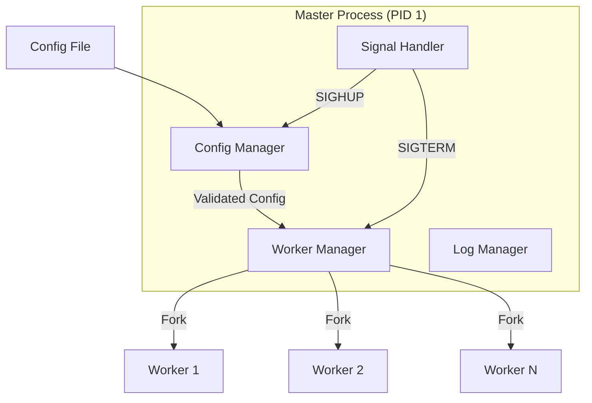
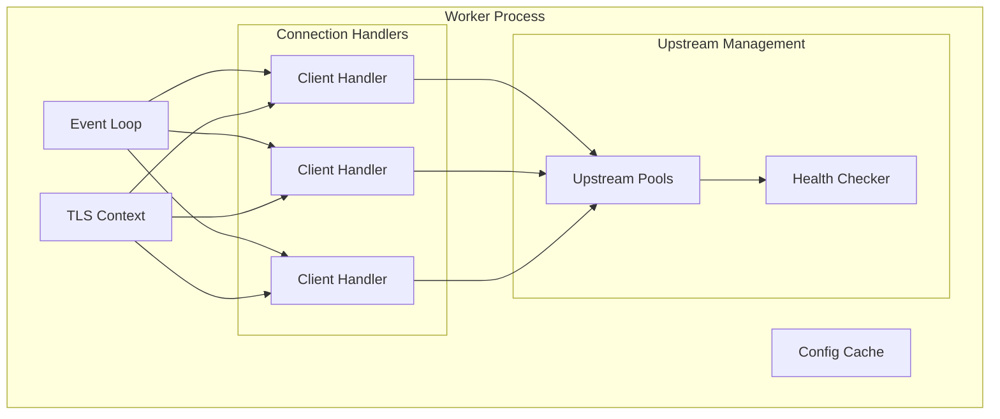
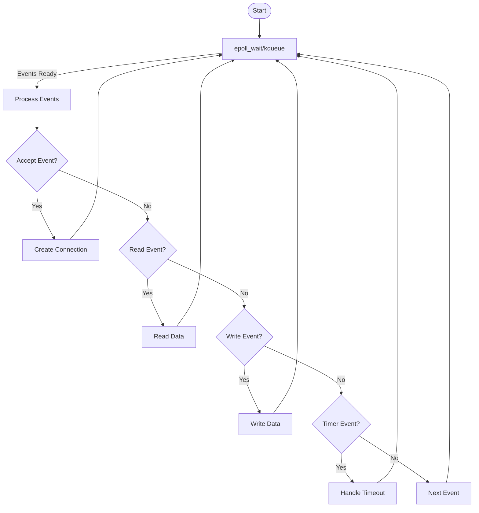
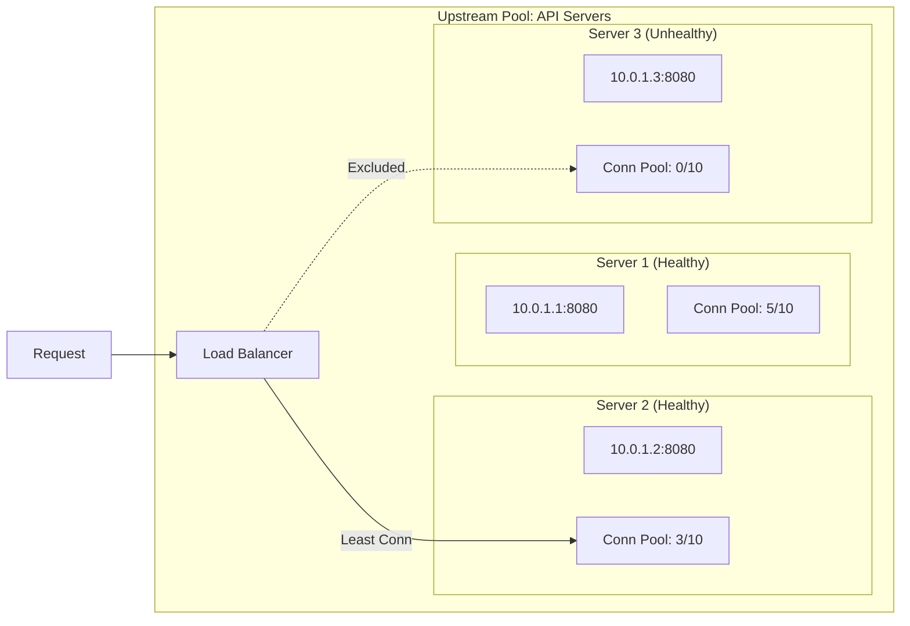
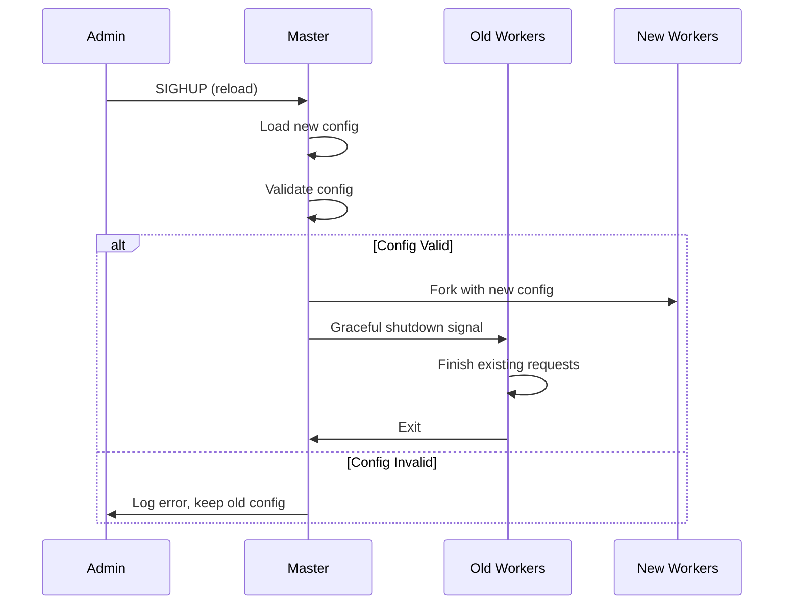
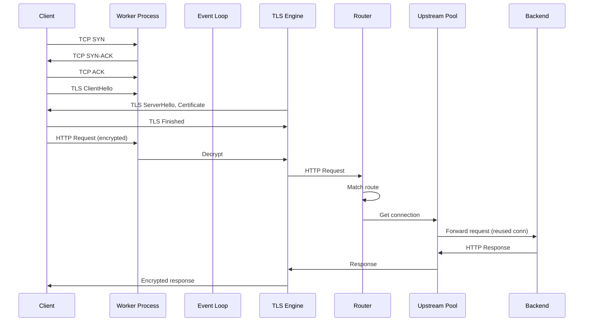
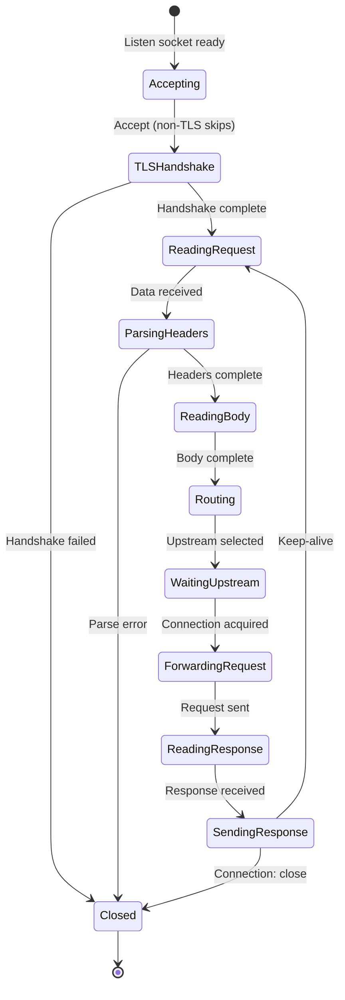
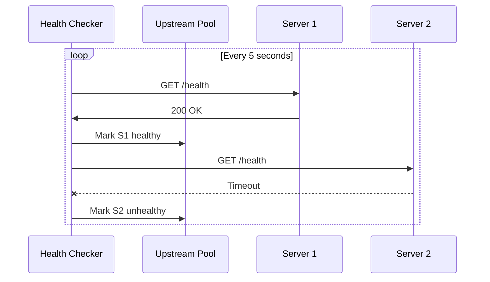
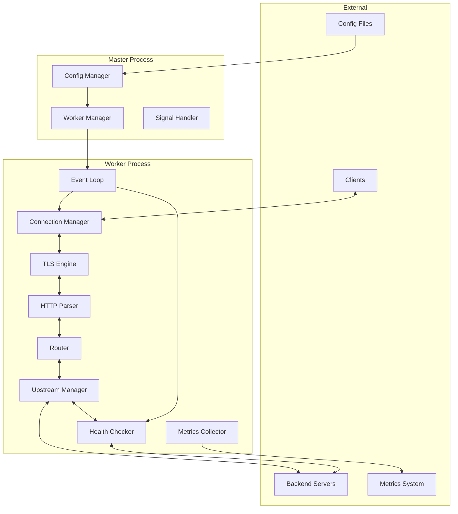

# High-Level Design

## Table of Contents
- [Architecture Overview](#architecture-overview)
- [Core Components](#core-components)
- [Data Flow](#data-flow)
- [Key Design Decisions](#key-design-decisions)
- [Communication Patterns](#communication-patterns)

---

## Architecture Overview



---

## Core Components

### 1. Master Process

The master process is the parent process responsible for orchestration, not request handling.

**Responsibilities:**
- Configuration loading and validation
- Worker process lifecycle management
- Signal handling (SIGHUP for reload, SIGTERM for shutdown)
- Privileged operations (binding to ports < 1024)
- Log file management



### 2. Worker Process

Workers handle actual client connections and request processing. Each worker is independent.

**Responsibilities:**
- Accept new connections (shared listen socket)
- Event loop for I/O multiplexing
- TLS handshake and termination
- Request parsing and routing
- Upstream connection management
- Response forwarding



### 3. Event Loop

The heart of the worker process - handles all I/O operations without blocking.

**Key Operations:**
- `epoll_wait()` / `kqueue()` for event notification
- Non-blocking accept for new connections
- Non-blocking read/write for data transfer
- Timer management for timeouts



### 4. Connection Manager

Manages the lifecycle of both client and upstream connections.

**Client Connections:**
- Accept and TLS handshake
- Keep-alive management
- Request parsing
- Timeout enforcement

**Upstream Connections:**
- Connection pooling per upstream
- Health status tracking
- Keep-alive and reuse
- Load balancer integration

### 5. Upstream Pool

Manages connections to a group of backend servers.



### 6. Configuration System

Handles configuration loading, validation, and hot reload.



---

## Data Flow

### Request Flow (Happy Path)



### Connection State Machine



---

## Key Design Decisions

### Decision 1: Event-Driven vs Thread-per-Connection

| Approach | Pros | Cons |
|----------|------|------|
| **Thread-per-Connection** | Simple programming model, blocking I/O | High memory (1MB stack/thread), context switch overhead |
| **Event-Driven** | Low memory (~10KB/conn), no context switches | Complex state machines, callback complexity |

**Decision: Event-Driven**

**Rationale:**
- At 100K connections, thread-per-connection needs ~100GB for stacks alone
- Context switching 100K threads causes severe CPU overhead
- Event-driven handles 100K+ connections with minimal resources

### Decision 2: Multi-Process vs Multi-Threaded Workers

| Approach | Pros | Cons |
|----------|------|------|
| **Multi-Process (NGINX style)** | Process isolation, simpler debugging, no locks | Memory overhead, IPC needed for shared state |
| **Multi-Threaded (HAProxy style)** | Shared memory, lower overhead | Lock contention, harder debugging |

**Decision: Multi-Process with Optional Threading**

**Rationale:**
- Process isolation prevents one bad request from crashing all workers
- Modern approach: multi-threaded workers (HAProxy, Envoy) with careful locking
- Choose based on your operational preference

### Decision 3: Buffering vs Streaming

| Approach | Pros | Cons |
|----------|------|------|
| **Full Buffering** | Simpler retry logic, protects upstream from slow clients | Memory usage, latency for large bodies |
| **Streaming** | Low latency, constant memory | Can't retry, upstream exposed to slow clients |

**Decision: Configurable per route**

**Rationale:**
- Small requests (< 1MB): Buffer for retry capability
- Large uploads/downloads: Stream to minimize memory and latency
- WebSocket: Always streaming

### Decision 4: Connection Pooling Strategy

| Approach | Pros | Cons |
|----------|------|------|
| **Per-Worker Pools** | No locking, simple | Uneven distribution, more total connections |
| **Shared Pool (multi-threaded)** | Efficient resource use | Lock contention |
| **No Pooling** | Simplest | TLS handshake overhead, TCP slow start |

**Decision: Per-Worker Pools**

**Rationale:**
- Avoids cross-worker locking
- Each worker maintains connections to all upstreams
- Worker count × Pool size = Total connections to upstream

### Decision 5: Configuration Reload Strategy

| Approach | Pros | Cons |
|----------|------|------|
| **Full Restart** | Clean slate | Drops connections |
| **Graceful Restart (new workers)** | No dropped connections | Brief resource spike |
| **In-Place Reload** | Fastest, no new processes | Complex, risky |

**Decision: Graceful Restart**

**Rationale:**
- New workers created with new config
- Old workers finish existing requests then exit
- No connections dropped during reload

---

## Communication Patterns

### Client-to-Proxy Communication

```
Client                         Proxy
   |                             |
   |---- TCP Handshake --------->|
   |<--- TCP Handshake ----------|
   |                             |
   |---- TLS ClientHello ------->|
   |<--- TLS ServerHello --------|
   |<--- Certificate ------------|
   |---- TLS Finished ---------->|
   |<--- TLS Finished -----------|
   |                             |
   |==== Encrypted Channel ======|
   |                             |
   |---- HTTP Request ---------->|
   |<--- HTTP Response ----------|
   |                             |
   |---- HTTP Request 2 -------->|  (keep-alive reuse)
   |<--- HTTP Response 2 --------|
```

### Proxy-to-Upstream Communication

```
Proxy                          Upstream
   |                              |
   |-- Get pooled connection ---->|
   |                              |
   |---- HTTP Request ----------->|
   |<--- HTTP Response -----------|
   |                              |
   |-- Return conn to pool ------>|
   |                              |
   (Connection kept alive for reuse)
```

### Health Check Flow



---

## Component Interaction Diagram



---

## System Boundaries

### What the Reverse Proxy Handles

| Responsibility | Details |
|----------------|---------|
| Connection termination | TCP, TLS from clients |
| Protocol translation | HTTP/1.1 ↔ HTTP/2 |
| Request routing | Host, path, header-based |
| Load balancing | Algorithm-based server selection |
| Health checking | Upstream availability |
| Request forwarding | To upstream servers |
| Response forwarding | To clients |

### What the Reverse Proxy Does NOT Handle

| Responsibility | Where It Belongs |
|----------------|------------------|
| Business logic | Application servers |
| Database queries | Backend services |
| User authentication | Auth service (can integrate) |
| Rate limiting | Dedicated rate limiter (can integrate) |
| Long-term caching | Dedicated cache layer |
| DNS resolution | DNS infrastructure |
