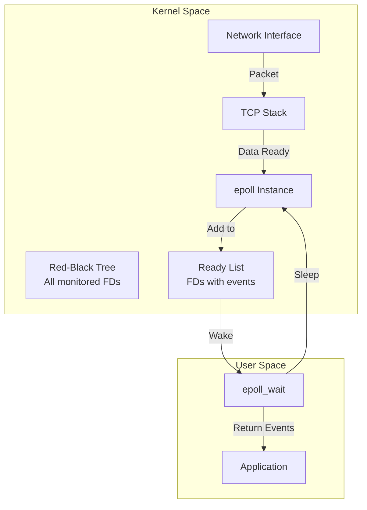
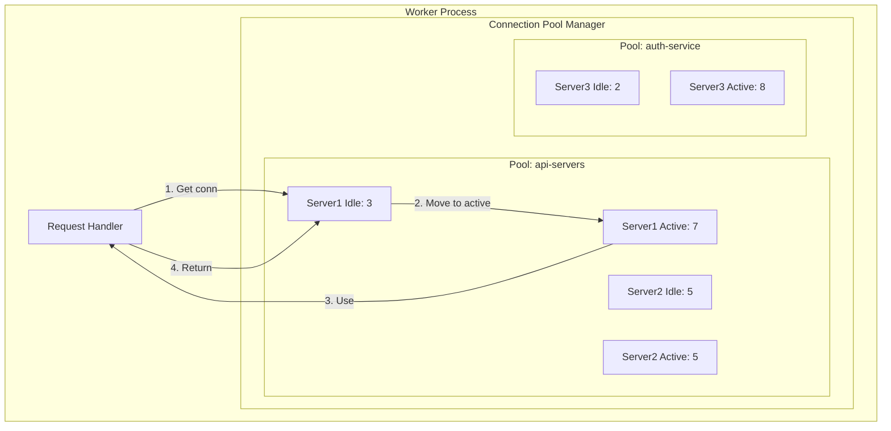
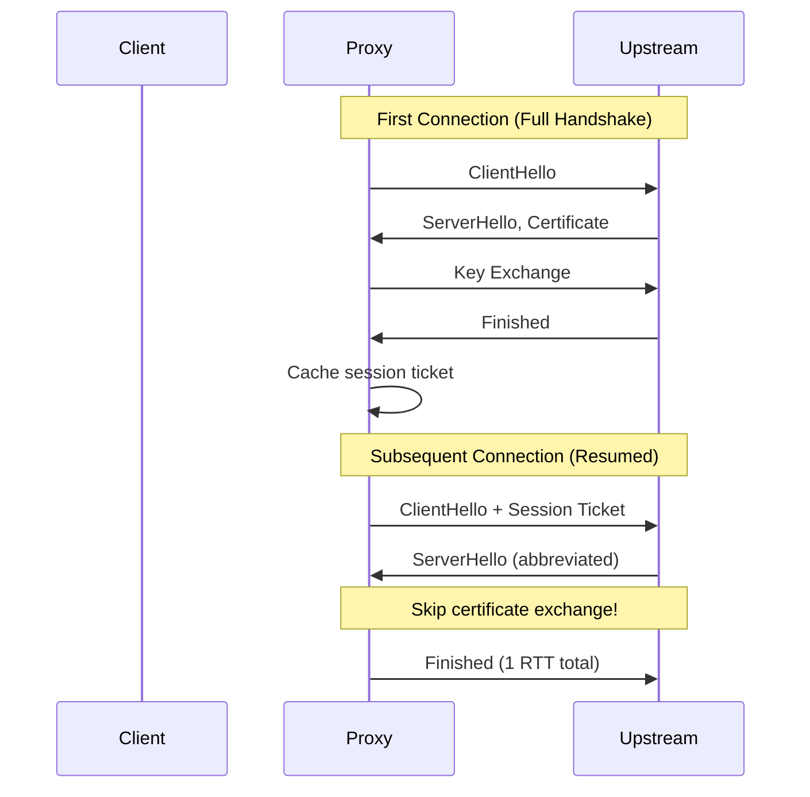
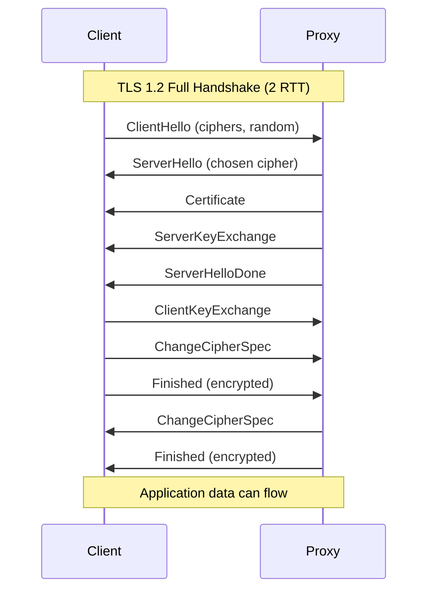
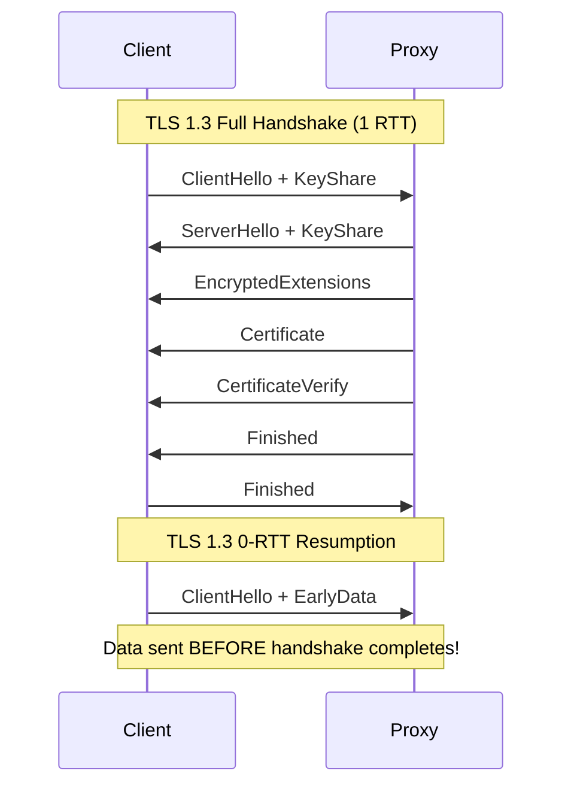

# Deep Dive and Bottlenecks

## Table of Contents
- [Critical Component 1: Event Loop Architecture](#critical-component-1-event-loop-architecture)
- [Critical Component 2: Connection Pooling](#critical-component-2-connection-pooling)
- [Critical Component 3: TLS Termination](#critical-component-3-tls-termination)
- [Bottleneck Analysis](#bottleneck-analysis)
- [Race Conditions and Edge Cases](#race-conditions-and-edge-cases)

---

## Critical Component 1: Event Loop Architecture

### How epoll Works

`epoll` is Linux's scalable I/O event notification mechanism. Unlike `select`/`poll` which scan all file descriptors, epoll maintains a ready list and only returns descriptors with events.



### Event Notification Modes

| Mode | Description | Use Case |
|------|-------------|----------|
| **Level-Triggered (LT)** | Event fires as long as condition exists | Simpler programming, forgiving |
| **Edge-Triggered (ET)** | Event fires only on state change | Higher performance, must drain fully |

```
// Level-Triggered: Multiple notifications until read
Data arrives -> EPOLLIN fires
Data still in buffer -> EPOLLIN fires again on next epoll_wait
Read partial data -> EPOLLIN fires again

// Edge-Triggered: Single notification per state change
Data arrives -> EPOLLIN fires
Data still in buffer -> NO event (must read until EAGAIN)
More data arrives -> EPOLLIN fires
```

### Why Single-Threaded Event Loops Scale

```
Thread-per-connection model at 100K connections:
- 100,000 threads
- Stack size: 1MB each = 100GB just for stacks!
- Context switches: O(100K) threads fighting for CPU
- Cache thrashing: Each thread has different working set

Event-driven model at 100K connections:
- 1 thread per CPU core (e.g., 8 threads)
- Per-connection overhead: ~10KB = 1GB total
- No context switches within worker (cooperative)
- Cache-friendly: Sequential event processing
```

### Epoll Abstraction Layer

```
// Cross-platform event interface
interface EventMultiplexer:
    function create() -> handle
    function add(fd, events, data)
    function modify(fd, events, data)
    function remove(fd)
    function wait(timeout_ms) -> List<Event>

// Linux implementation
class EpollMultiplexer implements EventMultiplexer:
    epoll_fd: int

    function create():
        epoll_fd = epoll_create1(EPOLL_CLOEXEC)
        return epoll_fd

    function add(fd, events, data):
        ev = epoll_event{events: events, data: data}
        epoll_ctl(epoll_fd, EPOLL_CTL_ADD, fd, ev)

    function wait(timeout_ms):
        events = array[MAX_EVENTS]
        n = epoll_wait(epoll_fd, events, MAX_EVENTS, timeout_ms)
        return events[0:n]

// BSD/macOS implementation
class KqueueMultiplexer implements EventMultiplexer:
    kq: int

    function create():
        kq = kqueue()
        return kq

    function add(fd, events, data):
        changelist = []
        if events & READ:
            changelist.append(kevent{fd, EVFILT_READ, EV_ADD, ...})
        if events & WRITE:
            changelist.append(kevent{fd, EVFILT_WRITE, EV_ADD, ...})
        kevent(kq, changelist, [], null, 0)

    function wait(timeout_ms):
        eventlist = array[MAX_EVENTS]
        n = kevent(kq, [], [], eventlist, MAX_EVENTS, timeout_spec)
        return eventlist[0:n]
```

### Non-Blocking I/O Mechanics

```
// Blocking I/O (BAD for event loops)
data = read(fd, buffer, size)  // Thread sleeps until data arrives

// Non-blocking I/O (GOOD for event loops)
fcntl(fd, F_SETFL, O_NONBLOCK)

data = read(fd, buffer, size)
if data > 0:
    // Got data, process it
    process(buffer[0:data])
elif data == 0:
    // EOF - connection closed
    close_connection(fd)
elif errno == EAGAIN or errno == EWOULDBLOCK:
    // No data available NOW - try later
    // Event loop will notify when data arrives
    return
else:
    // Actual error
    handle_error(errno)
```

### Event Loop Performance Considerations

| Factor | Impact | Optimization |
|--------|--------|--------------|
| **epoll_wait timeout** | Too long = latency; Too short = CPU spin | Dynamic timeout based on timer heap |
| **Events per call** | Single event inefficient | Batch processing (return multiple events) |
| **Edge vs Level** | Level simpler; Edge fewer syscalls | Use edge-triggered with careful draining |
| **Worker count** | Too few = underutilized; Too many = contention | 1-2 workers per CPU core |

---

## Critical Component 2: Connection Pooling

### Why Connection Pooling Matters

```
Without pooling (per-request connection):
- TCP handshake: ~1ms (1 RTT)
- TLS handshake: ~50ms (2 RTT for TLS 1.2)
- DNS resolution: ~20ms (if not cached)
- TCP slow start: First packets are slow
Total overhead: ~70ms per request!

With pooling (reuse existing connection):
- No handshake: 0ms
- Already warmed up: Full throughput
Total overhead: ~0.1ms
```

### Connection Pool Architecture



### Pool Sizing Strategies

```
// Conservative sizing
max_per_server = expected_concurrent_requests / server_count

Example:
- Expected 1000 concurrent requests to upstream pool
- 10 upstream servers
- max_per_server = 1000 / 10 = 100 connections each

// With headroom for bursts
max_per_server = (peak_requests * 1.5) / server_count

// Memory consideration
total_pool_memory = servers * max_per_server * per_conn_memory
                  = 10 * 100 * 10KB = 10MB (acceptable)
```

### Connection Lifecycle

```
function connection_lifecycle(pool: UpstreamPool,
                              server: UpstreamServer):
    conn = null

    // Phase 1: Acquisition
    with lock(server.pool_lock):
        if server.idle_connections.size() > 0:
            conn = server.idle_connections.pop()
            if not validate_connection(conn):
                close(conn)
                conn = null

    // Phase 2: Creation (if needed)
    if conn == null:
        if server.total_connections < pool.max_connections_per_server:
            conn = create_new_connection(server)
        else:
            // Pool exhausted - wait or fail
            return error("pool exhausted")

    // Phase 3: Use
    server.active_connections.add(conn)
    yield conn  // Caller uses connection

    // Phase 4: Release
    server.active_connections.remove(conn)

    if conn.is_healthy and should_keep_alive(conn):
        conn.last_used = now()
        server.idle_connections.push(conn)
    else:
        close(conn)
        server.total_connections--
```

### Connection Validation

```
function validate_connection(conn: Connection) -> bool:
    // Check if connection is still alive
    // Option 1: Peek for data (non-blocking)
    result = recv(conn.fd, buffer, 1, MSG_PEEK | MSG_DONTWAIT)
    if result == 0:
        return false  // Connection closed by peer
    if result < 0 and errno != EAGAIN:
        return false  // Error

    // Option 2: Check socket error
    error = getsockopt(conn.fd, SOL_SOCKET, SO_ERROR)
    if error != 0:
        return false

    // Option 3: Age-based validation
    if now() - conn.last_used > max_idle_time:
        return false  // Too old

    return true
```

### TLS Session Resumption



---

## Critical Component 3: TLS Termination

### TLS Handshake Deep Dive



### TLS 1.3 Improvements



### Certificate Management (SNI)

```
// Server Name Indication allows multiple certs per IP
function select_certificate(client_hello: TLSClientHello) -> Certificate:
    sni = client_hello.server_name_extension

    if sni is null:
        return default_certificate

    // Exact match
    if sni in certificate_map:
        return certificate_map[sni]

    // Wildcard match
    wildcard = "*." + sni.split(".", 1)[1]  // *.example.com
    if wildcard in certificate_map:
        return certificate_map[wildcard]

    return default_certificate
```

### Async Crypto Offloading

```
// Synchronous crypto (blocks event loop)
function handle_handshake_sync(conn):
    SSL_do_handshake(conn.ssl)  // Blocks for expensive crypto!

// Asynchronous crypto (non-blocking)
function handle_handshake_async(conn):
    result = SSL_do_handshake(conn.ssl)

    if result == SSL_ERROR_WANT_READ:
        // Waiting for client data
        register_for_read(conn)
        return PENDING

    if result == SSL_ERROR_WANT_WRITE:
        // Need to send data
        register_for_write(conn)
        return PENDING

    if result == SSL_ERROR_WANT_ASYNC:
        // Crypto offloaded to hardware/thread pool
        register_async_completion(conn)
        return PENDING

    // Handshake complete
    return SUCCESS
```

### OCSP Stapling

```
// Without stapling: Client checks certificate revocation
Client -> OCSP Server: Is this cert revoked?
OCSP Server -> Client: Response (adds latency!)

// With stapling: Proxy pre-fetches OCSP response
function refresh_ocsp_response(cert: Certificate):
    ocsp_request = create_ocsp_request(cert)
    response = fetch(cert.ocsp_responder_url, ocsp_request)

    if response.status == GOOD:
        cert.ocsp_staple = response
        cert.ocsp_staple_expires = response.next_update
        schedule_refresh(cert, response.next_update - 1hour)

// During handshake: Include stapled response
function send_certificate(conn, cert):
    SSL_set_ocsp_response(conn.ssl, cert.ocsp_staple)
```

---

## Bottleneck Analysis

### CPU Bottlenecks

| Bottleneck | Cause | Detection | Mitigation |
|------------|-------|-----------|------------|
| **TLS Handshakes** | RSA/ECDSA operations | CPU spikes on new connections | Session resumption, ECDSA, hardware acceleration |
| **Compression** | gzip/brotli encoding | CPU during response | Compress at origin, use pre-compressed assets |
| **HTTP/2 HPACK** | Header compression | CPU on many headers | Increase table size, fewer headers |
| **Request Parsing** | Complex regex routes | CPU on routing | Compile regex, use prefix trees |

```
CPU Profiling Focus Areas:
1. SSL_do_handshake - TLS overhead
2. zlib/brotli functions - Compression
3. ngx_http_parse_request_line - HTTP parsing
4. HPACK decode/encode - HTTP/2 headers
```

### Memory Bottlenecks

| Bottleneck | Cause | Detection | Mitigation |
|------------|-------|-----------|------------|
| **Connection State** | Per-conn buffers | Memory grows with connections | Smaller buffers, buffer pools |
| **TLS Session Cache** | Stored sessions | Cache memory grows | LRU eviction, distributed cache |
| **Buffer Fragmentation** | Variable-size allocs | Memory waste | Slab allocation, fixed sizes |
| **HTTP/2 Streams** | Per-stream state | Many concurrent streams | Stream limits, backpressure |

```
Memory Budget per Connection:
- Connection struct: 200 bytes
- Read buffer: 4KB (configurable)
- Write buffer: 4KB (configurable)
- TLS state: 2KB
- HTTP/2 state (if used): 10KB base + 1KB/stream
- Upstream association: 100 bytes

Conservative: 10KB per connection
With HTTP/2 100 streams: 120KB per connection
```

### Network Bottlenecks

| Bottleneck | Cause | Detection | Mitigation |
|------------|-------|-----------|------------|
| **Bandwidth Saturation** | High throughput | NIC at 100% | Upgrade NIC, multiple NICs |
| **Small Packet Overhead** | Many small requests | High PPS, low bandwidth | Coalesce packets, HTTP/2 |
| **Kernel Overhead** | Syscall per packet | High kernel CPU | io_uring, kernel bypass |
| **Interrupt Storms** | Every packet = interrupt | High softirq | IRQ coalescing, NAPI |

```
Network Tuning:
1. Increase socket buffers
   sysctl net.core.rmem_max=16777216
   sysctl net.core.wmem_max=16777216

2. Enable TCP optimizations
   sysctl net.ipv4.tcp_fastopen=3
   sysctl net.ipv4.tcp_window_scaling=1

3. NIC tuning
   ethtool -G eth0 rx 4096 tx 4096  # Increase ring buffers
   ethtool -K eth0 gro on           # Generic receive offload
```

### File Descriptor Limits

```
Problem:
- Default ulimit: 1024 file descriptors
- Each connection needs 1 FD (client) + potentially 1 FD (upstream)
- 1024 FDs = max ~500 concurrent connections!

Solution:
# Per-process limit
ulimit -n 1000000

# System-wide limits
sysctl fs.file-max=2000000
sysctl fs.nr_open=2000000

# Verification
cat /proc/sys/fs/file-nr  # allocated  free  max
```

---

## Race Conditions and Edge Cases

### Race Condition 1: Connection Close During Processing

```
Scenario:
1. Worker reads request from client
2. Worker sends request to upstream
3. Client closes connection (timeout/cancel)
4. Upstream sends response
5. Worker tries to write to closed client socket

Prevention:
function forward_response(client_conn, upstream_conn):
    while true:
        data = read_nonblocking(upstream_conn)

        // Check client still alive before writing
        if is_connection_closed(client_conn):
            // Client gone - abort upstream, clean up
            close(upstream_conn)
            release_connection_to_pool(upstream_conn, false)  // Not reusable
            return

        write_nonblocking(client_conn, data)
```

### Race Condition 2: Health Check vs Request

```
Scenario:
1. Server is healthy, in the pool
2. Health check thread marks server unhealthy
3. Request handler just selected this server (before mark)
4. Request sent to unhealthy server, fails

Prevention:
// Use optimistic selection with retry
function forward_to_upstream(request):
    for attempt in range(max_retries):
        server = select_server(pool)

        // Double-check health (racy but helps)
        if not server.is_healthy:
            continue

        result = try_forward(server, request)

        if result.success:
            return result
        if result.error == CONNECTION_REFUSED:
            // Mark unhealthy immediately (don't wait for health check)
            server.is_healthy = false
            continue  // Retry on different server

    return error("all upstreams failed")
```

### Race Condition 3: Configuration Reload

```
Scenario:
1. Request being processed with old route config
2. Admin triggers config reload
3. Route deleted in new config
4. Request processing completes, tries to log with deleted route

Prevention:
// Reference counting on config
struct Configuration:
    ref_count: AtomicInt
    routes: List<Route>
    upstreams: Map<string, UpstreamPool>

function acquire_config() -> Configuration:
    config = current_config
    config.ref_count.increment()
    return config

function release_config(config: Configuration):
    if config.ref_count.decrement() == 0:
        if config != current_config:
            // Old config with no references - safe to free
            free(config)

// Each request holds config reference
function handle_request(conn):
    config = acquire_config()
    try:
        process_request(conn, config)
    finally:
        release_config(config)
```

### Edge Case: Slow Client Attack (Slowloris)

```
Attack:
- Client opens connection
- Sends HTTP headers very slowly (1 byte per second)
- Never completes request
- Holds connection open, exhausting server resources

Mitigation:
struct Connection:
    header_start_time: timestamp
    body_start_time: timestamp

function check_timeouts(conn):
    if conn.state == READING_HEADERS:
        if now() - conn.header_start_time > header_timeout:
            close_connection(conn)
            return

    if conn.state == READING_BODY:
        // Either total time or minimum throughput
        if now() - conn.body_start_time > body_timeout:
            close_connection(conn)
            return

        // Minimum throughput check (e.g., 1KB/sec)
        elapsed = now() - conn.body_start_time
        if conn.bytes_received / elapsed < min_throughput:
            close_connection(conn)
```

### Edge Case: Upstream Connection Storm

```
Scenario:
- All upstream connections are in use
- Burst of new requests arrives
- Each request tries to create new connection
- Thundering herd to upstream servers

Prevention:
// Use semaphore/channel for connection creation
struct UpstreamServer:
    pending_connections: Semaphore  // Max new connections in flight

function get_upstream_connection(server):
    // Try idle pool first
    conn = server.idle_connections.try_pop()
    if conn:
        return conn

    // Limit concurrent connection creation
    if not server.pending_connections.try_acquire(timeout=100ms):
        return error("connection pool exhausted")

    try:
        conn = create_connection(server.address)
        return conn
    finally:
        server.pending_connections.release()
```

### Edge Case: HTTP/2 Stream Exhaustion

```
Scenario:
- Client opens HTTP/2 connection
- Client opens max streams (e.g., 100)
- Client sends requests but doesn't read responses
- Server can't process new requests on this connection

Prevention:
// Per-connection stream limits
struct HTTP2Connection:
    max_concurrent_streams: int = 100
    active_streams: int = 0
    pending_data_size: int = 0
    max_pending_data: int = 16MB

function open_stream(conn):
    if conn.active_streams >= conn.max_concurrent_streams:
        send_goaway(conn, ENHANCE_YOUR_CALM)
        return error("stream limit exceeded")

    if conn.pending_data_size >= conn.max_pending_data:
        // Backpressure - don't accept new streams
        return error("backpressure")

    conn.active_streams++
    return new_stream()
```
