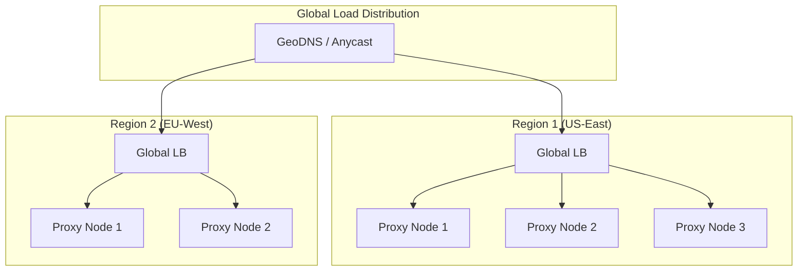
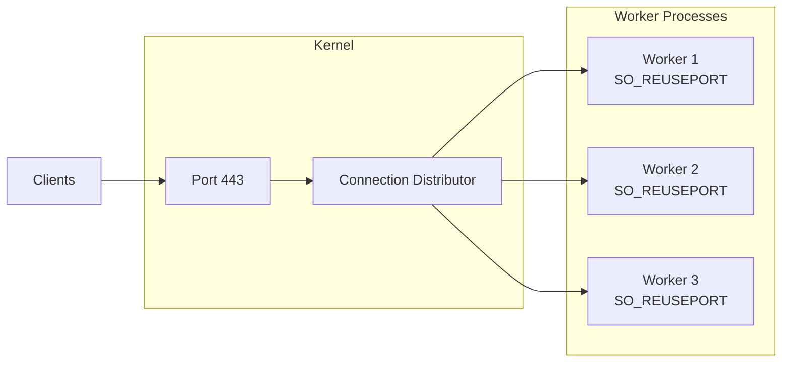
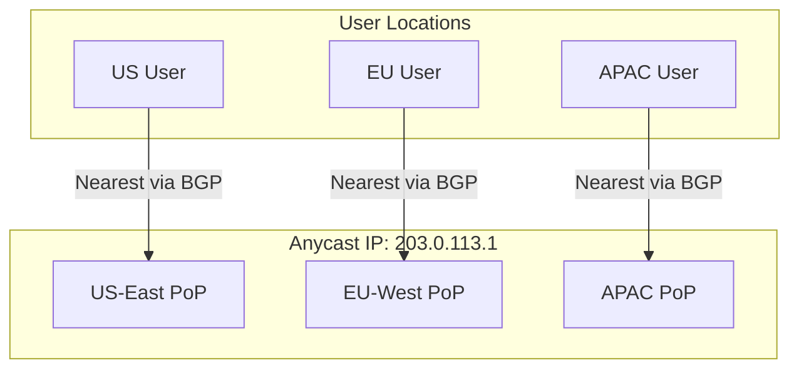
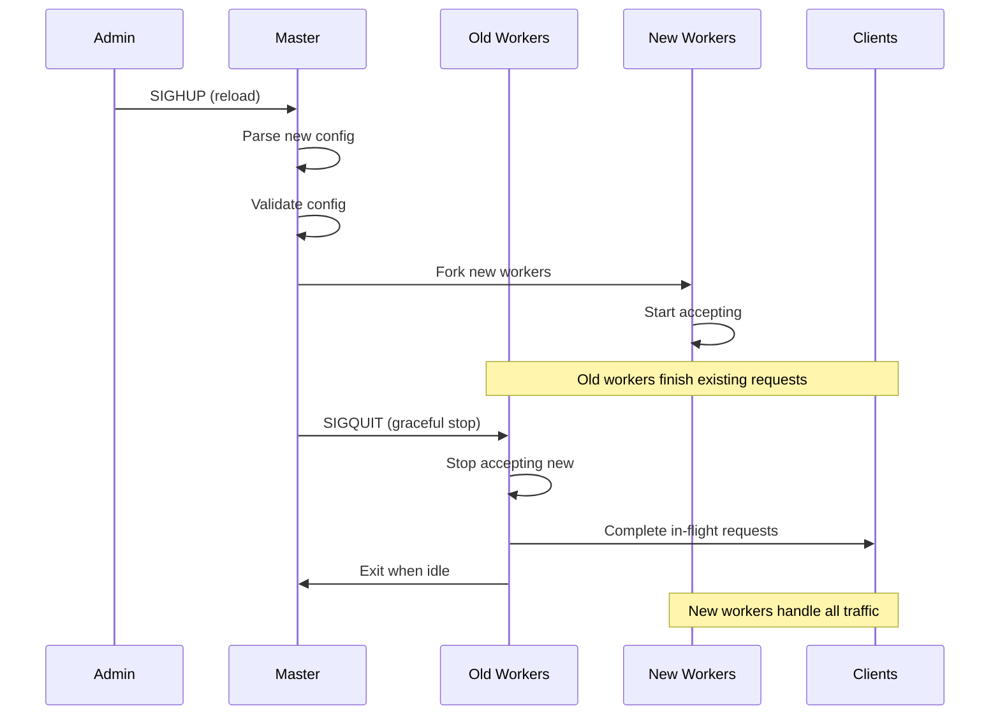
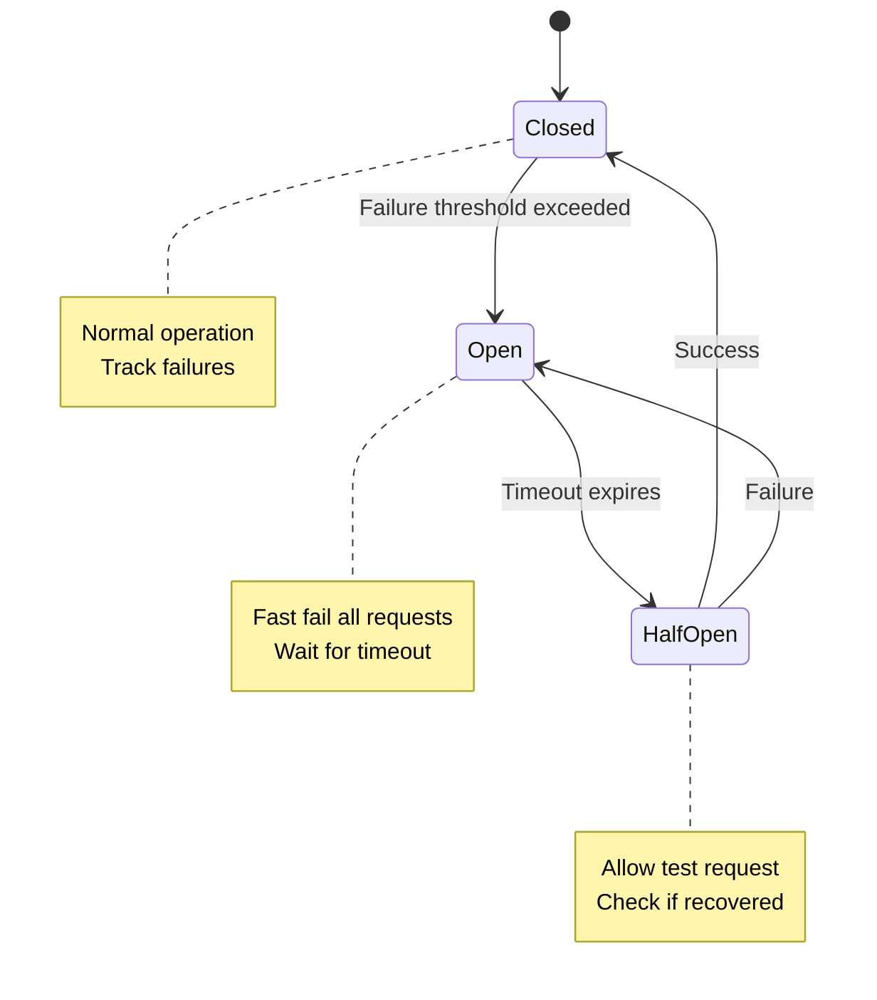
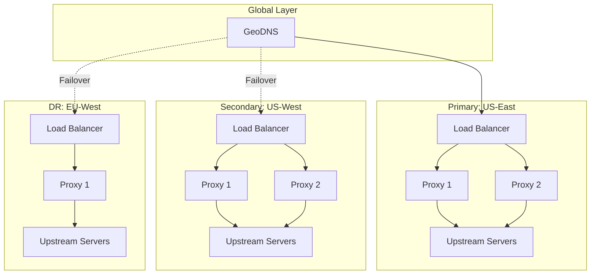
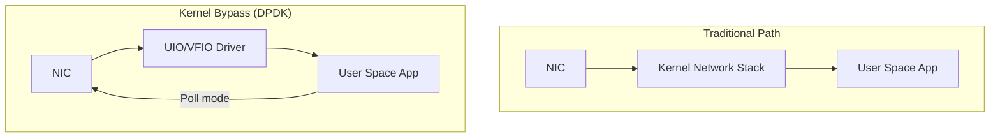

# Scalability and Reliability

## Table of Contents
- [Horizontal Scaling](#horizontal-scaling)
- [Vertical Scaling](#vertical-scaling)
- [Reliability Patterns](#reliability-patterns)
- [Disaster Recovery](#disaster-recovery)
- [Performance Optimization](#performance-optimization)

---

## Horizontal Scaling

### Multi-Node Architecture



### SO_REUSEPORT for Connection Distribution

Traditional socket sharing requires the master process to accept and pass connections to workers (expensive). `SO_REUSEPORT` allows multiple processes to bind to the same port, with the kernel distributing connections.

```
// Traditional approach (Linux < 3.9)
Master process binds to port 80
Master accepts connections
Master passes fd to workers via Unix socket
Worker handles connection

// SO_REUSEPORT approach (Linux >= 3.9)
All workers bind to port 80 with SO_REUSEPORT
Kernel distributes incoming connections across workers
Each worker accepts directly
```



**Benefits:**
- No master process bottleneck
- Better CPU affinity (connection stays with accepting CPU)
- True parallel accept processing

**Distribution Algorithms:**
- Default: Hash of source IP:port to worker
- CBPF: Custom Berkeley Packet Filter for advanced routing

### Anycast for Geographic Distribution

```
Single IP announced from multiple locations:
- 203.0.113.1 announced from US-East
- 203.0.113.1 announced from EU-West
- 203.0.113.1 announced from Asia-Pacific

BGP routing sends users to nearest location automatically
```



### Scaling Strategy

| Connections | Strategy | Configuration |
|-------------|----------|---------------|
| 10K | Single node, multiple workers | 1 node, 4 workers |
| 100K | Single node, all cores | 1 node, 16 workers |
| 500K | Multiple nodes behind L4 LB | 5 nodes, 16 workers each |
| 1M+ | Global anycast deployment | 10+ nodes across regions |

---

## Vertical Scaling

### Worker Count Tuning

```
// Rule of thumb: 1-2 workers per CPU core

Factors to consider:
1. CPU-bound workload (TLS heavy): workers = CPU cores
2. I/O-bound workload: workers = 2 × CPU cores
3. Mixed workload: workers = 1.5 × CPU cores

Example 16-core machine:
- Mostly TLS termination: 16 workers
- Mostly forwarding: 32 workers
- General purpose: 24 workers
```

### Buffer Size Optimization

```
// Small buffers: More syscalls, lower memory
client_body_buffer_size: 4KB
proxy_buffer_size: 4KB

// Large buffers: Fewer syscalls, higher memory
client_body_buffer_size: 64KB
proxy_buffer_size: 64KB

// Adaptive approach
if request_size < 4KB:
    use_inline_buffer()  // No allocation
elif request_size < 64KB:
    use_small_buffer_pool()
else:
    use_large_buffer_pool()
```

### Kernel Tuning

```bash
# File descriptor limits
sysctl fs.file-max=2000000
sysctl fs.nr_open=2000000

# TCP buffer sizes
sysctl net.core.rmem_max=16777216
sysctl net.core.wmem_max=16777216
sysctl net.ipv4.tcp_rmem="4096 87380 16777216"
sysctl net.ipv4.tcp_wmem="4096 87380 16777216"

# Connection tracking
sysctl net.ipv4.tcp_max_syn_backlog=65535
sysctl net.core.somaxconn=65535

# TCP optimization
sysctl net.ipv4.tcp_fastopen=3          # Enable TFO
sysctl net.ipv4.tcp_slow_start_after_idle=0
sysctl net.ipv4.tcp_tw_reuse=1          # Reuse TIME_WAIT

# Network interface
sysctl net.core.netdev_max_backlog=65535
sysctl net.core.netdev_budget=600
```

### Memory Configuration

```
Per-worker memory budget:
- Base process: 50MB
- Per connection (100K): 10KB × 100K = 1GB
- Buffer pools: 500MB
- TLS session cache: 100MB
- Total per worker: ~1.7GB

System with 64GB RAM, 16 workers:
- Available per worker: 64GB / 16 = 4GB
- Comfortable headroom: Yes

Memory-constrained deployment:
- Reduce buffer sizes
- Limit connections per worker
- Use shared memory for common data
```

---

## Reliability Patterns

### Graceful Restart (Zero Downtime Reload)



**Implementation:**

```
function handle_sighup():
    // 1. Load and validate new config
    new_config = load_config(config_path)
    errors = validate_config(new_config)
    if errors:
        log_error("Config validation failed", errors)
        return

    // 2. Fork new workers with new config
    new_workers = []
    for i in range(worker_count):
        pid = fork()
        if pid == 0:
            // Child: new worker
            worker_main(new_config)
            exit(0)
        else:
            new_workers.append(pid)

    // 3. Wait for new workers to be ready
    wait_for_workers_ready(new_workers, timeout=30s)

    // 4. Signal old workers to stop accepting
    for old_pid in old_workers:
        kill(old_pid, SIGQUIT)

    // 5. Wait for old workers to drain
    wait_for_workers_exit(old_workers, timeout=graceful_timeout)

    // 6. Force kill if still running
    for old_pid in old_workers:
        if process_exists(old_pid):
            log_warn("Force killing worker", old_pid)
            kill(old_pid, SIGKILL)

    old_workers = new_workers
```

### Health Checking Strategies

| Strategy | Description | Use Case |
|----------|-------------|----------|
| **Active** | Proxy sends periodic health requests | General purpose |
| **Passive** | Track real request success/failure | Low overhead |
| **Combined** | Active checks + passive observation | Best reliability |

```
// Active health checking
function active_health_check(server, check_config):
    conn = connect_with_timeout(server.address, check_config.timeout)
    if not conn:
        return UNHEALTHY

    send(conn, "GET " + check_config.path + " HTTP/1.1\r\n...")
    response = recv_with_timeout(conn, check_config.timeout)
    close(conn)

    if response.status in check_config.healthy_statuses:
        return HEALTHY
    return UNHEALTHY

// Passive health checking
function track_request_result(server, result):
    if result.success:
        server.success_count++
        server.consecutive_failures = 0
    else:
        server.failure_count++
        server.consecutive_failures++

        if server.consecutive_failures >= threshold:
            server.is_healthy = false
            // Active check will re-enable when healthy
```

### Circuit Breaker Integration



```
struct CircuitBreaker:
    state: enum {CLOSED, OPEN, HALF_OPEN}
    failure_count: int
    failure_threshold: int = 5
    recovery_timeout: duration = 30s
    last_failure_time: timestamp

function circuit_breaker_allow(cb: CircuitBreaker) -> bool:
    switch cb.state:
        case CLOSED:
            return true

        case OPEN:
            if now() - cb.last_failure_time > cb.recovery_timeout:
                cb.state = HALF_OPEN
                return true  // Allow one test request
            return false  // Fast fail

        case HALF_OPEN:
            return false  // Already testing

function circuit_breaker_record(cb: CircuitBreaker, success: bool):
    switch cb.state:
        case CLOSED:
            if not success:
                cb.failure_count++
                cb.last_failure_time = now()
                if cb.failure_count >= cb.failure_threshold:
                    cb.state = OPEN
            else:
                cb.failure_count = 0

        case HALF_OPEN:
            if success:
                cb.state = CLOSED
                cb.failure_count = 0
            else:
                cb.state = OPEN
                cb.last_failure_time = now()
```

### Connection Draining

```
function drain_connections(worker):
    // Stop accepting new connections
    for listen_fd in worker.listen_fds:
        close(listen_fd)

    drain_deadline = now() + drain_timeout

    while worker.connections.count() > 0:
        if now() > drain_deadline:
            log_warn("Drain timeout, force closing remaining connections")
            break

        // Process events for existing connections
        process_events(worker, timeout=1s)

        // Close idle connections immediately
        for conn in worker.connections:
            if conn.state == IDLE:
                close_connection(conn)

    // Force close remaining
    for conn in worker.connections:
        close_connection(conn)
```

---

## Disaster Recovery

### Multi-Region Deployment



### Failover Strategies

| Strategy | RTO | RPO | Complexity | Cost |
|----------|-----|-----|------------|------|
| **Active-Active** | ~0 | 0 | High | High |
| **Active-Standby (Hot)** | Minutes | 0 | Medium | Medium |
| **Active-Standby (Warm)** | 10-30 min | 0 | Low | Low |
| **DNS Failover** | TTL + detection | 0 | Low | Low |

### Configuration Backup

```
Configuration hierarchy:
1. Git repository (source of truth)
2. Configuration management (Ansible, Chef)
3. Local config file
4. Runtime state

Recovery procedure:
1. Deploy new proxy nodes from base image
2. Pull configuration from Git
3. Apply via configuration management
4. Verify health checks pass
5. Add to load balancer rotation
```

### State Recovery

```
Stateless proxy (ideal):
- No state to recover!
- Just deploy new node, add to rotation

Stateful elements to consider:
1. TLS session cache → Use distributed cache or accept cold start
2. Connection pools → Automatically rebuilt on restart
3. Health check state → Re-probe all upstreams
4. Rate limiting state → Use external store (Redis)
```

---

## Performance Optimization

### Zero-Copy Sendfile

```
// Traditional copy (kernel → userspace → kernel)
read(file_fd, buffer, size)  // kernel → userspace
write(socket_fd, buffer, size)  // userspace → kernel

// Zero-copy sendfile (kernel → kernel)
sendfile(socket_fd, file_fd, offset, size)  // No userspace copy!

// Performance impact
Traditional: 4 context switches, 2 memory copies
Sendfile: 2 context switches, 0 userspace copies
Speedup: 30-50% for static file serving
```

### Buffer Pool Management

```
// Pre-allocate buffers to avoid allocation per request
struct BufferPool:
    small_buffers: FreeList<Buffer4KB>
    medium_buffers: FreeList<Buffer16KB>
    large_buffers: FreeList<Buffer64KB>

function acquire_buffer(size: int) -> Buffer:
    if size <= 4KB:
        return small_buffers.pop() or allocate(4KB)
    elif size <= 16KB:
        return medium_buffers.pop() or allocate(16KB)
    elif size <= 64KB:
        return large_buffers.pop() or allocate(64KB)
    else:
        return allocate(size)  // Large alloc, won't pool

function release_buffer(buf: Buffer):
    if buf.capacity <= 64KB:
        get_pool(buf.capacity).push(buf)
    else:
        free(buf)  // Don't pool large buffers
```

### Kernel Bypass (Advanced)



**DPDK Benefits:**
- No syscalls for packet I/O
- No interrupts (polling mode)
- Latency: ~10μs vs ~100μs kernel

**Trade-offs:**
- Dedicated CPU cores (burns 100% CPU)
- Complexity
- Lose kernel features (firewall, debugging)

### HTTP/2 Server Push

```
// Pre-emptively push resources
function handle_html_request(conn, request):
    // Parse HTML to find resources
    html = fetch_from_upstream(request)
    resources = extract_subresources(html)

    // Push critical resources before client asks
    for resource in resources.critical:
        send_push_promise(conn, resource.url)
        send_pushed_response(conn, resource.content)

    // Then send the HTML
    send_response(conn, html)

// Result: Client gets CSS/JS without requesting!
```

### Compression Optimization

```
// Pre-compress static content
function serve_static(request):
    if "gzip" in request.accept_encoding:
        cached = get_precompressed(request.path + ".gz")
        if cached:
            return cached  // No CPU for compression

    if "br" in request.accept_encoding:
        cached = get_precompressed(request.path + ".br")
        if cached:
            return cached

    // Fallback to dynamic compression
    content = read_file(request.path)
    return compress(content, best_supported_encoding(request))

// Compression levels
Level 1: Fast, low ratio (real-time)
Level 6: Balanced (default)
Level 9: Slow, high ratio (pre-compression only)
```
