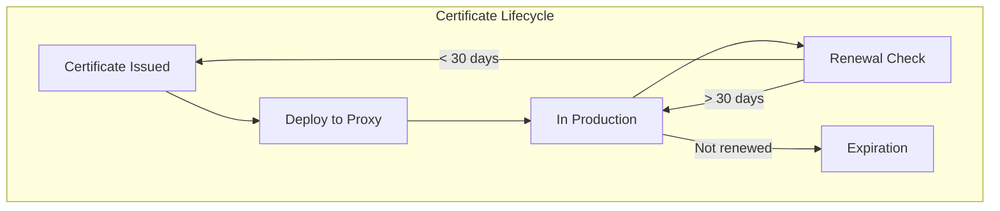
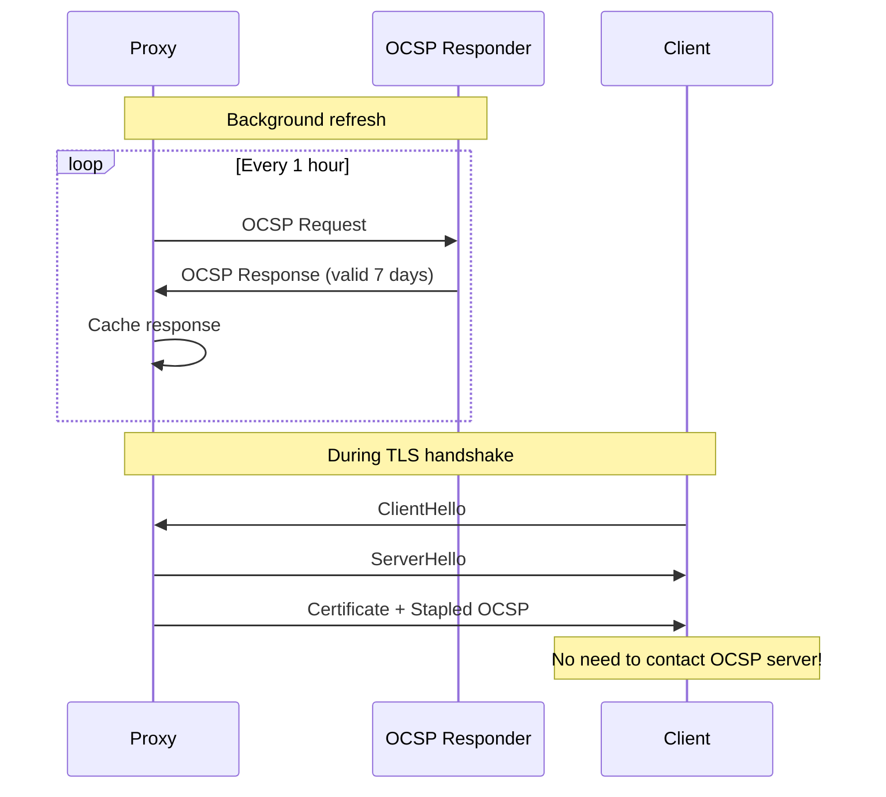
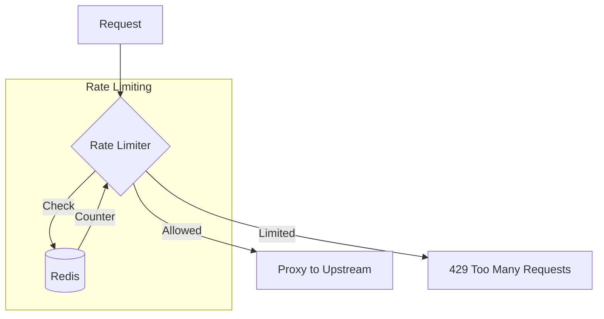

# Security and Compliance

## Table of Contents
- [TLS Security](#tls-security)
- [Request Security](#request-security)
- [DDoS Mitigation](#ddos-mitigation)
- [Threat Model](#threat-model)
- [Security Hardening](#security-hardening)

---

## TLS Security

### Certificate Management



**Automated Certificate Management:**

```
function certificate_manager():
    while true:
        for domain in managed_domains:
            cert = get_certificate(domain)

            days_until_expiry = (cert.not_after - now()).days

            if days_until_expiry <= 30:
                log_info("Renewing certificate", domain)
                new_cert = request_certificate(domain)  // ACME/Let's Encrypt
                deploy_certificate(domain, new_cert)
                reload_configuration()

        sleep(24h)

function deploy_certificate(domain, cert):
    // Atomic deployment
    temp_path = "/certs/temp_" + domain
    write_file(temp_path + ".crt", cert.certificate)
    write_file(temp_path + ".key", cert.private_key)

    // Atomic rename
    rename(temp_path + ".crt", "/certs/" + domain + ".crt")
    rename(temp_path + ".key", "/certs/" + domain + ".key")
```

### Protocol Version Enforcement

| Protocol | Security Status | Recommendation |
|----------|-----------------|----------------|
| SSL 2.0 | Broken | Disable |
| SSL 3.0 | Broken (POODLE) | Disable |
| TLS 1.0 | Deprecated | Disable |
| TLS 1.1 | Deprecated | Disable |
| TLS 1.2 | Secure | Enable (with strong ciphers) |
| TLS 1.3 | Most Secure | Enable (preferred) |

```
// Configuration
ssl_protocols TLSv1.2 TLSv1.3;

// Enforcement in code
function validate_tls_version(client_hello):
    version = client_hello.version

    if version < TLS_1_2:
        send_alert(PROTOCOL_VERSION)
        close_connection()
        return REJECT

    return ACCEPT
```

### Cipher Suite Selection

**Recommended Cipher Suites (Priority Order):**

```
TLS 1.3 (always these):
- TLS_AES_256_GCM_SHA384
- TLS_CHACHA20_POLY1305_SHA256
- TLS_AES_128_GCM_SHA256

TLS 1.2 (careful selection):
- ECDHE-ECDSA-AES256-GCM-SHA384
- ECDHE-RSA-AES256-GCM-SHA384
- ECDHE-ECDSA-CHACHA20-POLY1305
- ECDHE-RSA-CHACHA20-POLY1305
- ECDHE-ECDSA-AES128-GCM-SHA256
- ECDHE-RSA-AES128-GCM-SHA256

Avoid:
- CBC mode ciphers (BEAST, Lucky13)
- RC4 (broken)
- 3DES (Sweet32)
- Export ciphers (weak)
- NULL ciphers (no encryption)
- Anonymous ciphers (no authentication)
```

### OCSP Stapling Implementation



```
function refresh_ocsp_staple(certificate):
    ocsp_url = extract_ocsp_url(certificate)
    issuer = get_issuer_certificate(certificate)

    request = create_ocsp_request(certificate, issuer)
    response = http_post(ocsp_url, request)

    if response.status == GOOD:
        certificate.ocsp_staple = response
        certificate.staple_expiry = response.next_update

        // Schedule refresh before expiry
        refresh_time = response.next_update - 1h
        schedule(refresh_ocsp_staple, certificate, at=refresh_time)
    else:
        log_error("OCSP stapling failed", certificate.domain)
        // Keep old staple if still valid
```

### TLS Session Management

```
// Session Tickets (stateless server)
function create_session_ticket(session):
    ticket_data = serialize(session.master_secret, session.cipher)
    encrypted = encrypt_aes_gcm(ticket_key, ticket_data)
    return TicketEncryption{
        key_name: current_key.name,  // For key rotation
        iv: random(12),
        ciphertext: encrypted,
        mac: hmac(encrypted)
    }

// Session ticket key rotation
struct TicketKeyRing:
    current_key: TicketKey
    previous_keys: List<TicketKey>  // For decryption during rotation

function rotate_ticket_keys():
    new_key = generate_ticket_key()
    ring.previous_keys.prepend(ring.current_key)
    ring.current_key = new_key

    // Keep keys for ticket lifetime (e.g., 24h)
    while ring.previous_keys.last().age > 48h:
        ring.previous_keys.pop()
```

---

## Request Security

### Rate Limiting Integration



```
function check_rate_limit(request):
    // Multiple rate limit dimensions
    limits = [
        ("ip", request.client_ip, 100, "1m"),      // 100 req/min per IP
        ("user", request.user_id, 1000, "1m"),     // 1000 req/min per user
        ("endpoint", request.path, 10000, "1m"),   // 10K req/min per endpoint
    ]

    for dimension, key, limit, window in limits:
        count = redis.incr(dimension + ":" + key)
        if count == 1:
            redis.expire(dimension + ":" + key, window)

        if count > limit:
            return RATE_LIMITED

    return ALLOWED
```

### Request Validation

```
function validate_request(request) -> ValidationResult:
    errors = []

    // Method validation
    if request.method not in ALLOWED_METHODS:
        errors.append("Invalid HTTP method")

    // URI validation
    if contains_dangerous_chars(request.uri):
        errors.append("Invalid URI characters")

    if request.uri.length > MAX_URI_LENGTH:
        errors.append("URI too long")

    // Header validation
    for name, value in request.headers:
        if not is_valid_header_name(name):
            errors.append("Invalid header name: " + name)

        if contains_control_chars(value):
            errors.append("Header contains control characters")

        if value.length > MAX_HEADER_VALUE_LENGTH:
            errors.append("Header value too long: " + name)

    // Body validation
    if request.content_length > MAX_BODY_SIZE:
        errors.append("Body too large")

    if errors:
        return ValidationResult{valid: false, errors: errors}

    return ValidationResult{valid: true}
```

### Header Sanitization

```
// Remove or sanitize dangerous headers
function sanitize_request_headers(request):
    // Remove internal headers that client shouldn't set
    request.headers.remove("X-Real-IP")
    request.headers.remove("X-Forwarded-For")
    request.headers.remove("X-Internal-Token")

    // Add trusted headers
    request.headers.set("X-Real-IP", request.client_ip)
    request.headers.append("X-Forwarded-For", request.client_ip)
    request.headers.set("X-Request-ID", generate_request_id())

function sanitize_response_headers(response):
    // Remove server information
    response.headers.remove("Server")
    response.headers.remove("X-Powered-By")
    response.headers.remove("X-AspNet-Version")

    // Add security headers
    response.headers.set("X-Content-Type-Options", "nosniff")
    response.headers.set("X-Frame-Options", "DENY")
    response.headers.set("Strict-Transport-Security",
                         "max-age=31536000; includeSubDomains")
```

---

## DDoS Mitigation

### SYN Flood Protection

```mermaid
flowchart TB
    subgraph "SYN Flood Attack"
        A1[Attacker] --> |"SYN"| SV[Server]
        A2[Attacker] --> |"SYN"| SV
        A3[Attacker] --> |"SYN"| SV
        SV --> |"SYN-ACK"| VOID[No ACK returned]
    end

    subgraph "SYN Cookie Protection"
        AT[Attacker] --> |"SYN"| SC[Server with SYN Cookies]
        SC --> |"SYN-ACK with cookie"| AT
        Note over SC: No state stored!
        AT --> |"ACK without cookie"| SC
        SC --> |"Rejected"| DROP[Dropped]
    end
```

**Kernel-level Protection:**
```bash
# Enable SYN cookies
sysctl net.ipv4.tcp_syncookies=1

# Limit SYN backlog
sysctl net.ipv4.tcp_max_syn_backlog=65535

# Reduce SYN-ACK retries
sysctl net.ipv4.tcp_synack_retries=2
```

### Slowloris Protection

```
// Slowloris: Keep connections open with partial requests

function protect_against_slowloris(conn):
    // Set aggressive timeouts for incomplete requests
    if conn.state == READING_HEADERS:
        if now() - conn.request_start > HEADER_TIMEOUT:
            close_connection(conn)
            return

    if conn.state == READING_BODY:
        // Check minimum throughput
        elapsed = now() - conn.body_start
        if elapsed > 0:
            throughput = conn.body_bytes_read / elapsed
            if throughput < MIN_BODY_THROUGHPUT:
                close_connection(conn)
                return

// Configuration
header_timeout: 30s           // Complete headers within 30s
body_timeout: 120s            // Complete body within 2 minutes
min_body_throughput: 100 B/s  // At least 100 bytes/second
```

### Connection Limiting

```
struct ConnectionLimiter:
    per_ip_limit: int = 100
    per_ip_rate: int = 10  // New connections per second
    ip_connections: Map<IP, int>
    ip_rate: Map<IP, RateLimiter>

function accept_connection(limiter, client_ip):
    // Check current connection count
    current = limiter.ip_connections.get(client_ip, 0)
    if current >= limiter.per_ip_limit:
        log_warn("Connection limit exceeded", client_ip)
        return REJECT

    // Check connection rate
    if not limiter.ip_rate[client_ip].allow():
        log_warn("Connection rate exceeded", client_ip)
        return REJECT

    limiter.ip_connections[client_ip] = current + 1
    return ACCEPT

function release_connection(limiter, client_ip):
    limiter.ip_connections[client_ip]--
```

### Application Layer DDoS

```
// Detect and mitigate L7 attacks

function detect_l7_attack(request_stats):
    // Sudden spike detection
    current_rate = request_stats.requests_per_second
    baseline = request_stats.baseline_rate

    if current_rate > baseline * 10:
        trigger_mitigation(RATE_SPIKE)

    // Pattern detection
    if request_stats.unique_urls < 10 and current_rate > 1000:
        // Many requests to few URLs = attack
        trigger_mitigation(URL_FLOOD)

    // Geographic anomaly
    if request_stats.single_country_ratio > 0.9:
        // 90% traffic from one country = suspicious
        trigger_mitigation(GEO_ANOMALY)

function trigger_mitigation(attack_type):
    switch attack_type:
        case RATE_SPIKE:
            enable_strict_rate_limiting()
            enable_captcha_challenge()

        case URL_FLOOD:
            cache_hot_urls_aggressively()
            rate_limit_by_url()

        case GEO_ANOMALY:
            enable_geo_challenges()  // Extra verification
```

---

## Threat Model

### Attack: Request Smuggling

**Description:** Exploit discrepancies between proxy and backend HTTP parsing.

```
Malicious request:
POST / HTTP/1.1
Host: example.com
Content-Length: 13
Transfer-Encoding: chunked

0

GET /admin HTTP/1.1
Host: internal.example.com

If proxy uses Content-Length but backend uses Transfer-Encoding:
- Proxy sees: One POST request, body = "0\r\n\r\nGET /adm..."
- Backend sees: Two requests (POST + GET /admin)
```

**Mitigation:**
```
function prevent_request_smuggling(request):
    // Reject ambiguous requests
    if request.has("Content-Length") and request.has("Transfer-Encoding"):
        return error(400, "Ambiguous Content-Length and Transfer-Encoding")

    // Normalize Transfer-Encoding
    te = request.headers.get("Transfer-Encoding", "").lower()
    if te and te != "chunked":
        return error(400, "Invalid Transfer-Encoding")

    // Validate Content-Length
    cl = request.headers.get("Content-Length")
    if cl:
        if not cl.isdigit() or " " in cl:
            return error(400, "Invalid Content-Length")
```

### Attack: Cache Poisoning

**Description:** Manipulate cache to serve malicious content to other users.

```
Attack:
GET /api/data HTTP/1.1
Host: example.com
X-Forwarded-Host: attacker.com

If backend uses X-Forwarded-Host for redirects:
Response: 302 Redirect to https://attacker.com/...

If proxy caches this: All users get redirected to attacker!
```

**Mitigation:**
```
function prevent_cache_poisoning(request, response):
    // Vary on all headers that affect response
    response.headers.add("Vary", "X-Forwarded-Host")
    response.headers.add("Vary", "X-Forwarded-Proto")

    // Strip untrusted headers before forwarding
    untrusted_headers = [
        "X-Forwarded-Host",
        "X-Original-URL",
        "X-Rewrite-URL"
    ]
    for header in untrusted_headers:
        request.headers.remove(header)

    // Use strict cache keys
    cache_key = hash(
        request.method,
        request.host,
        request.path,
        request.query,
        // Include relevant headers
    )
```

### Attack: SSL/TLS Attacks

| Attack | Description | Mitigation |
|--------|-------------|------------|
| **BEAST** | CBC vulnerability in TLS 1.0 | Disable TLS 1.0, use GCM ciphers |
| **POODLE** | SSL 3.0 downgrade attack | Disable SSL 3.0 |
| **CRIME** | TLS compression leaks data | Disable TLS compression |
| **BREACH** | HTTP compression leaks data | Rate limit or add noise |
| **Heartbleed** | OpenSSL memory disclosure | Patch OpenSSL |
| **DROWN** | SSLv2 cross-protocol attack | Disable SSLv2 everywhere |
| **ROBOT** | RSA key exchange weakness | Use ECDHE, disable RSA kex |

### Attack: Connection Exhaustion

```
Attack types:
1. Open many idle connections (exhaust FD limit)
2. Send slow requests (exhaust worker threads/memory)
3. Request large responses but read slowly (memory exhaustion)

Defense:
struct ConnectionDefense:
    max_connections_total: int = 1_000_000
    max_connections_per_ip: int = 100
    idle_timeout: duration = 60s
    request_timeout: duration = 60s
    response_timeout: duration = 120s
    min_read_rate: int = 100  // bytes/sec
    min_write_rate: int = 1000  // bytes/sec
```

---

## Security Hardening

### Operating System Hardening

```bash
# Run proxy as non-root after binding to privileged ports
user = "proxy"
group = "proxy"

# Restrict filesystem access
chroot /var/lib/proxy

# Limit capabilities
cap_net_bind_service=+ep  # Bind to 80/443
# Drop all other capabilities

# Enable seccomp (syscall filtering)
seccomp_filter = "proxy_allowed_syscalls.json"
```

### Process Isolation

```
// Limit resources per worker
struct ResourceLimits:
    max_memory: 4GB
    max_file_descriptors: 200000
    max_cpu_time: unlimited
    max_processes: 1  // No forking from worker

function apply_resource_limits():
    setrlimit(RLIMIT_AS, 4 * 1024 * 1024 * 1024)
    setrlimit(RLIMIT_NOFILE, 200000)
    setrlimit(RLIMIT_NPROC, 1)

    // Enable strict mode
    prctl(PR_SET_NO_NEW_PRIVS, 1)  // No privilege escalation
```

### Secrets Management

```mermaid
flowchart TB
    subgraph "Secrets Management"
        VAULT[Secrets Manager]
        KMS[Key Management Service]
    end

    subgraph "Proxy"
        PROXY[Reverse Proxy]
        MEM[In-Memory Keys]
    end

    VAULT --> |"TLS Keys"| PROXY
    PROXY --> |"Decrypt"| KMS
    PROXY --> MEM

    Note over MEM: Keys never on disk<br/>Cleared on exit
```

```
function load_tls_keys_securely():
    // Fetch from secrets manager (not filesystem)
    encrypted_key = secrets_manager.get("tls_private_key")

    // Decrypt using KMS
    key_material = kms.decrypt(encrypted_key)

    // Load into memory, mark as sensitive
    tls_context.load_key(key_material)

    // Zero out the temporary copy
    secure_zero(key_material)

function on_shutdown():
    // Securely clear key material
    secure_zero(tls_context.key_material)
```

### Audit Logging

```
struct SecurityAuditLog:
    timestamp: datetime
    event_type: string
    client_ip: string
    user_id: string  // If authenticated
    action: string
    result: string
    details: Map<string, string>

function log_security_event(event):
    entry = SecurityAuditLog{
        timestamp: now(),
        event_type: event.type,
        client_ip: event.client_ip,
        action: event.action,
        result: event.result,
        details: event.details
    }

    // Send to secure, append-only log
    security_log.write(entry)

// Events to log
- TLS handshake failures
- Rate limit triggers
- Invalid request rejections
- Authentication failures
- Configuration changes
- Certificate rotations
```
