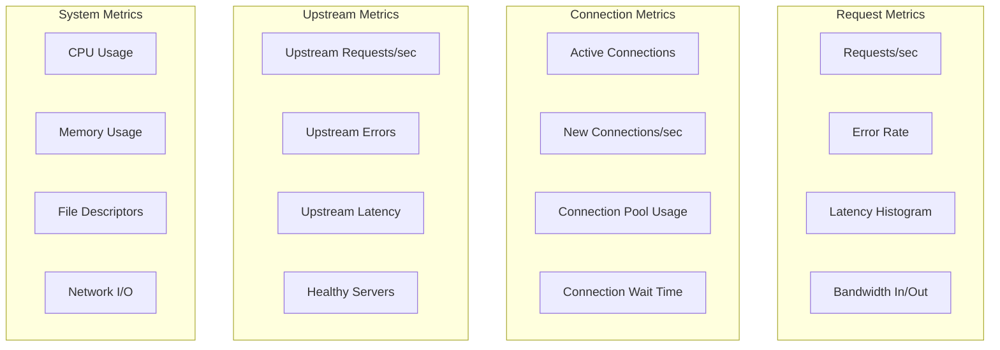
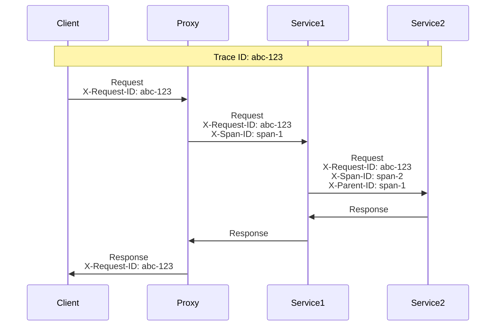
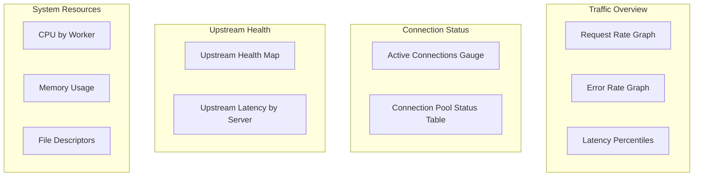

# Observability

## Table of Contents
- [Metrics](#metrics)
- [Logging](#logging)
- [Distributed Tracing](#distributed-tracing)
- [Alerting](#alerting)
- [Dashboards](#dashboards)

---

## Metrics

### RED Method (Request-focused)

| Metric | Description | Use |
|--------|-------------|-----|
| **Rate** | Requests per second | Capacity planning, scaling triggers |
| **Errors** | Failed request count/rate | Reliability tracking |
| **Duration** | Request latency distribution | Performance monitoring |

### USE Method (Resource-focused)

| Metric | Description | Use |
|--------|-------------|-----|
| **Utilization** | % of resource capacity used | Capacity planning |
| **Saturation** | Work queued/waiting | Bottleneck detection |
| **Errors** | Resource error count | Fault detection |

### Key Metrics



### Prometheus Metrics Format

```
# Request metrics
proxy_requests_total{method="GET",status="2xx",upstream="api_pool"} 1234567
proxy_requests_total{method="POST",status="5xx",upstream="api_pool"} 123
proxy_request_duration_seconds_bucket{le="0.001"} 500000
proxy_request_duration_seconds_bucket{le="0.005"} 800000
proxy_request_duration_seconds_bucket{le="0.01"} 900000
proxy_request_duration_seconds_bucket{le="0.05"} 950000
proxy_request_duration_seconds_bucket{le="0.1"} 990000
proxy_request_duration_seconds_bucket{le="0.5"} 999000
proxy_request_duration_seconds_bucket{le="1"} 999900
proxy_request_duration_seconds_bucket{le="+Inf"} 1000000
proxy_request_duration_seconds_sum 50000
proxy_request_duration_seconds_count 1000000

# Connection metrics
proxy_connections_active{type="client"} 50000
proxy_connections_active{type="upstream"} 5000
proxy_connections_total{type="client"} 10000000
proxy_connections_idle{upstream="api_pool"} 500

# Upstream metrics
proxy_upstream_health{upstream="api_pool",server="10.0.1.1:8080"} 1
proxy_upstream_health{upstream="api_pool",server="10.0.1.2:8080"} 0
proxy_upstream_requests_total{upstream="api_pool",status="2xx"} 987654
proxy_upstream_latency_seconds_bucket{upstream="api_pool",le="0.1"} 900000

# System metrics
proxy_cpu_usage_percent 45.5
proxy_memory_bytes 2147483648
proxy_file_descriptors_used 55000
proxy_file_descriptors_max 100000
```

### Metric Collection Implementation

```
struct MetricsCollector:
    request_counter: Counter          // Total requests
    request_duration: Histogram       // Latency distribution
    active_connections: Gauge         // Current connections
    upstream_health: GaugeVec         // Health per upstream
    bytes_transferred: Counter        // Bandwidth

function collect_request_metrics(request, response, duration):
    labels = {
        method: request.method,
        status: status_class(response.status),  // 2xx, 4xx, 5xx
        upstream: request.upstream_pool.name,
        path: normalize_path(request.path)  // Prevent cardinality explosion
    }

    metrics.request_counter.inc(labels)
    metrics.request_duration.observe(duration, labels)
    metrics.bytes_transferred.add(request.size + response.size, labels)

function normalize_path(path):
    // /users/123 -> /users/{id}
    // /products/abc-xyz -> /products/{slug}
    for pattern in path_patterns:
        if pattern.matches(path):
            return pattern.normalized
    return path
```

### Percentile Calculations

```
// For latency SLOs, we need accurate percentiles

// Option 1: Pre-defined histogram buckets
buckets = [0.001, 0.005, 0.01, 0.025, 0.05, 0.1, 0.25, 0.5, 1, 2.5, 5, 10]

// Option 2: T-Digest for streaming percentiles
struct TDigest:
    centroids: List<Centroid>
    compression: float = 100

function add_sample(value):
    digest.add(value)

function percentile(p):
    return digest.quantile(p)  // e.g., p=0.99 for p99
```

---

## Logging

### Log Formats

**Combined Log Format (Standard):**
```
10.0.0.1 - user123 [15/Jan/2024:10:30:00 +0000] "GET /api/users HTTP/1.1" 200 1234 "https://example.com" "Mozilla/5.0" 0.050
```

**JSON Log Format (Recommended):**
```json
{
  "timestamp": "2024-01-15T10:30:00.123Z",
  "request_id": "abc123",
  "client_ip": "10.0.0.1",
  "method": "GET",
  "path": "/api/users",
  "query": "page=1",
  "protocol": "HTTP/1.1",
  "status": 200,
  "bytes_sent": 1234,
  "bytes_received": 56,
  "request_time_ms": 50,
  "upstream_time_ms": 45,
  "upstream_server": "10.0.1.1:8080",
  "user_agent": "Mozilla/5.0",
  "referer": "https://example.com",
  "ssl_protocol": "TLSv1.3",
  "ssl_cipher": "TLS_AES_256_GCM_SHA384",
  "x_forwarded_for": "203.0.113.1",
  "host": "api.example.com"
}
```

### Log Levels

| Level | Use Case | Examples |
|-------|----------|----------|
| **ERROR** | Failures requiring attention | Connection failures, config errors, upstream failures |
| **WARN** | Potential issues | Rate limiting, high latency, retries |
| **INFO** | Normal operations | Startup, shutdown, config reload |
| **DEBUG** | Troubleshooting | Request details, state transitions |

### Access Log Configuration

```
// Configurable access log format
struct AccessLogConfig:
    path: string                    // Log file path
    format: string                  // Format string or "json"
    buffer_size: int = 65536        // Buffer before write
    flush_interval: duration = 1s
    rotation: RotationConfig

struct RotationConfig:
    max_size: int = 100MB
    max_files: int = 10
    compress: bool = true

// Example format string
format = '$remote_addr - $remote_user [$time_local] "$request" '
         '$status $body_bytes_sent "$http_referer" '
         '"$http_user_agent" rt=$request_time '
         'uct=$upstream_connect_time urt=$upstream_response_time'
```

### Error Logging

```
function log_error(context, error):
    entry = {
        "timestamp": now().iso8601(),
        "level": "ERROR",
        "worker_id": worker.id,
        "request_id": context.request_id,
        "client_ip": context.client_ip,
        "error_type": error.type,
        "error_message": error.message,
        "stack_trace": error.stack_trace if debug_mode else null,
        "context": {
            "state": context.connection.state,
            "upstream": context.upstream.address if context.upstream else null,
            "bytes_received": context.bytes_received,
            "bytes_sent": context.bytes_sent
        }
    }

    error_log.write(json.serialize(entry))

    // Increment error counter
    metrics.errors.inc({
        "type": error.type,
        "upstream": context.upstream.name
    })
```

### Log Sampling

```
// At high traffic, log sampling prevents disk saturation

struct LogSampler:
    base_rate: float = 1.0          // 100% logging
    error_rate: float = 1.0         // Always log errors
    slow_request_threshold: duration = 1s
    slow_request_rate: float = 1.0  // Always log slow requests

function should_log(request, response, duration):
    // Always log errors
    if response.status >= 500:
        return true

    // Always log slow requests
    if duration > sampler.slow_request_threshold:
        return true

    // Sample normal requests
    if random() < sampler.base_rate:
        return true

    return false

// Dynamic rate adjustment
function adjust_sampling_rate():
    current_rate = logs_per_second.rate()

    if current_rate > MAX_LOGS_PER_SECOND:
        sampler.base_rate *= 0.9  // Reduce by 10%
    elif current_rate < MAX_LOGS_PER_SECOND * 0.5:
        sampler.base_rate = min(sampler.base_rate * 1.1, 1.0)  // Increase by 10%
```

---

## Distributed Tracing

### Request ID Propagation



### OpenTelemetry Integration

```
struct TraceContext:
    trace_id: string          // 128-bit trace identifier
    span_id: string           // 64-bit span identifier
    parent_span_id: string    // Parent span for nesting
    trace_flags: int          // Sampling decision
    trace_state: string       // Vendor-specific data

function extract_trace_context(request) -> TraceContext:
    // W3C Trace Context (standard)
    traceparent = request.headers.get("traceparent")
    if traceparent:
        return parse_w3c_traceparent(traceparent)

    // B3 format (Zipkin)
    trace_id = request.headers.get("X-B3-TraceId")
    if trace_id:
        return TraceContext{
            trace_id: trace_id,
            span_id: request.headers.get("X-B3-SpanId"),
            parent_span_id: request.headers.get("X-B3-ParentSpanId"),
            trace_flags: 1 if request.headers.get("X-B3-Sampled") == "1" else 0
        }

    // Generate new trace
    return TraceContext{
        trace_id: generate_trace_id(),
        span_id: generate_span_id(),
        parent_span_id: null,
        trace_flags: sample_trace() ? 1 : 0
    }

function inject_trace_context(request, ctx: TraceContext):
    // W3C format
    request.headers.set("traceparent",
        "00-{ctx.trace_id}-{ctx.span_id}-{ctx.trace_flags:02x}")

    // Also inject B3 for compatibility
    request.headers.set("X-B3-TraceId", ctx.trace_id)
    request.headers.set("X-B3-SpanId", ctx.span_id)
    if ctx.parent_span_id:
        request.headers.set("X-B3-ParentSpanId", ctx.parent_span_id)
    request.headers.set("X-B3-Sampled", "1" if ctx.trace_flags & 1 else "0")
```

### Span Recording

```
function create_proxy_span(ctx: TraceContext, request) -> Span:
    span = Span{
        trace_id: ctx.trace_id,
        span_id: generate_span_id(),
        parent_id: ctx.span_id,
        operation_name: "proxy.request",
        start_time: now(),
        tags: {
            "http.method": request.method,
            "http.url": request.path,
            "http.host": request.host,
            "component": "reverse-proxy",
            "span.kind": "server"
        }
    }
    return span

function finish_span(span: Span, response, error):
    span.end_time = now()
    span.duration_ms = span.end_time - span.start_time

    span.tags["http.status_code"] = response.status
    span.tags["http.response_size"] = response.size

    if error:
        span.tags["error"] = true
        span.tags["error.message"] = error.message

    // Export to tracing backend
    trace_exporter.export(span)
```

---

## Alerting

### Alert Categories

| Category | Examples | Severity | Response |
|----------|----------|----------|----------|
| **Availability** | All upstreams down, proxy unresponsive | Critical | Page on-call |
| **Latency** | p99 > SLO threshold | High | Investigate |
| **Error Rate** | 5xx rate > threshold | High | Investigate |
| **Capacity** | Connections near limit, memory high | Medium | Scale |
| **Security** | Rate limit spikes, invalid requests | Medium | Investigate |

### Alert Rules (Prometheus Format)

```yaml
groups:
  - name: proxy_availability
    rules:
      - alert: ProxyDown
        expr: up{job="reverse-proxy"} == 0
        for: 1m
        labels:
          severity: critical
        annotations:
          summary: "Reverse proxy instance down"
          description: "{{ $labels.instance }} has been down for >1m"

      - alert: AllUpstreamsUnhealthy
        expr: sum(proxy_upstream_health{upstream="api_pool"}) == 0
        for: 30s
        labels:
          severity: critical
        annotations:
          summary: "All upstream servers unhealthy"

  - name: proxy_latency
    rules:
      - alert: HighLatencyP99
        expr: histogram_quantile(0.99, rate(proxy_request_duration_seconds_bucket[5m])) > 0.5
        for: 5m
        labels:
          severity: high
        annotations:
          summary: "p99 latency exceeds 500ms"

      - alert: HighLatencyP50
        expr: histogram_quantile(0.50, rate(proxy_request_duration_seconds_bucket[5m])) > 0.1
        for: 5m
        labels:
          severity: medium
        annotations:
          summary: "p50 latency exceeds 100ms"

  - name: proxy_errors
    rules:
      - alert: HighErrorRate
        expr: |
          sum(rate(proxy_requests_total{status="5xx"}[5m]))
          / sum(rate(proxy_requests_total[5m])) > 0.01
        for: 5m
        labels:
          severity: high
        annotations:
          summary: "Error rate exceeds 1%"

      - alert: UpstreamErrorSpike
        expr: |
          rate(proxy_upstream_requests_total{status="5xx"}[5m])
          > rate(proxy_upstream_requests_total{status="5xx"}[1h]) * 3
        for: 5m
        labels:
          severity: high
        annotations:
          summary: "Upstream error rate 3x higher than baseline"

  - name: proxy_capacity
    rules:
      - alert: HighConnectionCount
        expr: proxy_connections_active / proxy_connections_max > 0.8
        for: 5m
        labels:
          severity: medium
        annotations:
          summary: "Connection count at 80% of limit"

      - alert: HighMemoryUsage
        expr: proxy_memory_bytes / proxy_memory_limit_bytes > 0.9
        for: 5m
        labels:
          severity: medium
        annotations:
          summary: "Memory usage exceeds 90%"

      - alert: FileDescriptorExhaustion
        expr: proxy_file_descriptors_used / proxy_file_descriptors_max > 0.9
        for: 2m
        labels:
          severity: high
        annotations:
          summary: "File descriptors at 90% of limit"
```

### Alert Routing

```yaml
route:
  receiver: 'default'
  routes:
    - match:
        severity: critical
      receiver: 'pagerduty-critical'
      continue: true

    - match:
        severity: high
      receiver: 'slack-oncall'
      group_wait: 30s

    - match:
        severity: medium
      receiver: 'slack-monitoring'
      group_wait: 5m

receivers:
  - name: 'pagerduty-critical'
    pagerduty_configs:
      - service_key: 'xxx'

  - name: 'slack-oncall'
    slack_configs:
      - channel: '#proxy-alerts'
        send_resolved: true

  - name: 'slack-monitoring'
    slack_configs:
      - channel: '#monitoring'
```

---

## Dashboards

### Overview Dashboard



### Key Dashboard Panels

**1. Request Rate:**
```
Panel: Time series graph
Query: sum(rate(proxy_requests_total[1m])) by (status)
Legend: {{status}}
Stacking: enabled
```

**2. Latency Percentiles:**
```
Panel: Time series graph
Queries:
  - histogram_quantile(0.50, rate(proxy_request_duration_seconds_bucket[5m]))
  - histogram_quantile(0.95, rate(proxy_request_duration_seconds_bucket[5m]))
  - histogram_quantile(0.99, rate(proxy_request_duration_seconds_bucket[5m]))
Legend: p50, p95, p99
```

**3. Connection Counts:**
```
Panel: Stat panel
Query: proxy_connections_active{type="client"}
Thresholds:
  - green: 0-80% of max
  - yellow: 80-90% of max
  - red: >90% of max
```

**4. Upstream Health Table:**
```
Panel: Table
Query: proxy_upstream_health
Columns: upstream, server, health_status, last_check
```

**5. Error Breakdown:**
```
Panel: Pie chart
Query: sum(increase(proxy_requests_total{status=~"4..|5.."}[1h])) by (status)
```

### Debug Dashboard

```
Panels for troubleshooting:

1. Request Duration Heatmap
   - X: Time, Y: Duration bucket, Color: Count
   - Helps identify latency patterns

2. Upstream Response Time by Server
   - Individual server latency comparison
   - Identify slow servers

3. Connection State Distribution
   - Reading, writing, idle, waiting
   - Identify stuck connections

4. Error Types Over Time
   - Connection refused, timeout, 5xx
   - Correlate with events

5. TLS Handshake Rate
   - New vs resumed sessions
   - Identify TLS overhead
```
