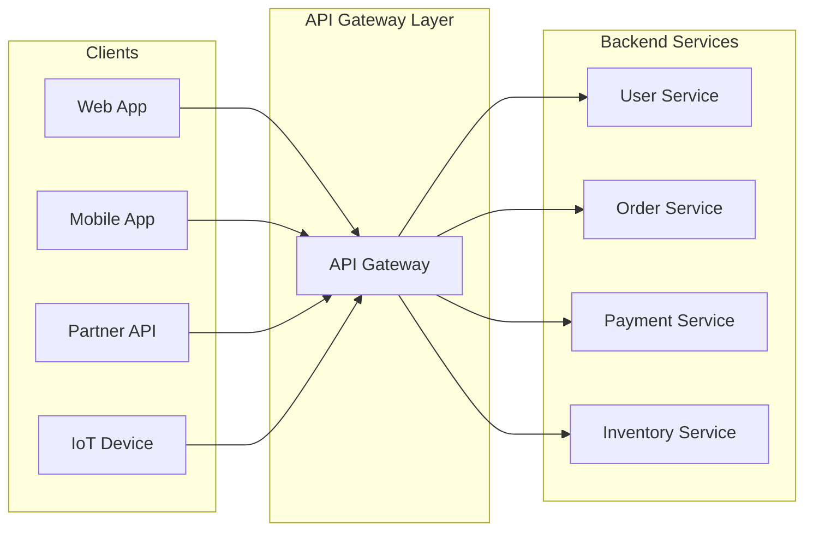
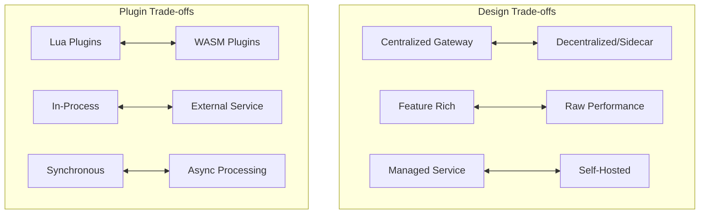

# API Gateway Design

## System Design Document

| Attribute | Value |
|-----------|-------|
| **Complexity** | High |
| **Category** | Core Infrastructure |
| **Prerequisites** | HTTP/REST basics, Authentication concepts, Load Balancer (1.2), Rate Limiter (1.1) |
| **Related Topics** | Rate Limiter (1.1), Load Balancer (1.2), Reverse Proxy (1.13), Service Discovery (1.10), Service Mesh (2.11) |

---

## Quick Navigation

| Document | Description |
|----------|-------------|
| [01 - Requirements & Estimations](./01-requirements-and-estimations.md) | Functional/non-functional requirements, capacity planning |
| [02 - High-Level Design](./02-high-level-design.md) | Architecture diagrams, data flow, key decisions |
| [03 - Low-Level Design](./03-low-level-design.md) | Data structures, APIs, core algorithms |
| [04 - Deep Dive & Bottlenecks](./04-deep-dive-and-bottlenecks.md) | Router, auth pipeline, rate limiting at scale |
| [05 - Scalability & Reliability](./05-scalability-and-reliability.md) | Horizontal scaling, fault tolerance, HA patterns |
| [06 - Security & Compliance](./06-security-and-compliance.md) | AuthN/AuthZ, threat model, compliance |
| [07 - Observability](./07-observability.md) | Metrics, logging, tracing, alerting |
| [08 - Interview Guide](./08-interview-guide.md) | 45-min pacing, trap questions, quick reference |

---

## System Overview

An **API Gateway** is a unified entry point for all client requests to backend services. It sits between clients and microservices, handling cross-cutting concerns like authentication, rate limiting, request routing, protocol translation, and observability. Unlike a simple reverse proxy, an API Gateway is specifically designed for API management with rich plugin/filter architectures.



---

## Gateway Types Comparison

| Type | Scope | Use Case | Example |
|------|-------|----------|---------|
| **Edge Gateway** | External traffic | Public API entry point | Kong, AWS API Gateway |
| **Internal Gateway** | Service-to-service | Microservices mesh entry | Envoy, Linkerd |
| **Micro Gateway** | Per-service | Sidecar pattern | Envoy (sidecar) |
| **Federated Gateway** | Multi-tenant | API marketplace | Apigee, MuleSoft |

---

## Key Characteristics

| Characteristic | Challenge | Why It Matters |
|----------------|-----------|----------------|
| **Latency-Sensitive** | < 5ms overhead at p50 | Gateway sits on hot path |
| **High Availability** | 99.99% uptime | Single point of failure risk |
| **Plugin-Heavy** | Chain of transformations | Extensibility vs performance |
| **Protocol-Aware** | REST, gRPC, WebSocket, GraphQL | Multi-protocol support needed |
| **Security-Critical** | Auth, rate limiting, WAF | First line of defense |

---

## Architecture Comparison Matrix

| Aspect | Kong | AWS API Gateway | Envoy | Netflix Zuul 2 | Traefik |
|--------|------|-----------------|-------|----------------|---------|
| **Type** | Open Source / Enterprise | Managed Service | Open Source | Open Source | Open Source |
| **Data Plane** | NGINX + Lua | Proprietary | C++ | Netty (Java) | Go |
| **Control Plane** | PostgreSQL/Cassandra | AWS Managed | xDS (Istio) | Eureka | Kubernetes CRDs |
| **Plugin Model** | Lua / Go | Lambda Authorizers | WASM / C++ | Filters (Java) | Middleware (Go) |
| **Protocol** | HTTP/1.1, HTTP/2, gRPC | HTTP, WebSocket, REST | HTTP/1-3, gRPC, TCP | HTTP/1.1, HTTP/2 | HTTP/1-2, gRPC, TCP |
| **Auth** | JWT, OAuth2, OIDC, mTLS | IAM, Cognito, Lambda | JWT, mTLS | Custom Filters | JWT, BasicAuth |
| **Rate Limiting** | Built-in (Redis) | AWS-managed | Envoy RLS | Custom Filter | Built-in |
| **Best For** | API management | Serverless APIs | Service mesh | Netflix ecosystem | Kubernetes-native |

---

## Real-World Implementations

| Company | Implementation | Key Innovation |
|---------|---------------|----------------|
| **Netflix** | Zuul 2 | Non-blocking I/O, filter-based architecture |
| **Stripe** | Custom Gateway | Idempotency keys, request replay |
| **Airbnb** | Envoy + Custom | Request hedging, circuit breaking |
| **Uber** | Custom Gateway | Multi-region routing, graceful degradation |
| **Shopify** | Custom (Rust) | Memory-safe, plugin isolation |
| **AWS** | API Gateway | Lambda integration, usage plans |
| **Kong** | Kong Gateway | Plugin marketplace, declarative config |

---

## Key Trade-offs



### Trade-off Analysis

| Trade-off | Option A | Option B | Decision Factors |
|-----------|----------|----------|------------------|
| **Deployment Model** | Centralized gateway | Sidecar per service | Team autonomy, latency requirements |
| **Plugin Execution** | In-process (Lua/WASM) | External service call | Isolation, performance, language support |
| **Configuration** | Static file | Dynamic (xDS/Admin API) | Change frequency, consistency |
| **Rate Limiting** | Local per-instance | Distributed (Redis) | Accuracy vs latency |
| **Auth Validation** | In-gateway | Delegate to IdP | Performance vs real-time revocation |

---

## Why This Design Matters

1. **Unified Entry Point**: Single place for cross-cutting concerns (auth, logging, rate limiting)
2. **Backend Abstraction**: Clients don't need to know internal service topology
3. **Security Enforcement**: Centralized policy enforcement before requests reach services
4. **Protocol Translation**: Convert between REST, gRPC, WebSocket seamlessly
5. **Observability**: Single point for metrics, traces, and access logs

---

## Core Concepts Overview

### Request Lifecycle

Every request passes through a pipeline of processing stages:

1. **Ingress**: TLS termination, HTTP parsing
2. **Pre-Processing**: Authentication, rate limiting, request validation
3. **Routing**: Match request to upstream service
4. **Transformation**: Modify headers, body, protocol
5. **Upstream Call**: Forward request, handle retries
6. **Post-Processing**: Response transformation, caching
7. **Egress**: Response to client, logging

### Plugin Architecture

Modern gateways use a plugin/filter chain model where each plugin handles a specific concern:

```
Request → [Auth] → [RateLimit] → [Transform] → [Route] → Upstream
                                                            ↓
Response ← [Transform] ← [Cache] ← [Log] ← ← ← ← ← ← ← ←  ↲
```

### Upstream Discovery

API gateways integrate with service discovery systems to dynamically resolve upstream targets:
- DNS-based discovery
- Consul/Eureka/Kubernetes integration
- Static configuration with health checks

---

## When to Use an API Gateway

| Scenario | Benefit |
|----------|---------|
| **Microservices Architecture** | Single entry point, service abstraction |
| **Multi-Client APIs** | Mobile, web, partner variations |
| **Authentication Consolidation** | Centralized auth rather than per-service |
| **Rate Limiting** | Protect backends from overload |
| **Protocol Translation** | gRPC internally, REST externally |
| **Analytics & Monitoring** | Unified API metrics |

---

## When NOT to Use an API Gateway

| Scenario | Alternative |
|----------|-------------|
| **Simple monolith** | Direct load balancer |
| **Very low latency (< 1ms overhead matters)** | Service mesh sidecar |
| **Service-to-service only** | Service mesh |
| **Static content** | CDN |

---

## Complexity Rating Breakdown

| Area | Complexity | Reason |
|------|------------|--------|
| **Request Routing** | Medium | Trie matching, regex, priority rules |
| **Authentication** | High | Multiple auth methods, token validation |
| **Rate Limiting** | High | Distributed state, race conditions |
| **Protocol Translation** | High | REST ↔ gRPC ↔ WebSocket |
| **Plugin Architecture** | Medium-High | Execution order, error handling |
| **Configuration Management** | Medium | Hot reload, validation, versioning |
| **Observability** | Medium | High cardinality metrics, sampling |

---

## Document Reading Order

### For Interview Prep (Time-Limited)
1. This index (overview)
2. [02 - High-Level Design](./02-high-level-design.md) (architecture)
3. [08 - Interview Guide](./08-interview-guide.md) (pacing, questions)

### For Deep Understanding
1. All documents in order (00 → 08)
2. Focus on [04 - Deep Dive](./04-deep-dive-and-bottlenecks.md) for internals
3. Study [03 - Low-Level Design](./03-low-level-design.md) for algorithms

### For Production Design
1. [01 - Requirements](./01-requirements-and-estimations.md) (capacity planning)
2. [05 - Scalability](./05-scalability-and-reliability.md) (production concerns)
3. [06 - Security](./06-security-and-compliance.md) (hardening)
4. [07 - Observability](./07-observability.md) (monitoring)

---

## Related System Designs

| Design | Relationship |
|--------|--------------|
| [1.1 Distributed Rate Limiter](../1.1-distributed-rate-limiter/00-index.md) | Rate limiting algorithms used by gateway |
| [1.2 Distributed Load Balancer](../1.2-distributed-load-balancer/00-index.md) | Load balancing for upstream services |
| [1.4 Distributed LRU Cache](../1.4-distributed-lru-cache/00-index.md) | Response caching layer |
| [1.10 Service Discovery](../1.10-service-discovery-system/00-index.md) | Upstream service resolution |
| [1.13 Reverse Proxy](../1.13-high-performance-reverse-proxy/00-index.md) | Underlying proxy mechanics |

---

## Further Reading

- Kong Gateway Documentation (konghq.com)
- Envoy Proxy Architecture (envoyproxy.io)
- Netflix Zuul Architecture Blog
- AWS API Gateway Developer Guide
- "Building Microservices" by Sam Newman (Gateway patterns chapter)
