# High-Level Design

## Table of Contents
- [Architecture Overview](#architecture-overview)
- [Core Components](#core-components)
- [Data Flow](#data-flow)
- [Key Design Decisions](#key-design-decisions)
- [Component Interactions](#component-interactions)

---

## Architecture Overview

The API Gateway sits at the edge of the infrastructure, acting as the unified entry point for all external API traffic. It handles cross-cutting concerns before routing requests to appropriate backend services.

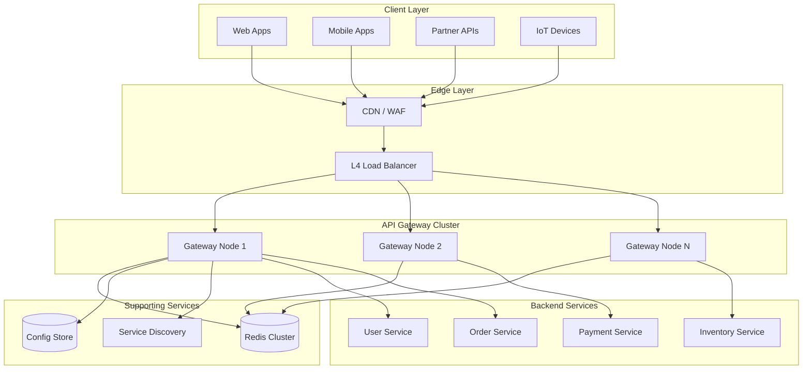

---

## Core Components

### 1. Request Router

The router matches incoming requests to configured routes and determines the target upstream service.

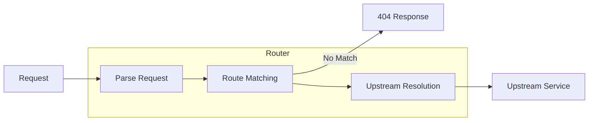

**Responsibilities:**
- Path, header, and method-based routing
- Host-based virtual hosting
- Regex and prefix matching
- Priority-based route selection
- Upstream service resolution

### 2. Authentication Handler

Validates client identity before allowing request processing.

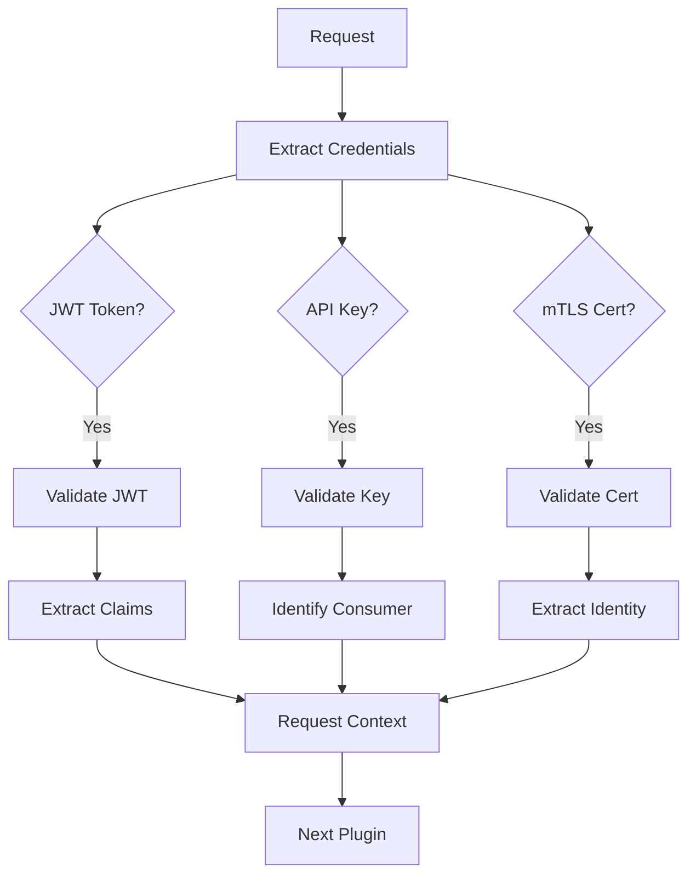

**Responsibilities:**
- Token extraction (header, cookie, query param)
- JWT signature verification (RS256, ES256)
- Token expiration and claims validation
- API key lookup and validation
- mTLS certificate chain verification
- Consumer identification and context enrichment

### 3. Rate Limiter

Enforces request quotas to protect backend services and ensure fair usage.

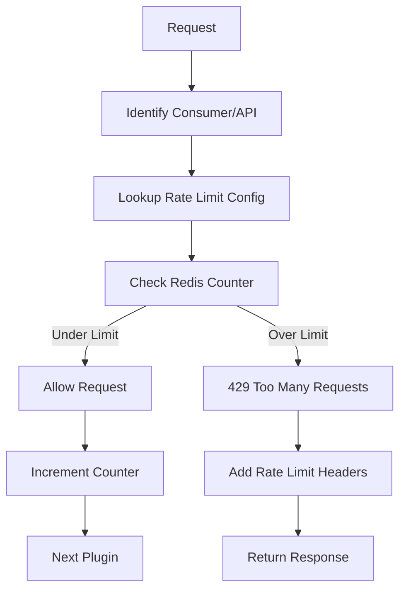

**Responsibilities:**
- Per-consumer rate limiting
- Per-API rate limiting
- Global rate limiting
- Sliding window / token bucket algorithms
- Rate limit header injection (X-RateLimit-*)
- Quota management for usage plans

### 4. Request Transformer

Modifies requests before forwarding to upstream services.

**Responsibilities:**
- Header addition/removal/modification
- Query parameter manipulation
- URL path rewriting
- Request body transformation
- Protocol translation (REST → gRPC)

### 5. Circuit Breaker

Prevents cascade failures by stopping requests to unhealthy upstreams.

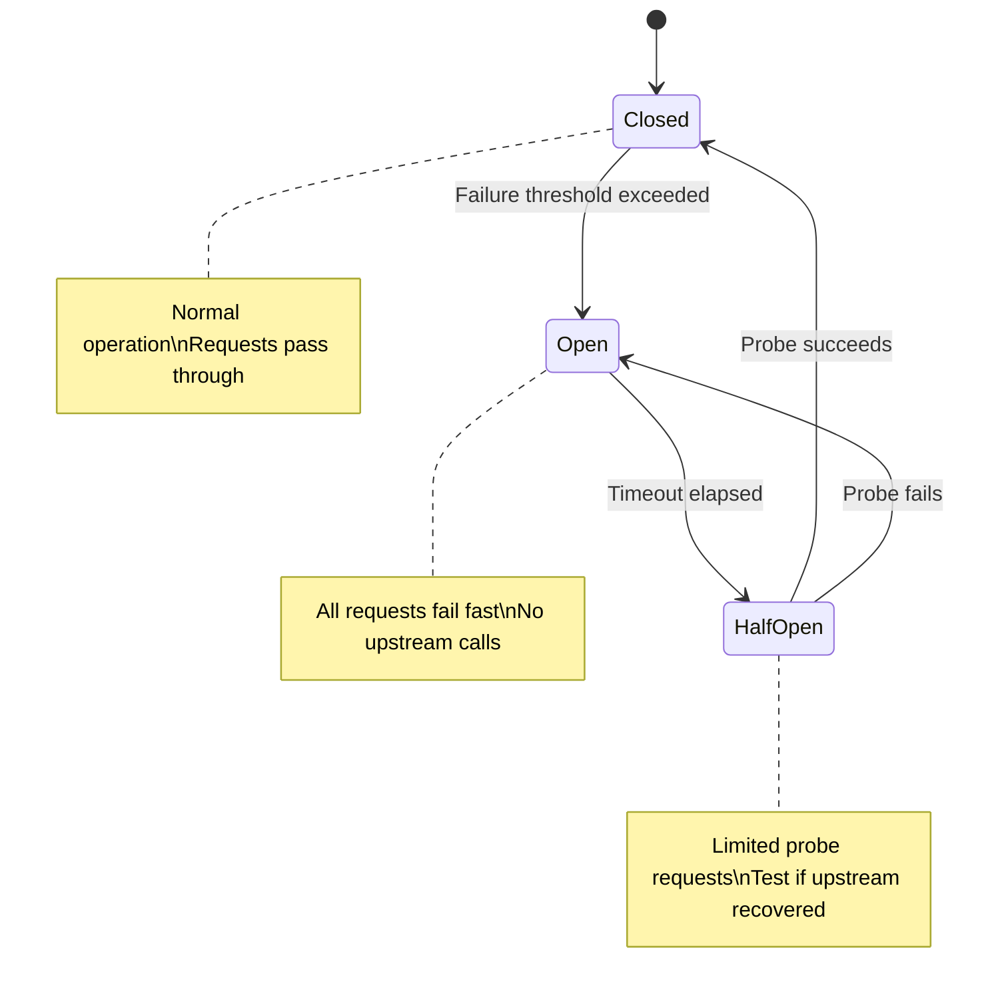

**Responsibilities:**
- Failure counting per upstream
- State management (closed/open/half-open)
- Automatic recovery probing
- Fallback response handling

### 6. Load Balancer

Distributes requests across upstream service instances.

**Responsibilities:**
- Round-robin distribution
- Weighted distribution
- Least connections
- Consistent hashing (for caching)
- Health-aware routing

### 7. Response Handler

Processes responses before returning to clients.

**Responsibilities:**
- Response body transformation
- Header manipulation
- Response caching
- Compression (gzip, brotli)
- Error response formatting

### 8. Plugin Chain Executor

Orchestrates the execution of configured plugins in order.

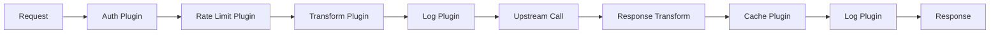

---

## Data Flow

### Request Lifecycle

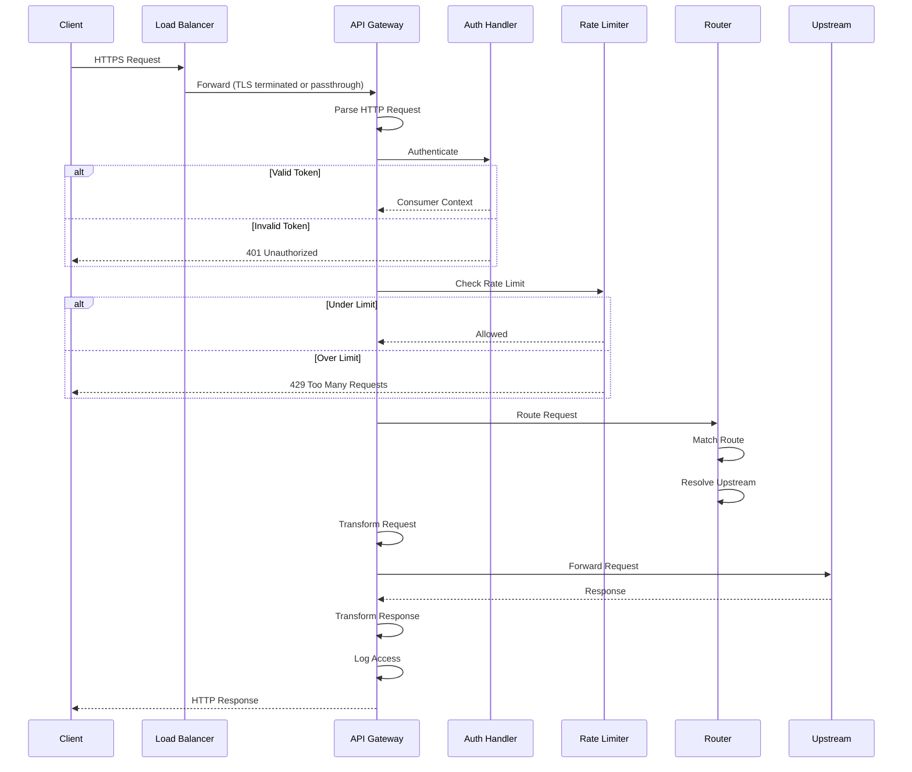

### Request Context Object

Throughout the request lifecycle, a context object carries request state:

```
RequestContext {
    // Original request
    request: HttpRequest

    // Identified consumer (after auth)
    consumer: {
        id: "consumer-123"
        tier: "premium"
        organization: "acme-corp"
    }

    // Matched route
    route: {
        id: "route-456"
        path: "/api/v1/users/{id}"
        upstream: "user-service"
    }

    // Rate limit state
    rateLimit: {
        remaining: 950
        limit: 1000
        resetAt: 1704067200
    }

    // Timing
    timing: {
        receivedAt: timestamp
        authDuration: 2ms
        routeDuration: 0.5ms
    }

    // Tracing
    traceId: "abc-123-def"
    spanId: "span-789"
}
```

---

## Key Design Decisions

### Decision 1: Centralized vs Decentralized Gateway

| Approach | Pros | Cons |
|----------|------|------|
| **Centralized** | Single management point, consistent policy | Single point of failure, extra hop |
| **Sidecar** | No extra hop, service autonomy | Distributed management, resource overhead |
| **Hybrid** | Best of both (external=central, internal=sidecar) | Complexity |

**Decision:** Hybrid approach
- External traffic → Centralized API Gateway
- Internal service-to-service → Service mesh (sidecar)
- Reason: External traffic needs unified auth/rate limiting; internal traffic benefits from sidecar proximity

### Decision 2: Plugin Execution Model

| Model | Pros | Cons |
|-------|------|------|
| **In-Process (Lua)** | Fast, low latency | Limited language, security concerns |
| **In-Process (WASM)** | Sandboxed, multi-language | WASM overhead, ecosystem maturity |
| **External Service** | Full isolation, any language | Network latency, complexity |

**Decision:** In-process with WASM support
- Core plugins (auth, rate limit) in native code for performance
- Custom plugins via WASM for flexibility and isolation
- Reason: Balance between performance and extensibility

### Decision 3: Configuration Management

| Approach | Pros | Cons |
|----------|------|------|
| **Static Files** | Simple, auditable | Requires restart/reload |
| **Database-backed** | Dynamic, admin UI | Consistency challenges |
| **xDS Protocol** | Industry standard, push-based | Complexity, control plane dependency |

**Decision:** Database-backed with Admin API
- PostgreSQL for persistent configuration
- In-memory cache with change notifications
- Admin API for CRUD operations
- Hot reload without restart
- Reason: Operational flexibility for large route tables

### Decision 4: Rate Limiting Strategy

| Strategy | Pros | Cons |
|----------|------|------|
| **Local Only** | Fast, no network calls | Inconsistent across nodes |
| **Centralized (Redis)** | Accurate, consistent | Redis latency, SPOF |
| **Hybrid** | Balance accuracy and speed | Complexity |

**Decision:** Hybrid with Redis
- Local rate limiter for first-pass (fast rejection of obvious abuse)
- Redis for accurate cross-node counting
- Async sync to reduce Redis calls
- Reason: Accuracy matters for billing; latency matters for UX

### Decision 5: Stateless Design

**Decision:** Gateway nodes are stateless
- All state stored externally (Redis, PostgreSQL)
- Any node can handle any request
- Enables horizontal scaling and simple failover
- Reason: Operational simplicity, easy scaling

---

## Component Interactions

### Gateway ↔ Redis (Rate Limiting)

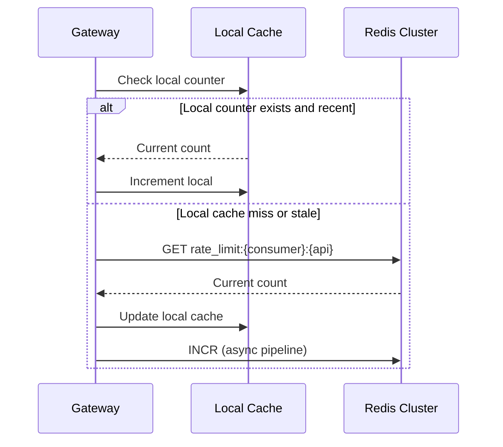

### Gateway ↔ Service Discovery

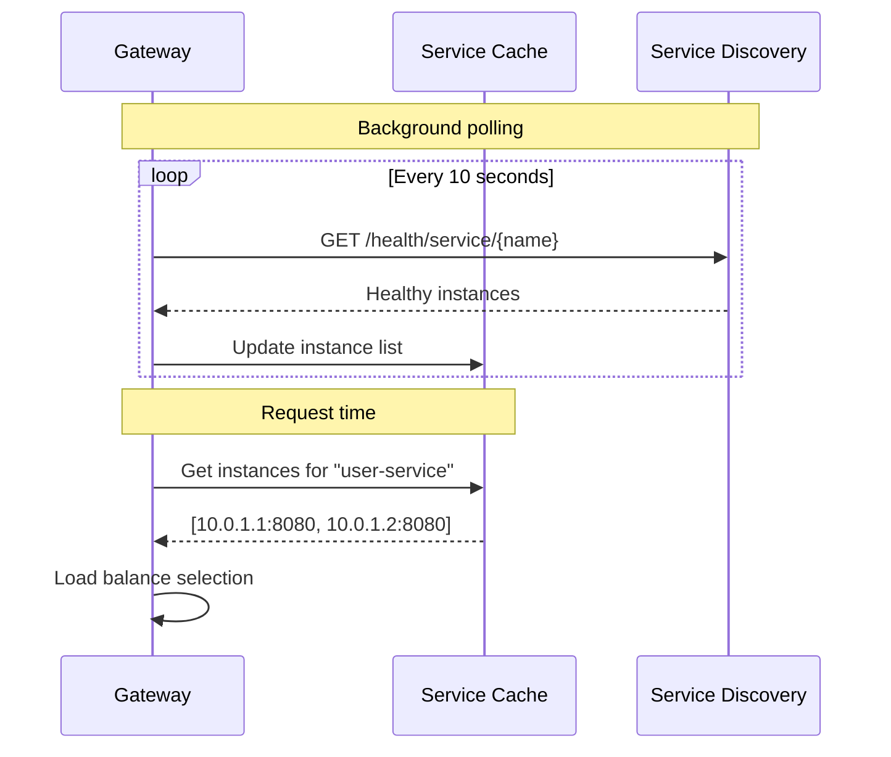

### Gateway ↔ Config Store

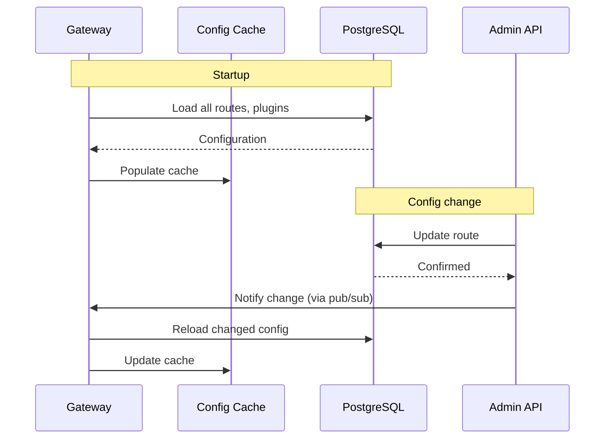

---

## High-Level Architecture Patterns

### Multi-Zone Deployment

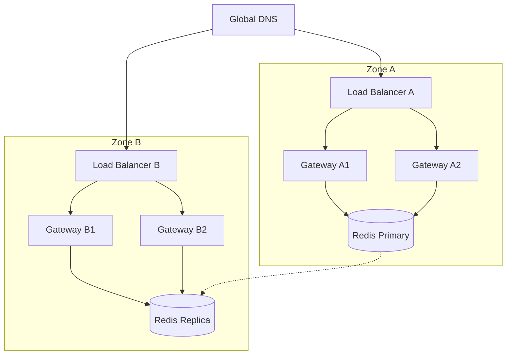

### Request Flow Summary

| Stage | Component | Action | Latency Budget |
|-------|-----------|--------|----------------|
| 1 | TLS Handler | Terminate TLS | 0ms (pooled) |
| 2 | HTTP Parser | Parse request | 0.1ms |
| 3 | Router | Match route | 0.2ms |
| 4 | Auth Plugin | Validate token | 1ms |
| 5 | Rate Limit | Check quota | 1ms |
| 6 | Transform | Modify request | 0.2ms |
| 7 | Load Balancer | Select upstream | 0.1ms |
| 8 | Upstream Pool | Get connection | 0ms (pooled) |
| 9 | Upstream Call | Forward request | (external) |
| 10 | Response Transform | Modify response | 0.2ms |
| 11 | Logging | Access log | 0.1ms (async) |
| **Total Gateway Overhead** | | | **~3ms** |
