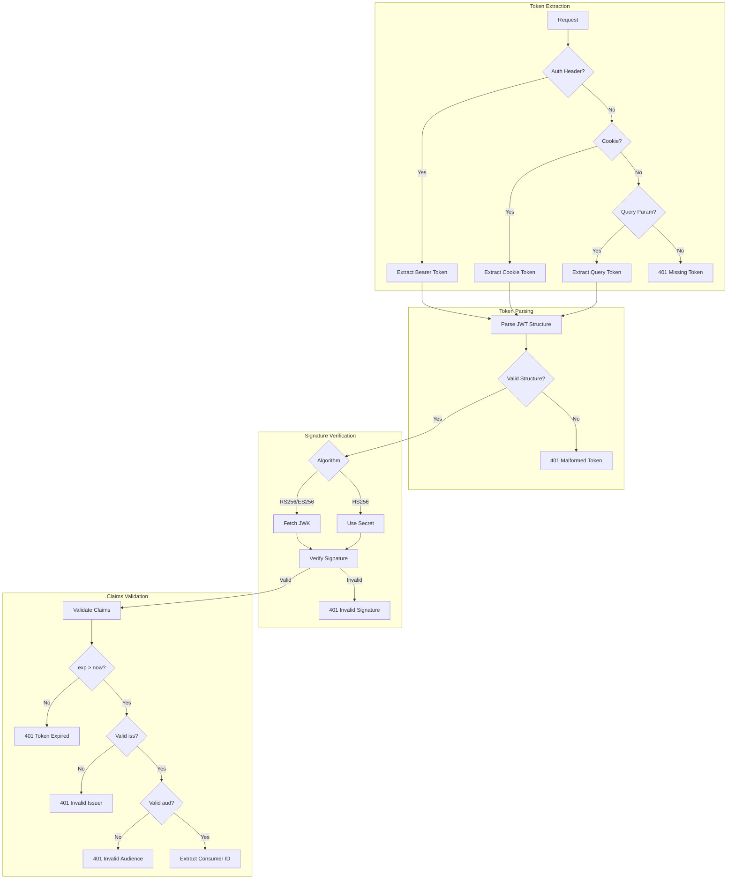
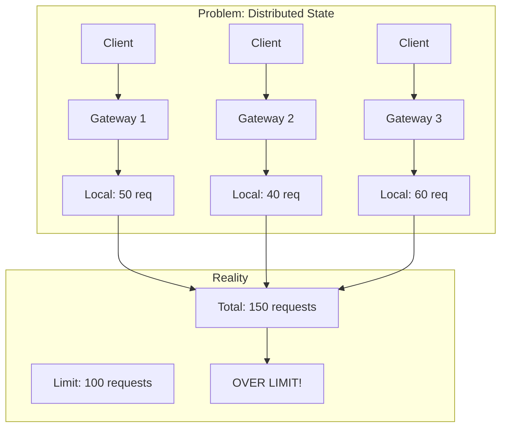

# Deep Dive and Bottlenecks

## Table of Contents
- [Deep Dive 1: Request Router](#deep-dive-1-request-router)
- [Deep Dive 2: Authentication Pipeline](#deep-dive-2-authentication-pipeline)
- [Deep Dive 3: Rate Limiting at Scale](#deep-dive-3-rate-limiting-at-scale)
- [Bottleneck Analysis](#bottleneck-analysis)
- [Race Conditions](#race-conditions)
- [Edge Cases](#edge-cases)

---

## Deep Dive 1: Request Router

### The Routing Problem

An API Gateway must match incoming requests against thousands of route definitions efficiently. A naive O(n) scan through all routes for every request is unacceptable at 100K+ RPS.

### Route Matching Strategies

| Strategy | Time Complexity | Memory | Best For |
|----------|-----------------|--------|----------|
| Linear scan | O(n) | O(n) | < 100 routes |
| HashMap (exact paths) | O(1) | O(n) | Static paths only |
| Trie (prefix tree) | O(k) | O(n×k) | Path hierarchies |
| Radix tree | O(k) | O(n) | Memory-efficient trie |
| Regex compilation | O(n) build, O(m) match | High | Complex patterns |

Where: n = number of routes, k = path depth, m = pattern length

### Trie-Based Router Implementation

```mermaid
graph TD
    ROOT[/] --> API[api]
    ROOT --> HEALTH[health]

    API --> V1[v1]
    API --> V2[v2]

    V1 --> USERS[users]
    V1 --> ORDERS[orders]

    USERS --> USERID["{id}"]
    ORDERS --> ORDERID["{id}"]

    USERID --> PROFILE[profile]

    style USERID fill:#f9f,stroke:#333
    style ORDERID fill:#f9f,stroke:#333
```

**Path:** `/api/v1/users/{id}/profile`
**Traversal:** ROOT → api → v1 → users → {id} → profile

### Priority and Specificity Rules

When multiple routes match, apply priority rules:

```
1. Exact match beats parameter match
   /users/admin > /users/{id}

2. Longer path beats shorter path
   /api/v1/users/{id}/profile > /api/v1/users/{id}

3. More specific host beats wildcard
   api.example.com > *.example.com > *

4. Explicit priority field
   route.priority = 100 > route.priority = 50

5. First registered wins (stable sort)
```

### Hot Path Optimization

```
// Optimized route matching
function matchRouteOptimized(request):
    // 1. Check route cache (LRU)
    cacheKey = request.method + ":" + request.host + ":" + request.path
    cached = routeCache.get(cacheKey)
    if cached != null and cached.isValid():
        return cached

    // 2. Check host-specific trie first (most requests)
    hostTrie = hostTries.get(request.host)
    if hostTrie != null:
        match = matchInTrie(hostTrie, request)
        if match != null:
            routeCache.put(cacheKey, match)
            return match

    // 3. Check wildcard host tries
    for wildcardHost in wildcardHosts:
        if wildcardHost.matches(request.host):
            match = matchInTrie(wildcardHost.trie, request)
            if match != null:
                routeCache.put(cacheKey, match)
                return match

    // 4. Check default trie (no host restriction)
    match = matchInTrie(defaultTrie, request)
    if match != null:
        routeCache.put(cacheKey, match)
        return match

    return null
```

### Route Cache Considerations

| Metric | Value | Notes |
|--------|-------|-------|
| Cache size | 10,000 entries | Top routes by frequency |
| TTL | 5 minutes | Balance freshness vs hit rate |
| Expected hit rate | 80-95% | Most traffic hits few routes |
| Memory per entry | ~500 bytes | Key + route reference |

**Cache invalidation triggers:**
- Route CRUD operations
- Config reload
- TTL expiration

---

## Deep Dive 2: Authentication Pipeline

### JWT Validation Deep Dive



### JWK Caching Strategy

```
JWKCache {
    // In-memory cache
    jwks: Map<uri, CachedJWKSet>

    function getKey(jwksUri, keyId):
        cached = jwks.get(jwksUri)

        if cached == null or cached.isExpired():
            // Fetch with circuit breaker
            if idpCircuitBreaker.canRequest():
                try:
                    jwkSet = fetchJWKS(jwksUri)
                    cached = CachedJWKSet {
                        keys: jwkSet,
                        fetchedAt: now(),
                        expiresAt: now() + 1 hour
                    }
                    jwks.put(jwksUri, cached)
                    idpCircuitBreaker.recordSuccess()
                catch:
                    idpCircuitBreaker.recordFailure()
                    // Fall back to stale cache if available
                    if cached != null:
                        return cached.keys.get(keyId)
                    throw AuthenticationError

        return cached.keys.get(keyId)

    // Background refresh before expiry
    function backgroundRefresh():
        for (uri, cached) in jwks:
            if cached.expiresAt - now() < 10 minutes:
                asyncRefresh(uri)
}
```

### Algorithm Performance Comparison

| Algorithm | Sign | Verify | Key Size | Security Level |
|-----------|------|--------|----------|----------------|
| HS256 | 1μs | 1μs | 256 bits | Symmetric |
| RS256 | 500μs | 50μs | 2048 bits | 112 bits |
| RS384 | 800μs | 80μs | 3072 bits | 128 bits |
| ES256 | 100μs | 150μs | 256 bits | 128 bits |
| ES384 | 200μs | 300μs | 384 bits | 192 bits |

**Recommendation:** ES256 for asymmetric (fast verification, smaller keys)

### Token Revocation Strategies

| Strategy | Latency | Consistency | Implementation |
|----------|---------|-------------|----------------|
| Short-lived tokens | 0ms | Eventually consistent | 5-15 min expiry |
| Token blacklist (Redis) | 1-2ms | Strong | Check blacklist on each request |
| Token introspection | 10-50ms | Strong | Call IdP for each token |
| Token binding | 0ms | Tied to session | Token + session validation |

**Hybrid approach:**
1. Short-lived access tokens (15 min)
2. Redis blacklist for emergency revocation
3. Refresh tokens for session continuity

---

## Deep Dive 3: Rate Limiting at Scale

### Distributed Rate Limiting Challenges



### Solution: Hybrid Local + Global Rate Limiting

```
function checkRateLimitHybrid(consumerId, apiId, config):
    // Layer 1: Local rate limiter (fast rejection)
    localKey = consumerId + ":" + apiId
    localBucket = localRateLimiters.get(localKey)

    if localBucket == null:
        localBucket = TokenBucket(
            capacity: config.limit / numNodes,  // Fair share
            refillRate: config.limit / numNodes / config.window
        )
        localRateLimiters.put(localKey, localBucket)

    if not localBucket.tryConsume(1):
        // Definitely over limit locally
        return {allowed: false, source: "local"}

    // Layer 2: Global rate limiter (accurate)
    globalKey = "ratelimit:" + consumerId + ":" + apiId

    // Async pipeline to Redis (batch multiple requests)
    result = rateLimitPipeline.execute(globalKey, config)

    if result.allowed:
        return {allowed: true}
    else:
        // Global limit exceeded, refund local token
        localBucket.refund(1)
        return {allowed: false, source: "global"}
```

### Redis Rate Limit Script (Atomic)

```lua
-- KEYS[1] = rate limit key
-- ARGV[1] = current timestamp (seconds)
-- ARGV[2] = window size (seconds)
-- ARGV[3] = max requests
-- ARGV[4] = cost (usually 1)

local key = KEYS[1]
local now = tonumber(ARGV[1])
local window = tonumber(ARGV[2])
local limit = tonumber(ARGV[3])
local cost = tonumber(ARGV[4])

-- Get current count and window start
local data = redis.call('HMGET', key, 'count', 'window_start')
local count = tonumber(data[1]) or 0
local windowStart = tonumber(data[2]) or now

-- Check if we're in a new window
if now - windowStart >= window then
    -- New window, reset
    count = 0
    windowStart = now
end

-- Check limit
if count + cost > limit then
    -- Over limit
    local resetAt = windowStart + window
    return {0, limit - count, resetAt - now}  -- denied, remaining, retry_after
end

-- Under limit, increment
count = count + cost
redis.call('HMSET', key, 'count', count, 'window_start', windowStart)
redis.call('EXPIRE', key, window * 2)

return {1, limit - count, 0}  -- allowed, remaining, retry_after
```

### Rate Limit Accuracy vs Latency Trade-off

| Approach | Accuracy | Latency | Redis Ops/req |
|----------|----------|---------|---------------|
| Sync Redis every request | 100% | +2ms | 2 |
| Batch (100ms window) | ~95% | +0.1ms | 0.02 |
| Local only | ~70% | 0ms | 0 |
| Hybrid (local + async global) | ~98% | +0.5ms | 0.5 |

### Handling Rate Limit Bursts

```
function handleBurst(consumerId, config):
    // Allow small bursts above limit
    burstConfig = {
        burstLimit: config.limit * 1.2,  // 20% burst allowance
        burstWindow: 1 second,
        burstPenalty: 5 seconds  // Cooldown after burst
    }

    burstKey = "burst:" + consumerId

    // Check if in burst penalty period
    if redis.exists(burstKey + ":penalty"):
        return {allowed: false, reason: "burst_cooldown"}

    // Check burst counter
    burstCount = redis.get(burstKey + ":count") ?? 0

    if burstCount < burstConfig.burstLimit:
        redis.incr(burstKey + ":count")
        redis.expire(burstKey + ":count", burstConfig.burstWindow)

        if burstCount + 1 >= burstConfig.burstLimit:
            // Burst limit reached, apply penalty
            redis.setex(burstKey + ":penalty", burstConfig.burstPenalty, 1)

        return {allowed: true, burst: true}

    return {allowed: false, reason: "burst_limit"}
```

---

## Bottleneck Analysis

### 1. Plugin Chain Latency

```mermaid
gantt
    title Plugin Chain Latency Budget (5ms total)
    dateFormat X
    axisFormat %L ms

    section Request Phase
    Auth (JWT)      :0, 1500
    Rate Limit      :1500, 2000
    Transform       :2000, 2200
    Custom Plugin 1 :2200, 2500
    Custom Plugin 2 :2500, 2800

    section Routing
    Route Match     :2800, 3000
    Upstream Select :3000, 3100

    section Response Phase
    Transform       :3100, 3300
    Cache           :3300, 3500
    Log (async)     :3500, 3600
```



**Mitigation strategies:**
- Limit plugin count per route (< 10)
- Set per-plugin timeout (500ms max)
- Async execution for non-critical plugins (logging)
- Plugin execution caching where possible

### 2. Connection Pooling Bottleneck

| Scenario | Problem | Solution |
|----------|---------|----------|
| Pool exhaustion | All connections in use | Increase pool size, add wait queue |
| Head-of-line blocking | Slow upstream blocks pool | Per-upstream pools, connection limits |
| Connection leak | Connections not returned | Timeout, health check, forced close |
| Cold start | No pooled connections | Pre-warm pools, lazy initialization |

```
UpstreamPool {
    maxConnections: 100
    minConnections: 10
    maxIdleTime: 60s
    connectionTimeout: 5s
    waitQueueSize: 500
    waitQueueTimeout: 10s

    function getConnection():
        conn = pool.tryAcquire()
        if conn != null:
            return conn

        if pool.size() < maxConnections:
            // Create new connection
            conn = createConnection()
            return conn

        if waitQueue.size() < waitQueueSize:
            // Wait for available connection
            return waitQueue.await(waitQueueTimeout)

        throw PoolExhaustedException
}
```

### 3. TLS Termination Overhead

| Operation | Time | CPU Cost |
|-----------|------|----------|
| Full TLS 1.2 handshake | 100-300ms | 10-20ms CPU |
| Full TLS 1.3 handshake | 50-150ms | 5-10ms CPU |
| TLS 1.3 0-RTT resumption | 0ms added | 1ms CPU |
| Session resumption | 10-30ms | 2-5ms CPU |
| Per-request encryption | 0.1ms | 0.05ms CPU |

**Mitigation:**
- Enable TLS 1.3 with 0-RTT
- Use session tickets for resumption
- Hardware TLS offload (HSM) for high volume
- ECDSA certificates (faster than RSA)

### 4. Configuration Reload Latency

```
Config reload timeline:

T+0ms:    Admin API receives update
T+10ms:   Write to database
T+20ms:   Publish change notification (pub/sub)
T+30ms:   Gateway nodes receive notification
T+50ms:   Nodes fetch updated config
T+100ms:  Nodes rebuild route trie
T+150ms:  New config active

Total propagation: ~150ms

During propagation:
- Some nodes may have old config
- Requests may be routed inconsistently
```

**Mitigation:**
- Canary config deployments
- Gradual rollout (10% → 50% → 100%)
- Config versioning for debugging

---

## Race Conditions

### Race Condition 1: Rate Limit Counter

**Problem:** Two requests arrive simultaneously, both read counter = 99, both increment to 100.

```
Timeline:
T1: Request A reads counter = 99
T2: Request B reads counter = 99
T3: Request A writes counter = 100
T4: Request B writes counter = 100
Result: 2 requests allowed, should be 1
```

**Solution:** Atomic Redis operations

```lua
-- Use MULTI/EXEC or Lua script
local count = redis.call('INCR', key)
if count > limit then
    redis.call('DECR', key)  -- Rollback
    return 0  -- Denied
end
return 1  -- Allowed
```

### Race Condition 2: Circuit Breaker State

**Problem:** Multiple requests see circuit as closed, all fail, multiple threads try to open.

```
Timeline:
T1: Request A fails (error count = 4)
T2: Request B fails (error count = 5, threshold hit)
T3: Thread A tries to open circuit
T4: Thread B tries to open circuit
T5: Thread A opens circuit
T6: Thread B re-opens circuit (duplicate)
```

**Solution:** Compare-and-swap state transitions

```
function transitionToOpen():
    while true:
        currentState = circuitState.get()
        if currentState != CLOSED:
            return  // Already transitioned

        if circuitState.compareAndSet(CLOSED, OPEN):
            lastStateChange = now()
            return
        // CAS failed, retry
```

### Race Condition 3: Config Reload During Request

**Problem:** Request starts with old config, config changes mid-request.

```
Timeline:
T1: Request starts, loads route R1 (version 1)
T2: Config reload, R1 updated to version 2
T3: Request tries to use R1's plugin config
T4: Plugin config has changed!
```

**Solution:** Config snapshot per request

```
function handleRequest(request):
    // Capture config snapshot at request start
    configSnapshot = configStore.snapshot()

    // Use snapshot throughout request lifetime
    route = configSnapshot.matchRoute(request)
    plugins = configSnapshot.getPlugins(route)

    // Snapshot is immutable, safe from concurrent updates
```

---

## Edge Cases

### Edge Case 1: Upstream Returns Slowly

**Scenario:** Upstream takes 30 seconds to respond, exhausting connection pool.

**Handling:**
```
UpstreamConfig {
    connectTimeout: 5s      // Max time to establish connection
    readTimeout: 30s        // Max time to read response
    writeTimeout: 10s       // Max time to write request

    // Circuit breaker for slow upstreams
    slowCallDurationThreshold: 10s
    slowCallRateThreshold: 50%  // Trip if >50% calls are slow
}
```

### Edge Case 2: Large Request/Response Bodies

**Scenario:** Client sends 100MB request body.

**Handling:**
```
function handleLargeBody(request, config):
    if request.contentLength > config.maxBodySize:
        return 413 Payload Too Large

    // Stream body instead of buffering
    if request.contentLength > config.bufferThreshold:
        // Stream directly to upstream
        pipeToUpstream(request.bodyStream, upstream)
    else:
        // Buffer small bodies for transformation
        body = request.readBody()
        transformedBody = transform(body)
        sendToUpstream(transformedBody)
```

### Edge Case 3: Client Disconnects Mid-Request

**Scenario:** Client closes connection while upstream is processing.

**Handling:**
```
function handleClientDisconnect(request):
    // Option 1: Cancel upstream request
    if config.cancelOnClientDisconnect:
        upstreamRequest.cancel()
        cleanupResources()
        return

    // Option 2: Let upstream complete (for non-idempotent)
    if request.method in ["POST", "PUT", "DELETE"]:
        // Complete the request, discard response
        try:
            response = await upstreamRequest
            logCompletedButDiscarded(response)
        catch:
            logUpstreamError()
```

### Edge Case 4: WebSocket Upgrade with Auth Expiry

**Scenario:** JWT expires during long-running WebSocket connection.

**Handling:**
```
WebSocketHandler {
    function onUpgrade(request):
        token = validateJWT(request)
        // Store expiry for periodic check
        connectionMetadata.tokenExpiry = token.exp

    function periodicCheck():
        for conn in activeConnections:
            if conn.tokenExpiry < now() + 60s:
                // Token expiring soon
                conn.sendMessage(type: "token_refresh_required")

            if conn.tokenExpiry < now():
                // Token expired
                conn.close(code: 4001, reason: "Token expired")
}
```

### Edge Case 5: Circular Redirect Loop

**Scenario:** Route A redirects to B, B redirects to A.

**Handling:**
```
function executePluginChain(request, context):
    if context.redirectCount > config.maxRedirects:
        return 508 Loop Detected

    result = processPlugins(request)

    if result.isRedirect():
        context.redirectCount++
        return executePluginChain(result.redirectRequest, context)

    return result
```

### Edge Case 6: Plugin Throws Exception

**Scenario:** Custom plugin throws unhandled exception.

**Handling:**
```
function executePlugin(plugin, context):
    try:
        startTime = now()
        result = plugin.execute(context)
        recordPluginLatency(plugin.name, now() - startTime)
        return result
    catch TimeoutException:
        recordPluginTimeout(plugin.name)
        if plugin.required:
            return 504 Gateway Timeout
        else:
            // Skip optional plugin
            return context
    catch Exception as e:
        recordPluginError(plugin.name, e)
        if plugin.failOpen:
            // Continue without this plugin
            return context
        else:
            return 500 Internal Server Error
```
