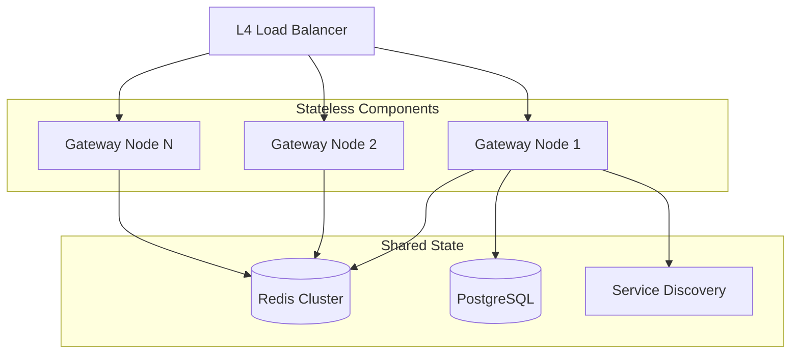
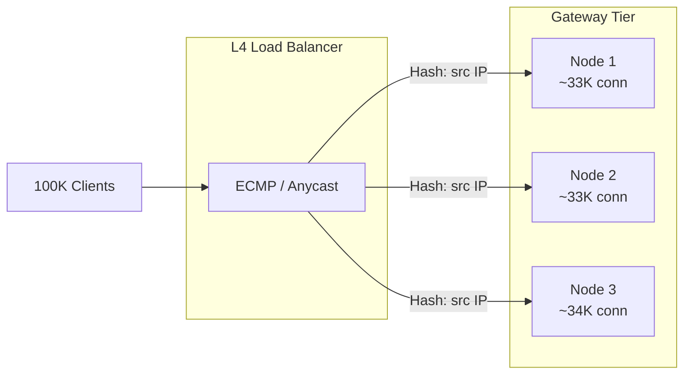
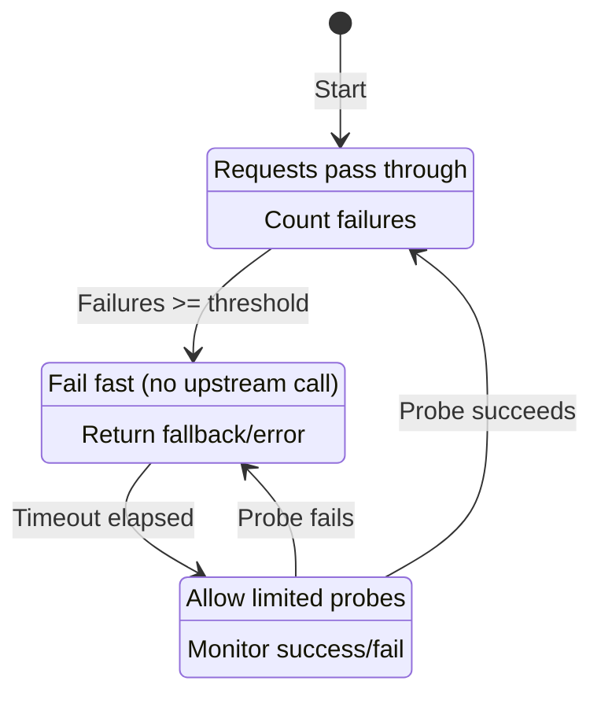
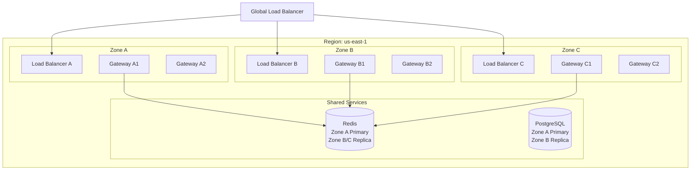
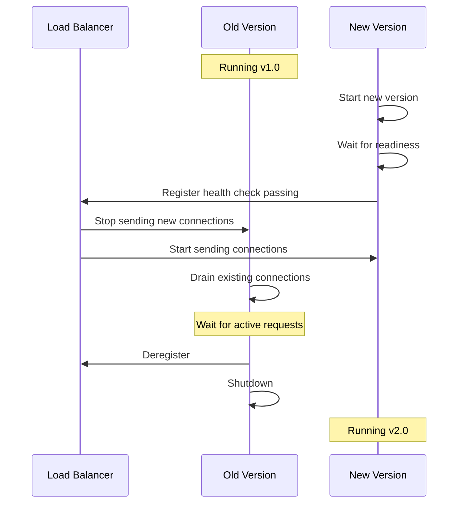
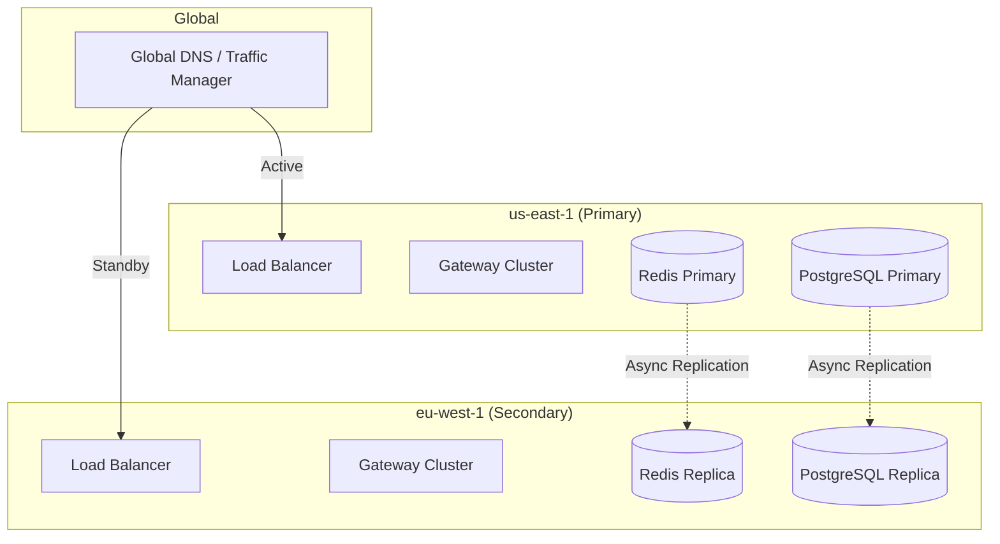

# Scalability and Reliability

## Table of Contents
- [Horizontal Scaling](#horizontal-scaling)
- [Vertical Scaling](#vertical-scaling)
- [Fault Tolerance](#fault-tolerance)
- [High Availability](#high-availability)
- [Disaster Recovery](#disaster-recovery)
- [Performance Tuning](#performance-tuning)

---

## Horizontal Scaling

### Stateless Gateway Design

The API Gateway is designed to be stateless, enabling simple horizontal scaling:



**Stateless guarantees:**
- No session affinity required
- Any node can handle any request
- Nodes can be added/removed without coordination
- Simple failover (no state migration)

### Auto-Scaling Configuration

```yaml
# Auto-scaling policy
autoscaling:
  minReplicas: 3
  maxReplicas: 50
  metrics:
    - type: cpu
      target:
        averageUtilization: 70
    - type: memory
      target:
        averageUtilization: 80
    - type: custom
      name: requests_per_second
      target:
        averageValue: 10000
    - type: custom
      name: request_queue_depth
      target:
        averageValue: 100

  scaleUp:
    stabilizationWindowSeconds: 30
    policies:
      - type: Percent
        value: 100
        periodSeconds: 30
      - type: Pods
        value: 4
        periodSeconds: 30

  scaleDown:
    stabilizationWindowSeconds: 300
    policies:
      - type: Percent
        value: 10
        periodSeconds: 60
```

### Scale-Out Triggers

| Metric | Threshold | Action |
|--------|-----------|--------|
| CPU utilization | > 70% sustained | Add 1 node |
| Memory utilization | > 80% | Add 1 node |
| RPS per node | > 40K | Add 1 node |
| Request queue depth | > 500 | Add 2 nodes |
| p99 latency | > 50ms | Investigate, possibly scale |
| Error rate | > 1% | Investigate (may not help to scale) |

### Connection Distribution



**Load balancer algorithms for gateway tier:**
- **Round-robin**: Simple, even distribution for short requests
- **Least connections**: Better for long-lived connections (WebSocket)
- **Source IP hash**: Session affinity if needed (not recommended)

---

## Vertical Scaling

### When to Scale Vertically

| Scenario | Vertical | Horizontal |
|----------|----------|------------|
| More concurrent connections | Larger instance (more memory) | More nodes |
| Higher RPS | Faster CPU | More nodes |
| Complex transformations | Faster CPU | More nodes |
| Large request/response bodies | More memory | - |
| TLS-heavy workload | CPU or TLS accelerator | More nodes |

### Recommended Instance Sizes

| Workload | CPU | Memory | Network | RPS Capacity |
|----------|-----|--------|---------|--------------|
| Light | 4 cores | 8 GB | 1 Gbps | 10K |
| Medium | 8 cores | 16 GB | 10 Gbps | 30K |
| Heavy | 16 cores | 32 GB | 25 Gbps | 75K |
| Extreme | 32 cores | 64 GB | 100 Gbps | 150K |

### Memory Sizing Guidelines

```
Memory allocation breakdown:

Base runtime:           500 MB
Route table (10K routes): 50 MB
Plugin configs:          100 MB
JWK cache:              50 MB
Rate limit local cache:  200 MB
Connection buffers:      (connections × 20KB)

For 50K connections:
Connection memory = 50K × 20KB = 1 GB

Total = 500 + 50 + 100 + 50 + 200 + 1000 = ~2 GB minimum
Recommended: 4x headroom = 8 GB
```

---

## Fault Tolerance

### Circuit Breaker Pattern



### Circuit Breaker Configuration

```yaml
circuitBreaker:
  # Conditions to trip circuit
  failureThreshold: 5          # Consecutive failures
  failureRateThreshold: 50     # % failure rate
  slowCallDurationThreshold: 10s
  slowCallRateThreshold: 80    # % slow calls

  # Windows
  slidingWindowType: COUNT_BASED
  slidingWindowSize: 100       # Requests to consider
  minimumNumberOfCalls: 10     # Min calls before evaluating

  # Recovery
  waitDurationInOpenState: 30s # Time before half-open
  permittedNumberOfCallsInHalfOpenState: 5

  # Fallback
  fallbackEnabled: true
  fallbackResponse:
    status: 503
    body: '{"error": "Service temporarily unavailable"}'
```

### Retry Policies

```yaml
retry:
  maxRetries: 3
  retryOn:
    - 502  # Bad Gateway
    - 503  # Service Unavailable
    - 504  # Gateway Timeout
    - CONNECT_FAILURE
    - REFUSED_STREAM

  backoff:
    type: exponential
    baseDelay: 100ms
    maxDelay: 10s
    multiplier: 2
    jitter: 0.1  # 10% jitter

  # Idempotency
  retryIdempotentOnly: true
  idempotentMethods:
    - GET
    - HEAD
    - OPTIONS
    - PUT
    - DELETE

  # Budget
  retryBudget:
    percentOfRequests: 20  # Max 20% of requests can be retries
    minRetriesPerSecond: 10
```

### Graceful Degradation Strategies

| Scenario | Degradation Strategy |
|----------|---------------------|
| Auth service down | Fail open (bypass auth) for internal APIs |
| Rate limit Redis down | Fall back to local rate limiting |
| Config store down | Use cached config |
| Upstream slow | Return cached response if available |
| All upstreams down | Return maintenance page |

```
function handleAuthServiceDown():
    if authCircuitBreaker.isOpen():
        if request.isInternal():
            // Trust internal traffic, add warning header
            context.addHeader("X-Auth-Degraded", "true")
            return CONTINUE
        else:
            // Reject external traffic
            return 503 Service Unavailable
```

### Request Hedging

For latency-sensitive APIs, send parallel requests to multiple upstream instances:

```
function hedgedRequest(upstream, request, config):
    // Start first request
    primaryRequest = sendAsync(upstream.instance[0], request)

    // Wait for threshold
    result = primaryRequest.waitFor(config.hedgeDelay)  // e.g., p90 latency

    if result != null:
        return result

    // Primary is slow, hedge with backup
    hedgeRequest = sendAsync(upstream.instance[1], request)

    // Return whichever completes first
    return awaitFirst([primaryRequest, hedgeRequest])
```

**Caution:** Only use for read-only, idempotent requests.

---

## High Availability

### Multi-Zone Deployment



### Health Check Configuration

```yaml
healthCheck:
  # Liveness: Is the process running?
  liveness:
    path: /health/live
    interval: 10s
    timeout: 5s
    successThreshold: 1
    failureThreshold: 3

  # Readiness: Can we accept traffic?
  readiness:
    path: /health/ready
    interval: 5s
    timeout: 3s
    successThreshold: 1
    failureThreshold: 2
    # Ready when:
    checks:
      - configLoaded: true
      - upstreamsDiscovered: true
      - redisConnected: true
```

### Zero-Downtime Deployment



**Connection draining:**
```yaml
deployment:
  strategy: RollingUpdate
  rollingUpdate:
    maxUnavailable: 0
    maxSurge: 25%

  terminationGracePeriodSeconds: 60

  lifecycle:
    preStop:
      exec:
        command:
          - /bin/sh
          - -c
          - |
            # Stop accepting new connections
            curl -X POST localhost:8001/health/drain
            # Wait for active connections to complete
            sleep 30
```

### Failure Scenarios and Recovery

| Failure | Detection | Recovery |
|---------|-----------|----------|
| Single node crash | Health check fail (10s) | LB routes around |
| Zone failure | Multiple health check fails | GSLB routes to other zones |
| Redis failure | Connection timeout | Fall back to local rate limiting |
| Config store failure | Connection timeout | Use cached config |
| Upstream service failure | Circuit breaker | Return fallback, retry |
| Network partition | Timeout | Route to reachable upstreams |

---

## Disaster Recovery

### Multi-Region Architecture



### RTO and RPO Targets

| Scenario | RTO (Recovery Time) | RPO (Data Loss) |
|----------|---------------------|-----------------|
| Single node failure | < 30 seconds | 0 |
| Zone failure | < 2 minutes | 0 |
| Region failure | < 5 minutes | < 1 minute |
| Complete data loss | < 1 hour | < 5 minutes |

### Failover Procedures

**Automated failover (zone):**
```
1. Health check fails for zone
2. GSLB automatically routes traffic to healthy zones
3. No manual intervention required
4. Alert sent to on-call team
```

**Semi-automated failover (region):**
```
1. Region health degrades below threshold
2. Alert triggers failover decision
3. Operator confirms failover
4. DNS TTL expires, traffic shifts (typically 60s)
5. Secondary region becomes primary
6. Replication reversed when original region recovers
```

### Configuration Backup

```yaml
backup:
  # Database backups
  database:
    schedule: "0 */6 * * *"  # Every 6 hours
    retention: 30 days
    storage: object-storage-bucket

  # Config snapshots
  config:
    onEveryChange: true
    schedule: "0 0 * * *"  # Daily full snapshot
    retention: 90 days

  # Route definitions export
  routes:
    format: yaml
    storage: git-repository
    autoCommit: true
```

---

## Performance Tuning

### OS-Level Tuning

```bash
# /etc/sysctl.conf

# Increase file descriptor limits
fs.file-max = 1000000

# TCP tuning
net.core.somaxconn = 65535
net.core.netdev_max_backlog = 65535
net.ipv4.tcp_max_syn_backlog = 65535

# Keep-alive
net.ipv4.tcp_keepalive_time = 60
net.ipv4.tcp_keepalive_intvl = 10
net.ipv4.tcp_keepalive_probes = 6

# TIME_WAIT reduction
net.ipv4.tcp_tw_reuse = 1
net.ipv4.tcp_fin_timeout = 15

# Connection tracking
net.netfilter.nf_conntrack_max = 1000000

# Local port range
net.ipv4.ip_local_port_range = 1024 65535
```

### Gateway Configuration Tuning

```yaml
gateway:
  # Worker processes
  workers: auto  # One per CPU core
  workerConnections: 65535

  # Timeouts
  clientHeaderTimeout: 60s
  clientBodyTimeout: 60s
  sendTimeout: 60s
  keepaliveTimeout: 75s
  keepaliveRequests: 10000

  # Buffers
  clientHeaderBufferSize: 1k
  largeClientHeaderBuffers: 4 8k
  clientBodyBufferSize: 128k
  clientMaxBodySize: 10m

  # Upstream
  upstreamKeepalive: 100
  upstreamKeepaliveTimeout: 60s
  upstreamKeepaliveRequests: 10000
```

### Connection Pool Tuning

| Parameter | Low Traffic | Medium Traffic | High Traffic |
|-----------|------------|----------------|--------------|
| Max connections per upstream | 50 | 100 | 500 |
| Min idle connections | 5 | 20 | 50 |
| Max idle time | 120s | 60s | 30s |
| Connection timeout | 10s | 5s | 3s |
| Request timeout | 60s | 30s | 10s |

### Cache Tuning

```yaml
cache:
  # Route cache
  routeCache:
    maxEntries: 10000
    ttlSeconds: 300
    evictionPolicy: LRU

  # Response cache
  responseCache:
    enabled: true
    maxSize: 1GB
    defaultTtl: 60s
    methods: [GET, HEAD]
    cacheControl: true  # Honor Cache-Control headers

  # JWK cache
  jwkCache:
    maxEntries: 100
    ttlSeconds: 3600
    refreshBeforeExpiry: 300s
```

### Latency Optimization Checklist

| Optimization | Impact | Implementation |
|--------------|--------|----------------|
| Connection pooling | -5-10ms | Reuse upstream connections |
| Route caching | -0.5ms | Cache route matches |
| JWK caching | -10-50ms | Cache public keys locally |
| TLS session resumption | -50-100ms | Enable session tickets |
| DNS caching | -1-5ms | Cache upstream resolution |
| Async logging | -0.5ms | Non-blocking log writes |
| HTTP/2 to upstreams | -1-2ms | Multiplexing reduces connections |
| Response caching | Variable | Skip upstream entirely |
