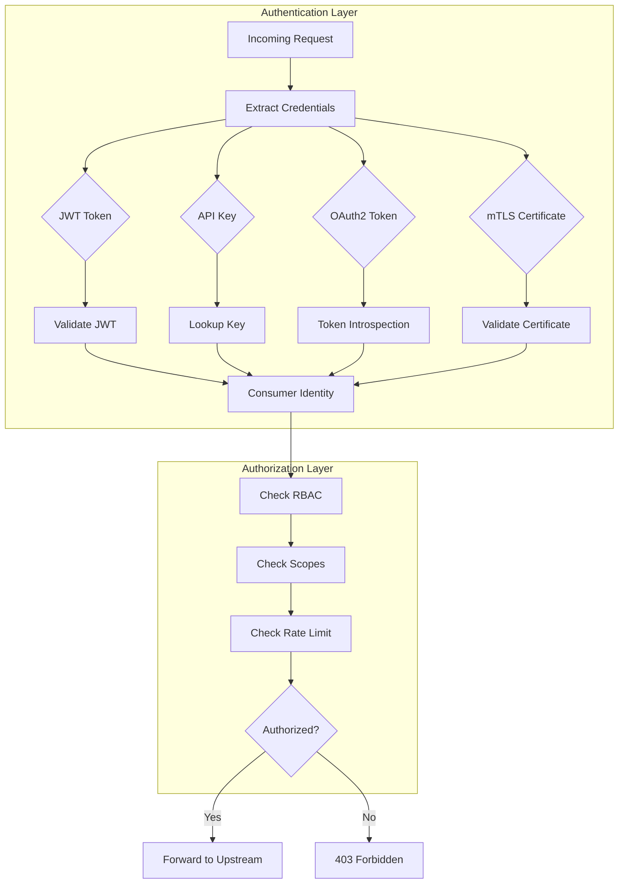
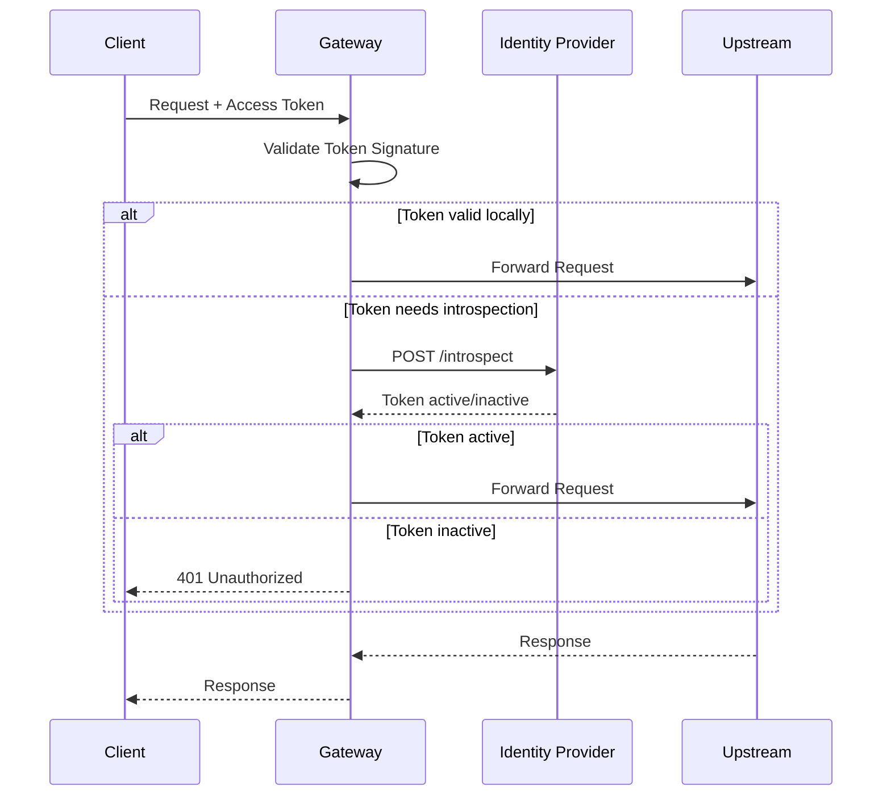
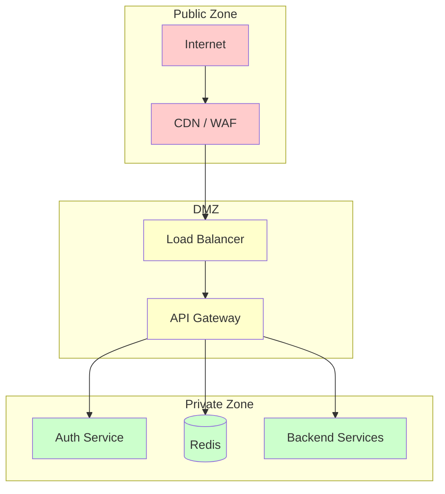
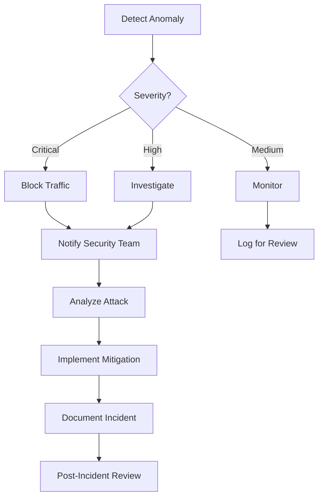

# Security and Compliance

## Table of Contents
- [Authentication and Authorization](#authentication-and-authorization)
- [Threat Model](#threat-model)
- [Data Security](#data-security)
- [Network Security](#network-security)
- [Compliance Requirements](#compliance-requirements)
- [Security Operations](#security-operations)

---

## Authentication and Authorization

### Authentication Methods



### JWT Authentication

```yaml
jwtAuth:
  # Token extraction
  tokenSources:
    - header: Authorization
      prefix: "Bearer "
    - cookie: access_token
    - query: token

  # Signature verification
  algorithms:
    - ES256  # Recommended
    - RS256
    # - HS256  # Not recommended for production

  # Key sources
  jwksUri: "https://auth.example.com/.well-known/jwks.json"
  jwksCacheTtl: 3600s
  jwksRefreshInterval: 300s

  # Claims validation
  requiredClaims:
    - exp  # Expiration
    - iss  # Issuer
    - sub  # Subject

  issuer: "https://auth.example.com"
  audience: "api.example.com"

  # Clock skew tolerance
  clockSkew: 60s

  # Consumer identification
  consumerClaim: "sub"  # or "client_id" for OAuth2 clients
```

### OAuth2/OIDC Integration



**OAuth2 scopes enforcement:**
```yaml
oauth2:
  # Required scopes per route
  routes:
    - path: "/api/users"
      method: GET
      requiredScopes: ["users:read"]
    - path: "/api/users"
      method: POST
      requiredScopes: ["users:write"]
    - path: "/api/admin/*"
      requiredScopes: ["admin"]

  # Scope claim location
  scopesClaim: "scope"  # or "scp" for Azure AD
  scopesSeparator: " "  # space-separated scopes
```

### API Key Authentication

```yaml
apiKey:
  # Key extraction
  sources:
    - header: X-API-Key
    - header: Authorization
      prefix: "ApiKey "
    - query: api_key

  # Key storage
  storage:
    type: database  # or redis for high-volume
    hashAlgorithm: sha256  # Store hashed keys

  # Key properties
  keyLength: 32  # Characters
  keyPrefix: "sk_"  # e.g., sk_live_abc123

  # Rate limiting per key
  defaultRateLimit:
    requestsPerSecond: 100
    requestsPerDay: 100000
```

### Mutual TLS (mTLS)

```yaml
mtls:
  enabled: true

  # Client certificate requirements
  clientCertificate:
    required: true
    verifyDepth: 3

  # Trusted CA certificates
  trustedCAs:
    - /etc/certs/ca-bundle.crt

  # Certificate validation
  validation:
    checkRevocation: true  # OCSP or CRL
    ocspResponderUrl: "https://ocsp.example.com"
    crlDistributionPoint: "https://crl.example.com/crl.pem"

  # Identity extraction from certificate
  consumerMapping:
    field: "CN"  # Common Name
    # or "O" (Organization), "OU" (Organizational Unit)
```

### Authorization Models

| Model | Description | Use Case |
|-------|-------------|----------|
| **RBAC** | Role-based access | User roles → permissions |
| **ABAC** | Attribute-based access | Dynamic rules based on attributes |
| **Scope-based** | OAuth2 scopes | API-level permissions |
| **ACL** | Access control lists | Resource-specific permissions |

```yaml
authorization:
  model: rbac

  roles:
    admin:
      permissions: ["*"]
    developer:
      permissions:
        - "api:read"
        - "api:write"
    viewer:
      permissions:
        - "api:read"

  # Route-level requirements
  routes:
    - path: "/admin/*"
      requiredPermissions: ["admin"]
    - path: "/api/*"
      requiredPermissions: ["api:read"]
```

---

## Threat Model

### STRIDE Analysis

| Threat | Gateway Risk | Mitigation |
|--------|--------------|------------|
| **Spoofing** | Fake identity tokens | JWT validation, mTLS, API key rotation |
| **Tampering** | Request modification | TLS, request signing, integrity checks |
| **Repudiation** | Deny actions | Comprehensive audit logging |
| **Information Disclosure** | Data leakage | TLS, response masking, error sanitization |
| **Denial of Service** | Resource exhaustion | Rate limiting, circuit breakers, WAF |
| **Elevation of Privilege** | Unauthorized access | RBAC, scope validation, least privilege |

### Attack Vectors and Mitigations

#### DDoS Protection

```yaml
ddosProtection:
  # Connection-level
  maxConnections: 100000
  maxConnectionsPerIP: 100
  connectionRateLimit: 1000/s/ip

  # Request-level
  requestRateLimit:
    perIP: 1000/minute
    perConsumer: 10000/minute
    global: 1000000/minute

  # Slowloris protection
  clientHeaderTimeout: 10s
  clientBodyTimeout: 10s

  # Payload limits
  maxRequestSize: 10MB
  maxHeaderSize: 8KB
  maxHeaderCount: 100
```

#### Injection Attacks

```yaml
inputValidation:
  # SQL injection prevention (if transforming queries)
  sqlInjection:
    enabled: true
    action: block

  # XSS prevention
  xss:
    enabled: true
    sanitizeHeaders:
      - X-Custom-Header
    sanitizeBody: true

  # Path traversal
  pathTraversal:
    enabled: true
    blockPatterns:
      - ".."
      - "%2e%2e"

  # Request smuggling
  requestSmuggling:
    strictHttpParsing: true
    rejectAmbiguousRequests: true
```

#### Token-Based Attacks

| Attack | Description | Mitigation |
|--------|-------------|------------|
| Token theft | Stolen JWT used by attacker | Short expiry (15 min), token binding |
| Token replay | Reusing captured token | Nonce/jti claim, token binding |
| Algorithm confusion | Attacker changes alg header | Explicit algorithm allowlist |
| Key confusion | Attacker substitutes key | Pin expected kid values |
| Brute force | Guessing API keys | Key length, rate limiting, monitoring |

```yaml
tokenSecurity:
  # Prevent algorithm confusion
  allowedAlgorithms:
    - ES256
    - RS256
  # Never allow "none" or symmetric in asymmetric context

  # Token binding (DPoP)
  dpop:
    enabled: true
    required: false  # Gradually enable

  # Replay prevention
  jtiValidation:
    enabled: true
    storage: redis
    ttl: 900s  # Token lifetime
```

### CORS Policy

```yaml
cors:
  # Allowed origins
  allowedOrigins:
    - "https://app.example.com"
    - "https://*.example.com"  # Wildcard subdomain

  # Allowed methods
  allowedMethods:
    - GET
    - POST
    - PUT
    - DELETE
    - OPTIONS

  # Allowed headers
  allowedHeaders:
    - Authorization
    - Content-Type
    - X-Request-ID

  # Exposed headers (accessible to JS)
  exposedHeaders:
    - X-RateLimit-Remaining
    - X-Request-ID

  # Credentials
  allowCredentials: true

  # Preflight cache
  maxAge: 86400  # 24 hours
```

---

## Data Security

### TLS Configuration

```yaml
tls:
  # Minimum version
  minVersion: TLSv1.2
  preferredVersion: TLSv1.3

  # Cipher suites (TLS 1.2)
  cipherSuites:
    - TLS_ECDHE_RSA_WITH_AES_256_GCM_SHA384
    - TLS_ECDHE_RSA_WITH_AES_128_GCM_SHA256
    - TLS_ECDHE_ECDSA_WITH_AES_256_GCM_SHA384
    - TLS_ECDHE_ECDSA_WITH_AES_128_GCM_SHA256

  # TLS 1.3 cipher suites (automatically selected)
  tls13CipherSuites:
    - TLS_AES_256_GCM_SHA384
    - TLS_CHACHA20_POLY1305_SHA256
    - TLS_AES_128_GCM_SHA256

  # Certificate
  certificate: /etc/certs/server.crt
  privateKey: /etc/certs/server.key

  # HSTS
  hsts:
    enabled: true
    maxAge: 31536000  # 1 year
    includeSubdomains: true
    preload: true

  # OCSP stapling
  ocspStapling: true
```

### Sensitive Data Handling

```yaml
dataMasking:
  # Request masking
  request:
    headers:
      - name: Authorization
        action: mask
        visibleChars: 10  # "Bearer ey...MASKED"
      - name: X-API-Key
        action: redact  # Completely remove

    body:
      jsonPaths:
        - "$.password"
        - "$.credit_card"
        - "$.ssn"
      action: mask

  # Response masking
  response:
    headers:
      - name: Set-Cookie
        action: mask

  # Log masking
  logs:
    maskPatterns:
      - "password=.*?(&|$)"
      - "\\b[A-Za-z0-9._%+-]+@[A-Za-z0-9.-]+\\.[A-Z|a-z]{2,}\\b"  # Email
      - "\\b\\d{3}-\\d{2}-\\d{4}\\b"  # SSN
```

### Secrets Management

```yaml
secrets:
  # External secrets manager
  provider: vault  # or aws-secrets-manager, azure-keyvault

  # Vault configuration
  vault:
    address: "https://vault.internal:8200"
    authMethod: kubernetes
    role: api-gateway
    secretPath: secret/data/gateway

  # Secret rotation
  rotation:
    enabled: true
    checkInterval: 300s

  # Secrets to fetch
  secrets:
    - name: jwt_secret
      path: secret/data/gateway/jwt
      key: secret
    - name: redis_password
      path: secret/data/gateway/redis
      key: password
```

---

## Network Security

### Network Segmentation



### Firewall Rules

| Source | Destination | Port | Protocol | Action |
|--------|-------------|------|----------|--------|
| Internet | CDN/WAF | 443 | HTTPS | Allow |
| CDN | Load Balancer | 443 | HTTPS | Allow |
| Load Balancer | Gateway | 8443 | HTTPS | Allow |
| Gateway | Auth Service | 8080 | HTTP | Allow |
| Gateway | Redis | 6379 | TCP | Allow |
| Gateway | Upstreams | 8080 | HTTP | Allow |
| Gateway | Upstreams | 8443 | HTTPS | Allow |
| * | * | * | * | Deny |

### IP Allowlisting/Blocklisting

```yaml
ipAccess:
  # Global blocklist
  blocklist:
    - "192.0.2.0/24"  # Known bad actors
    - "10.0.0.0/8"    # Prevent internal IP spoofing

  # Route-specific allowlist
  routes:
    - path: "/admin/*"
      allowlist:
        - "10.0.100.0/24"  # Admin network only
        - "203.0.113.50"   # Specific admin IP

  # Geo blocking
  geoBlocking:
    enabled: true
    blockedCountries:
      - "XX"  # Sanctioned countries
    allowedCountries: []  # Empty = allow all except blocked
```

---

## Compliance Requirements

### GDPR Compliance

| Requirement | Implementation |
|-------------|----------------|
| Data minimization | Log only necessary fields |
| Right to erasure | API for log deletion |
| Data residency | Regional gateway deployment |
| Consent tracking | Pass-through consent headers |
| Breach notification | Alert on security events |

```yaml
gdpr:
  # Data residency
  dataResidency:
    eu:
      regions: [eu-west-1, eu-central-1]
      logStorage: eu-logs-bucket
    us:
      regions: [us-east-1, us-west-2]
      logStorage: us-logs-bucket

  # PII handling
  piiFields:
    mask:
      - ip_address
      - user_agent
    anonymize:
      - user_id  # Hash before logging

  # Retention
  logRetention:
    accessLogs: 90 days
    auditLogs: 7 years
```

### SOC 2 Requirements

| Control | Implementation |
|---------|----------------|
| Access controls | RBAC, MFA for admin |
| Audit logging | All admin actions logged |
| Change management | Config versioning, approval workflow |
| Encryption | TLS 1.2+, encryption at rest |
| Availability | Multi-zone deployment, SLA monitoring |

```yaml
soc2:
  # Audit logging
  auditLog:
    enabled: true
    events:
      - config_change
      - route_created
      - route_deleted
      - plugin_enabled
      - credential_rotated
      - admin_login

  # Admin access
  adminAccess:
    mfaRequired: true
    sessionTimeout: 30m
    ipAllowlist:
      - "10.0.100.0/24"

  # Change approval
  changeManagement:
    requireApproval: true
    approvers: ["security-team"]
    notifyOnChange: true
```

### PCI DSS Requirements (for payment APIs)

| Requirement | Implementation |
|-------------|----------------|
| Req 1: Firewall | Network segmentation |
| Req 2: No defaults | Custom configs, no default creds |
| Req 3: Protect stored data | No cardholder data stored |
| Req 4: Encrypt transmission | TLS 1.2+ required |
| Req 6: Secure systems | Vulnerability scanning |
| Req 10: Track access | Comprehensive logging |

---

## Security Operations

### Security Headers

```yaml
securityHeaders:
  # Always set
  add:
    - name: X-Content-Type-Options
      value: "nosniff"
    - name: X-Frame-Options
      value: "DENY"
    - name: X-XSS-Protection
      value: "1; mode=block"
    - name: Referrer-Policy
      value: "strict-origin-when-cross-origin"
    - name: Content-Security-Policy
      value: "default-src 'self'"
    - name: Permissions-Policy
      value: "geolocation=(), microphone=(), camera=()"

  # Remove potentially dangerous headers
  remove:
    - Server
    - X-Powered-By
    - X-AspNet-Version
```

### Security Monitoring

```yaml
securityMonitoring:
  # Real-time alerts
  alerts:
    - name: high_auth_failure_rate
      condition: auth_failures > 100/minute
      severity: high
      action: alert

    - name: unusual_traffic_pattern
      condition: rps_deviation > 3_sigma
      severity: medium
      action: alert

    - name: admin_access_unusual_ip
      condition: admin_access AND ip NOT IN allowlist
      severity: critical
      action: block_and_alert

  # Security dashboards
  dashboards:
    - auth_failure_trends
    - rate_limit_violations
    - blocked_requests
    - geographic_anomalies
```

### Incident Response



### Vulnerability Management

```yaml
vulnerabilityManagement:
  # Dependency scanning
  dependencyScanning:
    enabled: true
    schedule: daily
    failOnCritical: true

  # Container scanning
  containerScanning:
    enabled: true
    scanner: trivy
    severityThreshold: high

  # Penetration testing
  penTesting:
    frequency: quarterly
    scope: [api_gateway, admin_api]

  # Patch management
  patching:
    criticalWindow: 24h
    highWindow: 7d
    mediumWindow: 30d
```
