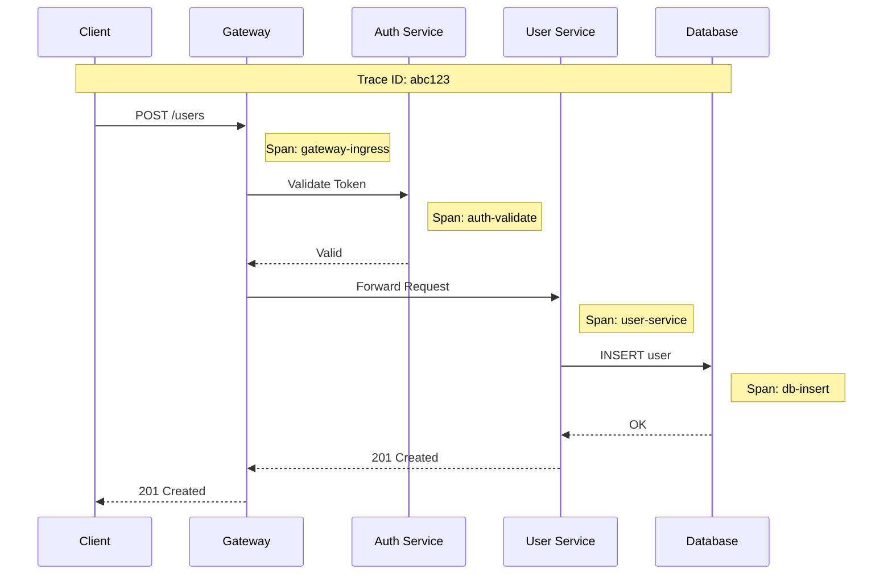

# Observability

## Table of Contents
- [Metrics](#metrics)
- [Logging](#logging)
- [Distributed Tracing](#distributed-tracing)
- [Alerting](#alerting)
- [Dashboards](#dashboards)
- [Debugging and Troubleshooting](#debugging-and-troubleshooting)

---

## Metrics

### RED Method Metrics

The API Gateway implements the RED (Rate, Errors, Duration) method for service monitoring:

| Metric | Description | Labels |
|--------|-------------|--------|
| **Rate** | Request throughput | route, method, consumer, status |
| **Errors** | Error count/rate | route, method, consumer, error_type |
| **Duration** | Request latency | route, method, consumer, status |

### Core Metrics

```yaml
metrics:
  # Request metrics
  gateway_requests_total:
    type: counter
    description: "Total number of requests"
    labels: [route, method, status, consumer]

  gateway_request_duration_seconds:
    type: histogram
    description: "Request duration in seconds"
    labels: [route, method, status]
    buckets: [0.001, 0.005, 0.01, 0.025, 0.05, 0.1, 0.25, 0.5, 1, 2.5, 5, 10]

  gateway_request_size_bytes:
    type: histogram
    description: "Request body size"
    labels: [route, method]
    buckets: [100, 1000, 10000, 100000, 1000000]

  gateway_response_size_bytes:
    type: histogram
    description: "Response body size"
    labels: [route, method, status]
    buckets: [100, 1000, 10000, 100000, 1000000, 10000000]

  # Connection metrics
  gateway_connections_active:
    type: gauge
    description: "Active client connections"

  gateway_connections_total:
    type: counter
    description: "Total connections accepted"

  # Upstream metrics
  gateway_upstream_requests_total:
    type: counter
    description: "Requests to upstream services"
    labels: [upstream, status]

  gateway_upstream_duration_seconds:
    type: histogram
    description: "Upstream response time"
    labels: [upstream]

  gateway_upstream_connections_active:
    type: gauge
    description: "Active upstream connections"
    labels: [upstream]
```

### Plugin Metrics

```yaml
pluginMetrics:
  # Authentication
  gateway_auth_requests_total:
    type: counter
    labels: [method, result]  # method: jwt/apikey/mtls, result: success/failure

  gateway_auth_duration_seconds:
    type: histogram
    labels: [method]

  # Rate limiting
  gateway_ratelimit_requests_total:
    type: counter
    labels: [consumer, result]  # result: allowed/rejected

  gateway_ratelimit_remaining:
    type: gauge
    labels: [consumer, route]

  # Circuit breaker
  gateway_circuitbreaker_state:
    type: gauge
    labels: [upstream]  # 0=closed, 1=open, 2=half-open

  gateway_circuitbreaker_requests_total:
    type: counter
    labels: [upstream, result]  # result: success/failure/rejected

  # Cache
  gateway_cache_requests_total:
    type: counter
    labels: [route, result]  # result: hit/miss/bypass

  gateway_cache_size_bytes:
    type: gauge
```

### System Metrics

```yaml
systemMetrics:
  # Process metrics
  process_cpu_seconds_total:
    type: counter
    description: "CPU time used"

  process_resident_memory_bytes:
    type: gauge
    description: "Resident memory size"

  process_open_fds:
    type: gauge
    description: "Open file descriptors"

  # Go runtime (if applicable)
  go_goroutines:
    type: gauge
    description: "Number of goroutines"

  go_gc_duration_seconds:
    type: summary
    description: "GC pause duration"
```

### Prometheus Export Format

```
# HELP gateway_requests_total Total number of requests
# TYPE gateway_requests_total counter
gateway_requests_total{route="user-api",method="GET",status="200",consumer="acme"} 1234567

# HELP gateway_request_duration_seconds Request duration in seconds
# TYPE gateway_request_duration_seconds histogram
gateway_request_duration_seconds_bucket{route="user-api",method="GET",status="200",le="0.005"} 98765
gateway_request_duration_seconds_bucket{route="user-api",method="GET",status="200",le="0.01"} 123456
gateway_request_duration_seconds_bucket{route="user-api",method="GET",status="200",le="+Inf"} 1234567
gateway_request_duration_seconds_sum{route="user-api",method="GET",status="200"} 12345.67
gateway_request_duration_seconds_count{route="user-api",method="GET",status="200"} 1234567
```

---

## Logging

### Structured Access Logs

```json
{
  "timestamp": "2024-01-15T10:30:45.123Z",
  "level": "INFO",
  "type": "access",

  "request": {
    "id": "req-abc123",
    "method": "POST",
    "path": "/api/v1/users",
    "query": "page=1",
    "host": "api.example.com",
    "protocol": "HTTP/2",
    "size": 1234,
    "headers": {
      "content-type": "application/json",
      "user-agent": "Mozilla/5.0..."
    }
  },

  "response": {
    "status": 201,
    "size": 567,
    "headers": {
      "content-type": "application/json"
    }
  },

  "client": {
    "ip": "203.0.113.50",
    "port": 54321,
    "geo": {
      "country": "US",
      "city": "San Francisco"
    }
  },

  "consumer": {
    "id": "consumer-xyz",
    "username": "acme-corp",
    "tier": "premium"
  },

  "route": {
    "id": "route-123",
    "name": "user-api",
    "upstream": "user-service"
  },

  "upstream": {
    "address": "10.0.1.5:8080",
    "status": 201,
    "attempts": 1
  },

  "timing": {
    "total_ms": 45,
    "gateway_ms": 5,
    "upstream_ms": 40,
    "auth_ms": 2,
    "ratelimit_ms": 1
  },

  "trace": {
    "trace_id": "abc123def456",
    "span_id": "span789",
    "parent_span_id": "parentspan456"
  },

  "ratelimit": {
    "remaining": 950,
    "limit": 1000
  }
}
```

### Log Levels

| Level | Use Case | Example |
|-------|----------|---------|
| **ERROR** | Request failures, system errors | Upstream timeout, auth failure |
| **WARN** | Degraded performance, recoverable issues | Rate limit hit, retry attempted |
| **INFO** | Normal access logs | Successful requests |
| **DEBUG** | Troubleshooting details | Plugin execution, routing decisions |
| **TRACE** | Detailed debugging | Full request/response bodies |

### Log Sampling

```yaml
logging:
  # Sample rates by status
  sampling:
    enabled: true
    default: 1.0  # 100% of requests

    rules:
      - status: "2xx"
        rate: 0.1  # 10% of successful requests
      - status: "4xx"
        rate: 0.5  # 50% of client errors
      - status: "5xx"
        rate: 1.0  # 100% of server errors

    # Always log certain conditions
    alwaysLog:
      - duration_ms > 1000  # Slow requests
      - consumer: "vip-customer"
      - route: "payment-api"

  # Output configuration
  output:
    format: json
    destination: stdout  # or file, syslog
    bufferSize: 10000
    flushInterval: 1s
```

### Audit Logging

```json
{
  "timestamp": "2024-01-15T10:30:45.123Z",
  "type": "audit",
  "event": "route_created",

  "actor": {
    "id": "admin-user-123",
    "ip": "10.0.100.50",
    "userAgent": "curl/7.68.0"
  },

  "resource": {
    "type": "route",
    "id": "route-456",
    "name": "new-user-api"
  },

  "action": {
    "type": "create",
    "status": "success"
  },

  "changes": {
    "before": null,
    "after": {
      "path": "/api/v2/users",
      "upstream": "user-service-v2"
    }
  }
}
```

---

## Distributed Tracing

### W3C Trace Context



### Trace Header Propagation

```
Incoming request:
traceparent: 00-abc123def456789-parent123-01
tracestate: vendor=value

Gateway adds span and propagates:
traceparent: 00-abc123def456789-gateway456-01
tracestate: vendor=value
```

### Span Attributes

```yaml
tracing:
  # Span naming
  spanName: "gateway.${method} ${route}"

  # Attributes to capture
  attributes:
    request:
      - http.method
      - http.url
      - http.target
      - http.host
      - http.scheme
      - http.user_agent
      - http.request_content_length

    response:
      - http.status_code
      - http.response_content_length

    gateway:
      - gateway.route.id
      - gateway.route.name
      - gateway.consumer.id
      - gateway.upstream.name
      - gateway.ratelimit.remaining

  # Child spans
  spans:
    - name: "gateway.auth"
      events: [auth_start, auth_end]
    - name: "gateway.ratelimit"
      events: [ratelimit_check]
    - name: "gateway.upstream"
      events: [upstream_request, upstream_response]
```

### OpenTelemetry Configuration

```yaml
opentelemetry:
  enabled: true

  # Exporter
  exporter:
    type: otlp  # or jaeger, zipkin
    endpoint: "http://otel-collector:4317"
    protocol: grpc

  # Sampling
  sampling:
    type: parentbased_traceidratio
    ratio: 0.1  # 10% of traces

    # Head-based sampling overrides
    rules:
      - route: "payment-*"
        ratio: 1.0  # 100% for payment routes
      - status: "5xx"
        ratio: 1.0  # 100% for errors

  # Resource attributes
  resource:
    service.name: "api-gateway"
    service.version: "3.5.0"
    deployment.environment: "production"
```

---

## Alerting

### Alert Rules

```yaml
alerts:
  # Availability alerts
  - name: high_error_rate
    expr: |
      sum(rate(gateway_requests_total{status=~"5.."}[5m])) /
      sum(rate(gateway_requests_total[5m])) > 0.01
    for: 2m
    severity: critical
    annotations:
      summary: "High error rate: {{ $value | humanizePercentage }}"
      runbook: "https://runbooks.example.com/high-error-rate"

  - name: gateway_down
    expr: up{job="api-gateway"} == 0
    for: 1m
    severity: critical
    annotations:
      summary: "Gateway instance {{ $labels.instance }} is down"

  # Latency alerts
  - name: high_latency_p99
    expr: |
      histogram_quantile(0.99,
        sum(rate(gateway_request_duration_seconds_bucket[5m])) by (le)
      ) > 0.5
    for: 5m
    severity: warning
    annotations:
      summary: "p99 latency is {{ $value | humanizeDuration }}"

  - name: high_latency_p50
    expr: |
      histogram_quantile(0.50,
        sum(rate(gateway_request_duration_seconds_bucket[5m])) by (le)
      ) > 0.1
    for: 5m
    severity: warning
    annotations:
      summary: "p50 latency is {{ $value | humanizeDuration }}"

  # Traffic alerts
  - name: traffic_spike
    expr: |
      sum(rate(gateway_requests_total[5m])) >
      2 * avg_over_time(sum(rate(gateway_requests_total[5m]))[1h:5m])
    for: 5m
    severity: info
    annotations:
      summary: "Traffic is 2x above normal"

  - name: traffic_drop
    expr: |
      sum(rate(gateway_requests_total[5m])) <
      0.5 * avg_over_time(sum(rate(gateway_requests_total[5m]))[1h:5m])
    for: 5m
    severity: warning
    annotations:
      summary: "Traffic dropped by 50%"

  # Rate limiting alerts
  - name: consumer_rate_limited
    expr: |
      sum(rate(gateway_ratelimit_requests_total{result="rejected"}[5m])) by (consumer) > 10
    for: 2m
    severity: info
    annotations:
      summary: "Consumer {{ $labels.consumer }} is being rate limited"

  # Circuit breaker alerts
  - name: circuit_breaker_open
    expr: gateway_circuitbreaker_state == 1
    for: 1m
    severity: warning
    annotations:
      summary: "Circuit breaker open for upstream {{ $labels.upstream }}"

  # Resource alerts
  - name: high_memory_usage
    expr: |
      process_resident_memory_bytes / node_memory_MemTotal_bytes > 0.8
    for: 5m
    severity: warning
    annotations:
      summary: "Memory usage is {{ $value | humanizePercentage }}"

  - name: high_connection_count
    expr: gateway_connections_active > 80000
    for: 2m
    severity: warning
    annotations:
      summary: "Active connections: {{ $value }}"
```

### Alert Routing

```yaml
alertRouting:
  # Severity-based routing
  routes:
    - match:
        severity: critical
      receiver: pagerduty
      repeatInterval: 5m

    - match:
        severity: warning
      receiver: slack-ops
      repeatInterval: 30m

    - match:
        severity: info
      receiver: slack-info
      repeatInterval: 1h

  # Team-based routing
  routes:
    - match:
        team: platform
      receiver: platform-team-slack

    - match:
        consumer: "vip-customer"
      receiver: vip-support
```

---

## Dashboards

### Overview Dashboard

```
┌─────────────────────────────────────────────────────────────────┐
│                     API Gateway Overview                         │
├─────────────────────┬─────────────────────┬─────────────────────┤
│   Requests/sec      │   Error Rate        │   p50 Latency       │
│   ████████ 45.2K    │   ████ 0.12%        │   ██████ 12ms       │
├─────────────────────┴─────────────────────┴─────────────────────┤
│                    Request Rate Over Time                        │
│   ┌────────────────────────────────────────────────────────┐    │
│   │    ╱╲    ╱╲      ╱╲                                    │    │
│   │   ╱  ╲  ╱  ╲    ╱  ╲   ╱─────                         │    │
│   │  ╱    ╲╱    ╲  ╱    ╲ ╱                               │    │
│   │ ╱            ╲╱      ╲╱                                │    │
│   └────────────────────────────────────────────────────────┘    │
├─────────────────────────────────────────────────────────────────┤
│                    Top Routes by Request Count                   │
│   /api/v1/users           ████████████████████  42%             │
│   /api/v1/orders          ████████████         28%              │
│   /api/v1/products        ████████             18%              │
│   /api/v1/payments        ████                 8%               │
│   Other                   ██                   4%               │
├─────────────────────────────────────────────────────────────────┤
│                    Error Rate by Status Code                     │
│   400 Bad Request         ████████████         45%              │
│   401 Unauthorized        ████████             30%              │
│   429 Too Many Requests   ████                 15%              │
│   500 Internal Error      ██                   8%               │
│   503 Service Unavailable █                    2%               │
└─────────────────────────────────────────────────────────────────┘
```

### Latency Dashboard

```
┌─────────────────────────────────────────────────────────────────┐
│                     Latency Analysis                             │
├─────────────────────────────────────────────────────────────────┤
│                    Latency Percentiles                           │
│   p50: 12ms    p95: 45ms    p99: 120ms    p99.9: 450ms         │
│   ┌────────────────────────────────────────────────────────┐    │
│   │  p50 ─────────────────────────────────────             │    │
│   │  p95 ═════════════════════════════════════════         │    │
│   │  p99 ▓▓▓▓▓▓▓▓▓▓▓▓▓▓▓▓▓▓▓▓▓▓▓▓▓▓▓▓▓▓▓▓▓▓▓▓▓▓▓▓▓▓▓      │    │
│   └────────────────────────────────────────────────────────┘    │
├─────────────────────────────────────────────────────────────────┤
│                    Latency Breakdown                             │
│   Auth Plugin:        ██        2ms                              │
│   Rate Limit Plugin:  █         1ms                              │
│   Routing:            █         0.5ms                            │
│   Transform:          █         0.5ms                            │
│   Upstream Wait:      ████████████████████████████  35ms        │
│   Response Transform: █         0.5ms                            │
│   Total Gateway:      ████      4.5ms                            │
├─────────────────────────────────────────────────────────────────┤
│                    Slowest Routes (p99)                          │
│   /api/v1/reports     ████████████████████████████  850ms       │
│   /api/v1/search      █████████████████             420ms       │
│   /api/v1/analytics   ███████████                   280ms       │
└─────────────────────────────────────────────────────────────────┘
```

### Consumer Dashboard

```
┌─────────────────────────────────────────────────────────────────┐
│                     Consumer Analytics                           │
├─────────────────────────────────────────────────────────────────┤
│  Top Consumers by Request Volume (24h)                          │
│                                                                  │
│  1. acme-corp         ████████████████████████████  12.5M reqs  │
│  2. partner-xyz       ████████████████              6.8M reqs   │
│  3. mobile-app        █████████████                 5.2M reqs   │
│  4. web-frontend      ██████████                    4.1M reqs   │
│  5. iot-devices       ████████                      3.3M reqs   │
├─────────────────────────────────────────────────────────────────┤
│  Rate Limit Usage by Consumer                                    │
│                                                                  │
│  acme-corp         [██████████░░░░░░░░░░]  52% of limit         │
│  partner-xyz       [████████████░░░░░░░░]  64% of limit         │
│  mobile-app        [██████████████████░░]  91% of limit ⚠️      │
├─────────────────────────────────────────────────────────────────┤
│  Consumer Error Rates                                            │
│                                                                  │
│  partner-xyz       ████████              4.2%   ⚠️ Above normal  │
│  acme-corp         ██                    0.8%                    │
│  mobile-app        █                     0.3%                    │
└─────────────────────────────────────────────────────────────────┘
```

---

## Debugging and Troubleshooting

### Request Tracing

```bash
# Trace a specific request
curl -H "X-Debug-Request: true" \
     -H "Authorization: Bearer token" \
     https://api.example.com/users/123

# Response includes debug headers
X-Debug-Route-Id: route-456
X-Debug-Upstream: user-service:10.0.1.5:8080
X-Debug-Auth-Duration-Ms: 2
X-Debug-Total-Duration-Ms: 45
X-Debug-Cache-Status: MISS
```

### Debug Endpoints

```yaml
debugEndpoints:
  # Request info endpoint
  /debug/request:
    enabled: true
    auth: admin-only
    returns:
      - parsed_headers
      - matched_route
      - consumer_info
      - plugin_chain

  # Route tester
  /debug/routes/match:
    enabled: true
    auth: admin-only
    params:
      - path
      - method
      - host
    returns:
      - matched_route
      - params
      - priority

  # Plugin execution
  /debug/plugins:
    enabled: true
    auth: admin-only
    returns:
      - plugin_list
      - execution_order
      - configs
```

### Common Issues and Solutions

| Issue | Symptoms | Investigation | Solution |
|-------|----------|---------------|----------|
| High latency | p99 > SLO | Check upstream latency metrics | Scale upstream, enable caching |
| Auth failures spike | 401 rate increase | Check IdP health, JWK cache | Verify IdP, extend JWK TTL |
| Rate limit errors | 429 rate increase | Check consumer usage patterns | Adjust limits, add burst allowance |
| Connection errors | 502/503 errors | Check upstream health | Fix upstream, adjust circuit breaker |
| Memory growth | OOM kills | Check connection count, leak detection | Tune connection limits, fix leaks |

### Log Analysis Queries

```
# Find slow requests
level:INFO AND type:access AND timing.total_ms:>1000

# Find auth failures for specific consumer
type:access AND response.status:401 AND consumer.id:"acme-corp"

# Find rate limited requests
type:access AND response.status:429 | stats count() by consumer.id

# Trace a specific request through logs
request.id:"req-abc123"

# Find upstream timeouts
type:access AND upstream.status:504 | stats count() by route.name
```
