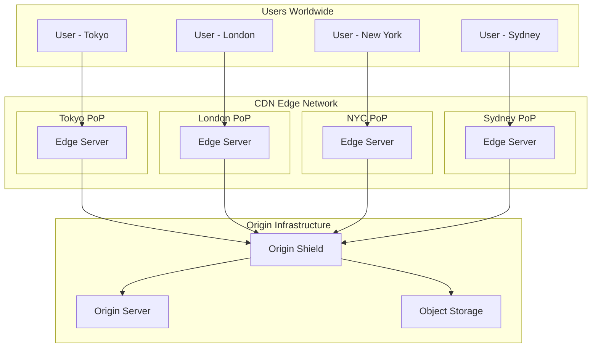
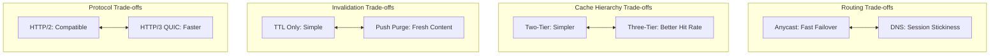

# Content Delivery Network (CDN)

## System Design Document

| Attribute | Value |
|-----------|-------|
| **Complexity** | High |
| **Category** | Core Infrastructure |
| **Prerequisites** | HTTP/HTTPS basics, DNS fundamentals, Caching concepts, Load Balancer (1.2) |
| **Related Topics** | Load Balancer (1.2), LRU Cache (1.4), Reverse Proxy (1.13), API Gateway (1.14), Blob Storage (1.12) |

---

## Quick Navigation

| Document | Description |
|----------|-------------|
| [01 - Requirements & Estimations](./01-requirements-and-estimations.md) | Functional/non-functional requirements, capacity planning |
| [02 - High-Level Design](./02-high-level-design.md) | Architecture diagrams, data flow, key decisions |
| [03 - Low-Level Design](./03-low-level-design.md) | Cache key structure, algorithms, streaming protocols |
| [04 - Deep Dive & Bottlenecks](./04-deep-dive-and-bottlenecks.md) | Cache invalidation, Anycast routing, origin shield |
| [05 - Scalability & Reliability](./05-scalability-and-reliability.md) | PoP scaling, fault tolerance, graceful degradation |
| [06 - Security & Compliance](./06-security-and-compliance.md) | DDoS protection, WAF, TLS, signed URLs |
| [07 - Observability](./07-observability.md) | Metrics, logging, tracing, alerting |
| [08 - Interview Guide](./08-interview-guide.md) | 45-min pacing, trap questions, quick reference |

---

## System Overview

A **Content Delivery Network (CDN)** is a globally distributed network of edge servers (Points of Presence or PoPs) that cache and serve content to users from geographically close locations. CDNs are essential for delivering static assets, video streams, and API responses with low latency and high availability while protecting origin servers from traffic spikes.



---

## What Makes CDN Different from Simple Cache

| Aspect | Simple Cache (Redis/Memcached) | CDN |
|--------|-------------------------------|-----|
| **Geographic Scope** | Single datacenter | Global (100-400+ PoPs) |
| **Routing** | Application-level | Anycast / GeoDNS |
| **Cache Hierarchy** | Usually flat | Multi-tier (Edge → Shield → Origin) |
| **Invalidation** | Single point purge | Global propagation across all PoPs |
| **Protocol** | Application protocol | HTTP/HTTPS with streaming support |
| **Security Role** | Behind firewall | First line of defense (DDoS, WAF) |
| **Failover** | Application handles | Automatic via Anycast/DNS |

---

## CDN Architecture Comparison

| Aspect | Anycast-Based (Cloudflare) | DNS-Based (Akamai) | ISP-Embedded (Netflix OCA) |
|--------|---------------------------|-------------------|---------------------------|
| **Routing Method** | BGP Anycast | GeoDNS | ISP peering |
| **Failover Speed** | Seconds (BGP reconvergence) | Minutes (DNS TTL) | Manual |
| **Session Stickiness** | Challenging | Easy (DNS per-session) | N/A (stateless content) |
| **Deployment** | Own infrastructure | Partner PoPs | ISP datacenters |
| **Best For** | Static + dynamic content | Enterprise CDN | Video streaming |
| **Global Coverage** | 400+ PoPs | 4000+ PoPs | ISP-specific |

---

## Key Characteristics

| Characteristic | Challenge | Why It Matters |
|----------------|-----------|----------------|
| **Read-Heavy** | 99:1 read-to-write ratio | Cache efficiency is critical |
| **Latency-Sensitive** | < 50ms TTFB target | User experience, SEO ranking |
| **Globally Distributed** | 100+ PoPs to manage | Configuration sync, consistency |
| **High Bandwidth** | 10+ Tbps aggregate traffic | Network capacity planning |
| **Cache Consistency** | Stale content visible briefly | Invalidation propagation delay |
| **Security Critical** | DDoS target | First line of defense for origin |

---

## Real-World Implementations

| Company | Implementation | Key Innovation |
|---------|---------------|----------------|
| **Cloudflare** | Anycast network | Same IP globally, ~150ms purge |
| **Akamai** | Tiered distribution | Parent regions reduce origin load |
| **Fastly** | Instant Purge | ~150ms global purge via surrogate keys |
| **Netflix Open Connect** | ISP-embedded appliances | Free hardware to ISPs, 95%+ traffic from edge |
| **AWS CloudFront** | Regional edge caches | Lambda@Edge for compute at edge |
| **Google Cloud CDN** | Anycast + ML routing | Global load balancing integration |

---

## Key Trade-offs



### Trade-off Analysis

| Trade-off | Option A | Option B | Decision Factors |
|-----------|----------|----------|------------------|
| **Routing Strategy** | Anycast (fast failover) | DNS-based (session sticky) | Stateless vs stateful content |
| **Cache Hierarchy** | Two-tier (Edge → Origin) | Three-tier (Edge → Shield → Origin) | Origin protection needs |
| **Invalidation Model** | TTL-only | TTL + Push purge | Content freshness requirements |
| **Edge Compute** | No compute (pure cache) | Edge compute (Lambda@Edge) | Dynamic content at edge needs |
| **TLS Termination** | At edge | Pass-through | Security vs latency trade-off |

---

## Core Concepts Overview

### Cache Hierarchy

CDNs use multi-tier caching to maximize hit rates and protect origin:

```
L1: Edge Cache (PoP)
    ↓ miss
L2: Origin Shield / Regional Cache
    ↓ miss
L3: Origin Server / Object Storage
```

### Anycast Routing

All edge servers advertise the same IP address. BGP routing directs users to the topologically closest PoP:

- **Fast Failover**: PoP failure causes BGP reconvergence (seconds)
- **Load Distribution**: Natural geographic distribution
- **DDoS Absorption**: Attack traffic distributed across all PoPs

### Cache Invalidation Strategies

| Strategy | Mechanism | Latency | Use Case |
|----------|-----------|---------|----------|
| **TTL Expiration** | Cache-Control headers | N/A (passive) | Predictable content |
| **Push Purge** | API call to CDN | ~150ms (Fastly) | Breaking changes |
| **Surrogate Keys** | Tag-based purge | ~150ms | Related content groups |
| **Stale-While-Revalidate** | Serve stale, async refresh | Zero latency | Availability priority |

---

## When to Use a CDN

| Scenario | Benefit |
|----------|---------|
| **Static Asset Delivery** | Offload bandwidth, reduce latency |
| **Video Streaming** | Adaptive bitrate, efficient delivery |
| **Global User Base** | Geographic proximity reduces latency |
| **Traffic Spikes** | Edge absorbs load, protects origin |
| **DDoS Protection** | Distributed capacity absorbs attacks |
| **API Acceleration** | Cache API responses, reduce origin load |

---

## When NOT to Use a CDN

| Scenario | Alternative |
|----------|-------------|
| **Personalized content only** | Direct origin (CDN can't cache) |
| **Internal/private networks** | Private caching infrastructure |
| **Very small scale** | Direct serving may be simpler |
| **Real-time data (no caching)** | WebSocket, direct connection |
| **Regulatory restrictions** | Region-specific storage requirements |

---

## Complexity Rating Breakdown

| Area | Complexity | Reason |
|------|------------|--------|
| **Cache Key Design** | Medium | URL normalization, vary headers |
| **Cache Invalidation** | High | Global propagation, consistency |
| **Anycast Routing** | High | BGP configuration, failover |
| **Video Streaming** | High | HLS/DASH, adaptive bitrate |
| **DDoS Mitigation** | High | L3/L4 + L7 protection |
| **TLS at Scale** | Medium | Certificate management, OCSP |
| **Origin Shield** | Medium | Request collapsing, failover |

---

## Document Reading Order

### For Interview Prep (Time-Limited)
1. This index (overview)
2. [02 - High-Level Design](./02-high-level-design.md) (architecture)
3. [08 - Interview Guide](./08-interview-guide.md) (pacing, questions)

### For Deep Understanding
1. All documents in order (00 → 08)
2. Focus on [04 - Deep Dive](./04-deep-dive-and-bottlenecks.md) for internals
3. Study [03 - Low-Level Design](./03-low-level-design.md) for algorithms

### For Production Design
1. [01 - Requirements](./01-requirements-and-estimations.md) (capacity planning)
2. [05 - Scalability](./05-scalability-and-reliability.md) (production concerns)
3. [06 - Security](./06-security-and-compliance.md) (DDoS, WAF)
4. [07 - Observability](./07-observability.md) (monitoring)

---

## Related System Designs

| Design | Relationship |
|--------|--------------|
| [1.2 Distributed Load Balancer](../1.2-distributed-load-balancer/00-index.md) | Load balancing within PoP and to origin |
| [1.4 Distributed LRU Cache](../1.4-distributed-lru-cache/00-index.md) | Cache eviction algorithms at edge |
| [1.12 Blob Storage](../1.12-blob-storage-system/00-index.md) | Origin storage for CDN content |
| [1.13 Reverse Proxy](../1.13-high-performance-reverse-proxy/00-index.md) | Edge server architecture |
| [1.14 API Gateway](../1.14-api-gateway-design/00-index.md) | API caching at edge |

---

## Further Reading

- Cloudflare CDN Reference Architecture
- Netflix Open Connect Architecture
- Fastly Instant Purge and Surrogate Keys
- HTTP Caching RFC 7234
- HTTP/3 and QUIC Protocol Guide
