# High-Level Design

[← Back to Index](./00-index.md)

---

## Table of Contents
- [Architecture Overview](#architecture-overview)
- [Core Components](#core-components)
- [Data Flow](#data-flow)
- [Key Design Decisions](#key-design-decisions)
- [Communication Patterns](#communication-patterns)

---

## Architecture Overview

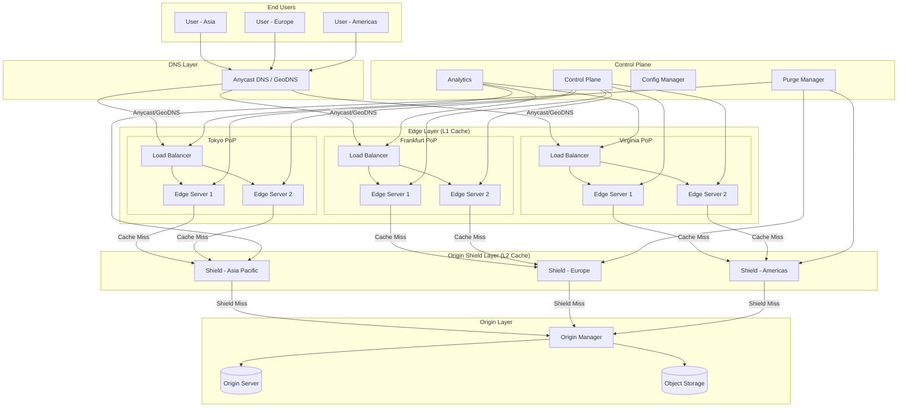

---

## Core Components

### 1. DNS Layer

Routes users to the nearest PoP using one of two strategies:

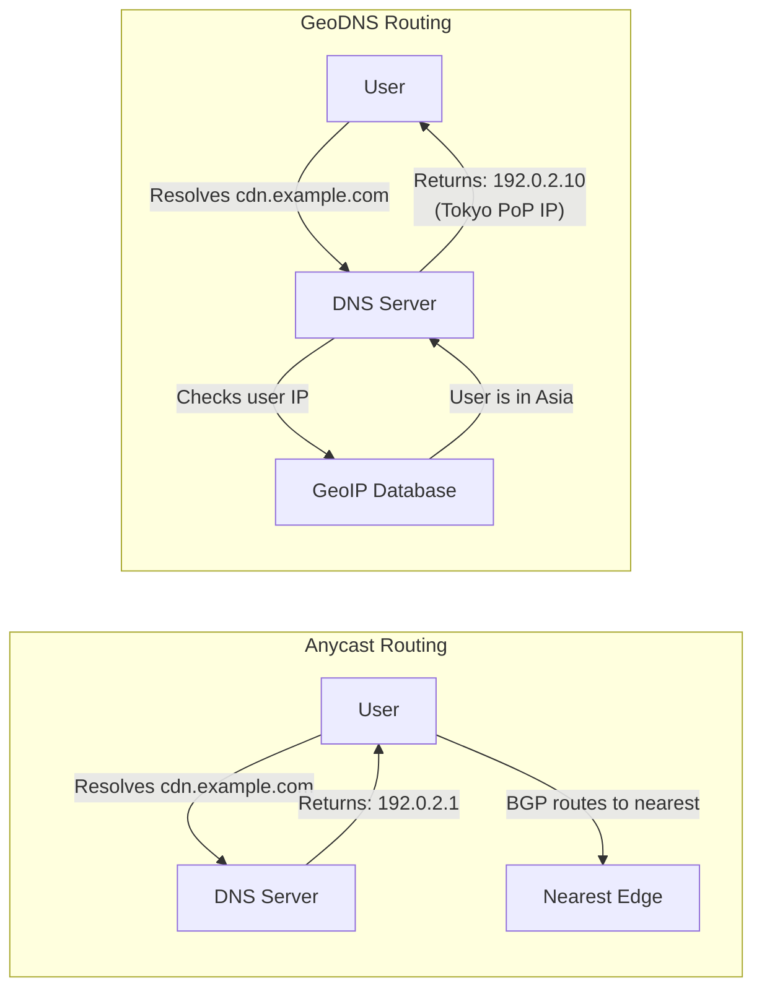

| Routing Type | Mechanism | Failover Speed | Best For |
|--------------|-----------|----------------|----------|
| **Anycast** | Same IP announced via BGP from all PoPs | Seconds (BGP) | Stateless content |
| **GeoDNS** | Different IP per region via DNS | Minutes (TTL) | Session stickiness |

### 2. Edge Layer (L1 Cache)

Edge servers at each PoP handle user requests, TLS termination, and content caching.

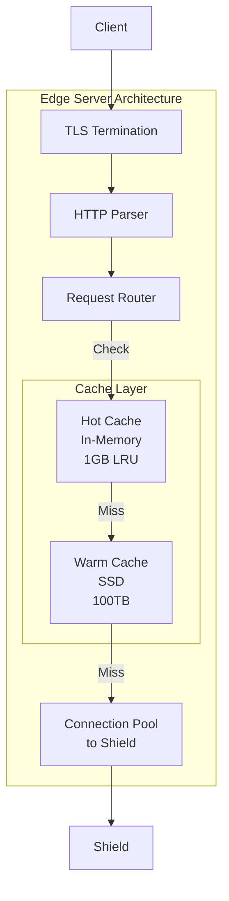

**Responsibilities:**
- TLS termination (HTTPS)
- HTTP/2 and HTTP/3 (QUIC) support
- Cache lookup and storage
- Request routing to shield on miss
- Response compression (gzip, brotli)
- Access logging

### 3. Origin Shield Layer (L2 Cache)

Intermediate cache that collapses requests to origin, reducing origin load.

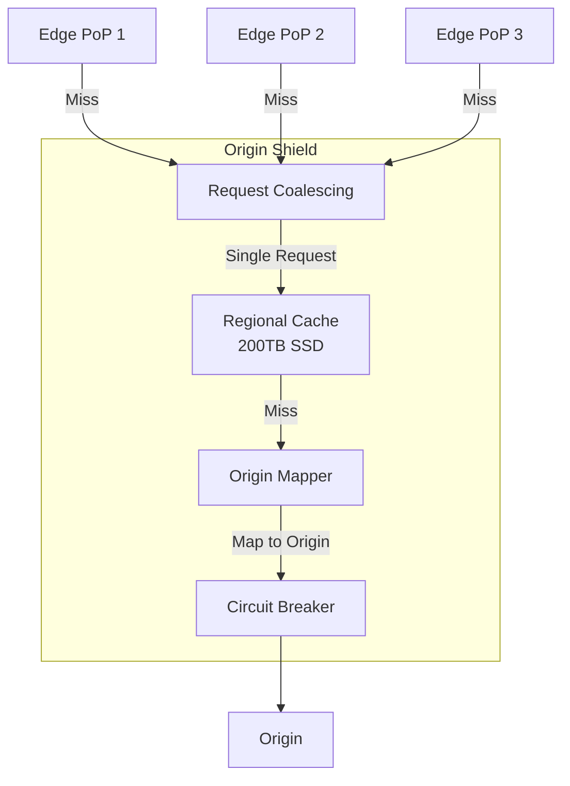

**Responsibilities:**
- Request collapsing (deduplication)
- Regional cache for all edge PoPs in region
- Circuit breaker for origin protection
- Multi-origin failover
- Serve stale on origin failure

### 4. Origin Layer

Customer's infrastructure serving original content.

**Supported Origin Types:**
- HTTP/HTTPS servers
- Object storage (S3-compatible)
- Load balancers
- Other CDNs (origin stacking)

### 5. Control Plane

Manages configuration, purging, and analytics.

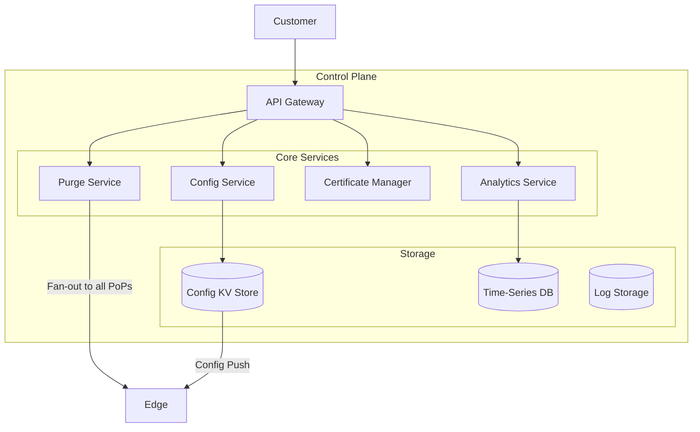

---

## Data Flow

### Cache Hit Flow (Happy Path)

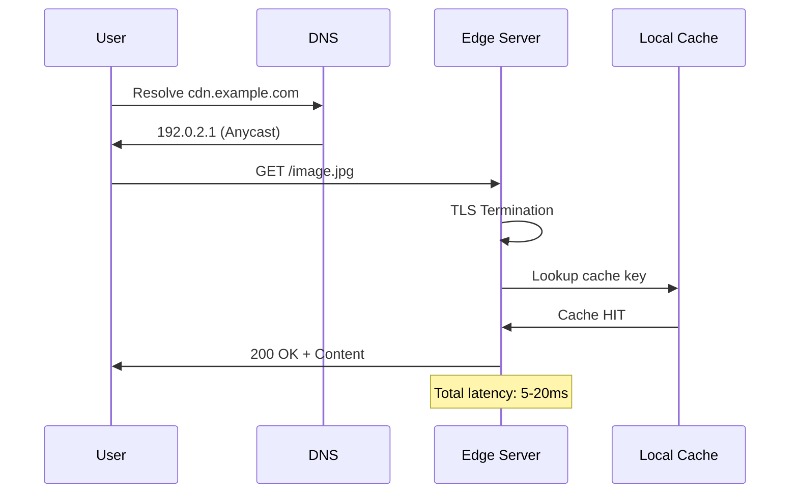

### Cache Miss Flow (Full Path)

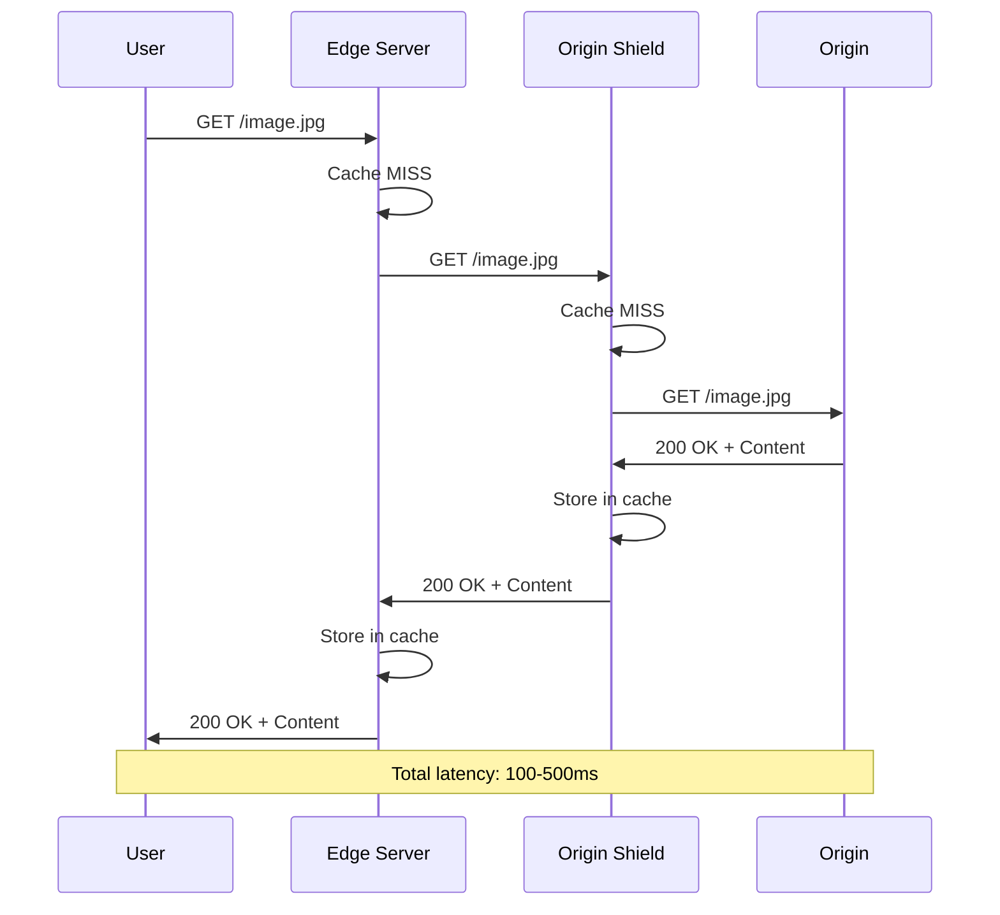

### Request Coalescing Flow

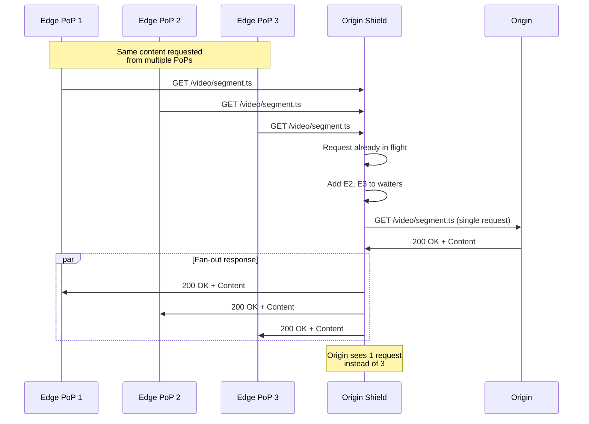

---

## Key Design Decisions

### Decision 1: Anycast vs GeoDNS Routing

| Approach | Pros | Cons |
|----------|------|------|
| **Anycast** | Fast failover (BGP), simple DNS, DDoS distribution | Session issues during failover, requires BGP expertise |
| **GeoDNS** | Session stickiness, fine-grained control | Slow failover (DNS TTL), complex DNS management |

**Decision: Anycast (Primary) + GeoDNS (Fallback)**

**Rationale:**
- Most CDN content is stateless (cacheable)
- Anycast provides faster failover (seconds vs minutes)
- DDoS traffic naturally distributes across all PoPs
- GeoDNS available for customers requiring stickiness

### Decision 2: Cache Hierarchy Depth

| Approach | Pros | Cons |
|----------|------|------|
| **Two-Tier (Edge → Origin)** | Simpler, lower latency | High origin load on cache misses |
| **Three-Tier (Edge → Shield → Origin)** | Better origin protection, higher hit rate | Additional hop latency, complexity |

**Decision: Three-Tier with Optional Shield**

**Rationale:**
- Origin shield reduces origin load by 90%+
- Request collapsing prevents thundering herd
- Regional caches improve hit rate for long-tail content
- Shield can be bypassed for latency-critical paths

### Decision 3: TLS Termination Strategy

| Approach | Pros | Cons |
|----------|------|------|
| **Edge Termination** | Caching possible, HTTP/2 multiplexing | Keys at edge, compliance concerns |
| **Pass-Through** | True E2E encryption, simpler | No caching, higher latency |

**Decision: Edge Termination with Secure Key Storage**

**Rationale:**
- Must decrypt to cache and optimize
- Keys stored in secure enclaves (HSM)
- Re-encrypt to origin (mTLS) for sensitive content
- Offer pass-through option for compliance needs

### Decision 4: Cache Invalidation Strategy

| Approach | Pros | Cons |
|----------|------|------|
| **TTL Only** | Simple, no coordination | Stale content until expiry |
| **TTL + Push Purge** | Fresh content on demand | Purge propagation delay |
| **Surrogate Keys** | Granular group purge | Additional metadata overhead |

**Decision: TTL + Push Purge + Surrogate Keys**

**Rationale:**
- TTL handles normal refresh (90% of cases)
- Push purge for urgent updates (breaking changes)
- Surrogate keys for efficient group invalidation
- stale-while-revalidate for zero-latency refresh

### Decision 5: HTTP Protocol Support

| Protocol | Pros | Cons |
|----------|------|------|
| **HTTP/1.1** | Universal support | Head-of-line blocking, many connections |
| **HTTP/2** | Multiplexing, header compression | TCP head-of-line blocking |
| **HTTP/3 (QUIC)** | 0-RTT, connection migration, no HoL | Newer, UDP-based (firewall issues) |

**Decision: Support All (HTTP/1.1, HTTP/2, HTTP/3)**

**Rationale:**
- HTTP/3 for mobile users (connection migration)
- HTTP/2 as default for most clients
- HTTP/1.1 fallback for legacy clients
- Protocol negotiation via ALPN

---

## Communication Patterns

### Edge-to-Shield Communication

```
Edge Server                    Shield
    |                            |
    |---- TCP/TLS Connection --->|
    |                            |
    |---- HTTP Request --------->|
    |<--- HTTP Response ---------|
    |                            |
    (Connection pooled for reuse)
```

**Connection Management:**
- Connection pooling (10-50 connections per edge → shield pair)
- Keep-alive for connection reuse
- Health checks for connection validation
- Circuit breaker for shield failures

### Purge Propagation

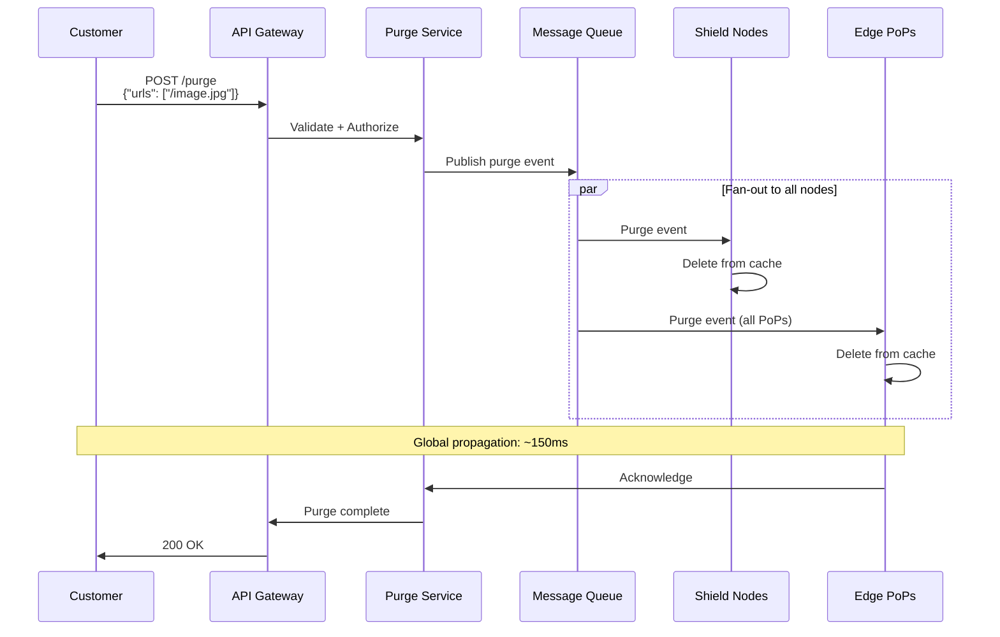

### Config Distribution

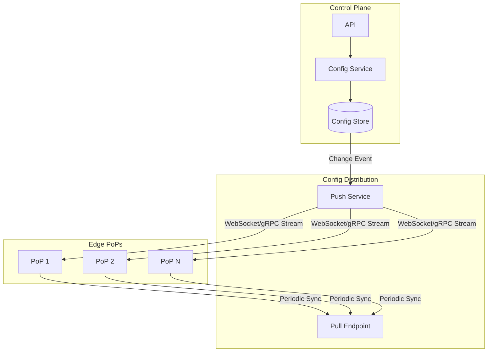

**Configuration Types:**
- Customer domains and origins
- Cache rules and TTLs
- SSL certificates
- WAF rules
- Rate limiting policies

---

## Component Interaction Summary

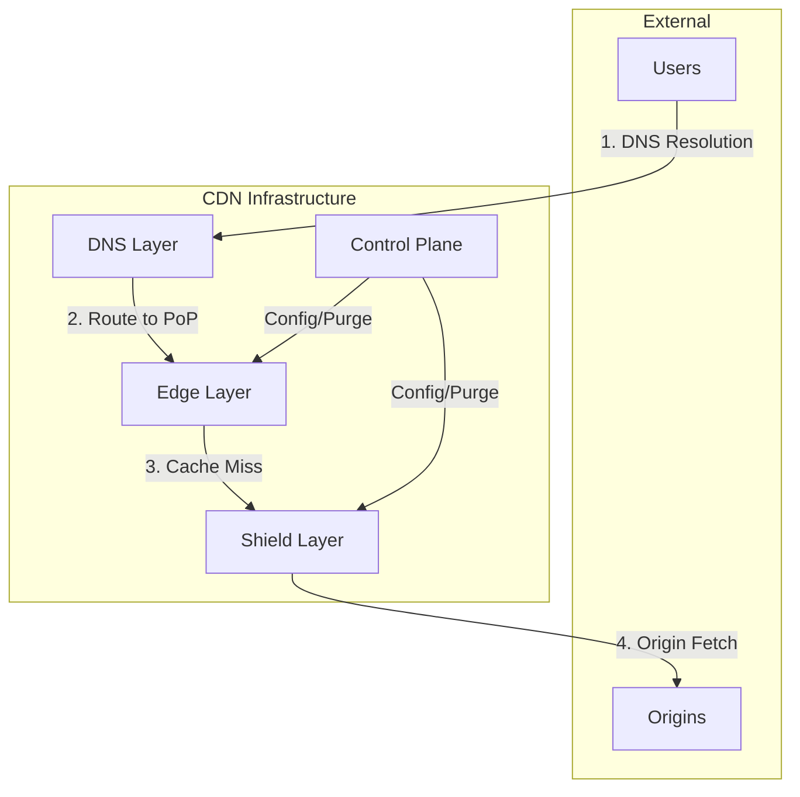

---

## System Boundaries

### What the CDN Handles

| Responsibility | Details |
|----------------|---------|
| Content caching | Static and cacheable dynamic content |
| TLS termination | HTTPS at edge |
| Request routing | Anycast/GeoDNS to nearest PoP |
| Origin protection | Shield, rate limiting, circuit breaker |
| DDoS mitigation | Absorb attacks at edge |
| Content optimization | Compression, minification |
| Video delivery | HLS/DASH streaming |

### What the CDN Does NOT Handle

| Responsibility | Where It Belongs |
|----------------|------------------|
| Content generation | Origin servers |
| Business logic | Application layer |
| Persistent storage | Origin storage systems |
| User authentication | Application (though CDN can validate tokens) |
| Database queries | Backend services |
| Real-time bidirectional | WebSocket servers (though CDN can proxy) |
