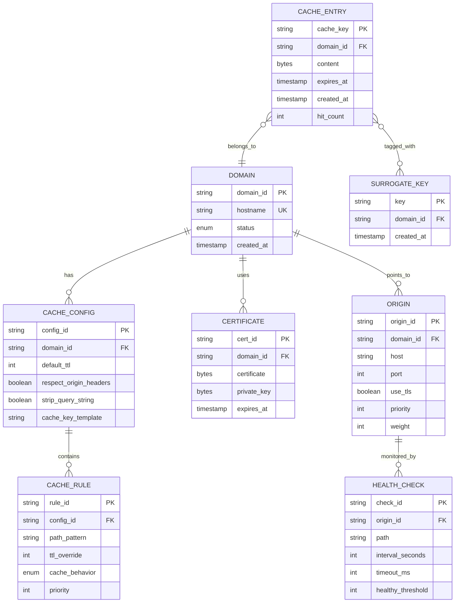
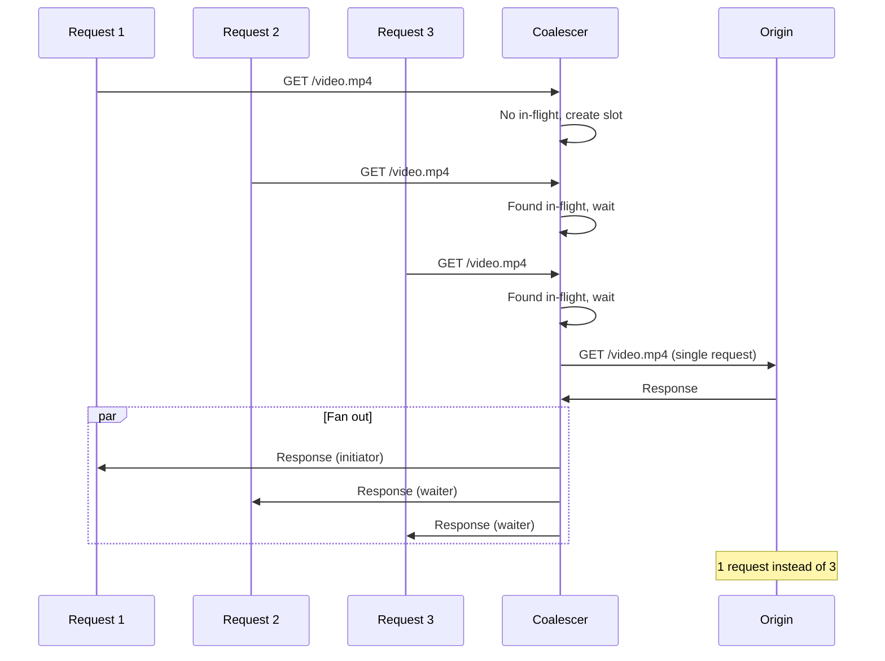
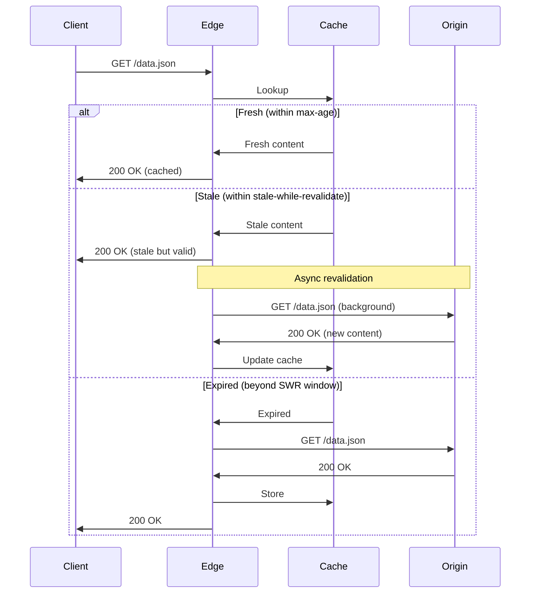
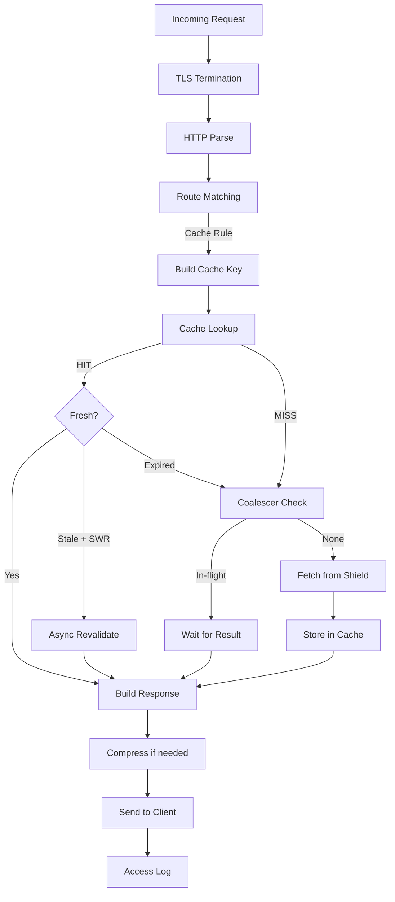

# Low-Level Design

[← Back to Index](./00-index.md)

---

## Table of Contents
- [Data Model](#data-model)
- [Cache Key Design](#cache-key-design)
- [Core Algorithms](#core-algorithms)
- [HTTP Caching Mechanics](#http-caching-mechanics)
- [Video Streaming Protocols](#video-streaming-protocols)
- [Request Processing Pipeline](#request-processing-pipeline)

---

## Data Model

### Cache Entry Structure

```
┌────────────────────────────────────────────────────────────────────┐
│ CACHE ENTRY STRUCTURE                                               │
├────────────────────────────────────────────────────────────────────┤
│                                                                     │
│  Header (fixed 128 bytes):                                         │
│  ┌─────────────────────────────────────────────────────────────┐  │
│  │ magic           │  4 bytes │ 0x43444E45 ("CDNE")            │  │
│  │ version         │  2 bytes │ Schema version                  │  │
│  │ flags           │  2 bytes │ Compressed, encrypted, etc.     │  │
│  │ cache_key_hash  │ 32 bytes │ SHA256 of cache key             │  │
│  │ content_length  │  8 bytes │ Body size in bytes              │  │
│  │ created_at      │  8 bytes │ Unix timestamp (ms)             │  │
│  │ expires_at      │  8 bytes │ Expiration timestamp            │  │
│  │ last_accessed   │  8 bytes │ For LRU eviction                │  │
│  │ hit_count       │  4 bytes │ Access count                    │  │
│  │ status_code     │  2 bytes │ HTTP status (200, 304, etc.)    │  │
│  │ header_length   │  4 bytes │ Size of stored headers          │  │
│  │ surrogate_keys  │  4 bytes │ Offset to surrogate key list    │  │
│  │ etag_length     │  2 bytes │ Length of ETag                  │  │
│  │ reserved        │ 42 bytes │ Future use                      │  │
│  └─────────────────────────────────────────────────────────────┘  │
│                                                                     │
│  Variable Fields:                                                  │
│  ┌─────────────────────────────────────────────────────────────┐  │
│  │ cache_key       │ var      │ Full cache key string           │  │
│  │ etag            │ var      │ ETag value (for validation)     │  │
│  │ content_type    │ var      │ MIME type                       │  │
│  │ headers         │ var      │ Serialized response headers     │  │
│  │ surrogate_keys  │ var      │ List of tags for purge          │  │
│  │ body            │ var      │ Actual content (may be chunked) │  │
│  └─────────────────────────────────────────────────────────────┘  │
│                                                                     │
└────────────────────────────────────────────────────────────────────┘
```

### Entity Relationship Diagram



---

## Cache Key Design

### Cache Key Components

```
┌────────────────────────────────────────────────────────────────────┐
│ CACHE KEY CONSTRUCTION                                              │
├────────────────────────────────────────────────────────────────────┤
│                                                                     │
│ Default Cache Key Formula:                                         │
│                                                                     │
│   cache_key = HASH(                                                │
│     scheme +                    // "https"                         │
│     host +                      // "cdn.example.com"               │
│     normalized_path +           // "/images/photo.jpg"             │
│     sorted_query_string +       // "?size=large&format=webp"      │
│     vary_headers                // "Accept-Encoding:gzip"         │
│   )                                                                │
│                                                                     │
│ Example:                                                            │
│   URL: https://cdn.example.com/images/photo.jpg?format=webp&size=large
│   Accept-Encoding: gzip                                             │
│                                                                     │
│   cache_key = SHA256(                                              │
│     "https" +                                                       │
│     "cdn.example.com" +                                            │
│     "/images/photo.jpg" +                                          │
│     "format=webp&size=large" +  // sorted alphabetically          │
│     "Accept-Encoding:gzip"                                         │
│   )                                                                 │
│                                                                     │
│   = "a7f3b2c1d4e5..."  (64 hex chars)                             │
│                                                                     │
└────────────────────────────────────────────────────────────────────┘
```

### Cache Key Normalization Algorithm

```python
class CacheKeyBuilder:
    """
    Build normalized cache keys for consistent caching.
    """

    def __init__(self, config: CacheConfig):
        self.config = config

    def build_cache_key(self, request: HTTPRequest) -> str:
        """
        Build cache key from HTTP request.
        """
        components = []

        # 1. Scheme (optional based on config)
        if self.config.include_scheme:
            components.append(request.scheme)

        # 2. Host (always included)
        components.append(self._normalize_host(request.host))

        # 3. Path (normalized)
        components.append(self._normalize_path(request.path))

        # 4. Query string (sorted, filtered)
        if not self.config.strip_query_string:
            query = self._normalize_query(request.query_params)
            if query:
                components.append(query)

        # 5. Vary headers
        vary_key = self._build_vary_key(request)
        if vary_key:
            components.append(vary_key)

        # 6. Custom key components (from config)
        for custom in self.config.custom_key_components:
            value = self._extract_custom(request, custom)
            if value:
                components.append(f"{custom.name}:{value}")

        # Join and hash
        key_string = "|".join(components)
        return hashlib.sha256(key_string.encode()).hexdigest()

    def _normalize_host(self, host: str) -> str:
        """Lowercase, remove default port."""
        host = host.lower()
        # Remove :443 for https, :80 for http
        host = re.sub(r':443$', '', host)
        host = re.sub(r':80$', '', host)
        return host

    def _normalize_path(self, path: str) -> str:
        """
        Normalize URL path:
        - Decode unnecessary percent-encoding
        - Remove dot segments (/./, /../)
        - Collapse multiple slashes
        - Ensure leading slash
        """
        # Decode safe characters
        path = urllib.parse.unquote(path, safe='/:@!$&\'()*+,;=')

        # Remove dot segments
        segments = []
        for segment in path.split('/'):
            if segment == '.':
                continue
            elif segment == '..':
                if segments:
                    segments.pop()
            else:
                segments.append(segment)

        # Collapse and ensure leading slash
        path = '/' + '/'.join(segments)
        path = re.sub(r'/+', '/', path)

        return path

    def _normalize_query(self, params: dict) -> str:
        """
        Normalize query string:
        - Sort parameters alphabetically
        - Filter out ignored parameters
        - Encode consistently
        """
        filtered = {}
        for key, value in sorted(params.items()):
            # Skip ignored params (e.g., tracking params)
            if key in self.config.ignored_query_params:
                continue
            filtered[key] = value

        if not filtered:
            return ""

        return urllib.parse.urlencode(filtered, doseq=True)

    def _build_vary_key(self, request: HTTPRequest) -> str:
        """
        Build key component from Vary headers.
        """
        vary_parts = []

        # Always vary on Accept-Encoding for compression
        if 'Accept-Encoding' in request.headers:
            encoding = self._normalize_accept_encoding(
                request.headers['Accept-Encoding']
            )
            vary_parts.append(f"AE:{encoding}")

        # Check for other Vary headers from config
        for header in self.config.vary_headers:
            if header in request.headers:
                value = request.headers[header]
                vary_parts.append(f"{header}:{value}")

        return "|".join(vary_parts)

    def _normalize_accept_encoding(self, value: str) -> str:
        """
        Normalize Accept-Encoding to canonical form.
        'gzip, deflate, br' -> 'br,deflate,gzip'
        """
        encodings = [e.strip().split(';')[0] for e in value.split(',')]
        return ','.join(sorted(encodings))
```

### Vary Header Handling

| Header | Impact | Example |
|--------|--------|---------|
| `Vary: Accept-Encoding` | Different cache entry per encoding | gzip vs brotli vs none |
| `Vary: Accept-Language` | Different entry per language | en vs fr vs de |
| `Vary: Cookie` | Usually means "don't cache" | Personalized content |
| `Vary: User-Agent` | Risky (high cardinality) | Mobile vs desktop |
| `Vary: *` | Never cache | Dynamic content |

---

## Core Algorithms

### Request Coalescing Algorithm

```python
class RequestCoalescer:
    """
    Collapse multiple concurrent requests for the same resource
    into a single origin fetch.
    """

    def __init__(self):
        self.in_flight: dict[str, InFlightRequest] = {}
        self.lock = asyncio.Lock()

    async def get_or_fetch(
        self,
        cache_key: str,
        fetch_func: Callable
    ) -> Response:
        """
        Either return in-flight response or initiate new fetch.
        """
        async with self.lock:
            # Check if request is already in flight
            if cache_key in self.in_flight:
                # Wait for existing request
                inflight = self.in_flight[cache_key]
                inflight.waiter_count += 1
                return await inflight.future

            # Create new in-flight request
            inflight = InFlightRequest(
                future=asyncio.Future(),
                started_at=time.time(),
                waiter_count=1
            )
            self.in_flight[cache_key] = inflight

        try:
            # Perform actual fetch (outside lock)
            response = await fetch_func()

            # Store result for all waiters
            inflight.future.set_result(response)

            return response

        except Exception as e:
            # Propagate error to all waiters
            inflight.future.set_exception(e)
            raise

        finally:
            # Cleanup
            async with self.lock:
                del self.in_flight[cache_key]

@dataclass
class InFlightRequest:
    future: asyncio.Future
    started_at: float
    waiter_count: int
```



### Surrogate Key Invalidation

```python
class SurrogateKeyManager:
    """
    Manage surrogate keys for efficient cache invalidation.
    """

    def __init__(self, storage: CacheStorage):
        self.storage = storage
        # Inverted index: surrogate_key -> set of cache_keys
        self.key_index: dict[str, set[str]] = defaultdict(set)
        self.index_lock = asyncio.Lock()

    async def tag_entry(
        self,
        cache_key: str,
        surrogate_keys: list[str]
    ) -> None:
        """
        Associate cache entry with surrogate keys.
        """
        async with self.index_lock:
            for sk in surrogate_keys:
                self.key_index[sk].add(cache_key)

    async def purge_by_surrogate_key(
        self,
        surrogate_key: str
    ) -> int:
        """
        Purge all cache entries tagged with surrogate key.
        Returns count of purged entries.
        """
        async with self.index_lock:
            cache_keys = self.key_index.pop(surrogate_key, set())

        purged = 0
        for cache_key in cache_keys:
            if await self.storage.delete(cache_key):
                purged += 1

        return purged

    async def purge_by_tag_pattern(
        self,
        pattern: str
    ) -> int:
        """
        Purge all entries matching tag pattern (e.g., "product-*").
        """
        import fnmatch

        async with self.index_lock:
            matching_tags = [
                sk for sk in self.key_index.keys()
                if fnmatch.fnmatch(sk, pattern)
            ]

        total_purged = 0
        for tag in matching_tags:
            total_purged += await self.purge_by_surrogate_key(tag)

        return total_purged

# Usage Example:
#
# When caching product page:
#   surrogate_keys = [
#     "product-123",           # Specific product
#     "category-electronics",  # Product category
#     "site-wide"              # All content
#   ]
#   await manager.tag_entry(cache_key, surrogate_keys)
#
# When product price changes:
#   await manager.purge_by_surrogate_key("product-123")
#   # Purges only this product's cached pages
#
# When category layout changes:
#   await manager.purge_by_surrogate_key("category-electronics")
#   # Purges all electronics product pages
```

### LRU Cache Eviction with Size Awareness

```python
class SizeAwareLRUCache:
    """
    LRU cache that considers both count and total size.
    """

    def __init__(
        self,
        max_count: int = 1_000_000,
        max_size_bytes: int = 100 * 1024**3  # 100 GB
    ):
        self.max_count = max_count
        self.max_size_bytes = max_size_bytes

        self.cache: OrderedDict[str, CacheEntry] = OrderedDict()
        self.current_size = 0
        self.lock = asyncio.Lock()

    async def get(self, key: str) -> Optional[CacheEntry]:
        """Get entry and move to end (most recently used)."""
        async with self.lock:
            if key not in self.cache:
                return None

            # Move to end (most recent)
            self.cache.move_to_end(key)
            entry = self.cache[key]
            entry.hit_count += 1
            entry.last_accessed = time.time()
            return entry

    async def put(
        self,
        key: str,
        entry: CacheEntry
    ) -> None:
        """Add entry, evicting as needed."""
        async with self.lock:
            entry_size = entry.content_length

            # Remove existing entry if present
            if key in self.cache:
                old_entry = self.cache.pop(key)
                self.current_size -= old_entry.content_length

            # Evict until we have space
            await self._evict_if_needed(entry_size)

            # Add new entry
            self.cache[key] = entry
            self.current_size += entry_size

    async def _evict_if_needed(self, needed_size: int) -> None:
        """
        Evict entries until we have space.
        Uses LRU with size consideration.
        """
        while (
            len(self.cache) >= self.max_count or
            self.current_size + needed_size > self.max_size_bytes
        ):
            if not self.cache:
                break

            # Remove oldest (first) entry
            oldest_key, oldest_entry = self.cache.popitem(last=False)
            self.current_size -= oldest_entry.content_length

    async def delete(self, key: str) -> bool:
        """Delete specific entry."""
        async with self.lock:
            if key in self.cache:
                entry = self.cache.pop(key)
                self.current_size -= entry.content_length
                return True
            return False
```

---

## HTTP Caching Mechanics

### Cache-Control Header Parsing

```python
class CacheControlParser:
    """
    Parse and interpret Cache-Control headers.
    """

    @staticmethod
    def parse(header: str) -> CacheDirectives:
        """
        Parse Cache-Control header value.

        Example: "public, max-age=3600, stale-while-revalidate=60"
        """
        directives = CacheDirectives()

        for directive in header.split(','):
            directive = directive.strip().lower()

            if directive == 'public':
                directives.public = True
            elif directive == 'private':
                directives.private = True
            elif directive == 'no-cache':
                directives.no_cache = True
            elif directive == 'no-store':
                directives.no_store = True
            elif directive == 'must-revalidate':
                directives.must_revalidate = True
            elif directive == 'immutable':
                directives.immutable = True
            elif directive.startswith('max-age='):
                directives.max_age = int(directive.split('=')[1])
            elif directive.startswith('s-maxage='):
                directives.s_maxage = int(directive.split('=')[1])
            elif directive.startswith('stale-while-revalidate='):
                directives.stale_while_revalidate = int(
                    directive.split('=')[1]
                )
            elif directive.startswith('stale-if-error='):
                directives.stale_if_error = int(directive.split('=')[1])

        return directives

    @staticmethod
    def calculate_ttl(
        directives: CacheDirectives,
        response_headers: dict,
        default_ttl: int = 3600
    ) -> int:
        """
        Calculate cache TTL from headers.
        Priority: s-maxage > max-age > Expires > default
        """
        # No caching directives
        if directives.no_store or directives.private:
            return 0

        # s-maxage (shared cache specific)
        if directives.s_maxage is not None:
            return directives.s_maxage

        # max-age
        if directives.max_age is not None:
            return directives.max_age

        # Expires header
        if 'Expires' in response_headers:
            expires = parse_http_date(response_headers['Expires'])
            return max(0, int(expires - time.time()))

        return default_ttl

@dataclass
class CacheDirectives:
    public: bool = False
    private: bool = False
    no_cache: bool = False
    no_store: bool = False
    must_revalidate: bool = False
    immutable: bool = False
    max_age: Optional[int] = None
    s_maxage: Optional[int] = None
    stale_while_revalidate: Optional[int] = None
    stale_if_error: Optional[int] = None
```

### Stale-While-Revalidate Flow



### Conditional Request Handling

```python
async def handle_conditional_request(
    request: HTTPRequest,
    cache_entry: CacheEntry
) -> HTTPResponse:
    """
    Handle If-None-Match and If-Modified-Since.
    """
    # If-None-Match (ETag validation)
    if 'If-None-Match' in request.headers:
        client_etags = parse_etag_list(
            request.headers['If-None-Match']
        )

        if cache_entry.etag in client_etags or '*' in client_etags:
            return HTTPResponse(
                status=304,
                headers={'ETag': cache_entry.etag}
            )

    # If-Modified-Since (date validation)
    if 'If-Modified-Since' in request.headers:
        client_date = parse_http_date(
            request.headers['If-Modified-Since']
        )

        if cache_entry.last_modified <= client_date:
            return HTTPResponse(
                status=304,
                headers={'Last-Modified': format_http_date(
                    cache_entry.last_modified
                )}
            )

    # No match, return full response
    return build_full_response(cache_entry)
```

---

## Video Streaming Protocols

### HLS (HTTP Live Streaming) Handling

```
┌────────────────────────────────────────────────────────────────────┐
│ HLS STREAMING ARCHITECTURE                                          │
├────────────────────────────────────────────────────────────────────┤
│                                                                     │
│ Content Structure:                                                  │
│                                                                     │
│   Master Playlist (master.m3u8):                                   │
│   ┌─────────────────────────────────────────────────────────────┐  │
│   │ #EXTM3U                                                      │  │
│   │ #EXT-X-STREAM-INF:BANDWIDTH=800000,RESOLUTION=640x360       │  │
│   │ 360p/playlist.m3u8                                           │  │
│   │ #EXT-X-STREAM-INF:BANDWIDTH=1400000,RESOLUTION=1280x720     │  │
│   │ 720p/playlist.m3u8                                           │  │
│   │ #EXT-X-STREAM-INF:BANDWIDTH=2800000,RESOLUTION=1920x1080    │  │
│   │ 1080p/playlist.m3u8                                          │  │
│   └─────────────────────────────────────────────────────────────┘  │
│                                                                     │
│   Variant Playlist (720p/playlist.m3u8):                           │
│   ┌─────────────────────────────────────────────────────────────┐  │
│   │ #EXTM3U                                                      │  │
│   │ #EXT-X-VERSION:3                                             │  │
│   │ #EXT-X-TARGETDURATION:10                                     │  │
│   │ #EXT-X-MEDIA-SEQUENCE:0                                      │  │
│   │ #EXTINF:10.0,                                                │  │
│   │ segment000.ts                                                │  │
│   │ #EXTINF:10.0,                                                │  │
│   │ segment001.ts                                                │  │
│   │ #EXTINF:10.0,                                                │  │
│   │ segment002.ts                                                │  │
│   │ #EXT-X-ENDLIST                                               │  │
│   └─────────────────────────────────────────────────────────────┘  │
│                                                                     │
│ Caching Strategy:                                                   │
│   • Master playlist: Short TTL (5-10 sec for live)                │
│   • Variant playlist: Short TTL (segment duration)                 │
│   • Segments (.ts/.m4s): Long TTL (24h+, immutable)               │
│                                                                     │
│ Cache Keys:                                                         │
│   /video/abc/master.m3u8      → TTL: 5s                           │
│   /video/abc/720p/playlist.m3u8 → TTL: 10s                        │
│   /video/abc/720p/segment001.ts → TTL: 86400s                     │
│                                                                     │
└────────────────────────────────────────────────────────────────────┘
```

### Segment Caching Strategy

```python
class VideoSegmentCachePolicy:
    """
    Caching policy for video segments.
    """

    def get_cache_config(self, path: str) -> CacheConfig:
        """
        Return cache configuration based on path.
        """

        # Master playlist (list of quality levels)
        if path.endswith('master.m3u8'):
            return CacheConfig(
                ttl=5,  # 5 seconds
                stale_while_revalidate=10,
                cache_key_ignore_query=False  # May have token
            )

        # Variant playlist (list of segments)
        if path.endswith('.m3u8'):
            return CacheConfig(
                ttl=10,  # Segment duration
                stale_while_revalidate=30,
                stale_if_error=300,  # Serve stale on origin error
                cache_key_ignore_query=False
            )

        # Video segments (immutable)
        if path.endswith(('.ts', '.m4s', '.mp4')):
            return CacheConfig(
                ttl=86400,  # 24 hours
                immutable=True,  # Never revalidate
                cache_key_ignore_query=True,  # Ignore tokens for cache
                strip_response_headers=['Set-Cookie']
            )

        # Default
        return CacheConfig(ttl=3600)
```

### Range Request Handling

```python
async def handle_range_request(
    request: HTTPRequest,
    cache_entry: CacheEntry
) -> HTTPResponse:
    """
    Handle HTTP Range requests for video seeking.
    """
    range_header = request.headers.get('Range')
    if not range_header:
        return build_full_response(cache_entry)

    # Parse range: "bytes=0-1023" or "bytes=1024-"
    match = re.match(r'bytes=(\d*)-(\d*)', range_header)
    if not match:
        return HTTPResponse(status=416)  # Range Not Satisfiable

    start = int(match.group(1)) if match.group(1) else 0
    end = int(match.group(2)) if match.group(2) else cache_entry.content_length - 1

    # Validate range
    if start > end or start >= cache_entry.content_length:
        return HTTPResponse(
            status=416,
            headers={
                'Content-Range': f'bytes */{cache_entry.content_length}'
            }
        )

    # Clamp end to content length
    end = min(end, cache_entry.content_length - 1)
    content_length = end - start + 1

    return HTTPResponse(
        status=206,
        headers={
            'Content-Range': f'bytes {start}-{end}/{cache_entry.content_length}',
            'Content-Length': str(content_length),
            'Accept-Ranges': 'bytes'
        },
        body=cache_entry.body[start:end+1]
    )
```

---

## Request Processing Pipeline

### Edge Server Pipeline



### Request Processing Pseudocode

```python
async def process_request(request: HTTPRequest) -> HTTPResponse:
    """
    Main request processing pipeline.
    """

    # 1. Security checks
    if is_blocked(request.client_ip):
        return HTTPResponse(status=403)

    if is_rate_limited(request):
        return HTTPResponse(status=429)

    # 2. Route matching
    route = match_route(request.host, request.path)
    if not route:
        return HTTPResponse(status=404)

    # 3. Determine if cacheable
    if not is_cacheable_request(request, route):
        return await forward_to_origin(request, route)

    # 4. Build cache key
    cache_key = build_cache_key(request, route.cache_config)

    # 5. Cache lookup
    entry = await cache.get(cache_key)

    if entry:
        # 5a. Check freshness
        if is_fresh(entry):
            metrics.record_cache_hit()
            return build_response(entry, request)

        # 5b. Stale-while-revalidate
        if is_within_swr(entry):
            asyncio.create_task(revalidate_async(cache_key, request, route))
            metrics.record_cache_stale_hit()
            return build_response(entry, request)

    # 6. Cache miss - fetch from origin
    metrics.record_cache_miss()

    response = await coalescer.get_or_fetch(
        cache_key,
        lambda: fetch_from_shield(request, route)
    )

    # 7. Store in cache if cacheable
    if is_cacheable_response(response):
        await cache.put(cache_key, response)

    return response
```

---

## Summary

| Component | Key Algorithm | Complexity |
|-----------|---------------|------------|
| Cache Key | Normalization + SHA256 | O(n) |
| Lookup | Hash table | O(1) |
| Eviction | Size-aware LRU | O(1) amortized |
| Coalescing | Lock-free wait list | O(1) |
| Surrogate Keys | Inverted index | O(k) where k = keys |
| Range Requests | Byte slicing | O(1) |
