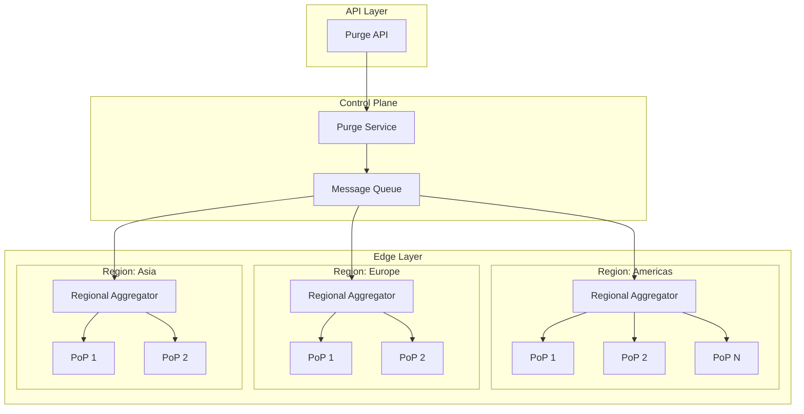
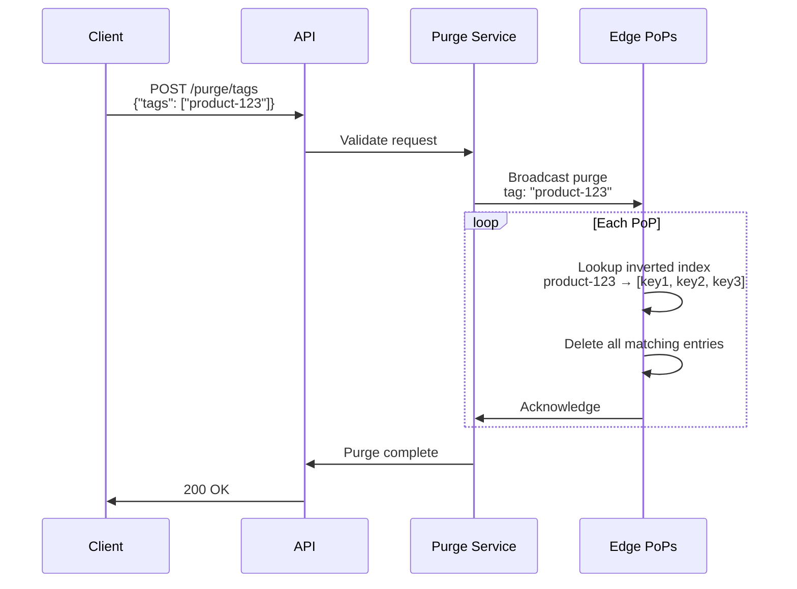
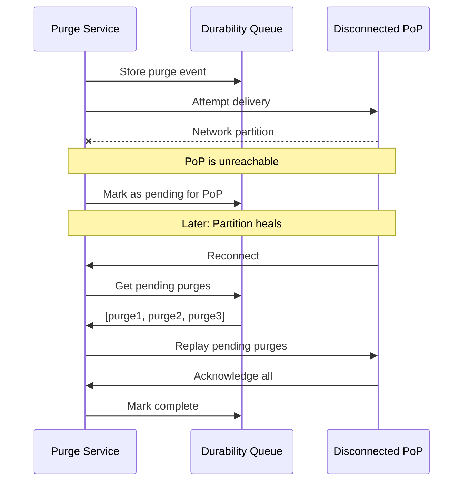
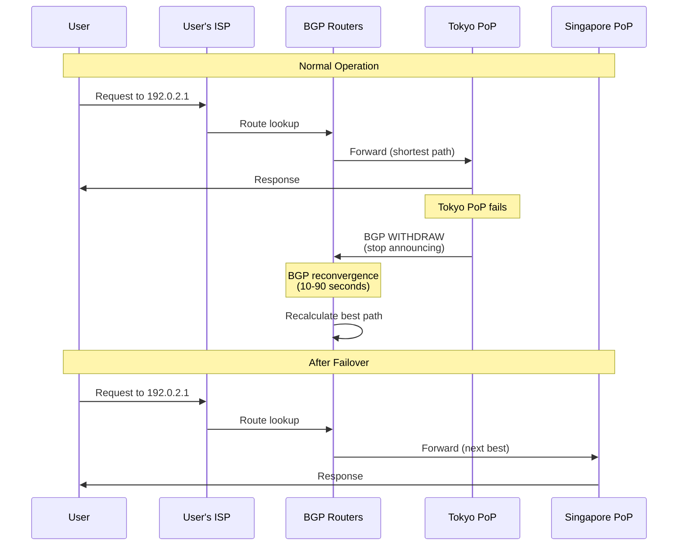
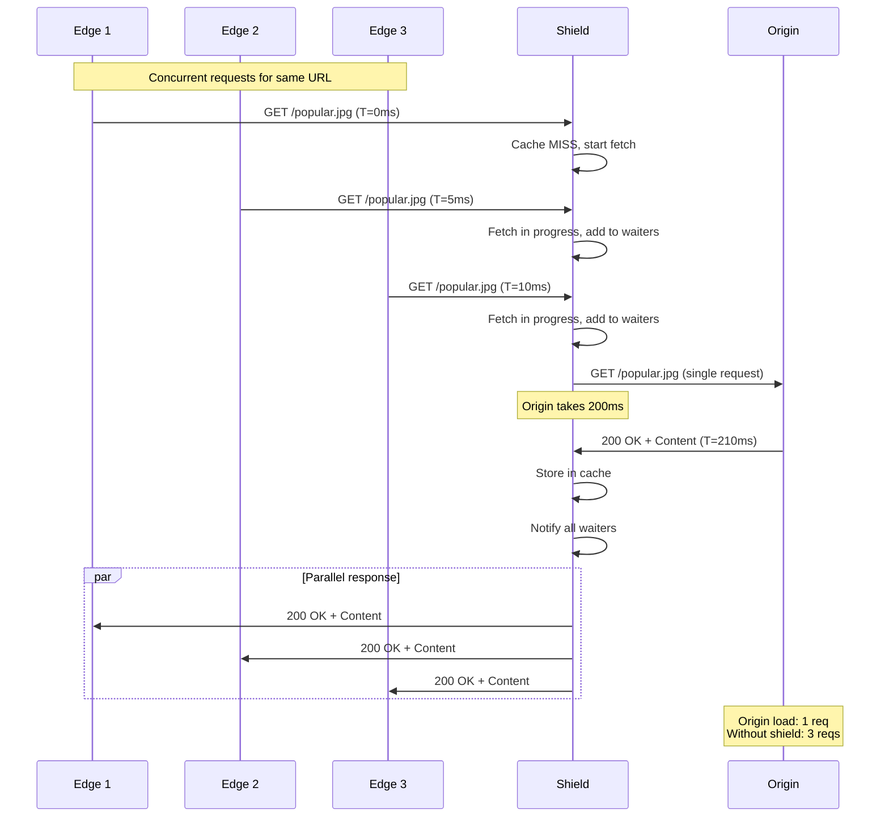
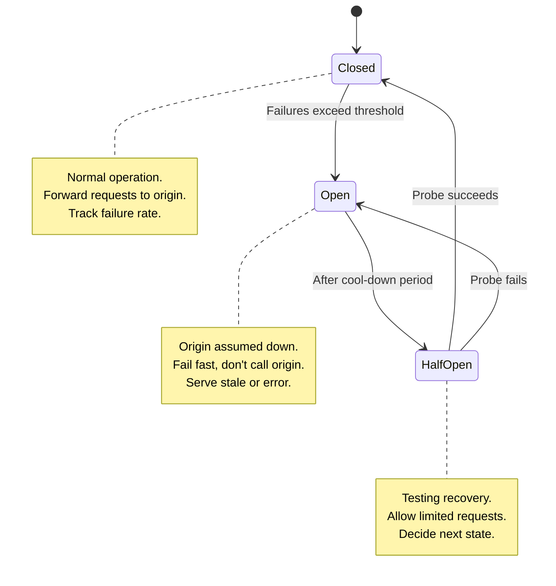
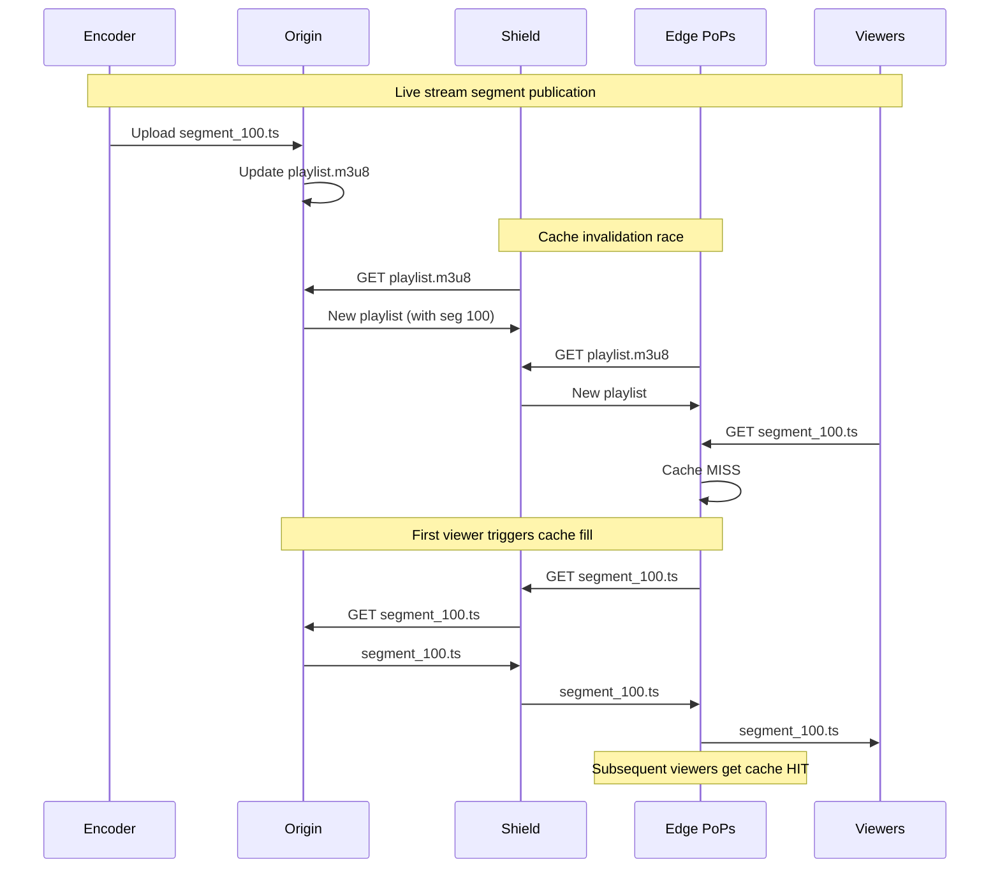
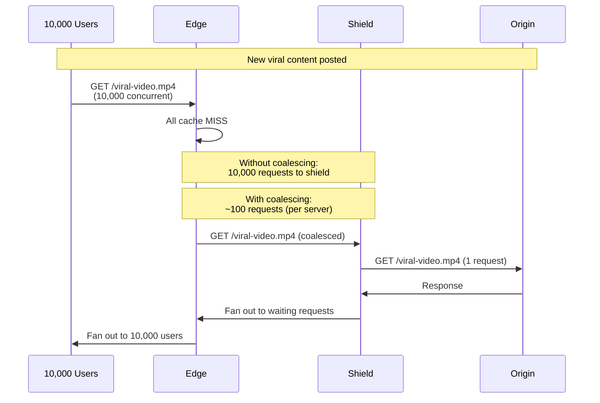

# Deep Dive and Bottlenecks

[← Back to Index](./00-index.md)

---

## Table of Contents
- [Critical Component 1: Cache Invalidation at Scale](#critical-component-1-cache-invalidation-at-scale)
- [Critical Component 2: Anycast Routing and BGP](#critical-component-2-anycast-routing-and-bgp)
- [Critical Component 3: Origin Shield](#critical-component-3-origin-shield)
- [Critical Component 4: Video Streaming Optimization](#critical-component-4-video-streaming-optimization)
- [Bottleneck Analysis](#bottleneck-analysis)

---

## Critical Component 1: Cache Invalidation at Scale

### The Challenge

When content updates at origin, cached copies across 200+ PoPs must be invalidated quickly and reliably. This creates several challenges:

1. **Propagation Delay**: How to notify all edge nodes globally?
2. **Consistency**: What happens during propagation window?
3. **Scale**: Handling millions of purge requests per hour
4. **Reliability**: Purge must succeed even if some nodes are down

### Purge Propagation Architecture



### Purge Strategies

#### 1. URL-Based Purge

```python
class URLPurge:
    """
    Purge specific URLs from cache.
    """

    async def purge(self, urls: list[str]) -> PurgeResult:
        """
        Purge list of URLs from all PoPs.
        """
        # 1. Validate and normalize URLs
        normalized_urls = [
            self._normalize_url(url) for url in urls
        ]

        # 2. Compute cache keys
        cache_keys = [
            self._compute_cache_key(url) for url in normalized_urls
        ]

        # 3. Publish to message queue
        purge_event = PurgeEvent(
            type="url",
            cache_keys=cache_keys,
            timestamp=time.time(),
            request_id=generate_id()
        )

        await self.message_queue.publish(
            topic="purge-events",
            message=purge_event
        )

        # 4. Wait for acknowledgments (with timeout)
        acks = await self._wait_for_acks(
            purge_event.request_id,
            expected_count=self.total_pop_count,
            timeout=5.0  # 5 second timeout
        )

        return PurgeResult(
            success=acks.count >= acks.expected * 0.95,  # 95% threshold
            propagation_time_ms=acks.max_latency
        )
```

#### 2. Surrogate Key Purge (Tag-Based)



```python
class SurrogateKeyPurge:
    """
    Purge by surrogate key (tag).

    Advantages:
    - O(1) to identify affected entries via inverted index
    - No need to know exact URLs
    - Group related content efficiently
    """

    async def purge_by_tag(self, tag: str) -> PurgeResult:
        """
        Purge all entries tagged with surrogate key.
        """
        purge_event = PurgeEvent(
            type="surrogate_key",
            surrogate_key=tag,
            timestamp=time.time()
        )

        # Broadcast to all PoPs
        await self.message_queue.publish(
            topic="purge-events",
            message=purge_event
        )

        return await self._wait_for_completion(purge_event)


# At each edge node:
class EdgePurgeHandler:

    async def handle_surrogate_purge(self, tag: str):
        """
        Handle surrogate key purge at edge.
        """
        # Lookup all cache keys with this tag
        cache_keys = self.surrogate_index.get(tag, set())

        # Delete all matching entries
        for cache_key in cache_keys:
            await self.cache.delete(cache_key)

        # Clean up index
        del self.surrogate_index[tag]
```

#### 3. Wildcard Purge (Pattern-Based)

```python
async def purge_by_pattern(self, pattern: str) -> PurgeResult:
    """
    Purge by URL pattern (e.g., "/images/*").

    Warning: Expensive operation - requires cache scan.
    """
    # Convert pattern to regex
    regex = self._pattern_to_regex(pattern)

    # Broadcast to all PoPs
    purge_event = PurgeEvent(
        type="pattern",
        pattern=regex,
        timestamp=time.time()
    )

    await self.message_queue.publish(
        topic="purge-events",
        message=purge_event
    )

    # Pattern purge is slower - increase timeout
    return await self._wait_for_completion(
        purge_event,
        timeout=30.0
    )

# At edge:
async def handle_pattern_purge(self, regex: str):
    """
    Scan cache and delete matching entries.
    Note: O(n) operation - use sparingly.
    """
    compiled = re.compile(regex)

    for cache_key, entry in self.cache.items():
        if compiled.match(entry.url):
            await self.cache.delete(cache_key)
```

### Fastly-Style Instant Purge

Fastly achieves ~150ms global purge through:

```
┌────────────────────────────────────────────────────────────────────┐
│ INSTANT PURGE ARCHITECTURE                                          │
├────────────────────────────────────────────────────────────────────┤
│                                                                     │
│ Key Innovations:                                                    │
│                                                                     │
│ 1. Persistent Connections                                          │
│    - All PoPs maintain persistent WebSocket to control plane       │
│    - No connection setup delay                                      │
│                                                                     │
│ 2. Regional Fanout                                                  │
│    - 5 regional hubs instead of direct to 100+ PoPs               │
│    - Parallel fanout within each region                            │
│                                                                     │
│ 3. Soft Purge                                                       │
│    - Mark as stale instead of delete                               │
│    - Next request triggers revalidation                            │
│    - Faster than hard delete                                       │
│                                                                     │
│ 4. Async Acknowledgment                                             │
│    - Fire-and-forget with async confirmation                       │
│    - Don't block on slowest node                                   │
│                                                                     │
│ Timeline:                                                           │
│   0ms    - Purge received at API                                   │
│   5ms    - Validated and queued                                    │
│   10ms   - Published to regional hubs                              │
│   50ms   - Regional hubs fanout to PoPs                            │
│   100ms  - Most PoPs acknowledge                                   │
│   150ms  - 99% of PoPs complete                                    │
│                                                                     │
└────────────────────────────────────────────────────────────────────┘
```

### Handling Purge During Partition



---

## Critical Component 2: Anycast Routing and BGP

### How Anycast Works

```
┌────────────────────────────────────────────────────────────────────┐
│ ANYCAST ROUTING                                                     │
├────────────────────────────────────────────────────────────────────┤
│                                                                     │
│ All PoPs announce the same IP address via BGP:                     │
│                                                                     │
│   CDN IP: 192.0.2.1                                                │
│                                                                     │
│   Tokyo PoP ────── BGP: "I can reach 192.0.2.1"                    │
│   Frankfurt PoP ── BGP: "I can reach 192.0.2.1"                    │
│   New York PoP ─── BGP: "I can reach 192.0.2.1"                    │
│                                                                     │
│ Internet routers choose shortest path:                              │
│                                                                     │
│   User in Japan:                                                    │
│     → Routes to Tokyo (3 AS hops)                                  │
│     ✗ Frankfurt (12 AS hops)                                       │
│     ✗ New York (8 AS hops)                                         │
│                                                                     │
│   User in Germany:                                                  │
│     ✗ Tokyo (12 AS hops)                                           │
│     → Routes to Frankfurt (2 AS hops)                              │
│     ✗ New York (6 AS hops)                                         │
│                                                                     │
└────────────────────────────────────────────────────────────────────┘
```

### BGP Configuration for CDN

```python
# Conceptual BGP configuration per PoP

class BGPAnnouncement:
    """
    BGP route announcement for CDN anycast.
    """

    def __init__(self, pop_id: str, config: BGPConfig):
        self.pop_id = pop_id
        self.prefix = "192.0.2.0/24"  # CDN anycast prefix
        self.local_as = config.asn     # CDN's AS number
        self.config = config

    def generate_announcement(self) -> dict:
        """
        Generate BGP UPDATE message attributes.
        """
        return {
            "type": "UPDATE",
            "withdrawn_routes": [],
            "path_attributes": {
                "ORIGIN": "IGP",          # Originated internally
                "AS_PATH": [self.local_as],
                "NEXT_HOP": self.config.router_ip,
                "MED": self._calculate_med(),  # Traffic engineering
                "COMMUNITY": [
                    f"{self.local_as}:100",   # Standard community
                    f"{self.local_as}:{self.pop_id}"  # PoP identifier
                ]
            },
            "nlri": [self.prefix]
        }

    def _calculate_med(self) -> int:
        """
        Multi-Exit Discriminator for preference.
        Lower = more preferred.
        """
        # Base MED on current load
        load_factor = self.get_current_load()

        if load_factor > 0.9:
            return 200  # High load, less preferred
        elif load_factor > 0.7:
            return 100  # Medium load
        else:
            return 50   # Low load, preferred
```

### Anycast Failover Mechanics



### Challenges with Anycast

| Challenge | Description | Mitigation |
|-----------|-------------|------------|
| **Session Persistence** | TCP connection may route to different PoP after BGP change | Connection tracking, or stateless design |
| **Slow Convergence** | BGP takes 10-90 seconds | Health checks, proactive withdrawal |
| **Route Flapping** | Unstable PoP causes repeated changes | Damping, stability thresholds |
| **Debugging** | Hard to trace which PoP handled request | Request ID with PoP identifier |

### Proactive Health-Based Routing

```python
class PoP HealthManager:
    """
    Manage BGP announcements based on health.
    """

    def __init__(self, bgp_session: BGPSession):
        self.bgp = bgp_session
        self.is_announcing = True

    async def health_check_loop(self):
        """
        Continuously monitor health and adjust BGP.
        """
        while True:
            health = await self._check_health()

            if health.is_healthy and not self.is_announcing:
                # Recovered - start announcing
                await self.bgp.announce(self.prefix)
                self.is_announcing = True
                logger.info("PoP healthy, announcing routes")

            elif not health.is_healthy and self.is_announcing:
                # Unhealthy - withdraw routes BEFORE failure
                await self.bgp.withdraw(self.prefix)
                self.is_announcing = False
                logger.warning("PoP unhealthy, withdrawing routes")

            await asyncio.sleep(1)  # Check every second

    async def _check_health(self) -> Health:
        """
        Check PoP health indicators.
        """
        return Health(
            cpu_ok=self.cpu_usage < 90,
            memory_ok=self.memory_usage < 85,
            disk_ok=self.disk_usage < 90,
            origin_reachable=await self._check_origin(),
            error_rate_ok=self.error_rate < 0.01
        )
```

---

## Critical Component 3: Origin Shield

### Request Collapsing Deep Dive



### Shield Implementation Details

```python
class OriginShield:
    """
    Origin shield with request collapsing and failover.
    """

    def __init__(self, config: ShieldConfig):
        self.cache = ShieldCache(config.cache_size)
        self.coalescer = RequestCoalescer()
        self.circuit_breaker = CircuitBreaker(config.circuit_breaker)
        self.origins = config.origins

    async def fetch(self, request: Request) -> Response:
        """
        Fetch content with caching and request collapsing.
        """
        cache_key = self._build_cache_key(request)

        # 1. Check cache
        entry = await self.cache.get(cache_key)
        if entry and self._is_fresh(entry):
            return self._build_response(entry)

        # 2. Stale-while-revalidate
        if entry and self._is_within_swr(entry):
            asyncio.create_task(
                self._revalidate(cache_key, request)
            )
            return self._build_response(entry)

        # 3. Fetch with request collapsing
        try:
            response = await self.coalescer.get_or_fetch(
                cache_key,
                lambda: self._fetch_from_origin(request)
            )

            # Store in cache
            if self._is_cacheable(response):
                await self.cache.put(cache_key, response)

            return response

        except OriginError as e:
            # 4. Stale-if-error fallback
            if entry and self._is_within_sie(entry):
                logger.warning(f"Origin error, serving stale: {e}")
                return self._build_response(entry, add_warning=True)
            raise

    async def _fetch_from_origin(self, request: Request) -> Response:
        """
        Fetch from origin with circuit breaker and failover.
        """
        # Check circuit breaker
        if self.circuit_breaker.is_open:
            raise CircuitBreakerOpenError()

        # Try origins in priority order
        for origin in self.origins:
            try:
                async with self.circuit_breaker:
                    response = await origin.fetch(request)

                    if response.status < 500:
                        return response

            except (ConnectionError, TimeoutError) as e:
                logger.warning(f"Origin {origin.host} failed: {e}")
                continue

        raise AllOriginsFailedError()
```

### Shield Circuit Breaker



```python
class CircuitBreaker:
    """
    Circuit breaker for origin protection.
    """

    def __init__(self, config: CircuitBreakerConfig):
        self.failure_threshold = config.failure_threshold  # e.g., 5
        self.recovery_timeout = config.recovery_timeout    # e.g., 30s
        self.half_open_requests = config.half_open_requests  # e.g., 3

        self.state = CircuitState.CLOSED
        self.failure_count = 0
        self.last_failure_time = None
        self.half_open_successes = 0

    @property
    def is_open(self) -> bool:
        if self.state == CircuitState.OPEN:
            # Check if recovery timeout passed
            if time.time() - self.last_failure_time > self.recovery_timeout:
                self.state = CircuitState.HALF_OPEN
                self.half_open_successes = 0
                return False
            return True
        return False

    async def __aenter__(self):
        if self.is_open:
            raise CircuitBreakerOpenError()

    async def __aexit__(self, exc_type, exc, tb):
        if exc_type is not None:
            self._record_failure()
        else:
            self._record_success()

    def _record_failure(self):
        self.failure_count += 1
        self.last_failure_time = time.time()

        if self.state == CircuitState.HALF_OPEN:
            self.state = CircuitState.OPEN

        elif (self.state == CircuitState.CLOSED and
              self.failure_count >= self.failure_threshold):
            self.state = CircuitState.OPEN

    def _record_success(self):
        if self.state == CircuitState.HALF_OPEN:
            self.half_open_successes += 1
            if self.half_open_successes >= self.half_open_requests:
                self.state = CircuitState.CLOSED
                self.failure_count = 0
```

---

## Critical Component 4: Video Streaming Optimization

### Adaptive Bitrate Streaming

```
┌────────────────────────────────────────────────────────────────────┐
│ ADAPTIVE BITRATE STREAMING                                          │
├────────────────────────────────────────────────────────────────────┤
│                                                                     │
│ Player Behavior:                                                    │
│                                                                     │
│   1. Fetch master.m3u8 (list of quality levels)                   │
│   2. Select initial quality based on network                       │
│   3. Fetch variant playlist for selected quality                   │
│   4. Download segments sequentially                                │
│   5. Monitor buffer and bandwidth                                  │
│   6. Switch quality up/down as needed                              │
│                                                                     │
│ CDN Optimization:                                                   │
│                                                                     │
│   Manifest (m3u8):                                                  │
│   • Short TTL (2-10 seconds) for live                             │
│   • Long TTL for VOD                                               │
│   • Cache at edge for fast access                                  │
│                                                                     │
│   Segments (.ts, .m4s):                                            │
│   • Long TTL (24h+, immutable)                                     │
│   • Pre-cache popular segments                                     │
│   • Parallel fetch from shield                                     │
│                                                                     │
│ Quality Levels:                                                     │
│   ┌─────────────────────────────────────────────────────────────┐  │
│   │ Resolution │ Bitrate │ Segment Size │ Bandwidth Needed       │  │
│   ├─────────────────────────────────────────────────────────────┤  │
│   │ 360p       │ 800k    │ ~1 MB/10s    │ 1 Mbps                │  │
│   │ 720p       │ 2.5M    │ ~3 MB/10s    │ 3 Mbps                │  │
│   │ 1080p      │ 5M      │ ~6 MB/10s    │ 6 Mbps                │  │
│   │ 4K         │ 15M     │ ~18 MB/10s   │ 20 Mbps               │  │
│   └─────────────────────────────────────────────────────────────┘  │
│                                                                     │
└────────────────────────────────────────────────────────────────────┘
```

### Live Streaming Edge Challenges



### Pre-Positioning for Live Events

```python
class LiveEventPreparer:
    """
    Pre-warm caches for expected live events.
    """

    async def prepare_for_event(
        self,
        event_id: str,
        expected_viewers: int,
        geo_distribution: dict[str, float]
    ):
        """
        Prepare CDN infrastructure for live event.
        """

        # 1. Calculate required capacity per region
        region_capacity = {}
        for region, percentage in geo_distribution.items():
            viewers = expected_viewers * percentage
            bandwidth = viewers * 5_000_000  # 5 Mbps avg
            region_capacity[region] = bandwidth

        # 2. Pre-warm manifests in all relevant PoPs
        manifests = await self._get_manifest_urls(event_id)
        for pop in self._get_pops_for_regions(geo_distribution.keys()):
            await self._prewarm_pop(pop, manifests)

        # 3. Enable aggressive segment pre-fetch
        await self._configure_prefetch(event_id, enabled=True)

        # 4. Scale origin shield
        await self._scale_shield(region_capacity)

        # 5. Configure longer stale-if-error
        await self._set_event_cache_config(
            event_id,
            stale_if_error=300  # 5 minutes
        )

    async def _prewarm_pop(self, pop: PoP, urls: list[str]):
        """
        Pre-fetch content to specific PoP.
        """
        for url in urls:
            await pop.fetch_and_cache(url)
```

---

## Bottleneck Analysis

### Bottleneck 1: PoP Capacity Exhaustion

```
┌────────────────────────────────────────────────────────────────────┐
│ BOTTLENECK: PoP CAPACITY                                           │
├────────────────────────────────────────────────────────────────────┤
│                                                                     │
│ Symptoms:                                                           │
│   • Increased latency at specific PoP                              │
│   • Connection timeouts                                            │
│   • 503 errors                                                      │
│                                                                     │
│ Causes:                                                             │
│   • Traffic spike (viral content, DDoS)                            │
│   • Server failures within PoP                                     │
│   • Network link saturation                                        │
│                                                                     │
│ Mitigations:                                                        │
│   1. Traffic steering via BGP MED                                  │
│      - Increase MED to make PoP less preferred                     │
│      - Traffic shifts to nearby PoPs                               │
│                                                                     │
│   2. Load shedding                                                  │
│      - Reject new connections above threshold                      │
│      - Prioritize existing connections                             │
│                                                                     │
│   3. Auto-scaling within PoP                                       │
│      - Spin up additional servers (cloud PoPs)                    │
│      - Takes minutes, not instant                                  │
│                                                                     │
│   4. Anycast natural balancing                                     │
│      - Overloaded PoP responds slower                              │
│      - BGP naturally routes to faster PoP                          │
│                                                                     │
└────────────────────────────────────────────────────────────────────┘
```

### Bottleneck 2: Origin Shield Overload

```python
class ShieldLoadBalancer:
    """
    Strategies for shield overload.
    """

    async def handle_overload(self, shield: Shield):
        """
        Handle shield overload condition.
        """

        if shield.load > 0.9:
            # 1. Increase cache TTLs temporarily
            await self._extend_ttls(multiplier=2)

            # 2. Enable aggressive request collapsing
            await self._set_coalescing_window(5.0)  # 5 second window

            # 3. Reduce origin fetch parallelism
            await self._set_origin_concurrency(100)

            # 4. Serve stale more aggressively
            await self._set_stale_if_error(3600)

        if shield.load > 0.95:
            # 5. Spillover to backup shield
            await self._enable_backup_shield()

            # 6. Circuit break to origin
            await self._open_circuit_breaker()
```

### Bottleneck 3: TLS Handshake Overhead

```
┌────────────────────────────────────────────────────────────────────┐
│ BOTTLENECK: TLS HANDSHAKE                                          │
├────────────────────────────────────────────────────────────────────┤
│                                                                     │
│ Cost per new connection:                                            │
│   • TLS 1.2: 2 RTT                                                 │
│   • TLS 1.3: 1 RTT                                                 │
│   • TLS 1.3 + 0-RTT: 0 RTT (for resumption)                       │
│                                                                     │
│ CPU impact:                                                         │
│   • ECDHE key exchange: ~1ms CPU                                   │
│   • RSA signing: ~0.5ms CPU                                        │
│   • At 10,000 new connections/sec: significant CPU                 │
│                                                                     │
│ Mitigations:                                                        │
│                                                                     │
│   1. TLS Session Resumption                                        │
│      - Session tickets (stateless)                                 │
│      - Session IDs (stateful)                                      │
│      - Eliminates key exchange on resume                           │
│                                                                     │
│   2. HTTP/3 (QUIC)                                                 │
│      - Combined transport + TLS handshake                          │
│      - 0-RTT for known servers                                     │
│                                                                     │
│   3. OCSP Stapling                                                 │
│      - Pre-fetch certificate validation                            │
│      - Avoid client→CA round trip                                  │
│                                                                     │
│   4. Hardware Acceleration                                          │
│      - AES-NI for encryption                                       │
│      - Crypto offload cards                                        │
│                                                                     │
└────────────────────────────────────────────────────────────────────┘
```

### Bottleneck 4: Thundering Herd on Popular Content



---

## Summary of Critical Components

| Component | Key Challenge | Solution |
|-----------|--------------|----------|
| **Cache Invalidation** | Global propagation in <200ms | Regional fanout, persistent connections |
| **Anycast Routing** | Failover during BGP convergence | Proactive health-based withdrawal |
| **Origin Shield** | Protecting origin from edge load | Request collapsing, circuit breaker |
| **Video Streaming** | Live event cache warmup | Pre-positioning, segment prefetch |
