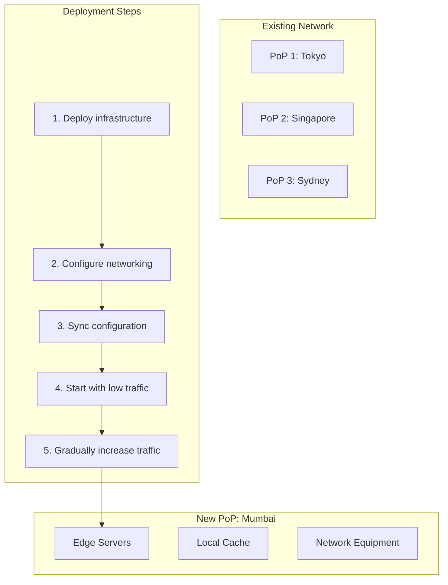
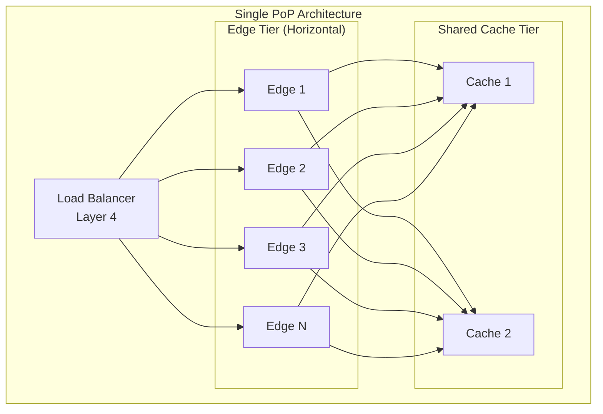
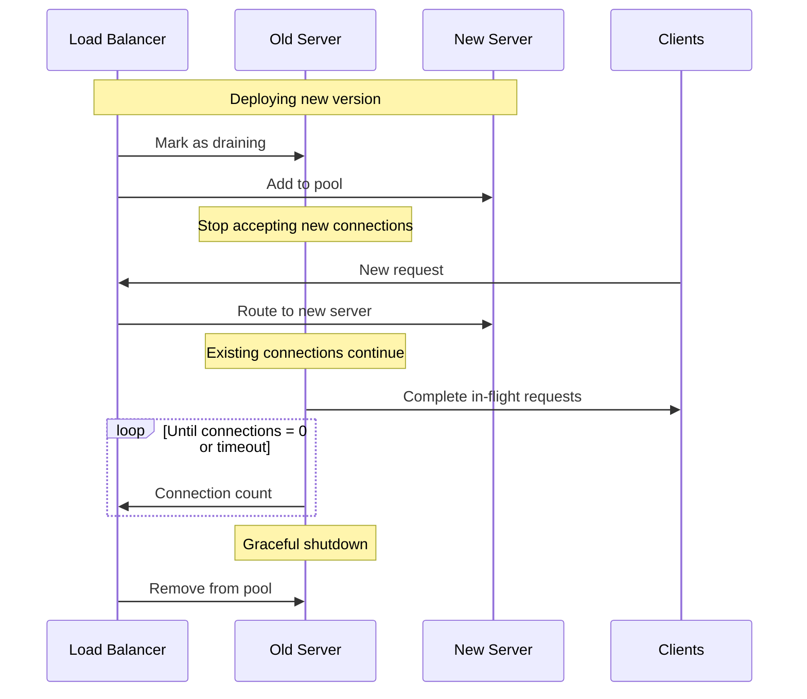
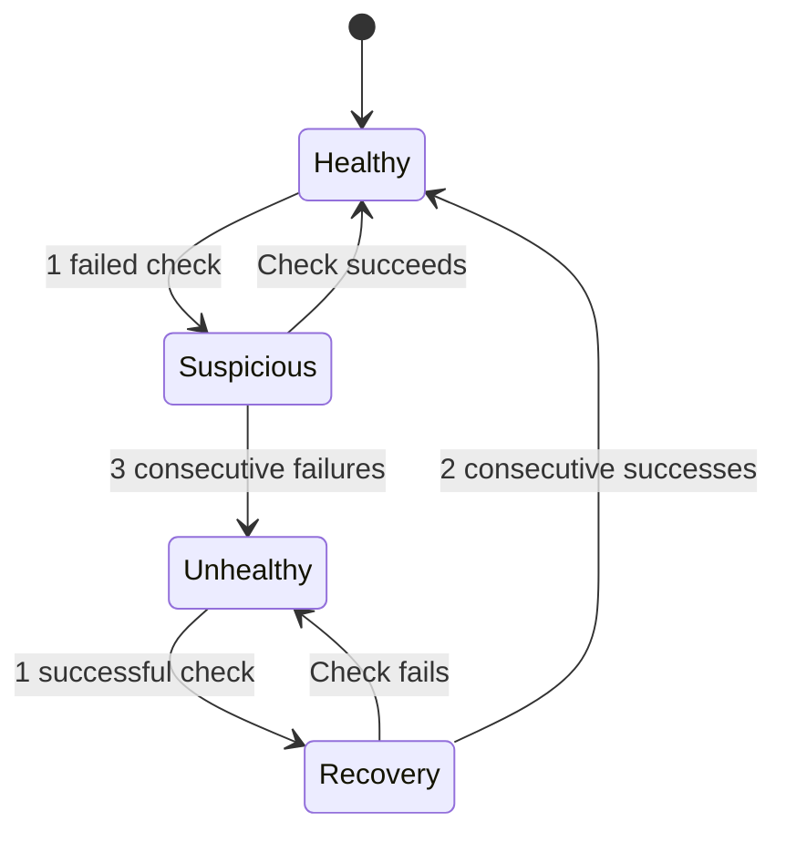
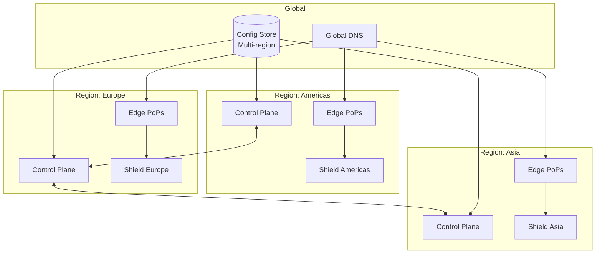

# Scalability and Reliability

[← Back to Index](./00-index.md)

---

## Table of Contents
- [Horizontal Scaling](#horizontal-scaling)
- [Fault Tolerance](#fault-tolerance)
- [Multi-Origin Support](#multi-origin-support)
- [Graceful Degradation](#graceful-degradation)
- [Disaster Recovery](#disaster-recovery)

---

## Horizontal Scaling

### Adding New PoPs



#### PoP Deployment Process

```
┌────────────────────────────────────────────────────────────────────┐
│ NEW PoP DEPLOYMENT CHECKLIST                                        │
├────────────────────────────────────────────────────────────────────┤
│                                                                     │
│ Phase 1: Infrastructure (Week 1-2)                                  │
│   □ Secure colocation space                                         │
│   □ Install network equipment (routers, switches)                  │
│   □ Deploy edge servers                                             │
│   □ Configure storage (SSD arrays)                                 │
│   □ Set up power and cooling                                       │
│                                                                     │
│ Phase 2: Network (Week 2-3)                                         │
│   □ Establish peering with local ISPs                              │
│   □ Configure BGP sessions                                          │
│   □ Set up monitoring network paths                                 │
│   □ Test connectivity to shield regions                            │
│   □ Validate anycast announcement                                  │
│                                                                     │
│ Phase 3: Software (Week 3)                                          │
│   □ Deploy edge software stack                                      │
│   □ Sync customer configurations                                   │
│   □ Load TLS certificates                                          │
│   □ Configure cache policies                                       │
│   □ Set up logging and metrics                                     │
│                                                                     │
│ Phase 4: Traffic (Week 4)                                           │
│   □ Start with internal test traffic                               │
│   □ Enable for beta customers (5%)                                 │
│   □ Monitor performance and errors                                 │
│   □ Gradually increase traffic (25% → 50% → 100%)                 │
│   □ Full production traffic                                        │
│                                                                     │
│ Rollback Plan:                                                      │
│   • Withdraw BGP announcement (2 min)                              │
│   • Traffic reroutes to next nearest PoP                           │
│                                                                     │
└────────────────────────────────────────────────────────────────────┘
```

### Scaling Within a PoP



#### Scaling Strategies

| Dimension | Strategy | Trigger |
|-----------|----------|---------|
| **Edge Servers** | Add more servers behind LB | CPU > 70% |
| **Cache Capacity** | Add SSD storage or cache servers | Cache eviction rate high |
| **Network Bandwidth** | Add network links, upgrade capacity | Link utilization > 80% |
| **Load Balancers** | ECMP across multiple LBs | LB CPU > 60% |

### Global Traffic Distribution

```python
class TrafficDistributor:
    """
    Manage global traffic distribution across PoPs.
    """

    def __init__(self, pops: list[PoP]):
        self.pops = pops

    def calculate_optimal_distribution(
        self,
        user_locations: dict[str, int]
    ) -> dict[str, list[PoP]]:
        """
        Calculate which PoPs should serve which regions.
        """
        distribution = {}

        for region, user_count in user_locations.items():
            # Find PoPs within acceptable latency
            nearby_pops = self._get_nearby_pops(region, max_latency_ms=50)

            # Sort by available capacity
            nearby_pops.sort(
                key=lambda p: p.available_capacity,
                reverse=True
            )

            # Assign primary and backups
            distribution[region] = {
                'primary': nearby_pops[0] if nearby_pops else None,
                'backups': nearby_pops[1:3]  # Up to 2 backups
            }

        return distribution

    def rebalance_traffic(self, overloaded_pop: PoP):
        """
        Shift traffic away from overloaded PoP.
        """
        # 1. Increase BGP MED (less preferred)
        overloaded_pop.set_bgp_med(200)

        # 2. Find nearby PoPs with capacity
        neighbors = self._get_nearby_pops(
            overloaded_pop.region,
            exclude=[overloaded_pop]
        )

        # 3. Decrease their MED (more preferred)
        for pop in neighbors[:2]:
            if pop.load < 0.7:
                pop.set_bgp_med(50)

        # 4. Monitor for convergence
        return self._wait_for_rebalance(overloaded_pop)
```

---

## Fault Tolerance

### PoP Failure Handling

```mermaid
sequenceDiagram
    participant Monitor as Health Monitor
    participant PoP as Tokyo PoP
    participant BGP as BGP Routers
    participant Alt as Singapore PoP
    participant Users

    loop Every 1 second
        Monitor->>PoP: Health check
        PoP->>Monitor: OK
    end

    Note over PoP: PoP failure

    Monitor->>PoP: Health check
    PoP--xMonitor: Timeout

    Monitor->>Monitor: 3 consecutive failures

    Monitor->>PoP: Withdraw BGP routes

    PoP->>BGP: BGP WITHDRAW

    Note over BGP: Reconvergence (10-90s)

    Users->>BGP: Request to anycast IP
    BGP->>Alt: Route to Singapore

    Alt->>Users: Response
```

### Anycast Failover

```
┌────────────────────────────────────────────────────────────────────┐
│ ANYCAST FAILOVER MECHANICS                                          │
├────────────────────────────────────────────────────────────────────┤
│                                                                     │
│ Before Failure:                                                     │
│                                                                     │
│   User (Japan) ──BGP──> Tokyo PoP (3 hops)                        │
│                  └────> Singapore PoP (5 hops, backup)            │
│                                                                     │
│ After Tokyo Failure:                                                │
│                                                                     │
│   1. Tokyo withdraws BGP announcement                              │
│   2. BGP routers recalculate paths                                 │
│   3. Singapore becomes best path                                   │
│   4. Traffic automatically shifts                                   │
│                                                                     │
│   User (Japan) ──BGP──> Tokyo PoP (withdrawn)                     │
│                  └────> Singapore PoP (now primary)               │
│                                                                     │
│ Failover Timeline:                                                  │
│   T=0:     Failure detected                                        │
│   T=1s:    BGP WITHDRAW sent                                       │
│   T=10-30s: Most routers converged                                │
│   T=90s:   All routers converged (worst case)                     │
│                                                                     │
│ During Convergence:                                                │
│   • Some requests may timeout                                      │
│   • TCP connections may reset                                      │
│   • Clients retry and succeed                                      │
│                                                                     │
└────────────────────────────────────────────────────────────────────┘
```

### Serving Stale on Origin Failure

```python
class StaleContentServer:
    """
    Serve stale content when origin is unavailable.
    """

    async def get_content(
        self,
        cache_key: str,
        cache_entry: Optional[CacheEntry],
        fetch_func: Callable
    ) -> Response:
        """
        Attempt fresh fetch, fall back to stale.
        """
        try:
            # Try to get fresh content
            response = await asyncio.wait_for(
                fetch_func(),
                timeout=5.0
            )
            return response

        except (TimeoutError, ConnectionError, HTTPError) as e:
            # Origin failed - check for stale content
            if cache_entry and self._within_stale_if_error(cache_entry):
                logger.warning(
                    f"Origin failed, serving stale: {e}"
                )
                return self._build_stale_response(cache_entry)

            # No stale content available
            raise OriginUnavailableError()

    def _within_stale_if_error(self, entry: CacheEntry) -> bool:
        """
        Check if entry is within stale-if-error window.
        """
        stale_window = entry.stale_if_error or 86400  # Default 24h
        expiry = entry.created_at + entry.max_age + stale_window
        return time.time() < expiry

    def _build_stale_response(self, entry: CacheEntry) -> Response:
        """
        Build response with stale warning header.
        """
        response = Response(
            status=200,
            body=entry.body,
            headers=entry.headers
        )

        # Add warning header per RFC 7234
        response.headers['Warning'] = '110 - "Response is Stale"'
        response.headers['X-Cache-Status'] = 'STALE'

        return response
```

### Connection Draining



---

## Multi-Origin Support

### Origin Failover Configuration

```yaml
# Customer origin configuration
origin_config:
  domain: cdn.customer.com

  primary_origin:
    host: origin-west.customer.com
    port: 443
    weight: 70
    health_check:
      path: /health
      interval: 5s
      timeout: 3s
      healthy_threshold: 2
      unhealthy_threshold: 3

  secondary_origins:
    - host: origin-east.customer.com
      port: 443
      weight: 30
      failover_only: false  # Active-active

    - host: origin-backup.customer.com
      port: 443
      weight: 0
      failover_only: true   # Standby only

  failover_behavior:
    retry_count: 2
    retry_delay: 100ms
    failover_codes: [502, 503, 504]
```

### Origin Selection Algorithm

```python
class OriginSelector:
    """
    Select origin based on health and weight.
    """

    def __init__(self, origins: list[Origin]):
        self.origins = origins
        self.healthy_origins = []
        self._update_healthy_list()

    def select_origin(self) -> Origin:
        """
        Weighted random selection among healthy origins.
        """
        if not self.healthy_origins:
            # All origins down - try primary anyway
            return self.origins[0]

        # Filter out failover-only unless all active are down
        active_origins = [
            o for o in self.healthy_origins
            if not o.failover_only
        ]

        if not active_origins:
            # Use failover origins
            active_origins = self.healthy_origins

        # Weighted random selection
        total_weight = sum(o.weight for o in active_origins)
        if total_weight == 0:
            return random.choice(active_origins)

        rand = random.uniform(0, total_weight)
        cumulative = 0

        for origin in active_origins:
            cumulative += origin.weight
            if rand <= cumulative:
                return origin

        return active_origins[-1]

    async def fetch_with_failover(
        self,
        request: Request
    ) -> Response:
        """
        Fetch with automatic failover on failure.
        """
        tried_origins = set()
        last_error = None

        for attempt in range(3):  # Max 3 origins
            origin = self.select_origin()

            # Don't retry same origin
            while origin in tried_origins and len(tried_origins) < len(self.healthy_origins):
                origin = self.select_origin()

            tried_origins.add(origin)

            try:
                response = await origin.fetch(request)

                if response.status not in [502, 503, 504]:
                    return response

                last_error = HTTPError(response.status)

            except (ConnectionError, TimeoutError) as e:
                last_error = e
                self._mark_unhealthy(origin)

            await asyncio.sleep(0.1 * (attempt + 1))  # Backoff

        raise AllOriginsFailedError(last_error)
```

### Origin Health Monitoring



---

## Graceful Degradation

### Degradation Levels

```
┌────────────────────────────────────────────────────────────────────┐
│ GRACEFUL DEGRADATION LEVELS                                         │
├────────────────────────────────────────────────────────────────────┤
│                                                                     │
│ Level 0: Normal Operation                                          │
│   • Full functionality                                              │
│   • All features enabled                                           │
│   • Standard cache TTLs                                            │
│                                                                     │
│ Level 1: Minor Degradation (System Load 70-85%)                    │
│   • Extend cache TTLs by 2x                                        │
│   • Reduce origin fetch parallelism                                │
│   • Disable non-essential features (real-time analytics)          │
│                                                                     │
│ Level 2: Moderate Degradation (System Load 85-95%)                 │
│   • Extend cache TTLs by 4x                                        │
│   • Enable aggressive stale-while-revalidate                       │
│   • Rate limit purge requests                                      │
│   • Disable edge compute                                           │
│                                                                     │
│ Level 3: Severe Degradation (System Load 95%+)                     │
│   • Serve stale for all cacheable content                          │
│   • Stop background revalidation                                   │
│   • Drop non-essential requests                                    │
│   • Redirect to backup CDN                                         │
│                                                                     │
│ Level 4: Emergency (Imminent Failure)                              │
│   • Static error page from edge                                    │
│   • Circuit break to origin                                        │
│   • All traffic to backup                                          │
│                                                                     │
└────────────────────────────────────────────────────────────────────┘
```

### Implementing Degradation

```python
class GracefulDegradation:
    """
    Manage graceful degradation based on system health.
    """

    def __init__(self):
        self.current_level = 0
        self.level_thresholds = {
            1: 0.70,
            2: 0.85,
            3: 0.95,
            4: 0.99
        }

    async def check_and_adjust(self):
        """
        Periodically check system health and adjust level.
        """
        metrics = await self._collect_metrics()
        load = self._calculate_overall_load(metrics)

        new_level = 0
        for level, threshold in sorted(self.level_thresholds.items()):
            if load >= threshold:
                new_level = level

        if new_level != self.current_level:
            await self._apply_level(new_level)
            self.current_level = new_level

    async def _apply_level(self, level: int):
        """
        Apply degradation settings for level.
        """
        if level >= 1:
            await self._extend_ttls(multiplier=2 ** level)
            await self._reduce_origin_concurrency(100 // (level + 1))

        if level >= 2:
            await self._enable_aggressive_swr()
            await self._rate_limit_purges(100)  # Per minute

        if level >= 3:
            await self._serve_stale_always()
            await self._disable_background_revalidation()

        if level >= 4:
            await self._enable_static_error_page()
            await self._open_all_circuit_breakers()
```

### Request Prioritization

```python
class RequestPrioritizer:
    """
    Prioritize requests during high load.
    """

    PRIORITY_LEVELS = {
        'critical': 0,    # Health checks, control plane
        'high': 1,        # Premium customers, video segments
        'normal': 2,      # Regular traffic
        'low': 3,         # Analytics, prefetch
        'background': 4   # Purge processing, cache warming
    }

    def get_priority(self, request: Request) -> int:
        """
        Determine request priority.
        """
        # Control plane traffic
        if request.path.startswith('/_cdn/'):
            return self.PRIORITY_LEVELS['critical']

        # Premium customers
        if self._is_premium_customer(request):
            return self.PRIORITY_LEVELS['high']

        # Video streaming (maintain experience)
        if self._is_video_segment(request):
            return self.PRIORITY_LEVELS['high']

        # Background operations
        if request.headers.get('X-CDN-Priority') == 'background':
            return self.PRIORITY_LEVELS['background']

        return self.PRIORITY_LEVELS['normal']

    async def should_accept(
        self,
        request: Request,
        current_load: float
    ) -> bool:
        """
        Decide whether to accept request based on load.
        """
        priority = self.get_priority(request)

        # Always accept critical
        if priority == self.PRIORITY_LEVELS['critical']:
            return True

        # Load-based admission
        if current_load > 0.95:
            return priority <= self.PRIORITY_LEVELS['high']
        elif current_load > 0.90:
            return priority <= self.PRIORITY_LEVELS['normal']
        elif current_load > 0.85:
            return priority <= self.PRIORITY_LEVELS['low']

        return True
```

---

## Disaster Recovery

### Multi-Region Architecture



### DR Runbook

```
┌────────────────────────────────────────────────────────────────────┐
│ DISASTER RECOVERY RUNBOOK                                           │
├────────────────────────────────────────────────────────────────────┤
│                                                                     │
│ Scenario: Full Region Failure                                       │
│                                                                     │
│ Detection:                                                          │
│   • Multiple PoP health checks failing                             │
│   • Control plane unreachable                                      │
│   • Alert: "Region Americas degraded"                              │
│                                                                     │
│ Automatic Response:                                                 │
│   1. Edge PoPs withdraw BGP routes                                 │
│   2. Traffic shifts to other regions                               │
│   3. Shield fails over to backup                                   │
│   4. Alert escalation                                              │
│                                                                     │
│ Manual Steps (if automatic fails):                                 │
│   1. Verify failure (not false positive)                           │
│      $ cdn-cli region status americas                              │
│                                                                     │
│   2. Force BGP withdrawal                                          │
│      $ cdn-cli region disable americas --force                     │
│                                                                     │
│   3. Update DNS if needed                                          │
│      $ cdn-cli dns failover --from americas                        │
│                                                                     │
│   4. Scale up other regions                                        │
│      $ cdn-cli region scale europe --capacity +50%                 │
│      $ cdn-cli region scale asia --capacity +50%                   │
│                                                                     │
│   5. Notify customers                                              │
│      $ cdn-cli incident create --severity high                     │
│                                                                     │
│ Recovery Steps:                                                     │
│   1. Verify region healthy                                         │
│   2. Gradually re-announce BGP (25% → 50% → 100%)                 │
│   3. Monitor for issues                                            │
│   4. Return to normal capacity in other regions                    │
│                                                                     │
│ RTO: 5 minutes (automatic), 15 minutes (manual)                    │
│ RPO: 0 (stateless edge, replicated config)                        │
│                                                                     │
└────────────────────────────────────────────────────────────────────┘
```

### Configuration Replication

```python
class ConfigReplicator:
    """
    Replicate configuration across regions.
    """

    def __init__(self, regions: list[Region]):
        self.regions = regions
        self.local_region = self._get_local_region()

    async def write_config(self, key: str, value: bytes) -> bool:
        """
        Write configuration with multi-region replication.
        """
        # Write to local region first
        success = await self.local_region.config_store.put(key, value)
        if not success:
            return False

        # Async replicate to other regions
        replication_tasks = [
            self._replicate_to_region(region, key, value)
            for region in self.regions
            if region != self.local_region
        ]

        # Wait for majority (quorum)
        results = await asyncio.gather(
            *replication_tasks,
            return_exceptions=True
        )

        successes = sum(1 for r in results if r is True)
        required = len(self.regions) // 2 + 1

        return successes + 1 >= required  # +1 for local

    async def read_config(self, key: str) -> Optional[bytes]:
        """
        Read configuration with fallback.
        """
        # Try local first
        value = await self.local_region.config_store.get(key)
        if value is not None:
            return value

        # Fallback to other regions
        for region in self.regions:
            if region != self.local_region:
                try:
                    value = await region.config_store.get(key)
                    if value is not None:
                        # Cache locally
                        await self.local_region.config_store.put(key, value)
                        return value
                except RegionUnavailableError:
                    continue

        return None
```

---

## Summary

| Aspect | Strategy | Recovery Time |
|--------|----------|---------------|
| **PoP Scaling** | Add servers behind LB | Minutes |
| **New PoP** | Deploy + BGP announce | Weeks (planned) |
| **PoP Failure** | Anycast failover | 10-90 seconds |
| **Origin Failure** | Serve stale + failover | Immediate |
| **Region Failure** | Cross-region failover | 1-5 minutes |
| **Config Loss** | Multi-region replication | Immediate |
