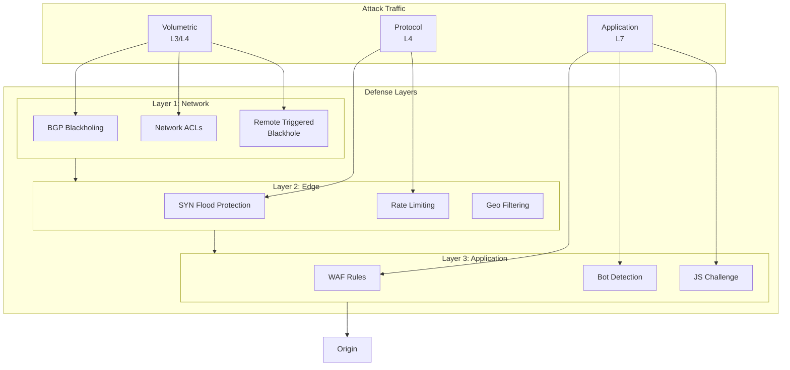
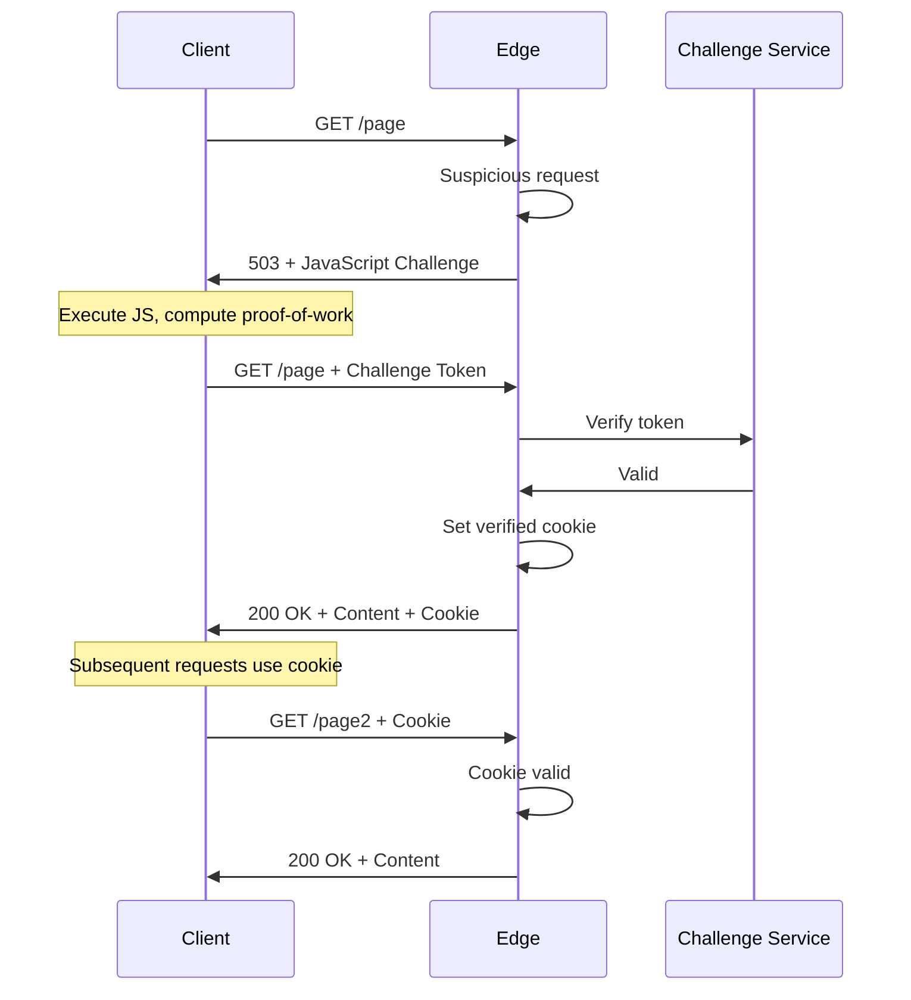
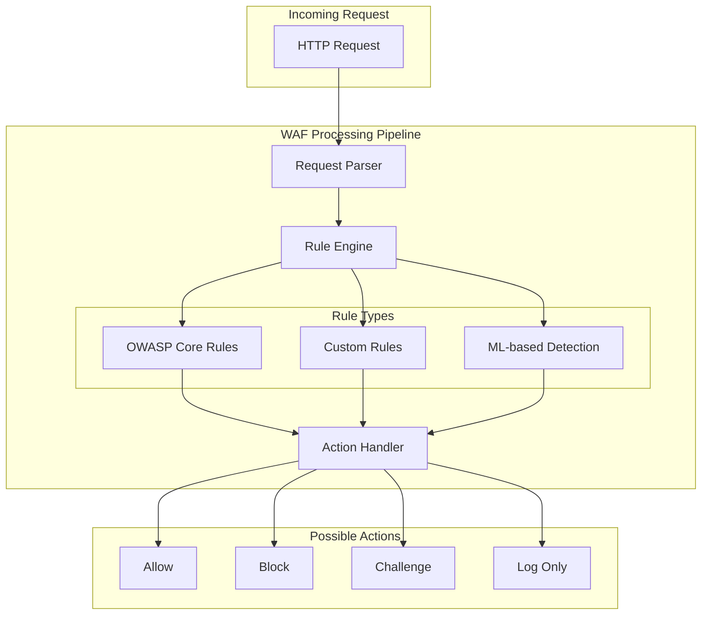
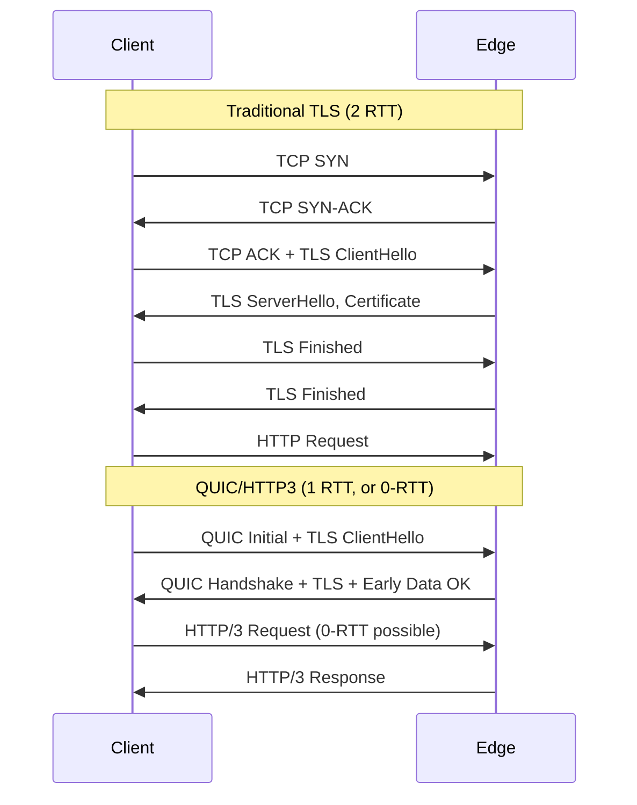
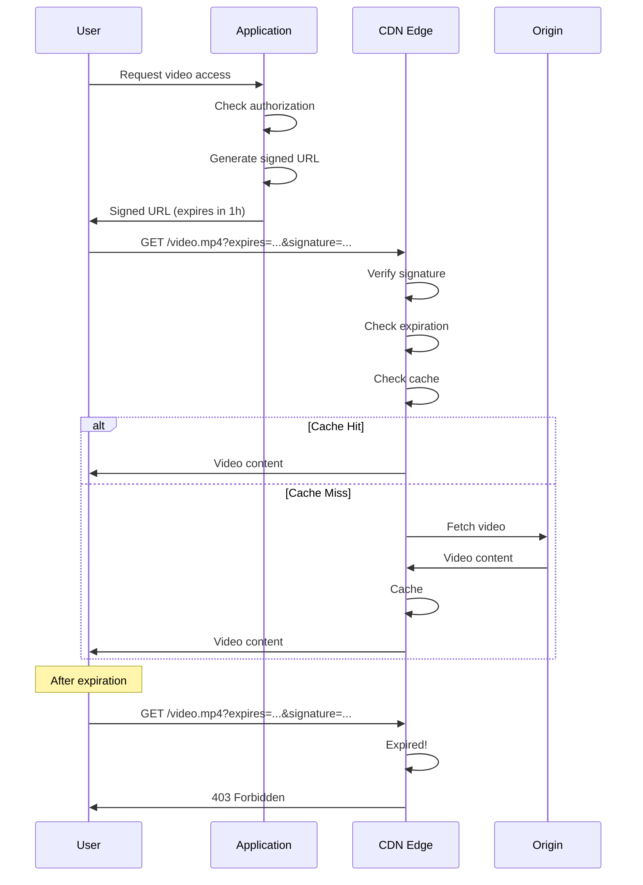
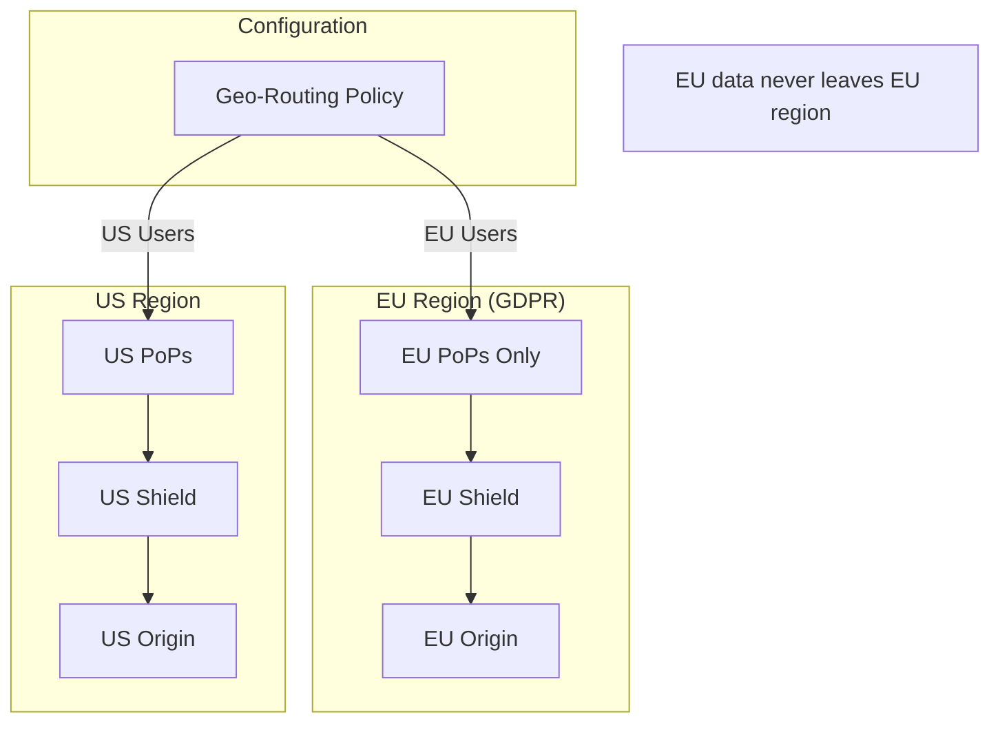

# Security and Compliance

[← Back to Index](./00-index.md)

---

## Table of Contents
- [DDoS Protection](#ddos-protection)
- [Web Application Firewall (WAF)](#web-application-firewall-waf)
- [TLS and Certificate Management](#tls-and-certificate-management)
- [Access Control](#access-control)
- [Origin Protection](#origin-protection)
- [Compliance](#compliance)

---

## DDoS Protection

### Multi-Layer Defense



### Layer 3/4 DDoS Mitigation

```
┌────────────────────────────────────────────────────────────────────┐
│ VOLUMETRIC ATTACK MITIGATION                                        │
├────────────────────────────────────────────────────────────────────┤
│                                                                     │
│ Attack Types:                                                       │
│   • UDP Flood: High volume UDP packets                             │
│   • SYN Flood: TCP connection exhaustion                           │
│   • ICMP Flood: Ping flood                                         │
│   • Amplification: DNS/NTP reflection                              │
│                                                                     │
│ Mitigation Techniques:                                              │
│                                                                     │
│   1. Anycast Distribution                                          │
│      - Attack spread across all PoPs                               │
│      - No single point of overload                                 │
│      - 400+ Tbps aggregate capacity                                │
│                                                                     │
│   2. BGP Flowspec                                                   │
│      - Dynamic filtering rules via BGP                             │
│      - Block specific attack patterns at network edge              │
│      - Propagates across network in seconds                        │
│                                                                     │
│   3. Scrubbing Centers                                              │
│      - Dedicated DDoS mitigation infrastructure                    │
│      - Traffic diverted during attacks                             │
│      - Clean traffic forwarded                                     │
│                                                                     │
│   4. Rate Limiting per IP                                          │
│      - Connection rate limits                                      │
│      - Packet rate limits                                          │
│      - Bandwidth limits                                            │
│                                                                     │
│ Capacity:                                                           │
│   Cloudflare: 300+ Tbps                                            │
│   Akamai: 340+ Tbps                                                │
│   AWS Shield: Elastic scaling                                      │
│                                                                     │
└────────────────────────────────────────────────────────────────────┘
```

### Layer 7 DDoS Mitigation

```python
class L7DDoSMitigation:
    """
    Application layer DDoS protection.
    """

    def __init__(self, config: DDoSConfig):
        self.rate_limiter = RateLimiter(config.rate_limits)
        self.bot_detector = BotDetector(config.bot_rules)
        self.challenge_manager = ChallengeManager()

    async def evaluate_request(
        self,
        request: Request
    ) -> MitigationAction:
        """
        Evaluate request and determine action.
        """
        client_ip = request.client_ip
        fingerprint = self._calculate_fingerprint(request)

        # 1. Check rate limits
        if await self.rate_limiter.is_exceeded(client_ip):
            return MitigationAction.BLOCK

        # 2. Check known bad actors
        if await self._is_known_attacker(client_ip, fingerprint):
            return MitigationAction.BLOCK

        # 3. Bot detection
        bot_score = await self.bot_detector.score(request)
        if bot_score > 0.9:
            return MitigationAction.CHALLENGE

        # 4. Behavioral analysis
        if await self._is_suspicious_pattern(request):
            return MitigationAction.CHALLENGE

        return MitigationAction.ALLOW

    def _calculate_fingerprint(self, request: Request) -> str:
        """
        Calculate client fingerprint for tracking.
        """
        components = [
            request.headers.get('User-Agent', ''),
            request.headers.get('Accept-Language', ''),
            request.headers.get('Accept-Encoding', ''),
            str(request.tls_version),
            str(sorted(request.tls_ciphers))
        ]
        return hashlib.sha256('|'.join(components).encode()).hexdigest()

    async def _is_suspicious_pattern(self, request: Request) -> bool:
        """
        Detect suspicious request patterns.
        """
        patterns = [
            # High request rate from single IP
            await self._check_request_rate(request),
            # Unusual path patterns
            self._has_unusual_paths(request),
            # Missing typical headers
            self._missing_typical_headers(request),
            # Known attack signatures
            await self._matches_attack_signature(request)
        ]
        return sum(patterns) >= 2
```

### JavaScript Challenge Flow



---

## Web Application Firewall (WAF)

### WAF Architecture



### Common WAF Rules

| Category | Example Rule | Action |
|----------|-------------|--------|
| **SQL Injection** | `'.*(\bSELECT\b|\bUNION\b|\bDROP\b).*'` | Block |
| **XSS** | `'.*(<script>|javascript:).*'` | Block |
| **Path Traversal** | `'.*(\.\.\/|\.\.\\).*'` | Block |
| **RCE** | Command injection patterns | Block |
| **Scanner Detection** | Known scanner user agents | Challenge |
| **Rate Abuse** | >100 req/min from IP | Rate Limit |

### WAF Rule Configuration

```yaml
# WAF rule configuration
waf_config:
  mode: block  # block | detect | off

  managed_rulesets:
    - id: cloudflare-managed
      enabled: true
      sensitivity: medium

    - id: owasp-core
      enabled: true
      paranoia_level: 2

  custom_rules:
    - name: block-bad-bots
      expression: |
        http.user_agent contains "BadBot" or
        http.user_agent contains "Scraper"
      action: block

    - name: rate-limit-api
      expression: |
        http.request.uri.path matches "/api/.*"
      action: rate_limit
      rate_limit:
        period: 60
        requests: 100
        key: ip

    - name: geo-block
      expression: |
        ip.geoip.country in {"KP" "IR" "SY"}
      action: block

  exceptions:
    - name: allow-internal-scanner
      expression: |
        ip.src in {10.0.0.0/8}
      skip_rules: all
```

---

## TLS and Certificate Management

### TLS Configuration

```
┌────────────────────────────────────────────────────────────────────┐
│ TLS CONFIGURATION                                                   │
├────────────────────────────────────────────────────────────────────┤
│                                                                     │
│ Minimum TLS Version: TLS 1.2                                       │
│ Recommended: TLS 1.3                                                │
│                                                                     │
│ Cipher Suites (Priority Order):                                    │
│   TLS 1.3:                                                          │
│     • TLS_AES_256_GCM_SHA384                                       │
│     • TLS_CHACHA20_POLY1305_SHA256                                 │
│     • TLS_AES_128_GCM_SHA256                                       │
│                                                                     │
│   TLS 1.2:                                                          │
│     • ECDHE-RSA-AES256-GCM-SHA384                                  │
│     • ECDHE-RSA-AES128-GCM-SHA256                                  │
│     • ECDHE-RSA-CHACHA20-POLY1305                                  │
│                                                                     │
│ Certificate Types:                                                  │
│     • RSA 2048-bit (compatibility)                                 │
│     • ECDSA P-256 (performance)                                    │
│     • Dual certificate deployment                                  │
│                                                                     │
│ OCSP Stapling: Enabled                                              │
│ HSTS: max-age=31536000; includeSubDomains; preload                 │
│                                                                     │
└────────────────────────────────────────────────────────────────────┘
```

### Certificate Management

```python
class CertificateManager:
    """
    Manage TLS certificates at edge.
    """

    def __init__(self, acme_provider: ACMEProvider):
        self.acme = acme_provider
        self.certificates: dict[str, Certificate] = {}
        self.private_keys: SecureKeyStore = SecureKeyStore()

    async def provision_certificate(
        self,
        domain: str
    ) -> Certificate:
        """
        Provision certificate via ACME (Let's Encrypt).
        """
        # 1. Create ACME order
        order = await self.acme.create_order([domain])

        # 2. Complete HTTP-01 challenge
        challenge = order.get_http_challenge()
        await self._deploy_challenge(domain, challenge)

        # 3. Request certificate
        certificate = await order.finalize()

        # 4. Store certificate and key
        await self._store_certificate(domain, certificate)

        # 5. Deploy to edge
        await self._deploy_to_edge(domain, certificate)

        return certificate

    async def auto_renew(self):
        """
        Automatically renew expiring certificates.
        """
        for domain, cert in self.certificates.items():
            days_until_expiry = (cert.expires_at - datetime.now()).days

            if days_until_expiry <= 30:
                logger.info(f"Renewing certificate for {domain}")
                await self.provision_certificate(domain)

    async def _deploy_to_edge(
        self,
        domain: str,
        certificate: Certificate
    ):
        """
        Deploy certificate to all edge nodes.
        """
        cert_bundle = {
            'domain': domain,
            'certificate': certificate.pem,
            'chain': certificate.chain_pem,
            'private_key': await self.private_keys.get(domain)
        }

        # Push to all PoPs
        await self.config_service.push(
            key=f"certs/{domain}",
            value=cert_bundle,
            encrypt=True
        )
```

### HTTP/3 and QUIC



---

## Access Control

### Signed URLs

```python
class SignedURLGenerator:
    """
    Generate time-limited signed URLs for content access.
    """

    def __init__(self, secret_key: bytes):
        self.secret_key = secret_key

    def generate(
        self,
        url: str,
        expires_in: int = 3600,  # 1 hour
        allowed_ip: Optional[str] = None
    ) -> str:
        """
        Generate signed URL with expiration.
        """
        parsed = urllib.parse.urlparse(url)
        expires = int(time.time()) + expires_in

        # Build signing string
        signing_parts = [
            parsed.path,
            str(expires)
        ]
        if allowed_ip:
            signing_parts.append(allowed_ip)

        signing_string = '\n'.join(signing_parts)

        # Generate signature
        signature = hmac.new(
            self.secret_key,
            signing_string.encode(),
            hashlib.sha256
        ).hexdigest()

        # Build signed URL
        params = {
            'expires': expires,
            'signature': signature
        }
        if allowed_ip:
            params['ip'] = allowed_ip

        query = urllib.parse.urlencode(params)
        return f"{url}?{query}"

    def verify(self, request: Request) -> bool:
        """
        Verify signed URL is valid.
        """
        expires = int(request.query.get('expires', 0))
        signature = request.query.get('signature', '')
        allowed_ip = request.query.get('ip')

        # Check expiration
        if time.time() > expires:
            return False

        # Check IP if restricted
        if allowed_ip and request.client_ip != allowed_ip:
            return False

        # Verify signature
        signing_parts = [
            request.path,
            str(expires)
        ]
        if allowed_ip:
            signing_parts.append(allowed_ip)

        signing_string = '\n'.join(signing_parts)
        expected = hmac.new(
            self.secret_key,
            signing_string.encode(),
            hashlib.sha256
        ).hexdigest()

        return hmac.compare_digest(signature, expected)
```

### Signed URL Flow



### Geo-Restrictions

```python
class GeoRestriction:
    """
    Enforce geographic access restrictions.
    """

    def __init__(self, geoip_db: GeoIPDatabase):
        self.geoip = geoip_db

    def check_access(
        self,
        client_ip: str,
        policy: GeoPolicy
    ) -> AccessDecision:
        """
        Check if client IP is allowed based on geo policy.
        """
        location = self.geoip.lookup(client_ip)

        if policy.mode == 'allowlist':
            # Only allow listed countries
            if location.country_code in policy.countries:
                return AccessDecision.ALLOW
            return AccessDecision.DENY

        elif policy.mode == 'blocklist':
            # Block listed countries
            if location.country_code in policy.countries:
                return AccessDecision.DENY
            return AccessDecision.ALLOW

        return AccessDecision.ALLOW

# Configuration example:
# geo_policy:
#   mode: allowlist
#   countries: [US, CA, GB, DE, FR, AU]
#   content_paths:
#     - /premium/*
#     - /licensed/*
```

---

## Origin Protection

### Origin IP Masking

```
┌────────────────────────────────────────────────────────────────────┐
│ ORIGIN PROTECTION STRATEGIES                                       │
├────────────────────────────────────────────────────────────────────┤
│                                                                     │
│ 1. Hide Origin IP                                                   │
│    • Never expose origin IP in DNS                                 │
│    • Use CDN-only access                                           │
│    • Monitor for IP leaks                                          │
│                                                                     │
│ 2. Origin Firewall                                                  │
│    • Only allow CDN IP ranges                                      │
│    • Block all other traffic                                       │
│    • Update allowlist dynamically                                  │
│                                                                     │
│ 3. Authenticated Pull                                              │
│    • CDN adds secret header                                        │
│    • Origin validates header                                       │
│    • Reject requests without header                                │
│                                                                     │
│ 4. mTLS to Origin                                                   │
│    • CDN presents client certificate                               │
│    • Origin validates certificate                                  │
│    • Mutual authentication                                         │
│                                                                     │
└────────────────────────────────────────────────────────────────────┘
```

### Authenticated Origin Pull

```python
class AuthenticatedOriginPull:
    """
    Authenticate CDN requests to origin.
    """

    def __init__(self, secret: str):
        self.secret = secret

    def add_auth_header(self, request: Request) -> Request:
        """
        Add authentication header for origin.
        """
        timestamp = int(time.time())
        nonce = secrets.token_hex(16)

        # Create signature
        signing_string = f"{request.method}|{request.path}|{timestamp}|{nonce}"
        signature = hmac.new(
            self.secret.encode(),
            signing_string.encode(),
            hashlib.sha256
        ).hexdigest()

        request.headers['X-CDN-Auth-Timestamp'] = str(timestamp)
        request.headers['X-CDN-Auth-Nonce'] = nonce
        request.headers['X-CDN-Auth-Signature'] = signature

        return request

# At origin (validation):
def validate_cdn_request(request):
    timestamp = int(request.headers.get('X-CDN-Auth-Timestamp', 0))
    nonce = request.headers.get('X-CDN-Auth-Nonce', '')
    signature = request.headers.get('X-CDN-Auth-Signature', '')

    # Check timestamp freshness (5 minute window)
    if abs(time.time() - timestamp) > 300:
        return False

    # Verify signature
    signing_string = f"{request.method}|{request.path}|{timestamp}|{nonce}"
    expected = hmac.new(
        SECRET.encode(),
        signing_string.encode(),
        hashlib.sha256
    ).hexdigest()

    return hmac.compare_digest(signature, expected)
```

---

## Compliance

### Data Residency



### Compliance Matrix

| Requirement | Implementation |
|-------------|----------------|
| **GDPR** | EU-only PoPs, data residency, right to erasure via purge |
| **PCI-DSS** | TLS 1.2+, no card data caching, audit logs |
| **HIPAA** | BAA with CDN, encryption, access controls |
| **SOC 2** | Access logging, change management, incident response |
| **CCPA** | Privacy headers, data deletion on request |

### Audit Logging

```python
class SecurityAuditLogger:
    """
    Comprehensive security audit logging.
    """

    async def log_access(
        self,
        request: Request,
        response: Response,
        decision: SecurityDecision
    ):
        """
        Log access event for audit.
        """
        audit_event = {
            'timestamp': datetime.utcnow().isoformat(),
            'event_type': 'access',

            # Request details
            'client_ip': request.client_ip,
            'method': request.method,
            'path': request.path,
            'user_agent': request.headers.get('User-Agent'),

            # Security decision
            'waf_action': decision.waf_action,
            'rate_limit_action': decision.rate_limit_action,
            'geo_action': decision.geo_action,
            'bot_score': decision.bot_score,

            # Response
            'status_code': response.status,
            'cache_status': response.headers.get('X-Cache'),

            # Location
            'pop_id': self.pop_id,
            'region': self.region
        }

        await self.audit_store.write(audit_event)

    async def log_config_change(
        self,
        user: str,
        change_type: str,
        details: dict
    ):
        """
        Log configuration changes.
        """
        audit_event = {
            'timestamp': datetime.utcnow().isoformat(),
            'event_type': 'config_change',
            'user': user,
            'change_type': change_type,
            'details': details
        }

        await self.audit_store.write(audit_event)
```

---

## Summary

| Security Layer | Protection |
|----------------|------------|
| **Network (L3/L4)** | Anycast distribution, BGP flowspec, rate limiting |
| **Transport (L4)** | SYN flood protection, TLS 1.3 |
| **Application (L7)** | WAF, bot detection, JS challenges |
| **Access Control** | Signed URLs, geo-restrictions, tokens |
| **Origin** | IP masking, authenticated pull, mTLS |
| **Compliance** | Data residency, audit logging, encryption |
