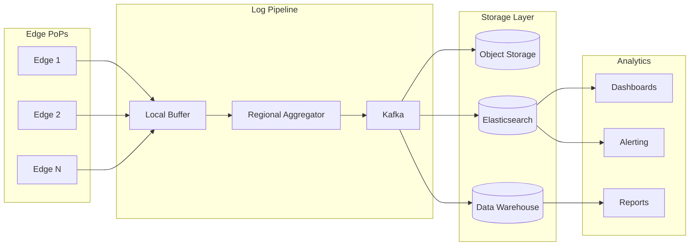
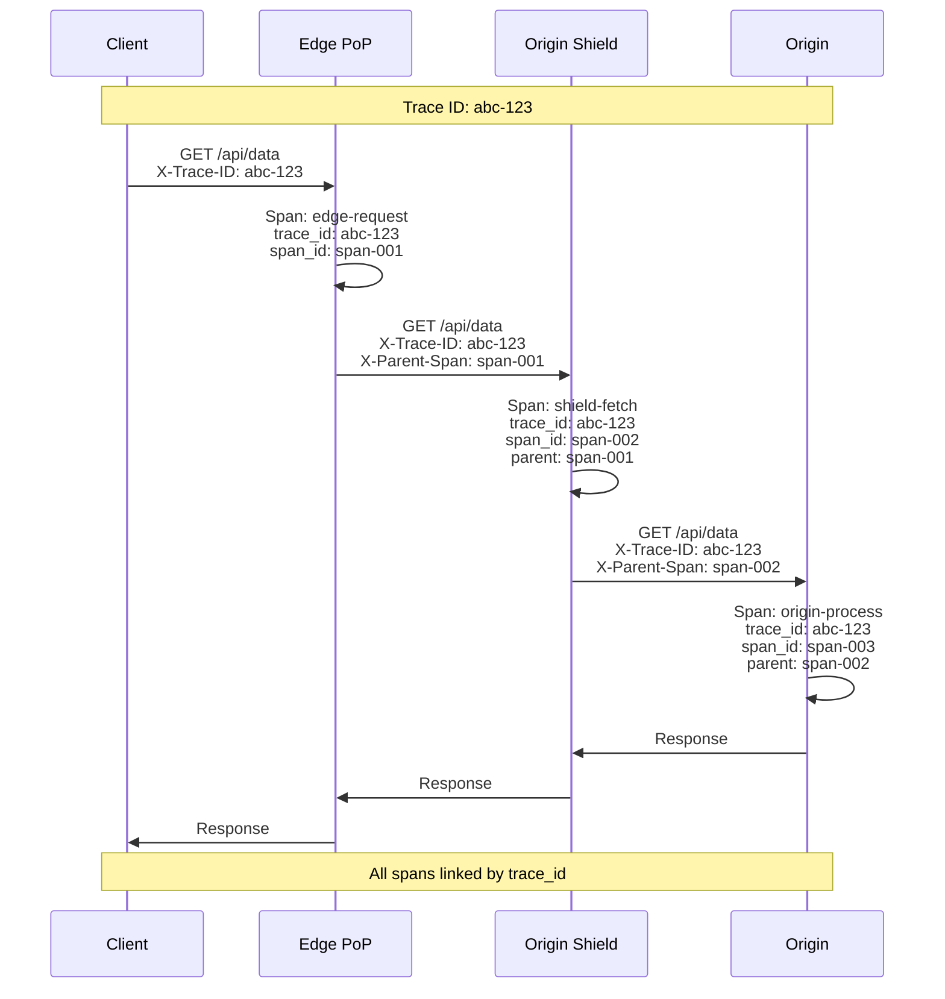

# Observability

[← Back to Index](./00-index.md)

---

## Table of Contents
- [Key Metrics](#key-metrics)
- [Dashboard Design](#dashboard-design)
- [Logging](#logging)
- [Distributed Tracing](#distributed-tracing)
- [Alerting](#alerting)
- [Analytics](#analytics)

---

## Key Metrics

### Performance Metrics

| Metric | Description | Target | Alert Threshold |
|--------|-------------|--------|-----------------|
| **Cache Hit Ratio** | % requests served from cache | > 95% (static) | < 90% |
| **Origin Offload** | % traffic not hitting origin | > 90% | < 85% |
| **TTFB (p50)** | Time to first byte, median | < 20ms | > 50ms |
| **TTFB (p99)** | Time to first byte, 99th percentile | < 100ms | > 200ms |
| **Request Latency (p99)** | Full request latency | < 200ms | > 500ms |
| **Bandwidth Utilization** | Network link usage | < 80% | > 90% |

### Reliability Metrics

| Metric | Description | Target | Alert Threshold |
|--------|-------------|--------|-----------------|
| **Availability** | Uptime percentage | 99.99% | < 99.9% |
| **Error Rate (4xx)** | Client error percentage | < 1% | > 2% |
| **Error Rate (5xx)** | Server error percentage | < 0.1% | > 0.5% |
| **Origin Error Rate** | Origin fetch failures | < 0.1% | > 1% |
| **Purge Success Rate** | Successful purge operations | > 99.9% | < 99% |
| **Purge Latency (p99)** | Global purge propagation | < 200ms | > 500ms |

### Capacity Metrics

| Metric | Description | Target | Alert Threshold |
|--------|-------------|--------|-----------------|
| **Requests per Second** | Aggregate RPS | Scale-dependent | > 80% capacity |
| **Bandwidth (Tbps)** | Aggregate throughput | Scale-dependent | > 70% capacity |
| **Cache Storage** | SSD utilization | < 85% | > 90% |
| **Connection Count** | Active connections | Scale-dependent | > 80% max |
| **CPU Utilization** | Per-server CPU | < 70% | > 85% |

### Metric Collection

```python
class CDNMetricsCollector:
    """
    Collect and aggregate CDN metrics.
    """

    def __init__(self, metrics_backend: MetricsBackend):
        self.metrics = metrics_backend

    async def record_request(
        self,
        request: Request,
        response: Response,
        timing: RequestTiming
    ):
        """
        Record metrics for a single request.
        """
        labels = {
            'pop': self.pop_id,
            'region': self.region,
            'domain': request.host,
            'status_class': f'{response.status // 100}xx',
            'cache_status': response.headers.get('X-Cache', 'MISS'),
            'content_type': self._get_content_type(response),
            'protocol': request.protocol  # h2, h3, http/1.1
        }

        # Latency metrics
        self.metrics.histogram(
            'cdn_request_duration_seconds',
            timing.total_duration,
            labels
        )

        self.metrics.histogram(
            'cdn_ttfb_seconds',
            timing.time_to_first_byte,
            labels
        )

        # Counter metrics
        self.metrics.counter(
            'cdn_requests_total',
            1,
            labels
        )

        self.metrics.counter(
            'cdn_bytes_transferred',
            response.content_length,
            labels
        )

        # Cache-specific metrics
        if 'HIT' in response.headers.get('X-Cache', ''):
            self.metrics.counter('cdn_cache_hits_total', 1, labels)
        else:
            self.metrics.counter('cdn_cache_misses_total', 1, labels)

    async def record_origin_fetch(
        self,
        origin: str,
        success: bool,
        latency: float
    ):
        """
        Record origin fetch metrics.
        """
        labels = {
            'origin': origin,
            'success': str(success)
        }

        self.metrics.histogram(
            'cdn_origin_latency_seconds',
            latency,
            labels
        )

        if not success:
            self.metrics.counter(
                'cdn_origin_errors_total',
                1,
                labels
            )
```

---

## Dashboard Design

### Global Overview Dashboard

```
┌────────────────────────────────────────────────────────────────────┐
│                     CDN GLOBAL OVERVIEW                             │
├────────────────────────────────────────────────────────────────────┤
│                                                                     │
│ ┌─────────────────┐ ┌─────────────────┐ ┌─────────────────┐       │
│ │   REQUESTS/SEC  │ │    BANDWIDTH    │ │   CACHE HIT %   │       │
│ │    234,567      │ │    1.23 Tbps    │ │     96.4%       │       │
│ │   ▲ +12% vs avg │ │   ▲ +8% vs avg  │ │   ▲ +0.2%       │       │
│ └─────────────────┘ └─────────────────┘ └─────────────────┘       │
│                                                                     │
│ ┌─────────────────┐ ┌─────────────────┐ ┌─────────────────┐       │
│ │   ERROR RATE    │ │    TTFB P99     │ │  ORIGIN OFFLOAD │       │
│ │     0.02%       │ │     45ms        │ │     99.2%       │       │
│ │   ✓ Normal      │ │   ✓ Normal      │ │   ✓ Healthy     │       │
│ └─────────────────┘ └─────────────────┘ └─────────────────┘       │
│                                                                     │
│ TRAFFIC BY REGION (Last Hour)                                       │
│ ┌─────────────────────────────────────────────────────────────┐   │
│ │ Americas  ████████████████████████████████████  45%        │   │
│ │ Europe    ███████████████████████              28%        │   │
│ │ Asia      █████████████████                    20%        │   │
│ │ Other     █████                                 7%        │   │
│ └─────────────────────────────────────────────────────────────┘   │
│                                                                     │
│ CACHE HIT RATIO BY CONTENT TYPE                                     │
│ ┌─────────────────────────────────────────────────────────────┐   │
│ │ Static Assets  ████████████████████████████████  98.5%     │   │
│ │ Video Segments ███████████████████████████████   97.2%     │   │
│ │ API Responses  ████████████████████              85.3%     │   │
│ │ HTML Pages     ████████████                      72.1%     │   │
│ └─────────────────────────────────────────────────────────────┘   │
│                                                                     │
│ LATENCY DISTRIBUTION (p50 / p95 / p99)                             │
│ ┌─────────────────────────────────────────────────────────────┐   │
│ │                                                               │   │
│ │ 200ms ┤                                              ·        │   │
│ │ 150ms ┤                                         ···          │   │
│ │ 100ms ┤                               ·····                   │   │
│ │  50ms ┤                    ···········                        │   │
│ │  20ms ┤·····················                                   │   │
│ │       └──────────────────────────────────────────────────    │   │
│ │         00:00   04:00   08:00   12:00   16:00   20:00        │   │
│ │                                                               │   │
│ │         ─── p50    ─·─ p95    ─·· p99                        │   │
│ └─────────────────────────────────────────────────────────────┘   │
│                                                                     │
└────────────────────────────────────────────────────────────────────┘
```

### PoP-Level Dashboard

```
┌────────────────────────────────────────────────────────────────────┐
│                    PoP STATUS: TOKYO                                │
├────────────────────────────────────────────────────────────────────┤
│                                                                     │
│ STATUS: ● HEALTHY                           Last Updated: 2s ago   │
│                                                                     │
│ ┌─────────────────────────────────────────────────────────────┐   │
│ │ SERVERS                                                       │   │
│ │ ┌────┐ ┌────┐ ┌────┐ ┌────┐ ┌────┐ ┌────┐ ┌────┐ ┌────┐   │   │
│ │ │ ●  │ │ ●  │ │ ●  │ │ ●  │ │ ●  │ │ ●  │ │ ○  │ │ ●  │   │   │
│ │ │ 65%│ │ 72%│ │ 68%│ │ 71%│ │ 55%│ │ 63%│ │MAIN│ │ 69%│   │   │
│ │ └────┘ └────┘ └────┘ └────┘ └────┘ └────┘ └────┘ └────┘   │   │
│ │ ● Healthy  ○ Maintenance  ◐ Degraded  ● Down              │   │
│ └─────────────────────────────────────────────────────────────┘   │
│                                                                     │
│ ┌──────────────────┐ ┌──────────────────┐ ┌──────────────────┐   │
│ │ CPU: 67%         │ │ Memory: 45%      │ │ Network: 72%     │   │
│ │ ████████████░░░░ │ │ ████████░░░░░░░░ │ │ ██████████████░░ │   │
│ └──────────────────┘ └──────────────────┘ └──────────────────┘   │
│                                                                     │
│ ┌──────────────────┐ ┌──────────────────┐ ┌──────────────────┐   │
│ │ Cache Storage    │ │ Connections      │ │ Shield Latency   │   │
│ │ 78% (78/100 TB)  │ │ 1.2M active      │ │ 12ms avg         │   │
│ └──────────────────┘ └──────────────────┘ └──────────────────┘   │
│                                                                     │
│ TOP DOMAINS BY TRAFFIC                                              │
│ ┌─────────────────────────────────────────────────────────────┐   │
│ │ Rank │ Domain              │ Requests │ Bandwidth │ Hit %  │   │
│ │──────┼─────────────────────┼──────────┼───────────┼────────│   │
│ │ 1    │ cdn.example.com     │ 45K/s    │ 150 Gbps  │ 97.2%  │   │
│ │ 2    │ static.acme.com     │ 32K/s    │ 85 Gbps   │ 99.1%  │   │
│ │ 3    │ api.widgets.io      │ 28K/s    │ 12 Gbps   │ 78.5%  │   │
│ └─────────────────────────────────────────────────────────────┘   │
│                                                                     │
└────────────────────────────────────────────────────────────────────┘
```

---

## Logging

### Access Log Format

```json
{
  "timestamp": "2024-01-15T10:30:45.123Z",
  "request_id": "abc123def456",

  "client": {
    "ip": "203.0.113.50",
    "country": "JP",
    "asn": 12345,
    "user_agent": "Mozilla/5.0..."
  },

  "request": {
    "method": "GET",
    "host": "cdn.example.com",
    "path": "/images/logo.png",
    "protocol": "h2",
    "bytes_received": 0
  },

  "response": {
    "status": 200,
    "bytes_sent": 45678,
    "content_type": "image/png"
  },

  "cache": {
    "status": "HIT",
    "age": 3600,
    "key": "a7f3b2c1..."
  },

  "timing": {
    "total_ms": 12,
    "ttfb_ms": 5,
    "origin_ms": null
  },

  "edge": {
    "pop": "NRT",
    "server": "edge-nrt-001",
    "region": "asia-northeast1"
  },

  "security": {
    "waf_action": "allow",
    "bot_score": 0.02,
    "tls_version": "TLSv1.3"
  }
}
```

### Log Pipeline



### Real-Time Log Streaming

```python
class LogStreamer:
    """
    Stream logs to customer endpoints in real-time.
    """

    def __init__(self, customer_config: CustomerLogConfig):
        self.config = customer_config
        self.buffer = asyncio.Queue(maxsize=10000)
        self.batch_size = 100
        self.flush_interval = 1.0  # seconds

    async def push_log(self, log_entry: dict):
        """
        Add log entry to buffer for streaming.
        """
        # Filter based on customer config
        if not self._matches_filter(log_entry):
            return

        # Sample if configured
        if self.config.sample_rate < 1.0:
            if random.random() > self.config.sample_rate:
                return

        await self.buffer.put(log_entry)

    async def stream_loop(self):
        """
        Continuously stream logs to customer endpoint.
        """
        batch = []

        while True:
            try:
                # Collect batch
                while len(batch) < self.batch_size:
                    entry = await asyncio.wait_for(
                        self.buffer.get(),
                        timeout=self.flush_interval
                    )
                    batch.append(entry)

            except asyncio.TimeoutError:
                pass  # Flush on timeout

            if batch:
                await self._send_batch(batch)
                batch = []

    async def _send_batch(self, batch: list[dict]):
        """
        Send batch to customer endpoint.
        """
        if self.config.destination == 'webhook':
            await self._send_webhook(batch)
        elif self.config.destination == 's3':
            await self._send_s3(batch)
        elif self.config.destination == 'kafka':
            await self._send_kafka(batch)
```

---

## Distributed Tracing

### Trace Propagation



### Trace Structure

```python
class CDNTracer:
    """
    Distributed tracing for CDN requests.
    """

    def start_span(
        self,
        name: str,
        request: Request
    ) -> Span:
        """
        Start a new span for request processing.
        """
        # Extract or create trace context
        trace_id = request.headers.get(
            'X-Trace-ID',
            self._generate_trace_id()
        )
        parent_span_id = request.headers.get('X-Parent-Span')

        span = Span(
            trace_id=trace_id,
            span_id=self._generate_span_id(),
            parent_span_id=parent_span_id,
            name=name,
            start_time=time.time(),
            attributes={
                'cdn.pop': self.pop_id,
                'cdn.region': self.region,
                'http.method': request.method,
                'http.url': request.url,
                'http.host': request.host
            }
        )

        return span

    def finish_span(
        self,
        span: Span,
        response: Response
    ):
        """
        Complete span with response data.
        """
        span.end_time = time.time()
        span.attributes.update({
            'http.status_code': response.status,
            'cdn.cache_status': response.headers.get('X-Cache'),
            'http.response_size': response.content_length
        })

        # Export to tracing backend
        self.exporter.export(span)
```

---

## Alerting

### Alert Hierarchy

```
┌────────────────────────────────────────────────────────────────────┐
│ ALERT SEVERITY LEVELS                                               │
├────────────────────────────────────────────────────────────────────┤
│                                                                     │
│ P1 - CRITICAL (Page immediately)                                   │
│   • Global availability < 99%                                      │
│   • Multiple regions down                                          │
│   • DDoS attack in progress (> 1 Tbps)                            │
│   • Origin completely unreachable                                  │
│   Response: 5 minutes                                              │
│                                                                     │
│ P2 - HIGH (Page on-call)                                           │
│   • Single region degraded                                         │
│   • Cache hit ratio < 80%                                          │
│   • Error rate > 1%                                                │
│   • Purge latency > 500ms                                          │
│   Response: 15 minutes                                             │
│                                                                     │
│ P3 - MEDIUM (Slack alert)                                          │
│   • Single PoP unhealthy                                           │
│   • TTFB p99 > 200ms                                               │
│   • Certificate expiring < 14 days                                 │
│   • Disk usage > 85%                                               │
│   Response: 1 hour                                                 │
│                                                                     │
│ P4 - LOW (Ticket)                                                  │
│   • Performance degradation trends                                  │
│   • Non-critical config issues                                      │
│   • Capacity planning warnings                                     │
│   Response: 24 hours                                               │
│                                                                     │
└────────────────────────────────────────────────────────────────────┘
```

### Alert Definitions

```yaml
alerts:
  - name: GlobalAvailabilityLow
    severity: P1
    condition: |
      avg(cdn_availability_ratio) < 0.99
      FOR 2m
    message: "Global CDN availability dropped below 99%"
    runbook: https://runbooks/cdn/availability

  - name: CacheHitRatioLow
    severity: P2
    condition: |
      avg by (domain) (cdn_cache_hits_total / cdn_requests_total) < 0.80
      FOR 10m
    message: "Cache hit ratio below 80% for {{ $labels.domain }}"
    runbook: https://runbooks/cdn/cache-hit-ratio

  - name: OriginLatencyHigh
    severity: P2
    condition: |
      histogram_quantile(0.99, cdn_origin_latency_seconds) > 2
      FOR 5m
    message: "Origin p99 latency exceeds 2 seconds"
    runbook: https://runbooks/cdn/origin-latency

  - name: PoPUnhealthy
    severity: P3
    condition: |
      cdn_pop_health_status == 0
      FOR 1m
    message: "PoP {{ $labels.pop }} is unhealthy"
    runbook: https://runbooks/cdn/pop-health

  - name: DiskSpaceWarning
    severity: P3
    condition: |
      cdn_disk_usage_ratio > 0.85
      FOR 30m
    message: "Disk usage > 85% on {{ $labels.server }}"
    runbook: https://runbooks/cdn/disk-space

  - name: CertificateExpiring
    severity: P3
    condition: |
      cdn_certificate_expiry_days < 14
    message: "Certificate for {{ $labels.domain }} expires in {{ $value }} days"
    runbook: https://runbooks/cdn/certificate-renewal
```

---

## Analytics

### Customer Analytics Dashboard

```python
class CustomerAnalytics:
    """
    Analytics data for customer consumption.
    """

    async def get_traffic_summary(
        self,
        customer_id: str,
        time_range: TimeRange
    ) -> TrafficSummary:
        """
        Get traffic summary for customer.
        """
        query = f"""
        SELECT
            COUNT(*) as total_requests,
            SUM(bytes_sent) as total_bytes,
            AVG(CASE WHEN cache_status = 'HIT' THEN 1 ELSE 0 END) as cache_hit_ratio,
            PERCENTILE_CONT(0.50) WITHIN GROUP (ORDER BY ttfb_ms) as ttfb_p50,
            PERCENTILE_CONT(0.99) WITHIN GROUP (ORDER BY ttfb_ms) as ttfb_p99,
            SUM(CASE WHEN status >= 500 THEN 1 ELSE 0 END) / COUNT(*) as error_rate
        FROM access_logs
        WHERE customer_id = '{customer_id}'
          AND timestamp BETWEEN '{time_range.start}' AND '{time_range.end}'
        """
        return await self.db.query(query)

    async def get_top_urls(
        self,
        customer_id: str,
        limit: int = 100
    ) -> list[URLStats]:
        """
        Get top URLs by request count.
        """
        query = f"""
        SELECT
            path,
            COUNT(*) as requests,
            SUM(bytes_sent) as bytes,
            AVG(ttfb_ms) as avg_ttfb
        FROM access_logs
        WHERE customer_id = '{customer_id}'
          AND timestamp > NOW() - INTERVAL '24 hours'
        GROUP BY path
        ORDER BY requests DESC
        LIMIT {limit}
        """
        return await self.db.query(query)

    async def get_geographic_breakdown(
        self,
        customer_id: str
    ) -> list[GeoStats]:
        """
        Get traffic breakdown by geography.
        """
        query = f"""
        SELECT
            country,
            COUNT(*) as requests,
            SUM(bytes_sent) as bytes,
            AVG(ttfb_ms) as avg_ttfb
        FROM access_logs
        WHERE customer_id = '{customer_id}'
          AND timestamp > NOW() - INTERVAL '24 hours'
        GROUP BY country
        ORDER BY requests DESC
        """
        return await self.db.query(query)
```

### Analytics API

```yaml
# Customer Analytics API Endpoints

GET /analytics/v1/traffic:
  description: Get traffic summary
  parameters:
    - start: ISO8601 timestamp
    - end: ISO8601 timestamp
    - granularity: minute | hour | day
  response:
    total_requests: 1234567
    total_bandwidth_gb: 456.78
    cache_hit_ratio: 0.954
    avg_ttfb_ms: 23.5
    error_rate: 0.0012

GET /analytics/v1/top-urls:
  description: Top URLs by traffic
  parameters:
    - limit: int (default 100)
    - metric: requests | bandwidth
  response:
    urls:
      - path: "/images/hero.jpg"
        requests: 45678
        bandwidth_gb: 12.34
        cache_hit_ratio: 0.99

GET /analytics/v1/geographic:
  description: Traffic by geography
  response:
    countries:
      - code: "US"
        requests: 234567
        bandwidth_gb: 89.12
      - code: "JP"
        requests: 123456
        bandwidth_gb: 45.67

GET /analytics/v1/cache-performance:
  description: Cache performance breakdown
  response:
    by_content_type:
      - type: "image/jpeg"
        hit_ratio: 0.99
      - type: "application/json"
        hit_ratio: 0.82
```

---

## Summary

| Observability Pillar | Implementation |
|---------------------|----------------|
| **Metrics** | Time-series (cache hit, latency, bandwidth) |
| **Logging** | Structured JSON, real-time streaming |
| **Tracing** | Distributed traces across edge → shield → origin |
| **Alerting** | P1-P4 severity hierarchy |
| **Analytics** | Customer-facing dashboards and APIs |
