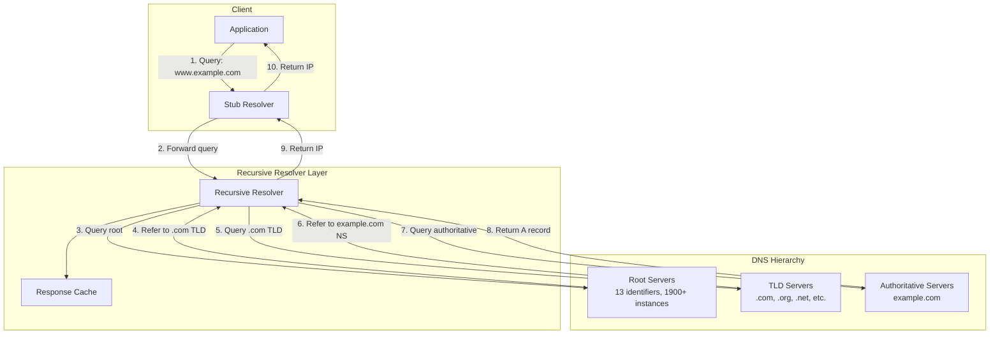
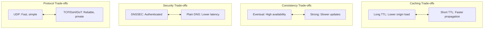

# DNS System Design

## System Design Document

| Attribute | Value |
|-----------|-------|
| **Complexity** | Medium-High |
| **Category** | Core Infrastructure |
| **Prerequisites** | Networking basics, UDP/TCP, Caching concepts, Load Balancer (1.2) |
| **Related Topics** | Load Balancer (1.2), Service Discovery (1.10), CDN (1.15) |

---

## Quick Navigation

| Document | Description |
|----------|-------------|
| [01 - Requirements & Estimations](./01-requirements-and-estimations.md) | Functional/non-functional requirements, capacity planning |
| [02 - High-Level Design](./02-high-level-design.md) | Architecture diagrams, hierarchical resolution, data flow |
| [03 - Low-Level Design](./03-low-level-design.md) | DNS message format, record types, algorithms |
| [04 - Deep Dive & Bottlenecks](./04-deep-dive-and-bottlenecks.md) | Resolver cache, Anycast routing, GSLB engine |
| [05 - Scalability & Reliability](./05-scalability-and-reliability.md) | Horizontal scaling, fault tolerance, disaster recovery |
| [06 - Security & Compliance](./06-security-and-compliance.md) | DNSSEC, DoH/DoT, cache poisoning prevention |
| [07 - Observability](./07-observability.md) | Metrics, logging, alerting |
| [08 - Interview Guide](./08-interview-guide.md) | 45-min pacing, trap questions, quick reference |

---

## System Overview

The **Domain Name System (DNS)** is a hierarchical, distributed naming system that translates human-readable domain names (like `www.example.com`) into IP addresses (like `192.0.2.1`). DNS is one of the most critical infrastructure components of the Internet, serving as the "phone book" that enables users and applications to locate services by name rather than by numeric address.



---

## What Makes DNS Unique

| Aspect | Simple Lookup | DNS |
|--------|---------------|-----|
| **Scale** | Single database | 340+ million domains, trillions of queries/day |
| **Distribution** | Centralized | Globally distributed hierarchy |
| **Caching** | Optional | Fundamental (TTL-based) |
| **Consistency Model** | Strong | Eventually consistent |
| **Failure Impact** | Application-level | Internet-wide outage |
| **Protocol** | Application-specific | Standardized (RFC 1035+) |

---

## DNS Architecture Comparison

| Aspect | Recursive Resolver | Authoritative Server |
|--------|-------------------|---------------------|
| **Role** | Query on behalf of clients | Answer for owned zones |
| **Caching** | Caches all responses (TTL) | No caching (source of truth) |
| **Examples** | Google (8.8.8.8), Cloudflare (1.1.1.1) | Route 53, Cloudflare DNS |
| **Client Interaction** | Serves end users | Serves other DNS servers |
| **Query Pattern** | Iterative to hierarchy | Direct answers |
| **Scaling Challenge** | QPS, cache efficiency | Zone size, update propagation |

---

## Key Characteristics

| Characteristic | Challenge | Why It Matters |
|----------------|-----------|----------------|
| **Read-Heavy** | 99.99:1 read-to-write ratio | Cache optimization critical |
| **Latency-Sensitive** | < 10ms expected for cached | User experience, page load |
| **High Availability** | 99.999% required | Single point of failure for Internet |
| **Globally Distributed** | Trillions of queries worldwide | Anycast, geographic routing |
| **Eventual Consistency** | TTL-based propagation | Stale records during updates |
| **Security Critical** | Target for attacks | DNS poisoning, DDoS |

---

## Real-World Implementations

| Provider | Implementation | Key Innovation |
|----------|---------------|----------------|
| **Cloudflare (1.1.1.1)** | Anycast global network | Privacy-focused, WARP integration |
| **Google Public DNS (8.8.8.8)** | Global Anycast | DNSSEC validation, ECS support |
| **AWS Route 53** | Anycast authoritative + GSLB | Latency/weighted/geolocation routing |
| **Quad9 (9.9.9.9)** | Threat intelligence integrated | Malware domain blocking |
| **Root Server System** | 13 identifiers, 1900+ instances | Anycast for resilience |
| **Akamai Edge DNS** | 4000+ PoPs | Enterprise GSLB |

---

## Key Trade-offs



### Trade-off Analysis

| Trade-off | Option A | Option B | Decision Factors |
|-----------|----------|----------|------------------|
| **TTL Duration** | Long (24h+) - fewer origin queries | Short (5m) - faster updates | Change frequency, traffic volume |
| **Resolution Strategy** | Recursive - client simplicity | Iterative - server control | Client capability, load distribution |
| **DNSSEC** | Enabled - authentication | Disabled - lower latency | Security requirements |
| **Transport** | UDP - performance | DoH/DoT - privacy | Privacy needs, firewall traversal |
| **Anycast vs GeoDNS** | Anycast - automatic failover | GeoDNS - control over routing | Stickiness requirements |

---

## Core Concepts Overview

### DNS Hierarchy

DNS uses a hierarchical namespace organized as an inverted tree:

```
                        . (Root)
                        │
        ┌───────────────┼───────────────┐
        │               │               │
       com             org             net
        │               │               │
    ┌───┴───┐       ┌───┴───┐          │
    │       │       │       │          │
  google  amazon  wikipedia linux   cloudflare
    │       │
    │    ┌──┴──┐
   www   aws   s3
```

### Resolution Process

| Step | Query | Response |
|------|-------|----------|
| 1 | Client → Resolver: `www.example.com?` | - |
| 2 | Resolver → Root: `www.example.com?` | `.com NS: a.gtld-servers.net` |
| 3 | Resolver → .com TLD: `www.example.com?` | `example.com NS: ns1.example.com` |
| 4 | Resolver → Authoritative: `www.example.com?` | `A: 93.184.216.34` |
| 5 | Resolver → Client | `A: 93.184.216.34` |

### Anycast Routing

All DNS servers in an Anycast group advertise the same IP address. BGP routing directs queries to the topologically closest instance:

- **Fast Failover**: Server failure causes BGP reconvergence (seconds)
- **Load Distribution**: Natural geographic distribution
- **DDoS Absorption**: Attack traffic distributed across all instances

---

## When to Use Custom DNS

| Scenario | Benefit |
|----------|---------|
| **Global Service Discovery** | Route users to nearest datacenter |
| **Traffic Management** | Weighted distribution, A/B testing |
| **High Availability** | Automatic failover on health check failure |
| **Latency Optimization** | GeoDNS routing to closest endpoint |
| **Compliance** | Regional data residency requirements |

---

## When NOT to Build Custom DNS

| Scenario | Alternative |
|----------|-------------|
| **Simple domains** | Managed DNS (Route 53, Cloudflare) |
| **No geographic needs** | Standard DNS hosting |
| **Small scale** | Registrar DNS |
| **Internal only** | Service mesh, internal DNS |

---

## Complexity Rating Breakdown

| Area | Complexity | Reason |
|------|------------|--------|
| **Recursive Resolution** | Medium | Standard algorithm, caching logic |
| **Zone Management** | Medium | AXFR/IXFR, SOA serial handling |
| **Anycast Deployment** | High | BGP configuration, failover |
| **DNSSEC** | High | Key management, chain of trust |
| **GSLB** | High | Health checks, routing policies |
| **DoH/DoT** | Medium | TLS termination, HTTP handling |
| **Cache Management** | Medium | TTL enforcement, negative caching |

---

## Document Reading Order

### For Interview Prep (Time-Limited)
1. This index (overview)
2. [02 - High-Level Design](./02-high-level-design.md) (architecture)
3. [08 - Interview Guide](./08-interview-guide.md) (pacing, questions)

### For Deep Understanding
1. All documents in order (00 → 08)
2. Focus on [04 - Deep Dive](./04-deep-dive-and-bottlenecks.md) for internals
3. Study [03 - Low-Level Design](./03-low-level-design.md) for protocols

### For Production Design
1. [01 - Requirements](./01-requirements-and-estimations.md) (capacity planning)
2. [05 - Scalability](./05-scalability-and-reliability.md) (production concerns)
3. [06 - Security](./06-security-and-compliance.md) (DNSSEC, DoH)
4. [07 - Observability](./07-observability.md) (monitoring)

---

## Related System Designs

| Design | Relationship |
|--------|--------------|
| [1.2 Distributed Load Balancer](../1.2-distributed-load-balancer/00-index.md) | DNS-based load balancing uses similar concepts |
| [1.10 Service Discovery](../1.10-service-discovery-system/00-index.md) | DNS-based service discovery (SRV records) |
| [1.15 CDN](../1.15-content-delivery-network-cdn/00-index.md) | CDN uses DNS for edge routing |

---

## Further Reading

- RFC 1035: Domain Names - Implementation and Specification
- RFC 4033-4035: DNS Security Extensions (DNSSEC)
- RFC 8484: DNS Queries over HTTPS (DoH)
- RFC 7858: DNS over Transport Layer Security (DoT)
- Root Server Technical Operations
- Cloudflare DNS Architecture Blog
