# High-Level Design

[← Back to Index](./00-index.md)

---

## Table of Contents
- [Architecture Overview](#architecture-overview)
- [Core Components](#core-components)
- [Data Flow](#data-flow)
- [Key Design Decisions](#key-design-decisions)
- [Communication Patterns](#communication-patterns)

---

## Architecture Overview

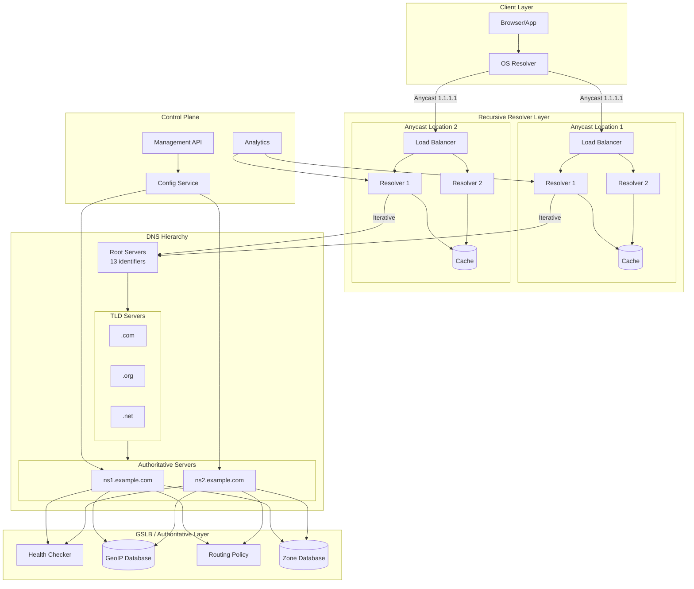

---

## Core Components

### 1. Recursive Resolver Layer

The recursive resolver accepts queries from clients and performs the full resolution process.

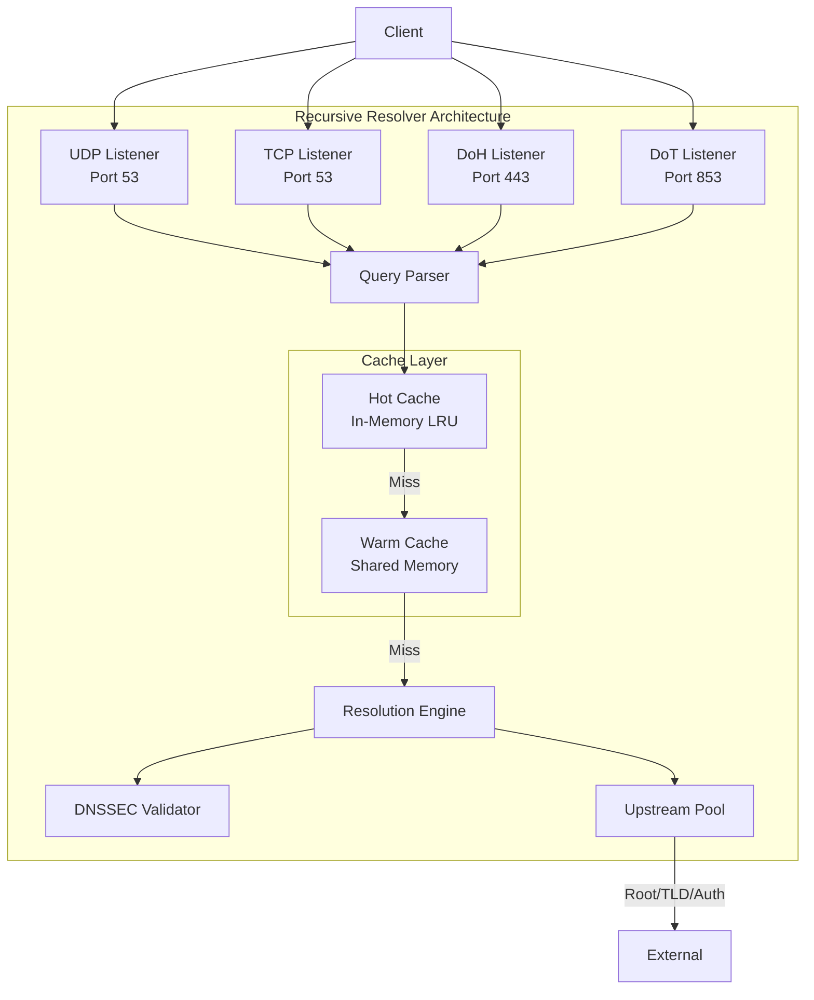

**Responsibilities:**
- Accept client queries (UDP, TCP, DoH, DoT)
- Check local cache first
- Perform iterative resolution on cache miss
- Validate DNSSEC signatures
- Cache responses according to TTL
- Rate limit abusive clients

### 2. Authoritative Name Server

Serves as the source of truth for configured zones.

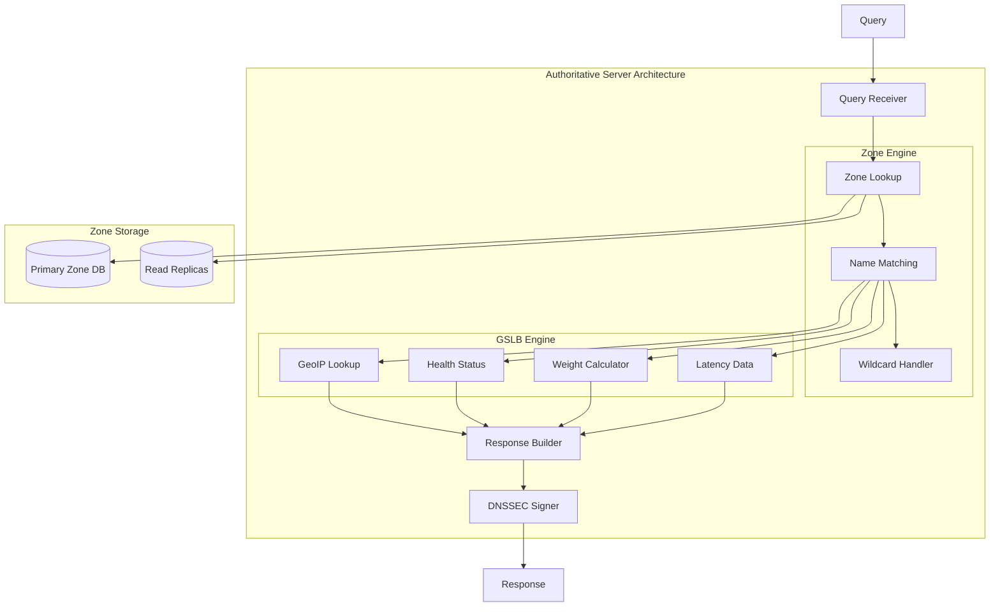

**Responsibilities:**
- Serve authoritative answers for owned zones
- Implement GSLB routing policies
- Sign responses with DNSSEC
- Handle zone transfers (AXFR/IXFR)
- Process dynamic updates

### 3. DNS Hierarchy

The global DNS hierarchy with root, TLD, and authoritative servers.

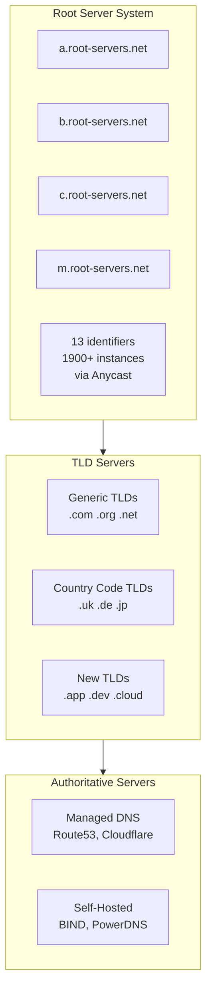

### 4. GSLB (Global Server Load Balancing)

Intelligent traffic routing at the DNS layer.

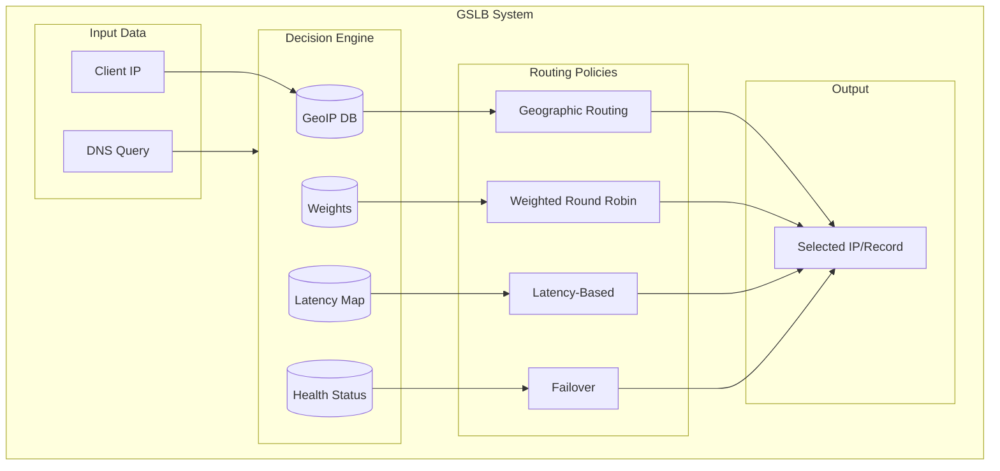

**GSLB Routing Policies:**

| Policy | Description | Use Case |
|--------|-------------|----------|
| **Geographic** | Route based on client location | Regional content, data sovereignty |
| **Weighted** | Distribute by percentage | Gradual rollouts, A/B testing |
| **Latency-Based** | Route to lowest latency | Performance optimization |
| **Failover** | Primary/secondary with health checks | High availability |
| **Geoproximity** | Nearest endpoint with bias | Fine-tuned geographic control |

### 5. Control Plane

Manages configuration, zones, and analytics.

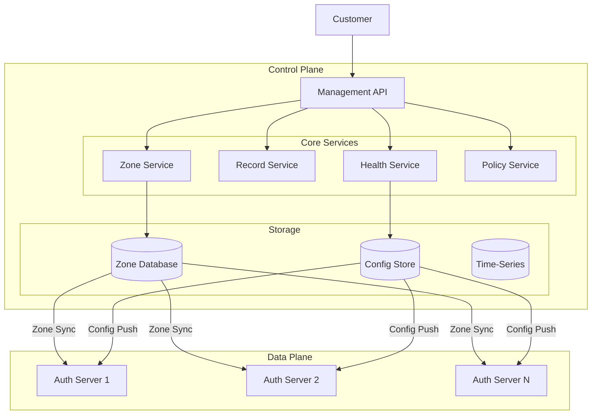

---

## Data Flow

### Recursive Resolution Flow (Cache Miss)

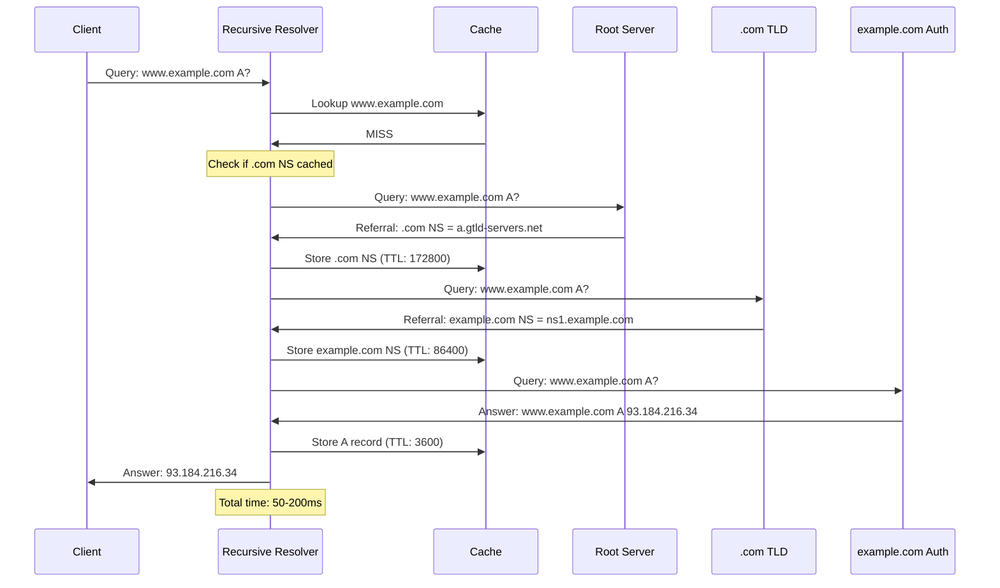

### Recursive Resolution Flow (Cache Hit)

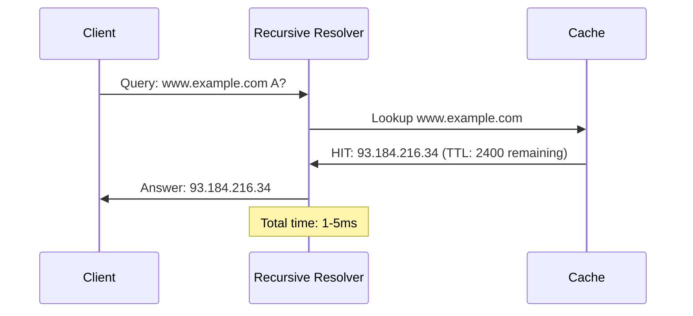

### GSLB Resolution Flow

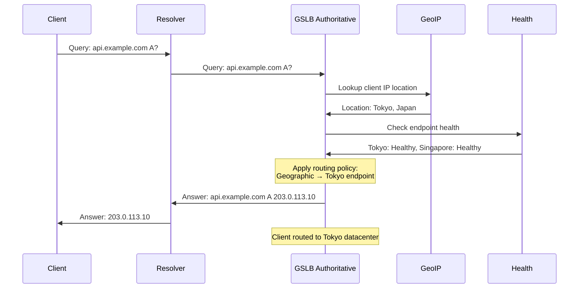

### Zone Transfer Flow (AXFR)

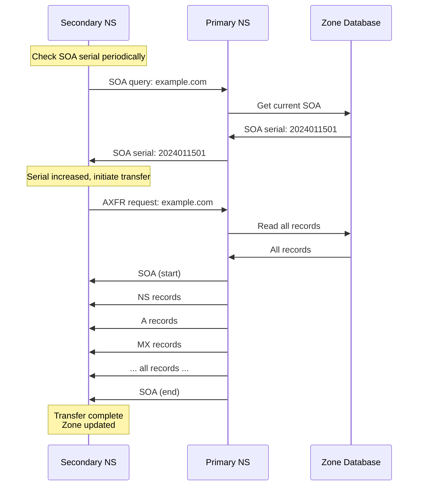

---

## Key Design Decisions

### Decision 1: Anycast vs Unicast Deployment

| Approach | Pros | Cons |
|----------|------|------|
| **Anycast** | Auto-failover, DDoS distribution, low latency | BGP complexity, stateless only |
| **Unicast** | Session stickiness, simpler setup | Manual failover, single point |

**Decision: Anycast for all DNS services**

**Rationale:**
- DNS is inherently stateless (query/response)
- Anycast provides automatic geographic routing
- DDoS traffic naturally distributed
- BGP reconvergence is fast enough (seconds)

### Decision 2: Resolution Strategy

| Approach | Pros | Cons |
|----------|------|------|
| **Recursive** | Client simplicity, central caching | Resolver load |
| **Iterative** | Distributed load | Client complexity |
| **Forwarding** | Simple setup | Dependency on upstream |

**Decision: Recursive resolvers with iterative upstream**

**Rationale:**
- Clients use simple stub resolvers
- Recursive resolvers handle complexity
- Iterative queries to hierarchy for control
- Caching at resolver level

### Decision 3: Cache Architecture

| Approach | Pros | Cons |
|----------|------|------|
| **Per-Resolver** | No coordination, simple | Duplicate storage |
| **Shared Cache** | Higher hit ratio | Coordination overhead |
| **Hierarchical** | Best of both | Complexity |

**Decision: Hierarchical caching (L1 per-resolver, L2 shared)**

**Rationale:**
- L1 (per-resolver): Sub-millisecond hot cache
- L2 (shared): Higher hit ratio for warm cache
- Reduces upstream queries significantly

### Decision 4: GSLB Decision Point

| Approach | Pros | Cons |
|----------|------|------|
| **At Resolver** | Full client info | Resolver modification |
| **At Authoritative** | Standard protocol | Limited client info (EDNS-Client-Subnet) |
| **Hybrid** | Best accuracy | Complexity |

**Decision: Authoritative-level GSLB with EDNS-Client-Subnet**

**Rationale:**
- Works with any resolver
- EDNS-Client-Subnet provides client subnet info
- Standard DNS protocol
- Authoritative server has routing policy

### Decision 5: Zone Storage Architecture

| Approach | Pros | Cons |
|----------|------|------|
| **File-based** | Simple, portable | Slow updates |
| **Database** | Fast queries, transactions | Complexity |
| **In-Memory** | Fastest | Size limits, durability |

**Decision: Database with in-memory cache**

**Rationale:**
- Database for durability and consistency
- In-memory cache for query performance
- Supports dynamic updates
- Easy replication

---

## Communication Patterns

### DNS Query/Response

```
Client                    Resolver
  |                         |
  |---- UDP Query -------->|
  |<--- UDP Response ------|
  |                         |

Standard DNS: UDP port 53
- Max 512 bytes (original)
- EDNS0: Up to 4096 bytes
- Falls back to TCP if truncated
```

### DNS over HTTPS (DoH)

```
Client                    Resolver
  |                         |
  |---- TLS Handshake ---->|
  |<--- TLS Handshake -----|
  |                         |
  |---- HTTP/2 POST ------>|
  |     Content-Type:       |
  |     application/dns-message
  |<--- HTTP/2 Response ---|
  |                         |

DoH: TCP port 443
- Full HTTP/2 semantics
- Encrypted, firewall-friendly
- Higher latency than UDP
```

### DNS over TLS (DoT)

```
Client                    Resolver
  |                         |
  |---- TLS Handshake ---->|
  |<--- TLS Handshake -----|
  |                         |
  |---- DNS Query -------->|
  |<--- DNS Response ------|
  |                         |

DoT: TCP port 853
- Standard DNS over TLS
- Dedicated port (can be blocked)
- Lower overhead than DoH
```

### Zone Transfer (AXFR/IXFR)

```
Secondary                 Primary
  |                         |
  |---- TCP Connect ------>|
  |<--- TCP Accept --------|
  |                         |
  |---- AXFR Query ------->|
  |<--- SOA (start) -------|
  |<--- Record 1 ----------|
  |<--- Record 2 ----------|
  |<--- ... ---------------|
  |<--- SOA (end) ---------|
  |                         |

Zone Transfer: TCP port 53
- Always TCP (large payload)
- AXFR: Full transfer
- IXFR: Incremental (changes only)
```

---

## Component Interaction Summary

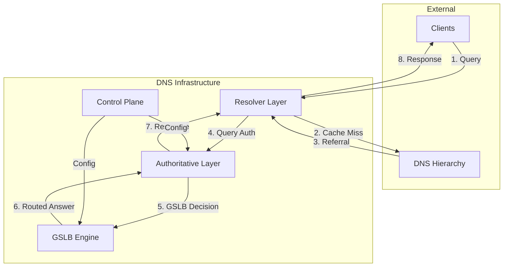

---

## System Boundaries

### What DNS Handles

| Responsibility | Details |
|----------------|---------|
| Name resolution | Domain to IP translation |
| Service discovery | SRV records for service locations |
| Mail routing | MX records for email |
| Traffic management | GSLB, failover, load balancing |
| Security | DNSSEC authentication |
| Privacy | DoH/DoT encryption |

### What DNS Does NOT Handle

| Responsibility | Where It Belongs |
|----------------|------------------|
| Application routing | Load balancers, reverse proxies |
| Session management | Application layer |
| Real-time health | Dedicated health check systems |
| Fine-grained auth | Application/API gateway |
| Data storage | Databases |
| Connection management | TCP/application layer |
