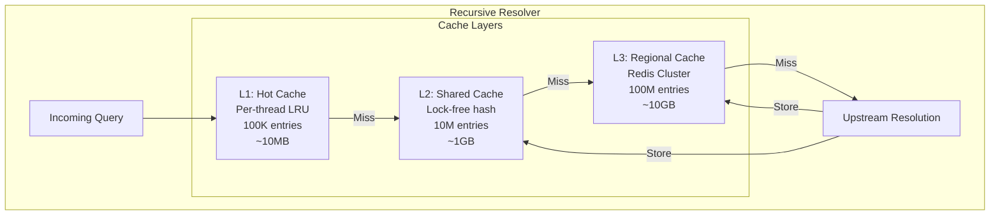
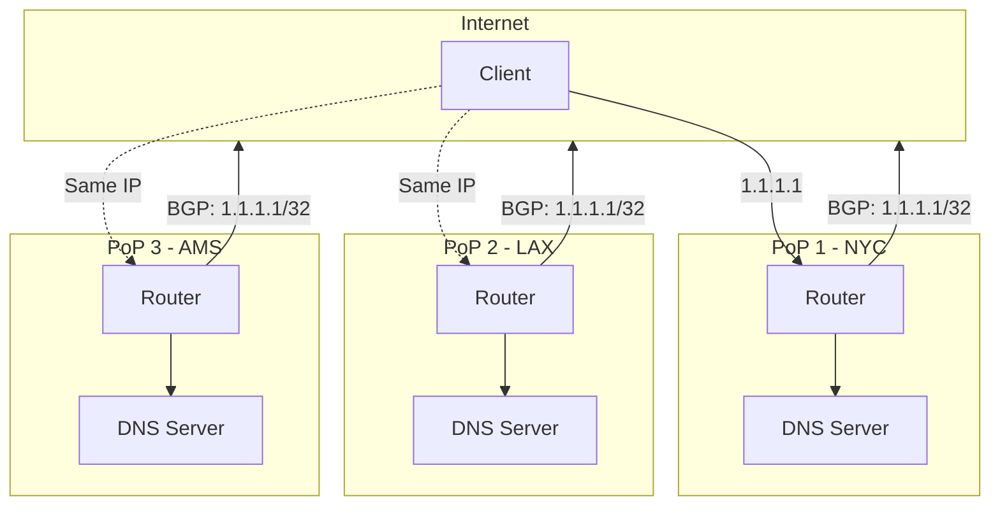
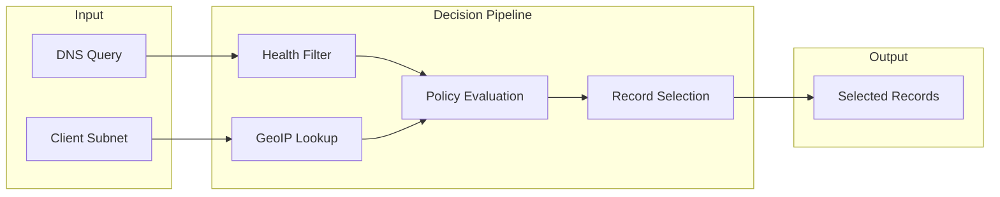

# Deep Dive and Bottlenecks

[← Back to Index](./00-index.md)

---

## Table of Contents
- [Critical Components](#critical-components)
- [Bottleneck Analysis](#bottleneck-analysis)
- [Race Conditions](#race-conditions)
- [Edge Cases](#edge-cases)

---

## Critical Components

### 1. Recursive Resolver Cache

The cache is the most critical component for resolver performance, as 95%+ of queries should be served from cache.

#### Cache Architecture



#### Cache Key Design

```python
def compute_cache_key(qname: str, qtype: int, qclass: int) -> str:
    """
    Compute cache key for DNS query.

    Design considerations:
    - Case-insensitive (DNS names are case-insensitive)
    - Include type and class
    - Efficient hashing
    """
    normalized_name = qname.lower().rstrip('.')
    return f"{normalized_name}:{qtype}:{qclass}"

# Examples:
# "www.example.com:1:1"   -> A record
# "www.example.com:28:1"  -> AAAA record
# "example.com:15:1"      -> MX record
```

#### Negative Caching

Negative responses (NXDOMAIN, NODATA) must also be cached to prevent repeated failed lookups:

```python
class NegativeCache:
    """
    Cache for negative responses.

    Critical for protecting against:
    - NXDOMAIN floods (attacker queries random subdomains)
    - Typo domains causing repeated lookups
    """

    def store_nxdomain(self, qname: str, soa: SOARecord):
        """
        Cache NXDOMAIN response.
        TTL is SOA minimum field.
        """
        ttl = soa.minimum
        ttl = min(ttl, MAX_NEGATIVE_TTL)  # Cap at 1 hour
        ttl = max(ttl, MIN_NEGATIVE_TTL)  # Floor at 30 seconds

        entry = NegativeCacheEntry(
            qname=qname,
            response_type='NXDOMAIN',
            ttl=ttl,
            soa=soa
        )
        self.cache.store(entry)

    def store_nodata(self, qname: str, qtype: int, soa: SOARecord):
        """
        Cache NODATA response (name exists, but not this type).
        """
        entry = NegativeCacheEntry(
            qname=qname,
            qtype=qtype,
            response_type='NODATA',
            ttl=soa.minimum,
            soa=soa
        )
        self.cache.store(entry)
```

#### Cache Prefetching

Proactively refresh popular entries before expiration:

```python
class CachePrefetcher:
    """
    Prefetch cache entries before TTL expiration.
    """

    def __init__(self, resolver, threshold_ratio=0.1):
        self.resolver = resolver
        self.threshold_ratio = threshold_ratio  # Refresh at 10% TTL remaining

    async def check_and_prefetch(self, entry: CacheEntry):
        """
        Check if entry should be prefetched.
        """
        remaining_ttl = entry.remaining_ttl()
        original_ttl = entry.ttl

        # Prefetch if less than threshold remaining
        if remaining_ttl < original_ttl * self.threshold_ratio:
            # Only prefetch popular entries
            if entry.hit_count > POPULARITY_THRESHOLD:
                asyncio.create_task(
                    self._prefetch(entry.qname, entry.qtype)
                )

    async def _prefetch(self, qname: str, qtype: int):
        """
        Fetch fresh data in background.
        """
        try:
            # Resolve bypassing cache
            response = await self.resolver.resolve_upstream(qname, qtype)
            # Update cache with fresh data
            self.resolver.cache.store(qname, qtype, response.answers)
        except Exception:
            # Prefetch failure is not critical
            pass
```

### 2. Anycast Routing Engine

Anycast is fundamental to DNS scalability and resilience.

#### BGP Anycast Architecture



#### Health-Based BGP Withdrawal

```python
class AnycastHealthManager:
    """
    Manage BGP announcements based on service health.
    """

    def __init__(self, bgp_daemon: BGPDaemon, prefix: str):
        self.bgp = bgp_daemon
        self.prefix = prefix
        self.announced = True
        self.health_score = 100

    async def health_check_loop(self):
        """
        Continuous health monitoring.
        """
        while True:
            score = await self._calculate_health_score()
            self.health_score = score

            if score < WITHDRAW_THRESHOLD and self.announced:
                await self._withdraw()
            elif score > ANNOUNCE_THRESHOLD and not self.announced:
                await self._announce()

            await asyncio.sleep(HEALTH_CHECK_INTERVAL)

    async def _calculate_health_score(self) -> int:
        """
        Calculate health score 0-100.
        """
        checks = [
            self._check_dns_service(),
            self._check_upstream_connectivity(),
            self._check_system_resources(),
            self._check_error_rate()
        ]

        results = await asyncio.gather(*checks)
        return sum(results) // len(results)

    async def _withdraw(self):
        """
        Withdraw BGP announcement (graceful).
        """
        # Prepend AS path to make route less preferred
        await self.bgp.prepend_as_path(self.prefix, prepend_count=3)
        await asyncio.sleep(30)  # Allow traffic to shift

        # Full withdrawal
        await self.bgp.withdraw(self.prefix)
        self.announced = False

    async def _announce(self):
        """
        Re-announce BGP prefix (gradual).
        """
        # Announce with prepending first
        await self.bgp.announce(self.prefix, prepend_count=2)
        await asyncio.sleep(60)

        # Remove prepending
        await self.bgp.announce(self.prefix, prepend_count=0)
        self.announced = True
```

### 3. GSLB Decision Engine

The GSLB engine makes real-time routing decisions for every query.

#### Decision Pipeline



#### EDNS Client Subnet Processing

```python
class ECSProcessor:
    """
    Process EDNS Client Subnet for accurate geolocation.
    """

    def extract_client_subnet(self, query: DNSMessage) -> str | None:
        """
        Extract client subnet from EDNS0 options.
        """
        for option in query.edns_options:
            if option.code == ECS_OPTION_CODE:
                # Format: family (2) | source prefix-length (1) |
                #         scope prefix-length (1) | address (variable)
                family = option.data[0:2]
                source_prefix = option.data[2]
                address = option.data[4:]

                if family == b'\x00\x01':  # IPv4
                    ip = socket.inet_ntoa(address.ljust(4, b'\x00'))
                else:  # IPv6
                    ip = socket.inet_ntop(AF_INET6, address.ljust(16, b'\x00'))

                return f"{ip}/{source_prefix}"

        return None

    def add_ecs_to_response(
        self,
        response: DNSMessage,
        client_subnet: str,
        scope_prefix: int
    ):
        """
        Add ECS option to response indicating scope of answer.
        """
        # Scope prefix indicates how specific the answer is
        # Larger scope = more specific = lower cache sharing
        option = ECSOption(
            family=1,  # IPv4
            source_prefix=int(client_subnet.split('/')[1]),
            scope_prefix=scope_prefix,
            address=socket.inet_aton(client_subnet.split('/')[0])
        )
        response.add_edns_option(option)
```

#### Latency-Based Routing

```python
class LatencyRouter:
    """
    Route based on measured latency.
    """

    def __init__(self):
        # Latency matrix: source_region -> dest_region -> latency_ms
        self.latency_matrix = {}
        self.update_interval = 300  # 5 minutes

    async def update_latency_matrix(self):
        """
        Periodically measure latencies between regions.
        """
        while True:
            for source in self.regions:
                for dest in self.endpoints:
                    latency = await self._measure_latency(source, dest)
                    self.latency_matrix[(source, dest)] = latency

            await asyncio.sleep(self.update_interval)

    def select_endpoint(
        self,
        client_region: str,
        endpoints: list[Endpoint]
    ) -> Endpoint:
        """
        Select endpoint with lowest latency.
        """
        best_endpoint = None
        best_latency = float('inf')

        for endpoint in endpoints:
            if not endpoint.healthy:
                continue

            latency = self.latency_matrix.get(
                (client_region, endpoint.region),
                DEFAULT_LATENCY
            )

            # Add jitter to prevent all clients hitting same endpoint
            latency += random.uniform(0, JITTER_MS)

            if latency < best_latency:
                best_latency = latency
                best_endpoint = endpoint

        return best_endpoint
```

---

## Bottleneck Analysis

### 1. UDP Packet Processing

```
┌────────────────────────────────────────────────────────────────────┐
│ UDP PROCESSING BOTTLENECK                                           │
├────────────────────────────────────────────────────────────────────┤
│                                                                     │
│ Problem:                                                            │
│   Single UDP socket cannot handle 1M+ QPS                          │
│   Kernel packet processing becomes bottleneck                      │
│                                                                     │
│ Symptoms:                                                           │
│   • High CPU in kernel (softirq)                                   │
│   • Packet drops reported in netstat                               │
│   • Latency spikes under load                                      │
│                                                                     │
│ Solutions:                                                          │
│                                                                     │
│ 1. SO_REUSEPORT:                                                   │
│    - Multiple sockets on same port                                 │
│    - Kernel distributes packets across workers                     │
│    - Linear scaling with CPU cores                                 │
│                                                                     │
│ 2. DPDK/XDP:                                                       │
│    - Bypass kernel network stack                                   │
│    - Process packets in userspace                                  │
│    - 10x+ throughput improvement                                   │
│                                                                     │
│ 3. Multiple NICs:                                                   │
│    - Spread load across network interfaces                         │
│    - RSS (Receive Side Scaling) per NIC                           │
│                                                                     │
│ Throughput (single server):                                         │
│   Standard UDP:     ~100K QPS                                      │
│   SO_REUSEPORT:     ~500K QPS (8 workers)                         │
│   DPDK/XDP:         ~2M QPS                                        │
│                                                                     │
└────────────────────────────────────────────────────────────────────┘
```

### 2. Cache Lock Contention

```
┌────────────────────────────────────────────────────────────────────┐
│ CACHE LOCK CONTENTION                                               │
├────────────────────────────────────────────────────────────────────┤
│                                                                     │
│ Problem:                                                            │
│   Shared cache requires synchronization                            │
│   Lock contention limits throughput                                │
│                                                                     │
│ Symptoms:                                                           │
│   • High lock wait time                                            │
│   • Non-linear scaling with threads                                │
│   • CPU not fully utilized                                         │
│                                                                     │
│ Solutions:                                                          │
│                                                                     │
│ 1. Lock-free data structures:                                      │
│    - Concurrent hash maps                                          │
│    - Compare-and-swap operations                                   │
│                                                                     │
│ 2. Sharded cache:                                                   │
│    - Partition by hash of key                                      │
│    - Independent locks per shard                                   │
│    - 256-1024 shards typical                                       │
│                                                                     │
│ 3. Per-thread cache (L1):                                          │
│    - No locking needed                                             │
│    - Duplicated entries (memory trade-off)                         │
│    - Higher hit rate for hot entries                               │
│                                                                     │
│ 4. Read-write locks:                                               │
│    - Multiple readers, single writer                               │
│    - Good for read-heavy (95%+ reads)                              │
│                                                                     │
└────────────────────────────────────────────────────────────────────┘
```

### 3. Zone Transfer Storms

```
┌────────────────────────────────────────────────────────────────────┐
│ ZONE TRANSFER STORM                                                 │
├────────────────────────────────────────────────────────────────────┤
│                                                                     │
│ Problem:                                                            │
│   Many secondaries request AXFR simultaneously after zone update   │
│   Primary server overwhelmed                                       │
│                                                                     │
│ Scenario:                                                           │
│   - Zone has 1000 secondary servers                                │
│   - Zone updated, NOTIFY sent to all                               │
│   - All 1000 request AXFR within seconds                          │
│   - Zone size: 10MB → 10GB transfer                               │
│                                                                     │
│ Solutions:                                                          │
│                                                                     │
│ 1. IXFR instead of AXFR:                                           │
│    - Send only changes                                             │
│    - 99%+ reduction in transfer size                               │
│                                                                     │
│ 2. Staggered NOTIFY:                                               │
│    - Delay NOTIFY to different secondaries                        │
│    - Spread transfer load over time                                │
│                                                                     │
│ 3. Transfer servers:                                               │
│    - Dedicated servers for zone transfers                         │
│    - Separate from query-serving infrastructure                   │
│                                                                     │
│ 4. Rate limiting:                                                   │
│    - Limit concurrent transfers per zone                          │
│    - Queue excess requests                                         │
│                                                                     │
│ 5. Push-based distribution:                                        │
│    - Primary pushes changes to secondaries                        │
│    - Controlled bandwidth usage                                    │
│                                                                     │
└────────────────────────────────────────────────────────────────────┘
```

### 4. BGP Convergence Delay

```
┌────────────────────────────────────────────────────────────────────┐
│ BGP CONVERGENCE BOTTLENECK                                          │
├────────────────────────────────────────────────────────────────────┤
│                                                                     │
│ Problem:                                                            │
│   BGP reconvergence takes 10-90 seconds                           │
│   During this time, queries may reach failed PoP                  │
│                                                                     │
│ Impact:                                                             │
│   • Queries timeout or fail                                        │
│   • Users experience DNS resolution failure                        │
│   • Applications fail to start                                     │
│                                                                     │
│ Solutions:                                                          │
│                                                                     │
│ 1. Proactive withdrawal:                                           │
│    - Detect degradation before failure                            │
│    - Withdraw BGP before complete outage                          │
│    - Prepend AS path to shift traffic gradually                   │
│                                                                     │
│ 2. BFD (Bidirectional Forwarding Detection):                       │
│    - Sub-second failure detection                                  │
│    - Triggers fast BGP convergence                                │
│                                                                     │
│ 3. BGP tuning:                                                      │
│    - Lower hold time (3 seconds vs 90 default)                    │
│    - Aggressive keepalives                                         │
│    - MRAI timer optimization                                       │
│                                                                     │
│ 4. Multiple PoPs per region:                                       │
│    - Redundancy within region                                      │
│    - Faster local failover                                         │
│                                                                     │
│ Convergence times:                                                  │
│   Default BGP:     30-90 seconds                                   │
│   Tuned BGP:       10-30 seconds                                   │
│   BGP + BFD:       1-3 seconds                                     │
│                                                                     │
└────────────────────────────────────────────────────────────────────┘
```

---

## Race Conditions

### 1. Cache Update Race

```python
# PROBLEM: Multiple threads update same cache entry

def resolve_and_cache(qname, qtype):
    # Thread 1 and Thread 2 both have cache miss
    cached = cache.get(qname, qtype)
    if cached is None:
        # Both threads proceed to resolve
        response = resolve_upstream(qname, qtype)
        # Both threads store (duplicate work)
        cache.set(qname, qtype, response)
    return cached or response

# SOLUTION: Use request coalescing

class RequestCoalescer:
    def __init__(self):
        self.in_flight = {}  # key -> Future
        self.lock = threading.Lock()

    async def resolve(self, qname, qtype):
        key = (qname, qtype)

        with self.lock:
            if key in self.in_flight:
                # Wait for existing request
                return await self.in_flight[key]

            # Create future for this request
            future = asyncio.Future()
            self.in_flight[key] = future

        try:
            # Perform resolution
            response = await resolve_upstream(qname, qtype)
            future.set_result(response)
            return response
        finally:
            with self.lock:
                del self.in_flight[key]
```

### 2. Zone Update During Query

```python
# PROBLEM: Query sees inconsistent zone state during update

# SOLUTION: Copy-on-write zone updates

class ZoneManager:
    def __init__(self):
        self.zones = {}  # zone_name -> Zone (immutable)
        self.lock = threading.RLock()

    def update_zone(self, zone_name: str, changes: list[Change]):
        """
        Atomic zone update using copy-on-write.
        """
        with self.lock:
            # Get current zone
            current = self.zones.get(zone_name)
            if current is None:
                raise ZoneNotFound(zone_name)

            # Create new zone with changes applied
            new_zone = current.copy()
            new_zone.apply_changes(changes)
            new_zone.soa.serial += 1

            # Atomic swap
            self.zones[zone_name] = new_zone

    def query(self, zone_name: str, qname: str, qtype: int):
        """
        Query sees consistent snapshot.
        """
        # Get reference (atomic read)
        zone = self.zones.get(zone_name)
        if zone is None:
            raise ZoneNotFound(zone_name)

        # Query against immutable snapshot
        return zone.lookup(qname, qtype)
```

### 3. Health Check State Race

```python
# PROBLEM: Health check update races with routing decision

class HealthChecker:
    def __init__(self):
        self.status = {}  # endpoint -> HealthStatus
        self.status_lock = threading.Lock()

    def update_status(self, endpoint: str, healthy: bool):
        """
        Update health status atomically.
        """
        with self.status_lock:
            current = self.status.get(endpoint)

            if current is None:
                self.status[endpoint] = HealthStatus(
                    healthy=healthy,
                    consecutive_failures=0 if healthy else 1,
                    last_check=time.time()
                )
                return

            # Apply hysteresis to prevent flapping
            if healthy:
                new_status = HealthStatus(
                    healthy=True,
                    consecutive_failures=0,
                    last_check=time.time()
                )
            else:
                failures = current.consecutive_failures + 1
                new_status = HealthStatus(
                    healthy=failures < FAILURE_THRESHOLD,
                    consecutive_failures=failures,
                    last_check=time.time()
                )

            self.status[endpoint] = new_status

    def is_healthy(self, endpoint: str) -> bool:
        """
        Check health status (read-only, no lock needed).
        """
        status = self.status.get(endpoint)
        if status is None:
            return True  # Unknown = assume healthy
        return status.healthy
```

---

## Edge Cases

### 1. CNAME Loops

```python
def resolve_cname_chain(qname: str, max_depth: int = 8) -> str:
    """
    Follow CNAME chain with loop detection.
    """
    visited = set()
    current = qname

    for _ in range(max_depth):
        if current in visited:
            raise CNAMELoopError(f"Loop detected: {current}")

        visited.add(current)

        cname_record = lookup_cname(current)
        if cname_record is None:
            # No CNAME, return final name
            return current

        current = cname_record.target

    raise CNAMEChainTooLong(f"Chain exceeded {max_depth}")
```

### 2. DNS Amplification Prevention

```python
class ResponseRateLimiter:
    """
    Prevent DNS amplification attacks.
    """

    def __init__(self, window_size=5, max_rate=10):
        self.window_size = window_size  # seconds
        self.max_rate = max_rate        # responses per window
        self.counters = {}              # client_ip -> deque of timestamps

    def allow_response(self, client_ip: str, response_size: int) -> bool:
        """
        Rate limit large responses per source IP.
        """
        # Only rate limit large responses (amplification risk)
        if response_size < AMPLIFICATION_THRESHOLD:
            return True

        now = time.time()
        window_start = now - self.window_size

        if client_ip not in self.counters:
            self.counters[client_ip] = deque()

        # Remove old entries
        while self.counters[client_ip] and \
              self.counters[client_ip][0] < window_start:
            self.counters[client_ip].popleft()

        # Check rate
        if len(self.counters[client_ip]) >= self.max_rate:
            return False

        self.counters[client_ip].append(now)
        return True
```

### 3. Handling Very Large Zones

```python
class LargeZoneHandler:
    """
    Efficient handling of zones with millions of records.
    """

    def __init__(self, zone: Zone):
        self.zone = zone
        # Use trie for efficient prefix matching
        self.name_trie = Trie()
        # Index by record type
        self.type_index = defaultdict(list)

        self._build_indexes()

    def _build_indexes(self):
        """
        Build indexes for efficient lookup.
        """
        for record in self.zone.records:
            # Add to trie (reversed labels for suffix matching)
            reversed_name = '.'.join(reversed(record.name.split('.')))
            self.name_trie.insert(reversed_name, record)

            # Add to type index
            self.type_index[record.type].append(record)

    def lookup(self, qname: str, qtype: int) -> list[Record]:
        """
        Efficient lookup using indexes.
        """
        # Exact match first
        reversed_name = '.'.join(reversed(qname.split('.')))
        exact_matches = self.name_trie.get(reversed_name)

        if exact_matches:
            return [r for r in exact_matches if r.type == qtype]

        # Try wildcard matching
        return self._wildcard_lookup(qname, qtype)

    def _wildcard_lookup(self, qname: str, qtype: int) -> list[Record]:
        """
        Match against wildcard records (*.example.com).
        """
        labels = qname.split('.')

        # Try progressively shorter wildcard matches
        for i in range(len(labels)):
            wildcard = '*.' + '.'.join(labels[i+1:])
            reversed_wildcard = '.'.join(reversed(wildcard.split('.')))

            matches = self.name_trie.get(reversed_wildcard)
            if matches:
                # Synthesize response with queried name
                return [
                    Record(name=qname, type=r.type, ttl=r.ttl, rdata=r.rdata)
                    for r in matches if r.type == qtype
                ]

        return []
```

### 4. TTL Underflow Protection

```python
def adjust_response_ttl(record: Record, cached_at: float) -> int:
    """
    Adjust TTL based on time spent in cache.
    Prevent TTL underflow.
    """
    elapsed = time.time() - cached_at
    remaining = record.ttl - int(elapsed)

    # Prevent negative TTL
    if remaining <= 0:
        # Return minimum TTL instead of 0
        # Gives client brief window to use response
        return MIN_RESPONSE_TTL  # 1 second

    return remaining
```
