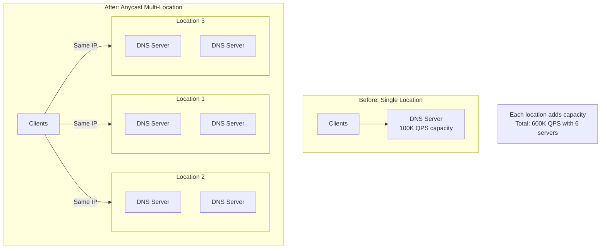
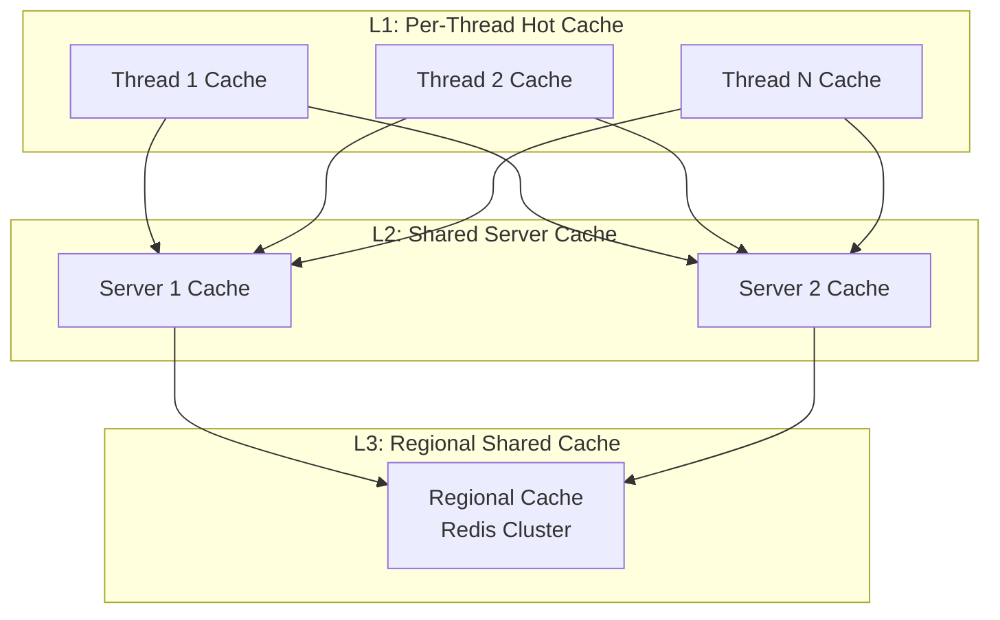
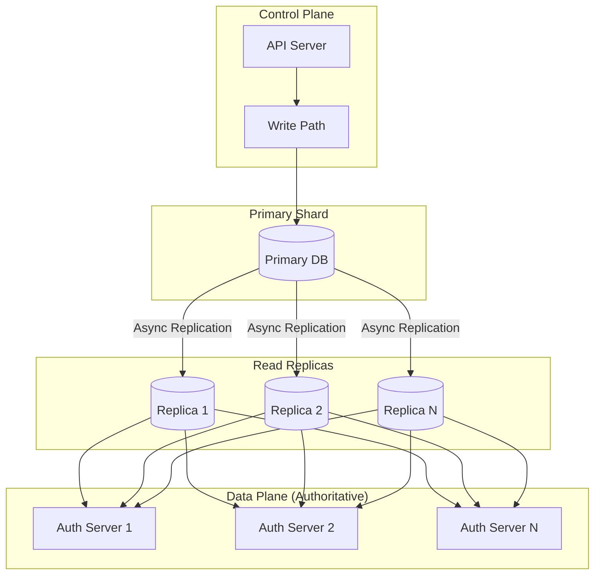
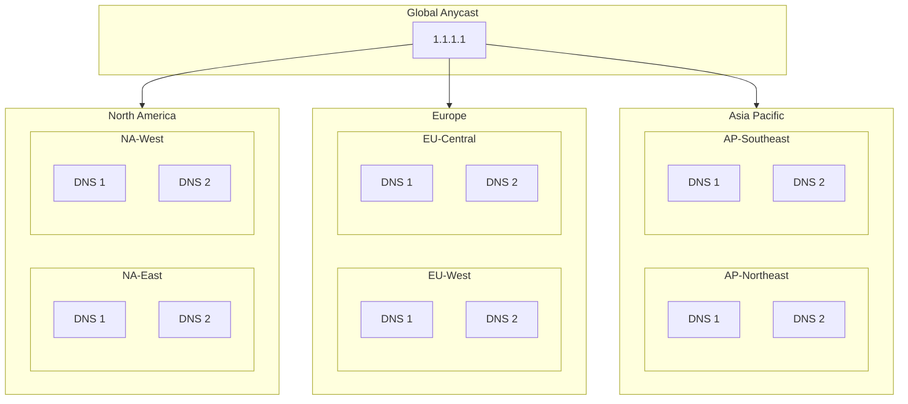
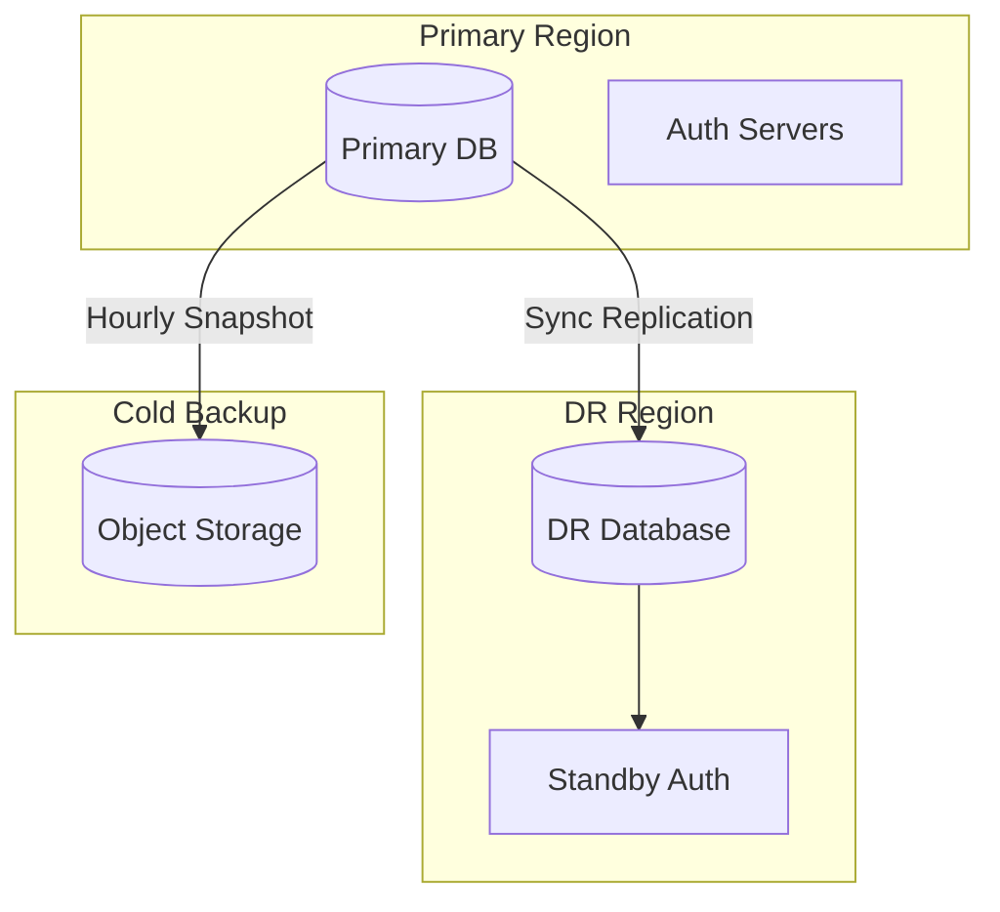

# Scalability and Reliability

[← Back to Index](./00-index.md)

---

## Table of Contents
- [Scalability Strategies](#scalability-strategies)
- [Reliability Patterns](#reliability-patterns)
- [Disaster Recovery](#disaster-recovery)
- [Capacity Planning](#capacity-planning)

---

## Scalability Strategies

### Horizontal Scaling via Anycast



**Scaling Process:**

| Step | Action | Result |
|------|--------|--------|
| 1 | Add servers to existing PoP | Increase capacity per location |
| 2 | Add new PoP with Anycast | Add geographic capacity |
| 3 | BGP announces new PoP | Traffic automatically redistributes |
| 4 | No client changes needed | Seamless scaling |

### Cache Hierarchy Scaling



**Cache Tier Characteristics:**

| Tier | Scope | Size | Latency | Hit Ratio |
|------|-------|------|---------|-----------|
| L1 | Per-thread | 10K entries | < 1ms | 60-70% |
| L2 | Per-server | 1M entries | 1-2ms | 85-90% |
| L3 | Regional | 100M entries | 5-10ms | 95%+ |

### Zone Database Scaling



**Database Scaling Strategies:**

| Strategy | Use Case | Trade-off |
|----------|----------|-----------|
| **Read Replicas** | Query scaling | Replication lag |
| **Sharding by Zone** | Large zone count | Cross-shard queries |
| **In-Memory Zones** | High QPS zones | Memory limits |
| **Caching Layer** | Hot zones | Consistency |

### Auto-Scaling Configuration

```python
class DNSAutoScaler:
    """
    Auto-scale DNS infrastructure based on load.
    """

    def __init__(self):
        self.scale_up_threshold = 0.70   # 70% capacity
        self.scale_down_threshold = 0.30  # 30% capacity
        self.cooldown_period = 300        # 5 minutes

    async def evaluate_scaling(self, metrics: Metrics):
        """
        Evaluate if scaling action needed.
        """
        current_qps = metrics.qps
        current_capacity = metrics.capacity

        utilization = current_qps / current_capacity

        if utilization > self.scale_up_threshold:
            await self.scale_up()
        elif utilization < self.scale_down_threshold:
            await self.scale_down()

    async def scale_up(self):
        """
        Add capacity.
        """
        # Option 1: Add servers to existing PoP
        if self.can_add_server_to_pop():
            await self.provision_server()
            await self.add_to_load_balancer()

        # Option 2: Activate standby PoP
        elif self.has_standby_pop():
            await self.activate_standby_pop()

    async def scale_down(self):
        """
        Remove excess capacity (graceful).
        """
        # Drain traffic first
        await self.drain_server()
        await asyncio.sleep(self.cooldown_period)
        await self.remove_from_load_balancer()
        await self.terminate_server()
```

---

## Reliability Patterns

### Multi-Region Deployment



**Regional Failover:**

| Failure Scope | Detection | Failover Time | Mechanism |
|---------------|-----------|---------------|-----------|
| Server | Health check | 5-10 seconds | LB removal |
| PoP | BGP monitoring | 10-30 seconds | BGP withdrawal |
| Region | Multi-PoP failure | 30-90 seconds | Cross-region BGP |

### Health Check System

```python
class HealthCheckManager:
    """
    Multi-layer health checking.
    """

    def __init__(self):
        self.checks = {
            'dns_service': self._check_dns_service,
            'cache': self._check_cache_health,
            'upstream': self._check_upstream_connectivity,
            'disk': self._check_disk_space,
            'cpu': self._check_cpu_usage,
        }

    async def run_health_checks(self) -> HealthStatus:
        """
        Run all health checks.
        """
        results = {}
        overall_healthy = True

        for name, check_fn in self.checks.items():
            try:
                result = await asyncio.wait_for(
                    check_fn(),
                    timeout=HEALTH_CHECK_TIMEOUT
                )
                results[name] = result
                if not result.healthy:
                    overall_healthy = False
            except asyncio.TimeoutError:
                results[name] = HealthResult(healthy=False, reason="timeout")
                overall_healthy = False

        return HealthStatus(
            healthy=overall_healthy,
            checks=results,
            timestamp=time.time()
        )

    async def _check_dns_service(self) -> HealthResult:
        """
        Verify DNS service responds correctly.
        """
        try:
            # Query known good domain
            response = await self.resolver.resolve(
                "health.internal",
                RecordType.A
            )
            if response.rcode == NOERROR:
                return HealthResult(healthy=True)
            return HealthResult(healthy=False, reason=f"rcode={response.rcode}")
        except Exception as e:
            return HealthResult(healthy=False, reason=str(e))

    async def _check_upstream_connectivity(self) -> HealthResult:
        """
        Verify connectivity to root/TLD servers.
        """
        try:
            # Query root server
            response = await self.query_server(
                ROOT_SERVER,
                ".",
                RecordType.NS
            )
            return HealthResult(healthy=response is not None)
        except Exception as e:
            return HealthResult(healthy=False, reason=str(e))
```

### Circuit Breaker for Upstream

```python
class UpstreamCircuitBreaker:
    """
    Prevent cascade failures from upstream servers.
    """

    def __init__(self):
        self.state = CircuitState.CLOSED
        self.failure_count = 0
        self.failure_threshold = 5
        self.reset_timeout = 30  # seconds
        self.last_failure_time = 0

    async def call(self, upstream: str, query: DNSQuery) -> DNSResponse:
        """
        Execute query with circuit breaker protection.
        """
        if self.state == CircuitState.OPEN:
            if time.time() - self.last_failure_time > self.reset_timeout:
                self.state = CircuitState.HALF_OPEN
            else:
                raise CircuitOpenError(upstream)

        try:
            response = await self._query_upstream(upstream, query)

            if self.state == CircuitState.HALF_OPEN:
                self.state = CircuitState.CLOSED
                self.failure_count = 0

            return response

        except Exception as e:
            self.failure_count += 1
            self.last_failure_time = time.time()

            if self.failure_count >= self.failure_threshold:
                self.state = CircuitState.OPEN

            raise

    def get_healthy_upstreams(self, upstreams: list[str]) -> list[str]:
        """
        Filter to healthy upstreams only.
        """
        return [
            u for u in upstreams
            if self.circuits[u].state != CircuitState.OPEN
        ]
```

### Graceful Degradation

```python
class GracefulDegradation:
    """
    Strategies for maintaining service during partial failures.
    """

    async def resolve_with_fallbacks(
        self,
        qname: str,
        qtype: int
    ) -> DNSResponse:
        """
        Try resolution with multiple fallback strategies.
        """
        # Strategy 1: Normal resolution
        try:
            return await self.resolver.resolve(qname, qtype)
        except ResolutionError:
            pass

        # Strategy 2: Return stale cached entry
        stale = self.cache.get_stale(qname, qtype)
        if stale:
            # Mark as stale in response
            stale.flags |= STALE_FLAG
            return stale

        # Strategy 3: Try backup resolvers
        for backup in self.backup_resolvers:
            try:
                return await backup.resolve(qname, qtype)
            except Exception:
                continue

        # Strategy 4: Return SERVFAIL
        return self.build_servfail(qname, qtype)

    def serve_stale_on_error(self, entry: CacheEntry) -> bool:
        """
        Decide whether to serve stale entry.

        RFC 8767: Serving Stale Data to Improve DNS Resiliency
        """
        if entry is None:
            return False

        # Check stale age
        stale_age = time.time() - entry.expires_at
        if stale_age > MAX_STALE_AGE:
            return False

        # Serve stale if upstream is failing
        if self.upstream_failing:
            return True

        return False
```

---

## Disaster Recovery

### Recovery Objectives

| Metric | Target | Mechanism |
|--------|--------|-----------|
| **RPO** (Recovery Point Objective) | 0 (real-time) | Synchronous zone replication |
| **RTO** (Recovery Time Objective) | < 30 seconds | Anycast failover |
| **MTTR** (Mean Time To Recovery) | < 5 minutes | Automated recovery |

### Zone Data Backup Strategy



**Backup Tiers:**

| Tier | Type | Frequency | Retention | RTO |
|------|------|-----------|-----------|-----|
| 1 | Sync Replication | Real-time | N/A | Seconds |
| 2 | Async Replication | < 1 minute | N/A | Minutes |
| 3 | Snapshot | Hourly | 30 days | Hours |
| 4 | Archive | Daily | 1 year | Days |

### Failover Procedures

```python
class DisasterRecoveryManager:
    """
    Manage DR failover procedures.
    """

    async def initiate_failover(self, failed_region: str):
        """
        Initiate regional failover.
        """
        # Step 1: Verify failure is real
        if not await self._confirm_failure(failed_region):
            return

        # Step 2: Withdraw BGP from failed region
        await self._withdraw_bgp(failed_region)

        # Step 3: Promote DR region
        dr_region = self._get_dr_region(failed_region)
        await self._promote_dr(dr_region)

        # Step 4: Scale up DR capacity
        await self._scale_dr(dr_region)

        # Step 5: Verify service restored
        await self._verify_resolution()

        # Step 6: Alert operations team
        await self._send_alert(f"Failover from {failed_region} to {dr_region}")

    async def _confirm_failure(self, region: str) -> bool:
        """
        Confirm failure from multiple vantage points.
        """
        # Check from multiple monitoring locations
        confirmations = await asyncio.gather(*[
            self._probe_from_location(loc, region)
            for loc in MONITORING_LOCATIONS
        ])

        # Require majority confirmation
        failure_count = sum(1 for c in confirmations if not c)
        return failure_count >= len(MONITORING_LOCATIONS) // 2 + 1
```

### Data Recovery Procedures

```
┌────────────────────────────────────────────────────────────────────┐
│ ZONE DATA RECOVERY RUNBOOK                                          │
├────────────────────────────────────────────────────────────────────┤
│                                                                     │
│ Scenario: Primary zone database corrupted                          │
│                                                                     │
│ Step 1: Assess damage                                               │
│   □ Identify affected zones                                        │
│   □ Check sync replica status                                      │
│   □ Verify backup integrity                                        │
│                                                                     │
│ Step 2: Isolate affected systems                                   │
│   □ Stop writes to corrupted database                             │
│   □ Redirect traffic to healthy replicas                          │
│   □ Preserve corrupted data for analysis                          │
│                                                                     │
│ Step 3: Restore from best source                                   │
│   □ If sync replica healthy: promote replica                      │
│   □ If replica corrupted: restore from snapshot                   │
│   □ Verify zone data integrity                                     │
│                                                                     │
│ Step 4: Validate restoration                                       │
│   □ Compare zone serial numbers                                    │
│   □ Spot-check critical records                                    │
│   □ Run automated validation suite                                 │
│                                                                     │
│ Step 5: Resume normal operations                                   │
│   □ Re-enable writes                                               │
│   □ Rebuild sync replication                                       │
│   □ Update monitoring                                              │
│                                                                     │
│ Step 6: Post-incident                                               │
│   □ Root cause analysis                                            │
│   □ Update runbooks if needed                                      │
│   □ Implement preventive measures                                  │
│                                                                     │
└────────────────────────────────────────────────────────────────────┘
```

---

## Capacity Planning

### Capacity Model

```python
class CapacityPlanner:
    """
    DNS capacity planning model.
    """

    def calculate_required_capacity(
        self,
        expected_qps: int,
        target_utilization: float = 0.7
    ) -> CapacityPlan:
        """
        Calculate required infrastructure.
        """
        # Server capacity (with headroom)
        effective_qps_per_server = SERVER_QPS_CAPACITY * target_utilization
        servers_needed = math.ceil(expected_qps / effective_qps_per_server)

        # Add N+2 redundancy per location
        servers_with_redundancy = servers_needed + 2

        # PoP distribution (minimum 3 for Anycast)
        if expected_qps < 100_000:
            pops_needed = 3
        elif expected_qps < 1_000_000:
            pops_needed = 5
        else:
            pops_needed = max(10, expected_qps // 500_000)

        # Cache sizing
        cache_size = self._calculate_cache_size(expected_qps)

        return CapacityPlan(
            total_servers=servers_with_redundancy * pops_needed,
            servers_per_pop=servers_with_redundancy,
            pops=pops_needed,
            cache_size_gb=cache_size,
            expected_qps=expected_qps,
            max_qps=servers_with_redundancy * pops_needed * SERVER_QPS_CAPACITY
        )

    def _calculate_cache_size(self, qps: int) -> int:
        """
        Estimate cache size needed.
        """
        # Assume 1M unique queries per 100K QPS
        unique_queries = (qps / 100_000) * 1_000_000

        # Average entry size: 200 bytes
        cache_bytes = unique_queries * 200

        # Add 50% overhead for data structures
        cache_bytes *= 1.5

        return int(cache_bytes / (1024 ** 3))  # Convert to GB
```

### Growth Projections

```
┌────────────────────────────────────────────────────────────────────┐
│ CAPACITY GROWTH PROJECTION                                          │
├────────────────────────────────────────────────────────────────────┤
│                                                                     │
│ Current State (Year 0):                                            │
│   QPS: 1,000,000                                                   │
│   Servers: 30 (6 PoPs × 5 servers)                                │
│   Cache: 10 GB per server                                          │
│                                                                     │
│ Year 1 Projection (30% growth):                                    │
│   QPS: 1,300,000                                                   │
│   Action: Add 2 servers per PoP                                    │
│   New Total: 42 servers                                            │
│                                                                     │
│ Year 2 Projection (30% growth):                                    │
│   QPS: 1,690,000                                                   │
│   Action: Add 2 new PoPs                                           │
│   New Total: 56 servers (8 PoPs × 7 servers)                      │
│                                                                     │
│ Year 3 Projection (30% growth):                                    │
│   QPS: 2,197,000                                                   │
│   Action: Add servers + cache upgrade                              │
│   New Total: 72 servers, 20 GB cache                              │
│                                                                     │
│ Scaling Triggers:                                                   │
│   • QPS utilization > 70%: Add servers                            │
│   • Cache hit ratio < 90%: Increase cache                         │
│   • Latency p99 > 100ms: Add PoP in affected region              │
│                                                                     │
└────────────────────────────────────────────────────────────────────┘
```

### Performance Benchmarks

| Configuration | QPS (Max) | Latency p50 | Latency p99 |
|---------------|-----------|-------------|-------------|
| Single server (baseline) | 100K | 1ms | 5ms |
| Single PoP (5 servers) | 500K | 1ms | 8ms |
| 3 PoPs (15 servers) | 1.5M | 2ms | 10ms |
| 10 PoPs (50 servers) | 5M | 2ms | 15ms |
| 50 PoPs (250 servers) | 25M | 3ms | 20ms |

### DNS Software Comparison

| Software | Architecture | Max QPS | Use Case |
|----------|-------------|---------|----------|
| **BIND** | Multi-threaded | ~500K | Traditional, feature-rich |
| **Unbound** | Multi-threaded | ~1M | Recursive resolver |
| **PowerDNS** | Multi-threaded | ~500K | Authoritative, SQL backend |
| **Knot DNS** | Multi-threaded | ~2M | High-performance authoritative |
| **CoreDNS** | Go, plugins | ~500K | Kubernetes, cloud-native |
| **Custom (DPDK)** | Kernel bypass | ~10M | Ultra-high performance |
