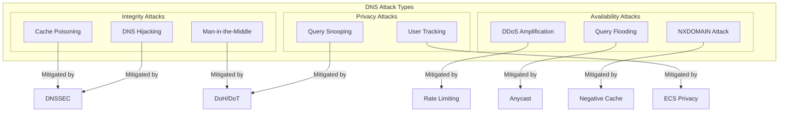
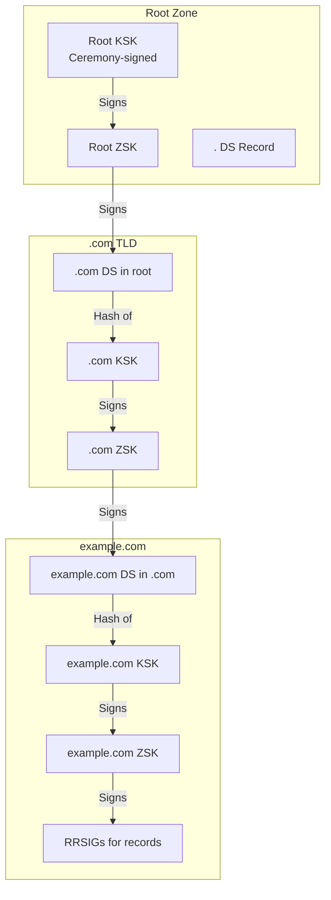

# Security and Compliance

[← Back to Index](./00-index.md)

---

## Table of Contents
- [Threat Model](#threat-model)
- [Security Mechanisms](#security-mechanisms)
- [Privacy Considerations](#privacy-considerations)
- [Compliance](#compliance)

---

## Threat Model

### DNS Attack Taxonomy



### Attack Scenarios

| Attack | Mechanism | Impact | Severity |
|--------|-----------|--------|----------|
| **Cache Poisoning** | Inject false records into cache | Users redirected to malicious sites | Critical |
| **DNS Amplification** | Spoofed queries cause large responses | DDoS against third party | High |
| **DNS Hijacking** | Compromise authoritative server | Total domain control | Critical |
| **Query Flooding** | Overwhelm resolver with queries | Service disruption | High |
| **NXDOMAIN Attack** | Query random subdomains | Cache pollution, origin load | Medium |
| **Birthday Attack** | Guess query ID to poison cache | Cache corruption | Medium |

---

## Security Mechanisms

### 1. DNSSEC (DNS Security Extensions)

DNSSEC provides authentication and integrity for DNS responses using cryptographic signatures.

#### Chain of Trust



#### DNSSEC Record Types

| Record | Purpose | Example |
|--------|---------|---------|
| **RRSIG** | Signature over RRset | Signs A records for www.example.com |
| **DNSKEY** | Public key for zone | Contains ZSK and KSK |
| **DS** | Delegation signer | Hash of child's KSK in parent zone |
| **NSEC/NSEC3** | Authenticated denial | Proves name doesn't exist |

#### DNSSEC Validation

```python
class DNSSECValidator:
    """
    Validate DNSSEC signatures.
    """

    def __init__(self):
        self.trust_anchors = load_root_trust_anchors()

    async def validate(
        self,
        response: DNSResponse,
        qname: str,
        qtype: int
    ) -> ValidationResult:
        """
        Validate DNSSEC chain for response.
        """
        # Step 1: Check if response has signatures
        rrsigs = response.get_rrsigs(qtype)
        if not rrsigs:
            return ValidationResult.INSECURE  # Not signed

        # Step 2: Build chain of trust
        chain = await self._build_chain(qname)

        # Step 3: Validate from root down
        for i, link in enumerate(chain):
            if i == 0:
                # Validate against trust anchor
                if not self._validate_with_anchor(link):
                    return ValidationResult.BOGUS
            else:
                # Validate against parent DS
                if not self._validate_ds(link, chain[i-1]):
                    return ValidationResult.BOGUS

        # Step 4: Validate answer RRSIG
        dnskey = chain[-1].dnskey
        if not self._verify_rrsig(response.answers, rrsigs, dnskey):
            return ValidationResult.BOGUS

        return ValidationResult.SECURE

    def _verify_rrsig(
        self,
        records: list[Record],
        rrsigs: list[RRSIG],
        dnskey: DNSKEY
    ) -> bool:
        """
        Verify RRSIG signature.
        """
        for rrsig in rrsigs:
            if rrsig.key_tag != dnskey.key_tag:
                continue

            # Construct signed data
            signed_data = self._build_signed_data(records, rrsig)

            # Verify signature
            if self._verify_signature(signed_data, rrsig.signature, dnskey):
                return True

        return False
```

#### Key Rollover

```python
class DNSSECKeyManager:
    """
    Manage DNSSEC key lifecycle.
    """

    # Key rollover timelines
    ZSK_LIFETIME = 90 * 24 * 3600  # 90 days
    KSK_LIFETIME = 365 * 24 * 3600  # 1 year

    async def zsk_rollover(self, zone: str):
        """
        ZSK rollover using pre-publication method.
        """
        # Phase 1: Introduce new ZSK
        new_zsk = await self._generate_zsk()
        await self._publish_dnskey(zone, new_zsk)

        # Wait for DNSKEY TTL + propagation
        await asyncio.sleep(DNSKEY_TTL + PROPAGATION_BUFFER)

        # Phase 2: Sign with new ZSK
        await self._sign_zone_with_key(zone, new_zsk)

        # Wait for signature TTL
        await asyncio.sleep(RRSIG_TTL + PROPAGATION_BUFFER)

        # Phase 3: Remove old ZSK
        await self._remove_old_zsk(zone)

    async def ksk_rollover(self, zone: str):
        """
        KSK rollover using double-DS method.
        """
        # Phase 1: Generate new KSK and publish DNSKEY
        new_ksk = await self._generate_ksk()
        await self._publish_dnskey(zone, new_ksk)

        # Phase 2: Add new DS to parent
        new_ds = self._compute_ds(new_ksk)
        await self._request_parent_ds_add(zone, new_ds)

        # Wait for DS TTL at parent
        await asyncio.sleep(PARENT_DS_TTL + PROPAGATION_BUFFER)

        # Phase 3: Remove old DS from parent
        await self._request_parent_ds_remove(zone, old_ds)

        # Phase 4: Remove old KSK
        await asyncio.sleep(DNSKEY_TTL + PROPAGATION_BUFFER)
        await self._remove_old_ksk(zone)
```

### 2. DNS over HTTPS (DoH) / DNS over TLS (DoT)

Encrypted DNS transport prevents eavesdropping and manipulation.

#### Protocol Comparison

| Feature | DNS (UDP/53) | DoT (TCP/853) | DoH (TCP/443) |
|---------|--------------|---------------|---------------|
| **Encryption** | None | TLS | HTTPS/TLS |
| **Privacy** | Queries visible | Encrypted | Encrypted + Hidden in HTTPS |
| **Blockable** | Port 53 | Port 853 | Hard (looks like HTTPS) |
| **Performance** | Fastest | TLS overhead | HTTP + TLS overhead |
| **Caching** | Resolver cache | Resolver cache | HTTP cache possible |

#### DoH Implementation

```python
class DoHHandler:
    """
    DNS over HTTPS handler.
    """

    async def handle_request(self, request: HTTPRequest) -> HTTPResponse:
        """
        Process DoH request.
        """
        # Parse DNS query from HTTP
        if request.method == 'GET':
            # Base64URL encoded in 'dns' parameter
            dns_query = base64url_decode(request.params['dns'])
        elif request.method == 'POST':
            # Binary in request body
            dns_query = request.body
        else:
            return HTTPResponse(status=405)

        # Validate content type
        if request.content_type not in ['application/dns-message']:
            return HTTPResponse(status=400)

        # Parse DNS message
        query = DNSMessage.parse(dns_query)

        # Resolve
        response = await self.resolver.resolve(
            query.questions[0].name,
            query.questions[0].type
        )

        # Build DNS response
        dns_response = response.to_wire()

        return HTTPResponse(
            status=200,
            content_type='application/dns-message',
            body=dns_response,
            headers={
                'Cache-Control': f'max-age={response.min_ttl}'
            }
        )
```

### 3. Cache Poisoning Prevention

```python
class PoisoningPrevention:
    """
    Prevent DNS cache poisoning attacks.
    """

    def __init__(self):
        self.source_port_pool = PortPool(range(1024, 65535))
        self.transaction_ids = SecureRandom()

    def create_query(self, qname: str, qtype: int) -> tuple[DNSQuery, QueryContext]:
        """
        Create query with randomized parameters.
        """
        # Randomize transaction ID (16 bits)
        txid = self.transaction_ids.random_uint16()

        # Randomize source port (16 bits)
        src_port = self.source_port_pool.allocate()

        # Use 0x20 encoding for case randomization
        randomized_name = self._apply_0x20_encoding(qname)

        query = DNSQuery(
            id=txid,
            questions=[Question(name=randomized_name, type=qtype)]
        )

        context = QueryContext(
            txid=txid,
            src_port=src_port,
            qname_case=randomized_name
        )

        return query, context

    def validate_response(
        self,
        response: DNSResponse,
        context: QueryContext
    ) -> bool:
        """
        Validate response matches query context.
        """
        # Check transaction ID
        if response.id != context.txid:
            return False

        # Check question section matches (including case)
        if response.questions[0].name != context.qname_case:
            return False

        # Additional validation: DNSSEC if available
        if response.has_dnssec:
            return self.dnssec_validator.validate(response)

        return True

    def _apply_0x20_encoding(self, name: str) -> str:
        """
        Randomize case of letters in domain name.
        DNS is case-insensitive but preserves case.
        """
        result = []
        for char in name:
            if char.isalpha():
                if random.random() > 0.5:
                    result.append(char.upper())
                else:
                    result.append(char.lower())
            else:
                result.append(char)
        return ''.join(result)
```

### 4. DDoS Mitigation

#### Response Rate Limiting (RRL)

```python
class ResponseRateLimiter:
    """
    RFC 6973: DNS Response Rate Limiting.
    """

    def __init__(self):
        self.window = 1  # 1 second window
        self.responses_per_second = 5  # Max identical responses
        self.slip_ratio = 2  # 1 in N gets TC=1
        self.counters = {}

    def should_respond(
        self,
        client_ip: str,
        qname: str,
        response_type: str
    ) -> tuple[bool, bool]:
        """
        Determine if response should be sent.
        Returns: (should_respond, should_truncate)
        """
        # Create rate limit key
        # Aggregate by /24 for IPv4, /48 for IPv6
        prefix = self._get_prefix(client_ip)
        key = f"{prefix}:{qname}:{response_type}"

        now = time.time()
        window_start = now - self.window

        # Get or create counter
        counter = self.counters.get(key)
        if counter is None or counter.window_start < window_start:
            counter = RateLimitCounter(window_start=now, count=0)
            self.counters[key] = counter

        counter.count += 1

        if counter.count <= self.responses_per_second:
            return True, False

        # Over limit: slip some through with TC=1
        if counter.count % self.slip_ratio == 0:
            return True, True  # Truncate to force TCP retry

        return False, False  # Drop
```

#### Anycast DDoS Distribution

```
┌────────────────────────────────────────────────────────────────────┐
│ ANYCAST DDoS MITIGATION                                             │
├────────────────────────────────────────────────────────────────────┤
│                                                                     │
│ Attack: 100 Gbps DDoS targeting 1.1.1.1                            │
│                                                                     │
│ Without Anycast (single server):                                   │
│   ┌─────────────────┐                                              │
│   │    100 Gbps     │ → Server overwhelmed                        │
│   │    ████████████ │                                              │
│   └─────────────────┘                                              │
│                                                                     │
│ With Anycast (50 PoPs):                                            │
│   ┌─────┐ ┌─────┐ ┌─────┐ ┌─────┐ ┌─────┐                        │
│   │2Gbps│ │2Gbps│ │2Gbps│ │2Gbps│ │2Gbps│ ...                    │
│   │ ██  │ │ ██  │ │ ██  │ │ ██  │ │ ██  │                        │
│   └─────┘ └─────┘ └─────┘ └─────┘ └─────┘                        │
│   Attack distributed across 50 locations                           │
│   Each PoP handles ~2 Gbps (manageable)                           │
│                                                                     │
│ Key Benefits:                                                       │
│   • Natural traffic distribution                                   │
│   • No single point of failure                                     │
│   • Attack surface distributed globally                            │
│   • Each PoP can drop bad traffic locally                         │
│                                                                     │
└────────────────────────────────────────────────────────────────────┘
```

---

## Privacy Considerations

### Query Privacy

| Concern | Problem | Mitigation |
|---------|---------|------------|
| **ISP Snooping** | ISP sees all DNS queries | Use DoH/DoT |
| **Resolver Logging** | Resolver logs queries | Minimal logging, data retention policies |
| **EDNS Client Subnet** | Resolver sends client IP | Truncate to /24 or disable |
| **Query Timing** | Traffic analysis | Query padding (EDNS0 padding) |

### EDNS Client Subnet Privacy

```python
class ECSPrivacyFilter:
    """
    Apply privacy controls to EDNS Client Subnet.
    """

    def __init__(self):
        # Maximum prefix length to forward
        self.max_ipv4_prefix = 24  # /24 = 256 addresses
        self.max_ipv6_prefix = 48  # /48 = ~65K networks

    def filter_ecs(self, ecs_option: ECSOption) -> ECSOption | None:
        """
        Apply privacy filtering to ECS option.
        """
        if ecs_option is None:
            return None

        if ecs_option.family == 1:  # IPv4
            # Truncate to /24
            prefix = min(ecs_option.source_prefix, self.max_ipv4_prefix)
            # Zero out host bits
            masked_ip = self._mask_ip(ecs_option.address, prefix)

        else:  # IPv6
            prefix = min(ecs_option.source_prefix, self.max_ipv6_prefix)
            masked_ip = self._mask_ip(ecs_option.address, prefix)

        return ECSOption(
            family=ecs_option.family,
            source_prefix=prefix,
            address=masked_ip
        )
```

### Query Minimization

```python
class QueryMinimizer:
    """
    RFC 7816: DNS Query Name Minimization.
    Only send minimal labels to each server.
    """

    async def resolve_minimized(self, qname: str, qtype: int):
        """
        Resolve using query name minimization.
        """
        labels = qname.split('.')

        # Start from root, reveal one label at a time
        current_zone = '.'
        current_servers = self.root_servers

        for i in range(len(labels) - 1, -1, -1):
            # Query for next label only
            next_label = labels[i]
            query_name = f"{next_label}.{current_zone}".strip('.')

            # Query for NS, not the final type yet
            response = await self._query(
                current_servers,
                query_name,
                RecordType.NS
            )

            if response.is_referral:
                current_zone = query_name
                current_servers = response.authority_servers
            else:
                break

        # Final query with actual type
        return await self._query(current_servers, qname, qtype)
```

---

## Compliance

### Data Retention Requirements

| Jurisdiction | Requirement | Retention Period |
|--------------|-------------|------------------|
| **GDPR (EU)** | Minimize data collection | As short as possible |
| **CCPA (California)** | Disclose data collection | 12 months |
| **Data Retention Directive** | Log for law enforcement | 6-24 months (varies) |

### Logging Best Practices

```python
class PrivacyAwareLogger:
    """
    DNS query logging with privacy controls.
    """

    def __init__(self, config: LogConfig):
        self.retention_days = config.retention_days
        self.anonymize = config.anonymize
        self.fields_to_log = config.fields

    def log_query(self, query: DNSQuery, response: DNSResponse, client_ip: str):
        """
        Log query with privacy controls.
        """
        log_entry = {}

        if 'timestamp' in self.fields_to_log:
            log_entry['timestamp'] = datetime.utcnow().isoformat()

        if 'client_ip' in self.fields_to_log:
            if self.anonymize:
                # Truncate to /24 for privacy
                log_entry['client_ip'] = self._anonymize_ip(client_ip)
            else:
                log_entry['client_ip'] = client_ip

        if 'query_name' in self.fields_to_log:
            log_entry['query_name'] = query.questions[0].name

        if 'query_type' in self.fields_to_log:
            log_entry['query_type'] = query.questions[0].type

        if 'response_code' in self.fields_to_log:
            log_entry['response_code'] = response.rcode

        # Omit sensitive fields by default
        # - Full client IP
        # - User agent (DoH)
        # - Cookies

        self._write_log(log_entry)

    def _anonymize_ip(self, ip: str) -> str:
        """
        Anonymize IP address.
        """
        if ':' in ip:  # IPv6
            # Keep first 48 bits
            parts = ip.split(':')
            return ':'.join(parts[:3]) + '::'
        else:  # IPv4
            # Keep first 24 bits
            parts = ip.split('.')
            return '.'.join(parts[:3]) + '.0'
```

### Security Audit Checklist

```
┌────────────────────────────────────────────────────────────────────┐
│ DNS SECURITY AUDIT CHECKLIST                                        │
├────────────────────────────────────────────────────────────────────┤
│                                                                     │
│ □ DNSSEC                                                           │
│   □ DNSSEC signing enabled for authoritative zones                │
│   □ DNSSEC validation enabled on resolvers                        │
│   □ Key rollover procedures documented and tested                 │
│   □ Trust anchor management automated                             │
│                                                                     │
│ □ Encrypted Transport                                              │
│   □ DoH/DoT available for clients                                 │
│   □ TLS 1.3 required (disable older versions)                     │
│   □ Certificate rotation automated                                 │
│                                                                     │
│ □ Cache Poisoning Prevention                                       │
│   □ Source port randomization enabled                             │
│   □ Transaction ID randomization enabled                          │
│   □ 0x20 encoding enabled                                          │
│   □ DNSSEC validation enforced                                    │
│                                                                     │
│ □ DDoS Mitigation                                                  │
│   □ Response Rate Limiting (RRL) enabled                          │
│   □ Anycast deployment                                            │
│   □ BGP Flowspec capability                                       │
│   □ Upstream DDoS scrubbing service                               │
│                                                                     │
│ □ Access Control                                                   │
│   □ Zone transfer (AXFR) restricted by IP                        │
│   □ Dynamic updates authenticated (TSIG)                          │
│   □ Management API uses strong authentication                     │
│                                                                     │
│ □ Monitoring                                                       │
│   □ Query anomaly detection                                       │
│   □ DNSSEC validation failure alerts                              │
│   □ DDoS attack detection                                         │
│                                                                     │
│ □ Privacy                                                          │
│   □ Query logging minimized                                       │
│   □ Client IP anonymization                                       │
│   □ Data retention policy enforced                                │
│   □ ECS prefix length limited                                     │
│                                                                     │
└────────────────────────────────────────────────────────────────────┘
```
