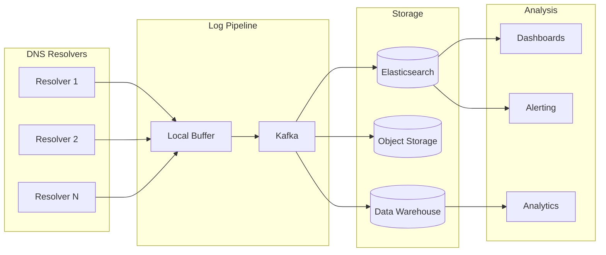

# Observability

[← Back to Index](./00-index.md)

---

## Table of Contents
- [Key Metrics](#key-metrics)
- [Dashboard Design](#dashboard-design)
- [Logging](#logging)
- [Alerting](#alerting)

---

## Key Metrics

### Performance Metrics

| Metric | Description | Target | Alert Threshold |
|--------|-------------|--------|-----------------|
| **QPS** | Queries per second | Scale-dependent | > 80% capacity |
| **Cache Hit Ratio** | % queries served from cache | > 95% | < 90% |
| **Latency (p50)** | Median query latency | < 5ms | > 20ms |
| **Latency (p99)** | 99th percentile latency | < 50ms | > 100ms |
| **Resolution Latency** | Cache miss resolution time | < 50ms | > 200ms |
| **Upstream Latency** | Latency to root/TLD/auth | < 30ms | > 100ms |

### Reliability Metrics

| Metric | Description | Target | Alert Threshold |
|--------|-------------|--------|-----------------|
| **Availability** | Uptime percentage | 99.999% | < 99.99% |
| **SERVFAIL Rate** | Server failure responses | < 0.01% | > 0.1% |
| **NXDOMAIN Rate** | Non-existent domain rate | Monitor trend | Spike > 2x |
| **Timeout Rate** | Query timeouts | < 0.001% | > 0.01% |
| **Zone Transfer Success** | AXFR/IXFR success rate | > 99.9% | < 99% |
| **Health Check Pass Rate** | GSLB health checks passing | > 99% | < 95% |

### Capacity Metrics

| Metric | Description | Target | Alert Threshold |
|--------|-------------|--------|-----------------|
| **CPU Utilization** | Per-server CPU usage | < 70% | > 85% |
| **Memory Utilization** | Per-server memory usage | < 80% | > 90% |
| **Cache Size** | Current cache entries | Monitor | > 95% capacity |
| **Connection Count** | Active TCP/DoH connections | Scale-dependent | > 80% max |
| **Bandwidth** | Network throughput | Scale-dependent | > 70% capacity |

### Metric Collection

```python
class DNSMetricsCollector:
    """
    Collect and aggregate DNS metrics.
    """

    def __init__(self, metrics_backend: MetricsBackend):
        self.metrics = metrics_backend

    def record_query(
        self,
        query: DNSQuery,
        response: DNSResponse,
        timing: QueryTiming
    ):
        """
        Record metrics for a single query.
        """
        labels = {
            'server': self.server_id,
            'pop': self.pop_id,
            'protocol': query.protocol,  # udp, tcp, doh, dot
            'qtype': query.questions[0].type_name,
            'rcode': response.rcode_name,
            'cache_status': 'hit' if timing.cache_hit else 'miss'
        }

        # Latency histogram
        self.metrics.histogram(
            'dns_query_latency_seconds',
            timing.total_latency,
            labels
        )

        # Query counter
        self.metrics.counter(
            'dns_queries_total',
            1,
            labels
        )

        # Cache metrics
        if timing.cache_hit:
            self.metrics.counter('dns_cache_hits_total', 1, labels)
        else:
            self.metrics.counter('dns_cache_misses_total', 1, labels)

        # Response size
        self.metrics.histogram(
            'dns_response_size_bytes',
            len(response.to_wire()),
            labels
        )

    def record_upstream_query(
        self,
        upstream: str,
        latency: float,
        success: bool
    ):
        """
        Record upstream query metrics.
        """
        labels = {
            'upstream': upstream,
            'success': str(success)
        }

        self.metrics.histogram(
            'dns_upstream_latency_seconds',
            latency,
            labels
        )

        if not success:
            self.metrics.counter(
                'dns_upstream_failures_total',
                1,
                labels
            )

    def record_cache_stats(self, cache: DNSCache):
        """
        Record cache statistics.
        """
        self.metrics.gauge(
            'dns_cache_entries',
            cache.size()
        )

        self.metrics.gauge(
            'dns_cache_hit_ratio',
            cache.hit_ratio()
        )

        self.metrics.gauge(
            'dns_cache_memory_bytes',
            cache.memory_usage()
        )
```

---

## Dashboard Design

### Global Overview Dashboard

```
┌────────────────────────────────────────────────────────────────────┐
│                     DNS GLOBAL OVERVIEW                             │
├────────────────────────────────────────────────────────────────────┤
│                                                                     │
│ ┌─────────────────┐ ┌─────────────────┐ ┌─────────────────┐       │
│ │    QPS TOTAL    │ │  CACHE HIT %    │ │   LATENCY P50   │       │
│ │   12,345,678    │ │     96.4%       │ │      2.3ms      │       │
│ │   ▲ +5% vs avg  │ │   ▲ +0.2%       │ │   ✓ Normal      │       │
│ └─────────────────┘ └─────────────────┘ └─────────────────┘       │
│                                                                     │
│ ┌─────────────────┐ ┌─────────────────┐ ┌─────────────────┐       │
│ │  SERVFAIL RATE  │ │   LATENCY P99   │ │  AVAILABILITY   │       │
│ │     0.003%      │ │     45ms        │ │    99.999%      │       │
│ │   ✓ Normal      │ │   ✓ Normal      │ │   ✓ Healthy     │       │
│ └─────────────────┘ └─────────────────┘ └─────────────────┘       │
│                                                                     │
│ QPS BY REGION (Last Hour)                                           │
│ ┌─────────────────────────────────────────────────────────────┐   │
│ │ North America  ████████████████████████████████  40%       │   │
│ │ Europe         ██████████████████████           28%       │   │
│ │ Asia Pacific   ████████████████                 20%       │   │
│ │ Other          ████████                         12%       │   │
│ └─────────────────────────────────────────────────────────────┘   │
│                                                                     │
│ RESPONSE CODE DISTRIBUTION                                          │
│ ┌─────────────────────────────────────────────────────────────┐   │
│ │ NOERROR   █████████████████████████████████████  92.5%     │   │
│ │ NXDOMAIN  ██████                                 7.2%     │   │
│ │ SERVFAIL  ▏                                       0.2%     │   │
│ │ REFUSED   ▏                                       0.1%     │   │
│ └─────────────────────────────────────────────────────────────┘   │
│                                                                     │
│ LATENCY TREND (Last 24 Hours)                                       │
│ ┌─────────────────────────────────────────────────────────────┐   │
│ │                                                               │   │
│ │ 100ms ┤                                              ·        │   │
│ │  50ms ┤                               ·····                   │   │
│ │  20ms ┤          ·····························               │   │
│ │   5ms ┤·····                                                  │   │
│ │       └──────────────────────────────────────────────────    │   │
│ │         00:00   04:00   08:00   12:00   16:00   20:00        │   │
│ │                                                               │   │
│ │         ─── p50    ─·─ p95    ─·· p99                        │   │
│ └─────────────────────────────────────────────────────────────┘   │
│                                                                     │
└────────────────────────────────────────────────────────────────────┘
```

### Per-PoP Dashboard

```
┌────────────────────────────────────────────────────────────────────┐
│                    PoP STATUS: TOKYO (NRT)                          │
├────────────────────────────────────────────────────────────────────┤
│                                                                     │
│ STATUS: ● HEALTHY                           Last Updated: 2s ago   │
│ BGP: ● Announced                            Anycast IP: 1.1.1.1    │
│                                                                     │
│ ┌─────────────────────────────────────────────────────────────┐   │
│ │ SERVER STATUS                                                 │   │
│ │ ┌────┐ ┌────┐ ┌────┐ ┌────┐ ┌────┐ ┌────┐ ┌────┐ ┌────┐   │   │
│ │ │ ●  │ │ ●  │ │ ●  │ │ ●  │ │ ●  │ │ ●  │ │ ●  │ │ ○  │   │   │
│ │ │S01 │ │S02 │ │S03 │ │S04 │ │S05 │ │S06 │ │S07 │ │S08 │   │   │
│ │ │120K│ │118K│ │122K│ │119K│ │121K│ │117K│ │120K│ │MAIN│   │   │
│ │ └────┘ └────┘ └────┘ └────┘ └────┘ └────┘ └────┘ └────┘   │   │
│ │ ● Healthy  ○ Maintenance  ◐ Degraded  ● Down              │   │
│ └─────────────────────────────────────────────────────────────┘   │
│                                                                     │
│ ┌──────────────────┐ ┌──────────────────┐ ┌──────────────────┐   │
│ │ CPU: 65%         │ │ Memory: 72%      │ │ Network In: 8Gbps│   │
│ │ █████████████░░░ │ │ ██████████████░░ │ │ ████████████████ │   │
│ └──────────────────┘ └──────────────────┘ └──────────────────┘   │
│                                                                     │
│ ┌──────────────────┐ ┌──────────────────┐ ┌──────────────────┐   │
│ │ Cache Entries    │ │ Cache Hit Ratio  │ │ Avg Latency      │   │
│ │ 8.5M / 10M       │ │ 96.8%            │ │ 1.8ms            │   │
│ └──────────────────┘ └──────────────────┘ └──────────────────┘   │
│                                                                     │
│ TOP QUERY TYPES                                                     │
│ ┌─────────────────────────────────────────────────────────────┐   │
│ │ A        ██████████████████████████████████████  65%       │   │
│ │ AAAA     ██████████████████                      25%       │   │
│ │ CNAME    ████                                     5%       │   │
│ │ MX       ██                                       3%       │   │
│ │ Other    █                                        2%       │   │
│ └─────────────────────────────────────────────────────────────┘   │
│                                                                     │
└────────────────────────────────────────────────────────────────────┘
```

### Zone Health Dashboard

```
┌────────────────────────────────────────────────────────────────────┐
│                    ZONE HEALTH: example.com                         │
├────────────────────────────────────────────────────────────────────┤
│                                                                     │
│ ZONE STATUS: ● HEALTHY                                              │
│ DNSSEC: ● Enabled (Algorithm: ECDSAP256SHA256)                     │
│ Serial: 2024011501                                                  │
│                                                                     │
│ ┌─────────────────────────────────────────────────────────────┐   │
│ │ AUTHORITATIVE SERVERS                                         │   │
│ │                                                               │   │
│ │ Server                │ Location │ Status │ QPS    │ Sync   │   │
│ │ ─────────────────────┼──────────┼────────┼────────┼──────  │   │
│ │ ns1.example.com      │ US-East  │ ● OK   │ 45,000 │ ✓      │   │
│ │ ns2.example.com      │ EU-West  │ ● OK   │ 38,000 │ ✓      │   │
│ │ ns3.example.com      │ AP-NE    │ ● OK   │ 32,000 │ ✓      │   │
│ │ ns4.example.com      │ US-West  │ ● OK   │ 28,000 │ ✓      │   │
│ └─────────────────────────────────────────────────────────────┘   │
│                                                                     │
│ GSLB ENDPOINT HEALTH                                                │
│ ┌─────────────────────────────────────────────────────────────┐   │
│ │ Endpoint            │ Region   │ Health │ Weight │ Traffic │   │
│ │ ────────────────────┼──────────┼────────┼────────┼──────── │   │
│ │ api-us.example.com  │ US       │ ● OK   │ 40     │ 42%     │   │
│ │ api-eu.example.com  │ EU       │ ● OK   │ 30     │ 31%     │   │
│ │ api-ap.example.com  │ APAC     │ ● OK   │ 30     │ 27%     │   │
│ └─────────────────────────────────────────────────────────────┘   │
│                                                                     │
│ DNSSEC STATUS                                                       │
│ ┌─────────────────────────────────────────────────────────────┐   │
│ │ KSK Key Tag: 12345   │ Status: Active  │ Expires: 2024-12-01│   │
│ │ ZSK Key Tag: 54321   │ Status: Active  │ Expires: 2024-04-01│   │
│ │ DS in Parent: ✓ Published                                    │   │
│ └─────────────────────────────────────────────────────────────┘   │
│                                                                     │
└────────────────────────────────────────────────────────────────────┘
```

---

## Logging

### Query Log Format

```json
{
  "timestamp": "2024-01-15T10:30:45.123456Z",
  "query_id": "a1b2c3d4",

  "client": {
    "ip": "203.0.113.0",
    "port": 54321,
    "protocol": "udp",
    "edns_client_subnet": "203.0.113.0/24"
  },

  "query": {
    "name": "www.example.com",
    "type": "A",
    "class": "IN",
    "rd": true,
    "do": true
  },

  "response": {
    "rcode": "NOERROR",
    "flags": ["QR", "RD", "RA", "AD"],
    "answer_count": 2,
    "authority_count": 0,
    "additional_count": 1,
    "size_bytes": 128
  },

  "resolution": {
    "cache_status": "HIT",
    "cache_ttl_remaining": 2400,
    "dnssec_status": "SECURE"
  },

  "timing": {
    "total_ms": 1.23,
    "cache_lookup_ms": 0.05,
    "upstream_ms": null
  },

  "server": {
    "pop": "NRT",
    "server_id": "dns-nrt-001"
  }
}
```

### Log Pipeline



### Structured Logging

```python
class DNSLogger:
    """
    Structured DNS query logging.
    """

    def __init__(self, config: LogConfig):
        self.output = config.output  # file, kafka, stdout
        self.sample_rate = config.sample_rate
        self.include_fields = config.fields

    def log_query(
        self,
        query: DNSQuery,
        response: DNSResponse,
        context: QueryContext
    ):
        """
        Log DNS query with sampling.
        """
        # Apply sampling
        if random.random() > self.sample_rate:
            return

        log_entry = {
            'timestamp': datetime.utcnow().isoformat(),
            'query_id': context.query_id
        }

        # Client info
        if 'client' in self.include_fields:
            log_entry['client'] = {
                'ip': self._anonymize_ip(context.client_ip),
                'port': context.client_port,
                'protocol': context.protocol
            }

        # Query info
        if 'query' in self.include_fields:
            log_entry['query'] = {
                'name': query.questions[0].name,
                'type': query.questions[0].type_name,
                'class': query.questions[0].class_name
            }

        # Response info
        if 'response' in self.include_fields:
            log_entry['response'] = {
                'rcode': response.rcode_name,
                'answer_count': len(response.answers),
                'size_bytes': len(response.to_wire())
            }

        # Timing info
        if 'timing' in self.include_fields:
            log_entry['timing'] = {
                'total_ms': context.total_latency * 1000,
                'cache_status': 'HIT' if context.cache_hit else 'MISS'
            }

        self._write(log_entry)
```

---

## Alerting

### Alert Hierarchy

```
┌────────────────────────────────────────────────────────────────────┐
│ ALERT SEVERITY LEVELS                                               │
├────────────────────────────────────────────────────────────────────┤
│                                                                     │
│ P1 - CRITICAL (Page immediately)                                   │
│   • Global SERVFAIL rate > 1%                                      │
│   • Multiple PoPs unreachable                                      │
│   • DNSSEC validation chain broken                                 │
│   • DDoS attack detected (> 10M QPS spike)                        │
│   Response: 5 minutes                                              │
│                                                                     │
│ P2 - HIGH (Page on-call)                                           │
│   • Single PoP unhealthy                                           │
│   • Cache hit ratio < 85%                                          │
│   • Latency p99 > 100ms                                            │
│   • Zone transfer failures                                         │
│   Response: 15 minutes                                             │
│                                                                     │
│ P3 - MEDIUM (Slack alert)                                          │
│   • Single server unhealthy                                        │
│   • DNSSEC key expiration < 14 days                               │
│   • Upstream latency elevated                                      │
│   • Memory utilization > 85%                                       │
│   Response: 1 hour                                                 │
│                                                                     │
│ P4 - LOW (Ticket)                                                  │
│   • Performance degradation trends                                  │
│   • Capacity planning warnings                                     │
│   • Non-critical config issues                                     │
│   Response: 24 hours                                               │
│                                                                     │
└────────────────────────────────────────────────────────────────────┘
```

### Alert Definitions

```yaml
alerts:
  - name: GlobalSERVFAILRateHigh
    severity: P1
    condition: |
      sum(rate(dns_queries_total{rcode="SERVFAIL"}[5m])) /
      sum(rate(dns_queries_total[5m])) > 0.01
    message: "Global SERVFAIL rate exceeds 1%"
    runbook: https://runbooks/dns/servfail-high

  - name: CacheHitRatioLow
    severity: P2
    condition: |
      sum(rate(dns_cache_hits_total[5m])) /
      sum(rate(dns_queries_total[5m])) < 0.85
      FOR 10m
    message: "Cache hit ratio below 85%"
    runbook: https://runbooks/dns/cache-hit-low

  - name: LatencyP99High
    severity: P2
    condition: |
      histogram_quantile(0.99,
        sum(rate(dns_query_latency_seconds_bucket[5m])) by (le)
      ) > 0.1
      FOR 5m
    message: "Query latency p99 exceeds 100ms"
    runbook: https://runbooks/dns/latency-high

  - name: PoPUnhealthy
    severity: P2
    condition: |
      dns_pop_health_status == 0
      FOR 2m
    message: "PoP {{ $labels.pop }} is unhealthy"
    runbook: https://runbooks/dns/pop-health

  - name: DNSSECKeyExpiring
    severity: P3
    condition: |
      dns_dnssec_key_expiry_days < 14
    message: "DNSSEC key for {{ $labels.zone }} expires in {{ $value }} days"
    runbook: https://runbooks/dns/dnssec-key-rotation

  - name: ZoneTransferFailed
    severity: P3
    condition: |
      increase(dns_zone_transfer_failures_total[1h]) > 3
    message: "Zone transfer failures for {{ $labels.zone }}"
    runbook: https://runbooks/dns/zone-transfer

  - name: UpstreamLatencyHigh
    severity: P3
    condition: |
      histogram_quantile(0.95,
        sum(rate(dns_upstream_latency_seconds_bucket[5m])) by (le, upstream)
      ) > 0.05
      FOR 10m
    message: "Upstream {{ $labels.upstream }} latency elevated"
    runbook: https://runbooks/dns/upstream-latency
```

### Anomaly Detection

```python
class DNSAnomalyDetector:
    """
    Detect anomalies in DNS traffic patterns.
    """

    def __init__(self):
        self.baseline_window = 7 * 24 * 3600  # 7 days
        self.detection_window = 300  # 5 minutes
        self.threshold_multiplier = 3  # 3 standard deviations

    def detect_qps_anomaly(self, current_qps: float) -> AnomalyResult:
        """
        Detect QPS anomalies using statistical methods.
        """
        # Get historical baseline
        baseline = self._get_baseline('qps')

        # Calculate z-score
        z_score = (current_qps - baseline.mean) / baseline.stddev

        if abs(z_score) > self.threshold_multiplier:
            return AnomalyResult(
                detected=True,
                severity='HIGH' if z_score > 0 else 'MEDIUM',
                message=f"QPS anomaly: {current_qps:.0f} (z={z_score:.2f})"
            )

        return AnomalyResult(detected=False)

    def detect_nxdomain_spike(self) -> AnomalyResult:
        """
        Detect NXDOMAIN flood attacks.
        """
        current_rate = self._get_current_rate('NXDOMAIN')
        baseline = self._get_baseline('NXDOMAIN')

        if current_rate > baseline.mean * 2:
            # Check for random subdomain pattern
            recent_nxdomains = self._get_recent_nxdomains()
            entropy = self._calculate_name_entropy(recent_nxdomains)

            if entropy > HIGH_ENTROPY_THRESHOLD:
                return AnomalyResult(
                    detected=True,
                    severity='HIGH',
                    message="Possible NXDOMAIN attack detected (high entropy)"
                )

        return AnomalyResult(detected=False)
```

---

## Summary

| Observability Pillar | Implementation |
|---------------------|----------------|
| **Metrics** | QPS, latency, cache hit ratio, RCODE distribution |
| **Logging** | Structured JSON query logs with sampling |
| **Alerting** | P1-P4 severity hierarchy with runbooks |
| **Dashboards** | Global overview, per-PoP, zone health |
| **Anomaly Detection** | Statistical analysis of traffic patterns |
