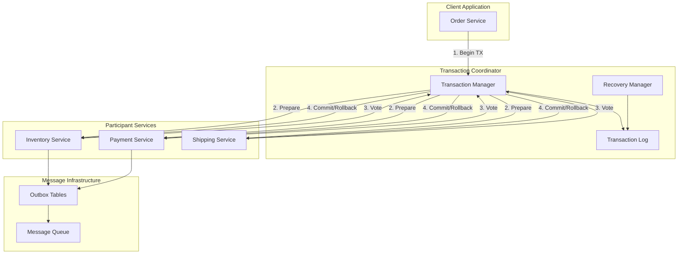
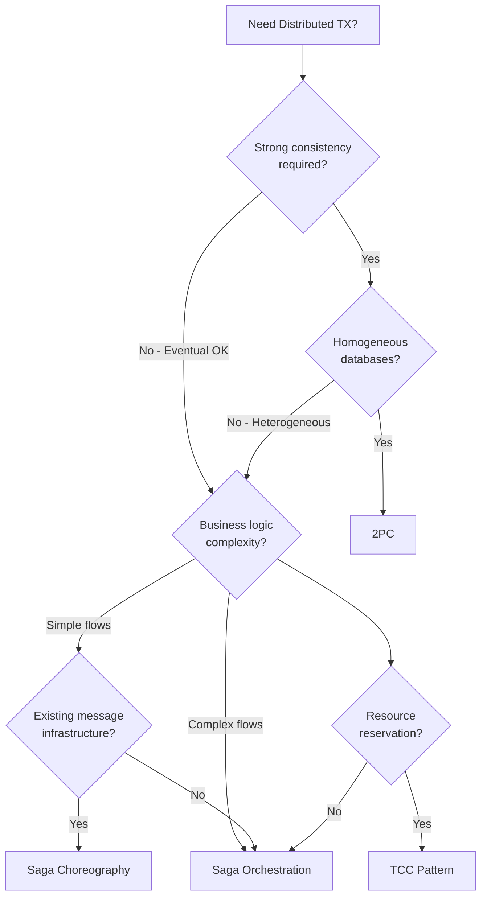
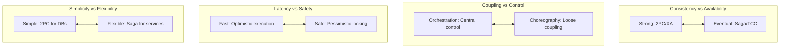
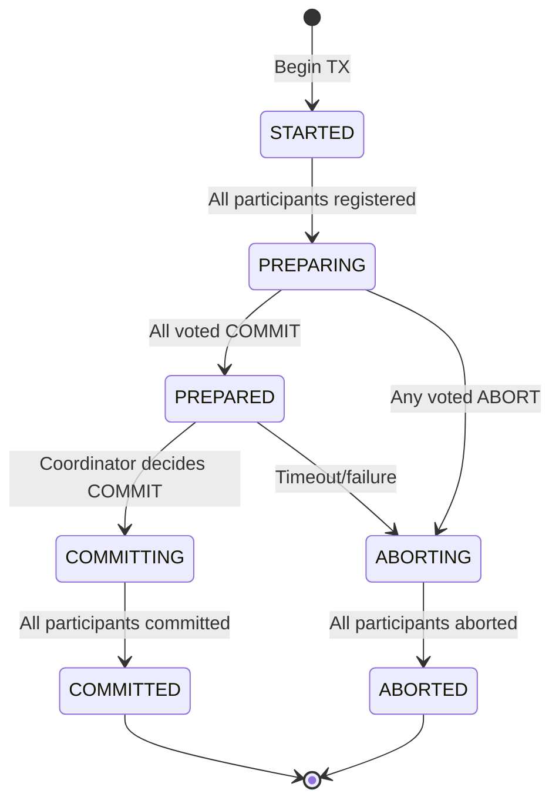
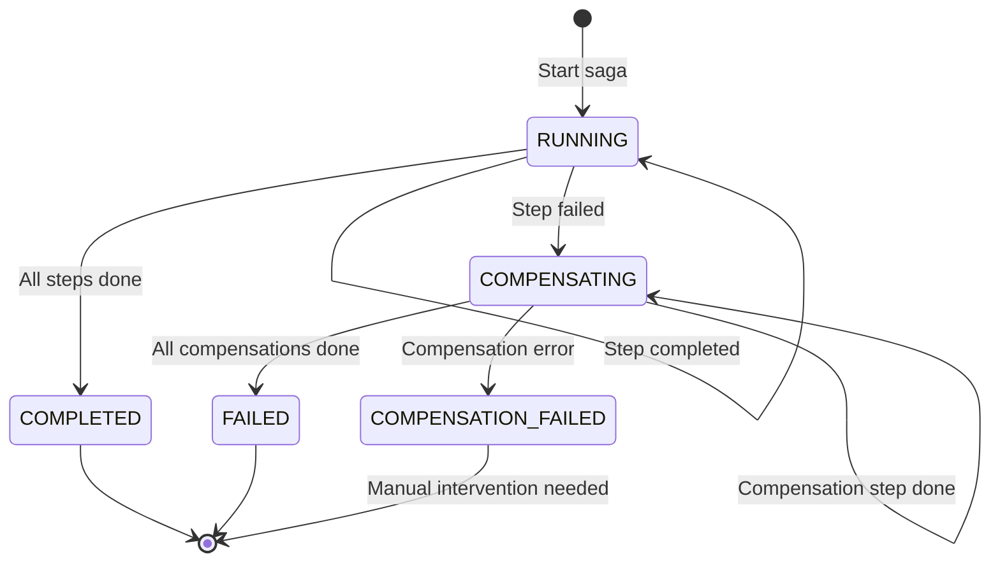

# Distributed Transaction Coordinator

## System Design Document

| Attribute | Value |
|-----------|-------|
| **Complexity** | High |
| **Category** | Core Infrastructure |
| **Prerequisites** | Message Queue (1.6), Distributed Lock (1.8), Service Discovery (1.10), Event Sourcing concepts |
| **Related Topics** | Message Queue (1.6), Lock Manager (1.8), Configuration Management (1.11) |

---

## Quick Navigation

| Document | Description |
|----------|-------------|
| [01 - Requirements & Estimations](./01-requirements-and-estimations.md) | Functional/non-functional requirements, capacity planning |
| [02 - High-Level Design](./02-high-level-design.md) | Architecture diagrams, 2PC/3PC/Saga/TCC patterns |
| [03 - Low-Level Design](./03-low-level-design.md) | Data models, APIs, coordinator algorithms |
| [04 - Deep Dive & Bottlenecks](./04-deep-dive-and-bottlenecks.md) | Failure scenarios, coordinator recovery, compensation |
| [05 - Scalability & Reliability](./05-scalability-and-reliability.md) | Horizontal scaling, fault tolerance, disaster recovery |
| [06 - Security & Compliance](./06-security-and-compliance.md) | mTLS, authorization, audit trails, compliance |
| [07 - Observability](./07-observability.md) | Metrics, logging, distributed tracing, alerting |
| [08 - Interview Guide](./08-interview-guide.md) | 45-min pacing, trap questions, quick reference |

---

## System Overview

A **Distributed Transaction Coordinator** manages transactions that span multiple services, databases, or partitions in a distributed system. Unlike single-database ACID transactions, distributed transactions must coordinate commit/rollback decisions across independent systems with no shared memory, handling network failures, service crashes, and partial completions.



---

## What Makes Distributed Transactions Hard

| Aspect | Single DB Transaction | Distributed Transaction |
|--------|----------------------|------------------------|
| **Atomicity** | Built-in (undo log) | Requires explicit coordination |
| **Isolation** | Lock-based or MVCC | Cross-service ordering challenges |
| **Durability** | WAL + fsync | Replicated logs + consensus |
| **Failure Mode** | Single point of failure | Partial failures, network partitions |
| **Latency** | Sub-millisecond | Network RTT × participant count |
| **CAP Trade-off** | N/A (single node) | Fundamental design choice |

---

## Pattern Comparison

| Pattern | Consistency | Availability | Latency | Complexity | Use Case |
|---------|-------------|--------------|---------|------------|----------|
| **Two-Phase Commit (2PC)** | Strong | Low (blocking) | Low | Medium | Homogeneous databases |
| **Three-Phase Commit (3PC)** | Strong | Higher (non-blocking) | Medium | High | Theoretical, rarely used |
| **Saga (Orchestration)** | Eventual | High | Variable | Medium | Long-running business transactions |
| **Saga (Choreography)** | Eventual | High | Variable | Low (no coordinator) | Loosely coupled services |
| **TCC (Try-Confirm-Cancel)** | Eventual | High | Low | High | Resource reservation scenarios |

---

## Pattern Decision Matrix



---

## Pattern Deep Dive

### Two-Phase Commit (2PC)

The classic atomic commit protocol. Coordinator asks all participants to prepare, then commits or aborts based on unanimous votes.

```
┌─────────────────────────────────────────────────────────────────────┐
│ TWO-PHASE COMMIT PROTOCOL                                            │
├─────────────────────────────────────────────────────────────────────┤
│                                                                      │
│  Phase 1: Prepare (Voting)                                          │
│  ─────────────────────────                                          │
│  Coordinator → All Participants: "PREPARE"                          │
│  Participants: Acquire locks, write to log, reply VOTE_COMMIT       │
│                or VOTE_ABORT                                        │
│                                                                      │
│  Phase 2: Commit/Abort (Decision)                                   │
│  ────────────────────────────────                                   │
│  If ALL voted COMMIT:                                               │
│    Coordinator → All: "COMMIT"                                      │
│  Else:                                                              │
│    Coordinator → All: "ABORT"                                       │
│                                                                      │
│  Problem: If coordinator fails after Phase 1, participants BLOCK    │
│                                                                      │
└─────────────────────────────────────────────────────────────────────┘
```

**Pros:** Strong consistency, simple conceptually
**Cons:** Blocking on coordinator failure, high lock contention, not partition-tolerant

### Three-Phase Commit (3PC)

Adds a PRE-COMMIT phase to make the protocol non-blocking (in theory).

```
┌─────────────────────────────────────────────────────────────────────┐
│ THREE-PHASE COMMIT PROTOCOL                                          │
├─────────────────────────────────────────────────────────────────────┤
│                                                                      │
│  Phase 1: CAN-COMMIT (Voting)                                       │
│  Coordinator → All: "CAN_COMMIT?"                                   │
│  Participants → Coordinator: YES/NO                                 │
│                                                                      │
│  Phase 2: PRE-COMMIT (Prepare)                                      │
│  If all YES: Coordinator → All: "PRE_COMMIT"                        │
│  Participants acquire locks, acknowledge                            │
│                                                                      │
│  Phase 3: DO-COMMIT (Commit)                                        │
│  Coordinator → All: "DO_COMMIT"                                     │
│  Participants commit and release locks                              │
│                                                                      │
│  Benefit: Participants can decide (abort) after timeout             │
│  Reality: Network partitions can still cause inconsistency          │
│                                                                      │
└─────────────────────────────────────────────────────────────────────┘
```

**Pros:** Non-blocking recovery
**Cons:** Higher latency (3 RTTs), still vulnerable to network partitions, rarely implemented

### Saga Pattern

Decomposes a long-running transaction into a sequence of local transactions with compensating actions.

```
┌─────────────────────────────────────────────────────────────────────┐
│ SAGA PATTERN                                                         │
├─────────────────────────────────────────────────────────────────────┤
│                                                                      │
│  Forward Flow (T1 → T2 → T3):                                       │
│  ─────────────────────────────                                      │
│  T1: Reserve Inventory    → Success                                 │
│  T2: Process Payment      → Success                                 │
│  T3: Schedule Shipping    → FAILURE                                 │
│                                                                      │
│  Compensation (C2 ← C1):                                            │
│  ────────────────────────                                           │
│  C2: Refund Payment       ← Triggered                               │
│  C1: Release Inventory    ← Triggered                               │
│                                                                      │
│  Key Properties:                                                     │
│  • Each step is a local ACID transaction                            │
│  • Compensations must be idempotent                                 │
│  • Eventual consistency (intermediate states visible)               │
│                                                                      │
└─────────────────────────────────────────────────────────────────────┘
```

#### Orchestration vs Choreography

| Aspect | Orchestration | Choreography |
|--------|---------------|--------------|
| **Control** | Central coordinator | Distributed (event-driven) |
| **Coupling** | Services coupled to orchestrator | Services coupled to events |
| **Visibility** | Easy to track saga state | Harder to trace flow |
| **Failure Handling** | Centralized logic | Distributed in each service |
| **Testing** | Easier (single point) | Harder (emergent behavior) |
| **Scaling** | Orchestrator can bottleneck | Natural distribution |
| **Examples** | Temporal, Netflix Conductor | Kafka + event handlers |

### TCC (Try-Confirm-Cancel)

A reservation-based pattern where resources are tentatively reserved (Try), then either confirmed or cancelled.

```
┌─────────────────────────────────────────────────────────────────────┐
│ TCC PATTERN                                                          │
├─────────────────────────────────────────────────────────────────────┤
│                                                                      │
│  Try Phase:                                                          │
│  ──────────                                                         │
│  • Reserve inventory (mark as "pending")                            │
│  • Put payment hold (authorize, don't capture)                      │
│  • Reserve shipping slot                                            │
│  All resources in "tentative" state                                 │
│                                                                      │
│  Confirm Phase (on success):                                        │
│  ──────────────────────────                                         │
│  • Deduct inventory (pending → committed)                           │
│  • Capture payment (hold → charged)                                 │
│  • Confirm shipping                                                 │
│                                                                      │
│  Cancel Phase (on failure/timeout):                                 │
│  ───────────────────────────────────                                │
│  • Release inventory (pending → available)                          │
│  • Void payment hold                                                │
│  • Cancel shipping reservation                                      │
│                                                                      │
│  Key: Resources must support "pending" state                        │
│                                                                      │
└─────────────────────────────────────────────────────────────────────┘
```

**Pros:** Strong isolation during Try phase, clean rollback
**Cons:** Requires services to support pending state, business logic complexity

---

## Real-World Implementations

| System | Pattern | Key Features | Use Case |
|--------|---------|--------------|----------|
| **Apache Seata** | AT, TCC, Saga, XA | Multi-mode, automatic rollback | Enterprise Java apps |
| **Temporal.io** | Orchestration (Saga) | Durable execution, replays | General workflow orchestration |
| **Netflix Conductor** | Orchestration | JSON workflow definitions | Microservices workflows |
| **Uber Cadence** | Orchestration | Code-as-workflow | Long-running processes |
| **Axon Framework** | Saga + Event Sourcing | Event-driven, CQRS | Domain-driven design |
| **MassTransit** | Saga (State Machine) | .NET integration | .NET microservices |
| **Eventuate Tram** | Choreography + Outbox | Transactional outbox | Event-driven sagas |

---

## Key Trade-offs



### Trade-off Analysis

| Trade-off | Option A | Option B | Decision Factors |
|-----------|----------|----------|------------------|
| **2PC vs Saga** | 2PC: Strong consistency | Saga: High availability | Latency tolerance, failure frequency |
| **Orchestration vs Choreography** | Orchestration: Central visibility | Choreography: Loose coupling | Team structure, debugging needs |
| **Sync vs Async** | Sync: Simpler reasoning | Async: Higher throughput | Latency requirements, scale |
| **Compensation vs Rollback** | Native rollback: DB-level | Compensation: App-level | System homogeneity |
| **Idempotency** | Enforce always | Best-effort | Exactly-once requirements |

---

## Core Concepts

### Transaction States



### Saga States (Orchestration)



### Idempotency Keys

```
┌─────────────────────────────────────────────────────────────────────┐
│ IDEMPOTENCY IMPLEMENTATION                                           │
├─────────────────────────────────────────────────────────────────────┤
│                                                                      │
│  Request:                                                            │
│    Idempotency-Key: "order-12345-payment-attempt-1"                 │
│    Operation: ChargePayment($100)                                   │
│                                                                      │
│  First Attempt:                                                      │
│    1. Check idempotency store: NOT FOUND                            │
│    2. Execute operation                                             │
│    3. Store result: { key: "...", result: SUCCESS, amount: $100 }   │
│    4. Return SUCCESS                                                │
│                                                                      │
│  Retry (same key):                                                  │
│    1. Check idempotency store: FOUND                                │
│    2. Return stored result: SUCCESS                                 │
│    3. Do NOT re-execute                                             │
│                                                                      │
│  Key Components:                                                     │
│  • Unique key per logical operation                                 │
│  • TTL for cleanup (e.g., 24 hours)                                 │
│  • Atomic check-and-set                                             │
│                                                                      │
└─────────────────────────────────────────────────────────────────────┘
```

---

## When to Use Distributed Transactions

| Scenario | Recommended Pattern |
|----------|---------------------|
| **Homogeneous databases** | 2PC/XA |
| **Microservices with eventual consistency OK** | Saga |
| **Resource reservation (inventory, seats)** | TCC |
| **Long-running business processes** | Saga (Orchestration) |
| **Loosely coupled event-driven systems** | Saga (Choreography) |
| **Strong consistency across services** | Avoid if possible; consider redesign |

---

## When NOT to Use Distributed Transactions

| Scenario | Alternative |
|----------|-------------|
| **Single database** | Local ACID transactions |
| **Read-only operations** | No transaction needed |
| **Append-only event log** | Event sourcing with projections |
| **Non-critical eventual consistency** | Async messaging, reconciliation jobs |
| **High-throughput, low-latency** | Optimistic concurrency, CRDTs |

---

## Complexity Rating Breakdown

| Area | Complexity | Reason |
|------|------------|--------|
| **2PC Implementation** | Medium | Standard protocol, well-documented |
| **Saga Orchestration** | Medium | State machine, compensation logic |
| **Saga Choreography** | High | Distributed state, debugging hard |
| **TCC Implementation** | High | Pending state in all services |
| **Coordinator Recovery** | High | Log replay, participant recovery |
| **Idempotency** | Medium | Key generation, storage |
| **Exactly-Once Semantics** | Very High | Requires transactional outbox + dedup |

---

## Document Reading Order

### For Interview Prep (Time-Limited)
1. This index (overview)
2. [02 - High-Level Design](./02-high-level-design.md) (architecture diagrams)
3. [08 - Interview Guide](./08-interview-guide.md) (pacing, trade-offs)

### For Deep Understanding
1. All documents in order (00 → 08)
2. Focus on [04 - Deep Dive](./04-deep-dive-and-bottlenecks.md) for failure scenarios
3. Study [03 - Low-Level Design](./03-low-level-design.md) for algorithms

### For Production Design
1. [01 - Requirements](./01-requirements-and-estimations.md) (capacity planning)
2. [05 - Scalability](./05-scalability-and-reliability.md) (production concerns)
3. [06 - Security](./06-security-and-compliance.md) (compliance)
4. [07 - Observability](./07-observability.md) (monitoring)

---

## Related System Designs

| Design | Relationship |
|--------|--------------|
| [1.6 Distributed Message Queue](../1.6-distributed-message-queue/00-index.md) | Message delivery for saga choreography |
| [1.8 Distributed Lock Manager](../1.8-distributed-lock-manager/00-index.md) | Locking for 2PC, coordinator election |
| [1.10 Service Discovery](../1.10-service-discovery-system/00-index.md) | Locating participants |
| [1.11 Configuration Management](../1.11-configuration-management-system/00-index.md) | Timeout configs, feature flags |

---

## Further Reading

- Martin Fowler: Patterns of Distributed Systems (Two-Phase Commit)
- Microservices.io: Saga Pattern
- Microsoft Azure: Saga Design Pattern, Compensating Transaction Pattern
- Temporal.io: Workflow-as-Code for Reliable Systems
- Apache Seata: Distributed Transaction Solution
- Netflix Tech Blog: Netflix Conductor Architecture
- Chris Richardson: Microservices Patterns (Manning)
